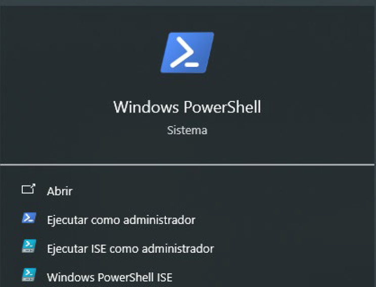
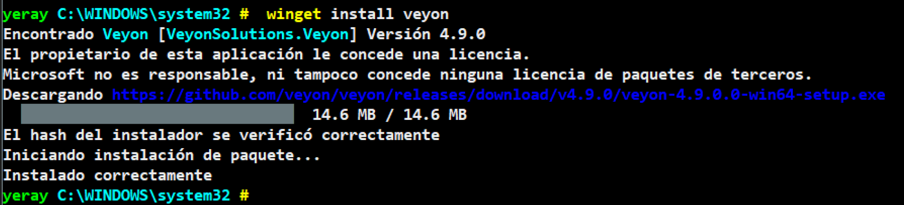
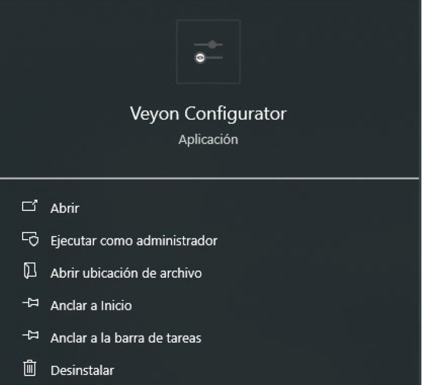
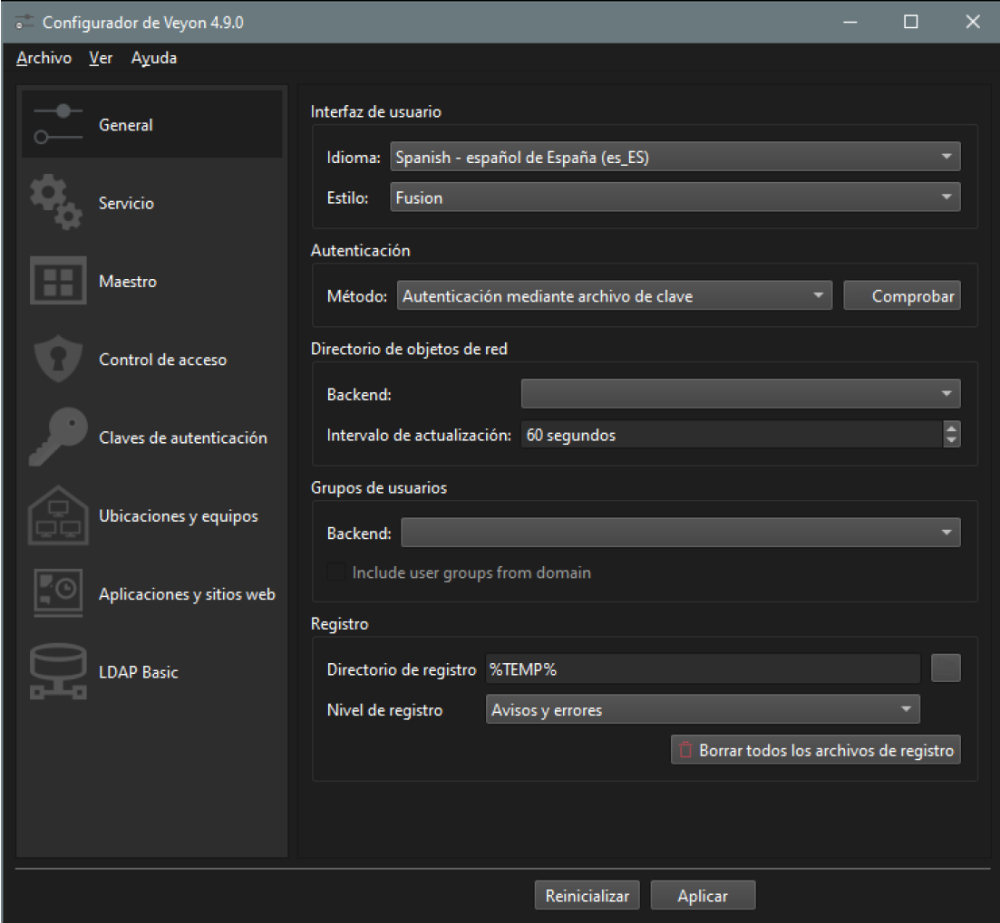
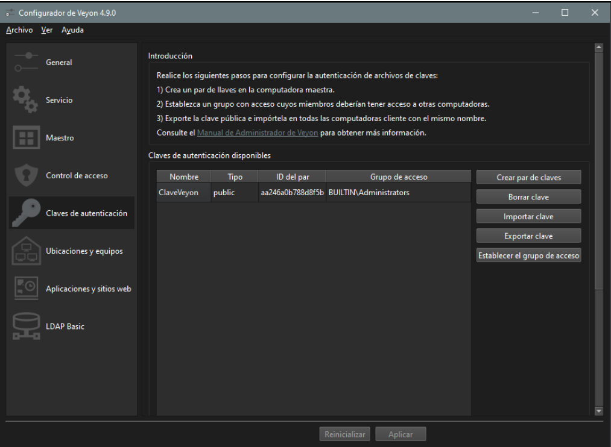
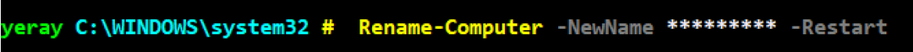
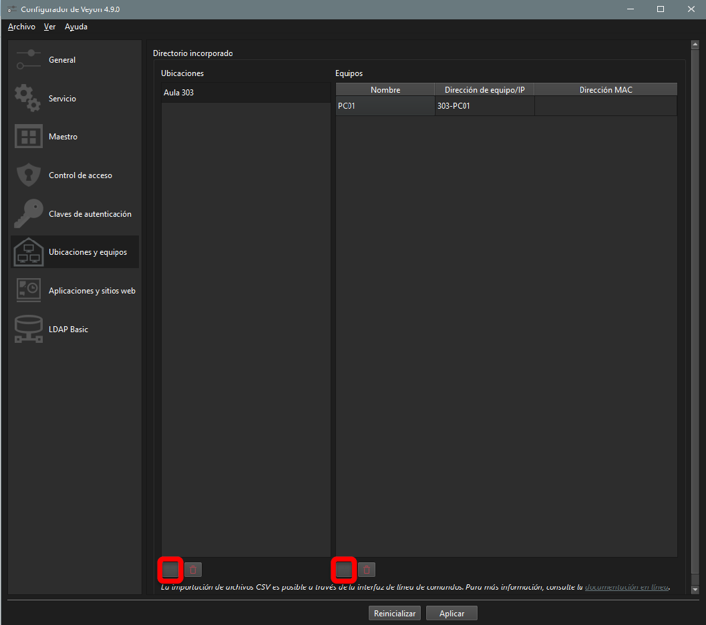

# 💠 Manual del Veyon

## Instalación de Veyon
Veyon es una herramienta de software libre que permite la supervisión y el control de estaciones de trabajo en redes locales, ideal para entornos educativos. A continuación, te guiaré para instalar Veyon utilizando el gestor de paquetes **winget** en Windows.
>Podemos hacerlo más rápido desde terminal abrimos el PowerShell en modo administrador y usamos el gestor de paquetes winget. Si no tienes winget instalado, sigue las [Instrucciones de Microsoft](https://learn.microsoft.com/es-es/windows/package-manager/winget/) o asegúrate de tener una versión de Windows 10/11 actualizada. A continuación, instalamos Veyon con el comando que se muestra en la captura

{ width="400" }

**¿Qué hacer si winget no instala Veyon?** En algunos casos, la instalación a través de winget puede no funcionar debido a que no encuentra la última versión disponible o el paquete no está actualizado. Si esto ocurre tendrás que descargarlo desde la [web oficial](https://veyon.io/en/). Descarga la última versión estable del instalador manualmente para Windows. Sigue las instrucciones de instalación que aparecen durante el proceso de configuración para completar la instalación de manera manual.

## Configuración alumnado
Para la confivuración del Veyon se debe buscar la aplicación Veyon Configurator y seguir los siguientes pasos:
{ width="400" }

### 1. Pestaña General
Cambiar el idioma de la interfaz de usuario a español y en la sección de Autentificación ponemos como método “**Autentificación mediante archivo de clave**” por último solo nos queda aplicar al final de la ventana y aceptar el reinicio para que se apliquen los cambios.

### 2. Claves de autentificación
1. [Descargar clave pública Veyon](./ClaveVeyon_public_key.pem), hay que descargarla en documentos si la pones en el escritorio suele dar problemas al autentificarse.
2. Agregar la clave en la sección de claves de autentificación, no cambiar el nombre, seguir con los valores por defecto

### 3. Cambiar nombre al equipo
Podemos hacerlo más rápido desde terminal abrimos el PowerShell en modo administrador y usamos el siguiente comando **`Rename-Computer - NewName *** -Restart`** Hay que cambiar los asteriscos por el nuevo nombre del equipo la sintaxis Aula-PC00, ejemplo 301-PC01, R03-PC01… una vez sejecutado el comando reiniciara el equipo con el nuevo nombre.

## Configuración profesorado
Seguimos los mismos pasos que el alumnado, pero en vez de añadir la clave pública, añadimos solo la **clave privada** que se encuentra en el drive del profesorado

### 1. Ubicaciones y equipos
En la configuración del Veyon en la pestaña de Ubicaciones y equipos tenemos que:

1. Crear ubicaciones que son grupos, como por ejemplo el aula con todos los equipos, o las siglas del grupo ASIR, DAW...
2. En cada grupo añadiremos los equipos del aula:
      - **Nombre**: Nombre que se le da al equipo para identificarlo, cuando se hacen grupos por curso se puede poner directamente el nombre del alumnado.  
      - **Dirección de equipo o IP** : Identifica al equipo en la red, (las IP cambian no es recomendable), es el nombre del dispositivo en el sistema, habra que mirar la información del equipo.
      - **Dirección MAC** : Mac del equipo, si tienes las dos columnas anteriores rellenas no es necesario.
  
Para este paso recomiendo abrir el **veyon configurator** y que el alumnado vaya pasando y agregando su nombre y el nombre del equipo.

Los portatiles han de hacer lo mismo agregar su nombre de dispositivo y tener en cuenta que han de estar en la misma red. 
    
No se obliga en ningún momento a instalarlo en los equipos personales, para todo ello están los equipos de clase en caso de querer hacer el examen en sus propios equipos se ha de instalar este aplicativo
