# **💠 VIRTUAL BOX**

Durante el curso se van a trabajar con diferentes máquinas virtuales estas deben tener las configuraciones básicas solicitadas y realizar una ova de las mismas despues de configurarlas, para cada supuesto se harán clonaciones y se trabajará sobre estas. 

    Los sistemas operativos principales son:
      px92 - Proxmox 9.2
      ud26 - Ubuntu Desktop 26.04 LTS 
      us26 - Ubuntu Server  26.04 LTS
      wd11 - Windows Clente 11
      ws25 - Windows Server 2025

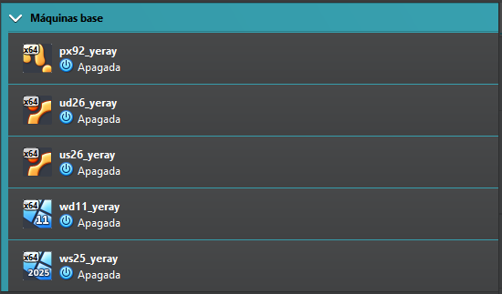

## 💻 Configuraciones
Las configuraciones de las máquinas dependen de los recursos que tenga el equipo real, pero para un correcto funcionamiento y evitar problema se solicitan los siguientes requisitos **mínimos**:

1. Sistemas de 64-bit y sistema EFI activado en todos
2. 4GB = 4096MB de memoria RAM y 4 procesadores
3. 100GB de disco duro
4. Habilitar en General → Avanzado el portapapeles y el arrastrar y soltar.
5. Descargar las **imágenes iso**, de los diferentes sistemas operativos, las agregamos a la unidad óptica e iniciamos la máquina virtual siguiendo el asistente de instalación. En este apartado es importante poner como nombre de usuario el nombre de alumnado, y como nombre de equipo la clave del sistema operatico y el nombre del alumnado.

> NOTA: Las máquinas en los equipos de clase se han de guardar en la unidad D, cada cierto tiempo se hace limpieza de la unidad C y podrían ser eliminadas.

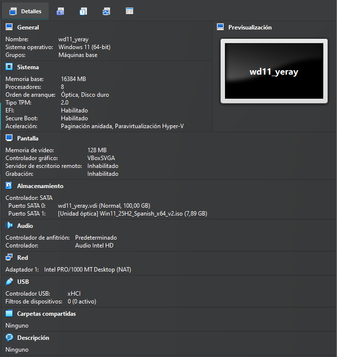{ width="400" }
 
|  |  |
|---|---|
|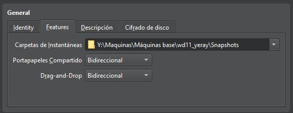 | 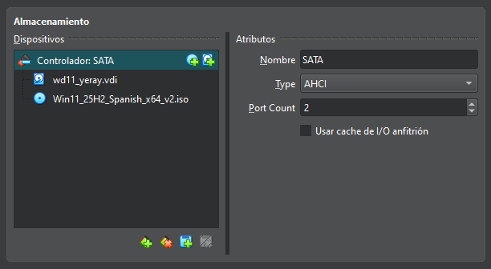|

## 💿WINDOWS
Las configuraciones básicas se basan en hacer los siguientes pasos en todas las máquinas, como ejemplo se van a realizar para `Windows 11 PRO`:

### 1. Actualizar sistemas
Para actualizar el sistema iremos a la pestaña de configuración y en la sección de Windows Update buscaremos y actualizaremos el sistema hasta la última versión disponible. 

Una vez actualizado comprobaremos que nuestra versión, obtenida con las teclas ``win + R`` y escribiendo ``winver`` en la pestaña de ejecutar, coincide con la última del historial de versiones de nuestro sistemas el cual lo obtendremos de la información de la [web oficial](https://learn.microsoft.com/es-es/windows/release-health/){target="_blank"}

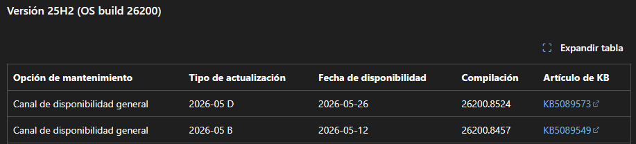

|  |  |
|---|---|
|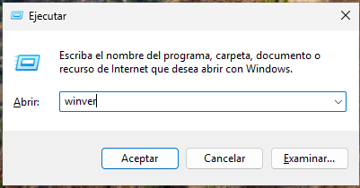 |  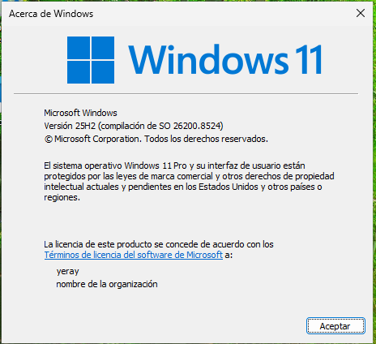|

### 2. Actualizar Guest Additions
Para la instalación de las Guestt Additions en todos los sistemas el primer paso es insertar imagen de CD de los complementos del invitado. Para ello vamos a la unidad de CD desde el sistema operativo y ejecutamos el programa y seguimos los pasos del asistente de instalación:

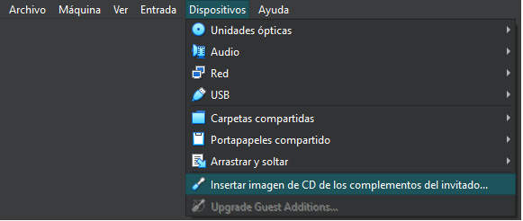{ width="400" }

|  |  |  |
|---|---|---|
|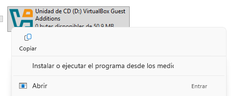 | 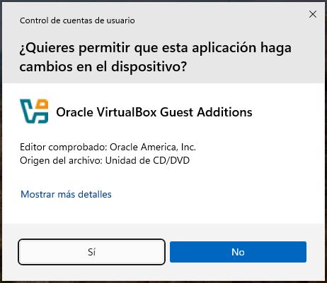| 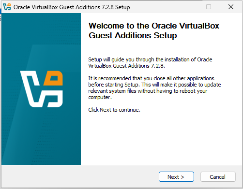|
|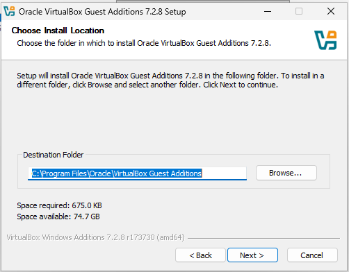 | 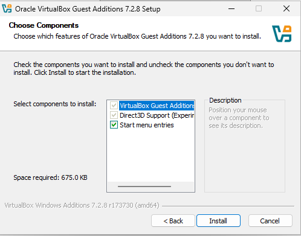| 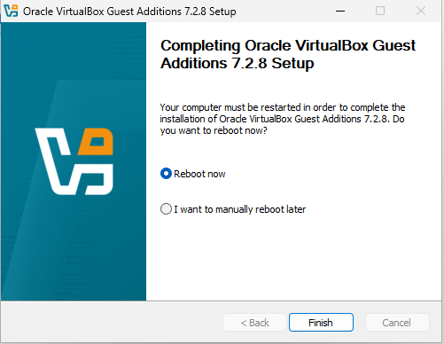|

### 3. Prompt en color
Para cambiar el color del **prompt** en PowerShell tenemos que:

1. Iniciar Powershell como administrador y cambiar las políticas de ejecución que nos permita ejecutar el script que vamos a crear   `Set-ExecutionPolicy Unrestricted` 
2. Crear un **Script**, es un archivo con el nombre "**Microsoft.PowerShell_profile.ps1**" para lo cual usaremos el ``PowerShell ISE``, este archivo tendrá el código de la imagen 2 y se guardará en el directorio `C:\Users\user1\Documents\WindowsPowerShell`, al reiniciar PowerShell ya estaría el color cambiado.

>IMPORTANTE: Hay que respetar el nombre del archivo, la ruta y el código, cualquier carácter incorrecto podría significar el no funcionamiento del mismo. Recordar que user1 es el nombre de vuestro usuario en el sistema

|  |  |  |
|---|---|---|
|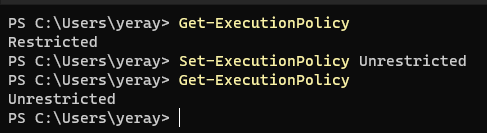 | 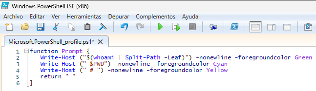| 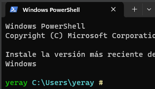|

###  4. Alias y atajos
Para la creación del atajo de teclas iremos a la ruta del ejecutable de PowerShell en mi caso es `C:\Users\yeray\AppData\Roaming\Microsoft\Windows\StartMenu\Programs\Windows PowerShell`. A continuación, botón secundario **propiedades**, pestaña **Acceso directo** y tecla de método abreviado y pulsamos las teclas que queremos que pasen hacer los atajos para abrir dicho programa. En este caso se ha configurado para que el programa se ejecute como administrador ya que será el que frecuentemente usemos.

|  |  |  |
|---|---|---|
| | 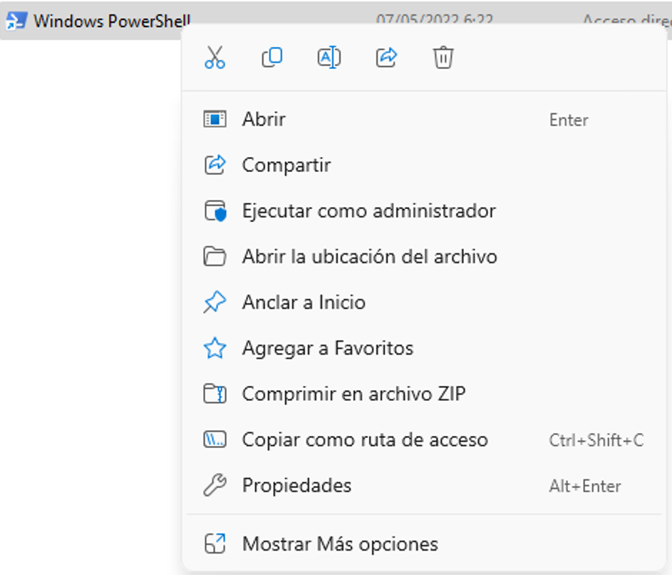|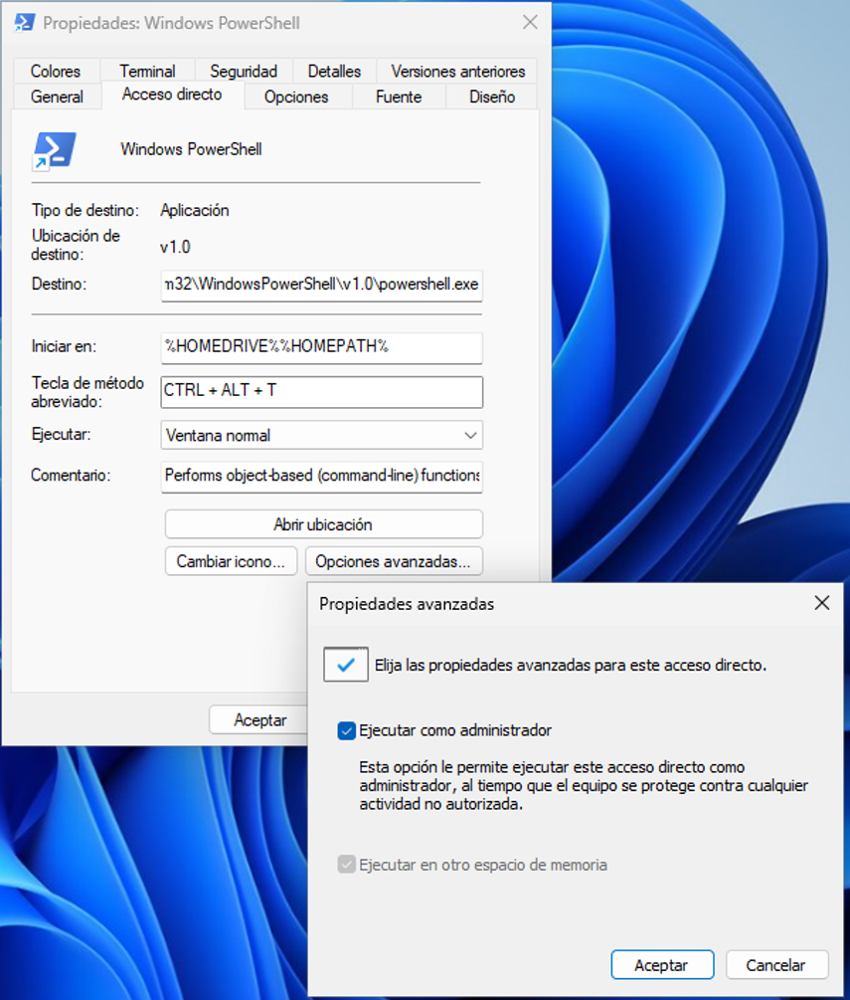 |

## 📀LINUX
Los siguientes pasos de configuraciones básicas se han de hacer en todas las máquinas base de Linux en este caso se muestra un ejemplo en Ubuntu server que al no tener interfaz gráfica puede presenta mayores dificultades.

### 1. Actualizar sistemas
Para actualizar debemos de ejecutar el siguiente comando en modo superusuario: `sudo apt update && apt upgrade -y && apt autoremove` a veces la propia terminal nos solicitara algunos comandos más en sus mensajes, deberemos realizarlo hasta que al final de la captura se muestran **cuatro 0** que indican que no faltan paquetes por actualizar ni instalar.

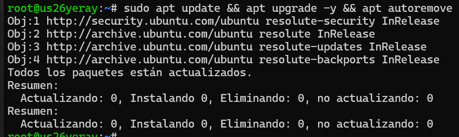

### 2. Actualizar Guest Additions
Para la instalación de las Guestt Additions en todos los sistemas el primer paso es insertar imagen de CD de las Guest Additions. A continuación, creamos una carpeta (guest) montamos los directorios del CD y comprobamos su contenido, en él nos encontramos varios programas ejecutables usamos el comando sh para ejecutar las Guestt Additions de Linux y se instalen. A veces nos muestra un error porque necesitamos el paquete bzip2 para poder descomprimir el contenido de las Guest Additions, lo instalamos con `apt install bzip2` y después ejecutamos el script.

|  |  |
|---|---|
|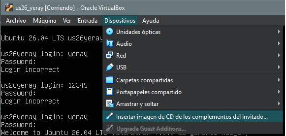 |  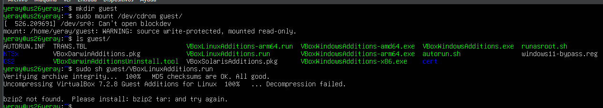|

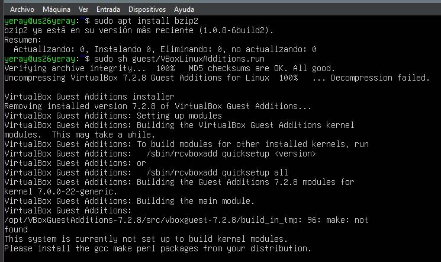

### 3. Color del prompt/directorios
Para cambiar el color del **prompt** debemos de seguir los siguientes pasos por **cada usuario** del sistema (por defecto hay 2), en este manual se hará solo para el usuario administrador (**root**):

1. Iniciamos sesión en el usuario y vamos a su directorio personal con el comando `cd ~`, a continuación, modificamos el archivo oculto .bashrc con el siguiente comando: `nano .bashrc`
2. Debemos hacer dos cambios:
      1. Eliminar el comentario, es decir eliminar el **#** que aparece delante de la línea **force_color_prompt=yes**
      2. Cambiar el valor de la variable PS1 que tendrá que cambiarse por lo siguiente: `PS1='${debian_chroot:+($debian_chroot)}\[\033[01;32m\]\u@\h\[\033[00m\]:\[\033[01;36m\]\w\[\033[00m\]\$ '` (El 36 es el cambio)
3. Comprobamos reiniciando sesión en los usuario y mostrando que sale el prompt en los colores configurados.

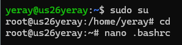

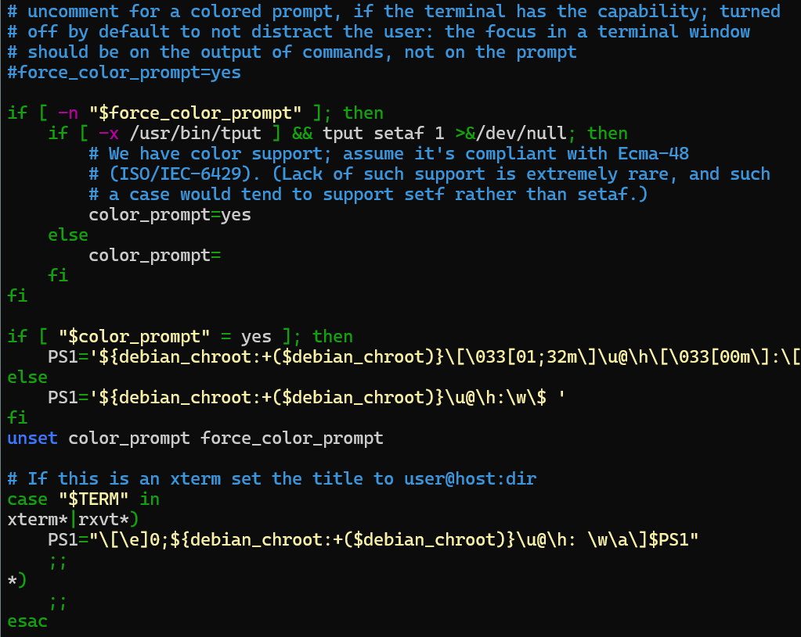{ width="500" }

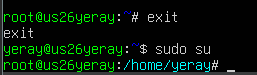

---------
Para cambiar el color de los **directorios** modificamos la variable ``$LS_COLORS`` (archivo que contiene los colores predeterminados que vienen preconfigurados en el sistema), la modificación consistira en cambiar el código de los directorios ya que el azul como se muestra en la captura es un color con dificultades de legibilidad en fondo negro. Pasos:

1. Crear el archivo oculto ``dircolors -p > .dircolors`` formateado.
2. Editar archivo con el nano y buscar donde esta el color de los directorios (variable **dir**) y cambiar de **34(azul)** a **32(Verde)** como se muestra en la captura.
3. Reiniciamos la sesión del usuario y comprobamos los cambios.

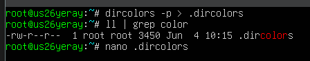

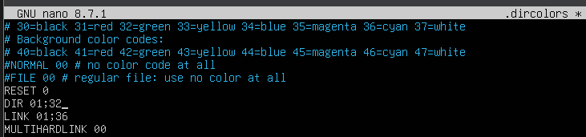{ width="500" }

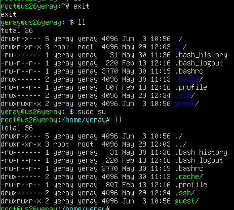

### 4. Alias y atajos
En este paso crearemos un alias que nos va a facilitar el trabajo durante el resto del curso y será el alias de **act**, para ello en el archivo **.bashrc**, debemos añadir una línea por cada alias. Una vez abierto con `nano .bashrc` podemos editar, buscamos la sección de los alias y añadimos los alias que necesitemos.

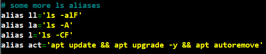

## ☢️ Preguntas frecuentes (FAQ)

### - Usuario en Windows 11
En la configuración de Windows 11 nos solicita un correo electrónico para generar una cuenta de microsoft, para saltarnos este paso y crear una cuenta local debemos de mostrar la consola con ``SHIFT + F10`` justo en el momento que nos pida el correo.

Una vez en la consola escribir el comando ``start ms-cxh:localonly`` y se nos mostrara el asistente para la creación del usuario local.

| | |
|---|---|
|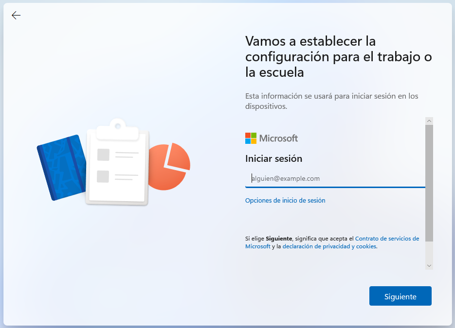 | 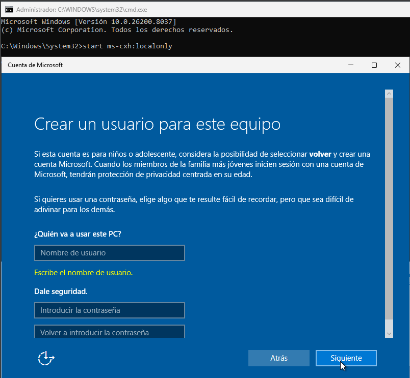|

### - Pantallazo negro en Ubuntu

1. En primer lugar, mirar la comprobación hardware de la máquina y comprobar que el **Tipo de chipset: ICH9**
2. En caso de que siga sin funcionar pasamos al método número dos que consiste en seguir las instrucciones del siguiente [video](https://youtu.be/LKIJFn6cqVE){target="_blank"}
   
### - Tortuga
Hay un pequeño icono de una tortuga verde que aparece en la barra de estado de la máquina virtual (abajo a la derecha, justo al lado de los iconos de disco duro, red, etc.).

Significa que VirtualBox no está usando la aceleración por hardware de tu procesador (VT-x en Intel o AMD-V en AMD).

Si las máquinas van muy lentas deberemos de comprobar si tenemos un error de la tortuga y solucionarlo a través del siguiente [video](https://youtu.be/6FUJJN4K-2o){target="_blank"}