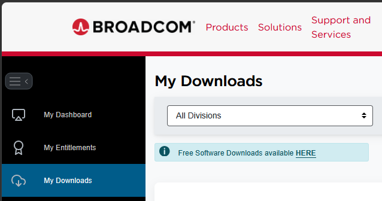
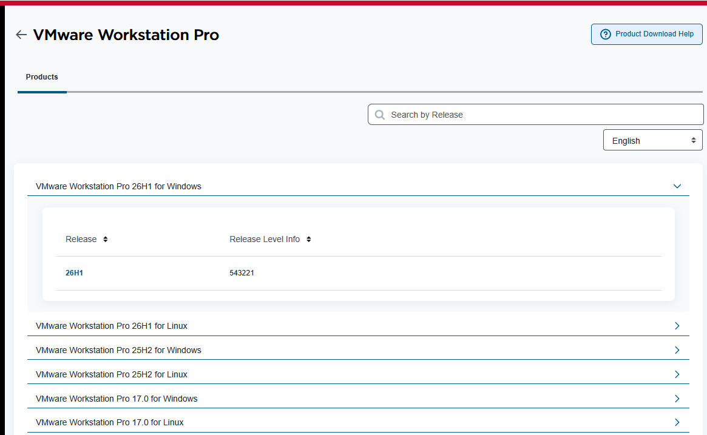
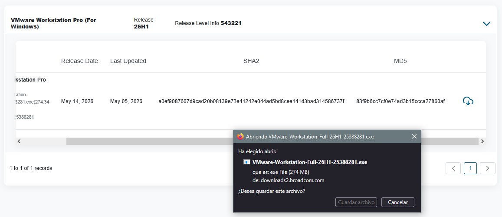
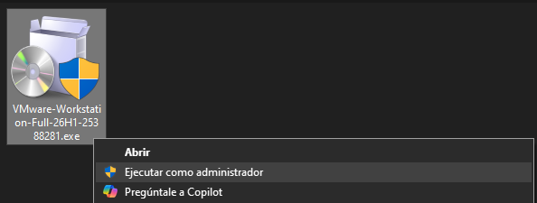
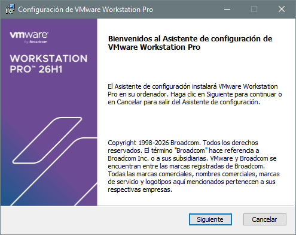
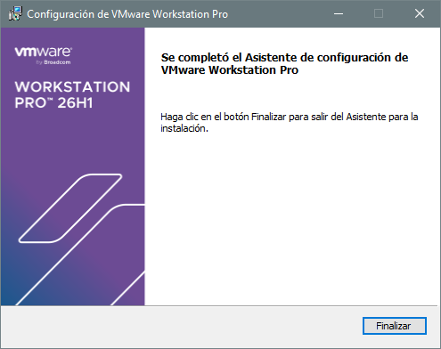
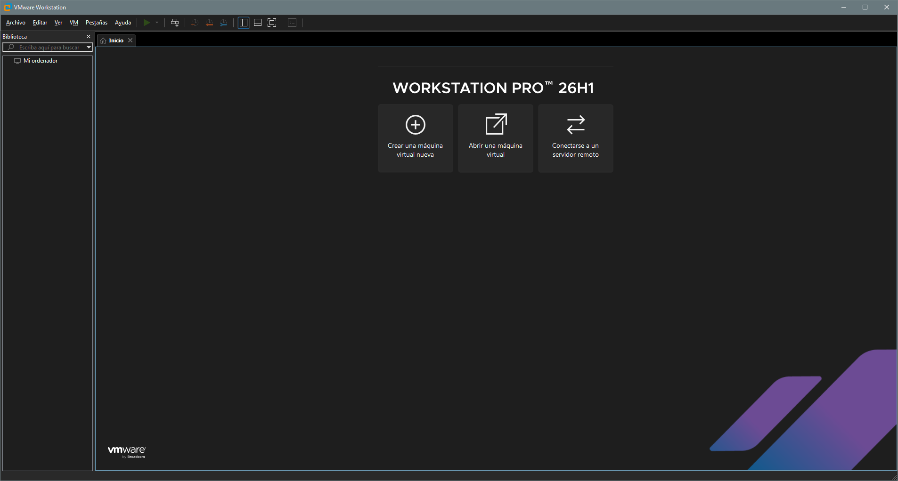

# 🖥️ VMware Workstation Pro

## 1. VMware
Software de **virtualización** que permite ejecutar uno o varios sistemas operativos (*máquinas virtuales*) dentro de tu sistema operativo principal, sin necesidad de particionar el disco ni reiniciar el equipo. 

**¿Para qué se usa en el aula?**

- Practicar instalación y administración de sistemas operativos
- Probar configuraciones de red sin afectar al equipo real
- Realizar laboratorios de servidores (SSH, Apache, DNS, etc.)
- Aprender Linux sin riesgos
- Crear entornos de prueba aislados

## 2. Licencias

| Licencia | Precio | Uso | Snapshots | Red Virtual | Soporte | Descarga |
|---|---|---|---|---|---|---|
| Workstation Pro Personal ⭐ | Gratuito | Personal y educativo | ✅ | ✅ | ❌ | [Descargar](https://www.vmware.com/products/desktop-hypervisor/workstation-and-fusion){target="_blank"} |
| Workstation Pro Comercial | Suscripción anual | Empresarial y profesional | ✅ | ✅ | ✅ | [Descargar](https://www.vmware.com/products/desktop-hypervisor/workstation-and-fusion){target="_blank"} |
| Academic Program | Según convenio | Centros educativos | ✅ | ✅ | ✅ | — |
| Workstation Player | ~~Gratuito~~ | ~~Simplificado~~ | ❌ | ❌ | ❌ | ~~Descontinuado~~ |

## 3. Instalación 

**DESCARGAR**

1. Ve a [Fusion and Workstation](https://www.vmware.com/products/desktop-hypervisor/workstation-and-fusion){target="_blank"} y haz clic en **DOWNLOAD NOW**
2. Inicia sesión o crea una cuenta gratuita de [Broadcom](https://profile.broadcom.com/web/registration){target="_blank}. 
3. Descargar el archivo `.exe`. Para ello una vez iniciada sesión, en el menu seleccionamos `My Downloads` y despues en `Free Software Downloads available HERE` y buscamos `VMware Workstation Pro`, seleccionamos la última versión leemos y aceptamos los terminos y condiciones y descargamos el software.

|  |  |  |
|---|---|---|
| | | |

**INSTALACIÓN**

Haz doble clic en el archivo descargado (ej. `VMware-Workstation-Full-XX.X.X-XXXXXX.exe`), sigue los pasos del asistente y elige las carpetas po defecto. 

|  |  |  |
|---|---|---|
| | | |

Una vez finalice abre el programa.

 


### Interfaz

| Elemento | Función |
|---|---|
| **Panel izquierdo** | Lista de todas tus máquinas virtuales |
| **Barra de herramientas** | Botones de encendido, pausa, snapshot, etc. |
| **Área central** | Pantalla de la máquina virtual activa |
| **Barra de estado** | Información de red, dispositivos USB, etc. |
| **Atajo** | **Acción** |
| `Ctrl + Alt` | Liberar el ratón/teclado de la VM |
| `Ctrl + Alt + Enter` | Pantalla completa |
| `Ctrl + Alt + P` | Pausar la VM |
| `Ctrl + Z` | Suspender la VM |
| `Ctrl + Shift + P` | Tomar snapshot |


##
##
https://www.youtube.com/watch?v=5lGB-zHPm-0&pp=ugUHEgVlcy1FUw%3D%3D

## 5. Creación de una VM
> Para este manual vamos a crear una máquina virtual de Ubuntu Server 26, los pasos son exactamente los mismos para otras versiones.

**Paso 1 — Descargar la ISO de Ubuntu Server**
Ve a [https://ubuntu.com/download/server](https://ubuntu.com/download/server){target=_blank}, descarga la imagen ISO de **Ubuntu Server 26.04 LTS** y guarda el archivo `.iso` en una carpeta donde guardes todas las ISOS (ej. `C:\ISOs\ubuntu-server.iso`)

**Paso 2 — Crear la nueva máquina virtual**
Abre VMware Workstation Pro, haz clic en **"Create a New Virtual Machine"** o ve a `Archivo → Nueva máquina virtual` y selecciona **"Typical (recommended)"** → clic en **Next**

```
┌──────────────────────────────────────────────────┐
│  New Virtual Machine Wizard                      │
│                                                  │
│  ○ Typical (recommended)   ◄ ELEGIR ESTA         │
│  ○ Custom (advanced)                             │
│                                                  │
│                         [Back] [Next] [Cancel]   │
└──────────────────────────────────────────────────┘
```

**Paso 3 — Seleccionar la ISO** Selecciona **"Installer disc image file (ISO)"**, haz clic en **Browse** y navega hasta tu archivo `.iso` de Ubuntu Server, VMware detectará automáticamente el sistema operativo → clic en **Next**

```
┌──────────────────────────────────────────────────┐
│  Guest Operating System Installation             │
│                                                  │
│  ○ Use a physical drive                          │
│  ● Installer disc image file (ISO):  ◄ ELEGIR   │
│    [C:\ISOs\ubuntu-server-25.04.iso] [Browse...] │
│                                                  │
│  Detected: Ubuntu 64-bit                         │
│                         [Back] [Next] [Cancel]   │
└──────────────────────────────────────────────────┘
```

**Paso 4 — Configurar usuario inicial (Easy Install)**
VMware puede ofrecerte la instalación rápida. Rellena:

| Campo | Valor recomendado |
|---|---|
| **Full name** | Tu nombre (ej. `Alumno Informática`) |
| **User name** | Un nombre de usuario corto (ej. `alumno`) |
| **Password** | Una contraseña segura |

> 💡 Recuerda estos datos, los necesitarás para iniciar sesión en Ubuntu Server.

Clic en **Next**.

**Paso 5 — Nombre y ubicación de la VM** 
1. **Virtual machine name:** escribe `Ubuntu Server 25.04` (o el nombre que prefieras)
2. **Location:** elige dónde guardar los archivos de la VM (necesitarás espacio suficiente)
3. Clic en **Next**

**Paso 6 — Tamaño del disco virtual** Se recomienda para un servidor de prácticas:

| Parámetro | Valor recomendado |
|---|---|
| **Tamaño** | `20 GB` mínimo (40 GB ideal) |
| **Tipo** | `Store virtual disk as a single file` |

```
┌──────────────────────────────────────────────────┐
│  Specify Disk Capacity                           │
│                                                  │
│  Maximum disk size (GB):  [  20.0  ]             │
│                                                  │
│  ○ Store virtual disk as a single file  ◄ ESTE  │
│  ○ Split virtual disk into multiple files        │
│                                                  │
│                         [Back] [Next] [Cancel]   │
└──────────────────────────────────────────────────┘
```

Clic en **Next**.

**Paso 7 — Revisar y personalizar hardware** Antes de finalizar, haz clic en **"Customize Hardware..."** para ajustar los recursos:

| Recurso | Valor recomendado para prácticas |
|---|---|
| **Memory (RAM)** | `2048 MB` (2 GB) mínimo |
| **Processors** | `2` núcleos virtuales |
| **Network Adapter** | `NAT` (acceso a Internet por defecto) |
| **CD/DVD** | Verificar que apunta a la ISO correcta |

Cierra la ventana de hardware → clic en **Finish**.

**Paso 8 — Instalación de Ubuntu Server** La VM arrancará automáticamente desde la ISO. Sigue el asistente de instalación:

**8.1 Selección de idioma**
```
Select your language:
  [ English ]
  [ Español ]   ◄ Puedes elegir Español
```

**8.2 Actualización del instalador**
- Si te pregunta si actualizar el instalador, elige **"Continue without updating"** para ahorrar tiempo.

**8.3 Configuración de teclado**
- Layout: `Spanish` / `Spanish`

**8.4 Tipo de instalación**
- Selecciona **"Ubuntu Server"** (opción estándar)

**8.5 Configuración de red**
- Normalmente se configura automáticamente por DHCP
- Verifica que aparece una IP asignada y continúa

**8.6 Configuración de proxy**
- Déjalo en blanco si no hay proxy → **Done**

**8.7 Mirror de Ubuntu**
- Usa el mirror por defecto → **Done**

**8.8 Particionado de disco**
```
Storage configuration:
  ● Use an entire disk   ◄ ELEGIR ESTA
  ○ Custom storage layout
```
- Selecciona el disco virtual → **Done**
- Confirma el formateo → **Continue**

**8.9 Configuración del perfil de usuario**

| Campo | Ejemplo |
|---|---|
| **Your name** | `Alumno Informática` |
| **Your server's name** | `ubuntu-server` |
| **Pick a username** | `alumno` |
| **Password** | `TuContraseñaSegura` |

**8.10 OpenSSH (recomendado)**
- Marca ✅ **"Install OpenSSH server"** — te permitirá conectarte por SSH

**8.11 Featured server snaps**
- Para prácticas básicas, no selecciones nada → **Done**

**8.12 Instalación**
- Espera a que se instale el sistema (5-15 minutos según el equipo)
- Cuando aparezca **"Installation complete!"** → clic en **"Reboot Now"**

**Paso 9 — Primer arranque de Ubuntu Server**

1. La VM reiniciará y expulsará la ISO automáticamente
2. Aparecerá el prompt de login:

```
ubuntu-server login: alumno
Password: ********
```

3. Si el login es correcto, verás:

```
Welcome to Ubuntu 25.04 LTS (GNU/Linux 6.x.x-xx-generic x86_64)

alumno@ubuntu-server:~$
```


**Paso 10 — Primeros comandos útiles**

```bash
sudo apt update && sudo apt upgrade -y # Actualizar el sistema

ip addr show # Ver la IP de la máquina virtual

df -h  # Comprobar espacio en disco

lsb_release -a  # Ver la versión de Ubuntu instalada

sudo poweroff  # Apagar la máquina virtual de forma segura
```

## 6. Operaciones básicas con la máquina virtual

### Encender / Apagar / Pausar

| Acción | Cómo hacerlo |
|---|---|
| **Encender** | Botón ▶ verde en la barra de herramientas |
| **Apagar** | `VM → Power → Shut Down Guest` |
| **Suspender** | `VM → Suspend` (guarda el estado en RAM) |
| **Pausar** | `VM → Pause` |
| **Reiniciar** | `VM → Power → Restart Guest` |

### Snapshots (Instantáneas)

Los **snapshots** son una de las funciones más útiles de VMware. Guardan el estado completo de la VM en un momento determinado.

```
VM con snapshot = "punto de guardado" del sistema
```

**Crear un snapshot:**
1. `VM → Snapshot → Take Snapshot...`
2. Escribe un nombre descriptivo (ej. `"Instalación limpia"`)
3. Clic en **Take Snapshot**

**Restaurar un snapshot:**
1. `VM → Snapshot → Snapshot Manager`
2. Selecciona el snapshot deseado
3. Clic en **Go To** → confirma

> 💡 **Consejo:** Toma siempre un snapshot justo después de instalar el sistema y antes de hacer cambios importantes. Si algo falla, puedes volver atrás en segundos.

### Configurar la red de la VM

VMware ofrece 3 modos de red principales:

| Modo | Descripción | Uso recomendado |
|---|---|---|
| **NAT** | La VM comparte la IP del host. Tiene acceso a Internet | Uso general y descargas |
| **Bridged** | La VM aparece como un equipo más en la red física | Laboratorios de red |
| **Host-only** | Solo comunica la VM con el equipo host, sin Internet | Entornos aislados |

Para cambiar: `VM → Settings → Network Adapter → Tipo de red`

## 7. Consejos y buenas prácticas

> ✅ **Toma un snapshot antes de cualquier práctica destructiva**

> ✅ **Asigna solo los recursos que necesitas** — no pongas 8 GB de RAM a una VM si tu equipo solo tiene 8 GB en total

> ✅ **Apaga las VMs cuando no las uses** — consumen CPU y RAM incluso en reposo

> ✅ **Guarda las ISOs** en una carpeta organizada para reutilizarlas

> ✅ **Usa nombres descriptivos** para tus VMs: `Ubuntu-Server-Practica1` es mejor que `Nueva VM`

> ⚠️ **No suspendas el equipo host** con VMs encendidas sin pausarlas antes

> ⚠️ **No muevas o renombres los archivos `.vmdk`** fuera de VMware o la VM dejará de funcionar

## Recursos
- [Descarga VMware Workstation Pro](https://www.vmware.com/products/desktop-hypervisor){target="_blank"}
- [Documentación oficial VMware](https://docs.vmware.com/en/VMware-Workstation-Pro){target="_blank"}
- [Documentación Ubuntu](https://ubuntu.com/server/docs){target="_blank"}
- [Foros VMware (comunidad)](https://communities.vmware.comr){target="_blank"}
  

*Manual elaborado para uso académico · VMware Workstation Pro (versión gratuita personal) · Ubuntu Server 25.04*
