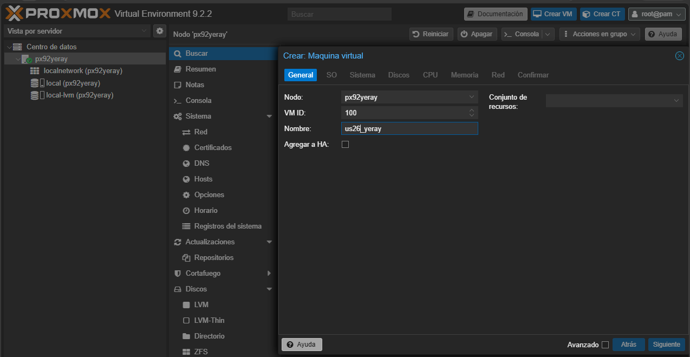
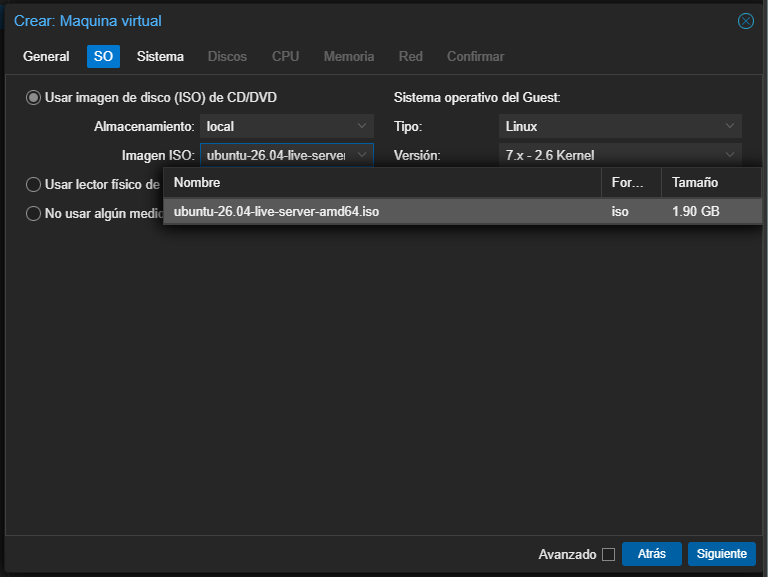
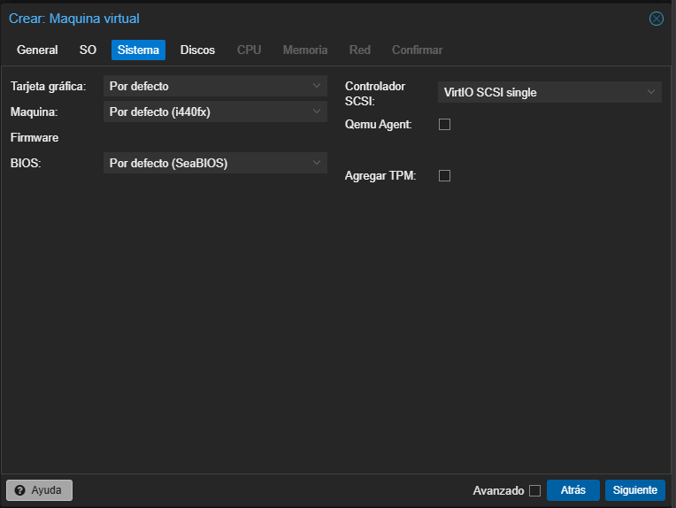
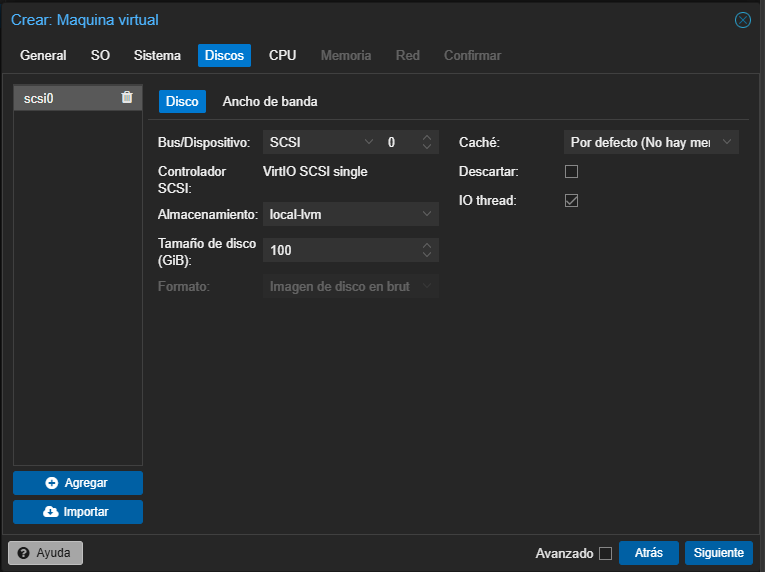
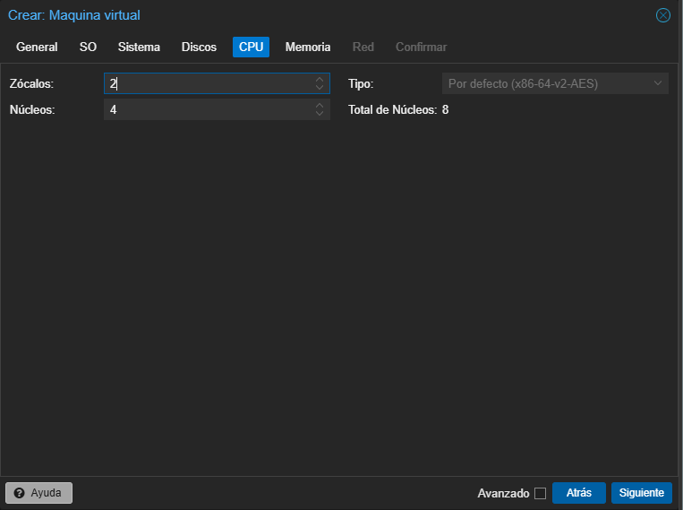
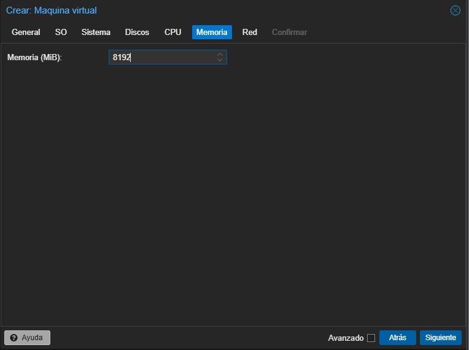
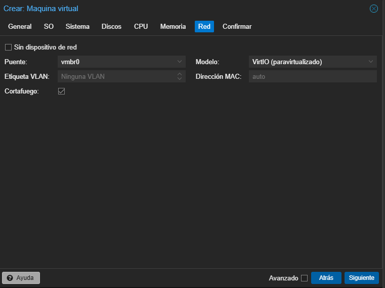
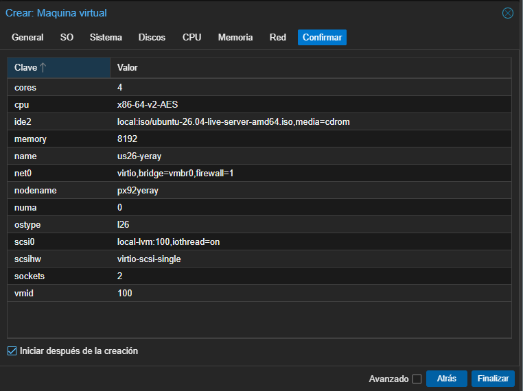
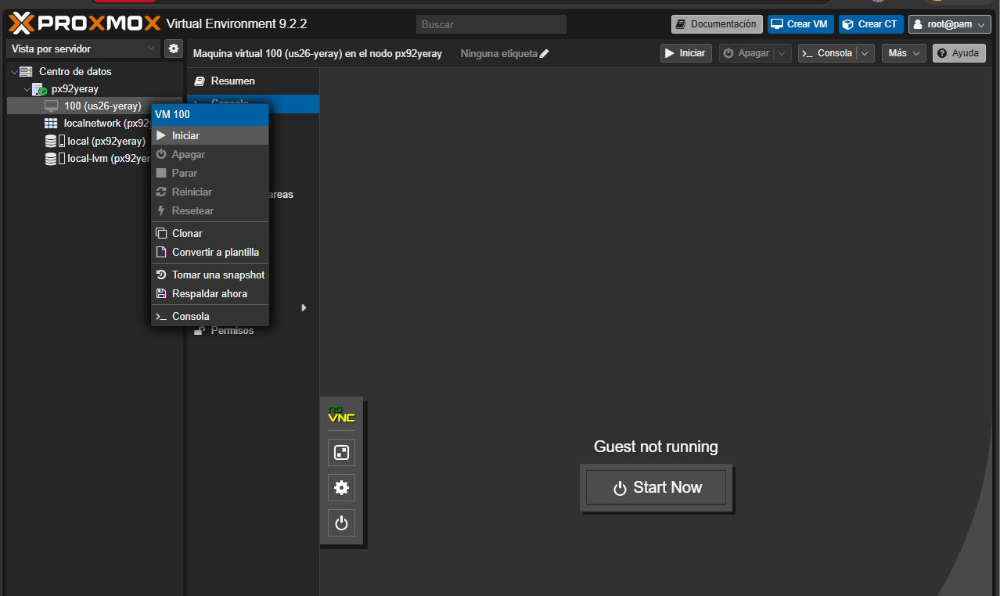
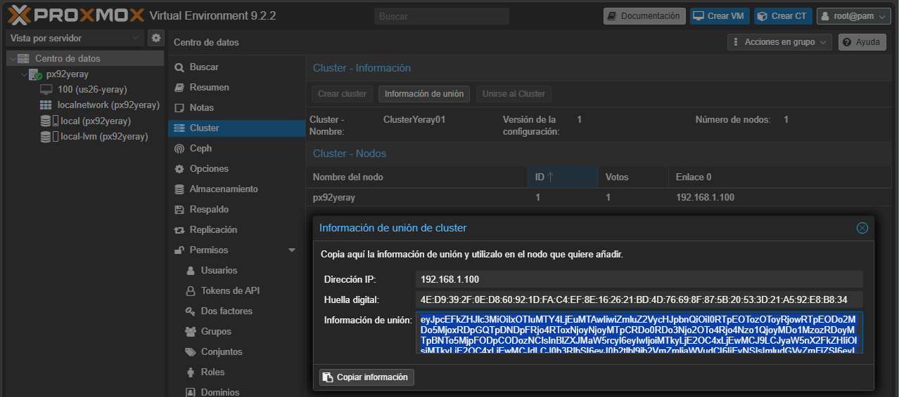

# 🖥️ Proxmox VE
> Plataforma completa de virtualización de código abierto que permite desplegar, gestionar y monitorizar fácilmente máquinas virtuales (**KVM**) y contenedores ligeros (**LXC**) desde una interfaz web intuitiva. El sistema combina cómputo, almacenamiento y redes en una única solución lista para entornos empresariales, incluyendo herramientas nativas para crear clústeres, gestionar alta disponibilidad y realizar copias de seguridad de forma centralizada.

## 1. Instalación
<iframe src="https://docs.google.com/viewer?url=https://ymorgil.github.io/systems/assets/pdf/proxmox.pdf&embedded=true" width="70%" height="700px" style="display: block; margin: 0 auto;"></iframe>

[Descargar guía de instalación](../assets/pdf/proxmox.pdf){ .md-button style="display:table;margin:0 auto;"}

## 2. Interfaz

{width="900"}

| Concepto básicos| Descripción |
|-----------|-------------|
| **PVE** | Proxmox Virtual Environment: el sistema completo. |
| **Nodo** | Servidor físico que tiene Proxmox instalado. |
| **Datacenter** | Vista global de todos los nodos del clúster. Los cambios aquí se aplican a todos los nodos. |
| **Summary** | Panel de monitorización del nodo. |
| **8006** | Puerto utilizado para el acceso web a la interfaz de Proxmox. |
| **KVM** | Máquinas virtuales completas que emulan hardware. Ideales para cualquier sistema operativo. |
| **LXC** | Contenedores ligeros basados en Linux que comparten el núcleo del host. |
| **VMID** | Número de identificación único asignado a cada máquina virtual o contenedor. |
| **Clúster** | Grupo de dos o más nodos administrados desde una única interfaz. |
| **Quórum** | Mayoría de nodos activos necesaria para que el clúster pueda tomar decisiones. |
| **HA** | Alta Disponibilidad. Permite reiniciar automáticamente servicios en otro nodo si uno falla. |
| **Almacenamiento local** | No recomendado en entornos de alta disponibilidad. Utiliza discos internos del propio nodo. |
| **Almacenamiento en red** | Recomendado. Utiliza almacenamiento compartido mediante NFS, iSCSI, Ceph, NAS, SAN, etc. |
| **PBS** | Proxmox Backup Server: herramienta para realizar copias de seguridad optimizadas. |
| **Linux Bridge (vmbr)** | Switch virtual que conecta la red física con las máquinas virtuales y contenedores. |

### MFA
El MFA (Multi-Factor Authentication o autenticación multifactor) es un sistema de seguridad que requiere que un usuario demuestre su identidad usando más de un método de autenticación antes de acceder a un sistema.

**Activarla en Proxmox**

1. Entrar en la interfaz web de Proxmox, Ir a **My Settings → TFA**, En **Permisos → Two Factor** → **Add**.
2. Elegir el tipo de MFA: **TOTP** (más habitual): códigos generados por aplicaciones como Google Authenticator.
3. Al iniciar sesión de nuevo en Proxmox, además de la contraseña pedirá el código temporal de 6 dígitos generado por la aplicación. El token se renueva cada 30 segundos


## 3. Almacenamiento
Es es el sistema que permite guardar todos los datos necesarios para el funcionamiento de la plataforma de virtualización. En él se almacenan las máquinas virtuales, contenedores, imágenes ISO, copias de seguridad, plantillas y otros recursos necesarios para la infraestructura. Este permite utilizar diferentes tipos de almacenamiento, tanto locales como remotos, adaptándose a las necesidades de cada entorno. Algunos ejemplos son discos locales, NFS, SMB/CIFS, iSCSI, Ceph o ZFS. Durante la instalación estándar de Proxmox suelen crearse **dos almacenamientos** principales.Aunque ambos están ubicados en el mismo servidor físico, tienen funciones diferentes.

{width="900"}

- **`local`** suele corresponder al directorio ``/var/lib/vz``. Cuando descargamos una imagen ISO de Ubuntu desde la interfaz web de Proxmox, esta se almacena aquí. Su función principal es almacenar archivos relacionados con la plataforma, como:
    - Imágenes ISO.
    - Copias de seguridad (Backups).
    - Plantillas de contenedores.
    - Fragmentos de configuración (Snippets).

- **`local-lvm`** utiliza la tecnología LVM-Thin (Logical Volume Manager Thin Provisioning).Cuando se crea una nueva máquina virtual y se le asigna un disco de 50 GB, dicho disco se almacena normalmente en `local-lvm`. Su función principal es almacenar los discos virtuales de Máquinas virtuales (**VM**) y Contenedores **LXC**. Ventajas:
    - Mejor aprovechamiento del espacio disponible.
    - Creación rápida de discos virtuales.
    - Soporte para snapshots.
    - Mayor flexibilidad en la gestión del almacenamiento.

| Característica | local | local-lvm |
|--------------|--------|-----------|
| Tipo de almacenamiento | Directorio | LVM-Thin |
| Imágenes ISO | Sí | No |
| Backups | Sí | No |
| Plantillas | Sí | No |
| Discos de VM | No (por defecto) | Sí |
| Discos de contenedores | No (por defecto) | Sí |
| Ubicación | /var/lib/vz | Volumen LVM |

> Nota "Directorio vs Volumen lógico"
    Un **directorio** organiza archivos dentro de un sistema de archivos.
    Un **volumen lógico LVM** es una entidad de almacenamiento flexible y dinámica creada dentro de un grupo de volúmenes, mucho más versátil para entornos virtualizados.

```bash
Redimensionado de volúmenes lógicos (LVM)

pvcreate /dev/sdX                               # 1. Crear volumen físico
vgextend nombre-vg /dev/sdX                     # 2. Extender el grupo de volúmenes 
lvextend -l +100%FREE /dev/ubuntu-vg/ubuntu-lv  # 3. Extender el volumen lógico
resize2fs /dev/ubuntu-vg/ubuntu-lv              # 4. Redimensionar el sistema de archivos
df -h                                           # 5. Comprobar puntos de montaje
```


### Backup vs Snapshot

- **Backup (copia de seguridad)** es una copia de los datos de un sistema que se guarda en otro lugar para poder recuperarlos si se pierden, se dañan o se borran. Modos de backup en Proxmox:
    - **Stop** | Mayor consistencia, breve tiempo de inactividad
    - **Suspend** | Suspende la VM. No recomendado (mayor inactividad sin mejor consistencia)
    - **Snapshot** | Mínimo tiempo de inactividad. Pequeño riesgo de inconsistencia
    - [Documentación oficial Backup Proxmox](https://pve.proxmox.com/wiki/Backup_and_Restore){target="_blank"}
    - **Regla de los 3 backups** : **Producción** — copia en el propio entorno, **Backup externo** — en otro medio/red fuera de la infraestructura y **Backup offsite** — en otra geolocalización

 
- **Snapshot (instantánea)** es una captura del estado de un sistema en un momento concreto. Guarda cómo estaba una máquina virtual, disco o sistema para poder volver a ese punto anterior. Se usa frecuentemente para volver rápidamente a un estado anterior y se hace antes de actualizar un servidor; si la actualización falla, vuelves al estado anterior.

| | Backup | Snapshot |
|---|---|---|
| **Qué es** | Clon completo del disco | Estado puntual de la VM |
| **Es independiente de la VM** | ✅ Sí | ❌ No, forma parte de la VM |
| **Uso** | Recuperación ante desastre | Probar cambios y revertir rápido |
 


## 4. Redes: Bridge, Bonds y VLANs
Proxmox usa el stack de red de Linux (a través de `/etc/network/interfaces`), así que estos conceptos no son exclusivos de Proxmox, pero la interfaz web los simplifica bastante. Las configuraciones de red en interfaz gráfica se hacen en **System → Network**.

| Concepto | Para qué sirve | Analogía |
|---|---|---|
| **Bridge** | Conectar VMs/LXCs a la red | Switch virtual |
| **Bond** | Redundancia/rendimiento de NICs físicas | Cable doble por seguridad |
| **VLAN** | Segmentar tráfico lógicamente | Diferentes "carriles" en la misma autopista |

**Bridge (Puente)**

Funciona como un switch virtual dentro del propio host de Proxmox. Por defecto, crea **vmbr0** durante la instalación, vinculado a la NIC física principal y conecta las interfaces físicas (NICs) del servidor con las interfaces virtuales de las VMs/LXC. Cada VM/LXC que quieras conectar a la red simplemente se "enchufa" a ese bridge, igual que enchufarías un cable a un switch físico.

Ejemplo de configuración típica:

    auto vmbr0
    iface vmbr0 inet static
        address 192.168.1.10/24
        gateway 192.168.1.1
        bridge-ports eno1
        bridge-stp off
        bridge-fd 0

**Cuándo usarlo:** siempre. Es la forma estándar de dar red a tus máquinas virtuales. Si tienes varias NICs físicas o quieres segmentar tráfico, puedes tener varios bridges. (ej: `vmbr0` para LAN, `vmbr1` para una red de almacenamiento/backup aislada).

---

**Bond (Agregación de enlaces / Bonding)**

Combina dos o más interfaces físicas en una sola interfaz lógica. Sus principales objetivos son:

- **Redundancia (failover):** si un cable o NIC falla, el tráfico sigue por la otra.
- **Mayor ancho de banda:** combinando varias NICs (no siempre es una suma directa, depende del modo).

Ejemplo:

    auto bond0
    iface bond0 inet manual
        bond-slaves eno1 eno2
        bond-miimon 100
        bond-mode 802.3ad
        bond-xmit-hash-policy layer2+3

    auto vmbr0
    iface vmbr0 inet static
        address 192.168.1.10/24
        gateway 192.168.1.1
        bridge-ports bond0
        bridge-stp off
        bridge-fd 0

> Nota cómo el **bridge ahora usa el bond** (`bond0`) en lugar de una NIC física directamente. El bond se "esconde" debajo del bridge.

**Cuándo usarlo:** entornos de producción donde la alta disponibilidad o el rendimiento de red importan (clústeres, almacenamiento compartido tipo Ceph/NFS, etc.). Modos de Bond destacados:

- **`active-backup`** — Failover/conmutación por error. El adaptador secundario asume el rol si el principal falla. Se configura el maestro en `bond-primary`.
- **`LACP (802.3ad)`** — Agrega múltiples enlaces para mayor ancho de banda y tolerancia a fallos. Política de hash recomendada: `layer3+4`.
- **`balance-rr`** — Este modo distribuye los paquetes de datos de forma secuencial y rotatoria entre todas las interfaces activas.
- **`balance-alb`** —  permite balancear el tráfico de tus máquinas virtuales en ambas direcciones sin tocar la configuración del switch.

---

**VLANs (Redes de Área Local Virtuales)**

Permiten segmentar el tráfico de red dentro de la misma infraestructura física, etiquetando los paquetes con un ID (1-4094). En Proxmox hay dos formas principales de trabajar con VLANs:

**a) VLAN Aware Bridge (recomendado)** Marcas el bridge como "VLAN aware" y luego, al configurar la red de cada VM/LXC, simplemente indicas el **VLAN Tag**. Proxmox se encarga de etiquetar el tráfico y esa VM queda aislada en esa VLAN, todo a través del mismo bridge. **Ventaja:** flexible, no necesitas crear un bridge por cada VLAN. Es el método más usado hoy en día.

    auto vmbr0
    iface vmbr0 inet manual
        bridge-ports eno1
        bridge-stp off
        bridge-fd 0
        bridge-vlan-aware yes
        bridge-vids 2-4094

**b) Interfaces VLAN dedicadas** Creas una interfaz VLAN explícita (`eno1.10`) y un bridge específico para ella, se usa cuando necesitas separar tráfico (gestión, almacenamiento, VMs de producción, DMZ, etc.) sin necesidad de switches físicos adicionales, siempre que tu switch físico soporte 802.1Q (trunking).

    auto vmbr0v10
    iface vmbr0v10 inet manual
        bridge-ports eno1.10
        bridge-stp off
        bridge-fd 0


## 5. Máquinas virtuales (VM)
> Una **máquina virtual (VM)** es un entorno informático que emula un ordenador completo mediante software, permitiendo instalar y ejecutar sistemas operativos de forma aislada sobre un servidor físico.

Pasos para crear e iniciar una máquina virtual en Proxmox VE:

1. En la interfaz web de Proxmox, selecciona el nodo donde deseas almacenar la ISO.
2. Haz clic en **local (nombre_del_nodo)** y accede a la pestaña **ISO Images**.
3. Pulsa el botón **Cargar** y selecciona el archivo ISO desde tu equipo y espera a que finalice la transferencia.
{width="700"}
4. Haz clic en **Create VM** en la parte superior derecha.
5. Sigue el asistente, introduciendo un nombre para la máquina virtual, en **OS**, selecciona la imagen ISO previamente subida, en **System**, deja la configuración predeterminada o ajusta los parámetros según tus necesidades. Configura el tamaño del disco virtual de 100GB, la cantidad de procesadores virtuales en **CPU**, la memoria RAM en **Memory** y la interfaz de red en **Network**.
6. Revisa el resumen de configuración, haz clic en **Finish** para crear la máquina virtual y marca la opción **Start after created** si deseas iniciar la máquina automáticamente.
7. Para iniciar selecciona la máquina virtual creada en el panel lateral y haz clic en **Start**. A continuación accede a la consola mediante **Console**.

| | | |
|---|---|---|
|  |  |  |
|  |  |  |
|  |  |  |

## 6. Clúster
Un **clúster** es un conjunto de varios servidores (nodos) que están interconectados y trabajan de forma coordinada como si fueran un único sistema. La idea principal es combinar los recursos de procesamiento, memoria y almacenamiento de todas las máquinas para ofrecer mayor capacidad, rendimiento y fiabilidad de la que tendría un solo servidor por separado. En el caso de Proxmox VE, un clúster permite gestionar todos los nodos desde una sola interfaz, migrar máquinas virtuales entre ellos y compartir configuraciones de red, almacenamiento y usuarios.

Por ejemplo, imaginemos una empresa que tiene tres servidores físicos llamados PVE1, PVE2 y PVE3. Cada uno por separado podría alojar varias máquinas virtuales, pero si uno de ellos se sobrecarga o necesita mantenimiento, las VMs que contiene quedarían afectadas. Al unir los tres servidores en un clúster de Proxmox, el administrador puede ver y gestionar las VMs de los tres nodos desde un único panel, repartir la carga entre ellos y, si es necesario, mover una máquina virtual de PVE1 a PVE2 sin que los usuarios noten interrupción alguna.

**Crear el clúster**

1. En el primer nodo (ejemplo **PVE1**), ve a `Datacenter > Cluster` y haz clic en **Crear Cluster**. Asigna un nombre al clúster.
2. Una vez creado, pulsa en **Información de unión** y copia el código que aparece (contiene los datos necesarios para que otros nodos se unan).
3. En el segundo nodo (**PVE2**), ve también a `Datacenter > Cluster`, haz clic en **Unirse al Clusterr** y pega el código copiado. Introduce la contraseña del nodo PVE1 cuando se solicite.
{width="700"}
> Desde **Datacenter → Cluster** se crea o se une a un clúster. Una vez configurado, es posible **migrar máquinas virtuales entre nodos** del clúster.

**Alta Disponibilidad (HA)** ⚡

Precisamente, una de las grandes ventajas de tener varios nodos unidos en un clúster es que ya no dependemos de una única máquina física para mantener nuestros servicios en marcha. Esto da lugar al concepto de **alta disponibilidad (HA)**, característica que garantiza que los servicios y máquinas virtuales sigan funcionando aunque uno de ellos falle inesperadamente. Cuando se activa la HA en Proxmox, el sistema monitoriza constantemente el estado de los nodos; si detecta que uno deja de responder (por ejemplo, corte de energía), automáticamente reinicia las máquinas virtuales afectadas en otro nodo disponible del clúster, minimizando el tiempo de inactividad. Esto es fundamental en entornos de producción, donde una caída no planificada de un servicio puede suponer pérdidas económicas o de productividad, por lo que la alta disponibilidad actúa como una red de seguridad que aumenta la resiliencia de toda la infraestructura virtualizada.

## 7. Plantillas (template)
Máquina virtual (VM) o contenedor (CT) preconfigurado que se convierte en una imagen base de solo lectura, usada para crear nuevas VMs/CTs rápidamente por **clonación**, en lugar de instalar el sistema operativo desde cero cada vez. 
Existen dos tipos principales en Proxmox:

- **Plantillas de VM (QEMU/KVM)**: una máquina virtual completa convertida en plantilla.
- **Plantillas de contenedor (LXC)**: imágenes de sistema de archivos descargadas desde el repositorio de plantillas de Proxmox (Debian, Ubuntu, Alpine, CentOS, etc.).

**Ventajas**

- **Rapidez**: despliegue de nuevas VMs/CTs en segundos o minutos.
- **Consistencia**: todas las VMs nacen desde la misma base, configuración estandarizada.
- **Ahorro de espacio** (con linked clones).
- **Automatización**: combinadas con cloud-init o scripts, permiten despliegues totalmente automatizados (útil con Terraform, Ansible, etc.).

**Buenas prácticas**

- Usa convenios de nombres claros (`tpl-debian12-base`, `tpl-ubuntu24-docker`).
- Mantén las plantillas **actualizadas** periódicamente (regenerarlas cuando haya cambios de versión del SO).
- Si usarás *linked clones* en producción, recuerda que **no podrás eliminar la plantilla** mientras existan clones enlazados activos.
- Documenta qué software/configuración trae cada plantilla.
- Considera tener una plantilla "mínima" (solo SO) y plantillas "especializadas" (con Docker, agentes de monitorización, etc.) según tus necesidades habituales.

### 1. Plantillas LXC
Proxmox ofrece un repositorio integrado con plantillas oficiales de distribuciones Linux. Se pueden descargar desde la interfaz web `Datacenter → [nodo] → local (almacenamiento) → Plantillas CT`
Pulsa **Plantillas** y elige la distribución/versión (ej. `debian-12-standard`, `ubuntu-24.04-standard`), descargar y guardar como archivo `.tar.zst` en `/var/lib/vz/template/cache/`.

Por línea de comandos:

```bash
pveam update        # Actualizar el índice de plantillas disponibles

pveam available     # Listar plantillas disponibles

pveam download local debian-12-standard_12.7-1_amd64.tar.zst # Descargar una plantilla

pveam list local    # Listar plantillas ya descargadas
```

**Crear un contenedor desde una plantilla**
```bash
pct create 200 local:vztmpl/debian-12-standard_12.7-1_amd64.tar.zst \
  --hostname mi-contenedor \
  --memory 512 \
  --cores 1 \
  --rootfs local-lvm:8 \
  --net0 name=eth0,bridge=vmbr0,ip=dhcp
```

### 2. Plantillas VM (QEMU/KVM)
*v9*
A diferencia de los CT, las plantillas de VM las creas tú mismo a partir de una VM ya instalada y configurada. Los paso son los siguientes:

1. **Crear y configurar una VM** con el SO deseado (instalar actualizaciones, agentes, software base).
2. **Limpiar identificadores únicos** (muy importante para evitar conflictos al clonar):
   - Eliminar `machine-id` (Linux): `truncate -s0 /etc/machine-id`
   - Limpiar claves SSH del host si se reutilizarán.
   - Desinstalar `cloud-init` si no se va a usar, o configurarlo si sí.
3. **Apagar la VM** (no puede convertirse en plantilla estando encendida).
4. **Convertir en plantilla**: (Proceso irreversible)
   - Interfaz web: clic derecho sobre la VM → **Convertir a plantilla**
   - CLI: `qm template <ID_VM>`

> ⚠️ **Esta acción es irreversible**: la VM original deja de poder arrancarse; queda como base de solo lectura para clonar.
> 
---
> **Plantillas de Windows**: es recomendable instalar los controladores **VirtIO** para que Windows reconozca correctamente los dispositivos virtuales de Proxmox y obtenga un mejor rendimiento en disco, red y otros componentes. Una vez configurado el sistema, actualizado e instalado el software necesario, se debe ejecutar **Sysprep** con la opción Generalize, lo que elimina la información única de la instalación (SID, nombre del equipo y otros identificadores) para que cada nueva máquina creada desde la plantilla se configure como un sistema independiente durante su primer arranque. Tras finalizar Sysprep, se apaga la máquina virtual y se convierte en plantilla dentro de Proxmox.
> 
> - ISO de drivers VirtIO: [pve.proxmox.com/wiki/Windows_VirtIO_Drivers](https://pve.proxmox.com/wiki/Windows_VirtIO_Drivers){target="_blank"}
- Guía oficial Windows 10: [pve.proxmox.com/wiki/Windows_10_guest_best_practices](https://pve.proxmox.com/wiki/Windows_10_guest_best_practices){target="_blank"}
- [Generalizar con Sysprep](https://learn.microsoft.com/es-es/windows-hardware/manufacture/desktop/sysprep--generalize--a-windows-installation?view=windows-11){target="_blank"}
- [Opciones de línea de comandos Sysprep](https://learn.microsoft.com/es-es/windows-hardware/manufacture/desktop/sysprep-command-line-options?view=windows-11){target="_blank"}

**Clonar desde una plantilla**

```bash
# Clonación completa (full clone) - copia independiente - más lenta
qm clone 9000 105 --name servidor-web-01 --full  
# Clonación enlazada (linked clone) - Plantilla como base, ahorra espacio - Dependiente
qm clone 9000 106 --name servidor-web-02  
```

### 3. Plantillas con Cloud-Init
Una práctica muy común es crear plantillas de VM basadas en imágenes **cloud** (ej. Ubuntu Cloud Image, Debian generic cloud) combinadas con **cloud-init**, lo que permite inyectar automáticamente al clonar:

- Usuario y contraseña/clave SSH
- Hostname
- Configuración de red (IP estática o DHCP)
- Scripts de arranque personalizados

**Ejemplo resumido**

```bash
# Descargar imagen cloud
wget https://cloud-images.ubuntu.com/noble/current/noble-server-cloudimg-amd64.img  
# Crear VM base
qm create 9000 --name ubuntu-cloud-template --memory 2048 --cores 2 --net0 virtio,bridge=vmbr0  
# Importar el disco
qm importdisk 9000 noble-server-cloudimg-amd64.img local-lvm  
# Asociar disco y añadir unidad cloud-init
qm set 9000 --scsihw virtio-scsi-pci --scsi0 local-lvm:vm-9000-disk-0
qm set 9000 --ide2 local-lvm:cloudinit
qm set 9000 --boot c --bootdisk scsi0
qm set 9000 --serial0 socket --vga serial0
# Convertir en plantilla
qm template 9000  
```

```bash
#Al clonar, se pueden ajustar parámetros cloud-init por VM:
qm set 110 --ciuser admin --cipassword 'clave' --ipconfig0 ip=192.168.1.50/24,gw=192.168.1.1
```

**Resumen de comandos**

| Acción | Comando |
|---|---|
| Actualizar índice de plantillas LXC | `pveam update` |
| Ver plantillas LXC disponibles | `pveam available` |
| Descargar plantilla LXC | `pveam download local <plantilla>` |
| Crear CT desde plantilla | `pct create <ID> local:vztmpl/<archivo>` |
| Convertir VM en plantilla | `qm template <ID>` |
| Clonar (full) | `qm clone <ID_origen> <ID_nuevo> --full` |
| Clonar (linked) | `qm clone <ID_origen> <ID_nuevo>` |

## 📚 Recursos

- [📺 Virtualización con Proxmox](https://www.youtube.com/playlist?list=PLznRNLIWBPwH5Li7Co2i57rUVhve7m_ZQ){target="_blank"} v12
- [Proxmox VE API - Proxmox VE](https://pve.proxmox.com/wiki/Proxmox_VE_API){target="_blank"}
- [Proxmox VE Helper-Scripts](https://tteck.github.io/Proxmox/){target="_blank"}
- [Scripts para Proxmox - SomeBooks.es](https://somebooks.es/?s=+Scripts+para+Proxmox){target="_blank"}
- [Proxmox VE API. Pools.](http://vasilisc.com/proxmox-ve-api-pools){target="_blank"}
- [Proxmox VE Administration Guide](https://pve.proxmox.com/pve-docs/pve-admin-guide.html){target="_blank"}
- [Usar el API de Proxmox VE | Wikicrática](https://tecnocratica.net/wikicratica/books/proxmox-ve/page/usar-el-api-de-proxmox-ve){target="_blank"}
- [GitHub - iesgn/curso_proxmox_cep: Curso sobre Proxmox VE para el CEP.](https://github.com/iesgn/curso_proxmox_cep){target="_blank"}
- [Más cursos Windows Server, Linux, Hacking](https://www.nosolohacking.info/ofertas){target="_blank"}
