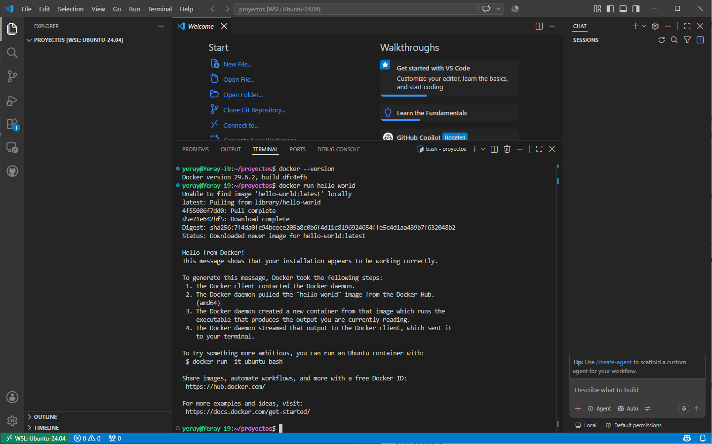
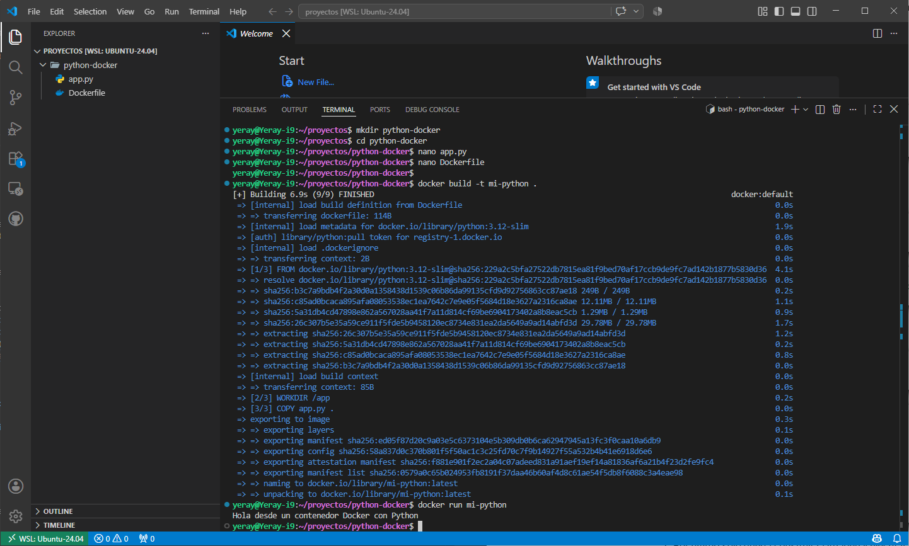
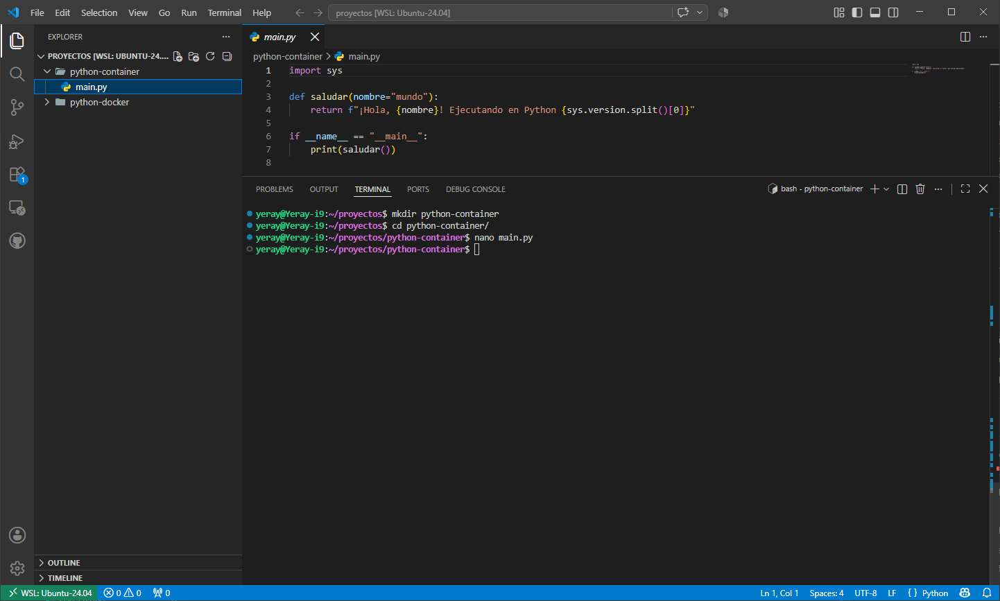
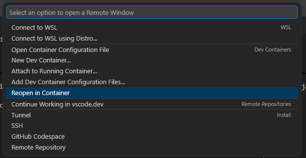
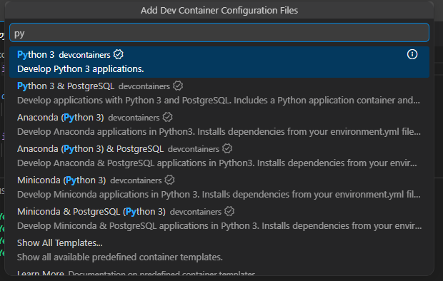
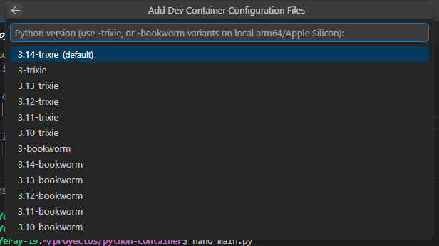
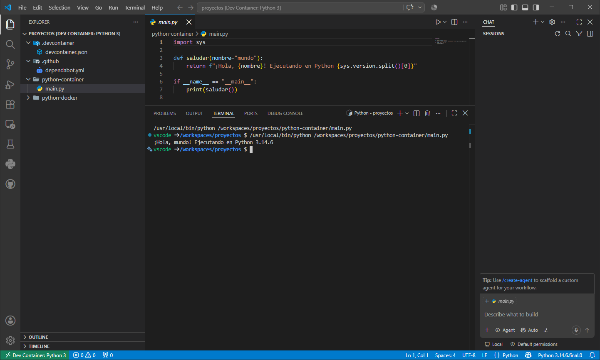

# 🐳 Docker: 

## Windows Subsystem for Linux
**WSL (Windows Subsystem for Linux)** es una característica de Windows que permite ejecutar un entorno Linux real (no una simulación) directamente sobre Windows, sin necesidad de una máquina virtual ni de arranque dual. Gracias a WSL es posible usar herramientas de línea de comandos de Linux, ejecutar scripts Bash y trabajar con aplicaciones Linux integradas en el flujo de trabajo de Windows.

Con **WSL2** (la versión actual), no se trata de un simulador de comandos ni de una imitación de Linux. Por debajo corre un **kernel Linux auténtico**, integrado con Windows de forma muy eficiente. Cuando abres una terminal de Ubuntu en WSL, estás usando Linux real, no una versión "de mentira".

**DESTACAR**

1. **El software profesional serio vive en Linux**
Servidores web, bases de datos, contenedores, herramientas DevOps, entornos de programación en la nube... la inmensa mayoría de la infraestructura tecnológica actual corre sobre Linux. Si vais a trabajar en desarrollo, sistemas o redes, tarde o temprano usaréis Linux a diario.
2. **Podéis practicar sin dejar Windows**
WSL elimina la excusa de "no tengo Linux en casa". El PC que ya tenéis (con Windows 10/11) sirve para practicar Linux de verdad, sin instalar nada exótico ni arriesgar el sistema.
3. **Las herramientas modernas funcionan mejor en Linux**
Docker, Git, Python, Node.js, servidores web como Nginx o Apache... muchas de estas herramientas están pensadas originalmente para Linux y funcionan de forma más nativa, rápida y "de verdad" ahí que en Windows.
4. **Es el puente perfecto para aprender sin miedo**
Antes de dar el salto a un servidor Linux real en producción, WSL permite equivocarse, romper cosas y volver a empezar sin ningún riesgo, todo dentro del mismo portátil con el que ya trabajáis cada día.
5. **Es gratuito y viene integrado en Windows**
No hay que comprar licencias ni descargar imágenes de discos complicadas. Con un solo comando, tenéis un Linux funcional en minutos.

### Activación y puesta en marcha

**👉 Paso 1 — Activar características de Windows**

- Plataforma de máquina virtual
- Subsistema de Windows para Linux
  


**👉 Paso 2 — Instalación de WSL + Ubuntu 24.04**
 
Abrir **PowerShell** como administrador y ejecutar:
 
```powershell
winget install Microsoft.WSL    # Instalar WSL con winget
wsl --version                   # Comprobar la instalación
wsl --install -d Ubuntu-24.04   # Instalar Ubuntu 24.04
wsl --list --online             # Si no aparece, listar las disponibles
```
!!! note "Primera vez que arranque Ubuntu, el sistema solicitará, Usuario y contraseña para Administrador"


**👉 Paso 3 — Terminal de Windows**

La **Terminal de Windows** es una herramienta «todo en uno» disponible de forma gratuita en la Microsoft Store. Una vez instalada, basta con buscarla en el menú Inicio para ejecutarla.
 
Su principal ventaja es que permite abrir múltiples pestañas con diferentes entornos (PowerShell, CMD, Ubuntu...) en una sola ventana, con personalización completa de colores y fuentes.


!!! note "Una vez dentro de Ubuntu:  `sudo apt update && sudo apt upgrade -y && apt autoremove`"

??? info "WSL"
    | Antes de WSL | Con WSL |
    |---|---|
    | Máquina virtual pesada y lenta | Integración ligera y rápida con Windows |
    | Instalar Linux aparte (dual boot) | Un solo comando, sin reiniciar |
    | Simulador de comandos | Kernel Linux real |
    | Cambiar de sistema operativo | Cambiar de ventana |

### Conflictos
**WSL 2** requiere que la característica de **Hyper-V** (el hipervisor nativo de Windows) esté activada obligatoriamente. En el pasado, cuando Hyper-V estaba activo, VirtualBox no podía utilizar su propio motor de virtualización de manera eficiente, lo que causaba que las máquinas virtuales de VirtualBox funcionaran con un rendimiento muy lento o directamente se cerraran con errores (como pantallas azules o fallos al iniciar).

**Solución**:


- Si la consola te devuelve hypervisorlaunchtype **Auto**, significa que el hipervisor de Windows arranca automáticamente con el sistema (necesario para Docker Desktop, WSL 2 y máquinas virtuales de Hyper-V).
- Si te devuelve hypervisorlaunchtype **Off**, significa que está desactivado (lo que permite que programas como VirtualBox funcionen sin conflictos de virtualización a nivel de hardware, pero impedirá que Docker y WSL 2 funcionen).

## Docker Desktop
Aplicación de interfaz gráfica para (Windows, Mac o Linux) que empaqueta todo el motor de Docker junto con herramientas adicionales, permitiéndote gestionar contenedores, imágenes y volúmenes de manera visual y sencilla sin depender exclusivamente de la línea de comandos.
 
**INSTALACIÓN E INTEGRACIÓN CON WSL**

**👉 Paso 1 — Instalar Docker Desktop**
```powershell
# PowerShell con winget
winget install Docker.DockerDesktop
```
**👉 Paso 2 — Integración con WSL**

1. Iniciar **Docker Desktop** desde el menú de inicio.
2. Esperar a que termine la configuración inicial.
3. Ir a: **Settings → Resources → WSL Integration**
4. Activar: **Ubuntu-24.04**


**👉 Paso 3 — Comprobar Docker desde Ubuntu**


## Portainer
Sustituye los comandos de terminal por un panel visual desde el que se pueden administrar **contenedores**, **imágenes**, **redes** y **volúmenes** de forma intuitiva. Es especialmente útil en entornos de desarrollo y aprendizaje, ya que permite ver el estado del sistema en tiempo real sin necesidad de recordar comandos.

- 👉 **Interfaz muy intuitiv**a: desde el panel de control se puede monitorizar el consumo de CPU y RAM de cada contenedor, revisar los logs en tiempo real y acceder directamente a la consola de un servicio con un solo clic. También permite gestionar redes y volúmenes de forma visual, lo que resulta muy práctico frente a la interfaz más limitada de Docker Desktop.
- 👉 Una de sus funciones más potentes son los **Stacks**, que permiten desplegar aplicaciones completas copiando y pegando el contenido de un archivo **`docker-compose.yml`** directamente en el navegador. Esto simplifica enormemente el despliegue de proyectos complejos sin necesidad de gestionar archivos locales de forma constante.


**INSTALACIÓN**

La forma más sencilla de instalar Portainer en Docker Desktop es a través de las extensiones. Hay que abrir Docker Desktop, ir a la sección **Extensions** en el menú lateral izquierdo y buscar **«Portainer»** en el buscador. Al hacer clic en instalar, la aplicación descarga la imagen necesaria y configura el contenedor de gestión automáticamente.

||||
||||
||||
 
## WSL, Docker y VSC
Una vez instalado **WSL**, configurado **Ubuntu** y teniendo **Docker Desktop**, el siguiente paso es utilizar **Visual Studio Code** dentro de Ubuntu y crear y ejecutar un contenedor sencillo con Python, que servirá como base para proyectos más complejos.

### Extensiones
Instalar [Visual Studio Code](https://code.visualstudio.com/){target="_blank"} si no se tiene tanto en Windows como en la instancia de Ubuntu. A continuación en la máquina real se **recomienda** instalar las siguientes extensiones:

| Extensión | Definición concreta |
|---|---|
| **Remote - WSL** | Conecta VS Code a la Ubuntu de WSL, donde el alumnado tendrá el proyecto y Docker corriendo. |
| **Docker** | Permite lanzar `docker compose up` con clic derecho sobre el `docker-compose.yml`, ver logs y estado de contenedores sin usar la terminal. |
| **Python** | Si el alumnado también edita o depura el código Python (no solo lo ejecuta vía compose), da autocompletado, selección de intérprete y depuración. |
| **Dev Containers** | Permite que VS Code se "meta" dentro del contenedor ya en ejecución, para editar el código con el mismo entorno (librerías, versión de Python) que usa la app. |
| **YAML** | Autocompletado y validación de sintaxis en `docker-compose.yml`, evitando errores de indentación típicos de alumnado que empieza. |
| **GitHub Pull Requests and Issues** | Si el proyecto está en un repo de GitHub, permite gestionar issues y PRs sin salir de VS Code — útil si evalúas entregas vía Git. |
| **Markdown All in One** | Para que el alumnado edite el `README.md` del proyecto con tabla de contenidos y formato correcto. |

### VSC en Ubuntu (WSL)
Trabajar desde Ubuntu dentro de WSL permite utilizar herramientas Linux reales, gestionar dependencias de forma más sencilla y ejecutar contenedores Docker en un entorno similar a producción.

1. Abrir Ubuntu (WSL), crear un directorio **proyectos** (directorio de trabajo habrá una carpeta por cada práctica). Una vez ubicados en el directorio proyectos abrimos el visual code en dicha ubicación (recordar hay que tenerlo instalado en Ubuntu). Esto abre el Visual Studio Code lo conecta automáticamente con WSL y permite trabajar como si estuvieras en Linux real.
``` bash
cd ~
mkdir proyectos
cd proyectos
code .
```
2. Comprobamos que funciona con el típico contenedor de "Hola mundo!"
``` bash
docker --version
docker run hello-world
```



### Proyecto contenedor Python
Los contenedores permiten ejecutar aplicaciones en entornos aislados, reproducibles y portables. A continuación vamos a crear una pequeña aplicación de python usando **Dockerfile** para crear la imagen propia del contenedor.

Creamos un proyecto nuevo, y dentro de ese proyecto crearemos el script de python y tambien el archivo Dockerfile para crear la imagen.
``` bash
mkdir python-docker
cd python-docker
```

**Script:**
``` bash
nano app.py
```
``` python
print("Hola desde un contenedor Docker con Python")
```
**Imagen de Docker:**
``` bash
nano Dockerfile
```
``` dockerfile
FROM python:3.12-slim

WORKDIR /app

COPY app.py .

CMD ["python", "app.py"]
```

Por último solo queda construir la imagen y ejecutar:
``` bash
docker build -t mi-python .
docker run mi-python
```

Salida esperada:



### DEV Container
Guía rápida para abrir un proyecto dentro de un dev container en VS Code, usando como ejemplo el proyecto `python-container` (imagen `python:3.14`, archivo `main.py`). Requisitos: 

- Docker Desktop instalado y en ejecución.
- Extensión **Dev Containers** instalada en VS Code.
- El proyecto abierto en VS Code

**PASO 1. Localiza el icono `><`**
 
En la esquina **inferior izquierda** de la ventana de VS Code hay un icono verde con dos ángulos (`><`). Es el **Remote Indicator**: indica dónde se está ejecutando VS Code en este momento (en local, en WSL, en un contenedor...). Haz clic en él.



**PASO 2. Selecciona el contenedor**

Se abre un menú desplegable en la parte superior con varias opciones remotas. Selecciona: **Reopen in Container**, VS Code muestra una lista de entornos predefinidos para elegir con un clic (Python, Node, etc.). Seleccionas el que te interesa — en tu caso, una imagen de **Python 3.14** sobre Debian Trixie — y VS Code se encarga del resto: descarga esa imagen y arranca el contenedor con ella. La primera vez tarda un poco porque descarga la imagen; las siguientes veces queda en caché y es casi instantáneo.

||||
||||
||||

**PASO 3. Comprueba que estás dentro del contenedor**
 
Cuando termina, la ventana se recarga y el icono `><` de la esquina inferior izquierda cambia de texto. Esa etiqueta es la confirmación de que ya no estás trabajando en tu sistema operativo, sino dentro del contenedor.

Abre la terminal integrada y ejecuta el código `main.py`. Esta terminal ya se ejecuta **dentro** del contenedor, no en Windows ni en WSL directamente.
 

 
!!! abstract "Clic en `><` → *Reopen in Container* → VS Code construye/arranca el contenedor → la terminal integrada ya vive dentro de él → ejecutas tu código con las dependencias exactas definidas en `devcontainer.json`, sin tocar nada de tu sistema."

## Recursos
- [🎬 Programa en contenedores docker con vscode.](https://youtu.be/9_WkqhLMUZA){target="_blank"}