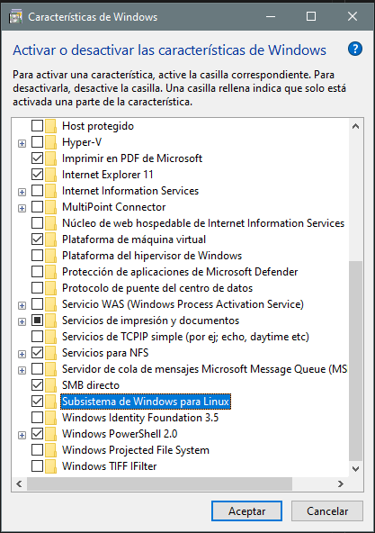
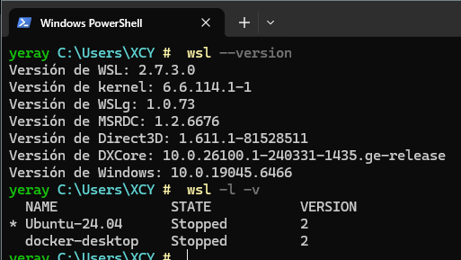
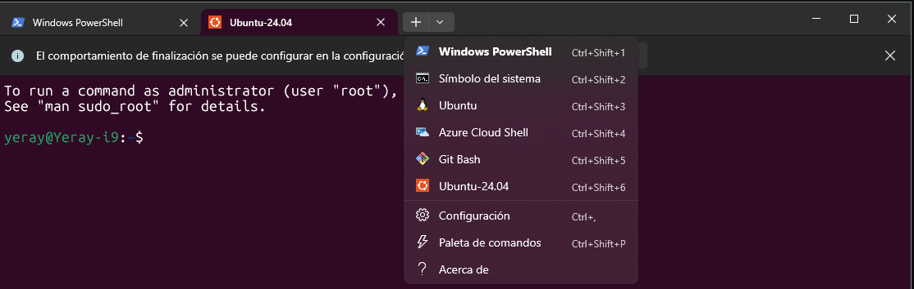
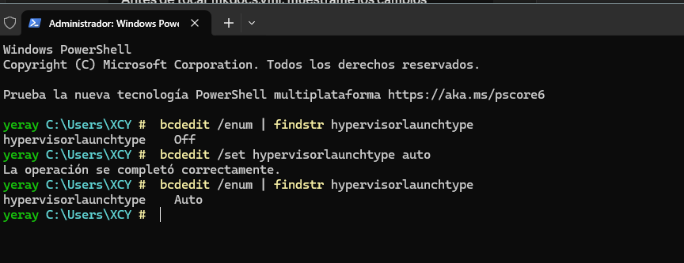
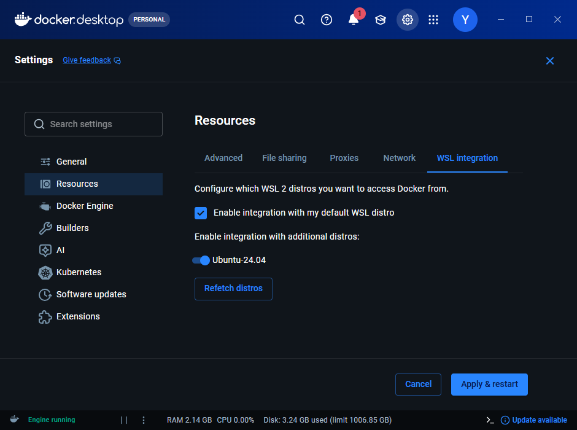
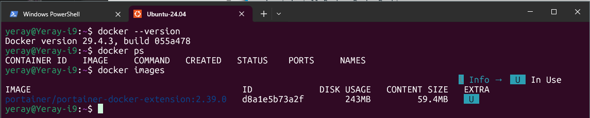
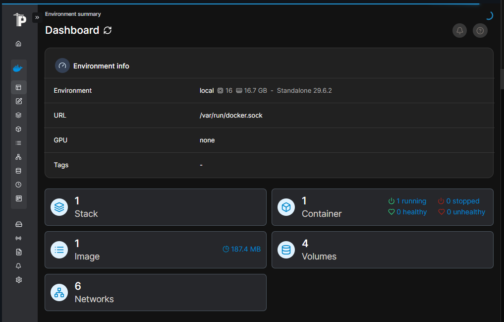
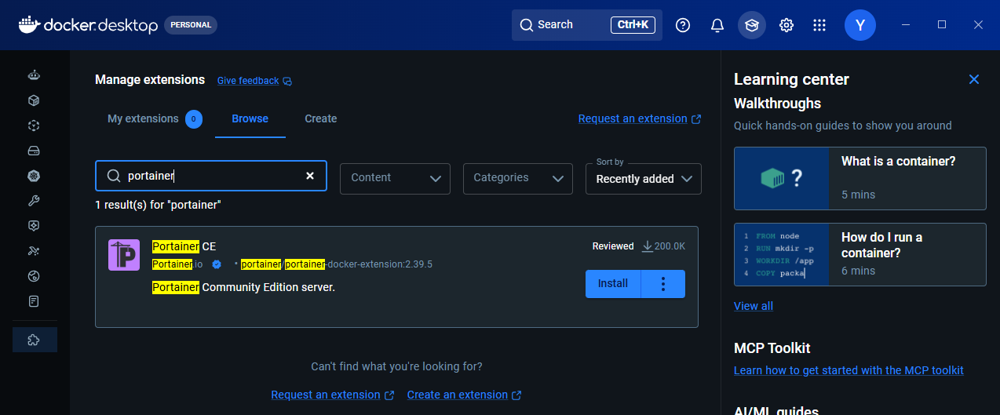
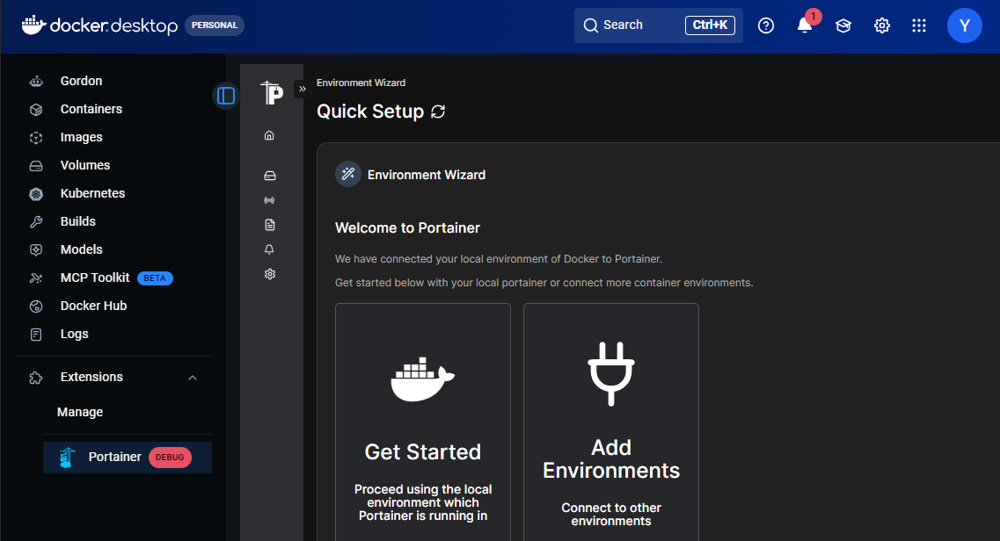
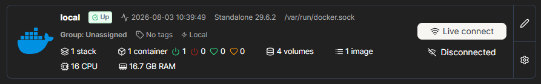

# 🐳 Docker: 

## ¿Qué es WSL?
**WSL (Windows Subsystem for Linux)** es una característica de Windows que permite ejecutar un entorno Linux real (no una simulación) directamente sobre Windows, sin necesidad de una máquina virtual ni de arranque dual. Gracias a WSL es posible usar herramientas de línea de comandos de Linux, ejecutar scripts Bash y trabajar con aplicaciones Linux integradas en el flujo de trabajo de Windows.

Con **WSL2** (la versión actual), no se trata de un simulador de comandos ni de una imitación de Linux. Por debajo corre un **kernel Linux auténtico**, integrado con Windows de forma muy eficiente. Cuando abres una terminal de Ubuntu en WSL, estás usando Linux real, no una versión "de mentira".

**DESTACAR**

1. **El software profesional serio vive en Linux**
Servidores web, bases de datos, contenedores, herramientas DevOps, entornos de programación en la nube... la inmensa mayoría de la infraestructura tecnológica actual corre sobre Linux. Si vais a trabajar en desarrollo, sistemas o redes, tarde o temprano usaréis Linux a diario.
2. **Podéis practicar sin dejar Windows**
WSL elimina la excusa de "no tengo Linux en casa". El PC que ya tenéis (con Windows 10/11) sirve para practicar Linux de verdad, sin instalar nada exótico ni arriesgar el sistema.
3. **Las herramientas modernas funcionan mejor en Linux**
Docker, Git, Python, Node.js, servidores web como Nginx o Apache... muchas de estas herramientas están pensadas originalmente para Linux y funcionan de forma más nativa, rápida y "de verdad" ahí que en Windows.
4. **Es el puente perfecto para aprender sin miedo**
Antes de dar el salto a un servidor Linux real en producción, WSL permite equivocarse, romper cosas y volver a empezar sin ningún riesgo, todo dentro del mismo portátil con el que ya trabajáis cada día.
5. **Es gratuito y viene integrado en Windows**
No hay que comprar licencias ni descargar imágenes de discos complicadas. Con un solo comando, tenéis un Linux funcional en minutos.

### Activación y puesta en marcha

**👉 Paso 1 — Activar características de Windows**

- Plataforma de máquina virtual
- Subsistema de Windows para Linux
  


**👉 Paso 2 — Instalación de WSL + Ubuntu 24.04**
 
Abrir **PowerShell** como administrador y ejecutar:
 
```powershell
winget install Microsoft.WSL    # Instalar WSL con winget
wsl --version                   # Comprobar la instalación
wsl --install -d Ubuntu-24.04   # Instalar Ubuntu 24.04
wsl --list --online             # Si no aparece, listar las disponibles
```
!!! note "Primera vez que arranque Ubuntu, el sistema solicitará, Usuario y contraseña para Administrador"



**👉 Paso 3 — Terminal de Windows**

La **Terminal de Windows** es una herramienta «todo en uno» disponible de forma gratuita en la Microsoft Store. Una vez instalada, basta con buscarla en el menú Inicio para ejecutarla.
 
Su principal ventaja es que permite abrir múltiples pestañas con diferentes entornos (PowerShell, CMD, Ubuntu...) en una sola ventana, con personalización completa de colores y fuentes.



!!! note "Una vez dentro de Ubuntu:  `sudo apt update && sudo apt upgrade -y && apt autoremove`"

??? info "WSL"
    | Antes de WSL | Con WSL |
    |---|---|
    | Máquina virtual pesada y lenta | Integración ligera y rápida con Windows |
    | Instalar Linux aparte (dual boot) | Un solo comando, sin reiniciar |
    | Simulador de comandos | Kernel Linux real |
    | Cambiar de sistema operativo | Cambiar de ventana |

### Conflictos
**WSL 2** requiere que la característica de **Hyper-V** (el hipervisor nativo de Windows) esté activada obligatoriamente. En el pasado, cuando Hyper-V estaba activo, VirtualBox no podía utilizar su propio motor de virtualización de manera eficiente, lo que causaba que las máquinas virtuales de VirtualBox funcionaran con un rendimiento muy lento o directamente se cerraran con errores (como pantallas azules o fallos al iniciar).

**Solución**:



- Si la consola te devuelve hypervisorlaunchtype **Auto**, significa que el hipervisor de Windows arranca automáticamente con el sistema (necesario para Docker Desktop, WSL 2 y máquinas virtuales de Hyper-V).
- Si te devuelve hypervisorlaunchtype **Off**, significa que está desactivado (lo que permite que programas como VirtualBox funcionen sin conflictos de virtualización a nivel de hardware, pero impedirá que Docker y WSL 2 funcionen).

## Docker Desktop
Aplicación de interfaz gráfica para (Windows, Mac o Linux) que empaqueta todo el motor de Docker junto con herramientas adicionales, permitiéndote gestionar contenedores, imágenes y volúmenes de manera visual y sencilla sin depender exclusivamente de la línea de comandos.
 
**INSTALACIÓN E INTEGRACIÓN CON WSL**

**👉 Paso 1 — Instalar Docker Desktop**
```powershell
# PowerShell con winget
winget install Docker.DockerDesktop
```
**👉 Paso 2 — Integración con WSL**

1. Iniciar **Docker Desktop** desde el menú de inicio.
2. Esperar a que termine la configuración inicial.
3. Ir a: **Settings → Resources → WSL Integration**
4. Activar: **Ubuntu-24.04**



**👉 Paso 3 — Comprobar Docker desde Ubuntu**




## 👉👉👉 
## Portainer
Sustituye los comandos de terminal por un panel visual desde el que se pueden administrar **contenedores**, **imágenes**, **redes** y **volúmenes** de forma intuitiva. Es especialmente útil en entornos de desarrollo y aprendizaje, ya que permite ver el estado del sistema en tiempo real sin necesidad de recordar comandos.

- 👉 **Interfaz muy intuitiv**a: desde el panel de control se puede monitorizar el consumo de CPU y RAM de cada contenedor, revisar los logs en tiempo real y acceder directamente a la consola de un servicio con un solo clic. También permite gestionar redes y volúmenes de forma visual, lo que resulta muy práctico frente a la interfaz más limitada de Docker Desktop.
- 👉 Una de sus funciones más potentes son los **Stacks**, que permiten desplegar aplicaciones completas copiando y pegando el contenido de un archivo **`docker-compose.yml`** directamente en el navegador. Esto simplifica enormemente el despliegue de proyectos complejos sin necesidad de gestionar archivos locales de forma constante.



**INSTALACIÓN**

La forma más sencilla de instalar Portainer en Docker Desktop es a través de las extensiones. Hay que abrir Docker Desktop, ir a la sección **Extensions** en el menú lateral izquierdo y buscar «Portainer» en el buscador. Al hacer clic en instalar, la aplicación descarga la imagen necesaria y configura el contenedor de gestión automáticamente.

||||
||||
||||
 
 
### **Funcionalidades principales**
 


## Ejercicio: Programar en Contenedores Docker con VS Code

**🎬 Enlace al video original:** [https://youtu.be/9_WkqhLMUZA](https://youtu.be/9_WkqhLMUZA)

Este ejercicio te guiará a través de las tres formas de programar directamente dentro de contenedores Docker utilizando Visual Studio Code para aislar dependencias.

---

## Requisitos Previos

1. **Docker Desktop:** Instalado y en ejecución.
2. **Visual Studio Code:** Con las extensiones:
   - `Docker` (de Microsoft)
   - `Dev Containers` (de Microsoft)

---

## Paso 1: Configuración del Proyecto Base (FastAPI)

Crea una carpeta para tu proyecto y añade los siguientes archivos básicos:

### 1.1. `main.py`

```python
from fastapi import FastAPI

app = FastAPI()

@app.get("/")
def read_root():
    return {"Hello": "World desde Docker"}

@app.get("/items/{item_id}")
def read_item(item_id: int, q: str = None):
    return {"item_id": item_id, "q": q}
```

### 1.2. `requirements.txt`

```
fastapi
uvicorn
```

---

## Paso 2: Método Manual (Docker Puro)

Este método consiste en construir la imagen y correr el contenedor manualmente enlazando carpetas.

### 2.1. Crear el `Dockerfile`

```dockerfile
FROM python:3.11-slim
WORKDIR /code
COPY requirements.txt .
RUN pip install --no-cache-dir -r requirements.txt
COPY . .
EXPOSE 8000
CMD ["uvicorn", "main:app", "--host", "0.0.0.0", "--port", "8000", "--reload"]
```

### 2.2. Construir la imagen

```powershell
docker build -t imagen-fastapi .
```

### 2.3. Ejecutar el contenedor con volumen (sincronización de código)

```powershell
# PowerShell (Windows)
docker run -d -p 8000:8000 -v ${PWD}:/code imagen-fastapi

# Linux / Mac
docker run -d -p 8000:8000 -v $(pwd):/code imagen-fastapi
```

> **Nota:** El flag `-v` monta tu carpeta local dentro del contenedor, por lo que cualquier cambio en el código se refleja en tiempo real sin reconstruir la imagen.

---

## Paso 3: Conexión mediante la Extensión "Dev Containers"

Este método permite usar todas las ayudas de VS Code (IntelliSense, autocompletado) directamente dentro del contenedor.

1. Con el contenedor del paso anterior en ejecución, haz clic en el botón **azul** (`><`) de la esquina inferior izquierda de VS Code.
2. Selecciona **"Attach to Running Container"**.
3. Elige el contenedor `imagen-fastapi` de la lista.
4. Se abrirá una nueva ventana de VS Code conectada al contenedor. Abre la carpeta `/code`.
5. **Tip:** Instala la extensión de Python *dentro del contenedor* para tener autocompletado y análisis de errores.

---

## Paso 4: Configuración de Ambiente Nativo (Dev Container Config)

Para proyectos nuevos donde quieres que VS Code configure todo el ambiente automáticamente.

1. Crea una carpeta vacía y ábrela en VS Code.
2. Presiona `Ctrl + Shift + P` y busca:
   ```
   Dev Containers: Add Dev Container Configuration File...
   ```
3. Selecciona **Python 3** (versión 3.11 o similar) de la lista de plantillas.
4. VS Code creará automáticamente una carpeta `.devcontainer/` con un archivo `devcontainer.json`.
5. Haz clic en el botón azul inferior (`><`) y selecciona **"Reopen in Container"**.
6. VS Code construirá la imagen y reabrirá el proyecto ya dentro del contenedor.

---

## Resumen de Comandos Útiles

| Comando | Descripción |
|---|---|
| `docker ps` | Ver contenedores activos |
| `docker stop <ID>` | Detener un contenedor |
| `docker rm <ID>` | Eliminar un contenedor |
| `docker images` | Ver imágenes creadas |
| `docker build -t <nombre> .` | Construir una imagen desde un Dockerfile |
| `docker run -d -p <host>:<cont> <imagen>` | Ejecutar un contenedor en segundo plano |

---

> Tutorial basado en el canal **Píldoras de Programación**.


# Visual Studio Code usando WSL y Docker

Una vez instalado **WSL**, configurado **Ubuntu** y teniendo **Docker Desktop** integrado con **Visual Studio Code**, el siguiente paso es trabajar directamente desde el entorno Linux y comenzar a ejecutar contenedores.

Este documento describe cómo utilizar Visual Studio Code dentro de Ubuntu y cómo crear y ejecutar un contenedor sencillo con Python, que servirá como base para proyectos más complejos.

## Extensiones necesarias en Visual Studio Code para trabajar con Docker y WSL
Instalar [Visual Studio Code](https://code.visualstudio.com/). Se recomienda instalar las siguientes extensiones:
- Python
- Jupyter
- WSL (si usáis WSL2)
- GitHub Copilot

- **Remote - WSL**  
Permite abrir y trabajar en el entorno Linux (Ubuntu) desde Visual Studio Code utilizando WSL.

- **Docker**  
Permite crear, ejecutar y gestionar contenedores e imágenes Docker directamente desde Visual Studio Code.

- **Python**  
Proporciona soporte para desarrollar, ejecutar y depurar scripts Python dentro del editor.

- **Dev Containers**  
Permite abrir proyectos directamente dentro de contenedores Docker para trabajar en entornos aislados y reproducibles.

- **YAML**  
Facilita la edición y validación de archivos de configuración como `docker-compose.yml`.

- **GitHub Pull Requests and Issues**  
Permite gestionar repositorios, cambios y revisiones de código desde Visual Studio Code.

- **Markdown All in One**  
Mejora la edición de archivos Markdown con herramientas de formato, tablas y atajos de escritura.

## 1. Ejecutar Visual Studio Code en Ubuntu (WSL)

Trabajar desde Ubuntu dentro de WSL permite utilizar herramientas Linux
reales, gestionar dependencias de forma más sencilla y ejecutar
contenedores Docker en un entorno similar a producción.

## 1.1 Abrir Ubuntu (WSL)

``` bash
wsl
```

o bien:

``` bash
ubuntu
```

------------------------------------------------------------------------

## 1.2 Ir al directorio de trabajo

``` bash
cd ~
mkdir proyectos
cd proyectos
```

------------------------------------------------------------------------

## 1.3 Abrir Visual Studio Code desde Ubuntu

``` bash
code .
```

Esto:

-   Abre Visual Studio Code
-   Conecta automáticamente con WSL
-   Permite trabajar como si estuvieras en Linux real

------------------------------------------------------------------------

## 1.4 Comprobar que Docker funciona

``` bash
docker --version
docker run hello-world
```

------------------------------------------------------------------------

## 2. Uso de contenedores Docker desde Visual Studio Code

Los contenedores permiten ejecutar aplicaciones en entornos aislados,
reproducibles y portables.

------------------------------------------------------------------------

## 2.1 Crear un proyecto Python

``` bash
mkdir python-docker
cd python-docker
```

------------------------------------------------------------------------

## 2.2 Crear un script Python

Archivo:

``` bash
nano app.py
```

Contenido:

``` python
print("Hola desde un contenedor Docker con Python")
```

------------------------------------------------------------------------

## 2.3 Crear un Dockerfile

Archivo:

``` bash
nano Dockerfile
```

Contenido:

``` dockerfile
FROM python:3.12-slim

WORKDIR /app

COPY app.py .

CMD ["python", "app.py"]
```

------------------------------------------------------------------------

## 2.4 Construir la imagen

``` bash
docker build -t mi-python .
```

------------------------------------------------------------------------

## 2.5 Ejecutar el contenedor

``` bash
docker run mi-python
```

Salida esperada:

    Hola desde un contenedor Docker con Python

------------------------------------------------------------------------

## Resumen

Se ha aprendido a:

-   Ejecutar VS Code en Ubuntu
-   Crear un script Python
-   Crear un Dockerfile
-   Construir una imagen
-   Ejecutar un contenedor


---
title: "Docker: VSC"
weight: 3
---
# Ejercicio: Programar en Contenedores Docker con VS Code

**🎬 Enlace al video original:** [https://youtu.be/9_WkqhLMUZA](https://youtu.be/9_WkqhLMUZA)

Este ejercicio te guiará a través de las tres formas de programar directamente dentro de contenedores Docker utilizando Visual Studio Code para aislar dependencias.

---

## Requisitos Previos

1. **Docker Desktop:** Instalado y en ejecución.
2. **Visual Studio Code:** Con las extensiones:
   - `Docker` (de Microsoft)
   - `Dev Containers` (de Microsoft)

---

## Paso 1: Configuración del Proyecto Base (FastAPI)

Crea una carpeta para tu proyecto y añade los siguientes archivos básicos:

### 1.1. `main.py`

```python
from fastapi import FastAPI

app = FastAPI()

@app.get("/")
def read_root():
    return {"Hello": "World desde Docker"}

@app.get("/items/{item_id}")
def read_item(item_id: int, q: str = None):
    return {"item_id": item_id, "q": q}
```

### 1.2. `requirements.txt`

```
fastapi
uvicorn
```

---

## Paso 2: Método Manual (Docker Puro)

Este método consiste en construir la imagen y correr el contenedor manualmente enlazando carpetas.

### 2.1. Crear el `Dockerfile`

```dockerfile
FROM python:3.11-slim
WORKDIR /code
COPY requirements.txt .
RUN pip install --no-cache-dir -r requirements.txt
COPY . .
EXPOSE 8000
CMD ["uvicorn", "main:app", "--host", "0.0.0.0", "--port", "8000", "--reload"]
```

### 2.2. Construir la imagen

```powershell
docker build -t imagen-fastapi .
```

### 2.3. Ejecutar el contenedor con volumen (sincronización de código)

```powershell
# PowerShell (Windows)
docker run -d -p 8000:8000 -v ${PWD}:/code imagen-fastapi

# Linux / Mac
docker run -d -p 8000:8000 -v $(pwd):/code imagen-fastapi
```

> **Nota:** El flag `-v` monta tu carpeta local dentro del contenedor, por lo que cualquier cambio en el código se refleja en tiempo real sin reconstruir la imagen.

---

## Paso 3: Conexión mediante la Extensión "Dev Containers"

Este método permite usar todas las ayudas de VS Code (IntelliSense, autocompletado) directamente dentro del contenedor.

1. Con el contenedor del paso anterior en ejecución, haz clic en el botón **azul** (`><`) de la esquina inferior izquierda de VS Code.
2. Selecciona **"Attach to Running Container"**.
3. Elige el contenedor `imagen-fastapi` de la lista.
4. Se abrirá una nueva ventana de VS Code conectada al contenedor. Abre la carpeta `/code`.
5. **Tip:** Instala la extensión de Python *dentro del contenedor* para tener autocompletado y análisis de errores.

---

## Paso 4: Configuración de Ambiente Nativo (Dev Container Config)

Para proyectos nuevos donde quieres que VS Code configure todo el ambiente automáticamente.

1. Crea una carpeta vacía y ábrela en VS Code.
2. Presiona `Ctrl + Shift + P` y busca:
   ```
   Dev Containers: Add Dev Container Configuration File...
   ```
3. Selecciona **Python 3** (versión 3.11 o similar) de la lista de plantillas.
4. VS Code creará automáticamente una carpeta `.devcontainer/` con un archivo `devcontainer.json`.
5. Haz clic en el botón azul inferior (`><`) y selecciona **"Reopen in Container"**.
6. VS Code construirá la imagen y reabrirá el proyecto ya dentro del contenedor.

---

## Resumen de Comandos Útiles

| Comando | Descripción |
|---|---|
| `docker ps` | Ver contenedores activos |
| `docker stop <ID>` | Detener un contenedor |
| `docker rm <ID>` | Eliminar un contenedor |
| `docker images` | Ver imágenes creadas |
| `docker build -t <nombre> .` | Construir una imagen desde un Dockerfile |
| `docker run -d -p <host>:<cont> <imagen>` | Ejecutar un contenedor en segundo plano |

---

> Tutorial basado en el canal **Píldoras de Programación**.


# Visual Studio Code usando WSL y Docker

Una vez instalado **WSL**, configurado **Ubuntu** y teniendo **Docker Desktop** integrado con **Visual Studio Code**, el siguiente paso es trabajar directamente desde el entorno Linux y comenzar a ejecutar contenedores.

Este documento describe cómo utilizar Visual Studio Code dentro de Ubuntu y cómo crear y ejecutar un contenedor sencillo con Python, que servirá como base para proyectos más complejos.

## Extensiones necesarias en Visual Studio Code para trabajar con Docker y WSL
Instalar [Visual Studio Code](https://code.visualstudio.com/). Se recomienda instalar las siguientes extensiones:
- Python
- Jupyter
- WSL (si usáis WSL2)
- GitHub Copilot

- **Remote - WSL**  
Permite abrir y trabajar en el entorno Linux (Ubuntu) desde Visual Studio Code utilizando WSL.

- **Docker**  
Permite crear, ejecutar y gestionar contenedores e imágenes Docker directamente desde Visual Studio Code.

- **Python**  
Proporciona soporte para desarrollar, ejecutar y depurar scripts Python dentro del editor.

- **Dev Containers**  
Permite abrir proyectos directamente dentro de contenedores Docker para trabajar en entornos aislados y reproducibles.

- **YAML**  
Facilita la edición y validación de archivos de configuración como `docker-compose.yml`.

- **GitHub Pull Requests and Issues**  
Permite gestionar repositorios, cambios y revisiones de código desde Visual Studio Code.

- **Markdown All in One**  
Mejora la edición de archivos Markdown con herramientas de formato, tablas y atajos de escritura.

# 1. Ejecutar Visual Studio Code en Ubuntu (WSL)

Trabajar desde Ubuntu dentro de WSL permite utilizar herramientas Linux
reales, gestionar dependencias de forma más sencilla y ejecutar
contenedores Docker en un entorno similar a producción.

## 1.1 Abrir Ubuntu (WSL)

``` bash
wsl
```

o bien:

``` bash
ubuntu
```

------------------------------------------------------------------------

## 1.2 Ir al directorio de trabajo

``` bash
cd ~
mkdir proyectos
cd proyectos
```

------------------------------------------------------------------------

## 1.3 Abrir Visual Studio Code desde Ubuntu

``` bash
code .
```

Esto:

-   Abre Visual Studio Code
-   Conecta automáticamente con WSL
-   Permite trabajar como si estuvieras en Linux real

------------------------------------------------------------------------

## 1.4 Comprobar que Docker funciona

``` bash
docker --version
docker run hello-world
```

------------------------------------------------------------------------

# 2. Uso de contenedores Docker desde Visual Studio Code

Los contenedores permiten ejecutar aplicaciones en entornos aislados,
reproducibles y portables.

------------------------------------------------------------------------

## 2.1 Crear un proyecto Python

``` bash
mkdir python-docker
cd python-docker
```

------------------------------------------------------------------------

## 2.2 Crear un script Python

Archivo:

``` bash
nano app.py
```

Contenido:

``` python
print("Hola desde un contenedor Docker con Python")
```

------------------------------------------------------------------------

## 2.3 Crear un Dockerfile

Archivo:

``` bash
nano Dockerfile
```

Contenido:

``` dockerfile
FROM python:3.12-slim

WORKDIR /app

COPY app.py .

CMD ["python", "app.py"]
```

------------------------------------------------------------------------

## 2.4 Construir la imagen

``` bash
docker build -t mi-python .
```

------------------------------------------------------------------------

## 2.5 Ejecutar el contenedor

``` bash
docker run mi-python
```

Salida esperada:

    Hola desde un contenedor Docker con Python

------------------------------------------------------------------------

# Resumen

Se ha aprendido a:

-   Ejecutar VS Code en Ubuntu
-   Crear un script Python
-   Crear un Dockerfile
-   Construir una imagen
-   Ejecutar un contenedor
