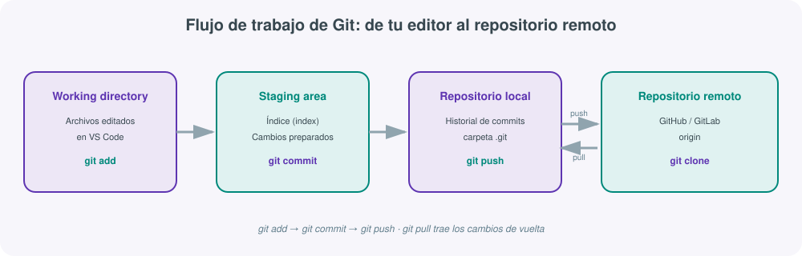
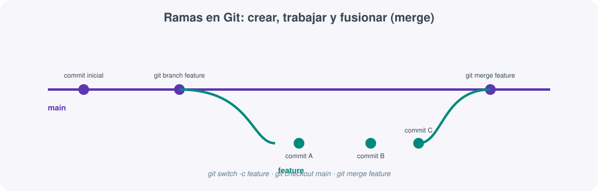
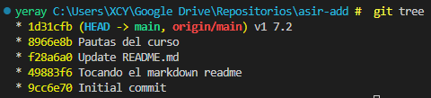
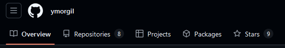
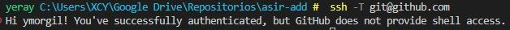
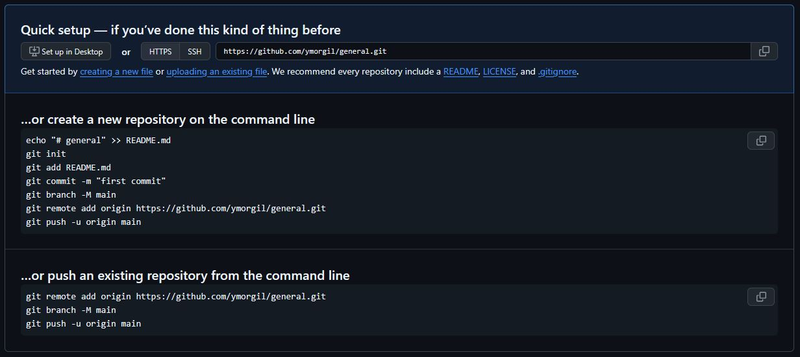
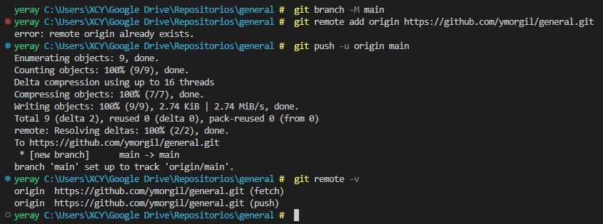
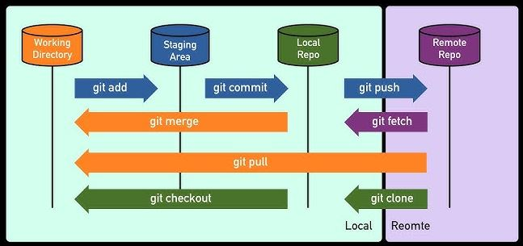

# **🧰 VSCode y control de versiones con Git**
Cualquier administrador de sistemas que escriba scripts —*ya sean de Bash, PowerShell o Python*— necesita dos herramientas que lo acompañarán en el día a día: 

1. Un **editor de código** que le facilite la vida (autocompletado, resaltado de sintaxis, terminal integrada) 
> **Visual Studio Code** (VSCode) como editor de referencia del módulo
2. Un **sistema de control de versiones** que le permita guardar el historial de cambios, deshacer errores y colaborar con otras personas sin pisarse el trabajo. 
> **Git** como sistema de control de versiones, trabajado siempre desde la línea de comandos: entender qué hace cada comando de Git es lo que permite luego usar con criterio cualquier interfaz gráfica (la propia de VSCode, GitHub Desktop, GitKraken...), y no al revés.
 
## 📟 Visual Studio Code
**Visual Studio Code** es un editor de código gratuito y multiplataforma (Windows, Linux, macOS) desarrollado por Microsoft. A diferencia de un IDE pesado como Visual Studio o IntelliJ, VSCode nace como un editor ligero que se convierte en un entorno de desarrollo completo mediante **extensiones**: la base del programa es la misma para todo el mundo, y cada perfil (desarrollador web, científico de datos, administrador de sistemas) lo adapta instalando el conjunto de extensiones que necesita.

### Primeros pasos

- **Windows**: se descarga el instalador desde [code.visualstudio.com](https://code.visualstudio.com/){:target="_blank"} o se instala con el gestor de paquetes `winget install Microsoft.VisualStudioCode`{: .yercod }.
- **Linux (Debian/Ubuntu)**: `sudo apt install code`{: .yercod } tras añadir el repositorio oficial de Microsoft, o descargando el paquete `.deb` directamente.
- **macOS**: descarga directa del `.zip` desde la web oficial, o `brew install --cask visual-studio-code` si se usa Homebrew.

!!! tip "Añadir VSCode al PATH"
    Durante la instalación en Windows, marca la casilla **"Add to PATH"**. Esto permite abrir cualquier carpeta directamente desde una terminal con el comando `code .` (el punto significa "la carpeta actual"), en lugar de tener que abrir VSCode y luego navegar manualmente hasta el proyecto.

Al abrir VSCode por primera vez conviene familiarizarse con las zonas principales de la interfaz:

- **Barra de actividad** (lateral izquierdo): iconos para cambiar entre el explorador de archivos, la búsqueda global, el control de código fuente (Git), depuración y extensiones.
- **Explorador**: el árbol de carpetas y archivos del proyecto abierto.
- **Editor**: la zona central, donde se edita el código; admite pestañas y divisiones en varias columnas.
- **Terminal integrada**: una consola completa (Bash, PowerShell, cmd...) empotrada en la parte inferior del editor.
- **Panel de extensiones**: el mercado (*marketplace*) desde el que se instalan complementos.


{width="1000"}

### Extensiones
La potencia real de VSCode aparece al instalar extensiones orientadas al perfil de administración de sistemas. Se instalan desde el icono de piezas de puzzle de la barra de actividad, o con el comando `code --install-extension <id>`{: .yercod } desde la terminal.

| Extensión | Autor | Para qué sirve |
|---|---|---|
| **Remote - SSH** | Microsoft | Conectarse y editar archivos directamente en un servidor remoto por SSH, como si fuera una carpeta local |
| **Python** | Microsoft | Autocompletado, linting, depuración y ejecución de scripts Python |
| **PowerShell** | Microsoft | Resaltado de sintaxis, depuración y IntelliSense para scripts `.ps1` |
| **Docker** | Microsoft | Gestión de imágenes, contenedores y ficheros `Dockerfile`/`docker-compose.yml` |
| **YAML** | Red Hat | Validación y autocompletado para ficheros de configuración (Ansible, Kubernetes, mkdocs.yml) |
| **Markdown All in One** | Yu Zhang | Vista previa, atajos y generación automática de índices para documentación en Markdown |
| **Material Icon Theme** | Philipp Kief | Iconos distintivos por tipo de archivo, útil para localizar rápido en árboles de proyecto grandes |
| **ShellCheck** | Timon Wong | Analiza scripts de Bash y avisa de errores y malas prácticas antes de ejecutarlos |

!!! note "Remote-SSH es la extensión más rentable para un sysadmin"
    En lugar de editar un script directamente en el servidor con `vi` o `nano` por SSH, o descargarlo, editarlo en local y volver a subirlo, **Remote-SSH** abre una sesión remota completa dentro de VSCode: el explorador de archivos, la terminal integrada y el editor operan directamente sobre el servidor remoto, con todas las ventajas de un editor moderno (autocompletado, extensiones) pero ejecutando todo en el propio destino.

### Terminal integrada
La terminal integrada de VSCode (`Ctrl+Ñ`) es tan importante como el editor: permite ejecutar scripts, comandos de Git o herramientas de línea de comandos sin salir de la ventana del editor.

- Se puede elegir el intérprete por defecto (Bash, PowerShell, WSL, Git Bash) desde el desplegable de la propia terminal o desde la paleta de comandos.
- Se pueden abrir **varias terminales en paralelo** (por ejemplo, una con Bash para lanzar el script y otra con `tail -f` para vigilar un log), organizadas en pestañas o divididas en paneles.
- El terminal hereda el directorio de trabajo del proyecto abierto, evitando tener que navegar con `cd` cada vez que se abre una ventana nueva.

!!! tip "Terminal dividida para depurar scripts"
    Un flujo de trabajo habitual al depurar un script de administración es dividir la terminal integrada en dos paneles: en el de la izquierda se edita y ejecuta el script (`./backup.sh`{: .yercod } ), y en el de la derecha se deja corriendo `journalctl -f`{: .yercod }  o `tail -f /var/log/syslog`{: .yercod }  para ver en tiempo real el efecto de cada ejecución.

### Proyectos y carpetas
VSCode organiza el trabajo en torno a **carpetas**, no en torno a archivos sueltos ni a proyectos con configuración propietaria como otros IDEs:

- **Abrir una carpeta**: `Archivo → Abrir carpeta...` o, desde la terminal, situarse en el directorio deseado y ejecutar `code .`{: .yercod }. Todo lo que haya dentro de esa carpeta —incluida una posible carpeta `.git`— pasa a formar parte del "espacio de trabajo".
- **Espacios de trabajo multi-raíz**: permiten tener abiertas varias carpetas no relacionadas entre sí (por ejemplo, un repositorio de scripts de Bash y otro de manifiestos de Ansible) dentro de la misma ventana, guardando esa combinación en un fichero `.code-workspace`.
- **Configuración por proyecto**: la carpeta oculta `.vscode/` dentro de un proyecto permite guardar ajustes específicos (`settings.json`), tareas automatizadas (`tasks.json`) y configuraciones de depuración (`launch.json`) que solo aplican a ese proyecto, sin afectar a la configuración global del editor.

### Atajos útiles
Memorizar un puñado de atajos ahorra muchísimo tiempo frente a navegar todo con el ratón. Estos son los que más se usan en el trabajo diario de scripting:

| Atajo (Windows/Linux) | Acción |
|---|---|
| `Ctrl+P` | Buscador rápido de archivos por nombre |
| `Ctrl+Mayús+P` | Paleta de comandos (acceso a cualquier función del editor) |
| `Ctrl+ñ` / `Ctrl+`` ` | Mostrar u ocultar la terminal integrada |
| `Ctrl+B` | Mostrar u ocultar la barra lateral |
| `Ctrl+Mayús+K` | Eliminar la línea actual |
| `Alt+↑` / `Alt+↓` | Mover la línea actual arriba o abajo |
| `Ctrl+D` | Seleccionar la siguiente aparición de la palabra seleccionada (edición múltiple) |
| `F2` | Renombrar símbolo (variable, función) en todo el archivo |
| `Ctrl+/` | Comentar o descomentar la línea o selección actual |
| `Ctrl+Mayús+E` | Ir al explorador de archivos |
| `Ctrl+Mayús+G` | Ir al panel de control de código fuente (Git) |

!!! tip "La paleta de comandos es el atajo maestro"
    Si no recuerdas un atajo concreto, `Ctrl+Mayús+P` abre la paleta de comandos: escribiendo el nombre de la acción en lenguaje natural ("format document", "toggle terminal", "git: clone") aparecen las opciones disponibles junto con su atajo de teclado asociado, lo que además ayuda a aprenderlos con el tiempo.

## 😾 Git (Control de versiones)
Git es un sistema de **control de versiones** diseñado para rastrear y gestionar cambios en archivos y proyectos de manera eficiente.  Este ayuda a los desarrolladores y equipos a colaborar de manera eficiente, manteniendo un registro completo de los cambios realizados en un proyecto. Es ideal para proyectos de software, pero también se puede usar para gestionar cualquier tipo de archivo, como documentos, páginas web o incluso proyectos creativos. Su uso garantiza la trazabilidad, la seguridad de los datos y la colaboración efectiva entre equipos.

Todo archivo bajo control de Git pasa por **tres áreas** conceptuales:

1. **Working directory** (directorio de trabajo): los archivos tal y como están en el disco, con los cambios que aún no se han "marcado" para guardar.
2. **Staging area** (área de preparación o índice): un espacio intermedio donde se colocan, con `git add`{: .yercod }, los cambios que se quieren incluir en el próximo commit.
3. **Repositorio local**: el historial de commits ya confirmados, almacenado en la carpeta oculta `.git/`.
 
> A esto se añade un cuarto elemento, el **repositorio remoto** (GitHub o GitLab), que sincroniza el historial local con una copia compartida a la que puede acceder el resto del equipo.



### Primeros pasos
Para instalar Git, accede a la [web oficial de Git](https://git-scm.com/){target="blank"} y descárgalo según tu sistema operativo.
Es recomendable comenzar trabajando con la terminal aunque VSCode incluye una **interfaz gráfica** para Git (icono de la rama en la barra de actividad), pero entender **los comandos de Git** es lo que de verdad permite trabajar con soltura, tanto en VSCode como en cualquier servidor remoto donde solo se disponga de una terminal. Git es un sistema de control de versiones **distribuido**: cada copia local del repositorio contiene el historial completo, no solo la versión actual de los archivos, lo que permite trabajar sin conexión y sincronizar los cambios cuando se desee. Hay otras alternativas GUI como **GitKraken o SourceTree**.

Antes de comenzar comprobar la versión instalada con: `git -v`{: .yercod}. Después antes del primer commit, Git necesita saber quién eres (esta información queda registrada en cada commit que hagas):

```bash
git config --global user.name "Tu Nombre"
git config --global user.email "tu_correo@ejemplo.com"

# Comprobar la configuración actual
git config --list
```

!!! note "--global frente a configuración local"
    - `--global` guarda la configuración para todos los repositorios del usuario en esa máquina (se almacena en `~/.gitconfig`). Si se omite `--global`, el ajuste solo aplica al repositorio en el que se ejecuta el comando.

### Repositorios
Un **repositorio** en Git es una estructura que almacena el historial completo de un proyecto: cada cambio, versión y autor queda registrado mediante commits. Puede ser local (en tu equipo) o remoto (en GitHub, GitLab, etc.), permitiendo control de versiones, trabajo con ramas paralelas y colaboración distribuida entre varios desarrolladores.

| Comando | Acción |
|---------|--------|
| `git init` | Inicializa un repositorio Git en el directorio actual. Al ejecutar Git crea una nueva carpeta oculta llamada **.git**, que contiene todos los archivos y configuraciones necesarias para hacer un seguimiento del historial de versiones. A partir de este momento, el directorio se convierte en un repositorio Git, y puedes comenzar a gestionar el código dentro de él. Este es el primer paso para iniciar el control de versiones de cualquier proyecto.|
| `git clone <url>` | Descarga una copia completa de un repositorio remoto existente, con todo su historial |
| `git clone <url> <carpeta>` | Igual que el anterior, pero guardando el resultado en una carpeta con el nombre indicado |

```bash
# Crear un repositorio desde cero en la carpeta actual
git init

# Clonar un repositorio ya existente en GitHub
git clone https://github.com/usuario/proyecto.git
```

### El ciclo básico
El ciclo básico de Git consta de tres pasos: 

1. `git status`{:.yercod} para ver el estado de los archivos.
2. `git add`{:.yercod} para preparar los cambios en el área de *staging*
3. `git commit`{:.yercod} para guardarlos permanentemente en el historial con un mensaje descriptivo que documente la modificación realizada.

> Este ciclo se repite cada vez que se realiza un avance significativo en el proyecto.

| Comando | Acción |
|---------|--------|
| `git status` | Muestra estado actual de tu repositorio. Al ejecutarlo, Git te mostrará información sobre los archivos que han sido modificados, los que están en el área de preparación **(staging area)** listos para ser commiteados, y los archivos que aún no han sido añadidos. También te indicará si hay algún cambio que aún no se ha guardado en el repositorio, proporcionándote una visión clara de lo que ha ocurrido hasta el momento. |
| `git add <archivo>` | Añadir archivos individuales al área de preparación, también conocida como staging area. Esto le indica a Git que deseas incluir esos archivos modificados en el siguiente commit. Es una forma de organizar qué cambios se registrarán, permitiendo un control más detallado sobre qué se guarda en cada momento. Si tienes varios archivos modificados pero solo deseas incluir algunos en el próximo commit, puedes añadirlos todos utilizando git add.|
| `git add .` | Añade todos los archivos modificados al área de preparación. |
| `git commit -m "mensaje"` | Este comando es utilizado para guardar los cambios en el repositorio. Al ejecutar git commit, Git toma todos los archivos que han sido añadidos al área de preparación mediante git add y los almacena en el historial del repositorio, creando un nuevo commit. El mensaje que proporcionas con -m debe ser una descripción breve pero clara de los cambios realizados. Este es un paso crucial en el proceso de control de versiones, ya que permite mantener un registro detallado de cada cambio en el proyecto. |

!!! tip "Un buen **mensaje de commit** no describe *cómo* se ha programado, sino **por qué** era necesario el cambio"
      - Usa el **modo imperativo**: "Añade validación de entrada" en lugar de "Añadido" o "Añadiendo".
      - Mantén la primera línea corta (menos de 50-72 caracteres) y, si hace falta más contexto, añade un párrafo explicativo tras una línea en blanco.
      - Un commit debe representar **un cambio lógico coherente**, no una mezcla de cosas no relacionadas: es preferible hacer varios commits pequeños que uno enorme y difícil de revisar.
      - Evita mensajes genéricos como "cambios", "fix" o "wip" en el historial que se va a compartir o revisar.

        | Mensaje poco útil | Mensaje recomendado |
        |---|---|
        | `fix` | `Corrige el cálculo de la fecha de expiración del certificado` |
        | `cambios varios` | `Añade rotación de logs y elimina credenciales del script` |
        | `wip` | `Refactoriza la función de backup para aceptar rutas remotas` |


```bash
git status
git add script_backup.sh
git commit -m "Añade script de copia de seguridad diaria"
```

!!! warning "git add . añade también lo que no querías"
    `git add .` es cómodo, pero añade indiscriminadamente todo lo que encuentre en la carpeta: archivos temporales, credenciales sueltas, carpetas de entornos virtuales... Antes de usarlo, revisa siempre `git status` y asegúrate de tener un `.gitignore` bien configurado.

!!! warning ".gitignore"
    No todos los archivos de una carpeta deben quedar bajo control de versiones: credenciales, entornos virtuales, archivos temporales o binarios generados no aportan valor al historial y solo lo ensucian. El fichero `.gitignore`, en la raíz del repositorio, lista patrones de archivos y carpetas que Git debe ignorar.

    ```text
    # .gitignore para un proyecto de scripting mixto
    *.log
    *.tmp
    __pycache__/
    venv/
    .env
    .vscode/*
    !.vscode/settings.json
    ```
    Si un archivo ya se añadió a Git antes de incluirlo en `.gitignore`, seguirá controlado por Git aunque coincida con un patrón del fichero. Para dejar de rastrearlo sin borrarlo del disco: `git rm --cached archivo`{:.yercod}.

### Ramas
Imagina que tu proyecto es un árbol, el **tronco** sería la rama principal (`main` o `master`) y cada **rama** nueva es como una rama lateral donde puedes trabajar sin tocar el código principal (línea de desarrollo independiente). Esta rama es una **copia** del estado actual del proyecto y puedes trabajar ahí sin afectar otras ramas. Se usa para:

- Probar nuevas ideas o funciones sin romper el código que ya funciona.
- Trabajar en equipo, donde cada persona trabaja en su propia rama.
- Organizar el desarrollo, separando tareas como corregir errores o añadir mejoras.



| Comando | Acción |
|---|---|
| `git branch` | Lista las ramas existentes en el repositorio local |
| `git branch <nombre>` | Crea una rama nueva a partir del commit actual, sin cambiarse a ella |
| `git branch -d <nombre>` | Elimina una rama ya fusionada |
| `git branch -D <nombre>` | Fuerza la eliminación de una rama, aunque tenga cambios sin fusionar |
| `git branch -m nuevo_nombre` | Renombrar una rama |
| `git checkout <nombre>` | Cambia a la rama indicada (comando clásico, también sirve para restaurar archivos) |
| `git switch <nombre>` | Cambia a la rama indicada (comando moderno, pensado exclusivamente para ramas) |
| `git switch -c <nombre>` | Crea la rama y se cambia a ella en un solo paso |
| `git merge nombre_rama` | Fusiona la rama indicada con la rama actual. |

### Resolución de conflictos
`git merge`{:.yercod} integra los cambios de una rama en la rama actual. 

Si las modificaciones están en líneas diferentes del mismo archivo, Git puede fusionar sin conflicto pero si ambas ramas han modificado las mismas líneas de un mismo archivo, Git no puede decidir automáticamente qué versión conservar y se produce un **conflicto de fusión**, Git marca directamente en el archivo afectado las dos versiones en pugna:

```text
<<<<<<< HEAD
echo "Versión de la rama main"
=======
echo "Versión de la rama feature-login"
>>>>>>> feature-login
```

Pasos para resolverlo:

1. Abrir el archivo en VSCode: la extensión de Git integrada resalta el conflicto y ofrece botones para "Aceptar cambio actual", "Aceptar cambio entrante" o "Aceptar ambos".
2. Editar manualmente el archivo hasta dejar el contenido final correcto, eliminando las marcas `<<<<<<<`, `=======` y `>>>>>>>`.
3. Marcar el conflicto como resuelto añadiéndolo al área de preparación: `git add archivo_en_conflicto.sh`.
4. Completar la fusión con `git commit` (Git ya propone un mensaje por defecto para el commit de fusión).

!!! tip "Los conflictos no son un error, son una pregunta"
    Un conflicto de fusión no significa que algo se haya roto: significa que Git necesita que una persona decida entre dos cambios legítimos que no puede reconciliar por sí solo. Cuanto más pequeños y frecuentes sean los commits, y más se sincronice con `git pull` antes de empezar a trabajar, menos conflictos —y más sencillos— aparecerán.

### Repositorio remoto
Un **repositorio remoto** es una copia del proyecto alojada en un servidor externo, como GitHub o GitLab, que permite colaborar con otras personas, compartir el código y mantener una copia de seguridad fuera del equipo local. Facilita sincronizar cambios entre distintos colaboradores y dispositivos, centralizando el historial del proyecto.

- **`origin`** es el nombre por defecto que Git asigna al repositorio remoto principal cuando se clona o se vincula un proyecto. No es una palabra reservada, sino una convención: al hacer `git clone`, Git crea automáticamente ese alias apuntando a la URL remota, facilitando comandos como `git push origin main` sin escribir la URL completa cada vez.

| Comando | Acción |
|---|---|
| `git remote -v` | Muestra las URL remotas configuradas (normalmente `origin`) |
| `git remote add origin <url>` | Asocia un repositorio remoto a un repositorio local recién creado con `git init` |
| `git push` | Sube los commits locales al repositorio remoto |
| `git push -u origin <nombre rama>` | Sube la rama y establece el seguimiento (*upstream*), necesario la **primera vez** que se sube una rama nueva |
| `git push origin --delete nombre_rama` | Eliminar una rama remota |
| `git pull` | Descarga los cambios del remoto y los fusiona en la rama local (equivale a `git fetch` + `git merge`) |
| `git pull origin nombre_rama` | Traer y fusionar cambios de una rama remota a tu rama local. (**Descargar**) |
| `git fetch` | Descarga los cambios del remoto sin fusionarlos todavía, para poder revisarlos antes |


!!! warning "Cuidado con git push --force"
    `git push --force` sobrescribe el historial remoto con el historial local, **incluso si eso hace desaparecer commits que ya habían subido otras personas**. Nunca debe usarse sobre una rama compartida sin avisar al equipo. La alternativa más segura es `git push --force-with-lease`, que aborta la operación si detecta que el remoto tiene commits que tu copia local no conoce todavía.

### Historial
El **historial de Git** registra todos los commits realizados en un proyecto, permitiendo consultar quién hizo cada cambio, cuándo y por qué. Sirve para rastrear la evolución del código, recuperar versiones anteriores, identificar el origen de errores y entender el contexto de las decisiones tomadas a lo largo del desarrollo.

| Comando | Descripción |
|---|---|
| `git log` | Muestra el historial completo de commits (autor, fecha, mensaje, hash) |
| `git log --oneline` | Una línea por commit, con el hash abreviado y el mensaje |
| `git log --graph --oneline --all` | Representación visual en texto de ramas y fusiones |
| `git diff` | Muestra las diferencias entre el directorio de trabajo y el área de preparación |
| `git diff --staged` | Muestra las diferencias ya preparadas para el próximo commit |
| `git show <hash>` | Muestra el contenido completo de un commit concreto |

!!! tip "Creación de alias que muestra los logs en formato de árbol"
    `git config --global alias.tree "log --all --graph --pretty=oneline --decorate --oneline"`{:.yercod}

    - ``--all``: Muestra el historial de todas las ramas, incluidas las ramas remotas y locales.
    - ``--graph``: Representa gráficamente el historial de confirmaciones como un árbol con líneas que conectan las ramas y fusiones.
    - ``--pretty=oneline``: Muestra cada commit en una sola línea, lo que proporciona un resumen compacto del historial.
    - ``--decorate``: Añade información adicional sobre las referencias, como nombres de ramas o etiquetas, asociadas a cada commit.
    - ``--oneline``: Es un atajo para combinar --pretty=oneline y limitar la salida del identificador de cada commit a su abreviatura.
    Para ejecutarlo, usa: `git tree`{:.yercod}

    

## 🐺 GITHUB
Plataforma de desarrollo colaborativo basada en la web que utiliza Git como sistema de control de versiones. Permite a los desarrolladores almacenar y gestionar proyectos de software, así como colaborar con otros usuarios. GitHub ofrece un entorno donde los usuarios pueden trabajar de manera conjunta en proyectos de código abierto y privado, facilitando la administración de versiones de código y el seguimiento de cambios realizados en el repositorio a lo largo del tiempo.


     
1. `Overview`: **Visión general** del repositorio o perfil. En ella, puedes encontrar información importante sobre el proyecto, como una descripción, estadísticas clave, como el número de commits recientes, contribuciones y otros detalles relevantes. También puedes ver información de la comunidad y actividades recientes, como pull requests abiertos o cerrados, y issues.
2. `Repositories`: **Lista de todos los repositorios** que el usuario ha creado o en los que tiene participación. Cada repositorio se presenta con su nombre, una breve descripción, el estado actual (activo o archivado) y la fecha del último commit. Desde esta pestaña, los usuarios pueden acceder directamente a cualquiera de sus repositorios para explorar el código, realizar modificaciones o colaborar con otros.
3. `Projects`: **Gestionan los proyectos** dentro de GitHub. Los proyectos son tableros o listas de tareas que ayudan a organizar y seguir el progreso de un conjunto de issues o tareas dentro de un repositorio. Aquí, puedes crear un nuevo proyecto, añadir columnas (como "Pendiente", "En progreso", "Finalizado") y asociar issues o pull requests a esas columnas, facilitando así el seguimiento y la colaboración en tareas específicas.
4. `Packages`: **Gestionar los paquetes o dependencias** que se utilizan dentro del repositorio o que el repositorio mismo publica. GitHub permite almacenar y compartir paquetes de software, como bibliotecas o herramientas, mediante GitHub Packages. Esta sección ofrece un espacio para ver y gestionar los paquetes publicados, incluyendo las versiones disponibles y las configuraciones relacionadas con su uso.
5. `Stars`: **Repositorios que te gustan** o encuentras útiles. Al dar una estrella a un repositorio, lo estás marcando como favorito y lo añades a tu lista de repositorios favoritos. Esto sirve como una herramienta de organización personal, pero también permite a otros ver qué proyectos has encontrado interesantes o valiosos. Los repositorios con muchas estrellas suelen ser populares y bien valorados dentro de la comunidad de GitHub.

### Repositorios remoto
Un **repositorio** es un espacio donde se guarda el código de un proyecto junto con su historial de cambios. Gracias a los repositorios, podemos llevar un control detallado de todas las versiones y colaborar con otras personas de forma ordenada. Una vez creada la cuenta en GitHub, puedes crear todos los repositorios que desees, tanto públicos como privados.

| Repositorio    | Tipo               |
|---------------|------------------------|
| Repositorio Local         | Se encuentra en tu propio ordenador. Aquí realizas tus cambios, añades archivos y guardas las versiones usando Git. Puedes trabajar sin conexión, y una vez que quieras compartir tu trabajo, sincronizas los cambios con un repositorio remoto.        |
| Repositorio Remoto        | Está alojado en un servidor, por ejemplo, en GitHub. Sirve para compartir tu proyecto con otros usuarios o para tener una copia de seguridad en la nube. Se conecta con el repositorio local para subir y descargar cambios.|
|Repositorio Principal| Con el mismo nombre que tu cuenta tiene un propósito especial, ya que puede ser utilizado para alojar una página web personal usando **GitHub Pages**, y también sirve como punto de referencia para otros proyectos que puedas tener. Además, cualquier cambio realizado en este repositorio principal se reflejará directamente en tu perfil de GitHub, lo que lo convierte en una vitrina de tu trabajo y contribuciones.  `https://github.com/<usuario>/<repositorio>`.|

La **sincronización** entre un repositorio local y su contraparte en GitHub permite mantener actualizados los cambios realizados en tu máquina con la copia almacenada en la nube, garantizando así un flujo de trabajo continuo y seguro. Este proceso facilita la colaboración entre varios desarrolladores, ya que todos pueden acceder a la última versión del proyecto y aportar modificaciones de forma coordinada. Además, ofrece ventajas como el respaldo automático de tu trabajo, la posibilidad de trabajar desde diferentes dispositivos sin perder cambios, el control de versiones para recuperar estados anteriores y la integración con herramientas de desarrollo.

Pasos básicos para trabajar de manera eficiente:

---

**⇒ 01 GITHUB**

Crear una cuenta en GitHub es un proceso sencillo que te permite acceder a la plataforma de control de versiones y almacenamiento de código en la nube. Para ello, basta con visitar [https://github.com](https://github.com){target="_blank"} y pulsar en "**Sign up**", donde deberás proporcionar un nombre de usuario único, un correo electrónico válido y una contraseña segura. Una vez completados estos datos, GitHub te guiará a través de la verificación de tu correo electrónico y la configuración inicial de tu perfil, incluyendo opciones como la visibilidad de tus repositorios y preferencias de notificación. Tener una cuenta en GitHub te da acceso a crear repositorios, colaborar en proyectos de otros usuarios y utilizar herramientas de gestión de versiones de manera eficiente.

---

**⇒ 02 AUTETIFICACIÓN SSH**

La autenticación SSH con GitHub te permite establecer una conexión segura entre tu máquina local y GitHub sin necesidad de introducir tu usuario y contraseña en cada operación. Esto se logra mediante un par de claves criptográficas, una privada que se guarda en tu equipo y una pública que se asocia a tu cuenta de GitHub.

1. Para comenzar, primero verifica si ya tienes un par de claves SSH existente ejecutando el comando `ls -al ~/.ssh`{:.yercod}. Si en la salida aparecen archivos como `id_ed25519` y `id_ed25519.pub` significa que ya tienes una clave generada y podrías reutilizarla. En caso contrario, debes generar un nuevo par de claves con `ssh-keygen -t ed25519 -C "tuemail@example.com"`{:.yercod}. Este comando crea una clave segura y la asocia a tu correo electrónico de GitHub. 
2. Una vez creada, es necesario añadir la clave privada al agente SSH para que se gestione automáticamente. Inicia el agente con `eval "$(ssh-agent -s)"`{:.yercod} y añade tu clave con `ssh-add ~/.ssh/id_ed25519`{:.yercod}. Después de esto, obtén el contenido de la clave pública usando `cat ~/.ssh/id_ed25519.pub`{:.yercod} y copia todo el texto que se muestre, que empezará por `ssh-ed25519`.
3. El siguiente paso es registrar esta clave pública en GitHub. Para ello, inicia sesión, entra en **Settings → SSH and GPG keys**, pulsa en **New SSH key**, escribe un título descriptivo para identificar el dispositivo y pega la clave pública en el campo correspondiente. Guarda los cambios y la clave quedará vinculada a tu cuenta.
4. Para verificar que la conexión funciona correctamente, utiliza `ssh -T git@github.com`{:.yercod}. Si todo está bien, recibirás un mensaje indicando que la autenticación fue exitosa.



Para más información y detalles, consulta la documentación oficial de GitHub sobre [configuración de SSH](https://docs.github.com/es/authentication/connecting-to-github-with-ssh){target="_blank"} 

---

**⇒ 03 SINCRONIZAR REPOSITORIOS**

Cuando ya tienes un repositorio local (**con algún commit**) y deseas subirlo a GitHub, primero es necesario crear un repositorio vacío en GitHub. Esto se hace desde la plataforma web pulsando en **New repository**, eligiendo un nombre para el repositorio y asegurándote de **no** añadir archivos como README, `.gitignore` o licencia si ya existen en tu proyecto local, para evitar conflictos. Una vez creado el repositorio en GitHub, obtienes la URL del mismo, esta se utiliza para enlazar tu repositorio local con el remoto mediante el comando `git remote add origin <URL-del-repositorio>`. 



A partir de este momento,asegúrate de que tu rama principal se llama `main` con `git branch -M main`{:.yercod} y sube el contenido con `git push -u origin main`{:.yercod}. Es recomendable usar `git push -u origin main`{:.yercod} la primera vez para establecer la relación entre la rama local y la remota. Después de eso, podrás usar simplemente `git push`{:.yercod} para actualizar los cambios.



---

**RESUMEN**



### Flujo colaborativo
Conjunto de prácticas y herramientas que permiten a los desarrolladores trabajar de manera conjunta y eficiente en un proyecto, gestionando versiones, contribuciones y revisiones de código de forma ordenada. GitHub, al ser una plataforma basada en Git, facilita la colaboración en proyectos a través de repositorios remotos y diversas funcionalidades como pull requests, branches y revisiones de código. **Procedimiento:**

**1. Haz un "fork" del repositorio** 
>   Significa crear una copia del repositorio original bajo tu cuenta de GitHub. Esto te permite experimentar y hacer cambios en el código sin modificar el proyecto original. Es un paso necesario para contribuir a proyectos de código abierto donde no tienes permisos directos de escritura.

**2. Clona el fork en local** 
> Una vez que has hecho un fork, el siguiente paso es clonar el repositorio a tu máquina local con el comando `git clone`{:.yercod}. Esto crea una copia exacta de tu repositorio en tu computadora, permitiéndote realizar cambios de manera local antes de enviarlos de vuelta a GitHub.

**3. Realiza cambios, añade commits y sube los cambios con `git push`**
>Después de clonar el repositorio, puedes hacer cambios en el código. Una vez realizados los cambios, debes hacer un commit para guardarlos en tu repositorio local. Luego, subes esos cambios al repositorio remoto (tu fork) utilizando `git push`{:.yercod}. Esto permite que tus modificaciones estén disponibles en GitHub.

**4. Sincroniza el fork si hay cambios en el repositorio original**
> Si otros colaboradores han realizado cambios en el repositorio original después de hacer tu fork, es importante mantener tu fork actualizado. Esto se hace sincronizando tu fork con el repositorio original mediante comandos como `git fetch`{:.yercod} y `git merge`{:.yercod}, para que puedas integrar los cambios más recientes antes de enviar tu **pull request**.

**5. Propón cambios mediante un "pull request"**
> Una vez que hayas subido tus cambios a tu repositorio remoto, el siguiente paso es abrir un pull request (PR) en el repositorio original. Esto es una solicitud para que el propietario del repositorio revise tus cambios y los integre en el proyecto principal. El PR facilita la discusión y revisión del código propuesto.

**6. El propietario del repositorio original revisará y aceptará los cambios**
> El propietario o mantenedor del repositorio original revisará los cambios propuestos en el pull request. Si todo está correcto, lo fusionará con la rama principal del repositorio. Si es necesario, puede pedir modificaciones adicionales antes de aceptar el PR. Una vez aprobado, los cambios se incorporan oficialmente al proyecto.

### Herramientas

**GUI**

Permiten gestionar repositorios sin usar exclusivamente la línea de comandos. Facilitan tareas como crear commits, revisar el historial, resolver conflictos, manejar ramas y sincronizar con repositorios remotos en GitHub mediante botones, menús y paneles interactivos. Ejemplos populares incluyen GitHub Desktop, Sourcetree, GitKraken o la integración gráfica que ofrecen editores como Visual Studio Code. Estas herramientas son útiles para quienes están empezando o prefieren una experiencia visual, aunque conocer los comandos básicos de Git sigue siendo esencial para un control total del flujo de trabajo.

- [GitHub Desktop](https://desktop.github.com/){target="_blank"} 
- [GitKraken](https://www.gitkraken.com/){target="_blank"} 
- [SourceTree](https://www.sourcetreeapp.com/){target="_blank"} 

### GitHub Pages
Servicio gratuito que permite crear y alojar sitios web directamente desde un repositorio de GitHub. Es ideal para proyectos personales, blogs, portafolios y documentación técnica. Basta con configurar un repositorio con archivos estáticos (HTML, CSS, JavaScript) para que GitHub Pages aloje el contenido en línea, generando una URL bajo el dominio **`github.io`**. La publicación se gestiona desde el propio repositorio, lo que facilita el control de versiones, la colaboración y la automatización del despliegue.

**Generadores de sitios estáticos compatibles**

> **Hugo**: generador de sitios estáticos de código abierto que crea sitios web rápidos y eficientes a partir de contenido escrito en Markdown. Convierte esos archivos en páginas HTML completamente funcionales, destacando por su gran velocidad de compilación. Se usa habitualmente para blogs, documentación de proyectos y sitios personales, y se integra fácilmente con GitHub Pages, sin necesidad de servidores complejos: solo hay que generar los archivos estáticos y subirlos al repositorio.

---

> **MkDocs**: generador de sitios estáticos escrito en Python, orientado específicamente a documentación técnica a partir de archivos Markdown. Es muy popular junto al tema **Material for MkDocs**, y también se despliega sin problemas en GitHub Pages.

### GitHub Actions

Plataforma de integración y entrega continua (CI/CD) integrada directamente en GitHub que permite **automatizar** flujos de trabajo a partir de eventos del repositorio, como un `push`, un `pull request` o la creación de una nueva etiqueta. Cada flujo de trabajo se define mediante un archivo YAML ubicado en **`.github/workflows/`**, donde se especifican los eventos que lo activan (**`on`**) y la secuencia de tareas (**`jobs`**) que se ejecutan en máquinas virtuales proporcionadas por GitHub (runners).

En el contexto de sitios estáticos, GitHub Actions es especialmente útil para automatizar el proceso de compilación y despliegue: cada vez que se sube un cambio al repositorio, un workflow puede instalar las dependencias necesarias, generar el sitio (por ejemplo, con `mkdocs build` o `hugo`) y publicar el resultado automáticamente en GitHub Pages, sin necesidad de hacerlo manualmente. Esto permite mantener la documentación siempre actualizada con cada commit, integrando control de versiones y publicación en un mismo flujo.

Un ejemplo típico de workflow para desplegar un sitio MkDocs sería:

```yaml
name: Deploy MkDocs
on:
  push:
    branches:
      - main

jobs:
  deploy:
    runs-on: ubuntu-latest
    steps:
      - uses: actions/checkout@v4
      - uses: actions/setup-python@v5
        with:
          python-version: 3.x
      - run: pip install mkdocs-material
      - run: mkdocs gh-deploy --force
```

## 📄 Markdown
Lenguaje de marcado ligero diseñado para ser fácil de leer y escribir, utilizado principalmente para convertir texto plano en contenido estructurado que se puede convertir a HTML. Su sintaxis es simple y consiste en una serie de símbolos y caracteres especiales que permiten dar formato al texto, como encabezados, negritas, listas, enlaces, imágenes, entre otros, sin perder la legibilidad del texto original.

Su uso es muy común en plataformas de colaboración en línea, como GitHub, Reddit, y muchas otras, donde los usuarios pueden escribir documentos, comentarios o documentación técnica de manera sencilla y efectiva. Los desarrolladores lo utilizan para escribir archivos README, documentación de proyectos o incluso para redactar mensajes en foros y blogs. La principal ventaja de Markdown es que, aunque se usa para generar contenido con formato, el texto es legible y fácilmente editable como texto plano. Además, se puede convertir de manera eficiente a otros formatos, como HTML, lo que lo convierte en una herramienta muy popular para crear contenido web.

**SINTAXIS BÁSICAS**

| Element         | Markdown Syntax                           |
|-----------------|-------------------------------------------|
| **Heading**     | `# H1` `## H2` `### H3`             |
| **Bold**        | `**bold text**`                           |
| **Italic**      | `*italicized text*`                       |
| **Blockquote**  | `> blockquote`                            |
| **Lista ordenada**| `1. First item`<br>`2. Second item`<br>`3. Third item` |
| **Lista desordenada**| `- First item`<br>`- Second item`<br>`- Third item` |
| **Código**        | `` `code` ``                              |
| **Línea Horizontal** | `---`                                  |
| **Enlace**        | `[title](https://www.example.com)`        |
| **Imagen**       | ``                  |

## Recursos
- [Web oficial Git](https://git-scm.com/){target="_blank"} 
- [Libro de Git en español](https://git-scm.com/book/es/v2){target="_blank"} 
- [Documentación de GitHub](https://docs.github.com/){target="_blank"} 
- [Configuración SSH](https://docs.github.com/es/authentication/connecting-to-github-with-ssh){target="_blank"} 
- [GitHub Pages](https://pages.github.com/){target="_blank"} 
- [GitHub Actions](https://github.com/features/actions){target="_blank"} 
- [Retos de programación de la comunidad](https://github.com/mouredev/){target="_blank"} 
- [Guía de Markdown en GitHub](https://docs.github.com/es/get-started/writing-on-github){target="_blank"} 
- [Sintaxis de Markdown](https://markdown.es/sintaxis-markdown/){target="_blank"} 


