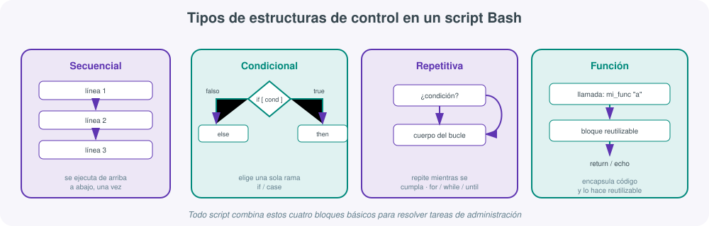
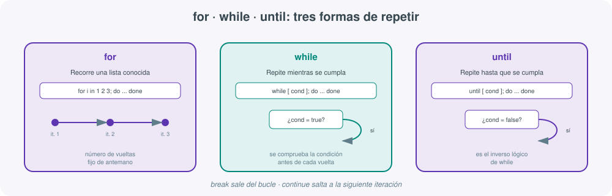
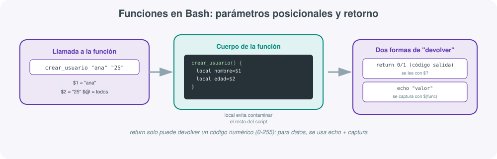

#  🖥️ Scripting en Bash 

El **scripting** consiste en la creación y ejecución de secuencias de comandos que automatizan tareas, estos  suelen estar escritos en lenguajes de alto nivel como Python, Ruby, Perl, JavaScript o Shell, y permiten agilizar procesos repetitivos. Son fáciles de aprender y usar, se escriben dinámicamente sin necesidad de un archivo de punto de entrada y se pueden ejecutar directamente en una terminal. 


**Características**

- **Interactividad**: Permite la ejecución de comandos uno por uno.
- **Automatización**: Permite crear scripts para tareas repetitivas que permiten la administración de sistemas y redes como copias de seguridad, actualización de sistemas, etc.
- **Usabilidad**: Es ampliamente utilizado en servidores para administrar sistemas y realizar tareas de mantenimiento.

 

## Comandos

| Comando | Descripción | Ejemplo |
|---|---|---|
|**Navegación de Directorios**{:.yerbold}|||
| `pwd` | Muestra la ruta actual | `pwd` |
| `ls`<br>`ls -l` <br>`ls -a` | Lista los archivos y carpetas en el directorio actual<br>Lista con detalles <br>Muestra archivos ocultos| `ls` |
| `cd <directorio>` | Cambia al directorio especificado | `cd /var/www` |
| `cd ..` | Retrocede un nivel en el árbol de directorios | `cd ..` |
| `cd ~` | Cambia al directorio principal del usuario | `cd ~` |
|**Gestión de Archivos y Directorios**{:.yerbold}|||
| `touch <archivo>` | Crea un archivo vacío | `touch notas.txt` |
| `mkdir <directorio>` | Crea un nuevo directorio | `mkdir proyectos` |
| `rm <archivo>` | Elimina un archivo | `rm archivo.txt` |
| `rm -r <directorio>` | Elimina un directorio y su contenido recursivamente | `rm -r carpeta_vieja` |
| `cp <origen> <destino>` | Copia archivos o directorios | `cp notas.txt copia_notas.txt` |
| `mv <origen> <destino>` | Mueve o renombra archivos o directorios | `mv documento.txt /tmp/` |
|**Visualización y Edición de Archivos**{:.yerbold}|||
| `cat <archivo>` | Muestra el contenido completo de un archivo | `cat /etc/hosts` |
| `head <archivo>` | Muestra las primeras 10 líneas de un archivo | `head -n 5 log.txt` |
| `tail <archivo>` | Muestra las últimas 10 líneas de un archivo | `tail -f /var/log/syslog` |
| `nano <archivo>` | Edita el archivo usando el editor de texto `nano` | `nano config.json` |
|**Redirección y Pipes**{:.yerbold}|||
| `>` | Redirecciona la salida a un archivo (sobrescribiendo) | `echo "Hello" > archivo.txt` |
| `>>` | Redirecciona la salida y la añade al final del archivo | `echo "Nueva línea" >> archivo.txt` |
| `<` | Toma la entrada desde un archivo | `sort < lista.txt` |
| `|` | Pasa la salida de un comando como entrada de otro | `cat archivo.txt | grep "texto"` |
|**Búsqueda**{:.yerbold}|||
| `grep <texto> <archivo>` | Busca texto específico dentro de un archivo | `grep "ERROR" app.log` |
| `grep -i "texto" archivo.txt` | Búsqueda sin distinguir mayúsculas/minúsculas | `grep -i "texto" archivo.txt` |
| `find <directorio> -name <nombre>` | Busca archivos o directorios por nombre | `find . -name "*.pdf"` |
|**Procesamiento de Texto**{:.yerbold}|||
| `awk` | Procesamiento y análisis de texto en función de patrones | `awk '{print $1}' archivo.txt`<br>`awk '/patrón/ {print $0}' archivo.txt`<br>`awk -F , '{print $2}' archivo.csv` |
| `cut` | Extrae secciones de cada línea de un archivo o entrada estándar | `cut -d: -f1 /etc/passwd`<br>`cut -c1-5 archivo.txt`<br>`cut -f2 archivo.txt` |
| `sed` | Editor de flujo para realizar sustituciones y manipulaciones de texto | `sed 's/patrón/nuevo_texto/g' archivo.txt`<br>`sed -n '2,4p' archivo.txt`<br>`sed '/^$/d' archivo.txt` |
|**Alias**{:.yerbold}|||
| `alias nombre='comando'` | Crea un alias para un comando | `alias ll='ls -la'` |
| `unalias nombre` | Elimina un alias existente | `unalias ll` |
|**Comandos Útiles**{:.yerbold}|||
| `echo <texto>` | Muestra un texto en la terminal | `echo "Hola mundo"` |
| `date` | Muestra la fecha y hora actual | `date` |
| `clear` | Limpia la pantalla de la terminal | `clear` |
| `history` | Muestra el historial de comandos ejecutados | `history` |
| `whoami` | Muestra el usuario actual en la sesión | `whoami` |
| `uname -a` | Muestra información detallada del sistema | `uname -a` |
| `df -h` | Muestra el uso de espacio en disco de forma legible | `df -h` |
| `du -h <archivo/directorio>` | Muestra el tamaño de un archivo o directorio | `du -h /var/log` |
| `uptime` | Muestra el tiempo que el sistema ha estado activo | `uptime` |
|**Permisos**{:.yerbold}|||
| `chmod <permisos> <archivo>` | Cambia los permisos de acceso de un archivo | `chmod 755 script.sh`<br>`chmod +x script.sh`<br>`chmod -r archivo.txt` |
| `chown <usuario>:<grupo> <archivo>` | Cambia el propietario y/o grupo de un archivo o directorio | `chown usuario archivo.txt`<br>`chown usuario:grupo archivo.txt`<br>`chown -R usuario:grupo /var/www` |
| `chgrp <grupo> <archivo>` | Cambia el grupo al que pertenece un archivo o directorio | `chgrp grupo archivo.txt`<br>`chgrp -R grupo /directorio` |
| `umask <máscara>` | Establece los permisos por defecto para nuevos archivos/directorios | `umask 022`<br>`umask 077` |
|**Redes**{:.yerbold}|||
| `ping <dirección>` | Prueba la conectividad de red con un host | `ping google.com` |
| `ifconfig` | Muestra la configuración de red (sistemas legados) | `ifconfig` |
| `ip addr` | Muestra la configuración de red en sistemas modernos | `ip addr` |
| `curl <URL>` | Realiza solicitudes HTTP y descarga contenido | `curl https://api.example.com` |
| `wget <URL>` | Descarga archivos directamente desde Internet | `wget https://example.com/file.zip` |
| `ssh usuario@host` | Inicia una conexión remota segura por SSH | `ssh root@192.168.1.1` |
| `scp <origen> <destino>` | Copia archivos de forma segura entre hosts | `scp foto.jpg usuario@servidor:/ruta/` |
| `netstat -tuln` | Muestra las conexiones de red activas y puertos en uso | `netstat -tuln` |
|**Gestión de Procesos**{:.yerbold}|||
| `ps` | Muestra los procesos en ejecución | `ps aux` |
| `top` | Muestra una lista dinámica y en tiempo real de los procesos | `top` |
| `kill <PID>` | Termina un proceso utilizando su ID de proceso (PID) | `kill 1234` |
| `killall <nombre>` | Termina todos los procesos asociados a ese nombre | `killall firefox` |

## Wildcards

| Comodín | Significado                                 | Ejemplo             | Coincidencias típicas             |
|---------|---------------------------------------------|---------------------|-----------------------------------|
| `*`     | Cualquier cantidad de caracteres (incluido ninguno) | `*.txt`             | `nota.txt`, `resumen.txt`, etc.   |
| `?`     | Un solo carácter (cualquiera)               | `archivo?.log`      | `archivo1.log`, `archivoA.log`    |
| `[abc]` | Un solo carácter que sea `a`, `b` o `c`     | `file[123].txt`     | `file1.txt`, `file2.txt`, etc.    |
| `[a-z]` | Un solo carácter en ese rango               | `letra[a-z].sh`     | `letraa.sh`, `letrab.sh`, etc.    |
| `[!abc]` o `[^abc]` | Cualquier carácter excepto `a`, `b` o `c` | `file[!0-9].txt`     | `filea.txt`, `file_.txt`, etc.    |
| `{uno,dos}` | Expansión de lista, separado por comas  | `echo {uno,dos}`    | `uno dos` (expande ambas opciones)|
| `{1..3}` | Expansión de rango numérico o alfabético   | `file{1..3}.txt`    | `file1.txt`, `file2.txt`, `file3.txt` |


## Script

Un script de Bash no es más que una lista de comandos guardada en un archivo, pero lo que convierte esa lista en un **programa** capaz de tomar decisiones y adaptarse a distintas situaciones son sus **estructuras de control**. Este apartado las presenta separadas por tipo —secuenciales, condicionales, repetitivas y funciones— porque cada una resuelve un problema distinto y conviene tenerlas bien diferenciadas antes de empezar a combinarlas en scripts reales de administración de sistemas.



- **Estructura secuencial**: ejecución de instrucciones en el orden en que aparecen, sin saltos ni repeticiones.
- **Estructura condicional**: bloque de código que se ejecuta solo si se cumple (o no) una condición (`if`, `case`).
- **Estructura repetitiva (bucle)**: bloque de código que se ejecuta varias veces (`for`, `while`, `until`).
- **Función**: bloque de código con nombre propio, reutilizable y que puede recibir parámetros.
- **Parámetro posicional**: argumento recibido por un script o función, referenciado como `$1`, `$2`...
- **Variable local**: variable cuyo alcance queda restringido al cuerpo de la función donde se declara con `local`.
- **Código de salida**: valor numérico (0-255) que indica si un comando o función terminó con éxito (0) o con error (distinto de 0).

### Sintaxis

En **GNU/Linux**, los scripts suelen tener extensiones como .bash o **.sh** (no obligatorias), y es importante incluir la primera línea `#!/bin/bash`{:.yercod} para que funcionen correctamente. 
  ```bash
  #!/bin/bash
  #!/bin/ksh
  #!/bin/csh
  ```

**Pasos para crear un script**

1. Abrir editor de texto.  
2. Escribir el código (incluir `#!/bin/bash`).  
3. Guardar el archivo con extención .sh. 
4. Dar permisos de ejecución (`chmod +x script.sh`{:.yercod}).  
5. Ejecutarlo. `bash script.sh `{:.yercod} 

**Buenas prácticas y recomendaciones para Bash**

- Usar comentarios claros con `#`.  
- Definir variables al inicio del script y hacerlas adaptables (rutas relativas, variables de entorno).  
- Respetar identado y espacios; Bash no obliga a tabulaciones pero sí hay que cuidar los espacios.  
- Cerrar siempre bucles y condiciones.  
- Plantear la lógica en pseudocódigo antes de implementarla.  
- Seguir un criterio nemotécnico para nombres de variables y funciones.  
- Añadir README si el proyecto o script es complejo.  
- Usar la forma correcta según sea `[ ]`, `[[ ]]` o `(( ))`.  
- Para funciones, mostrar claramente los parámetros con `$1`, `$2`, etc., y documentar su uso.  
- Mantener el código limpio, legible y modular para facilitar su mantenimiento y comprensión.

### Variables

Una variable es un contenedor que almacena datos (texto, números o rutas) en memoria para reutilizarlos en el sistema. Se define escribiendo **NOMBRE=valor** (sin espacios) y se invoca anteponiendo un signo de dólar, como **$NOMBRE**. Permite automatizar scripts y gestionar la información dinámicamente.

En Bash no es necesario declarar **tipo** pero en otros lenguajes si:

  - Entero → `42, -10`  
  - Flotante → `3.14, -0.5`  
  - String → `"Hola"`  
  - Booleano → `True/False`  
  - Lista → `[1,2,3]`  
  - Diccionario → `{"nombre":"Juan"}`  
  - Null → `None/null` 

```bash
#!/bin/bash
nombre="Juan"           # Asignar variable
echo "Hola, $nombre!"   # Mostrar variable
readonly PI=3.1416      # Variable de solo lectura
echo "El valor de PI es $PI"
export VARIABLE=valor   # Variable de entorno
read VAR                # 🎤 Leer entrada del usuario
unset nombre            #Eliminar variable
```

!!! tip "Uso de las comillas" 
    Las **comillas dobles** (`""`) interpretan o expanden valor, dejan que Bash sustituya lo que hay dentro: si pones una variable, aparece su valor. Sirven para mezclar texto fijo con datos que cambian.

    ```bash    
    nombre="Ana"
    echo "Hola $nombre"   # Hola Ana
    ```

    Las **comillas simples** (`''`) bloquean toda sustitución: lo que escribes se muestra tal cual, incluso si parece una variable.

    ```bash
    echo 'Hola $nombre'   # Hola $nombre
    ```

    El **acento grave** (`` ` `` `` `) o `$(comando)` no muestra texto fijo, sino que ejecuta un comando y coloca su resultado en su lugar.

    ```bash
    echo "Hoy es $(date +%A)"   # Hoy es miércoles
    ```

### Operadores habituales

| **Operadores aritméticos** | **Operadores lógicos** | **Operadores sobre ficheros** | **Prioridad de operadores**{:.yerbold} |
|-----------------------------|------------------------|-------------------------------|------------------------------|
| `+` Suma                   | `-lt` (<) menor que        | `-e` existe el fichero o directorio | `()`                         |
| `-` Resta                  | `-gt` (>) mayor que        | `-f` existe y no es directorio| `++ --`                      |
| `*` Multiplicación         | `-le` (<=) menor o igual que| `-s` no vacío                 | `* / %`                      |
| `/` División               | `-ge` (>=) mayor o igual que| `-d` es directorio            | `+ -`                        |
| `%` Módulo                 | `-eq` (==) igual            | `-r` lectura                  | `< <= > >=`                  |
| `**` Potencia              | `-ne` (!=) distinto         | `-w` escritura                | `== !=`                      |
| `=, +=, -=, *=, /=, %=` Asignación | `-n` not null   | `-x` ejecución                | `&&`                         |
| `++` Incremento            | `-z` null              |                               | `||`                         |
| `--` Decremento            |                        |                               | `=`                          |

## 👉 Estructuras secuenciales

Una estructura **secuencial** es, simplemente, la ejecución de instrucciones **una detrás de otra, en el orden en que aparecen en el archivo**, sin saltos ni repeticiones. Es la estructura por defecto de cualquier script: si no se usa ningún condicional ni ningún bucle, el intérprete de Bash lee el archivo de arriba abajo y ejecuta cada línea exactamente una vez.

```bash
#!/bin/bash
# Script secuencial: informe básico del sistema

echo "== Informe del sistema =="
echo "Fecha: $(date)"
echo "Usuario actual: $(whoami)"
echo "Directorio actual: $(pwd)"
echo "Espacio en disco:"
df -h /
echo "== Fin del informe =="
```

Al ejecutar este script (`bash informe.sh`{:.yercod}), Bash procesa cada línea en el orden exacto en que está escrita: primero imprime el título, luego la fecha, luego el usuario, y así sucesivamente hasta la última línea. No hay ninguna decisión ni ninguna repetición: **cada instrucción se ejecuta una única vez**, en el orden en que el autor la escribió.

!!! note "La secuencia también incluye el orden de las variables"
    Un error habitual de quien empieza con Bash es usar una variable antes de haberla asignado (por ejemplo, `echo "Hola, $nombre"` antes de la línea `nombre="Ana"`). Como Bash ejecuta de forma secuencial y no "adivina" declaraciones futuras, en ese caso `$nombre` estaría vacía en el momento de imprimirse.

## 👉 Estructuras condicionales

Una estructura **condicional** permite que el script tome un camino u otro **según se cumpla o no una condición**. Es la herramienta que convierte un script de "hacer siempre lo mismo" en un script que reacciona a la situación real del sistema (¿existe el archivo?, ¿el proceso sigue vivo?, ¿el disco está lleno?).

| Estructura | Cuándo usarla |
|---|---|
| `if` / `elif` / `else` | Condiciones basadas en comparaciones, rangos o combinaciones lógicas |
| `case` | Comparar una única variable contra una lista cerrada de valores posibles |

### La sentencia if / elif / else

```bash
#!/bin/bash
# Comprueba el espacio libre en la partición raíz

uso=$(df / | tail -1 | awk '{print $5}' | tr -d '%')

if [ "$uso" -ge 90 ]; then
    echo "CRÍTICO: el disco está al ${uso}% de uso"
elif [ "$uso" -ge 75 ]; then
    echo "AVISO: el disco está al ${uso}% de uso"
else
    echo "OK: el disco está al ${uso}% de uso"
fi
```

La estructura evalúa las condiciones **en orden**: si la primera (`if`) es verdadera, ejecuta ese bloque y no comprueba las siguientes; si es falsa, pasa a la primera condición `elif` que encuentre; si ninguna se cumple, ejecuta el bloque `else`. Puede haber tantos `elif` como se necesiten, y tanto `elif` como `else` son opcionales.

### Comparaciones en Bash

En Bash, las **comparaciones** se pueden hacer de varias formas según el **tipo de dato** (numérico o de texto) y el **contexto** (condición simple, compuesta, dentro de `[[ ]]`, `(( ))`, etc.).  A continuación se explican las diferencias:

**1 `[ ... ]`{:.yercod}** Los corchetes `[ ]` son en realidad el comando `test` y es la forma tradicional POSIX, necesitan **espacios obligatorios** tras `[` y antes de `]` y admiten comparaciones de **números** y **cadenas** pero no el uso de patrones (**Wildcards**)

- **Operadores numéricos válidos:**  `-lt`, `-le`, `-gt`, `-ge`, `-eq`, `-ne`
- **Operadores de cadena válidos:**  `=`, `!=`, `-z`, `-n`

```bash
if [ "$a" -lt "$b" ]; then
  echo "a es menor que b"
fi
```
>⚠️ Ojo: los operadores `<` y `>` **no** se usan aquí para números; serían redirecciones.

**2 `[[ ... ]]`{:.yercod}** Prueba extendida de Bash **más moderna y segura**, y permite **comparaciones de cadenas con wildcards y patrones (`==`, `!=`, `=~`)** y combinaciones con `&&` o `||`

```bash
if [[ "$nombre" == A* ]]; then
  echo "Comienza por A"
elif [[ "$edad" -ge 18 && "$edad" -le 30 ]]; then
  echo "Entre 18 y 30"
fi
```
> ⚠️ Recomendado para scripts Bash actuales.

**3 `(( ... ))`{:.yercod}** Expresiones aritméticas que se usan para **operaciones numéricas** sin necesidad de `-lt` ni comillas usando los operadores `>`, `<`, `>=`, `<=`, `==`, `!=`.
  
```bash
if (( a < b )); then
  echo "a es menor que b"
fi
```
> ⚠️ Dentro de `(( ))` no se usa `$` delante de las variables.

**RESUMEN**

| Forma        | Tipo de comparación | Usa `$` | Ejemplo válido | Notas |
|---------------|--------------------|-------------|----------------|-------|
| `[ ... ]`     | POSIX, genérica    | ✅ Sí        | `[ "$a" -eq "$b" ]` | Más antigua, válida en todos los shells |
| `[[ ... ]]`   | Bash moderna       | ✅ Sí        | `[[ $a -ge 10 && $b -le 20 ]]` | Más robusta, evita errores de expansión |
| `(( ... ))`   | Aritmética pura    | 🚫 No        | `(( a < b ))` | Ideal para números enteros |
| `( ... )`     | Subshell           | ✅ Sí        | `$( comando1; comando2 )` | Ejecuta comandos en un subshell |
| `(( ... ))`   | Evaluación aritmética | 🚫 No     | `(( total++ ))` | Incrementos y cálculos directos |

| Objetivo | Sintaxis recomendada | Comentario |
|-----------|----------------------|-------------|
| Comparar números | `(( a < b ))` o `[ $a -lt $b ]` | Usa `(( ))` si es Bash puro |
| Comparar cadenas | `[[ $a == "hola" ]]` | Más robusto que `[ ]` |


```bash
#!/bin/bash
archivo="/etc/nginx/nginx.conf"

if [ -f "$archivo" ]; then
    echo "El archivo de configuración existe"
    if [ -r "$archivo" ]; then
        echo "Y además se puede leer"
    fi
else
    echo "No se encuentra $archivo"
fi
```

```bash
if [ -f "$archivo" ] && [ -r "$archivo" ]; then
    echo "Existe y se puede leer"
fi
```

!!! tip "[ ] frente a [[ ]]"
    `[ ]` es POSIX (funciona en cualquier shell compatible), pero `[[ ]]` es una extensión propia de Bash más segura y flexible: permite usar `&&`/`||` directamente dentro de los corchetes, soporta *pattern matching* (`[[ $archivo == *.log ]]`) y **no requiere entrecomillar las variables** para evitar errores si están vacías o contienen espacios. Si el script es exclusivamente para Bash (no necesita ser portable a `sh` o `dash`), `[[ ]]` es la opción recomendada.

### Comparaciones con comandos

En la mayoría de lenguajes (Python, Java, C...) **true** y **false** son valores booleanos. En Bash no existen esos valores. Lo que existe es el código de salida (exit code) de cada comando, que es un número:

- **0** → el comando funcionó bien → Bash lo interpreta como verdadero
- **Cualquier otro número (1, 2, 127...)** → el comando falló → Bash lo interpreta como falso

```bash
[ 5 -gt 3 ]
echo $?    # 0 → "verdadero"

[ 5 -lt 3 ]
echo $?    # 1 → "falso"
```

Como solo se mira el código de salida, puedes poner cualquier **comando** en las condicionales del if, no solo comparaciones.

**1 `grep`{:.yercod}** Este ejemplo busca un nombre de usuario dentro de los archivos de un directorio `lib`. Si el usuario se encuentra, se ejecuta un comando (en este caso, imprimir un mensaje).

```bash
#!/bin/bash

usuario="yeray"
directorio="lib"

# Comprobamos si el usuario aparece en algún archivo dentro de lib
if grep -Rq "$usuario" "$directorio"; then
    echo "Usuario $usuario encontrado en lib"
else
    echo "Usuario $usuario no encontrado"
fi
```

**Explicación:**  

- `grep -R` recorre recursivamente todos los archivos del directorio.  
- `-q` hace que `grep` no imprima nada, solo devuelve el estado de salida (0 si encuentra coincidencias).  
- El condicional `if` evalúa el estado de salida y ejecuta la acción correspondiente.

**1 `find`{:.yercod}** Este ejemplo busca un archivo específico dentro del directorio `lib`. Si el archivo existe, se ejecuta una acción (por ejemplo, mostrar su contenido).

```bash
#!/bin/bash

directorio="lib"
archivo_buscado="config.txt"

# Usamos find directamente dentro del if
if find "$directorio" -type f -name "$archivo_buscado" -print -quit; then
    echo "Archivo $archivo_buscado encontrado, ejecutando acción..."
    cat "$directorio/$archivo_buscado"
else
    echo "Archivo $archivo_buscado no encontrado"
fi
```
**Explicación:**  

- **`if find ...:`**: La sentencia `if` ejecuta el comando `find`. El `if` verifica el **código de salida** del comando `find`. Un código de salida de **0** indica éxito (archivo encontrado), y cualquier otro valor indica fallo (archivo no encontrado o error).
- **`-name `**: Busca un archivo en el directorio especificado por la variable `$directorio` (asumiendo que está definida en el *script*).
- **`-print`**: Imprime el nombre del archivo encontrado.
- **`-quit`**: Termina la búsqueda **inmediatamente** después de encontrar la primera coincidencia. Esto es crucial para que `find` devuelva un código de salida 0 (éxito) si encontró el archivo, permitiendo que la condición `if` se cumpla.

### La sentencia case

Alternativa a encadenar muchos `elif` cuando se compara una misma variable contra varios valores posibles, similar al `switch` de otros lenguajes:

```bash
#!/bin/bash
echo "Selecciona una acción: start|stop|restart|status"
read accion

case "$accion" in
    start)
        echo "Iniciando el servicio..."
        ;;
    stop)
        echo "Deteniendo el servicio..."
        ;;
    restart)
        echo "Reiniciando el servicio..."
        ;;
    status)
        echo "Consultando el estado..."
        ;;
    *)
        echo "Acción no reconocida"
        ;;
esac
```

Cada bloque termina con `;;`, y el patrón `*)` al final actúa como un "en cualquier otro caso", igual que el `else` de un `if`. `case` también admite comodines y varios valores separados por `|` en un mismo patrón (`start|begin) ...;;`).

## 👉 Estructuras repetitivas

Las estructuras **repetitivas** (bucles) ejecutan un mismo bloque de instrucciones varias veces, evitando repetir código a mano. 



| Estructura | Cuándo se evalúa la condición | Uso típico |
|---|---|---|
| `for` | Recorre una lista/rango ya conocido | Número de iteraciones fijo o predecible |
| `while` | Antes de cada iteración; continúa si es verdadera | Esperar a que algo ocurra, número de vueltas desconocido |
| `until` | Antes de cada iteración; continúa si es falsa | Reintentar hasta lograr una condición de éxito |
| `break` | — | Abandonar el bucle por completo |
| `continue` | — | Saltar a la siguiente iteración sin terminar el bucle |

### El bucle for

Recorre una lista de elementos **conocida** de antemano: un rango de números, los elementos de un array, o la salida de un comando.

✔️ Úsalo cuando sabes cuántas veces vas a repetir algo o tienes una lista definida.

```bash
#!/bin/bash
# Recorre un rango de números
for i in {1..5}; do
    echo "Procesando elemento número $i"
done

# Recorre una lista de valores explícita
for servicio in nginx mysql ssh; do
    systemctl is-active --quiet "$servicio" && echo "$servicio: activo" || echo "$servicio: parado"
done

# Sintaxis estilo C, útil para contadores con paso distinto de 1
for ((i = 0; i <= 10; i += 2)); do
    echo "Par: $i"
done

# Recorre los archivos de un directorio
for f in /var/log/*.log; do
    echo "Log encontrado: $f"
done

# Lectura de ficheros con for
for linea in $(cat archivo.txt); do
  echo "Palabra o línea: $linea"
done

#Recorrer un array
for elemento in "${array[@]}"; do
  echo "$elemento"
done
```

### El bucle while

Repite el bloque **mientras** la condición evaluada al principio de cada vuelta sea verdadera. Se usa cuando **no se sabe** de antemano cuántas iteraciones harán falta.

```bash
#!/bin/bash
# Espera hasta que un servicio responda, con un máximo de 10 intentos
intentos=0
while [ "$intentos" -lt 10 ]; do
    if curl -s --head http://localhost:8080 > /dev/null; then
        echo "El servicio ya responde"
        break
    fi
    echo "Intento $((intentos + 1)): el servicio aún no responde"
    intentos=$((intentos + 1))
    sleep 2
done

#Este bucle seguirá ejecutándose mientras la condición sea verdadera. En este caso, imprimirá los valores del contador del 1 al 3.
contador=1
while [ $contador -le 3 ]; do
    echo "Contador: $contador"
    contador=$((contador + 1))  # ((contador++))
done

# Patrón muy habitual en administración de sistemas es leer un archivo línea a línea con `while`
while IFS= read -r linea; do    # Recuerda usar `IFS` y `-r` para una lectura más robusta si las líneas contienen espacios o especiales.
    echo "Usuario detectado: $linea"
done < /etc/passwd
```

### El bucle until

Es el inverso lógico de `while`: repite el bloque **hasta que** la condición se cumpla, es decir, mientras sea falsa.

```bash
#!/bin/bash
# Reintenta una conexión hasta que tenga éxito
contador=1
until ping -c 1 8.8.8.8 &> /dev/null; do
    echo "Intento $contador: sin conexión todavía..."
    contador=$((contador + 1))
    sleep 3
done
echo "Conexión establecida tras $contador intento(s)"

# Este bucle continuará ejecutándose hasta que la condición se haga verdadera (cuando el contador sea mayor que 3)
contador=1
until [ $contador -gt 3 ]; do
    echo "Contador: $contador"
    contador=$((contador + 1)) # ((contador++))
done
```

### break y continue

Ambas palabras clave alteran el flujo normal de un bucle desde dentro:

- **`break`**: termina el bucle inmediatamente, saltando a la primera instrucción posterior al `done`.
- **`continue`**: interrumpe la iteración actual y salta directamente a la siguiente vuelta del bucle, sin ejecutar el resto del cuerpo.

```bash
#!/bin/bash
for numero in 1 2 3 4 5 6 7 8 9 10; do
    if [ "$numero" -eq 7 ]; then
        echo "Encontrado el 7, salimos del bucle"
        break
    fi
    if [ $((numero % 2)) -eq 0 ]; then
        continue   # Se salta los números pares
    fi
    echo "Número impar: $numero"
done
```

!!! warning "Cuidado con los bucles infinitos"
    `while true; do ... done` o un `until` cuya condición nunca cambia dentro del cuerpo del bucle son errores muy habituales que dejan un script colgado consumiendo CPU indefinidamente. Antes de lanzar un bucle de este tipo en un servidor de producción, asegúrate de que existe una condición de salida real (un `break`, un contador máximo de intentos, un `timeout`).


## 👉👉👉
## 👉 Funciones

Una **función** agrupa un bloque de instrucciones bajo un nombre, permitiendo reutilizarlo tantas veces como se necesite sin copiar y pegar código. Es la herramienta que permite que un script crezca en tamaño y complejidad sin volverse ilegible.



### Declaración y llamada

Hay dos sintaxis equivalentes para declarar una función en Bash:

```bash
#!/bin/bash

# Forma 1: con la palabra clave function (más explícita)
function saludar {
    echo "Hola, bienvenido al script"
}

# Forma 2: solo con paréntesis (más portable, estilo POSIX)
despedirse() {
    echo "Adiós, hasta la próxima"
}

saludar
despedirse
```

Una función debe **declararse antes de ser llamada** en el flujo secuencial del script: Bash lee de arriba abajo, así que si se invoca una función en la línea 5 pero se define en la línea 20, el script fallará con un error de "comando no encontrado".

### Parámetros 

Al llamar a una función con argumentos, estos se reciben dentro de ella exactamente igual que los argumentos de línea de comandos de un script: `$1`, `$2`, etc.

```bash
#!/bin/bash

crear_usuario() {
    local nombre="$1"
    local edad="$2"
    echo "Creando usuario: $nombre (edad: $edad)"
    echo "Todos los argumentos recibidos: $@"
    echo "Número de argumentos: $#"
}

crear_usuario "ana" "25"
```

| Variable especial | Significado dentro de una función |
|---|---|
| `$1`, `$2`, `$3`... | Primer, segundo, tercer argumento recibido por la función |
| `$0` | Nombre del script (no cambia dentro de la función) |
| `$#` | Número total de argumentos recibidos |
| `$@` | Todos los argumentos, cada uno como una palabra independiente |
| `$*` | Todos los argumentos como una única cadena de texto |

!!! tip "Entre comillas, $@ y $* se comportan distinto"
    `"$@"` expande cada argumento como una palabra separada, preservando espacios internos de cada uno (el comportamiento casi siempre deseado al reenviar argumentos a otro comando). `"$*"` los concatena todos en una sola cadena separada por el primer carácter de `IFS`. La recomendación práctica es: usa siempre `"$@"` entre comillas dobles salvo que tengas una razón concreta para lo contrario.

### Valores de retorno

Bash no permite que una función "devuelva" directamente una cadena de texto o un número complejo como en otros lenguajes. Existen dos mecanismos, con propósitos distintos:

- **`return <código>`**: termina la función devolviendo un **código de salida numérico entre 0 y 255**, pensado para indicar éxito (`0`) o el tipo de error (`1`, `2`...). Se consulta inmediatamente después con la variable `$?`.
- **`echo` capturado con `$(...)`**: si la función necesita devolver un **dato** (una cadena, un número, una ruta), la forma habitual es que la función lo imprima con `echo` y quien la llama capture esa salida con `$(nombre_funcion ...)`.

```bash
#!/bin/bash

# return: para indicar éxito/fracaso
comprobar_par() {
    if [ $(( $1 % 2 )) -eq 0 ]; then
        return 0   # éxito: es par
    else
        return 1   # fracaso: es impar
    fi
}

comprobar_par 8
if [ $? -eq 0 ]; then
    echo "8 es par"
fi

# echo + captura: para devolver un valor
obtener_hostname_corto() {
    echo "$(hostname | cut -d'.' -f1)"
}

nombre_equipo=$(obtener_hostname_corto)
echo "El equipo se llama: $nombre_equipo"

# Función de multiplicar
multiplica() {
    echo $(( $1 * $2 ))
}
resultado=$(multiplica 3 4)
echo "El resultado de la multiplicación es: $resultado"
```

| Mecanismo | Qué devuelve | Cómo se recupera | Cuándo usarlo |
|---|---|---|---|
| `return <n>` | Un código numérico de 0 a 255 | `$?` justo después de la llamada | Indicar éxito/error, tomar decisiones con `if función; then` |
| `echo "valor"` | Cualquier cadena de texto | `variable=$(funcion)` | Obtener un dato calculado dentro de la función |

### Variables locales 

Por defecto, cualquier variable definida dentro de una función es **global**: si una función modifica una variable con el mismo nombre que otra ya existente fuera de ella, la sobrescribe, lo que puede provocar errores muy difíciles de rastrear en scripts grandes. La palabra clave `local` restringe el alcance de la variable al cuerpo de la función:

```bash
#!/bin/bash
contador=100

modificar_local() {
    local contador=1
    contador=$((contador + 1))
    echo "Dentro de la función: $contador"
}

modificar_local
echo "Fuera de la función: $contador"
```

Al ejecutar este script, dentro de la función se imprime `2`, pero fuera se sigue imprimiendo `100`: la variable `local` creada dentro de `modificar_local` es completamente independiente de la variable global del mismo nombre.

!!! warning "Olvidar local es una fuente clásica de bugs"
    Un script con varias funciones que no usan `local` puede ver cómo una función "pisa" sin querer una variable que otra parte del script necesitaba conservar. La buena práctica es declarar como `local` **toda** variable que solo tenga sentido dentro de la función, y reservar las variables globales para datos que de verdad deban compartirse entre distintas partes del script.

## Script de ejemplo 

El siguiente script combina las cuatro estructuras vistas en este apartado para resolver una tarea realista de administración: comprobar el estado de una lista de servicios del sistema y generar un pequeño informe.

```bash
#!/bin/bash
# comprobar_servicios.sh
# Combina estructura secuencial, condicional, repetitiva y funciones

# --- Estructura secuencial: preparación inicial ---
servicios=("ssh" "cron" "nginx" "servicio_inexistente")
total_activos=0
total_caidos=0
fecha_informe=$(date "+%Y-%m-%d %H:%M")

# --- Función con parámetro posicional y valor de retorno vía return ---
comprobar_servicio() {
    local nombre="$1"
    if systemctl is-active --quiet "$nombre"; then
        return 0   # activo
    else
        return 1   # caído o inexistente
    fi
}

# --- Función que devuelve un dato mediante echo capturado ---
formatear_linea() {
    local nombre="$1"
    local estado="$2"
    echo "  - ${nombre}: ${estado}"
}

echo "== Informe de servicios (${fecha_informe}) =="

# --- Estructura repetitiva: recorre todos los servicios de la lista ---
for servicio in "${servicios[@]}"; do

    # --- Estructura condicional: decide según el resultado de la función ---
    if comprobar_servicio "$servicio"; then
        formatear_linea "$servicio" "ACTIVO"
        total_activos=$((total_activos + 1))
    else
        formatear_linea "$servicio" "CAÍDO o no instalado"
        total_caidos=$((total_caidos + 1))
    fi
done

# --- Estructura condicional final: resumen con case ---
estado_global="desconocido"
case "$total_caidos" in
    0)
        estado_global="todo correcto"
        ;;
    1|2)
        estado_global="revisar con atención"
        ;;
    *)
        estado_global="crítico, intervención urgente"
        ;;
esac

echo "----------------------------------------"
echo "Activos: $total_activos | Caídos: $total_caidos"
echo "Estado global: $estado_global"
```

Este ejemplo recorre las cuatro piezas del temario en un único script realista: la **secuencia** inicial prepara las variables, el bucle **for** (repetitiva) recorre la lista de servicios, cada vuelta usa un **if** (condicional) para decidir qué hacer según el resultado de una **función** (`comprobar_servicio`, que usa `return` para señalar éxito/fracaso, y `formatear_linea`, que usa `echo` capturado indirectamente al imprimir directamente el resultado), y al final un **case** (otra estructura condicional) resume el resultado global.


## Recursos

- [Programación en Bash](https://github.com/IamJony/Programacion-bash){target="_blank"}  
- [Guía de Bash scripting](https://github.com/Idnan/bash-guide){target="_blank"}   