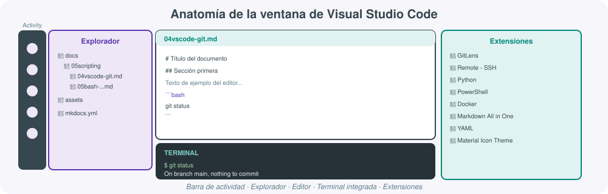

# **🧰 VSCode y control de versiones con Git**


Cualquier administrador de sistemas que escriba scripts —ya sean de Bash, PowerShell o Python— necesita dos herramientas que lo acompañarán en el día a día: un **editor de código** que le facilite la vida (autocompletado, resaltado de sintaxis, terminal integrada) y un **sistema de control de versiones** que le permita guardar el historial de cambios, deshacer errores y colaborar con otras personas sin pisarse el trabajo. En este apartado se presenta **Visual Studio Code** (VSCode) como editor de referencia del módulo y **Git** como sistema de control de versiones, trabajado siempre desde la línea de comandos: entender qué hace cada comando de Git es lo que permite luego usar con criterio cualquier interfaz gráfica (la propia de VSCode, GitHub Desktop, GitKraken...), y no al revés.

## 1. Visual Studio Code: instalación y primeros pasos

**Visual Studio Code** es un editor de código gratuito y multiplataforma (Windows, Linux, macOS) desarrollado por Microsoft. A diferencia de un IDE pesado como Visual Studio o IntelliJ, VSCode nace como un editor ligero que se convierte en un entorno de desarrollo completo mediante **extensiones**: la base del programa es la misma para todo el mundo, y cada perfil (desarrollador web, científico de datos, administrador de sistemas) lo adapta instalando el conjunto de extensiones que necesita.

### Instalación

- **Windows**: se descarga el instalador desde [code.visualstudio.com](https://code.visualstudio.com/){:target="_blank"} o se instala con el gestor de paquetes `winget install Microsoft.VisualStudioCode`.
- **Linux (Debian/Ubuntu)**: `sudo apt install code` tras añadir el repositorio oficial de Microsoft, o descargando el paquete `.deb` directamente.
- **macOS**: descarga directa del `.zip` desde la web oficial, o `brew install --cask visual-studio-code` si se usa Homebrew.

!!! tip "Añadir VSCode al PATH"
    Durante la instalación en Windows, marca la casilla **"Add to PATH"**. Esto permite abrir cualquier carpeta directamente desde una terminal con el comando `code .` (el punto significa "la carpeta actual"), en lugar de tener que abrir VSCode y luego navegar manualmente hasta el proyecto.

### Primer arranque y estructura de la ventana

Al abrir VSCode por primera vez conviene familiarizarse con las zonas principales de la interfaz:

- **Barra de actividad** (lateral izquierdo): iconos para cambiar entre el explorador de archivos, la búsqueda global, el control de código fuente (Git), depuración y extensiones.
- **Explorador**: el árbol de carpetas y archivos del proyecto abierto.
- **Editor**: la zona central, donde se edita el código; admite pestañas y divisiones en varias columnas.
- **Terminal integrada**: una consola completa (Bash, PowerShell, cmd...) empotrada en la parte inferior del editor.
- **Panel de extensiones**: el mercado (*marketplace*) desde el que se instalan complementos.



## 2. Extensiones recomendadas para sysadmin y scripting

La potencia real de VSCode aparece al instalar extensiones orientadas al perfil de administración de sistemas. Se instalan desde el icono de piezas de puzzle de la barra de actividad, o con el comando `code --install-extension <id>` desde la terminal.

| Extensión | Autor | Para qué sirve |
|---|---|---|
| **Remote - SSH** | Microsoft | Conectarse y editar archivos directamente en un servidor remoto por SSH, como si fuera una carpeta local |
| **GitLens** | GitKraken | Añade anotaciones de autor/fecha en cada línea, exploración visual del historial y comparación de ramas |
| **Python** | Microsoft | Autocompletado, linting, depuración y ejecución de scripts Python |
| **PowerShell** | Microsoft | Resaltado de sintaxis, depuración y IntelliSense para scripts `.ps1` |
| **Docker** | Microsoft | Gestión de imágenes, contenedores y ficheros `Dockerfile`/`docker-compose.yml` |
| **YAML** | Red Hat | Validación y autocompletado para ficheros de configuración (Ansible, Kubernetes, mkdocs.yml) |
| **Markdown All in One** | Yu Zhang | Vista previa, atajos y generación automática de índices para documentación en Markdown |
| **Material Icon Theme** | Philipp Kief | Iconos distintivos por tipo de archivo, útil para localizar rápido en árboles de proyecto grandes |
| **ShellCheck** | Timon Wong | Analiza scripts de Bash y avisa de errores y malas prácticas antes de ejecutarlos |

!!! note "Remote-SSH es la extensión más rentable para un sysadmin"
    En lugar de editar un script directamente en el servidor con `vi` o `nano` por SSH, o descargarlo, editarlo en local y volver a subirlo, **Remote-SSH** abre una sesión remota completa dentro de VSCode: el explorador de archivos, la terminal integrada y el editor operan directamente sobre el servidor remoto, con todas las ventajas de un editor moderno (autocompletado, extensiones) pero ejecutando todo en el propio destino.

## 3. La terminal integrada

La terminal integrada de VSCode (`Ctrl+Ñ` o `Ctrl+`` en teclado inglés) es, para un administrador de sistemas, casi tan importante como el editor: permite ejecutar scripts, comandos de Git o herramientas de línea de comandos sin salir de la ventana del editor.

- Se puede elegir el intérprete por defecto (Bash, PowerShell, WSL, Git Bash) desde el desplegable de la propia terminal o desde la paleta de comandos.
- Se pueden abrir **varias terminales en paralelo** (por ejemplo, una con Bash para lanzar el script y otra con `tail -f` para vigilar un log), organizadas en pestañas o divididas en paneles.
- El terminal hereda el directorio de trabajo del proyecto abierto, evitando tener que navegar con `cd` cada vez que se abre una ventana nueva.

!!! tip "Terminal dividida para depurar scripts"
    Un flujo de trabajo habitual al depurar un script de administración es dividir la terminal integrada en dos paneles: en el de la izquierda se edita y ejecuta el script (`./backup.sh`), y en el de la derecha se deja corriendo `journalctl -f` o `tail -f /var/log/syslog` para ver en tiempo real el efecto de cada ejecución.

## 4. Abrir y gestionar proyectos y carpetas

VSCode organiza el trabajo en torno a **carpetas** (*folders*), no en torno a archivos sueltos ni a proyectos con configuración propietaria como otros IDEs:

- **Abrir una carpeta**: `Archivo → Abrir carpeta...` o, desde la terminal, situarse en el directorio deseado y ejecutar `code .`. Todo lo que haya dentro de esa carpeta —incluida una posible carpeta `.git`— pasa a formar parte del "espacio de trabajo".
- **Espacios de trabajo multi-raíz** (*multi-root workspaces*): permiten tener abiertas varias carpetas no relacionadas entre sí (por ejemplo, un repositorio de scripts de Bash y otro de manifiestos de Ansible) dentro de la misma ventana, guardando esa combinación en un fichero `.code-workspace`.
- **Configuración por proyecto**: la carpeta oculta `.vscode/` dentro de un proyecto permite guardar ajustes específicos (`settings.json`), tareas automatizadas (`tasks.json`) y configuraciones de depuración (`launch.json`) que solo aplican a ese proyecto, sin afectar a la configuración global del editor.

| Acción | Cómo se hace |
|---|---|
| Abrir una carpeta como proyecto | `Archivo → Abrir carpeta` o `code .` desde la terminal |
| Abrir un archivo suelto | `Archivo → Abrir archivo` o `code archivo.sh` |
| Reabrir el último proyecto | `Archivo → Abrir reciente` |
| Guardar la combinación de carpetas abiertas | `Archivo → Guardar espacio de trabajo como...` |
| Ajustes solo para este proyecto | Editar `.vscode/settings.json` dentro de la carpeta |

## 5. Atajos de teclado útiles

Memorizar un puñado de atajos ahorra muchísimo tiempo frente a navegar todo con el ratón. Estos son los que más se usan en el trabajo diario de scripting:

| Atajo (Windows/Linux) | Acción |
|---|---|
| `Ctrl+P` | Buscador rápido de archivos por nombre |
| `Ctrl+Mayús+P` | Paleta de comandos (acceso a cualquier función del editor) |
| `Ctrl+ñ` / `Ctrl+`` ` | Mostrar u ocultar la terminal integrada |
| `Ctrl+B` | Mostrar u ocultar la barra lateral |
| `Ctrl+Mayús+K` | Eliminar la línea actual |
| `Alt+↑` / `Alt+↓` | Mover la línea actual arriba o abajo |
| `Ctrl+D` | Seleccionar la siguiente aparición de la palabra seleccionada (edición múltiple) |
| `F2` | Renombrar símbolo (variable, función) en todo el archivo |
| `Ctrl+/` | Comentar o descomentar la línea o selección actual |
| `Ctrl+Mayús+E` | Ir al explorador de archivos |
| `Ctrl+Mayús+G` | Ir al panel de control de código fuente (Git) |

!!! tip "La paleta de comandos es el atajo maestro"
    Si no recuerdas un atajo concreto, `Ctrl+Mayús+P` abre la paleta de comandos: escribiendo el nombre de la acción en lenguaje natural ("format document", "toggle terminal", "git: clone") aparecen las opciones disponibles junto con su atajo de teclado asociado, lo que además ayuda a aprenderlos con el tiempo.

## 6. Git: control de versiones desde la línea de comandos

VSCode incluye una interfaz gráfica para Git (el icono de la rama en la barra de actividad), pero entender **los comandos de Git** es lo que de verdad permite trabajar con soltura, tanto en VSCode como en cualquier servidor remoto donde solo se disponga de una terminal. Git es un sistema de control de versiones **distribuido**: cada copia local del repositorio contiene el historial completo, no solo la versión actual de los archivos, lo que permite trabajar sin conexión y sincronizar los cambios cuando se desee.

### 6.1 Los tres estados de un archivo en Git

Todo archivo bajo control de Git pasa por tres áreas conceptuales, representadas en el diagrama del inicio de este apartado:

1. **Working directory** (directorio de trabajo): los archivos tal y como están en el disco, con los cambios que aún no se han "marcado" para guardar.
2. **Staging area** (área de preparación o índice): un espacio intermedio donde se colocan, con `git add`, los cambios que se quieren incluir en el próximo commit.
3. **Repositorio local**: el historial de commits ya confirmados, almacenado en la carpeta oculta `.git/`.

A esto se añade un cuarto elemento, el **repositorio remoto** (por ejemplo, en GitHub o GitLab), que sincroniza el historial local con una copia compartida a la que puede acceder el resto del equipo.

### 6.2 Configuración inicial

Antes del primer commit, Git necesita saber quién eres (esta información queda registrada en cada commit que hagas):

```bash
git config --global user.name "Tu Nombre"
git config --global user.email "tu_correo@ejemplo.com"

# Comprobar la configuración actual
git config --list
```

!!! note "--global frente a configuración local"
    `--global` guarda la configuración para todos los repositorios del usuario en esa máquina (se almacena en `~/.gitconfig`). Si se omite `--global`, el ajuste solo aplica al repositorio en el que se ejecuta el comando, algo útil si en un proyecto concreto se necesita usar un correo distinto (por ejemplo, uno corporativo).

### 6.3 Crear y clonar repositorios

| Comando | Descripción |
|---|---|
| `git init` | Convierte la carpeta actual en un repositorio Git nuevo, creando la carpeta oculta `.git/` |
| `git clone <url>` | Descarga una copia completa de un repositorio remoto existente, con todo su historial |
| `git clone <url> <carpeta>` | Igual que el anterior, pero guardando el resultado en una carpeta con el nombre indicado |

```bash
# Crear un repositorio desde cero en la carpeta actual
git init

# Clonar un repositorio ya existente en GitHub
git clone https://github.com/usuario/proyecto.git
```

### 6.4 El ciclo básico: status, add, commit

| Comando | Descripción |
|---|---|
| `git status` | Muestra qué archivos han cambiado, cuáles están en el área de preparación y cuáles no están controlados por Git |
| `git add <archivo>` | Añade un archivo concreto al área de preparación |
| `git add .` | Añade todos los archivos modificados y nuevos del directorio actual y sus subcarpetas |
| `git commit -m "mensaje"` | Confirma los cambios preparados, creando un nuevo punto en el historial |
| `git commit -am "mensaje"` | Añade y confirma en un solo paso, pero **solo** para archivos ya rastreados previamente (no añade archivos nuevos) |

```bash
git status
git add script_backup.sh
git commit -m "Añade script de copia de seguridad diaria"
```

!!! warning "git add . añade también lo que no querías"
    `git add .` es cómodo, pero añade indiscriminadamente todo lo que encuentre en la carpeta: archivos temporales, credenciales sueltas, carpetas de entornos virtuales... Antes de usarlo, revisa siempre `git status` y asegúrate de tener un `.gitignore` bien configurado (apartado 6.9).

### 6.5 Ramas: branch, checkout y switch

Una **rama** (*branch*) es una línea de desarrollo independiente: permite trabajar en una funcionalidad nueva o corregir un error sin afectar al código ya estable de la rama principal.


| Comando | Descripción |
|---|---|
| `git branch` | Lista las ramas existentes en el repositorio local |
| `git branch <nombre>` | Crea una rama nueva a partir del commit actual, sin cambiarse a ella |
| `git checkout <nombre>` | Cambia a la rama indicada (comando clásico, también sirve para restaurar archivos) |
| `git switch <nombre>` | Cambia a la rama indicada (comando moderno, pensado exclusivamente para ramas) |
| `git switch -c <nombre>` | Crea la rama y se cambia a ella en un solo paso |
| `git branch -d <nombre>` | Elimina una rama ya fusionada |
| `git branch -D <nombre>` | Fuerza la eliminación de una rama, aunque tenga cambios sin fusionar |

```bash
git branch feature-login          # crea la rama
git switch feature-login          # se cambia a ella
# equivalente en un solo paso:
git switch -c feature-login
```

!!! tip "checkout frente a switch/restore"
    `git checkout` es un comando "todoterreno" heredado de versiones antiguas de Git que sirve tanto para cambiar de rama como para descartar cambios en archivos, lo que a veces provoca errores por ambigüedad. Desde Git 2.23, `git switch` (cambiar de rama) y `git restore` (descartar cambios en archivos) separan esas dos responsabilidades y son las opciones recomendadas para quien empieza.

### 6.6 Fusionar ramas: merge

`git merge` integra los cambios de una rama en la rama actual. Situándose en `main` y fusionando `feature-login`:

```bash
git switch main
git merge feature-login
```

Si ambas ramas han modificado las mismas líneas de un mismo archivo, Git no puede decidir automáticamente qué versión conservar y se produce un **conflicto de fusión**.

### 6.7 Resolución de conflictos

Cuando aparece un conflicto, Git marca directamente en el archivo afectado las dos versiones en pugna:

```text
<<<<<<< HEAD
echo "Versión de la rama main"
=======
echo "Versión de la rama feature-login"
>>>>>>> feature-login
```

Pasos para resolverlo:

1. Abrir el archivo en VSCode: la extensión de Git integrada resalta el conflicto y ofrece botones para "Aceptar cambio actual", "Aceptar cambio entrante" o "Aceptar ambos".
2. Editar manualmente el archivo hasta dejar el contenido final correcto, eliminando las marcas `<<<<<<<`, `=======` y `>>>>>>>`.
3. Marcar el conflicto como resuelto añadiéndolo al área de preparación: `git add archivo_en_conflicto.sh`.
4. Completar la fusión con `git commit` (Git ya propone un mensaje por defecto para el commit de fusión).

!!! tip "Los conflictos no son un error, son una pregunta"
    Un conflicto de fusión no significa que algo se haya roto: significa que Git necesita que una persona decida entre dos cambios legítimos que no puede reconciliar por sí solo. Cuanto más pequeños y frecuentes sean los commits, y más se sincronice con `git pull` antes de empezar a trabajar, menos conflictos —y más sencillos— aparecerán.

### 6.8 Trabajar con el repositorio remoto: push y pull

| Comando | Descripción |
|---|---|
| `git remote -v` | Muestra las URL remotas configuradas (normalmente `origin`) |
| `git remote add origin <url>` | Asocia un repositorio remoto a un repositorio local recién creado con `git init` |
| `git push` | Sube los commits locales al repositorio remoto |
| `git push -u origin main` | Sube la rama y establece el seguimiento (*upstream*), necesario la primera vez que se sube una rama nueva |
| `git pull` | Descarga los cambios del remoto y los fusiona en la rama local (equivale a `git fetch` + `git merge`) |
| `git fetch` | Descarga los cambios del remoto sin fusionarlos todavía, para poder revisarlos antes |

```bash
git remote add origin https://github.com/usuario/proyecto.git
git push -u origin main
```

!!! warning "Cuidado con git push --force"
    `git push --force` sobrescribe el historial remoto con el historial local, **incluso si eso hace desaparecer commits que ya habían subido otras personas**. Es un comando necesario en casos concretos (por ejemplo, tras reescribir el historial con `rebase`), pero nunca debe usarse sobre una rama compartida sin avisar al equipo. La alternativa más segura es `git push --force-with-lease`, que aborta la operación si detecta que el remoto tiene commits que tu copia local no conoce todavía.

### 6.9 Consultar el historial: git log

| Comando | Descripción |
|---|---|
| `git log` | Muestra el historial completo de commits (autor, fecha, mensaje, hash) |
| `git log --oneline` | Una línea por commit, con el hash abreviado y el mensaje |
| `git log --graph --oneline --all` | Representación visual en texto de ramas y fusiones |
| `git diff` | Muestra las diferencias entre el directorio de trabajo y el área de preparación |
| `git diff --staged` | Muestra las diferencias ya preparadas para el próximo commit |
| `git show <hash>` | Muestra el contenido completo de un commit concreto |

### 6.10 Ignorar archivos: .gitignore

No todos los archivos de una carpeta deben quedar bajo control de versiones: credenciales, entornos virtuales, archivos temporales o binarios generados no aportan valor al historial y solo lo ensucian. El fichero `.gitignore`, en la raíz del repositorio, lista patrones de archivos y carpetas que Git debe ignorar:

```text
# .gitignore para un proyecto de scripting mixto
*.log
*.tmp
__pycache__/
venv/
.env
.vscode/*
!.vscode/settings.json
```

!!! warning ".gitignore no afecta a archivos ya rastreados"
    Si un archivo ya se añadió a Git antes de incluirlo en `.gitignore`, seguirá controlado por Git aunque coincida con un patrón del fichero. Para dejar de rastrearlo sin borrarlo del disco: `git rm --cached archivo`.

### 6.11 Buenas prácticas de mensajes de commit

Un buen mensaje de commit no describe *cómo* se ha programado algo (eso ya se ve en el propio código), sino **por qué** era necesario el cambio:

- Usa el **modo imperativo**: "Añade validación de entrada" en lugar de "Añadido" o "Añadiendo".
- Mantén la primera línea corta (menos de 50-72 caracteres) y, si hace falta más contexto, añade un párrafo explicativo tras una línea en blanco.
- Un commit debe representar **un cambio lógico coherente**, no una mezcla de cosas no relacionadas: es preferible hacer varios commits pequeños que uno enorme y difícil de revisar.
- Evita mensajes genéricos como "cambios", "fix" o "wip" en el historial que se va a compartir o revisar.

| Mensaje poco útil | Mensaje recomendado |
|---|---|
| `fix` | `Corrige el cálculo de la fecha de expiración del certificado` |
| `cambios varios` | `Añade rotación de logs y elimina credenciales del script` |
| `wip` | `Refactoriza la función de backup para aceptar rutas remotas` |

## 7. Ejemplo práctico paso a paso: de cero a GitHub

A continuación, la secuencia completa de comandos para crear un proyecto nuevo, versionarlo con Git y publicarlo en GitHub, tal y como se haría con cualquier script de administración de sistemas.

```bash
# 1. Crear la carpeta del proyecto y entrar en ella
mkdir backup-scripts
cd backup-scripts

# 2. Inicializar el repositorio local
git init

# 3. Crear el primer script y la documentación mínima
echo '#!/bin/bash
echo "Copia de seguridad iniciada: $(date)"' > backup.sh
echo "# Scripts de copia de seguridad" > README.md

# 4. Crear un .gitignore básico
echo -e "*.log\n*.tmp" > .gitignore

# 5. Revisar qué ve Git antes de nada
git status

# 6. Preparar y confirmar el primer commit
git add .
git commit -m "Commit inicial: script de backup y documentación"

# 7. Crear el repositorio vacío en GitHub (desde la web o con GitHub CLI)
gh repo create backup-scripts --public --source=. --remote=origin

# 8. Subir la rama principal por primera vez
git push -u origin main

# 9. Un cambio posterior: se edita backup.sh en VSCode y se sube
git add backup.sh
git commit -m "Añade compresión con gzip al script de backup"
git push
```

!!! example "Verificación final"
    Tras el `git push` inicial, al recargar la página del repositorio en GitHub deberían aparecer exactamente los mismos archivos que en la carpeta local (`backup.sh`, `README.md`, `.gitignore`) y un único commit en el historial. Si `git status` en local sigue mostrando "nothing to commit, working tree clean" después de cada operación, el flujo se ha completado correctamente.

## 8. Tabla resumen de comandos Git

| Categoría | Comando | Descripción breve |
|---|---|---|
| Configuración | `git config --global user.name/email` | Identidad del autor de los commits |
| Creación | `git init` / `git clone` | Crear repositorio nuevo / copiar uno existente |
| Estado | `git status` / `git diff` | Ver cambios pendientes |
| Preparación | `git add` | Mover cambios al área de preparación |
| Confirmación | `git commit` | Guardar un punto en el historial |
| Ramas | `git branch` / `git switch` / `git checkout` | Crear y cambiar de línea de desarrollo |
| Integración | `git merge` | Fusionar una rama en otra |
| Sincronización | `git push` / `git pull` / `git fetch` | Subir y bajar cambios del remoto |
| Historial | `git log` / `git show` | Consultar commits pasados |
| Exclusión | `.gitignore` / `git rm --cached` | Excluir archivos del control de versiones |

## 9. Glosario rápido

- **Working directory**: los archivos tal y como están en el disco en este momento.
- **Staging area (índice)**: zona intermedia donde se preparan los cambios antes de confirmarlos.
- **Commit**: una fotografía del estado del repositorio en un momento dado, con su mensaje y autor.
- **Rama (branch)**: una línea de desarrollo independiente dentro del mismo repositorio.
- **Remoto (remote)**: una copia del repositorio alojada en otro servidor (GitHub, GitLab...).
- **Conflicto de fusión**: situación en la que Git no puede decidir automáticamente qué cambios conservar.
- **Upstream**: la rama remota que una rama local sigue y con la que se sincroniza por defecto.

## 10. Autoevaluación rápida

1. ¿Qué diferencia hay entre el *working directory* y la *staging area*? (apartado 6.1)
2. ¿Por qué `git switch` es preferible a `git checkout` para cambiar de rama? (apartado 6.5)
3. Describe los pasos para resolver un conflicto de fusión en VSCode. (apartado 6.7)
4. ¿Qué riesgo tiene `git push --force` sobre una rama compartida y qué alternativa más segura existe? (apartado 6.8)
5. Escribe un `.gitignore` mínimo para un proyecto de scripting en Python que use un entorno virtual `venv/`. (apartado 6.10)

## Para profundizar

Este apartado se apoya en la documentación oficial de [Visual Studio Code](https://code.visualstudio.com/docs){:target="_blank"} y en el [Pro Git Book](https://git-scm.com/book/es/v2){:target="_blank"}, disponible de forma gratuita en español, que profundiza tanto en el modelo de datos interno de Git (objetos, árboles, referencias) como en flujos de trabajo colaborativos más avanzados (rebase interactivo, *cherry-pick*, *git-flow*).
