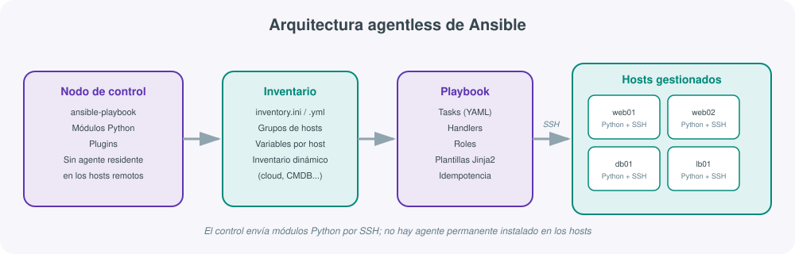
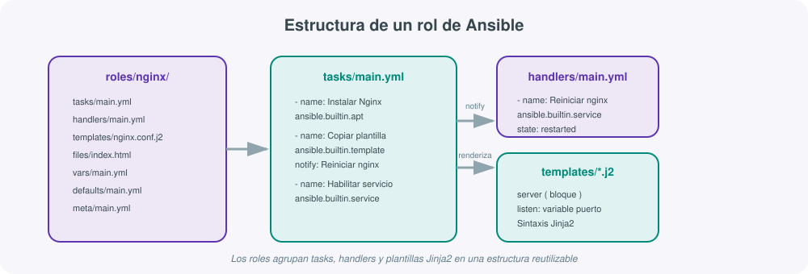
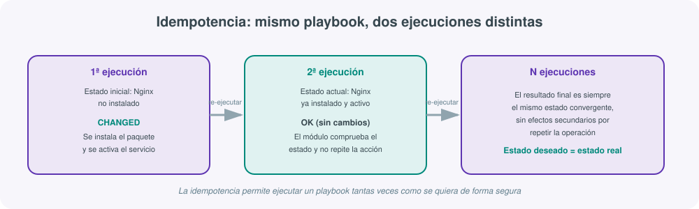

# **🔧 Ansible · Automatización sin agentes**



## 1. Qué es Ansible y qué problema resuelve

Cuando una infraestructura crece más allá de dos o tres servidores, mantenerlos configurados "a mano" deja de ser viable: instalar paquetes, copiar ficheros de configuración, crear usuarios o reiniciar servicios uno por uno es lento, propenso a errores y, sobre todo, **no queda documentado en ningún sitio salvo en la cabeza de quien lo hizo**. Esto es exactamente lo que en la unidad de contenedores y scripting ya se apuntaba como problema de fondo: la configuración manual no es reproducible ni auditable.

**Ansible** es una herramienta de automatización de TI, propiedad de Red Hat (IBM), que permite describir en ficheros de texto (YAML) el estado que debe tener un conjunto de máquinas —qué paquetes deben estar instalados, qué ficheros deben existir, qué servicios deben estar activos— y aplicar esa descripción de forma automática, repetible y auditable sobre tantos servidores como haga falta, ya sean dos o dos mil.

Se usa fundamentalmente para tres tareas, que en la práctica se solapan constantemente:

- **Gestión de la configuración**: mantener el estado deseado de servidores ya existentes (paquetes, usuarios, ficheros de configuración, servicios).
- **Aprovisionamiento**: preparar un servidor desde cero tras crearlo (a menudo con Terraform o Vagrant, que veremos en los otros dos apartados de esta unidad).
- **Despliegue de aplicaciones**: copiar código, reiniciar servicios, orquestar actualizaciones sin downtime.

!!! tip "Por qué "Ansible" y no un script de Bash"
    Un script de Bash que instale Nginx en un servidor funciona la primera vez. El problema aparece cuando hay que ejecutarlo sobre 30 servidores con pequeñas diferencias entre sí, cuando hay que volver a ejecutarlo sin que rompa nada si ya se había ejecutado antes, o cuando alguien nuevo en el equipo necesita entender qué hace el script sin leerlo línea a línea. Ansible resuelve estos tres problemas mediante un lenguaje declarativo (YAML), la idempotencia como principio de diseño y una estructura de proyecto estandarizada (roles) que cualquier persona familiarizada con la herramienta puede leer.

## 2. El modelo agentless: automatización por SSH

La característica que más distingue a Ansible de otras herramientas de gestión de configuración —Puppet, Chef, SaltStack— es que es **agentless**: no necesita instalar ni mantener ningún software residente (un "agente") en los servidores que gestiona. Le basta con que el host remoto tenga:

- Un cliente **SSH** accesible (el mismo protocolo que se usa para conectarse manualmente a un servidor).
- Un intérprete de **Python** instalado (en la mayoría de distribuciones Linux ya viene de fábrica).

Con solo eso, Ansible puede conectarse, copiar un módulo Python al host remoto, ejecutarlo y recoger el resultado, todo a través del canal SSH ya existente. Esto tiene varias consecuencias prácticas importantes:

- **No hay que abrir puertos adicionales** en el firewall: si ya se administra el servidor por SSH, Ansible ya puede llegar a él.
- **No hay agente que actualizar, romper o que consuma recursos en segundo plano** en cada servidor gestionado.
- El **nodo de control** (la máquina desde la que se lanza Ansible) es el único sitio donde hay que instalar la herramienta.
- Añadir un nuevo servidor a la gestión es tan sencillo como añadir una línea al inventario; no hay que ir físicamente (ni remotamente) a instalar nada en él primero.

!!! note "SSH sin contraseña, la base de todo"
    En la práctica, Ansible funciona mucho mejor si el nodo de control puede conectarse por SSH a los hosts gestionados sin que se le pida contraseña interactivamente, normalmente mediante autenticación por clave pública. Es exactamente el mismo mecanismo que se estudia al configurar acceso remoto seguro a servidores Linux: se genera un par de claves en el nodo de control y se distribuye la clave pública a los hosts gestionados (por ejemplo con `ssh-copy-id`).

## 3. Arquitectura: nodo de control, inventario y hosts gestionados

Una instalación de Ansible se organiza en torno a tres piezas, tal y como muestra el diagrama de esta sección:

### Nodo de control (control node)

Es la máquina —puede ser un portátil, un servidor dedicado o una instancia en un pipeline de CI/CD— donde está instalado Ansible y desde donde se lanzan los comandos `ansible` y `ansible-playbook`. Ansible **no funciona sobre Windows como nodo de control** (aunque sí puede gestionar hosts Windows como destino mediante WinRM); en un entorno Windows se suele usar WSL2 para disponer de un nodo de control Linux.

### Inventario (inventory)

Es el fichero (o conjunto de ficheros) que enumera los hosts que Ansible puede gestionar, agrupados de forma lógica. Puede ser tan simple como un fichero `.ini`:

```ini
[web]
web01.midominio.local
web02.midominio.local

[db]
db01.midominio.local ansible_user=admin

[produccion:children]
web
db
```

O su equivalente en YAML, más expresivo para añadir variables anidadas:

```yaml
all:
  children:
    web:
      hosts:
        web01.midominio.local:
        web02.midominio.local:
    db:
      hosts:
        db01.midominio.local:
          ansible_user: admin
```

En entornos cloud o muy dinámicos (donde las máquinas se crean y destruyen constantemente, por ejemplo tras un `terraform apply`) se usa **inventario dinámico**: un script o plugin que consulta la API del proveedor (AWS, Azure, Proxmox) y construye el inventario al vuelo, en lugar de mantenerlo escrito a mano.

### Módulos y hosts gestionados

Los **módulos** son las unidades de trabajo que Ansible ejecuta sobre cada host: pequeños programas Python (`apt`, `yum`, `copy`, `service`, `user`, `template`...) que reciben unos parámetros, comprueban el estado actual del sistema y aplican los cambios necesarios para alcanzar el estado declarado. Ansible incluye miles de módulos oficiales y de la comunidad, organizados en colecciones (`ansible.builtin`, `community.general`, `ansible.posix`...).

Los **hosts gestionados** son los servidores de destino. No necesitan nada de Ansible instalado de forma permanente: durante la ejecución, Ansible copia temporalmente el módulo Python necesario, lo ejecuta y borra los ficheros temporales al terminar.

## 4. El lenguaje: playbooks en YAML

Un **playbook** es el fichero YAML donde se describe qué se quiere conseguir. Se estructura en una lista de **plays**, y cada play aplica una lista de **tasks** (tareas) a un grupo de hosts del inventario.

```yaml
---
- name: Configurar servidor web
  hosts: web
  become: true
  vars:
    puerto_http: 80
    documento_raiz: /var/www/html

  tasks:
    - name: Instalar Nginx
      ansible.builtin.apt:
        name: nginx
        state: present
        update_cache: true

    - name: Copiar página de bienvenida
      ansible.builtin.copy:
        src: files/index.html
        dest: "{{ documento_raiz }}/index.html"

    - name: Asegurar que Nginx está activo y habilitado
      ansible.builtin.service:
        name: nginx
        state: started
        enabled: true
```

Elementos que aparecen en prácticamente cualquier playbook real:

- **`hosts`**: el grupo del inventario (o host concreto) sobre el que se aplica el play.
- **`become`**: indica que las tareas deben ejecutarse con privilegios elevados (equivalente a `sudo`).
- **`vars`**: variables propias del play, referenciadas con la sintaxis `{{ variable }}` de Jinja2.
- **`tasks`**: la lista ordenada de acciones, cada una invocando un módulo con sus parámetros.

!!! warning "YAML es sensible a la indentación"
    Un error habitual al empezar con Ansible no es conceptual sino de formato: YAML usa la indentación (espacios, nunca tabuladores) para representar la jerarquía. Un playbook que "no hace nada" o falla al arrancar suele deberse a una indentación incorrecta antes que a un error de lógica. Conviene validar la sintaxis con `ansible-playbook --syntax-check playbook.yml` antes de ejecutarlo de verdad.

## 5. Conceptos clave: tasks, handlers, variables y plantillas

### Tasks

Cada **task** invoca un módulo con parámetros concretos. Ansible ejecuta las tareas de un play en orden, host por host (o en paralelo entre hosts, según el valor de `forks`), y se detiene en el primer error salvo que se indique lo contrario con `ignore_errors` o bloques `block`/`rescue`.

### Handlers

Un **handler** es una tarea especial que solo se ejecuta si otra tarea la ha "notificado" (`notify`) y ha producido un cambio real. El caso típico es reiniciar un servicio solo cuando su configuración ha cambiado, evitando reinicios innecesarios en cada ejecución:

```yaml
tasks:
  - name: Desplegar configuración de Nginx
    ansible.builtin.template:
      src: nginx.conf.j2
      dest: /etc/nginx/nginx.conf
    notify: Reiniciar nginx

handlers:
  - name: Reiniciar nginx
    ansible.builtin.service:
      name: nginx
      state: restarted
```

Los handlers se ejecutan, como máximo una vez, al final del play, aunque varias tareas los hayan notificado.

### Roles

Un **rol** es la unidad de reutilización y organización en Ansible: agrupa tasks, handlers, variables, plantillas y ficheros relacionados con una función concreta (por ejemplo, "instalar y configurar Nginx") en una estructura de carpetas estandarizada que Ansible reconoce automáticamente.



```text
roles/
  nginx/
    tasks/main.yml       # qué hacer
    handlers/main.yml    # qué reiniciar si cambia algo
    templates/           # ficheros .j2 (Jinja2) a renderizar
    files/                # ficheros estáticos a copiar tal cual
    vars/main.yml         # variables específicas del rol (alta prioridad)
    defaults/main.yml     # variables por defecto (baja prioridad, sobreescribibles)
    meta/main.yml         # dependencias de otros roles
```

Un playbook que use el rol queda extremadamente legible:

```yaml
- name: Configurar servidores web
  hosts: web
  become: true
  roles:
    - nginx
    - firewall
```

### Variables

Ansible admite variables definidas en múltiples sitios (inventario, playbook, rol, línea de comandos con `-e`), con un orden de precedencia bien definido. Las más específicas (por ejemplo, una variable fijada para un host concreto) siempre ganan a las más generales (una variable por defecto de un rol). Esto permite escribir roles genéricos y reutilizables, ajustando solo lo necesario por entorno (desarrollo, producción) o por host.

### Plantillas Jinja2

Los ficheros de configuración rara vez son idénticos en todos los servidores: el puerto, el dominio o el número de workers pueden cambiar de uno a otro. Ansible resuelve esto con **Jinja2**, el mismo motor de plantillas que usa Flask, incrustando variables, condicionales y bucles dentro de un fichero de configuración:

```jinja
server {
    listen {{ puerto_http }};
    server_name {{ dominio | default('localhost') }};
    root {{ documento_raiz }};

    
    location {{ ruta.path }} {
        proxy_pass {{ ruta.destino }};
    }
    
}
```

El módulo `ansible.builtin.template` toma este fichero `.j2`, sustituye las variables por sus valores reales para ese host concreto y copia el resultado ya renderizado al destino.

## 6. Idempotencia: la garantía que hace fiable la automatización

La **idempotencia** es, probablemente, el concepto más importante para entender por qué Ansible es fiable en producción: **ejecutar el mismo playbook varias veces sobre el mismo host produce siempre el mismo resultado final**, sin efectos secundarios acumulativos.



Cada módulo de Ansible, antes de actuar, **comprueba el estado actual del sistema** y solo aplica un cambio si es necesario:

- Si se pide `state: present` para un paquete y ya está instalado, el módulo no hace nada y lo reporta como `ok` (sin cambios).
- Si el paquete no estaba instalado, lo instala y lo reporta como `changed`.
- Si se ejecuta el playbook una tercera, cuarta o enésima vez sobre el mismo host, el resultado siempre converge al mismo estado declarado.

Esto contrasta con un script de Bash típico que ejecuta `apt install nginx` sin comprobar nada antes: si se ejecuta dos veces no suele romper nada grave, pero un script que haga `echo "linea" >> fichero.conf` sí duplicaría esa línea en cada ejecución. Escribir tareas idempotentes (usando los módulos adecuados en lugar de comandos de shell sueltos) es lo que permite ejecutar un playbook con total confianza, sin tener que recordar "si ya se aplicó antes o no".

!!! example "Cuando no queda más remedio que usar `command` o `shell`"
    A veces no existe un módulo específico para una acción concreta y hay que recurrir a los módulos genéricos `ansible.builtin.command` o `ansible.builtin.shell`, que ejecutan un comando arbitrario y **no son idempotentes por sí mismos** — se ejecutarían en cada pasada. La forma correcta de usarlos es acompañarlos de una condición `creates` o `removes` (que le dice a Ansible que omita la tarea si un fichero ya existe o no existe), o de una cláusula `when` que compruebe una condición previa.

## 7. Comparación con otras herramientas de gestión de configuración

Ansible no es la única herramienta de este tipo. Puppet, Chef y SaltStack resuelven el mismo problema con arquitecturas distintas:

| Característica | Ansible | Puppet | Chef | SaltStack |
|---|---|---|---|---|
| Arquitectura | Agentless (SSH) | Agente + servidor maestro | Agente + servidor maestro | Agente (o agentless por SSH) |
| Lenguaje | YAML (declarativo) | DSL propio (basado en Ruby) | DSL propio (Ruby puro) | YAML + Jinja2 (declarativo) |
| Curva de aprendizaje | Baja | Media-alta | Alta (requiere saber Ruby) | Media |
| Modelo de ejecución | Push (el control empuja cambios) | Pull (el agente consulta periódicamente) | Pull (el agente consulta periódicamente) | Push o pull según configuración |
| Rendimiento a gran escala | Bueno, mejorable con `mitogen` | Muy bueno (diseñado para miles de nodos) | Muy bueno | Excelente (usa ZeroMQ) |
| Mejor caso de uso | Automatización general, orquestación puntual, equipos con SSH ya configurado | Grandes infraestructuras con cumplimiento normativo estricto | Infraestructuras muy complejas con equipos que ya saben Ruby | Automatización a muy gran escala con eventos en tiempo real |

La razón principal por la que Ansible se ha vuelto tan popular en los últimos años es su **sencillez de entrada**: no requiere instalar nada en los hosts gestionados, se aprende en días (no en semanas) gracias a YAML, y su modelo *push* permite lanzar cambios bajo demanda sin esperar al siguiente ciclo de sincronización de un agente.

## 8. Ejemplo completo: instalar y configurar un servidor Nginx

El siguiente playbook reúne los conceptos anteriores en un caso realista: instalar Nginx, desplegar una configuración personalizada mediante plantilla, publicar una página estática y garantizar que el servicio queda activo y persistente tras un reinicio.

```yaml
---
- name: Desplegar servidor web Nginx
  hosts: web
  become: true

  vars:
    puerto_http: 80
    dominio: www.midominio.local
    documento_raiz: /var/www/midominio

  tasks:
    - name: Actualizar caché de paquetes
      ansible.builtin.apt:
        update_cache: true
        cache_valid_time: 3600

    - name: Instalar Nginx
      ansible.builtin.apt:
        name: nginx
        state: present

    - name: Crear directorio del sitio
      ansible.builtin.file:
        path: "{{ documento_raiz }}"
        state: directory
        owner: www-data
        group: www-data
        mode: "0755"

    - name: Desplegar página de inicio
      ansible.builtin.copy:
        src: files/index.html
        dest: "{{ documento_raiz }}/index.html"
        owner: www-data
        group: www-data

    - name: Desplegar configuración del sitio
      ansible.builtin.template:
        src: templates/sitio.conf.j2
        dest: /etc/nginx/sites-available/midominio.conf
        mode: "0644"
      notify: Reiniciar nginx

    - name: Habilitar el sitio
      ansible.builtin.file:
        src: /etc/nginx/sites-available/midominio.conf
        dest: /etc/nginx/sites-enabled/midominio.conf
        state: link
      notify: Reiniciar nginx

    - name: Abrir el puerto HTTP en el firewall
      community.general.ufw:
        rule: allow
        port: "{{ puerto_http }}"
        proto: tcp

    - name: Asegurar que Nginx está activo y habilitado en el arranque
      ansible.builtin.service:
        name: nginx
        state: started
        enabled: true

  handlers:
    - name: Reiniciar nginx
      ansible.builtin.service:
        name: nginx
        state: restarted
```

La plantilla `templates/sitio.conf.j2` referenciada usa las variables del play:

```jinja
server {
    listen {{ puerto_http }};
    server_name {{ dominio }};
    root {{ documento_raiz }};
    index index.html;
}
```

Este playbook se lanzaría con:

```bash
ansible-playbook -i inventory.ini nginx.yml
```

Y al ejecutarlo una segunda vez sobre el mismo host, todas las tareas aparecerían como `ok` (sin cambios) salvo que se hubiera modificado deliberadamente alguna variable o fichero de origen — la prueba práctica de que el playbook es idempotente.

## 9. Comandos básicos

| Comando | Para qué sirve |
|---|---|
| `ansible all -i inventory.ini -m ping` | Comprueba la conectividad SSH y Python contra todo el inventario |
| `ansible web -i inventory.ini -a "uptime"` | Ejecuta un comando ad-hoc (módulo `command` implícito) sobre el grupo `web` |
| `ansible-playbook -i inventory.ini nginx.yml` | Ejecuta un playbook completo |
| `ansible-playbook nginx.yml --check` | Modo simulación (*dry-run*): muestra qué cambiaría sin aplicarlo |
| `ansible-playbook nginx.yml --diff` | Muestra el contenido exacto que cambiaría en ficheros y plantillas |
| `ansible-playbook nginx.yml --limit web01` | Restringe la ejecución a un host concreto del grupo |
| `ansible-playbook nginx.yml --tags "config"` | Ejecuta solo las tareas etiquetadas con ese tag |
| `ansible-galaxy install geerlingguy.nginx` | Descarga un rol ya hecho desde Ansible Galaxy |
| `ansible-galaxy init roles/nginx` | Genera el esqueleto de carpetas de un rol nuevo |
| `ansible-doc -l` | Lista todos los módulos disponibles |
| `ansible-doc ansible.builtin.service` | Muestra la documentación y ejemplos de un módulo concreto |

`ansible-galaxy` merece mención aparte: es el gestor de paquetes de Ansible, un repositorio público (similar en espíritu a lo que es npm para Node o PyPI para Python) donde la comunidad publica roles y colecciones ya probados, evitando reescribir desde cero tareas comunes como "instalar Docker" o "configurar un firewall básico".

## 10. Buenas prácticas

- **Organizar el proyecto en roles desde el principio**, aunque el playbook parezca pequeño: crece más rápido de lo esperado y migrar tareas sueltas a roles después cuesta más que empezar ya organizado.
- **No guardar contraseñas ni claves en texto plano** en el repositorio: usar **Ansible Vault** (`ansible-vault encrypt secrets.yml`) para cifrar variables sensibles.
- **Usar `--check` y `--diff` antes de aplicar en producción**, especialmente en cambios de configuración de red o de servicios críticos.
- **Fijar versiones de las colecciones y roles externos** (en `requirements.yml`) para que una actualización de un rol de terceros no rompa un despliegue que llevaba meses funcionando.
- **Evitar `command` y `shell` cuando exista un módulo específico**: los módulos son idempotentes y expresan mejor la intención que una línea de shell arbitraria.
- **Nombrar siempre las tareas con `name`** de forma descriptiva: el resultado de `ansible-playbook` se lee como una lista de pasos, y un nombre claro ahorra minutos de depuración a quien venga después (incluido uno mismo, seis meses más tarde).
- **Versionar el inventario y los playbooks en Git**, igual que se versiona cualquier otro código: un playbook es, en última instancia, la documentación ejecutable de cómo está configurada la infraestructura.

## Ansible vs Vagrant vs Terraform: cuándo usar cada uno

Estas tres herramientas conviven en muchos flujos de trabajo reales y conviene tener claro qué papel juega cada una, sin solaparlas innecesariamente:

| Aspecto | Ansible | Vagrant | Terraform |
|---|---|---|---|
| Propósito principal | Configurar software dentro de máquinas ya existentes | Crear y gestionar entornos de desarrollo locales reproducibles | Crear y gestionar infraestructura (VMs, redes, servicios cloud) |
| Paradigma | Procedimental por tareas, pero con estado declarado | Declarativo sobre el propio entorno de desarrollo | Declarativo con estado persistente (`.tfstate`) |
| Dónde actúa | Sobre sistemas operativos ya arrancados (SSH) | Sobre hipervisores locales (VirtualBox, libvirt...) | Sobre APIs de proveedores cloud/on-premise |
| Unidad de trabajo | Playbook / rol | Vagrantfile / box | Módulo / recurso `.tf` |
| Ejemplo típico de uso | Instalar y configurar Nginx en 20 servidores | Levantar un clúster de pruebas idéntico en el portátil de cada desarrollador | Crear la VPC, las instancias EC2 y el balanceador en AWS |
| Relación entre ellas | Puede ser el *provisioner* de Vagrant o ejecutarse tras un `terraform apply` | Puede invocar Ansible como provisioner tras el `vagrant up` | Puede dejar la infraestructura lista para que Ansible la configure después |

En la práctica, un flujo muy habitual es: **Terraform** crea la infraestructura (la VM o instancia existe), y **Ansible** entra después para instalar y configurar el software dentro de ella; **Vagrant** cubre el mismo papel que Terraform pero enfocado a entornos de desarrollo local desechables, no a infraestructura de producción en la nube.

## Para profundizar

La documentación oficial de Ansible es extensa y está muy bien organizada por tareas concretas: la [guía de introducción a playbooks](https://docs.ansible.com/ansible/latest/playbook_guide/index.html){:target="_blank"} explica en detalle tasks, handlers y control de flujo; la [referencia de módulos integrados](https://docs.ansible.com/ansible/latest/collections/ansible/builtin/index.html){:target="_blank"} permite consultar los parámetros exactos de cada módulo antes de usarlo; y la [documentación de Ansible Galaxy](https://docs.ansible.com/ansible/latest/galaxy/user_guide.html){:target="_blank"} explica cómo publicar y reutilizar roles de la comunidad. El resto de enlaces de referencia del módulo está recopilado en la página de Recursos. Como ejemplos reales de roles Ansible: [mablanco/ansible-lynis](https://github.com/mablanco){:target="_blank"} automatiza una auditoría de seguridad con Lynis, y los playbooks de [iesgn](https://github.com/iesgn){:target="_blank"} cubren despliegues educativos completos (OpenStack, servicios de red).
