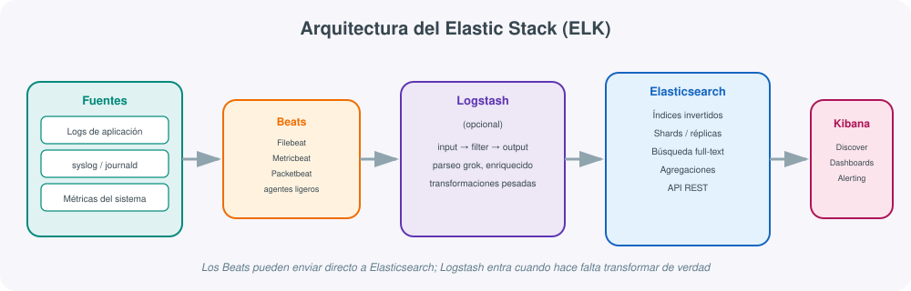
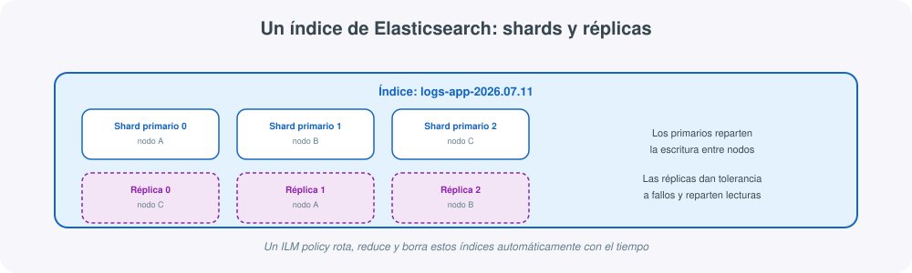
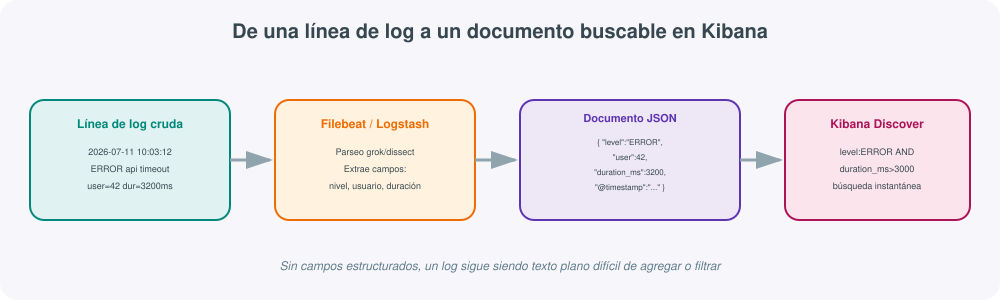

# **🔍 Elastic Stack (ELK) · Centralización y búsqueda de logs**



## 1. Qué es el Elastic Stack y qué problema resuelve

Cuando una infraestructura crece a varios servidores, contenedores o microservicios, cada uno genera sus propios logs en su propia máquina. Averiguar qué ocurrió en un incidente concreto —"¿qué error lanzó el servicio de pagos a las 10:03?"— implica, sin una herramienta centralizada, conectarse servidor por servidor y hacer `grep` sobre ficheros de texto que pueden ocupar gigabytes y rotar cada pocas horas. Es exactamente el mismo problema de fondo que resuelve Prometheus para métricas, pero aplicado a **logs**: eventos textuales, no series numéricas.

El **Elastic Stack**, conocido históricamente por sus siglas **ELK** (Elasticsearch, Logstash, Kibana), es un conjunto de herramientas de código abierto que centraliza, indexa y hace buscable en segundos el volumen de logs de toda una infraestructura, por grande que sea. Sus tres componentes originales son:

- **Elasticsearch**: motor de búsqueda y analítica distribuido, donde se almacenan e indexan los logs ya estructurados.
- **Logstash**: *pipeline* de procesamiento que recibe, transforma y enriquece los datos antes de enviarlos a Elasticsearch.
- **Kibana**: interfaz web para explorar los datos, construir dashboards y definir alertas sobre ellos.

A este trío se añadió más adelante una cuarta pieza clave, los **Beats**, agentes ligeros escritos en Go que recolectan datos en origen (logs, métricas, tráfico de red) y los envían al resto del stack, por lo que hoy es más preciso hablar de "Elastic Stack" que de "ELK" a secas.

!!! tip "Logs, no métricas ni trazas"
    Retomando la distinción ya introducida en el apartado de Prometheus y Grafana: el Elastic Stack cubre el pilar de los **logs** (eventos textuales detallados), aunque con Metricbeat también puede recolectar métricas. No sustituye a Prometheus para dashboards de series temporales de alta frecuencia ni a un sistema de trazas distribuidas; su fuerza está en la búsqueda full-text y el análisis exploratorio sobre grandes volúmenes de texto.

## 2. Arquitectura: de la fuente al dashboard

Como refleja el diagrama de esta sección, un pipeline típico del Elastic Stack sigue este recorrido:

1. **Fuentes**: logs de aplicación, `syslog`, `journald`, métricas del sistema, tráfico de red.
2. **Beats**: agentes ligeros instalados en cada origen. `Filebeat` para ficheros de log, `Metricbeat` para métricas de sistema y servicios, `Packetbeat` para tráfico de red, `Winlogbeat` para el registro de eventos de Windows.
3. **Logstash** (opcional): recibe los datos, los parsea, transforma y enriquece antes de indexarlos. No siempre es necesario: los Beats pueden enviar directamente a Elasticsearch cuando la transformación requerida es sencilla.
4. **Elasticsearch**: almacena los datos ya estructurados en **índices**, los hace buscables mediante su motor de búsqueda invertido y responde a consultas y agregaciones.
5. **Kibana**: consulta Elasticsearch para explorar los datos (*Discover*), construir dashboards y definir alertas.

!!! note "¿Cuándo hace falta Logstash?"
    Si los logs ya llegan razonablemente estructurados (JSON, por ejemplo) o basta con un parseo sencillo, Filebeat puede enviarlos directamente a Elasticsearch usando sus propios *ingest pipelines*, evitando el coste operativo de mantener un servicio de Logstash adicional. Logstash sigue siendo necesario cuando hace falta un procesamiento más pesado: parseo de formatos de log complejos con expresiones `grok`, enriquecimiento con consultas a bases de datos externas, o consolidar múltiples fuentes heterogéneas antes de indexar.

## 3. Elasticsearch: índices, shards y réplicas

Elasticsearch organiza los datos en **índices** (conceptualmente parecidos a una tabla, aunque sin esquema rígido obligatorio), y cada índice se divide internamente en **shards** para poder distribuirse entre varios nodos del clúster:



- **Shards primarios**: fragmentos del índice donde se escriben los datos originalmente. Su número se fija al crear el índice y determina el paralelismo máximo de escritura.
- **Réplicas**: copias de los shards primarios en otros nodos, que aportan tolerancia a fallos (si un nodo cae, sus réplicas en otros nodos mantienen los datos disponibles) y reparten la carga de lectura.

Es habitual usar índices con nombre basado en fecha (`logs-app-2026.07.11`) gestionados mediante políticas de **ILM (Index Lifecycle Management)**, que rotan automáticamente el índice activo, mueven los índices más antiguos a almacenamiento más barato y los borran pasado un tiempo de retención configurado, evitando que el clúster crezca sin control.

```json
PUT _ilm/policy/logs-retencion-30d
{
  "policy": {
    "phases": {
      "hot":    { "actions": { "rollover": { "max_age": "1d", "max_size": "20gb" } } },
      "delete": { "min_age": "30d", "actions": { "delete": {} } }
    }
  }
}
```

## 4. De una línea de log a un documento buscable

El valor real del stack aparece cuando un log deja de ser texto plano y pasa a ser un **documento estructurado** con campos propios sobre los que se puede filtrar y agregar:



Una configuración de Filebeat mínima, apuntando directamente a Elasticsearch:

```yaml
# filebeat.yml
filebeat.inputs:
  - type: log
    paths:
      - /var/log/app/*.log

output.elasticsearch:
  hosts: ["http://10.0.0.20:9200"]
  index: "logs-app-%{+yyyy.MM.dd}"

setup.kibana:
  host: "http://10.0.0.20:5601"
```

Si el formato del log requiere parseo (por ejemplo, extraer el nivel, el usuario y la duración de una línea con formato libre), esa lógica se puede delegar a un filtro **grok** de Logstash:

```ruby
# logstash.conf
input {
  beats { port => 5044 }
}

filter {
  grok {
    match => { "message" => "%{TIMESTAMP_ISO8601:timestamp} %{LOGLEVEL:level} %{GREEDYDATA:msg}" }
  }
  date {
    match => ["timestamp", "ISO8601"]
  }
}

output {
  elasticsearch {
    hosts => ["http://10.0.0.20:9200"]
    index => "logs-app-%{+YYYY.MM.dd}"
  }
}
```

## 5. Consultas: Query DSL y KQL

Elasticsearch se consulta mediante su **Query DSL**, un lenguaje basado en JSON que se envía a la API REST:

```json
GET logs-app-*/_search
{
  "query": {
    "bool": {
      "must": [
        { "match": { "level": "ERROR" } },
        { "range": { "duration_ms": { "gt": 3000 } } }
      ]
    }
  }
}
```

Para uso diario dentro de Kibana, en cambio, se emplea **KQL (Kibana Query Language)**, mucho más cercano a una búsqueda de texto libre:

```text
level: "ERROR" and duration_ms > 3000
```

Ambos lenguajes conviven: KQL para exploración rápida en la interfaz, Query DSL para integraciones programáticas, dashboards guardados y alertas.

## 6. Kibana: exploración, dashboards y alertas

Kibana ofrece varias vistas sobre los mismos datos indexados en Elasticsearch:

- **Discover**: exploración libre de documentos individuales, con filtros y búsquedas KQL, el equivalente a hacer `grep` pero interactivo e instantáneo sobre millones de líneas.
- **Dashboards**: paneles visuales (gráficos de barras, mapas de calor, series temporales agregadas) construidos sobre agregaciones de Elasticsearch.
- **Alerting**: reglas que evalúan condiciones sobre los datos indexados (por ejemplo, "más de 50 errores 500 en 5 minutos") y notifican por email, Slack o webhook, de forma conceptualmente similar a las reglas de Prometheus vistas en el apartado anterior de esta unidad.
- **Dev Tools**: consola integrada para lanzar consultas Query DSL directamente contra Elasticsearch sin salir de la interfaz.

!!! example "Observability y Elastic Security"
    Sobre la base del stack, Elastic ofrece soluciones verticales ya construidas: **Elastic Observability** añade APM (trazas de aplicación) y monitorización de infraestructura sobre los mismos datos, y **Elastic Security** aplica el mismo motor de búsqueda a casos de uso SIEM (detección de amenazas). Ambas son relevantes para quien quiera ir más allá de la centralización básica de logs, pero requieren licencias distintas de la funcionalidad open-source base.

## 7. Comparación con otras herramientas

| Característica | Elastic Stack | Prometheus + Grafana | Zabbix / Nagios |
|---|---|---|---|
| Tipo de dato principal | Logs (texto estructurado) | Métricas (series temporales) | Estados / checks discretos |
| Motor de consulta | Query DSL / KQL | PromQL | Interfaz propia / plugins |
| Escalado horizontal | Nativo (shards distribuidos) | Requiere Thanos/Cortex/Mimir | Limitado, vertical principalmente |
| Consumo de recursos | Alto (JVM + índices) | Medio | Bajo-medio |
| Mejor caso de uso | Centralizar y buscar logs de toda la infraestructura | Métricas de aplicaciones y contenedores | Comprobaciones de disponibilidad y redes |

En despliegues maduros es habitual que convivan las tres familias: Elastic Stack para logs, Prometheus/Grafana para métricas y Zabbix o Nagios para comprobaciones de disponibilidad de red y hardware, cada una cubriendo la parte de la observabilidad en la que es más fuerte.

## 8. Ejemplo completo: pila mínima con Docker Compose

```yaml
version: "3.8"
services:
  elasticsearch:
    image: docker.elastic.co/elasticsearch/elasticsearch:8.13.0
    environment:
      - discovery.type=single-node
      - xpack.security.enabled=false
      - "ES_JAVA_OPTS=-Xms512m -Xmx512m"
    ports:
      - "9200:9200"

  kibana:
    image: docker.elastic.co/kibana/kibana:8.13.0
    environment:
      - ELASTICSEARCH_HOSTS=http://elasticsearch:9200
    ports:
      - "5601:5601"
    depends_on:
      - elasticsearch

  filebeat:
    image: docker.elastic.co/beats/filebeat:8.13.0
    volumes:
      - ./filebeat.yml:/usr/share/filebeat/filebeat.yml
      - /var/log:/var/log:ro
    depends_on:
      - elasticsearch
```

Con esto, `docker compose up -d` levanta el trío mínimo (Elasticsearch, Kibana y Filebeat leyendo `/var/log`), suficiente para probar el flujo completo en un laboratorio antes de dimensionar un despliegue de producción con varios nodos.

## 9. Comandos y endpoints útiles

| Elemento | Para qué sirve |
|---|---|
| `GET _cluster/health` | Estado general del clúster (green/yellow/red) |
| `GET _cat/indices?v` | Lista los índices existentes, su tamaño y número de documentos |
| `GET _cat/shards?v` | Distribución de shards entre nodos, útil para depurar desbalanceos |
| `filebeat test config` | Valida la sintaxis de `filebeat.yml` antes de arrancar |
| `filebeat test output` | Comprueba la conectividad con Elasticsearch/Logstash |
| `logstash -f logstash.conf --config.test_and_exit` | Valida la sintaxis de un pipeline de Logstash |
| Kibana → Stack Management → Index Lifecycle Policies | Configura la retención automática de índices |

## 10. Buenas prácticas

- **Definir una política ILM desde el primer día**: sin rotación ni borrado automático, el clúster crece sin control hasta agotar disco.
- **Usar Beats directamente a Elasticsearch cuando sea posible**: añadir Logstash sin necesidad real añade una pieza más que mantener y un punto de fallo adicional.
- **No indexar campos de alta cardinalidad sin necesidad** (IDs únicos como texto libre completo): igual que ocurre con los labels en Prometheus, dispara el tamaño del índice y degrada el rendimiento de las agregaciones.
- **Dimensionar la heap de la JVM de Elasticsearch a la mitad de la RAM disponible, nunca más del 50%**: el resto lo necesita el sistema operativo para el caché de disco, clave en el rendimiento real de las búsquedas.
- **Usar plantillas de índice (`index templates`)** para que los nuevos índices diarios hereden mapeo y configuración sin definirla a mano cada vez.
- **Restringir el acceso a Elasticsearch y Kibana** (autenticación, TLS): una instancia expuesta sin protección es un objetivo habitual de shodan y similares.
- **Empezar con Discover antes que con dashboards elaborados**: entender qué campos existen realmente en los datos evita construir paneles sobre supuestos incorrectos.

## Para profundizar

La [documentación oficial de Elasticsearch](https://www.elastic.co/guide/en/elasticsearch/reference/current/index.html){:target="_blank"} cubre en detalle el modelo de índices, shards y el Query DSL; la [referencia de Filebeat](https://www.elastic.co/guide/en/beats/filebeat/current/index.html){:target="_blank"} explica los módulos ya preparados para aplicaciones y servicios habituales (Nginx, MySQL, Docker...), que evitan escribir patrones `grok` desde cero en la mayoría de casos. Para practicar consultas, la [guía de Kibana Query Language](https://www.elastic.co/guide/en/kibana/current/kuery-query.html){:target="_blank"} es el mejor punto de partida antes de pasar al Query DSL completo. El resto de enlaces de referencia del módulo está recopilado en la página de Recursos.
