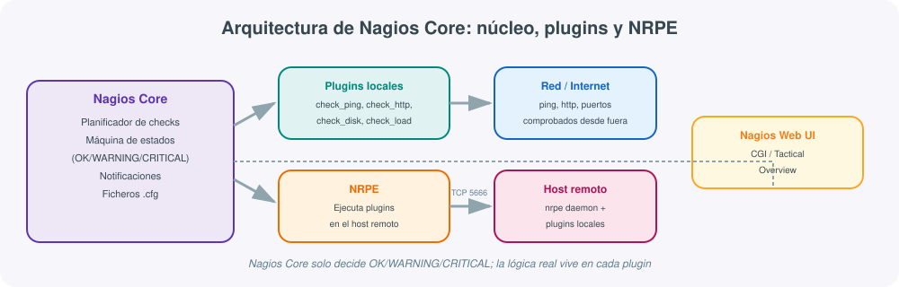
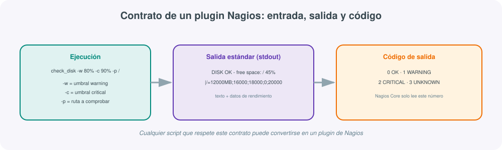
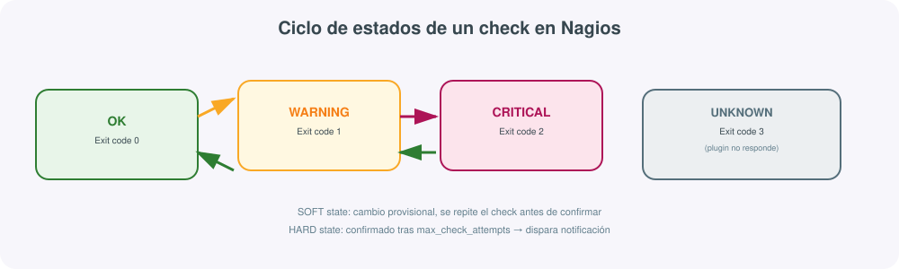

# **🚦 Nagios · El decano de la monitorización de disponibilidad**



## 1. Qué es Nagios y qué problema resuelve

**Nagios** es, junto a Zabbix, una de las herramientas de monitorización de código abierto más veteranas todavía en uso activo: el proyecto original (entonces llamado NetSaint) data de 1999, y su núcleo, **Nagios Core**, sigue siendo la base sobre la que se construyen distribuciones más completas como Nagios XI (versión comercial) o Icinga (un *fork* de la comunidad con interfaz modernizada).

A diferencia de Prometheus (centrado en series temporales de métricas) o de Zabbix (una plataforma todo-en-uno con mucha funcionalidad integrada), Nagios responde a una pregunta mucho más acotada y directa: **¿este servicio concreto está bien o mal ahora mismo?** Su unidad de trabajo no es una métrica numérica que evoluciona en el tiempo, sino un **check** que se ejecuta periódicamente y devuelve uno de cuatro estados posibles: OK, WARNING, CRITICAL o UNKNOWN.

!!! tip "Simplicidad como ventaja, no como carencia"
    Que Nagios no almacene series históricas ricas por defecto no es una limitación accidental: es una decisión de diseño que lo mantiene ligero, predecible y fácil de razonar. Para infraestructuras donde lo importante es saber "¿está caído o no?" de la forma más fiable y con el menor número de piezas móviles posible —el caso clásico de comprobar que un servidor responde a ping, que un puerto está abierto o que un certificado no va a caducar— Nagios sigue siendo una opción muy sólida.

## 2. Arquitectura: núcleo, plugins y NRPE

Nagios Core en sí mismo **no sabe comprobar nada**: su función es planificar cuándo ejecutar cada check, interpretar el resultado y decidir si notificar. Toda la lógica de comprobación real vive en los **plugins**, programas externos independientes del núcleo que Nagios simplemente invoca y cuya salida interpreta.

- **Nagios Core**: planificador de checks, máquina de estados, motor de notificaciones, lee su configuración de ficheros `.cfg` en texto plano.
- **Plugins**: ejecutables (normalmente scripts o binarios de los Nagios Plugins oficiales) que realizan la comprobación real: `check_ping`, `check_http`, `check_disk`, `check_load`, `check_mysql`...
- **NRPE (Nagios Remote Plugin Executor)**: un daemon que se instala en los hosts remotos y permite ejecutar plugins **locales a ese host** (por ejemplo, espacio en disco o carga de CPU) que Nagios no podría comprobar desde fuera por red.
- **Interfaz web (CGI)**: muestra el estado de todos los checks, permite reconocer problemas (*acknowledge*) y programar tiempos de inactividad planificada (*downtime*).

Esta separación entre núcleo y plugins es la razón por la que Nagios es tan extensible: cualquier programa que respete el contrato de entrada/salida esperado puede convertirse en un plugin nuevo, sin tocar el núcleo.

## 3. El contrato de un plugin: la clave de la extensibilidad



Un plugin de Nagios es, en esencia, cualquier script que cumpla dos reglas simples:

1. Escribe en la salida estándar (`stdout`) una línea de texto describiendo el resultado, opcionalmente seguida de datos de rendimiento tras un carácter `|`.
2. Termina con un **código de salida** (`exit code`) que Nagios interpreta directamente: `0` = OK, `1` = WARNING, `2` = CRITICAL, `3` = UNKNOWN.

```bash
#!/bin/bash
# Plugin mínimo: comprueba que un fichero de bloqueo no exista
if [ -f /var/lock/proceso.lock ]; then
    echo "CRITICAL - El proceso lleva bloqueado desde $(stat -c %y /var/lock/proceso.lock)"
    exit 2
else
    echo "OK - Sin bloqueos activos"
    exit 0
fi
```

Este contrato tan simple es lo que ha permitido que exista un ecosistema enorme de plugins de terceros (Nagios Exchange) para prácticamente cualquier sistema imaginable, y explica por qué herramientas más modernas como Icinga2 o incluso ciertos exporters de Prometheus mantienen compatibilidad con el formato de salida de los plugins de Nagios.

## 4. El ciclo de estados: SOFT y HARD



Nagios no dispara una notificación en cuanto un check devuelve un estado distinto de OK. Primero pasa por un estado **SOFT** (provisional) y repite el check hasta `max_check_attempts` veces antes de confirmarlo como estado **HARD**, momento en el que sí se envían las notificaciones configuradas:

```text
check_attempts = 3, check_interval = 5 minutos

Intento 1: CRITICAL (SOFT)  → no notifica, reintenta
Intento 2: CRITICAL (SOFT)  → no notifica, reintenta
Intento 3: CRITICAL (HARD)  → SÍ notifica
```

Este mecanismo evita notificaciones por fallos transitorios (un timeout puntual de red, un pico momentáneo de carga) sin necesidad de configurar ventanas de tiempo adicionales como sí requiere, por ejemplo, la cláusula `for` de las reglas de alerta de Prometheus.

## 5. Configuración: hosts, servicios y contactos

La configuración de Nagios se define en ficheros de texto plano organizados por tipo de objeto, típicamente bajo `/usr/local/nagios/etc/objects/`:

```text
# hosts.cfg
define host {
    use             linux-server
    host_name       servidor-web-01
    address         10.0.0.11
    max_check_attempts 3
    check_period    24x7
    notification_period 24x7
}

# services.cfg
define service {
    use                 generic-service
    host_name           servidor-web-01
    service_description Espacio en disco /
    check_command       check_disk!80%!90%!/
    check_interval      5
}

define service {
    use                 generic-service
    host_name           servidor-web-01
    service_description HTTP
    check_command       check_http
}

# contacts.cfg
define contact {
    contact_name    admin-sistemas
    service_notification_period  24x7
    host_notification_period     24x7
    service_notification_commands notify-service-by-email
    host_notification_commands    notify-host-by-email
    email           admin@midominio.local
}
```

Los objetos **plantilla** (`use linux-server`, `use generic-service`) funcionan de forma parecida a los templates de Zabbix: agrupan directivas comunes que se heredan, evitando repetir la misma configuración en cada host o servicio.

!!! warning "Validar antes de recargar"
    Un error de sintaxis en cualquiera de estos ficheros puede impedir que Nagios arranque. Antes de recargar el servicio en producción conviene ejecutar siempre `nagios -v /usr/local/nagios/etc/nagios.cfg`, que valida toda la configuración sin aplicarla y señala exactamente en qué línea está el problema.

## 6. Comprobar hosts remotos: NRPE

Los plugins como `check_http` o `check_ping` funcionan comprobando el host **desde fuera**, por red. Pero para saber cuánta CPU o memoria consume ese servidor **por dentro**, Nagios necesita ayuda de un agente local: ahí entra **NRPE**.

```ini
# /etc/nagios/nrpe.cfg en el host remoto
allowed_hosts=10.0.0.5
command[check_load]=/usr/lib/nagios/plugins/check_load -w 4,3,2 -c 6,5,4
command[check_disk_root]=/usr/lib/nagios/plugins/check_disk -w 20% -c 10% -p /
```

Y en el servidor Nagios, el servicio invoca ese comando remoto a través del puerto TCP 5666:

```text
define service {
    use                 generic-service
    host_name           servidor-web-01
    service_description Carga del sistema
    check_command       check_nrpe!check_load
}
```

## 7. Comparación con Zabbix y Prometheus

| Característica | Nagios Core | Zabbix | Prometheus + Grafana |
|---|---|---|---|
| Filosofía | Núcleo mínimo + plugins externos | Plataforma todo-en-uno | Ecosistema de piezas separadas |
| Modelo de datos | Estados discretos (OK/WARN/CRIT/UNK) | Items numéricos + triggers | Series temporales numéricas |
| Histórico rico | Limitado sin add-ons | Sí, nativo en base de datos | Sí, nativo en TSDB |
| Interfaz de configuración | Ficheros de texto (o front-ends de terceros) | Interfaz web completa | Ficheros YAML + interfaz de Grafana |
| Curva de aprendizaje | Baja-media | Media | Media (PromQL) |
| Mejor caso de uso | Comprobaciones de disponibilidad simples y estables, entornos con recursos limitados | Infraestructura heterogénea con un único panel | Métricas de aplicaciones y contenedores en entornos cloud-native |

## 8. Ejemplo: instalación mínima en Ubuntu

```bash
sudo apt update
sudo apt install -y nagios4 nagios-plugins-contrib monitoring-plugins-basic

# Definir un host y un servicio de ejemplo
sudo tee /etc/nagios4/conf.d/servidor-web.cfg > /dev/null <<'EOF'
define host {
    use             generic-host
    host_name       servidor-web-01
    address         10.0.0.11
}
define service {
    use                 generic-service
    host_name           servidor-web-01
    service_description HTTP
    check_command       check_http
}
EOF

sudo nagios4 -v /etc/nagios4/nagios.cfg   # validar configuración
sudo systemctl restart nagios4
```

La interfaz queda accesible en `http://servidor/nagios4`, autenticada mediante el usuario htpasswd creado durante la instalación del paquete.

## 9. Comandos básicos

| Comando | Para qué sirve |
|---|---|
| `nagios -v nagios.cfg` | Valida la configuración sin aplicarla |
| `systemctl restart nagios4` | Aplica la configuración validada |
| `/usr/lib/nagios/plugins/check_http -H midominio.local` | Ejecuta un plugin manualmente para depurar |
| `check_nrpe -H 10.0.0.11 -c check_load` | Prueba un check remoto vía NRPE desde el servidor |
| Interfaz web → *Schedule downtime* | Programa una ventana de mantenimiento sin generar alertas falsas |
| Interfaz web → *Acknowledge problem* | Marca un problema como reconocido, silenciando notificaciones repetidas |

## 10. Buenas prácticas

- **Usar plantillas (`use`) desde el principio** para hosts y servicios: evita duplicar directivas y facilita cambios globales.
- **Ajustar `max_check_attempts` e intervalos con criterio**: demasiado bajos generan falsos positivos por fallos transitorios; demasiado altos retrasan la detección de problemas reales.
- **Programar downtimes antes de mantenimientos planificados**, no después: evita ruido de notificaciones durante ventanas de mantenimiento conocidas.
- **Validar siempre con `-v` antes de recargar** en producción: un fallo de sintaxis puede dejar sin monitorización mientras se soluciona.
- **Separar NRPE con `allowed_hosts` restringido**: el daemon NRPE expuesto sin restricción de origen es un vector de ataque conocido.
- **No sobrecargar Nagios con lo que no es su fuerte**: para históricos ricos o dashboards visuales avanzados, complementarlo con Grafana (que también puede consultar Nagios vía plugins) en lugar de forzarlo a hacer algo para lo que no fue diseñado.

## Para profundizar

La [documentación oficial de Nagios Core](https://www.nagios.org/documentation/){:target="_blank"} explica en detalle el sistema de objetos de configuración y el ciclo de vida de los checks; [Nagios Exchange](https://exchange.nagios.org/){:target="_blank"} es el repositorio central de plugins de la comunidad para prácticamente cualquier sistema o servicio. Para quien busque una interfaz más moderna sin abandonar el modelo de checks de Nagios, [Icinga2](https://icinga.com/docs/icinga-2/latest/doc/01-about/){:target="_blank"} es compatible con los mismos plugins y merece la pena como alternativa a evaluar. El resto de enlaces de referencia del módulo está recopilado en la página de Recursos.
