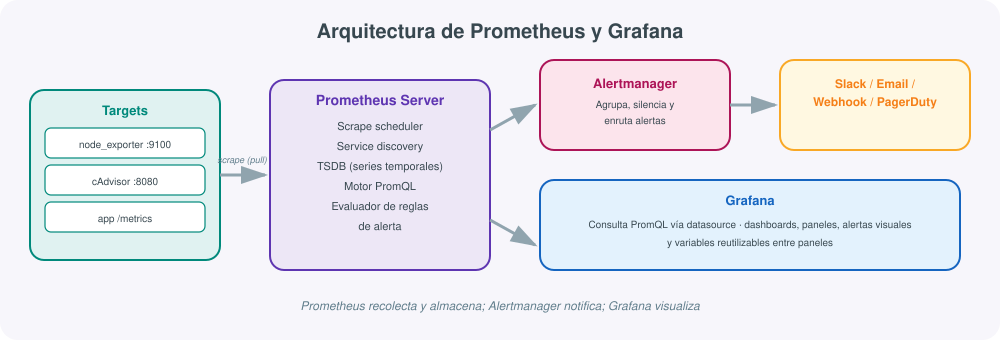
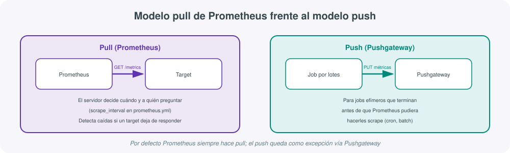
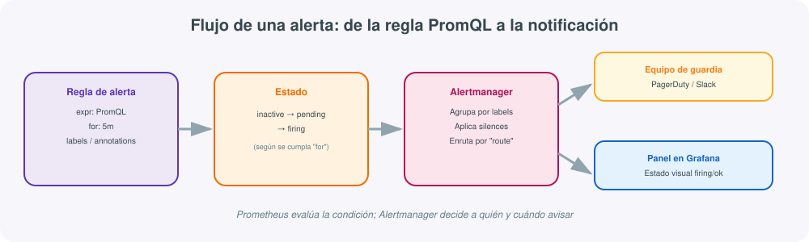

# **📈 Prometheus y Grafana · Monitorización basada en métricas**



## 1. Qué son y qué problema resuelven

A medida que una infraestructura crece —más servidores, más contenedores, más microservicios— la pregunta "¿está todo funcionando bien ahora mismo?" deja de tener una respuesta trivial. Revisar manualmente el uso de CPU, memoria o la latencia de cada servicio es tan inviable como configurar cada servidor a mano, el mismo problema de fondo que se plantea en la unidad de automatización con Ansible, Vagrant y Terraform, pero aplicado a la observación en lugar de a la configuración.

**Prometheus** es un sistema de monitorización y alerta de código abierto, nacido en SoundCloud y hoy proyecto de referencia de la CNCF (la misma fundación que aloja Kubernetes), especializado en recolectar **métricas** —valores numéricos que cambian en el tiempo, como el porcentaje de CPU o el número de peticiones por segundo— y almacenarlas como **series temporales**. **Grafana** es la herramienta de visualización que se apoya sobre esos datos para construir dashboards interactivos, y aunque puede usarse con otras fuentes de datos, la combinación Prometheus + Grafana es, con diferencia, el estándar de facto en el ecosistema cloud-native.

!!! tip "Métricas, no logs ni trazas"
    Conviene situar Prometheus dentro de los tres pilares de la observabilidad: **métricas** (series numéricas agregables, el terreno de Prometheus), **logs** (eventos textuales detallados, terreno de Elastic Stack, ver el apartado correspondiente de esta unidad) y **trazas** (el recorrido de una petición entre servicios, terreno de herramientas como Jaeger). Prometheus no sustituye a un sistema de logs; responde a "¿cuánta CPU se ha usado en la última hora?", no a "¿qué error concreto lanzó esa petición a las 10:03?".

## 2. Arquitectura: scraping, almacenamiento y componentes

Como muestra el diagrama de esta sección, un despliegue típico de Prometheus se compone de varias piezas independientes que se comunican entre sí:

- **Targets / exporters**: procesos que exponen sus métricas en un endpoint HTTP, normalmente `/metrics`, en formato de texto plano. Pueden ser aplicaciones instrumentadas directamente o **exporters** que traducen métricas de un sistema de terceros a este formato (`node_exporter` para métricas de sistema operativo, `cAdvisor` para contenedores, `mysqld_exporter` para MySQL...).
- **Prometheus Server**: el núcleo del sistema. Contiene el planificador de *scraping* (recolección periódica), el descubrimiento de servicios (*service discovery*, capaz de detectar targets automáticamente en Kubernetes, Consul o ficheros estáticos), la base de datos de series temporales (**TSDB**) donde se almacenan los datos localmente en disco, el motor de consultas **PromQL** y el evaluador de reglas de alerta.
- **Alertmanager**: componente separado que recibe las alertas que Prometheus dispara, las agrupa, aplica silencios y las enruta al canal adecuado (Slack, correo, PagerDuty, un *webhook* propio).
- **Grafana**: consulta Prometheus como *datasource* mediante PromQL y renderiza los resultados en paneles y dashboards.

!!! note "Almacenamiento local, no una base de datos distribuida"
    Por defecto, Prometheus guarda su TSDB en disco local, en el propio servidor, con una retención configurable (`--storage.tsdb.retention.time`, habitualmente 15 días). Para retención a muy largo plazo o alta disponibilidad se recurre a soluciones de *remote write* hacia backends externos como Thanos, Cortex o Mimir, que quedan fuera del alcance de una instalación básica pero conviene conocer si el volumen de métricas crece mucho.

## 3. El modelo pull: cómo recolecta Prometheus sus datos

La decisión de diseño más característica de Prometheus es que funciona en modo **pull**: es el propio servidor Prometheus quien, cada cierto intervalo (`scrape_interval`), va a buscar activamente las métricas a cada target, en lugar de esperar a que los targets se las envíen.



Esto se configura en el fichero central `prometheus.yml`:

```yaml
global:
  scrape_interval: 15s
  evaluation_interval: 15s

scrape_configs:
  - job_name: "node"
    static_configs:
      - targets: ["10.0.0.11:9100", "10.0.0.12:9100"]

  - job_name: "cadvisor"
    static_configs:
      - targets: ["10.0.0.11:8080"]

  - job_name: "app"
    metrics_path: /metrics
    static_configs:
      - targets: ["app.local:8000"]
```

El modelo pull tiene ventajas prácticas claras: Prometheus sabe inmediatamente si un target no responde (lo marca como `down`, lo cual es en sí mismo una señal de monitorización), no depende de que cada aplicación gestione correctamente el envío de sus propios datos, y es trivial comprobar el estado de la recolección visitando `http://localhost:9090/targets`.

Para los casos en los que el modelo pull no encaja —trabajos por lotes (*batch jobs*) muy cortos que terminan antes de que Prometheus pudiera hacerles scrape— existe el **Pushgateway**, un componente intermedio al que esos trabajos empujan sus métricas una vez, y que Prometheus sí puede scrapear con normalidad.

## 4. PromQL: el lenguaje de consultas

**PromQL** (Prometheus Query Language) es el lenguaje funcional con el que se interrogan las series temporales almacenadas. Una serie se identifica por un nombre de métrica y un conjunto de pares clave-valor llamados *labels*, por ejemplo `http_requests_total{method="POST", status="500"}`.

Algunas consultas habituales:

```promql
# Uso de CPU medio por instancia en los últimos 5 minutos
100 - (avg by (instance) (rate(node_cpu_seconds_total{mode="idle"}[5m])) * 100)

# Tasa de peticiones por segundo agrupada por código de estado
sum by (status) (rate(http_requests_total[5m]))

# Porcentaje de memoria disponible
node_memory_MemAvailable_bytes / node_memory_MemTotal_bytes * 100

# Alertar si más del 5% de las peticiones son error 5xx
sum(rate(http_requests_total{status=~"5.."}[5m]))
  / sum(rate(http_requests_total[5m])) > 0.05
```

Los cuatro tipos de métrica que soporta el modelo de datos de Prometheus son **counter** (valor que solo crece, como el total de peticiones), **gauge** (valor que sube y baja libremente, como la memoria usada), **histogram** (distribución de valores en cubos, útil para latencias) y **summary** (similar al histogram pero con cuantiles calculados en el propio cliente).

!!! warning "`rate()` solo tiene sentido sobre counters"
    Un error habitual al empezar con PromQL es aplicar `rate()` (que calcula la variación por segundo) sobre una métrica de tipo `gauge`. `rate()` está pensado para *counters*, que solo crecen; sobre un gauge el resultado no tiene una interpretación coherente. Para gauges se usan funciones como `avg_over_time()` o `deriv()`.

## 5. Instrumentación de aplicaciones propias

Además de los exporters ya construidos por la comunidad, cualquier aplicación puede exponer sus propias métricas usando las **client libraries** oficiales de Prometheus, disponibles para Go, Python, Java, Node.js y otros lenguajes. En Python, por ejemplo:

```python
from prometheus_client import Counter, Histogram, start_http_server
import time

PETICIONES = Counter("app_peticiones_total", "Total de peticiones recibidas", ["metodo"])
LATENCIA = Histogram("app_latencia_segundos", "Latencia de las peticiones")

@LATENCIA.time()
def procesar_peticion(metodo):
    PETICIONES.labels(metodo=metodo).inc()
    time.sleep(0.1)

if __name__ == "__main__":
    start_http_server(8000)  # expone /metrics en el puerto 8000
    while True:
        procesar_peticion("GET")
```

Con esto, la aplicación queda lista para ser añadida como un `job` más en `prometheus.yml`, exactamente igual que cualquier exporter de terceros.

## 6. Alertas: de la regla PromQL a la notificación

Las reglas de alerta se definen también en PromQL, dentro de ficheros de reglas que Prometheus evalúa periódicamente:



```yaml
groups:
  - name: disco-y-cpu
    rules:
      - alert: DiscoCasiLleno
        expr: node_filesystem_avail_bytes{mountpoint="/"} / node_filesystem_size_bytes{mountpoint="/"} < 0.10
        for: 10m
        labels:
          severity: warning
        annotations:
          summary: "Menos del 10% de espacio libre en {{ $labels.instance }}"

      - alert: CPUAlta
        expr: 100 - (avg by (instance) (rate(node_cpu_seconds_total{mode="idle"}[5m])) * 100) > 90
        for: 5m
        labels:
          severity: critical
        annotations:
          summary: "CPU por encima del 90% en {{ $labels.instance }} durante 5 minutos"
```

Una alerta pasa por tres estados: `inactive` (condición no cumplida), `pending` (condición cumplida pero aún no ha transcurrido el tiempo indicado en `for`) y `firing` (se envía a Alertmanager). Este `for` es clave para evitar falsos positivos por picos puntuales: una CPU al 95% durante 10 segundos no debería despertar a nadie a las 3 de la madrugada.

**Alertmanager** recibe las alertas en `firing` y decide qué hacer con ellas según su configuración de `route` (a qué receptor enviar cada alerta según sus labels), `group_by` (agrupar alertas relacionadas en una sola notificación) e `inhibit_rules` (silenciar alertas de menor severidad cuando ya hay una de mayor severidad activa para el mismo problema).

## 7. Grafana: dashboards sobre los datos de Prometheus

Grafana no almacena métricas propias: se conecta a Prometheus (u otras fuentes: Loki, Elasticsearch, MySQL, InfluxDB...) como **datasource** y traduce la interacción del usuario en consultas PromQL. Los elementos principales de un dashboard son:

- **Paneles**: cada gráfico, tabla o indicador individual, cada uno con su propia consulta PromQL.
- **Variables**: parámetros reutilizables (por ejemplo, `$instance`) que permiten que un mismo dashboard sirva para filtrar entre servidores, entornos o servicios sin duplicar paneles.
- **Alertas de Grafana**: desde la versión 8, Grafana incluye su propio motor de alertas capaz de evaluar consultas y notificar, como alternativa o complemento a Alertmanager.
- **Anotaciones**: marcas temporales sobre los gráficos (por ejemplo, el momento de un despliegue) que ayudan a correlacionar cambios de comportamiento con eventos concretos.

!!! example "Dashboards ya hechos, sin partir de cero"
    [grafana.com/grafana/dashboards](https://grafana.com/grafana/dashboards/){:target="_blank"} aloja miles de dashboards públicos listos para importar, indicando solo su ID numérico. Para métricas de sistema con `node_exporter`, el dashboard **1860 ("Node Exporter Full")** es el punto de partida estándar en la mayoría de instalaciones, y evita construir desde cero paneles que ya están bien resueltos por la comunidad.

## 8. Comparación con otras herramientas de monitorización

| Característica | Prometheus + Grafana | Zabbix | Nagios | Elastic Stack |
|---|---|---|---|---|
| Enfoque principal | Métricas y series temporales | Métricas + checks activos/pasivos | Comprobación de estado (up/down) | Logs (y métricas con Metricbeat) |
| Modelo de recolección | Pull (scrape HTTP) | Agente (pull/push) o SNMP | Plugins ejecutados por el servidor o NRPE | Push (Beats/Logstash envían al índice) |
| Lenguaje de consulta | PromQL | Filtros propios de la interfaz | No aplica (basado en estados) | DSL de Elasticsearch / KQL |
| Punto fuerte | Ecosistema cloud-native, Kubernetes | Todo en uno, sin piezas sueltas | Sencillez y estabilidad probada | Búsqueda y análisis de texto a gran escala |
| Curva de aprendizaje | Media (PromQL requiere práctica) | Media | Baja | Alta (stack completo) |

En la práctica, muchas infraestructuras combinan varias de estas herramientas: Prometheus para métricas de aplicaciones y contenedores, Elastic Stack para centralizar logs, y Zabbix o Nagios para comprobaciones más tradicionales de disponibilidad de red y hardware.

## 9. Ejemplo completo: pila mínima con Docker Compose

El siguiente `docker-compose.yml` levanta Prometheus, `node_exporter` y Grafana ya conectados entre sí, un punto de partida habitual para probar la pila completa en un laboratorio:

```yaml
version: "3.8"
services:
  node-exporter:
    image: prom/node-exporter:latest
    ports:
      - "9100:9100"

  prometheus:
    image: prom/prometheus:latest
    volumes:
      - ./prometheus.yml:/etc/prometheus/prometheus.yml
    ports:
      - "9090:9090"
    depends_on:
      - node-exporter

  grafana:
    image: grafana/grafana:latest
    ports:
      - "3000:3000"
    environment:
      - GF_SECURITY_ADMIN_PASSWORD=admin
    depends_on:
      - prometheus
```

Con el `prometheus.yml` del apartado 3 apuntando a `node-exporter:9100`, tras un `docker compose up -d` basta con entrar en `http://localhost:3000` (usuario `admin`), añadir Prometheus (`http://prometheus:9090`) como datasource e importar el dashboard 1860 para tener métricas de sistema visualizadas en minutos.

## 10. Comandos y rutas útiles

| Elemento | Para qué sirve |
|---|---|
| `http://localhost:9090/targets` | Estado de todos los targets configurados (up/down) |
| `http://localhost:9090/graph` | Consola web para probar consultas PromQL |
| `http://localhost:9090/rules` | Estado de las reglas de alerta cargadas |
| `promtool check config prometheus.yml` | Valida la sintaxis del fichero de configuración |
| `promtool check rules alertas.yml` | Valida la sintaxis de las reglas de alerta |
| `curl localhost:9100/metrics` | Comprueba en crudo qué expone un exporter |
| `amtool alert query` | Consulta desde línea de comandos las alertas activas en Alertmanager |

## 11. Buenas prácticas

- **Etiquetar (label) con criterio, no en exceso**: cada combinación distinta de labels crea una serie temporal nueva; un uso descontrolado de labels de alta cardinalidad (por ejemplo, un `user_id` como label) puede disparar el consumo de memoria del TSDB.
- **Definir `for` en las reglas de alerta**: evita ruido por picos puntuales que se resuelven solos en segundos.
- **Separar alertas por severidad** (`warning`, `critical`) y enrutarlas de forma distinta en Alertmanager: no todo merece despertar a alguien de madrugada.
- **Versionar `prometheus.yml` y las reglas de alerta en Git**, igual que cualquier otro artefacto de infraestructura como código.
- **Usar `promtool check` antes de recargar Prometheus** en producción, para no tumbar la recolección por un error de sintaxis.
- **Aprovechar dashboards de la comunidad como punto de partida** antes de construir paneles desde cero.
- **Vigilar la retención y el tamaño del TSDB**: para históricos largos o alta disponibilidad, planificar desde el principio una solución de *remote write* en lugar de crecer sin límite en disco local.

## Para profundizar

La documentación oficial de Prometheus explica en detalle el [modelo de datos](https://prometheus.io/docs/concepts/data_model/){:target="_blank"} y ofrece una [referencia completa de PromQL](https://prometheus.io/docs/prometheus/latest/querying/basics/){:target="_blank"}; la [lista de exporters oficiales y de la comunidad](https://prometheus.io/docs/instrumenting/exporters/){:target="_blank"} cubre prácticamente cualquier sistema habitual (bases de datos, colas de mensajes, balanceadores). Del lado de Grafana, la [documentación de dashboards](https://grafana.com/docs/grafana/latest/dashboards/){:target="_blank"} explica variables, anotaciones y paneles, y el repositorio [awesome-prometheus-alerts](https://github.com/samber/awesome-prometheus-alerts){:target="_blank"} recopila reglas de alerta ya probadas para los casos más comunes. El resto de enlaces de referencia del módulo está recopilado en la página de Recursos.
