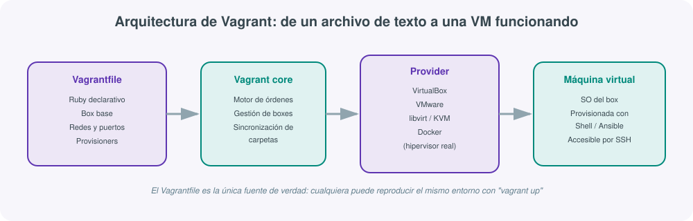
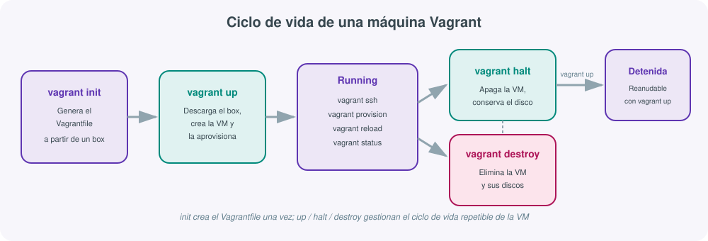
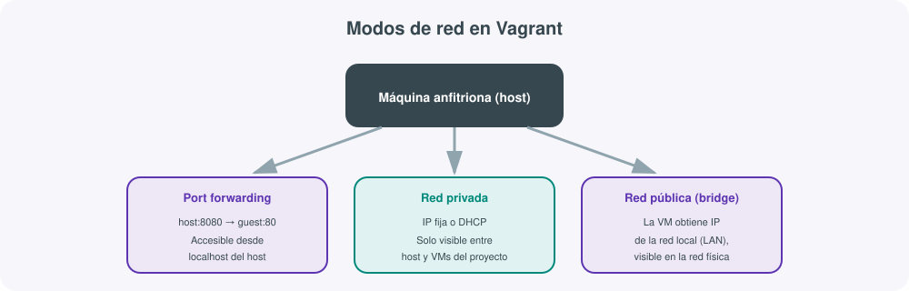

# **📦 Vagrant · Entornos de desarrollo reproducibles**



## 1. Qué es Vagrant y qué problema resuelve

Cualquiera que haya trabajado en un equipo de desarrollo ha vivido, en algún momento, la frase: *"en mi máquina funciona"*. Un desarrollador tiene una versión concreta de Python, otro tiene otra distinta; uno tiene una base de datos con una configuración específica, otro no la tiene instalada en absoluto; el servidor de producción usa Ubuntu 22.04 y el portátil de turno usa Windows con WSL mal configurado. El resultado es que un bug que "no existe" en el entorno de un desarrollador aparece en cuanto el código llega a otro entorno, incluida producción.

**Vagrant**, desarrollado por HashiCorp, es una herramienta que permite describir en un único fichero de texto (el `Vagrantfile`) cómo debe ser una máquina virtual de desarrollo —qué sistema operativo, cuánta memoria, qué redes, qué software debe llevar preinstalado— y compartir ese fichero con el resto del equipo. Cualquier persona que ejecute `vagrant up` sobre ese mismo fichero obtiene, en minutos, una máquina virtual idéntica a la de sus compañeros, sin importar si su sistema operativo anfitrión es Windows, macOS o Linux.

!!! tip "Vagrant no sustituye a Docker, lo complementa"
    Es habitual confundir el papel de Vagrant con el de Docker. Docker virtualiza a nivel de proceso (contenedores que comparten el kernel del host), mientras que Vagrant orquesta **máquinas virtuales completas** con su propio kernel, gestionadas por un hipervisor. Vagrant es la herramienta adecuada cuando se necesita replicar un sistema operativo completo (por ejemplo, para practicar administración de sistemas, probar un playbook de Ansible contra una VM real, o simular una topología de red con varios servidores), mientras que Docker es más ligero cuando basta con aislar una aplicación y sus dependencias.

## 2. El problema de fondo: reproducibilidad

La reproducibilidad de un entorno depende de fijar, de forma explícita y versionable, un conjunto de decisiones que normalmente quedan implícitas:

- **Sistema operativo y versión exacta** (no "Ubuntu", sino Ubuntu 22.04.4 concretamente).
- **Recursos asignados** (memoria RAM, núcleos de CPU, disco).
- **Software preinstalado** (paquetes, versiones de runtime, dependencias del sistema).
- **Configuración de red** (qué puertos están expuestos, qué IP tiene la máquina).
- **Estado inicial de datos** (una base de datos vacía, o con un volcado de ejemplo ya cargado).

Vagrant no resuelve esto por sí mismo: se apoya en un **hipervisor** ya instalado en el equipo (VirtualBox es el más habitual, aunque también soporta VMware, libvirt/KVM o incluso proveedores de contenedores) y en una **caja base** (*box*) que ya trae un sistema operativo instalado. Lo que aporta Vagrant es la capa de orquestación: un único fichero de texto, versionable en Git junto al propio código del proyecto, que describe de forma completa y reproducible cómo construir ese entorno desde cero.

## 3. Arquitectura: Vagrantfile, providers y boxes

### El Vagrantfile

Es un fichero escrito en **Ruby** (aunque en la mayoría de casos no hace falta saber Ruby, solo seguir la sintaxis declarativa habitual) que vive en la raíz del proyecto y describe la máquina o máquinas virtuales necesarias:

```ruby
Vagrant.configure("2") do |config|
  config.vm.box = "ubuntu/jammy64"
  config.vm.hostname = "servidor-dev"

  config.vm.network "private_network", ip: "192.168.56.10"
  config.vm.network "forwarded_port", guest: 80, host: 8080

  config.vm.provider "virtualbox" do |vb|
    vb.memory = "2048"
    vb.cpus = 2
  end

  config.vm.provision "shell", inline: <<-SHELL
    apt-get update
    apt-get install -y nginx
  SHELL
end
```

Este fichero, al estar versionado junto al código del proyecto, hace que "clonar el repositorio y ejecutar `vagrant up`" sea, literalmente, todo lo que necesita una persona nueva en el equipo para tener un entorno de desarrollo funcional.

### Providers

Un **provider** es el hipervisor o plataforma de virtualización que realmente crea y ejecuta la máquina virtual. Vagrant no virtualiza nada por sí mismo: delega esa tarea en el provider configurado.

| Provider | Descripción | Cuándo se usa |
|---|---|---|
| **VirtualBox** | Gratuito, multiplataforma, el más usado por defecto | Entornos de desarrollo locales en Windows, macOS o Linux |
| **VMware** (Workstation/Fusion) | De pago, más rendimiento y estabilidad | Equipos que ya tienen licencia VMware |
| **libvirt / KVM** | Nativo de Linux, muy ligero | Servidores Linux o desarrolladores que ya usan KVM |
| **Docker** | Usa contenedores en lugar de VMs completas | Cuando se quiere la sintaxis de Vagrant pero con el peso de un contenedor |
| **Proveedores cloud** (AWS, Azure) | Complementos de terceros que crean instancias remotas | Entornos de prueba efímeros en la nube, gestionados con la misma interfaz de Vagrant |

### Boxes

Una **box** es la imagen base empaquetada de una máquina virtual: un sistema operativo ya instalado y listo para arrancar, publicado normalmente en el catálogo público de [Vagrant Cloud](https://portal.cloud.hashicorp.com/vagrant/discover){:target="_blank"}. Es el equivalente, conceptualmente, a una imagen base de Docker o a una AMI de AWS.

```bash
vagrant box add ubuntu/jammy64
vagrant box list
vagrant box remove ubuntu/jammy64
```

Descargar una box es una operación que se hace una sola vez por máquina anfitriona: Vagrant la guarda en caché local y la reutiliza para crear tantas VMs como haga falta a partir de ella, sin volver a descargarla.

## 4. Ciclo de vida de una máquina Vagrant



Una máquina Vagrant atraviesa un ciclo de vida bien definido, y cada fase tiene su comando asociado:

1. **`vagrant init <box>`**: genera un `Vagrantfile` de partida en el directorio actual, apuntando a la box indicada. Se ejecuta una sola vez al crear el proyecto.
2. **`vagrant up`**: descarga la box si no está en caché, crea la máquina virtual en el provider configurado, la arranca y ejecuta los *provisioners* definidos (instalación de software, scripts, Ansible...).
3. **Máquina en ejecución**: durante este estado se puede trabajar dentro de la VM, acceder por SSH, o volver a lanzar el aprovisionamiento.
4. **`vagrant halt`**: apaga la máquina de forma ordenada, conservando su disco. Es el equivalente a apagar un ordenador: al volver a hacer `vagrant up`, el estado del disco persiste.
5. **`vagrant destroy`**: elimina por completo la máquina virtual y sus discos asociados. A diferencia de `halt`, esta operación no es reversible: el siguiente `vagrant up` reconstruye la VM desde cero, aplicando de nuevo todo el aprovisionamiento.

## 5. Comandos básicos

| Comando | Qué hace |
|---|---|
| `vagrant init <box>` | Crea un Vagrantfile de partida en el directorio actual |
| `vagrant up` | Crea (si no existe) y arranca la máquina virtual |
| `vagrant status` | Muestra el estado actual de la(s) máquina(s) definidas |
| `vagrant ssh` | Abre una sesión SSH interactiva dentro de la máquina |
| `vagrant ssh -c "comando"` | Ejecuta un comando puntual dentro de la VM sin sesión interactiva |
| `vagrant halt` | Apaga la máquina conservando el disco |
| `vagrant reload` | Reinicia la máquina, releyendo la configuración de red del Vagrantfile |
| `vagrant provision` | Vuelve a ejecutar los provisioners sin recrear la máquina |
| `vagrant reload --provision` | Reinicia y reaprovisiona en un solo paso (útil tras editar el Vagrantfile) |
| `vagrant suspend` / `vagrant resume` | Congela el estado de la VM en disco (como una hibernación) y lo restaura |
| `vagrant destroy` | Elimina la máquina virtual y sus discos |
| `vagrant box add <box>` | Descarga una box al caché local |
| `vagrant box list` | Lista las boxes ya descargadas |
| `vagrant global-status` | Lista todas las máquinas Vagrant activas en el sistema, de cualquier proyecto |

!!! note "`vagrant destroy` no borra el Vagrantfile"
    Es un error común pensar que `vagrant destroy` elimina el proyecto. Solo elimina la máquina virtual y sus discos: el `Vagrantfile` (la "receta") permanece intacto, y un `vagrant up` posterior reconstruye la máquina desde cero exactamente igual que la primera vez. Esta separación entre la receta (versionada en Git) y la instancia (efímera, recreable) es la misma idea de fondo que sostiene la infraestructura como código en Terraform.

## 6. Provisioners: Shell y Ansible

Un **provisioner** es el mecanismo que instala software y aplica configuración dentro de la máquina, justo después de que arranque por primera vez (o cuando se ejecuta `vagrant provision`). Vagrant soporta varios tipos, siendo los más habituales:

### Shell provisioner

El más simple: ejecuta un script o comandos de shell directamente dentro de la VM.

```ruby
config.vm.provision "shell", inline: <<-SHELL
  apt-get update
  apt-get install -y nginx git curl
  systemctl enable nginx
SHELL
```

También puede apuntar a un script externo, lo cual mantiene el Vagrantfile más limpio:

```ruby
config.vm.provision "shell", path: "provision/instalar-nginx.sh"
```

### Ansible provisioner

Cuando la configuración necesaria es más compleja que unas pocas líneas de shell, tiene sentido delegarla en Ansible (visto en el apartado anterior de esta unidad), aprovechando toda su expresividad de roles, plantillas e idempotencia:

```ruby
config.vm.provision "ansible" do |ansible|
  ansible.playbook = "playbook.yml"
  ansible.inventory_path = "inventory.ini"
  ansible.limit = "all"
end
```

Con esta configuración, cada `vagrant up` (o `vagrant provision`) ejecuta automáticamente el playbook indicado contra la máquina recién creada, combinando la reproducibilidad del entorno (Vagrant) con la potencia de gestión de configuración (Ansible) sin pasos manuales intermedios.

!!! example "Un flujo de trabajo real"
    Un equipo docente prepara una práctica de administración de sistemas: el `Vagrantfile` levanta una VM con Ubuntu Server mínimo, y un playbook de Ansible (`provision/aula.yml`) instala Apache, crea los usuarios del alumnado y despliega los ficheros de la práctica. El alumnado solo necesita clonar el repositorio y ejecutar `vagrant up`: en unos minutos tiene, de forma idéntica en cualquier ordenador del aula, el mismo entorno que ha preparado el docente.

## 7. Redes en Vagrant



Vagrant ofrece tres formas principales de conectar la máquina virtual con el exterior, configurables en el bloque `config.vm.network`:

### Port forwarding (reenvío de puertos)

Redirige un puerto del anfitrión hacia un puerto de la máquina virtual. Es el modo más simple para acceder a un servicio (por ejemplo, un servidor web) desde el navegador del anfitrión sin tener que conocer la IP interna de la VM:

```ruby
config.vm.network "forwarded_port", guest: 80, host: 8080
```

Con esta línea, `http://localhost:8080` en el anfitrión llega al puerto 80 de la VM.

### Red privada (private network)

Asigna a la VM una IP dentro de una red aislada, visible solo desde el anfitrión y desde otras VMs del mismo proyecto Vagrant. Es el modo recomendado cuando hay que comunicar varias máquinas entre sí (por ejemplo, un servidor web y un servidor de base de datos) sin exponerlas a la red física:

```ruby
config.vm.network "private_network", ip: "192.168.56.10"
```

### Red pública (public network / bridge)

Conecta la VM directamente a la red física del anfitrión (modo *bridge*), obteniendo una IP de la misma red local (por ejemplo, del router de casa o del centro). Es útil cuando otros dispositivos de la red necesitan acceder directamente a la VM, pero expone la máquina fuera del propio equipo:

```ruby
config.vm.network "public_network"
```

## 8. Carpetas compartidas (synced folders)

Además de la red, Vagrant sincroniza automáticamente una carpeta del anfitrión con una carpeta dentro de la VM (por defecto, el propio directorio del proyecto se monta en `/vagrant` dentro de la máquina). Esto permite editar el código con el editor habitual en el sistema anfitrión mientras se ejecuta dentro de la máquina virtual:

```ruby
config.vm.synced_folder "./app", "/var/www/app"
```

## 9. Ejemplo completo: Vagrantfile con múltiples máquinas

Es habitual necesitar más de una máquina virtual coordinada entre sí —por ejemplo, un balanceador, dos servidores web y un servidor de base de datos, simulando una arquitectura real dentro de un único portátil. Vagrant permite definir varias máquinas en el mismo `Vagrantfile`:

```ruby
Vagrant.configure("2") do |config|

  # Servidor de base de datos
  config.vm.define "db" do |db|
    db.vm.box = "ubuntu/jammy64"
    db.vm.hostname = "db"
    db.vm.network "private_network", ip: "192.168.56.10"
    db.vm.provider "virtualbox" do |vb|
      vb.memory = "1024"
    end
    db.vm.provision "shell", path: "provision/db.sh"
  end

  # Dos servidores web idénticos
  (1..2).each do |i|
    config.vm.define "web#{i}" do |web|
      web.vm.box = "ubuntu/jammy64"
      web.vm.hostname = "web#{i}"
      web.vm.network "private_network", ip: "192.168.56.#{10 + i}"
      web.vm.network "forwarded_port", guest: 80, host: 8080 + i
      web.vm.provider "virtualbox" do |vb|
        vb.memory = "1024"
      end
      web.vm.provision "ansible" do |ansible|
        ansible.playbook = "playbook-nginx.yml"
      end
    end
  end

  # Balanceador de carga
  config.vm.define "lb" do |lb|
    lb.vm.box = "ubuntu/jammy64"
    lb.vm.hostname = "lb"
    lb.vm.network "private_network", ip: "192.168.56.20"
    lb.vm.network "forwarded_port", guest: 80, host: 8080
    lb.vm.provision "shell", path: "provision/haproxy.sh"
  end

end
```

Con este único fichero, `vagrant up` levanta las cuatro máquinas en orden, cada una con su propia IP privada y su propio aprovisionamiento. Se puede operar sobre una máquina concreta indicando su nombre:

```bash
vagrant up db
vagrant ssh web1
vagrant halt web2
vagrant destroy lb
```

Y `vagrant status` mostrará el estado individual de cada una de las cuatro definiciones.

## 10. Buenas prácticas

- **Versionar el Vagrantfile en Git junto al código del proyecto**: es, junto con el propio código fuente, la documentación ejecutable de qué entorno necesita el proyecto para funcionar.
- **Usar boxes oficiales o muy conocidas** (`ubuntu/jammy64`, `debian/bookworm64`, `generic/rocky9`) en lugar de boxes de procedencia dudosa: una box no deja de ser una imagen de sistema operativo completa, y ejecutar una de origen desconocido implica el mismo riesgo que ejecutar cualquier binario no verificado.
- **Fijar la versión de la box** (`config.vm.box_version`) en proyectos que deban ser reproducibles a largo plazo, ya que las boxes "latest" pueden cambiar con el tiempo.
- **No asumir recursos infinitos**: ajustar `vb.memory` y `vb.cpus` a lo que realmente necesita la práctica, especialmente en aulas donde varios estudiantes ejecutan VMs simultáneamente en equipos modestos.
- **Preferir el provisioner de Ansible sobre scripts de shell largos** en cuanto la configuración supere una docena de líneas: gana en legibilidad, reutilización e idempotencia.
- **Destruir las máquinas que ya no se usan** (`vagrant destroy`): a diferencia de un contenedor, una VM detenida sigue ocupando el disco completo asignado.

## Ansible vs Vagrant vs Terraform: cuándo usar cada uno

Desde la perspectiva de Vagrant, conviene tener claro dónde termina su responsabilidad y dónde empieza la de las otras dos herramientas:

| Aspecto | Ansible | Vagrant | Terraform |
|---|---|---|---|
| Propósito principal | Configurar software dentro de máquinas ya existentes | Crear y gestionar entornos de desarrollo locales reproducibles | Crear y gestionar infraestructura (VMs, redes, servicios cloud) |
| Ámbito habitual | Servidores ya provisionados, locales o en la nube | El portátil o estación de trabajo de cada desarrollador | Entornos cloud o de centro de datos, normalmente compartidos por un equipo |
| Ciclo de vida típico | Se ejecuta repetidamente sobre la misma infraestructura | Se crea y destruye con frecuencia (`up` / `destroy`), es desechable por diseño | Se mantiene "vivo" durante meses o años, con cambios incrementales |
| Backend / estado | No mantiene estado propio (actúa sobre el estado real del sistema) | El estado lo gestiona el propio hipervisor (VirtualBox, etc.) | Mantiene un fichero de estado (`.tfstate`) explícito |
| Ejemplo típico de uso | Instalar y configurar Nginx en 20 servidores | Levantar un clúster de pruebas idéntico en el portátil de cada estudiante o desarrollador | Crear la VPC, las instancias EC2 y el balanceador en AWS |

Vagrant es, en la práctica, la puerta de entrada más habitual para aprender Ansible: al no depender de una cuenta cloud ni de costes asociados, permite practicar playbooks completos contra máquinas virtuales reales en el propio ordenador, antes de aplicar exactamente los mismos playbooks contra infraestructura creada por Terraform en un proveedor cloud.

## Para profundizar

La documentación oficial de HashiCorp para Vagrant cubre en detalle cada pieza vista en este apartado: la [guía de introducción a Vagrant](https://developer.hashicorp.com/vagrant/docs/index){:target="_blank"} explica la instalación y el flujo básico paso a paso; la [referencia de configuración de red](https://developer.hashicorp.com/vagrant/docs/networking){:target="_blank"} detalla los tres modos de red vistos en el apartado 7; y la [documentación de provisioners](https://developer.hashicorp.com/vagrant/docs/provisioning){:target="_blank"} recoge todas las opciones disponibles más allá de Shell y Ansible (Puppet, Chef, Docker). El resto de enlaces de referencia del módulo está recopilado en la página de Recursos.
