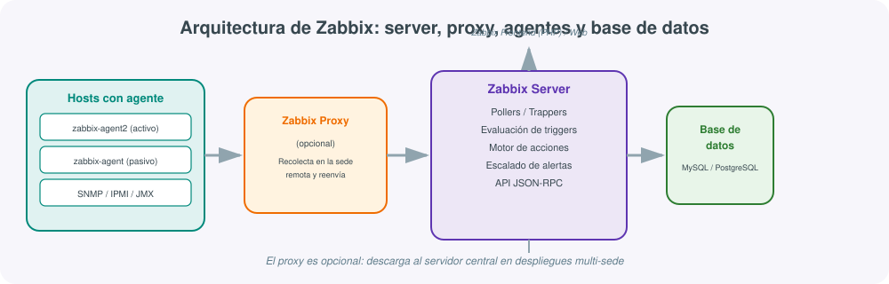
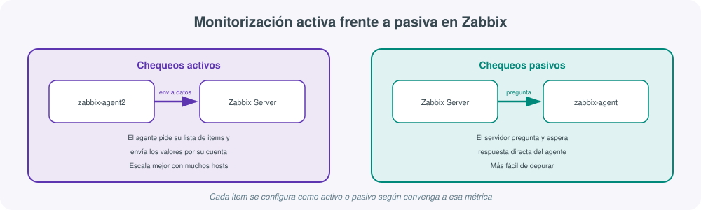
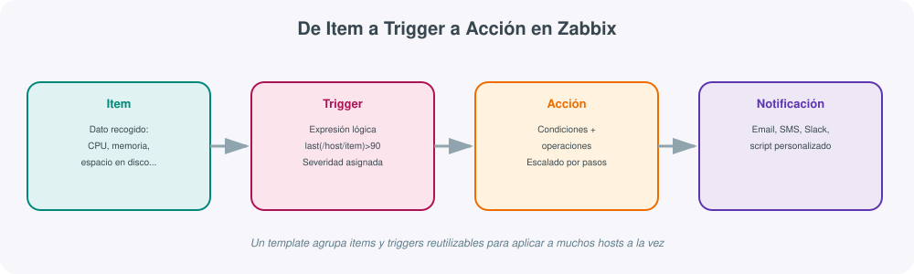

# **🛰️ Zabbix · Monitorización integral todo-en-uno**



## 1. Qué es Zabbix y qué problema resuelve

Frente a soluciones que se especializan en una sola capa de la observabilidad (métricas con Prometheus, logs con Elastic Stack), **Zabbix** nació con un planteamiento distinto: ser una plataforma **todo-en-uno**, de código abierto, capaz de cubrir por sí sola la recolección de métricas, la detección de problemas, el envío de alertas y la visualización, sin depender de piezas externas para tener un sistema de monitorización funcional de cabo a rabo.

Esto lo convierte en una opción muy habitual en departamentos de sistemas que necesitan vigilar infraestructura heterogénea —servidores Linux y Windows, switches y routers por SNMP, bases de datos, aplicaciones web— con una única herramienta central, un único punto de configuración y una única interfaz web para todo el equipo.

!!! tip "Zabbix frente a Prometheus: filosofías distintas"
    Prometheus asume que cada componente (recolección, alertas, visualización) es una pieza independiente que se combina según necesidad; Zabbix asume que la mayoría de organizaciones prefieren una plataforma cerrada y coherente desde el primer día. Ninguno de los dos enfoques es "mejor" en abstracto: Prometheus encaja mejor en entornos cloud-native muy dinámicos (Kubernetes, contenedores efímeros); Zabbix encaja mejor en infraestructuras más tradicionales y estables, con hardware de red y servidores de vida larga.

## 2. Arquitectura: server, proxy, agentes y base de datos

Como se aprecia en el diagrama de esta sección, una instalación de Zabbix se compone de:

- **Zabbix Server**: el núcleo del sistema. Recibe los datos recolectados, evalúa los triggers, ejecuta las acciones configuradas y expone una API JSON-RPC para integraciones externas.
- **Zabbix Frontend**: la interfaz web (PHP) desde la que se configuran hosts, templates, dashboards y desde la que el equipo consulta el estado de la infraestructura.
- **Base de datos**: MySQL, PostgreSQL, Oracle o TimescaleDB, donde se persisten configuración e histórico de datos recolectados.
- **Zabbix Agent**: proceso ligero instalado en cada host monitorizado (`zabbix-agent2` es la versión moderna, escrita en Go) que recoge métricas locales y las entrega al server.
- **Zabbix Proxy**: componente opcional que recolecta datos en una sede remota y los reenvía en bloque al server central, reduciendo la carga de red y de procesamiento del servidor principal en despliegues distribuidos geográficamente.

Además de agentes propios, Zabbix puede recolectar datos por **SNMP** (equipos de red que no admiten un agente), **IPMI** (sensores de hardware de servidores), **JMX** (aplicaciones Java) o simples comprobaciones **sin agente** (ping ICMP, comprobación de puertos TCP).

## 3. Chequeos activos frente a pasivos

Zabbix admite dos modos de comunicación entre el agente y el servidor, seleccionables item por item:



- **Pasivo**: el servidor pregunta directamente al agente por el valor de un item y espera su respuesta. Es el modelo más sencillo de depurar (equivalente, conceptualmente, al modelo *pull* de Prometheus), pero escala peor cuando hay miles de hosts, porque el servidor tiene que mantener conexiones activas a todos ellos.
- **Activo**: el agente pide periódicamente al servidor la lista de items que debe recolectar y le envía los valores por su cuenta, sin que el servidor tenga que iniciar la conexión. Reduce la carga del servidor y funciona mejor a través de NAT o firewalls restrictivos, ya que solo el agente necesita iniciar la conexión saliente.

!!! note "Configuración del agente"
    El comportamiento se define en `/etc/zabbix/zabbix_agent2.conf`, con directivas como `Server=` (de quién acepta chequeos pasivos) y `ServerActive=` (a quién reporta en modo activo). Es habitual dejar ambas apuntando al mismo servidor, aunque en despliegues con proxy cada una puede apuntar a un componente distinto.

## 4. Items, triggers y acciones: el flujo de una alerta

El modelo de datos de Zabbix se organiza en tres capas que se construyen una sobre la otra:



- **Item**: la unidad mínima de dato recolectado (uso de CPU, espacio libre en `/`, estado de un servicio systemd, tiempo de respuesta de una URL...).
- **Trigger**: una expresión lógica sobre uno o varios items que determina cuándo existe un problema, con una severidad asociada (`Not classified`, `Warning`, `Average`, `High`, `Disaster`):

```text
last(/servidor-web/vfs.fs.size[/,pfree])<10
```

Este trigger se dispara cuando el porcentaje de espacio libre en `/` del host `servidor-web` cae por debajo del 10%.

- **Acción**: define qué ocurre cuando un trigger cambia de estado —a quién notificar, por qué canal (email, SMS, Slack, Telegram, un script propio) y con qué escalado por pasos si el problema no se reconoce o resuelve en un tiempo determinado.

```text
Paso 1 (inmediato):  notificar al equipo de guardia por Slack
Paso 2 (+15 min):    notificar por email al responsable del servicio
Paso 3 (+30 min):    ejecutar script de reinicio automático del servicio
```

## 5. Templates: reutilización de configuración

Configurar items y triggers host por host no es viable a partir de unas pocas decenas de servidores. Los **templates** agrupan items, triggers, gráficos y dashboards ya definidos, y se vinculan a los hosts que corresponda: al enlazar un template a un host, todos sus items y triggers se aplican automáticamente, con macros que permiten parametrizar umbrales por host sin duplicar la configuración.

```text
Template: Linux by Zabbix agent
  Items: CPU utilization, Memory utilization, Disk space usage, System load...
  Triggers: {HOST.NAME}: High CPU utilization (over {$CPU.UTIL.CRIT}% for 5m)
  Macro: {$CPU.UTIL.CRIT} = 90 (valor por defecto, sobreescribible por host)
```

Zabbix incluye una biblioteca de templates oficiales para los sistemas y aplicaciones más habituales (Linux, Windows, Docker, Nginx, MySQL, PostgreSQL...), lo que en la práctica reduce buena parte del trabajo de puesta en marcha a "instalar el agente y enlazar el template correcto".

## 6. Descubrimiento automático (discovery)

Zabbix incorpora dos mecanismos de descubrimiento que reducen la configuración manual:

- **Network discovery**: rastrea un rango de red buscando hosts nuevos (por ICMP, un puerto abierto, un agente respondiendo) y puede darlos de alta automáticamente con un template asignado.
- **Low-level discovery (LLD)**: dentro de un host ya conocido, descubre elementos dinámicos —interfaces de red, particiones de disco, contenedores en ejecución— y crea items y triggers para cada uno automáticamente, de modo que si se añade un disco nuevo al servidor, Zabbix empieza a monitorizarlo sin intervención manual.

## 7. Comparación con Nagios y Prometheus

| Característica | Zabbix | Nagios | Prometheus + Grafana |
|---|---|---|---|
| Modelo | Todo-en-uno | Todo-en-uno (más ligero) | Ecosistema de piezas separadas |
| Almacenamiento de histórico | Base de datos relacional propia | Limitado, requiere plugins externos | TSDB especializada (Prometheus) |
| Configuración | Interfaz web completa | Ficheros de texto + interfaz limitada | Ficheros YAML + interfaz de Grafana |
| Descubrimiento automático | Sí, nativo (network + LLD) | Limitado, requiere herramientas externas | Sí, vía service discovery (Kubernetes, Consul...) |
| Mejor caso de uso | Infraestructura heterogénea (red + servidores + apps) con un único panel | Comprobaciones de disponibilidad simples y muy estables | Entornos cloud-native, Kubernetes, microservicios |

## 8. Ejemplo: instalación básica en Ubuntu con MySQL

```bash
# Repositorio oficial de Zabbix (Ubuntu 22.04, Zabbix 6.4)
wget https://repo.zabbix.com/zabbix/6.4/ubuntu/pool/main/z/zabbix-release/zabbix-release_6.4-1+ubuntu22.04_all.deb
sudo dpkg -i zabbix-release_6.4-1+ubuntu22.04_all.deb
sudo apt update

# Server, frontend y agente
sudo apt install -y zabbix-server-mysql zabbix-frontend-php zabbix-apache-conf zabbix-agent2

# Base de datos
sudo mysql -uroot -p -e "CREATE DATABASE zabbix CHARACTER SET utf8mb4 COLLATE utf8mb4_bin;"
sudo mysql -uroot -p -e "CREATE USER zabbix@localhost IDENTIFIED BY 'clave_segura';"
sudo mysql -uroot -p -e "GRANT ALL PRIVILEGES ON zabbix.* TO zabbix@localhost;"

zcat /usr/share/doc/zabbix-sql-scripts/mysql/server.sql.gz | sudo mysql --default-character-set=utf8mb4 -uzabbix -p zabbix

# Configurar credenciales de BD en el server
sudo sed -i "s/# DBPassword=/DBPassword=clave_segura/" /etc/zabbix/zabbix_server.conf

sudo systemctl restart zabbix-server zabbix-agent2 apache2
sudo systemctl enable zabbix-server zabbix-agent2 apache2
```

Tras esto, el frontend queda accesible en `http://servidor/zabbix`, donde se completa el asistente inicial de configuración (usuario `Admin` / contraseña por defecto `zabbix`, a cambiar de inmediato).

## 9. Comandos y ficheros básicos

| Elemento | Para qué sirve |
|---|---|
| `/etc/zabbix/zabbix_server.conf` | Configuración del servidor (BD, timeouts, caché) |
| `/etc/zabbix/zabbix_agent2.conf` | Configuración del agente (Server, ServerActive, hostname) |
| `zabbix_agent2 -t agent.ping` | Prueba un item concreto en local antes de confiar en el servidor |
| `systemctl status zabbix-server` | Estado del servicio principal |
| `zabbix_server -R config_cache_reload` | Recarga la configuración sin reiniciar el servicio completo |
| API `user.login` / `host.get` / `trigger.get` | Automatización vía API JSON-RPC (scripts, integraciones con Ansible) |

## 10. Buenas prácticas

- **Usar templates en lugar de configurar items sueltos por host**: la mantenibilidad a medio plazo depende de esto casi por completo.
- **Ajustar los umbrales críticos con macros** (`{$CPU.UTIL.CRIT}`) en lugar de valores fijos en cada trigger, para poder afinar por host o por grupo sin tocar el trigger en sí.
- **Usar proxies en despliegues multi-sede**: reduce la carga del servidor central y tolera mejor cortes de conectividad puntuales entre sedes.
- **Configurar el escalado de acciones por pasos**, no solo una notificación única: un problema no resuelto en 15 minutos merece un canal distinto al de la alerta inicial.
- **Aprovechar el discovery automático** en redes con alta rotación de hosts (entornos de laboratorio, aulas, contenedores) en lugar de dar de alta cada host a mano.
- **Revisar periódicamente triggers "ruidosos"** (los que generan más notificaciones): casi siempre indican un umbral mal calibrado, no un problema real recurrente.

## Para profundizar

El [manual oficial de Zabbix](https://www.zabbix.com/documentation/current/en/manual){:target="_blank"} cubre con detalle la instalación, los templates y la API; la sección de [Zabbix Templates](https://git.zabbix.com/projects/ZBX/repos/zabbix/browse/templates){:target="_blank"} en su repositorio Git permite consultar el código fuente de los templates oficiales como referencia para crear los propios. Para integraciones con automatización, el módulo `community.zabbix` de Ansible permite gestionar hosts, templates y acciones de Zabbix como código, en línea con lo visto en el apartado de Ansible de esta misma unidad. El resto de enlaces de referencia del módulo está recopilado en la página de Recursos.
