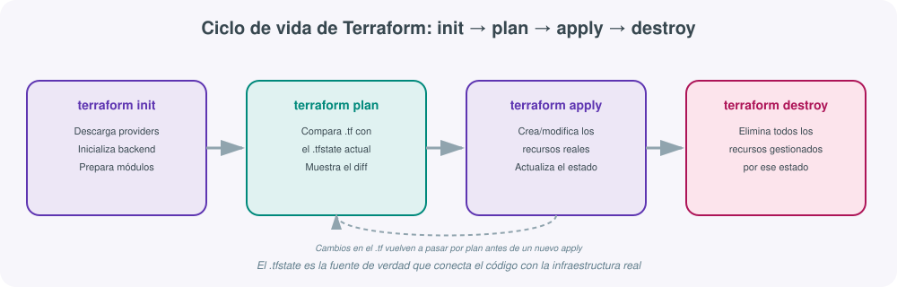
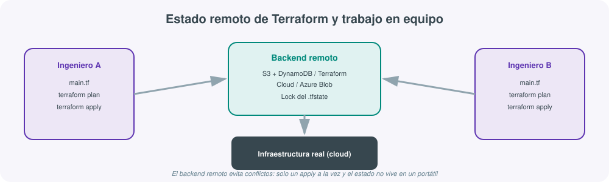
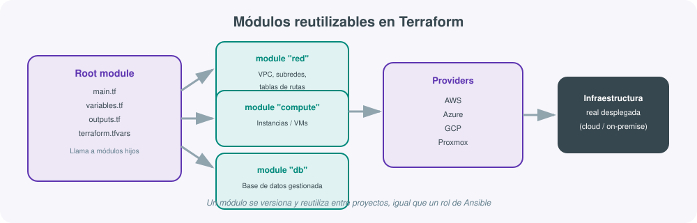

# **🏗️ Terraform · Infraestructura como código**



## 1. Qué es Terraform y el paradigma de infraestructura como código

**Terraform**, desarrollado por HashiCorp, es una herramienta que permite describir infraestructura completa —máquinas virtuales, redes, discos, balanceadores de carga, bases de datos gestionadas, reglas de firewall— en ficheros de texto declarativos, y aplicar esa descripción para crear, modificar o eliminar recursos reales en un proveedor cloud o en un centro de datos on-premise.

Esta forma de trabajar se conoce como **Infraestructura como Código** (*Infrastructure as Code*, IaC): en lugar de crear una máquina virtual haciendo clic en la consola web de un proveedor cloud, se escribe un fichero que la describe, se versiona ese fichero en Git exactamente igual que se versiona el código de una aplicación, y una herramienta se encarga de traducir esa descripción en llamadas reales a la API del proveedor.

!!! tip "Por qué no basta con la consola web"
    Crear infraestructura manualmente desde la consola web de un proveedor cloud funciona bien la primera vez, pero falla exactamente en los mismos puntos que fallaba la configuración manual de servidores antes de Ansible: no queda documentado qué se creó ni con qué parámetros exactos, no es reproducible en otra cuenta o región, y no hay forma sencilla de saber qué ha cambiado respecto a la semana anterior. Terraform resuelve esto igual que Ansible resuelve la configuración de software: con un fichero de texto versionable que describe el estado deseado.

## 2. El paradigma declarativo

Terraform es **declarativo**: el fichero `.tf` describe **qué** infraestructura debe existir, no la secuencia de pasos para crearla. Es responsabilidad de Terraform calcular el orden de creación, detectar dependencias entre recursos y decidir qué operaciones (crear, modificar, destruir) son necesarias para pasar del estado actual al estado descrito.

```hcl
resource "aws_instance" "servidor_web" {
  ami           = "ami-0abcdef1234567890"
  instance_type = "t3.micro"

  tags = {
    Name = "servidor-web-produccion"
  }
}
```

Este bloque no dice "conéctate a AWS, crea una instancia, espera a que arranque, asígnale una etiqueta": simplemente declara que debe existir una instancia con esas características. Si el bloque ya existe y no ha cambiado, Terraform no hace nada al volver a aplicarlo — la misma idea de fondo que la idempotencia de Ansible, pero aplicada a la creación de infraestructura en lugar de a la configuración de software dentro de ella.

## 3. El lenguaje HCL

Terraform usa su propio lenguaje, **HCL** (*HashiCorp Configuration Language*), diseñado para ser más legible que JSON pero igual de fácil de procesar por una máquina. Los bloques principales que aparecen en cualquier proyecto Terraform son:

```hcl
terraform {
  required_providers {
    aws = {
      source  = "hashicorp/aws"
      version = "~> 5.0"
    }
  }
}

provider "aws" {
  region = "eu-west-1"
}

resource "aws_instance" "web" {
  ami           = var.ami_id
  instance_type = var.tipo_instancia
}

variable "tipo_instancia" {
  description = "Tipo de instancia EC2"
  type        = string
  default     = "t3.micro"
}

output "ip_publica" {
  value = aws_instance.web.public_ip
}
```

- **`terraform`**: bloque de configuración del propio proyecto (versión requerida, providers necesarios, backend de estado).
- **`provider`**: configura el proveedor concreto (credenciales, región).
- **`resource`**: declara un recurso a crear (una instancia, una red, un disco...). El formato es `resource "tipo" "nombre_local"`.
- **`variable`**: parámetro de entrada que hace el módulo reutilizable sin tocar el código.
- **`output`**: valor de salida que Terraform expone tras aplicar los cambios (por ejemplo, la IP pública asignada).

## 4. Providers: el puente hacia cada plataforma

Un **provider** es un plugin que traduce los bloques HCL en llamadas concretas a la API de una plataforma. Terraform en sí mismo no sabe nada de AWS, Azure o Proxmox: todo ese conocimiento vive en el provider correspondiente, que se descarga durante `terraform init`.

| Provider | Plataforma | Recursos típicos |
|---|---|---|
| `hashicorp/aws` | Amazon Web Services | `aws_instance`, `aws_vpc`, `aws_s3_bucket`, `aws_security_group` |
| `hashicorp/azurerm` | Microsoft Azure | `azurerm_virtual_machine`, `azurerm_resource_group` |
| `hashicorp/google` | Google Cloud Platform | `google_compute_instance`, `google_storage_bucket` |
| `telmate/proxmox` | Proxmox VE (virtualización on-premise) | `proxmox_vm_qemu` |
| `hashicorp/kubernetes` | Clústeres Kubernetes | `kubernetes_deployment`, `kubernetes_service` |
| `cloudflare/cloudflare` | DNS y CDN de Cloudflare | `cloudflare_record`, `cloudflare_zone` |

Un mismo proyecto puede combinar varios providers a la vez —por ejemplo, crear una instancia en AWS y, en el mismo `apply`, registrar su IP en un DNS gestionado por Cloudflare— porque cada `resource` especifica su propio tipo y Terraform resuelve las dependencias entre ambos automáticamente si un recurso referencia el atributo de otro.

!!! note "Proxmox como ejemplo on-premise"
    Aunque Terraform nació muy ligado a los grandes proveedores cloud, también se usa extensamente en centros de datos propios. El provider de **Proxmox VE** permite declarar máquinas virtuales KVM directamente contra un clúster Proxmox local, lo cual es especialmente relevante en un contexto de administración de sistemas educativo o de pequeña/mediana empresa que no dependa de un hyperscaler.

## 5. Ciclo de vida: init, plan, apply, destroy

El flujo de trabajo de Terraform se articula en cuatro comandos que se ejecutan siempre en el mismo orden lógico:

### `terraform init`

Prepara el directorio de trabajo: descarga los providers declarados en el bloque `terraform`, descarga los módulos externos referenciados, y configura el backend donde se guardará el estado. Se ejecuta una vez al empezar el proyecto y cada vez que cambian los providers o el backend.

```bash
terraform init
```

### `terraform plan`

Compara la configuración declarada en los ficheros `.tf` con el estado actual registrado (`.tfstate`) y con la infraestructura real, y muestra un **plan de ejecución**: qué recursos se crearían, cuáles se modificarían y cuáles se eliminarían, sin aplicar ningún cambio todavía.

```bash
terraform plan -out=plan.tfplan
```

La salida usa un convenio de símbolos que conviene reconocer de un vistazo: `+` para crear, `-` para eliminar, `~` para modificar in situ, y `-/+` para recrear (eliminar y volver a crear porque el cambio no admite modificación en caliente).

### `terraform apply`

Ejecuta el plan calculado, realizando las llamadas reales a la API del provider para crear, modificar o eliminar los recursos necesarios, y actualiza el fichero de estado con el resultado.

```bash
terraform apply plan.tfplan
```

Sin un plan guardado previamente, `terraform apply` calcula el plan en el momento y pide confirmación explícita (escribir `yes`) antes de aplicar los cambios — una salvaguarda deliberada frente a aplicar cambios no revisados en infraestructura real.

### `terraform destroy`

Elimina todos los recursos que Terraform tiene registrados en el estado para ese directorio de trabajo. Es una operación destructiva y, salvo que se use `-target`, afecta a **toda** la infraestructura gestionada por ese estado.

```bash
terraform destroy
```

!!! warning "`terraform destroy` no pregunta dos veces"
    Al igual que `vagrant destroy`, esta operación es irreversible desde el punto de vista de Terraform: una vez aplicada, los recursos reales desaparecen del proveedor. La diferencia con Vagrant es la escala del daño potencial — mientras que una VM de Vagrant es un entorno de desarrollo desechable, un `terraform destroy` accidental sobre el estado equivocado puede eliminar infraestructura de producción. Por eso es habitual restringir en el propio backend quién tiene permisos para ejecutar `apply` o `destroy` sobre los entornos críticos.

## 6. El estado: `.tfstate` y backends remotos

El **estado** es, posiblemente, el concepto más delicado de entender en Terraform y el que más lo diferencia de una herramienta de aprovisionamiento sin memoria. Cada vez que se ejecuta `terraform apply`, Terraform escribe en un fichero (`terraform.tfstate`, en formato JSON) qué recursos existen, con qué identificadores reales del proveedor y con qué atributos — es el "mapa" que conecta cada bloque `resource` del código con el objeto real correspondiente en AWS, Azure o donde sea.

Sin este fichero, Terraform no tendría forma de saber que el bloque `aws_instance.web` del código corresponde a la instancia con ID `i-0abc123` ya creada en AWS, y en el siguiente `plan` intentaría crearla de nuevo en lugar de detectar que ya existe.

### Por qué el estado local no basta en equipo

Guardar `terraform.tfstate` como un fichero local en el portátil de cada persona genera un problema evidente: si dos personas del equipo aplican cambios de forma independiente, cada una tiene una versión distinta del estado, y no hay forma de evitar que se pisen los cambios mutuamente.



La solución es un **backend remoto**: el estado se guarda en un almacenamiento compartido (S3 con bloqueo por DynamoDB, Azure Blob Storage, Google Cloud Storage, o el propio **Terraform Cloud/HCP Terraform** de HashiCorp) que además implementa un mecanismo de bloqueo (*locking*): mientras una persona está aplicando cambios, cualquier otra que intente ejecutar `apply` sobre el mismo estado recibe un aviso de bloqueo, evitando condiciones de carrera.

```hcl
terraform {
  backend "s3" {
    bucket         = "miempresa-terraform-state"
    key            = "produccion/red/terraform.tfstate"
    region         = "eu-west-1"
    dynamodb_table = "terraform-locks"
    encrypt        = true
  }
}
```

!!! warning "El .tfstate contiene información sensible"
    El fichero de estado incluye, en muchos casos, atributos sensibles de los recursos (contraseñas generadas, claves privadas, cadenas de conexión) en texto plano dentro del JSON. Por eso nunca debe versionarse en Git sin cifrar, y los backends remotos recomendados (S3 con `encrypt = true`, Terraform Cloud) cifran el estado en reposo.

## 7. Variables y outputs

Igual que las plantillas Jinja2 de Ansible evitan repetir configuración fija para cada host, las **variables** de Terraform permiten parametrizar un mismo conjunto de ficheros `.tf` para distintos entornos (desarrollo, preproducción, producción) sin duplicar código:

```hcl
variable "entorno" {
  description = "Nombre del entorno de despliegue"
  type        = string
}

variable "tipo_instancia" {
  type    = string
  default = "t3.micro"
}

variable "numero_instancias" {
  type    = number
  default = 2
}
```

Los valores se pueden fijar de varias formas, con un orden de precedencia bien definido: por línea de comandos (`-var="entorno=produccion"`), por fichero (`terraform.tfvars` o `*.auto.tfvars`), por variables de entorno (`TF_VAR_entorno`), o dejando el valor por defecto del propio bloque `variable`.

Los **outputs**, por su parte, exponen valores calculados tras el `apply` —útiles tanto para consultarlos manualmente como para encadenarlos a otras herramientas (por ejemplo, pasar la IP de una instancia recién creada a un inventario de Ansible generado automáticamente)—:

```hcl
output "ip_publica_web" {
  description = "IP pública de la instancia web"
  value       = aws_instance.web.public_ip
}

output "endpoint_bd" {
  value     = aws_db_instance.principal.endpoint
  sensitive = true
}
```

El atributo `sensitive = true` evita que ese valor se muestre en texto plano en la salida de la terminal durante un `plan` o `apply`, aunque sigue quedando almacenado dentro del `.tfstate`.

## 8. Módulos reutilizables

Un **módulo** es un conjunto de ficheros `.tf` agrupados en una carpeta, pensado para reutilizarse desde distintos proyectos o distintos entornos del mismo proyecto — el equivalente directo, en el mundo de Terraform, a lo que es un rol en Ansible.



```hcl
module "servidor_web" {
  source            = "./modulos/instancia-ec2"
  tipo_instancia    = "t3.small"
  entorno           = "produccion"
  numero_instancias = 3
}

module "base_datos" {
  source         = "./modulos/rds-postgres"
  entorno        = "produccion"
  tamano_disco_gb = 100
}
```

El proyecto raíz (*root module*) invoca módulos hijos pasándoles variables como parámetros, exactamente igual que una función recibe argumentos en cualquier lenguaje de programación. Los módulos pueden ser locales (una carpeta dentro del propio repositorio), o publicados en el [Terraform Registry](https://registry.terraform.io/){:target="_blank"}, el catálogo público equivalente a Ansible Galaxy pero para módulos de infraestructura.

## 9. Terraform frente a Ansible: declarativo vs procedimental, aprovisionamiento vs configuración

Aunque ambas herramientas usan lenguajes declarativos y ambas evitan la configuración manual, resuelven problemas distintos y complementarios:

| Aspecto | Terraform | Ansible |
|---|---|---|
| Qué gestiona | La existencia de recursos de infraestructura (VMs, redes, discos, DNS...) | El estado del software dentro de sistemas ya existentes |
| Estado | Mantiene un fichero de estado explícito (`.tfstate`) que rastrea cada recurso | No mantiene estado propio: cada ejecución comprueba el sistema real en el momento |
| Modelo mental | "Que exista esta infraestructura" | "Que este sistema tenga esta configuración" |
| Cuándo actúa | Al crear, redimensionar o eliminar recursos | En cualquier momento, tantas veces como haga falta, sin relación con cuándo se creó el recurso |
| Ejemplo típico | Crear una instancia EC2, una VPC y un grupo de seguridad | Instalar Nginx y desplegar su configuración dentro de esa instancia ya creada |
| Consecuencia de borrar el fichero de estado/config | Terraform "olvida" qué gestiona; puede intentar recrear recursos ya existentes | Ansible simplemente re-evalúa el sistema real la próxima vez, sin pérdida de información |

La combinación más habitual en proyectos reales sigue el orden: **Terraform aprovisiona** (la máquina virtual o instancia pasa a existir, con red y disco), y **Ansible configura** (se instala y ajusta el software dentro de esa máquina ya existente). Intentar que Terraform gestione la configuración interna de un sistema operativo (instalar paquetes, editar ficheros de configuración) es forzar la herramienta fuera de su propósito; lo mismo ocurre a la inversa si se intenta usar Ansible para crear la VPC de una cuenta de AWS desde cero sin usar sus módulos de cloud, en lugar de dejar esa tarea a Terraform.

## 10. Ejemplo completo: desplegar una instancia EC2 en AWS

El siguiente proyecto combina provider, variables, un recurso de red mínimo, la instancia y un output, formando un ejemplo completo y funcional:

```hcl
# main.tf
terraform {
  required_version = ">= 1.5.0"

  required_providers {
    aws = {
      source  = "hashicorp/aws"
      version = "~> 5.0"
    }
  }

  backend "s3" {
    bucket = "miempresa-terraform-state"
    key    = "practica/ec2/terraform.tfstate"
    region = "eu-west-1"
  }
}

provider "aws" {
  region = var.region
}

resource "aws_security_group" "web_sg" {
  name        = "sg-servidor-web"
  description = "Permite trafico HTTP y SSH"

  ingress {
    from_port   = 22
    to_port     = 22
    protocol    = "tcp"
    cidr_blocks = ["0.0.0.0/0"]
  }

  ingress {
    from_port   = 80
    to_port     = 80
    protocol    = "tcp"
    cidr_blocks = ["0.0.0.0/0"]
  }

  egress {
    from_port   = 0
    to_port     = 0
    protocol    = "-1"
    cidr_blocks = ["0.0.0.0/0"]
  }
}

resource "aws_instance" "servidor_web" {
  ami                    = var.ami_id
  instance_type          = var.tipo_instancia
  key_name               = var.nombre_clave_ssh
  vpc_security_group_ids = [aws_security_group.web_sg.id]

  tags = {
    Name    = "servidor-web-${var.entorno}"
    Entorno = var.entorno
  }
}
```

```hcl
# variables.tf
variable "region" {
  type    = string
  default = "eu-west-1"
}

variable "ami_id" {
  description = "AMI de Ubuntu Server 22.04 para la región elegida"
  type        = string
}

variable "tipo_instancia" {
  type    = string
  default = "t3.micro"
}

variable "nombre_clave_ssh" {
  description = "Nombre del par de claves SSH ya creado en AWS"
  type        = string
}

variable "entorno" {
  type    = string
  default = "desarrollo"
}
```

```hcl
# outputs.tf
output "ip_publica" {
  description = "IP publica asignada a la instancia"
  value       = aws_instance.servidor_web.public_ip
}

output "id_instancia" {
  value = aws_instance.servidor_web.id
}
```

El flujo completo para desplegar esta infraestructura sería:

```bash
terraform init
terraform plan -var="ami_id=ami-0abcdef1234567890" -var="nombre_clave_ssh=clave-practica"
terraform apply -var="ami_id=ami-0abcdef1234567890" -var="nombre_clave_ssh=clave-practica"
```

Y una vez terminada la práctica o el entorno de pruebas, liberar los recursos (y dejar de pagar por ellos) con:

```bash
terraform destroy -var="ami_id=ami-0abcdef1234567890" -var="nombre_clave_ssh=clave-practica"
```

!!! example "El mismo patrón en Proxmox on-premise"
    El mismo esquema —provider, security group equivalente, recurso de VM, variables y outputs— se aplica prácticamente igual usando el provider `telmate/proxmox`, cambiando `aws_instance` por `proxmox_vm_qemu` y `aws_security_group` por las reglas de firewall del propio Proxmox. La lógica de Terraform (init/plan/apply/destroy, estado, variables) es idéntica independientemente del proveedor de destino; lo único que cambia es el vocabulario de recursos que ofrece cada provider.

## 11. Comandos básicos adicionales

| Comando | Para qué sirve |
|---|---|
| `terraform init` | Inicializa el proyecto: descarga providers, módulos y configura el backend |
| `terraform validate` | Comprueba que la sintaxis HCL es correcta, sin consultar al proveedor |
| `terraform fmt` | Reformatea los ficheros `.tf` según el estilo estándar |
| `terraform plan` | Calcula y muestra los cambios pendientes sin aplicarlos |
| `terraform apply` | Aplica los cambios calculados en el plan |
| `terraform destroy` | Elimina toda la infraestructura gestionada por el estado actual |
| `terraform show` | Muestra el estado actual en formato legible |
| `terraform state list` | Lista todos los recursos registrados en el estado |
| `terraform state show <recurso>` | Muestra los atributos detallados de un recurso concreto del estado |
| `terraform output` | Muestra los valores de los outputs definidos |
| `terraform import <recurso> <id>` | Incorpora al estado un recurso creado manualmente fuera de Terraform |
| `terraform workspace list` | Lista los *workspaces* (entornos aislados dentro del mismo backend) |

## 12. Buenas prácticas

- **Nunca editar el `.tfstate` a mano**: cualquier cambio en el estado debe hacerse a través de comandos de Terraform (`terraform state mv`, `terraform import`), nunca editando el JSON directamente.
- **Usar siempre un backend remoto con bloqueo** en cuanto trabaje más de una persona en el proyecto, incluso en entornos de prueba.
- **Revisar el `plan` antes de cada `apply`**, prestando especial atención a las líneas `-/+` (recrear), que implican destruir y volver a crear un recurso — a menudo con pérdida de datos si es una base de datos o un disco.
- **Separar el estado por entorno** (desarrollo, preproducción, producción), normalmente mediante *workspaces* o mediante backends distintos, para que un error en desarrollo no pueda afectar nunca a producción.
- **No versionar credenciales en los ficheros `.tf`**: usar variables de entorno, un gestor de secretos (Vault, AWS Secrets Manager) o ficheros `.tfvars` explícitamente excluidos del control de versiones.
- **Modularizar en cuanto se repita un mismo patrón de recursos** dos o más veces (por ejemplo, una VPC por entorno): un módulo bien escrito una vez se reutiliza indefinidamente.
- **Fijar versiones de providers y de Terraform** (`required_version`, `required_providers`) para que una actualización futura no cambie el comportamiento de un proyecto que llevaba tiempo estable.

## Ansible vs Vagrant vs Terraform: cuándo usar cada uno

Desde la perspectiva de Terraform, su papel se limita deliberadamente a la capa de infraestructura, dejando la configuración interna de los sistemas a otras herramientas:

| Aspecto | Ansible | Vagrant | Terraform |
|---|---|---|---|
| Propósito principal | Configurar software dentro de máquinas ya existentes | Crear y gestionar entornos de desarrollo locales reproducibles | Crear y gestionar infraestructura (VMs, redes, servicios cloud) |
| Paradigma | Declarativo por tareas (con orden de ejecución explícito) | Declarativo sobre el propio entorno de desarrollo | Declarativo puro, con grafo de dependencias resuelto automáticamente |
| Mantiene estado propio | No | No (delega en el hipervisor) | Sí, de forma explícita (`.tfstate`) |
| Ámbito típico | Cualquier servidor accesible por SSH, local o remoto | El equipo local del desarrollador | Cuentas cloud o centros de datos on-premise, en equipo |
| Ejemplo típico de uso | Instalar y configurar Nginx en 20 servidores | Levantar un entorno de pruebas idéntico en el portátil de cada persona | Crear la VPC, las instancias EC2 y el balanceador en AWS |
| Relación entre ellas | Puede ejecutarse tras un `terraform apply` para configurar lo recién creado | Puede invocar Ansible como provisioner tras el `vagrant up` | Puede dejar la infraestructura lista para que Ansible la configure después |

La regla práctica que resume esta unidad completa: **Terraform decide qué existe, Ansible decide cómo está configurado lo que existe, y Vagrant es el "Terraform" en miniatura para el entorno de desarrollo local de cada persona**, antes incluso de llegar a tocar infraestructura real en la nube.

## Para profundizar

La documentación oficial de HashiCorp para Terraform es la referencia más fiable para cualquier duda concreta: la [guía de introducción a Terraform](https://developer.hashicorp.com/terraform/intro){:target="_blank"} explica el paradigma IaC y el flujo de trabajo básico; la [documentación del lenguaje HCL y sus bloques](https://developer.hashicorp.com/terraform/language){:target="_blank"} detalla la sintaxis de `resource`, `variable`, `module` y `output` vista en este apartado; y la [documentación sobre backends y gestión del estado](https://developer.hashicorp.com/terraform/language/backend){:target="_blank"} profundiza en cómo configurar un backend remoto con bloqueo. El resto de enlaces de referencia del módulo está recopilado en la página de Recursos.
