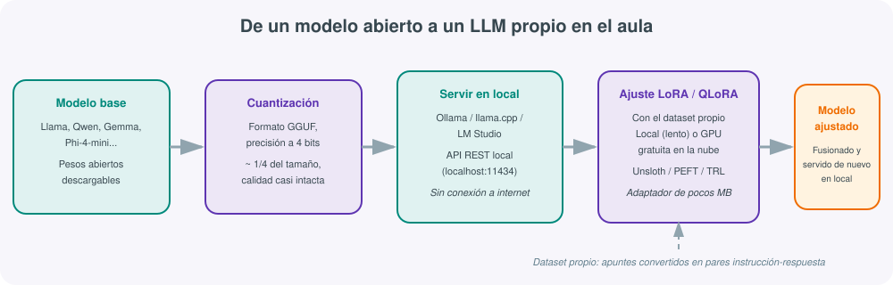
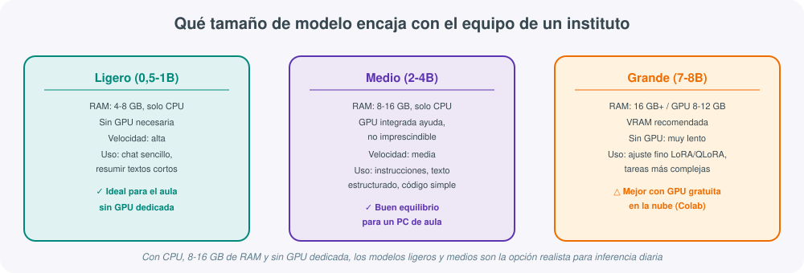
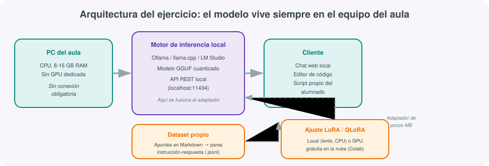

# **🧠 LLM locales: monta y entrena tu propio modelo con el equipo del aula**



La página [Impacto de la IA en sistemas](impacto-ia-sistemas.md) de esta misma sección deja claro que esa unidad **no** enseña a entrenar modelos de IA. Esta página existe precisamente para cubrir ese hueco desde un enfoque práctico: que el alumnado monte, ejecute y ajuste su propio modelo de lenguaje usando el hardware real de un aula de instituto, sin depender de servicios de pago ni de una GPU de gama alta.

!!! note "Qué vas a conseguir con esta guía"
    Ejecutar un modelo pequeño en local y sin conexión permanente a internet, entender qué es la cuantización y por qué la necesitas, preparar un dataset propio a partir de tus apuntes, y ajustar (*fine-tuning*) ese modelo con LoRA o QLoRA sabiendo en qué punto el equipo del aula se queda corto y conviene apoyarse en una GPU gratuita en la nube.

## 1. Conceptos clave antes de empezar

Un LLM no se "programa": se **entrena** desde cero sobre enormes cantidades de texto (preentrenamiento), algo que solo hacen laboratorios con miles de GPU. Lo que un centro educativo puede hacer, y es exactamente lo que persigue esta guía, es coger un modelo ya entrenado y **abierto** (sus pesos son descargables) y adaptarlo a un caso de uso concreto mediante *fine-tuning*: enseñarle a responder con un estilo determinado o sobre un dominio concreto, en lugar de enseñarle idioma desde cero.

Para que ese modelo quepa y funcione en un equipo modesto hace falta además **cuantizar** los pesos: reducir la precisión numérica con la que se almacena cada parámetro (de 16 bits a 4 bits, por ejemplo). Un modelo cuantizado a 4 bits ocupa aproximadamente una cuarta parte de su tamaño original y pierde muy poca calidad de respuesta, lo que lo hace viable en un PC sin GPU dedicada.

## 2. Qué hardware tiene realmente un equipo de instituto



Un PC típico de aula tiene CPU sin GPU dedicada, entre 8 y 16 GB de RAM y almacenamiento SSD modesto. Con ese perfil, la **inferencia** (usar el modelo ya entrenado para generar respuestas) de modelos cuantizados de 1 a 3 mil millones de parámetros es perfectamente viable y razonablemente rápida. El **ajuste fino**, en cambio, es más exigente: entrenar aunque sea con LoRA requiere recalcular gradientes, y hacerlo solo con CPU es posible pero lento, adecuado como ejercicio didáctico con datasets pequeños, no para un resultado de calidad en poco tiempo.

!!! tip "La combinación realista para un aula sin GPU"
    Ejecutar el modelo en local (rápido, sin coste, sin conexión) y hacer el paso de ajuste fino en una GPU gratuita en la nube, como el nivel gratuito de Google Colab. El resultado del ajuste es un adaptador LoRA de pocos megabytes que se descarga y se fusiona con el modelo local: los datos de entrenamiento pasan por la nube durante el ajuste, así que conviene no subir nunca datos personales del alumnado, solo apuntes y materiales ya públicos.

## 3. Elegir el modelo base adecuado

No todos los modelos abiertos sirven igual para un equipo modesto. Para empezar en el aula, esta tabla resume las opciones más razonables:

| Modelo | Parámetros | Tamaño cuantizado (4 bits) | Uso recomendado en el aula |
|---|---|---|---|
| Llama 3.2 1B | 1 000 M | ~0,7 GB | Chat básico, resumir textos cortos, primeras pruebas |
| Qwen2.5 3B | 3 000 M | ~2 GB | Seguir instrucciones, generar texto estructurado |
| Gemma 3 2B | 2 000 M | ~1,5 GB | Alternativa ligera y multilingüe |
| Phi-4-mini | 3 800 M | ~2,5 GB | Buen razonamiento y código sencillo pese al tamaño |
| Qwen2.5 7B / Llama 3.1 8B | 7-8 000 M | ~4,5-5 GB | Base habitual para *fine-tuning* con LoRA/QLoRA (mejor en GPU, aunque sea la gratuita de Colab) |

## 4. Poner en marcha un modelo local: Ollama, LM Studio y llama.cpp

El camino más sencillo para un aula es **Ollama**: se instala en Windows, Linux o macOS, y con dos comandos se descarga y ejecuta un modelo ya cuantizado en formato GGUF:

```bash
ollama pull qwen2.5:3b
ollama run qwen2.5:3b
```

Ollama expone además una API local compatible con la de los servicios de IA en la nube (`http://localhost:11434`), de modo que un script propio, un editor de código o un servidor MCP del aula pueden hablar con el modelo local exactamente igual que hablarían con un servicio externo. **LM Studio** ofrece una interfaz gráfica equivalente, útil para el alumnado que prefiere no usar la terminal, y **llama.cpp** es el motor de bajo nivel que hace posible ejecutar estos modelos de forma eficiente solo con CPU; tanto Ollama como LM Studio lo usan por debajo.

## 5. Preparar un dataset propio con tus apuntes

Ajustar un modelo no exige un dataset enorme: entre 500 y 1 000 ejemplos bien construidos bastan para adaptar el estilo y el formato de las respuestas. La forma más práctica de generarlo a partir de material docente ya existente es transformar cada apunte en pares de **instrucción y respuesta** guardados en formato JSON Lines (`.jsonl`), por ejemplo:

```json
{"instruction": "Explica qué hace el comando ollama pull", "output": "Descarga los pesos de un modelo publicado en la biblioteca de Ollama..."}
```

Un script sencillo en Python puede recorrer los apuntes en Markdown ya publicados en el sitio MkDocs del centro y proponer automáticamente preguntas y respuestas candidatas, que después el alumnado revisa y corrige a mano: la calidad de cada ejemplo importa mucho más que la cantidad total.

## 6. Ajustar el modelo con LoRA y QLoRA

**LoRA** (*Low-Rank Adaptation*) no reentrena todos los parámetros del modelo, sino que añade una pequeña capa de ajuste ("adaptador") y entrena solo esa parte, reduciendo drásticamente la memoria necesaria. **QLoRA** combina LoRA con un modelo base ya cuantizado en 4 bits, lo que permite ajustar modelos de 7-8 mil millones de parámetros incluso en una GPU de consumo con 8-12 GB de VRAM. Herramientas como **Unsloth** (la opción más rápida y sencilla para empezar), **PEFT** de Hugging Face y **TRL** son el conjunto habitual para lanzar este proceso con pocas líneas de código, tanto en un portátil con GPU como en un cuaderno gratuito de Google Colab.

## 7. Caso práctico: del apunte al modelo ajustado en el aula



1. **Elegir y probar el modelo base**: instalar Ollama y ejecutar en local un modelo de 1-3B para comprobar que responde con la calidad esperada antes de invertir tiempo en ajustarlo.
2. **Construir el dataset**: convertir 20-30 apuntes del temario en 500-1 000 pares de instrucción-respuesta en `.jsonl`, revisados por el alumnado.
3. **Lanzar el ajuste con QLoRA**: si el aula no tiene GPU, subir el dataset y el script de Unsloth a un cuaderno de Google Colab gratuito y lanzar el entrenamiento allí.
4. **Descargar y fusionar el adaptador**: el resultado es un archivo de pocos megabytes que se fusiona con el modelo base y se convierte de nuevo a formato GGUF para poder servirlo con Ollama.
5. **Evaluar y comparar**: probar el modelo ajustado frente al modelo original con las mismas preguntas del temario, y comprobar si responde con el estilo y el nivel de detalle esperados.

## 8. Buenas prácticas y límites que conviene conocer

Un modelo de 1-3B ajustado en el aula no va a igualar a un asistente comercial de gran tamaño: su punto fuerte es responder bien dentro de un dominio acotado (el temario propio), no la cultura general. Conviene además no subir nunca datos personales del alumnado a un cuaderno de Colab, revisar siempre el dataset generado automáticamente antes de usarlo para entrenar, y guardar el adaptador LoRA (no solo el modelo fusionado) para poder repetir o mejorar el ajuste más adelante sin partir de cero.

## 9. Glosario rápido

- **Cuantización**: reducir la precisión numérica de los pesos de un modelo para que ocupe menos memoria y sea más rápido, con una pérdida de calidad pequeña.
- **Fine-tuning (ajuste fino)**: adaptar un modelo ya entrenado a un dominio o estilo concreto, sin entrenarlo desde cero.
- **GGUF**: formato de archivo optimizado para ejecutar modelos cuantizados en CPU con herramientas como llama.cpp u Ollama.
- **LoRA / QLoRA**: técnicas que ajustan un modelo entrenando solo un pequeño adaptador adicional, en lugar de todos sus parámetros.
- **VRAM**: memoria de la tarjeta gráfica; el factor que más limita el tamaño de modelo que se puede ajustar localmente.

Con esto queda cerrado el recorrido completo: elegir un modelo abierto, ejecutarlo en local con el equipo del aula, construir un dataset propio a partir del temario y ajustarlo con LoRA o QLoRA, apoyándose en una GPU gratuita en la nube solo cuando el hardware del centro se queda corto.
