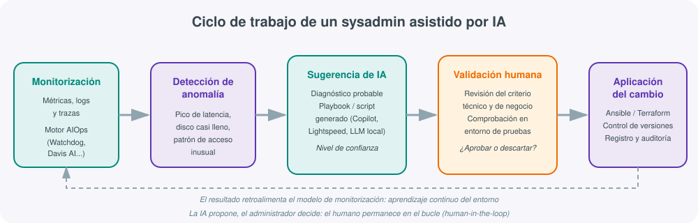
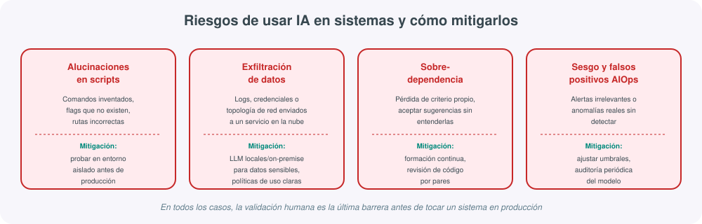
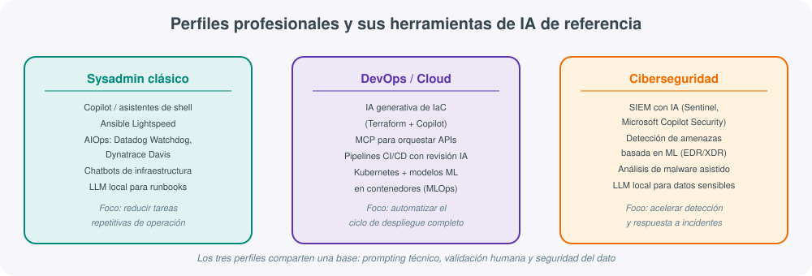

# **🤖 La Inteligencia Artificial en la administración de sistemas**

## Presentación: un cambio de herramienta, no de oficio

Cada pocos años, la administración de sistemas incorpora una tecnología que cambia la forma de trabajar sin cambiar el fondo del oficio: la virtualización cambió cómo se aprovisionan servidores, la nube cambió quién es dueño del hardware, los contenedores cambiaron cómo se empaqueta el software. La Inteligencia Artificial generativa y los sistemas de **AIOps** (*Artificial Intelligence for IT Operations*) son la incorporación de esta década, y a diferencia de olas anteriores, esta vez el cambio no llega solo a la infraestructura que se administra, sino a las propias herramientas con las que se administra.

Esto tiene una consecuencia directa para quien estudia Administración de Sistemas Informáticos en Red (ASIR) hoy: no basta con aprender a instalar un servidor, configurar una red o escribir un script de automatización. Hay que aprender a hacerlo **con** un asistente de IA a tu lado, sabiendo qué tareas puede acelerar, cuáles puede hacer mal de forma convincente, y qué parte del criterio profesional sigue siendo insustituible. Esta unidad no sustituye a ninguna de las anteriores del temario: las complementa, mostrando cómo la IA atraviesa transversalmente la virtualización, la nube, los contenedores, el scripting y la automatización que ya se han trabajado en los módulos previos.

!!! note "Qué NO es esta unidad"
    Esta unidad no enseña a programar modelos de IA ni a entrenar redes neuronales — eso corresponde a otros módulos del ciclo formativo (Inteligencia Artificial y Big Data, si se cursa). Aquí el enfoque es el del **administrador de sistemas que usa IA como herramienta** para hacer mejor su trabajo diario, del mismo modo que ya usa un editor de texto, un gestor de configuración o una consola de monitorización.

La unidad se organiza en bloques que van de lo más práctico a lo más reflexivo: primero se describe cómo cambia el trabajo diario y con qué herramientas concretas; después se abordan los riesgos que exige tomar esa velocidad con precaución; a continuación se traduce todo ello en competencias concretas que conviene estudiar antes de salir al mercado laboral, con una comparativa de perfiles profesionales; y se cierra con un caso práctico de laboratorio, un checklist operativo, una lectura sobre el impacto organizativo y una reflexión final sobre qué parte del oficio va a seguir siendo, durante mucho tiempo, un trabajo de personas.

## 1. Cómo cambia la IA el día a día de un administrador de sistemas

### Automatización de tareas repetitivas

Buena parte del trabajo de un administrador de sistemas es, en esencia, repetitivo: revisar logs en busca de errores conocidos, reiniciar servicios que se han quedado colgados, aplicar parches de seguridad, comprobar que las copias de seguridad se han ejecutado correctamente, responder a las mismas preguntas de los usuarios una y otra vez. Los asistentes de IA no eliminan estas tareas, pero cambian **quién las hace en primera instancia**: un modelo de lenguaje puede leer miles de líneas de log en segundos y resumir "aquí hay tres eventos anómalos, el resto es ruido habitual", dejando al administrador la decisión final en lugar del rastreo manual.

Esto conecta directamente con lo que ya se vio en las unidades de scripting y automatización (UT05 y UT06 de este mismo temario): un script en Bash o PowerShell sigue siendo la forma de ejecutar una tarea de forma repetible, pero ahora ese script puede generarse, revisarse y depurarse con ayuda de un asistente de IA, acelerando la fase de escritura sin eliminar la necesidad de entender lo que el script hace.

### Detección de anomalías y AIOps

La segunda gran transformación es el paso de una **monitorización basada en umbrales fijos** ("avisa si la CPU supera el 90 %") a una **monitorización basada en aprendizaje del comportamiento normal** del sistema. Un modelo de IA entrenado con el histórico de métricas de una infraestructura aprende cuál es el patrón habitual de tráfico, uso de CPU o latencia en cada hora del día y cada día de la semana, y puede avisar de una desviación real (una fuga de memoria progresiva, un patrón de acceso propio de un ataque) mucho antes de que llegue a un umbral fijo, y con muchas menos falsas alarmas.

Esta disciplina se conoce como **AIOps**, y su promesa concreta —respaldada por datos de la industria en 2025-2026— es reducir drásticamente el ruido de alertas (estudios de plataformas del sector hablan de reducciones de entre el 70 % y el 95 % en alertas irrelevantes) y acelerar el tiempo medio de resolución de incidentes graves (*MTTR*) entre un 20 % y un 40 %. No es magia: sigue haciendo falta un equipo con disciplina de monitorización previa, pero sobre esa base, la IA cambia sustancialmente el volumen de trabajo manual de vigilancia.

### Generación y depuración de scripts asistida

Escribir un playbook de Ansible, un script de PowerShell para gestionar usuarios de Active Directory, o una expresión regular compleja para parsear un log ya no empieza necesariamente en blanco: se empieza describiendo en lenguaje natural qué se necesita, y el asistente propone una primera versión que el administrador revisa, corrige y adapta. Lo mismo ocurre con la depuración: pegar un mensaje de error críptico en un asistente de IA y pedir una explicación suele ser más rápido que rastrear manualmente en foros y documentación, aunque —como se verá en la sección de riesgos— esa rapidez no está exenta de peligros si se usa sin criterio.

### Documentación automática

Una de las tareas que tradicionalmente se pospone "para cuando haya tiempo" es documentar: qué hace cada script, por qué se tomó una decisión de arquitectura, cómo se resolvió un incidente concreto. Los asistentes de IA integrados en editores de código y en sistemas de tickets pueden generar un primer borrador de esa documentación a partir del propio código o del historial de la incidencia, reduciendo la fricción que hace que la documentación técnica quede siempre desactualizada.

!!! tip "La IA como "becario incansable", no como sustituto"
    Una forma útil de calibrar expectativas: piensa en el asistente de IA como en un becario con mucha memoria y ninguna experiencia de campo. Es rapidísimo generando un primer borrador (de un script, de un informe, de una respuesta a un ticket), pero no conoce las particularidades de tu infraestructura, no ha vivido el incidente que dejó ese servidor mal configurado hace dos años, y no asume responsabilidad si algo sale mal. Esa responsabilidad sigue siendo del administrador que revisa y aprueba el trabajo.

## 2. Herramientas concretas de IA aplicadas a sistemas, DevOps y redes

El ecosistema de herramientas es amplio y cambia con rapidez, pero se puede organizar en cinco grandes bloques según la función que cumplen.

### Asistentes de código y de terminal

- **GitHub Copilot**: el asistente de código más extendido, integrado en editores como Visual Studio Code. Sugiere líneas o bloques completos de código —incluidos scripts de shell, manifiestos YAML o configuraciones de infraestructura— a partir del contexto del archivo abierto y de comentarios en lenguaje natural. Su modo *chat* permite además pedir explicaciones de un fragmento de código o depurar un error sin salir del editor.
- **Asistentes de terminal**: herramientas que se integran directamente en la línea de comandos y traducen una petición en lenguaje natural ("busca los procesos que más memoria consumen y mátalos si superan 2 GB") a un comando o script ejecutable, mostrando siempre el comando antes de lanzarlo.

### Automatización de infraestructura con IA

- **Ansible Lightspeed** (con IBM watsonx Code Assistant): un servicio, integrado en la extensión de Ansible para Visual Studio Code, especializado en generar y completar *playbooks* de Ansible a partir de comentarios en lenguaje natural. A diferencia de un asistente generalista como Copilot, está entrenado específicamente sobre contenido y patrones de Ansible, lo que en comparativas recientes le da una tasa de aceptación de sugerencias notablemente más alta que la de asistentes de propósito general para este caso de uso concreto, además de un modelo mucho más ligero (cientos de millones de parámetros frente a varios miles de millones) pensado para ejecutarse de forma eficiente.
- **Generación asistida de Terraform**: de forma análoga a Ansible, los asistentes de código generalistas y algunos servicios específicos de los propios proveedores cloud ayudan a redactar módulos de Terraform, sugerir buenas prácticas de nomenclatura de recursos y detectar configuraciones inseguras antes de aplicarlas.

### Monitorización y AIOps

- **Datadog Watchdog**: motor de IA integrado en la plataforma de observabilidad Datadog que aplica aprendizaje automático no supervisado para detectar anomalías y valores atípicos en métricas, logs y trazas de forma automática, generar previsiones de saturación de recursos y realizar análisis automatizado de causa raíz (*root cause analysis*) cuando se produce un incidente.
- **Dynatrace Davis AI**: motor de IA de Dynatrace que se apoya en un modelo de dependencias entre componentes construido de forma determinista (no solo por correlación estadística), lo que le permite señalar la causa raíz exacta de un incidente en entornos distribuidos complejos con alta precisión, un punto fuerte especialmente valorado en infraestructuras de gran tamaño.
- Otras plataformas de referencia en este espacio incluyen **New Relic AIOps**, **Sysdig** y los servicios nativos de los grandes proveedores cloud (como AWS DevOps Guru), todos ellos orientados a la misma idea: aplicar aprendizaje automático sobre telemetría para anticipar y diagnosticar incidentes antes de que impacten al usuario final.

### Chatbots de infraestructura e integración vía MCP

Cada vez es más habitual disponer de un chatbot conectado a las herramientas reales de la infraestructura (el clúster de Kubernetes, el inventario de Ansible, el sistema de tickets), capaz no solo de responder preguntas sino de ejecutar consultas o acciones controladas. La pieza técnica que ha hecho madurar esta integración es el **Model Context Protocol (MCP)**, un estándar abierto que define cómo un modelo de lenguaje puede descubrir y llamar a herramientas externas (una API de Kubernetes, una base de datos, un repositorio Git) de forma uniforme, sin tener que programar una integración distinta para cada asistente de IA. En 2026 existen ya varios cientos de servidores MCP públicos que cubren bases de datos, contenedores, control de versiones y APIs de todo tipo, y el propio protocolo ha evolucionado hacia una operación sin estado que facilita desplegar estos conectores en producción, detrás de balanceadores de carga convencionales, igual que cualquier otro servicio.

### LLM locales y on-premise

No todas las organizaciones pueden —ni deben— enviar sus logs, su topología de red o su código fuente a un servicio de IA en la nube. Para esos casos existe una familia creciente de **modelos de lenguaje que se ejecutan en la propia infraestructura** (locales u on-premise), entrenados o ajustados sobre modelos abiertos, que permiten disfrutar de asistencia de IA sin que ningún dato salga del perímetro de la organización. Esta opción es especialmente relevante en sectores regulados (banca, sanidad, administración pública) y en el propio entorno docente de un ciclo de ASIR, donde experimentar con un modelo local en una máquina virtual es también una forma excelente de entender, por dentro, qué recursos de cómputo (CPU, GPU, memoria) exige realmente ejecutar un modelo de IA.

!!! example "Un caso concreto: depurar un playbook con Ansible Lightspeed"
    Un administrador necesita un playbook que instale y configure Nginx en un grupo de servidores Debian, abriendo el puerto 80 en el cortafuegos y arrancando el servicio. En lugar de partir de cero, escribe un comentario describiendo la tarea; Ansible Lightspeed sugiere las tareas YAML correspondientes (módulos `apt`, `ufw`, `service`), y el administrador revisa el resultado: comprueba que el nombre del paquete es correcto para la distribución de destino, que el puerto abierto es realmente el 80 y no otro por error de la sugerencia, y ejecuta el playbook primero contra una máquina de pruebas antes de aplicarlo al grupo completo de producción. La IA ha acelerado la fase de escritura; la validación en un entorno controlado sigue siendo responsabilidad del administrador.

## 3. Riesgos y limitaciones

Ningún beneficio anterior es gratuito. Usar IA en un entorno de sistemas introduce riesgos específicos que conviene conocer antes de integrarla en el flujo de trabajo real.

### Alucinaciones en scripts generados

Un modelo de lenguaje no "sabe" que un comando existe: predice la secuencia de texto más probable dado el contexto, lo que en ocasiones produce comandos, *flags* o rutas que **parecen correctos y no lo son**. Un script generado por IA puede compilar o ejecutarse sin error aparente y aun así hacer algo distinto de lo previsto (borrar el directorio equivocado, aplicar una regla de cortafuegos demasiado permisiva). El peligro no es que la IA se equivoque —cualquier herramienta lo hace— sino que lo haga con una seguridad aparente que invita a confiar sin comprobar.

### Sobredependencia y pérdida de criterio técnico

Si la generación de scripts y la resolución de incidencias se delega sistemáticamente en la IA sin dedicar tiempo a entender por qué la solución propuesta funciona, el administrador puede perder progresivamente la capacidad de diagnosticar un problema nuevo que la IA no ha visto antes o de detectar cuándo la sugerencia recibida es, precisamente, una alucinación. Esta erosión de criterio es más peligrosa cuanto menos experimentado es el profesional, lo que hace especialmente importante que un estudiante de ASIR aprenda primero los fundamentos (redes, sistemas operativos, scripting) y use la IA como acelerador, no como sustituto del aprendizaje.

### Seguridad y exfiltración de datos

Enviar logs, configuraciones de red, credenciales o fragmentos de código propietario a un servicio de IA en la nube implica, por definición, que esa información sale del perímetro de la organización. Muchas políticas de seguridad corporativas ya regulan explícitamente qué se puede pegar en un asistente de IA público y qué no. Esta es la razón de fondo por la que los LLM locales u on-premise, descritos en la sección anterior, han pasado de ser una curiosidad técnica a una necesidad de cumplimiento normativo en sectores con datos sensibles.

### Sesgo y ruido en los sistemas de AIOps

Los motores de detección de anomalías aprenden del histórico de la infraestructura que monitorizan: si ese histórico incluye periodos anómalos (una incidencia mal resuelta, una campaña de tráfico atípica) sin etiquetar correctamente, el modelo puede terminar considerando "normal" algo que no lo es, o generando falsos positivos que erosionan la confianza del equipo en el sistema (el mismo problema de "fatiga de alertas" que se pretendía resolver). La auditoría periódica del modelo y el ajuste de umbrales siguen siendo tareas humanas.

### Límites de contexto y coste económico

Un aspecto más práctico, pero igualmente real, es que todo modelo de lenguaje tiene un límite de **contexto**: la cantidad de texto (código, logs, documentación) que puede tener en cuenta a la vez al generar una respuesta. Pedir a un asistente que analice un fichero de configuración completo de varios miles de líneas o un histórico de logs muy extenso puede superar ese límite, obligando a trocear la información o a resumirla antes de consultarla, con el riesgo de perder detalles relevantes en ese resumen previo. A esto se suma un factor económico: los servicios de IA en la nube suelen facturar por volumen de texto procesado (tokens), de modo que un uso intensivo y poco planificado —por ejemplo, pegar logs completos de forma repetida en lugar de filtrar antes lo relevante— tiene un coste que conviene presupuestar igual que cualquier otro servicio cloud del que ya se ha hablado en unidades anteriores de este temario.

!!! warning "La responsabilidad no se automatiza"
    Ninguna herramienta de IA asume responsabilidad legal ni profesional por un cambio aplicado en producción. Si un script generado por IA borra datos por error o una regla de cortafuegos sugerida deja un servicio expuesto, la responsabilidad recae en quien aprobó y ejecutó ese cambio, no en la herramienta que lo sugirió. Este principio —validación humana obligatoria antes de tocar producción— es el hilo conductor de toda esta unidad.

## 4. Qué debería estudiar un alumno de ASIR para el mercado laboral que se avecina

El impacto de la IA en el puesto de administrador de sistemas no es una amenaza abstracta: es un cambio concreto en qué competencias piden las ofertas de empleo del sector. Las siguientes son las que, con la información disponible en 2026, más peso están ganando:

1. **Prompting técnico**: saber formular una petición precisa a un asistente de IA (contexto, restricciones, formato de salida esperado) es ya una habilidad tan práctica como saber usar `grep` o `journalctl`. Un prompt vago produce una sugerencia vaga; un prompt que especifica sistema operativo, versión, restricciones de seguridad y formato de salida produce resultados directamente aprovechables.
2. **Integración de APIs de IA**: más allá de usar un chatbot desde una interfaz web, entender cómo se llama a la API de un modelo de lenguaje desde un script propio (por ejemplo, para generar automáticamente un resumen de incidencias semanales) es una competencia que empieza a distinguir a un perfil junior de uno con proyección.
3. **Model Context Protocol (MCP)**: entender el estándar que permite a un modelo de IA conectarse a herramientas reales de infraestructura —y ser capaz de configurar o incluso desarrollar un servidor MCP sencillo para una herramienta interna— es una de las competencias más demandadas emergentes de 2026, por ser la pieza que conecta la IA generativa con la automatización real de sistemas.
4. **Contenedores y Kubernetes para desplegar modelos**: los modelos de IA locales, igual que cualquier otra aplicación moderna, se despliegan habitualmente en contenedores. Los fundamentos de Docker y Kubernetes trabajados en la UT04 de este mismo temario son exactamente la base necesaria para desplegar y escalar un modelo de IA propio dentro de la organización.
5. **Seguridad de sistemas con IA**: entender los vectores de ataque específicos de la IA (inyección de *prompts*, envenenamiento de datos de entrenamiento, exfiltración a través de un asistente mal configurado) es ya parte del temario de ciberseguridad de cualquier ciclo de grado superior actualizado.
6. **Automatización combinada: Ansible/Terraform + IA**: no se trata de elegir entre automatización clásica e IA, sino de combinarlas — usar IA para generar y revisar el código de infraestructura, y las herramientas de automatización de siempre (trabajadas en la UT06) para aplicarlo de forma reproducible y auditable.

!!! tip "Por dónde empezar si solo hay tiempo para una cosa"
    Si un estudiante de ASIR solo puede dedicar tiempo a una competencia de esta lista antes de las prácticas en empresa, la recomendación es el **Model Context Protocol**: es la pieza más nueva, la que menos se enseña todavía de forma estructurada en el aula, y la que conecta directamente con todo lo demás (automatización, contenedores, APIs).

## 5. Comparativa de perfiles profesionales y herramientas de IA

No todos los perfiles del sector necesitan dominar las mismas herramientas de IA con la misma profundidad. La siguiente tabla resume qué debería priorizar cada perfil profesional relacionado con la administración de sistemas.

| Perfil | Herramientas de IA clave | Prioridad de aprendizaje |
|---|---|---|
| **Sysadmin clásico** | Asistentes de shell/Copilot, Ansible Lightspeed, AIOps (Watchdog, Davis), chatbots de infraestructura | Automatizar tareas repetitivas y acelerar el diagnóstico de incidencias sin perder el control operativo |
| **DevOps / Cloud** | Generación de IaC (Terraform + Copilot), MCP para orquestar APIs, pipelines CI/CD con revisión asistida por IA, Kubernetes para desplegar modelos propios | Integrar la IA en el ciclo de vida completo del despliegue, desde el código hasta la observabilidad |
| **Ciberseguridad** | SIEM con IA, detección de amenazas basada en ML (EDR/XDR), asistentes para análisis de malware, LLM locales para datos sensibles | Usar la IA para acelerar la detección y respuesta a incidentes, vigilando a la vez los riesgos que la propia IA introduce |

Los tres perfiles comparten, sin embargo, un núcleo común que no depende de la especialidad: **prompting técnico preciso, validación humana de cualquier sugerencia antes de aplicarla en producción, y criterio claro sobre qué datos pueden salir de la organización hacia un servicio de IA en la nube**.

!!! example "De la teoría a la práctica: un incidente resuelto con los tres perfiles"
    Un pico de latencia en una aplicación web dispara una alerta de Dynatrace Davis AI, que señala como causa probable un contenedor con fuga de memoria (perfil DevOps). El sysadmin clásico revisa la sugerencia, la valida en el clúster de pruebas y aplica el cambio con un playbook de Ansible revisado con Lightspeed. En paralelo, el equipo de ciberseguridad descarta, apoyándose en su SIEM con IA, que el pico se deba a un ataque de denegación de servicio en lugar de a un error de programación. Los tres perfiles han usado IA en un momento distinto del mismo incidente, cada uno con la herramienta adecuada a su función.

## 6. Reflexión final: el futuro del puesto de administrador de sistemas

Es tentador leer todo lo anterior como una cuenta atrás hacia la desaparición del puesto de administrador de sistemas. La lectura más ajustada a lo que se observa en 2025-2026 es distinta: **se automatiza la ejecución de tareas bien definidas y repetitivas, no el criterio necesario para decidir qué tarea hay que ejecutar, cuándo y con qué límites**.

Lo que previsiblemente seguirá automatizándose y acelerándose:

- La redacción de un primer borrador de script, playbook o configuración.
- La correlación de métricas y logs para detectar anomalías y sugerir una causa probable.
- La generación y actualización de documentación técnica.
- Las respuestas a incidencias repetitivas y bien documentadas (un "nivel 1" de soporte cada vez más automatizado).

Lo que, con la tecnología actual, sigue exigiendo criterio humano:

- Decidir si una sugerencia de IA es segura de aplicar en un sistema concreto, con su historial y sus particularidades.
- Diagnosticar incidencias nuevas, no vistas antes, donde no existe un patrón histórico del que aprender.
- Tomar decisiones de arquitectura que implican compromisos entre coste, rendimiento, seguridad y mantenibilidad.
- Asumir la responsabilidad última de un cambio en producción y responder ante un fallo.
- Negociar con proveedores, priorizar incidencias según impacto de negocio y comunicar con claridad a perfiles no técnicos.

El perfil profesional que mejor va a encajar en este contexto no es el que sabe escribir el script más rápido, sino el que entiende con suficiente profundidad los sistemas que administra como para **supervisar con criterio** lo que una IA propone, detectar cuándo se equivoca, y decidir con responsabilidad qué cambios llegan a producción. Precisamente por eso, la base de este ciclo formativo —sistemas operativos, redes, virtualización, scripting, automatización— no pierde valor: es la que permite distinguir una sugerencia útil de una alucinación convincente. La IA cambia las herramientas; no cambia la necesidad de entender, de fondo, cómo funciona un sistema.

Conviene además no perder de vista que esta reflexión no es exclusiva del sector informático: la mayoría de profesiones que hoy trabajan con información —desde la abogacía hasta la ingeniería civil— están atravesando exactamente la misma transición, sustituyendo tareas mecánicas por supervisión de herramientas cada vez más capaces. Lo que distingue a la administración de sistemas es que, además de vivir ese cambio como cualquier otro sector, es uno de los pocos que además **construye y mantiene la infraestructura que hace posible ejecutar esa misma IA** en primer lugar: los servidores, las redes y los contenedores que alojan los modelos son, en última instancia, sistemas que alguien tiene que administrar. Esta unidad no cierra por tanto un tema aislado, sino que enlaza con el motivo por el que las unidades de virtualización, cloud y contenedores de este mismo temario van a seguir siendo relevantes durante muchos años: la IA necesita infraestructura, y esa infraestructura necesita administradores de sistemas que la entiendan de verdad.

## 7. Caso práctico de laboratorio: desplegar un LLM local

Una forma habitual de acercar todo lo anterior a la práctica de aula, sin depender de servicios de pago ni de conexión permanente a internet, es desplegar un modelo de lenguaje reducido en una máquina virtual del propio laboratorio, reutilizando exactamente lo trabajado en las unidades de virtualización y contenedores de este temario.

1. **Aprovisionar la máquina**: una máquina virtual (o un contenedor, si el modelo elegido es lo bastante ligero) con recursos suficientes de CPU y RAM; los modelos más pequeños y eficientes ya pueden ejecutarse de forma razonable sin necesitar GPU dedicada, aunque una GPU acelera notablemente la respuesta.
2. **Instalar un motor de inferencia local**: herramientas de código abierto permiten descargar un modelo ya entrenado (en formatos comprimidos y optimizados para ejecución local) y exponerlo mediante una API compatible con la que usan los asistentes de IA en la nube, de modo que el resto de herramientas (editores, scripts propios) pueden hablar con el modelo local exactamente igual que hablarían con un servicio externo.
3. **Contenerizar el servicio**: empaquetar el motor de inferencia en una imagen de contenedor propia permite versionarlo, desplegarlo de forma reproducible y, si el laboratorio dispone de un clúster de Kubernetes, escalarlo horizontalmente repartiendo peticiones entre varias réplicas.
4. **Conectar herramientas mediante MCP**: una vez el modelo responde localmente, se le puede dar acceso controlado a herramientas del propio laboratorio (un inventario de Ansible, una base de datos de prácticas) a través de un servidor MCP sencillo, cerrando el círculo completo: modelo local, sin fuga de datos, con capacidad real de ejecutar tareas de infraestructura.
5. **Medir y comparar**: comprobar cuánto tarda el modelo local en responder frente a un servicio en la nube, y qué calidad de sugerencia ofrece en tareas típicas (generar un playbook sencillo, explicar un mensaje de error), es un ejercicio que ayuda a entender de forma tangible el compromiso entre coste, privacidad y rendimiento que cualquier organización real tiene que resolver.

Este ejercicio conecta de forma directa cuatro unidades del ciclo: virtualización o contenedores para alojar el modelo, redes para exponer su API de forma segura dentro del laboratorio, scripting para automatizar su despliegue, y esta propia unidad para entender por qué tiene sentido hacerlo en local en primer lugar.

!!! note "No hace falta la GPU más potente del mercado"
    Un error habitual al plantear este ejercicio es asumir que hace falta hardware de gama alta. Existen modelos abiertos deliberadamente reducidos, pensados para ejecutarse en un portátil o una máquina virtual modesta, con una calidad de respuesta más que suficiente para tareas de administración de sistemas habituales (explicar un comando, generar un script sencillo, resumir un log). La elección del tamaño del modelo es, en sí misma, una decisión de arquitectura: más parámetros no siempre es la respuesta correcta si el caso de uso es acotado.

## 8. Checklist antes de aplicar un cambio sugerido por IA en producción

Del mismo modo que otras unidades de este temario cierran con una lista de comprobación práctica, conviene fijar aquí los pasos mínimos antes de dar por buena cualquier sugerencia de IA que vaya a tocar un sistema real:

1. ¿Se ha entendido completamente lo que hace el script, playbook o comando sugerido, línea a línea, y no solo su propósito general?
2. ¿Se ha comprobado que los nombres de paquete, rutas, módulos o *flags* usados existen realmente en la versión concreta del sistema de destino?
3. ¿Se ha probado el cambio en un entorno de pruebas o en una máquina de descarte antes de aplicarlo al entorno de producción?
4. ¿Contiene el prompt o la conversación con la IA algún dato sensible (credenciales, IP internas, nombres de clientes) que no debería haber salido del perímetro de la organización?
5. ¿Existe un plan de reversión (snapshot, backup, rama de control de versiones) por si el cambio, una vez aplicado, produce un efecto no previsto?
6. ¿Queda constancia, en el sistema de control de versiones o en el registro de cambios, de que la sugerencia vino de una IA y de quién la validó?

Si alguna respuesta es "no", ese es exactamente el punto en el que conviene detenerse antes de ejecutar el cambio, del mismo modo que en el resto de unidades de este temario se insiste en no dar un paso de despliegue por bueno sin haber comprobado antes el paso anterior.

## 9. Impacto económico y organizativo: qué cambia en el equipo de sistemas

Más allá de la herramienta concreta, conviene entender qué cambia a nivel de organización cuando un equipo de sistemas incorpora IA de forma seria, porque son cambios que un estudiante de ASIR se va a encontrar directamente en sus primeras prácticas o su primer empleo.

### El tamaño y la composición de los equipos

La automatización de tareas de "nivel 1" (reinicios, comprobaciones rutinarias, respuestas a incidencias ya documentadas) reduce la necesidad de un volumen grande de personal dedicado exclusivamente a tareas repetitivas de bajo valor añadido. A cambio, crece la demanda de perfiles capaces de **supervisar, auditar y mejorar** los propios sistemas de IA que hacen ese trabajo: alguien tiene que decidir qué umbrales usa el motor de AIOps, revisar por qué una alerta relevante no saltó, o mantener actualizado el servidor MCP que conecta el chatbot de infraestructura con el inventario real. El puesto no desaparece: se desplaza hacia arriba en la cadena de valor.

### Nuevos roles híbridos

Están consolidándose perfiles que no encajan del todo en las categorías clásicas de "sysadmin", "DevOps" o "ciberseguridad": el **ingeniero de plataforma de IA**, que se encarga de desplegar, monitorizar y dar soporte a los propios modelos de IA que usa el resto de la organización (los descritos en la sección de LLM locales), o el **ingeniero de fiabilidad asistido por IA** (*AI-augmented SRE*), que combina la disciplina clásica de *Site Reliability Engineering* con el uso intensivo de AIOps para reducir el tiempo de detección y resolución de incidentes. Ninguno de estos roles existía, con esta forma concreta, hace pocos años.

### El coste de no adoptarlo también existe

Es tentador analizar la adopción de IA solo en términos de riesgo (los descritos en el apartado 3), pero también existe un coste de **no** adoptarla: equipos que siguen dedicando horas a tareas que ya se automatizan en otras organizaciones del sector acaban compitiendo en desventaja, tanto en tiempo de resolución de incidencias como en capacidad de atender más infraestructura con el mismo número de personas. La decisión razonable no es "adoptar IA sí o no", sino "adoptarla con las salvaguardas del apartado 3 y el checklist del apartado 8".

!!! tip "Un consejo para las prácticas en empresa"
    Si en las prácticas de la FCT (Formación en Centros de Trabajo) el estudiante se encuentra con que la empresa ya usa algún asistente de IA para tareas de sistemas, vale la pena preguntar explícitamente qué política interna existe sobre qué se puede y no se puede compartir con esa herramienta. La respuesta a esa pregunta suele revelar, mejor que cualquier explicación teórica, el nivel de madurez real de la organización en el uso de IA.

## 10. Glosario rápido de la unidad

- **AIOps**: aplicación de IA y aprendizaje automático a la operación de sistemas (monitorización, detección de anomalías, diagnóstico automático).
- **Alucinación**: respuesta de un modelo de IA que parece correcta y coherente pero es objetivamente falsa o inventada.
- **Human-in-the-loop**: diseño de un proceso en el que una persona valida o aprueba las decisiones o acciones propuestas por un sistema automático antes de aplicarlas.
- **LLM (Large Language Model)**: modelo de lenguaje de gran tamaño, la tecnología subyacente en los asistentes de IA generativa actuales.
- **MCP (Model Context Protocol)**: estándar abierto que permite a un modelo de IA descubrir y usar herramientas externas (APIs, bases de datos, sistemas de infraestructura) de forma uniforme.
- **MTTR (Mean Time To Repair/Resolve)**: tiempo medio que tarda un equipo en resolver un incidente desde que se detecta.
- **Prompt / prompting**: instrucción en lenguaje natural que se da a un modelo de IA, y la disciplina de formularla con precisión para obtener mejores resultados.
- **Root cause analysis (RCA)**: proceso de identificar la causa raíz de un incidente, cada vez más asistido por IA en plataformas de observabilidad.

## 11. Autoevaluación rápida

1. Explica con tus propias palabras la diferencia entre un asistente de código generalista (como GitHub Copilot) y uno especializado (como Ansible Lightspeed). (apartado 2)
2. ¿Por qué un motor de AIOps como Datadog Watchdog o Dynatrace Davis reduce el número de falsas alarmas frente a un sistema de umbrales fijos? (apartado 1)
3. Describe un escenario en el que usar un LLM en la nube sería un riesgo de seguridad, y explica cómo mitigarlo. (apartado 3)
4. ¿Qué papel juega el Model Context Protocol (MCP) para que un chatbot de infraestructura pueda ejecutar acciones reales, y no solo responder preguntas? (apartados 2 y 4)
5. Elige uno de los tres perfiles profesionales de la tabla comparativa (sysadmin, DevOps, ciberseguridad) y justifica por qué debería priorizar una herramienta de IA concreta frente a otra. (apartado 5)
6. ¿Qué tareas del administrador de sistemas crees que seguirán exigiendo criterio humano dentro de cinco años, y por qué? (apartado 6)
7. Diseña, aunque sea a alto nivel, cómo desplegarías un LLM local en el laboratorio del ciclo, indicando qué unidades previas del temario reutilizarías. (apartado 7)
8. De los seis puntos del checklist antes de aplicar un cambio sugerido por IA, ¿cuál crees que se salta con más frecuencia en un entorno real, y qué consecuencia podría tener? (apartado 8)
9. ¿Qué significa que "el puesto se desplaza hacia arriba en la cadena de valor" en lugar de desaparecer? Relaciónalo con un ejemplo concreto de tarea automatizada. (apartado 9)

## 12. Resumen: qué apartado del temario cubre cada bloque de contenido

| Bloque de contenido | Apartados relacionados |
|---|---|
| Cambios en el día a día del administrador | 1 (automatización, AIOps, generación de scripts, documentación) |
| Herramientas concretas de IA | 2 (asistentes, Ansible Lightspeed, AIOps, MCP, LLM locales) |
| Riesgos y mitigación | 3 (alucinaciones, exfiltración, sobredependencia, sesgo) |
| Competencias para el mercado laboral | 4 (prompting, APIs, MCP, contenedores, seguridad) |
| Perfiles profesionales | 5 (sysadmin, DevOps, ciberseguridad) |
| Futuro del puesto | 6 (qué se automatiza, qué exige criterio humano) |
| Práctica de laboratorio | 7 (LLM local desplegado en el aula) |
| Buenas prácticas antes de producción | 8 (checklist de validación) |
| Impacto en el equipo y la organización | 9 (roles nuevos, coste de no adoptar IA) |

Esta tabla funciona como mapa de estudio: si al repasar la unidad hay dudas sobre un bloque concreto, aquí se indica exactamente a qué apartado volver.

## Para profundizar

Esta unidad se apoya en información pública sobre el estado del ecosistema de IA aplicada a sistemas y DevOps en 2025-2026. Para quien quiera profundizar, son recomendables el artículo comparativo [Ansible Lightspeed vs GitHub Copilot](https://lucaberton.com/blog/ansible-lightspeed-vs-github-copilot-automation-2026/){:target="_blank"} sobre asistentes especializados frente a generalistas en automatización; la guía [Ansible Lightspeed: AI-Powered Playbook Automation Guide](https://spacelift.io/blog/ansible-lightspeed){:target="_blank"} de Spacelift; el análisis [AI-Enhanced Monitoring and Observability: Datadog Watchdog AI, Dynatrace Davis AI y AIOps](https://devops-radar.com/ai-enhanced-monitoring-and-observability-mastering-datadog-watchdog-ai-dynatrace-davis-ai-new-relic-aiops-sysdig-for-real-world-devops-impact/){:target="_blank"} sobre observabilidad asistida por IA; y la [documentación oficial del Model Context Protocol](https://modelcontextprotocol.io/specification/2025-11-25){:target="_blank"}, el estándar que conecta modelos de IA con herramientas reales de infraestructura. 

!!! tip "Cómo seguir el ritmo de un campo que cambia cada mes"
    Ninguna lista de enlaces sobre IA envejece bien: nuevas versiones de estas herramientas, y herramientas nuevas que hoy no existen, aparecerán antes de que termine el curso. La recomendación de fondo, más duradera que cualquier enlace concreto, es seguir de cerca las notas de versión de los asistentes que ya se usan en el aula (el editor de código, la extensión de Ansible) y dedicar de vez en cuando media hora a probar una herramienta nueva del sector con un caso de prueba pequeño y controlado, exactamente con el mismo criterio de validación descrito en el checklist del apartado 8.

Con esto se cierra la unidad: de la monitorización asistida por IA a la reflexión sobre el futuro del puesto, pasando por las herramientas concretas, los riesgos y las competencias que conviene dominar antes de salir al mercado laboral.
