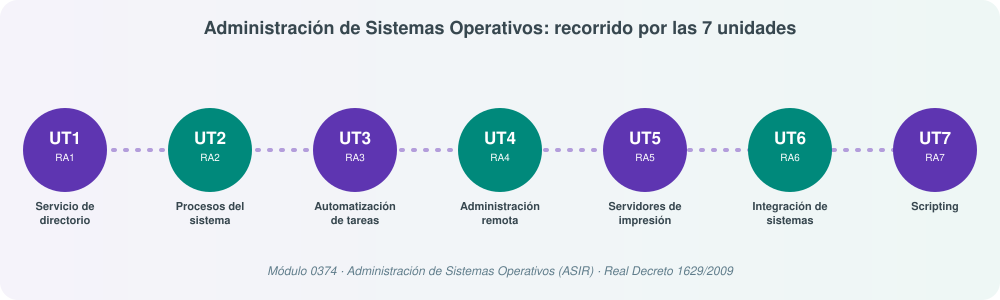

# **🖥️ Administración de Sistemas Operativos (ADD)**

## Bienvenida

Este bloque de apuntes corresponde al módulo profesional **Administración de Sistemas Operativos** del **Ciclo Formativo de Grado Superior en Administración de Sistemas Informáticos en Red (ASIR)**, regulado por el [Real Decreto 1629/2009, de 30 de octubre](https://www.boe.es/eli/es/rd/2009/10/30/1629){:target="_blank"}.

A lo largo del módulo vamos a responder a una pregunta muy concreta: **¿cómo se administra, de principio a fin, el sistema operativo de una organización en red?** Para contestarla recorreremos todo el ciclo de la administración de sistemas: cómo se centraliza la gestión de usuarios y equipos mediante un servicio de directorio, cómo se controlan los procesos que se ejecutan en el sistema, cómo se automatizan las tareas repetitivas, cómo se administra un equipo en remoto con seguridad, cómo se gestionan los servidores de impresión, cómo se integran sistemas operativos libres y propietarios en un mismo escenario, y cómo se automatiza todo ello mediante lenguajes de guiones («scripting»).

## Cómo está organizado el módulo

El currículo oficial define **siete resultados de aprendizaje (RA)**, y en este material cada uno se corresponde con una **Unidad de Trabajo (UT)**. Es una equivalencia 1:1: aprobar una UT significa haber alcanzado su RA correspondiente.

| UT | Resultado de aprendizaje (resumen) | Contenido principal |
|---|---|---|
| **UT1** | Administra el servicio de directorio interpretando especificaciones e integrándolo en una red | Active Directory, LDAP, Samba4, esquema y objetos del directorio, GPO |
| **UT2** | Administra procesos del sistema describiéndolos y aplicando criterios de seguridad y eficiencia | Procesos, hilos, estados, planificación, arranque del sistema |
| **UT3** | Gestiona la automatización de tareas del sistema aplicando criterios de eficiencia | cron/at, Programador de tareas de Windows, automatización de cuentas |
| **UT4** | Administra de forma remota el sistema operativo en red valorando su importancia y aplicando criterios de seguridad | SSH, RDP, WinRM, WireGuard, cifrado de la información |
| **UT5** | Administra servidores de impresión describiendo sus funciones e integrándolos en una red | CUPS, impresión en Windows Server, impresoras lógicas y colas |
| **UT6** | Integra sistemas operativos libres y propietarios, justificando y garantizando su interoperabilidad | NFS, Samba, contenedores (Docker/Podman), Kubernetes, clustering |
| **UT7** | Utiliza lenguajes de guiones en sistemas operativos, describiendo su aplicación y administrando servicios | Depuración y adaptación de scripts, administración de cuentas/procesos/servicios mediante Bash y PowerShell |

Para cada UT encontrarás siempre:

1. **Temario**: contenido teórico, con el nivel de un ciclo formativo de grado superior. No es una simple definición de conceptos: se explica el porqué de cada tecnología, sus alternativas y, cuando corresponde, la equivalencia entre el mundo Windows y el mundo GNU/Linux, ya que este módulo trabaja siempre ambos sistemas operativos en paralelo.
2. **Práctica**: una actividad guiada de **10 apartados obligatorios** para aplicar lo aprendido, con un enunciado, unos pasos orientativos y unos entregables concretos.
<!--
3. **Rúbrica**: los criterios con los que se evalúa la práctica y, por extensión, el grado de consecución del RA, siempre alineados con los criterios de evaluación oficiales del Real Decreto.
-->
