# **⚙️ UT02 · Procesos del sistema**

RA2. Gestiona los procesos del sistema, aplicando criterios de eficiencia y utilizando comandos y herramientas gráficas. Criterios de evaluación:

- Se han identificado los procesos y servicios del sistema.
- Se han utilizado comandos y herramientas gráficas para la gestión de procesos.
- Se han descrito los estados de un proceso y la planificación de procesos.
- Se han utilizado los comandos para cambiar la prioridad de un proceso.
- Se ha comprobado el funcionamiento de un proceso mediante los ficheros de registro correspondientes.
- Se han detectado procesos problemáticos, en base a un consumo excesivo de recursos.

## Teoría

### Gestión de procesos en Windows

Un **proceso** es un programa en ejecución que necesita una serie de recursos para realizar su tarea: tiempo de CPU, memoria, archivos y dispositivos de E/S. Un **servicio**, en cambio, es un programa que se ejecuta en segundo plano de manera continua, sin interacción directa con el usuario, y que normalmente se inicia automáticamente al arrancar el sistema (por ejemplo, un servidor web o de impresión).

Los componentes básicos que gestiona un sistema operativo son la gestión de procesos, de memoria, de ficheros y de los dispositivos de entrada/salida (drivers). Respecto a los procesos, el sistema operativo se encarga de:

- **Creación y terminación**: asignar recursos, establecer el contexto inicial y liberar recursos al finalizar.
- **Asignación de recursos**: CPU, memoria y dispositivos, de forma equitativa y eficiente.
- **Gestión de estados** y **cambios de contexto** entre procesos.
- **Planificación**: decidir qué proceso se ejecuta a continuación y durante cuánto tiempo.
- **Gestión de prioridades**, manejo de **interrupciones** y **excepciones**, sincronización/comunicación entre procesos y protección y seguridad.

Una **interrupción** es un evento que desvía temporalmente la ejecución normal de un programa para atender una tarea más urgente (a nivel de hardware, cuando un dispositivo requiere atención de la CPU; a nivel de software, cuando se realiza una llamada al sistema). Una **excepción** es un tipo de interrupción provocada por la propia CPU a causa de un error en el proceso activo (operación no permitida, dirección de memoria fuera de rango, etc.).

Según su relación con el usuario y el sistema, los procesos pueden clasificarse en: primer plano (foreground), segundo plano (background), de sistema, interactivos, en lote, huérfanos (su padre ha terminado pero el hijo sigue en ejecución) y zombis (han terminado pero mantienen una entrada en la tabla de procesos porque el padre no ha recogido su estado de salida).

El **bloque de control de proceso (BCP)** es la estructura de datos que el sistema operativo usa para mantener y gestionar toda la información relativa a un proceso en ejecución, lo que permite administrar múltiples procesos en un entorno multitarea.

Los términos "servicio" y "demonio" se usan a menudo indistintamente para procesos en segundo plano sin interacción con el usuario. Ejemplos de demonios: `sshd` (conexiones SSH), `httpd` (servidor web) o `cron` (tareas programadas).

**Concurrencia y paralelismo**. La concurrencia es la capacidad de un sistema para gestionar múltiples tareas a la vez, intercalando su ejecución, sin que necesariamente se ejecuten de forma simultánea (se logra mediante planificación y cambio de contexto). El paralelismo, en cambio, implica la ejecución realmente simultánea de varias tareas aprovechando múltiples núcleos o procesadores. Un servidor web típico combina ambas técnicas: concurrencia para atender miles de solicitudes y paralelismo para procesar varias de ellas a la vez en distintos núcleos.

Mecanismos para gestionar la concurrencia:

- **Hilos**: subprocesos que comparten los recursos del proceso pero mantienen su propio contador de programa y pila; su creación y cambio de contexto son más rápidos que los de un proceso completo.
- **Exclusión mutua**: garantiza que solo un proceso o hilo acceda a un recurso compartido (sección crítica) en un momento dado.
- **Sincronización**: semáforos, mutex y monitores para evitar condiciones de carrera al compartir recursos.
- **Comunicación entre procesos**: paso de mensajes, tubos (pipes) y sockets.

**Estados de un proceso**. Existen distintos modelos según el nivel de detalle:

- *2 estados*: no-ejecutado / ejecución.
- *3 estados*: se separa no-ejecutado en preparado y bloqueado (a la espera de un suceso).
- *5 estados*: se añaden nuevo (alta del proceso) y terminado (baja del proceso).
- *7 estados*: se añaden las colas de suspendido-bloqueado y suspendido-preparado en memoria secundaria, para evitar que la RAM se colapse (con el coste de la operación de intercambio o swap).

Los cinco estados habituales son: **Nuevo** (creándose, aún no admitido por el planificador), **Listo** (tiene todos los recursos salvo la CPU y compite por ella), **Ejecución** (usando activamente la CPU), **Bloqueado** (esperando un evento externo, p. ej. E/S) y **Terminado** (ha finalizado y libera sus recursos).

El **cambio de contexto** es el proceso por el cual el sistema operativo suspende un proceso en ejecución (pasándolo a Listo o Bloqueado) para que otro pueda continuar: se guarda el estado del proceso saliente, se selecciona el siguiente proceso, se restaura su estado, se actualizan las estructuras de datos y se ejecuta.

**Planificación de procesos**. El planificador (scheduler) decide el acceso de los procesos a la CPU, con dos posibles políticas: **no expropiativa** (el proceso mantiene el recurso hasta que ya no lo necesita) y **expropiativa** (se le puede retirar el recurso en cualquier momento). Algoritmos principales:

- **FCFS** (First Come First Served): se ejecutan en el orden de llegada.
- **SJF** (Shortest Job First): primero el proceso con menor tiempo de ejecución; no adecuado para sistemas interactivos.
- **SRT** (Shortest Remaining Time): variante expropiativa de SJF según el tiempo restante.
- **Prioridad**: se ejecuta primero el proceso de mayor prioridad (con FCFS como criterio de desempate).
- **RR** (Round Robin): a cada proceso se le asigna un *quantum* fijo; si no termina, vuelve al final de la cola.
- **Colas multinivel**: combina varias colas, cada una con su propia política, para tratar de forma diferenciada procesos interactivos, por lotes o en tiempo real.

**Secuencia de arranque**. El proceso de arranque lleva el sistema desde el estado apagado hasta uno operativo: encendido y POST (comprobación de hardware) a cargo de la BIOS/UEFI, carga del cargador de arranque (`bootmgr` en Windows, `grub` en Linux), inicialización del núcleo (`ntoskrnl.exe` en Windows) y carga de módulos/controladores, inicialización de servicios y procesos esenciales, y finalmente el arranque del entorno de usuario (administrador de ventanas, programas de inicio, servicios de red, etc.).

**Gestión de procesos (gráfica)**. En Windows se realiza principalmente desde el **Administrador de tareas** (clic derecho en la barra de tareas, o `Ctrl + Shift + Esc`), que ofrece las pestañas Procesos, Rendimiento, Historial de aplicaciones, Inicio, Usuarios, Detalles y Servicios.

**Gestión de procesos (símbolo del sistema)**:

```powershell
tasklist          # lista los procesos con su PID
tasklist /SVC     # muestra los servicios de cada proceso
tasklist /FI "username eq john"   # filtra por condición
tasklist /V       # información ampliada

taskkill /pid 1234       # elimina el proceso con PID 1234
taskkill /im firefox.exe # cierre "ordenado" por nombre
taskkill /im firefox.exe /f  # terminación inmediata y forzosa
```

**Gestión de procesos (PowerShell)**. Cmdlets principales: `Get-Process`, `Start-Process`, `Stop-Process`, `Wait-Process`, `Debug-Process` y `Get-PSHostProcessInfo`.

```powershell
Get-Process | more          # salida paginada
Get-Process -Name fi*       # filtra por nombre que empiece por "fi"

Stop-Process -id 1234                # por PID
Stop-Process -name fi*               # por nombre
Stop-Process -id 1234 -Confirm       # pidiendo confirmación

Get-Help <cmdlet> -Detailed   # ayuda detallada
Get-Help <cmdlet> -Examples   # solo ejemplos
Get-Help <cmdlet> -Full       # ayuda completa
Get-Help <cmdlet> -Online     # documentación en línea
```

Para la gestión de servicios: `Get-Service`, `New-Service`, `Start-Service`, `Stop-Service`, `Restart-Service`, `Suspend-Service`, `Resume-Service` y `Set-Service`.

### Gestión de procesos en GNU/Linux

Los procesos son fundamentales en las distribuciones Linux porque consumen los recursos hardware del sistema; su correcta administración es clave para mantener el servicio funcionando sin necesidad de reiniciar tras un cambio o actualización. Todo lo que se ejecuta en Linux es un proceso: por ejemplo, `ls -l | more` lanza dos procesos (`ls` y `more`). Linux es multiusuario y multitarea: el sistema operativo concede los recursos hardware a cada proceso, y el administrador dispone de mecanismos para consultarlos o modificarlos.

Características de un proceso en Linux:

- **PID** (identificador único del proceso) y **PPID** (identificador del proceso padre).
- **Espacio de memoria** propio (código ejecutable, datos y pila), que permite la ejecución aislada.
- **Estado**: ejecución, listo, bloqueado o terminado.
- **Prioridad**: determina cuánto tiempo de CPU se le asigna.

Un proceso puede estar **pausado** (detenido temporalmente pero en memoria, reanudable, p. ej. con `Ctrl+Z`), **detenido** (interrumpido, habitual en depuración), **suspendido** (movido a memoria secundaria/swap para liberar RAM), **parado** (sinónimo genérico de pausado/detenido) o **terminado/finalizado** (ha concluido su ejecución y liberado sus recursos).

**PID 0** corresponde al proceso `idle`/`swapper`, el primero que crea el kernel durante el arranque para ocupar los ciclos de CPU libres (no aparece en `ps` ni `top`). **PID 1** es el proceso **systemd** (anteriormente `init`), el primero que se ejecuta tras la inicialización del kernel; es responsable de iniciar y gestionar todos los demás procesos y actúa como su padre.

**systemd** es el sistema de inicio y gestor de servicios por defecto en la mayoría de distribuciones modernas. Entre sus características: inicio paralelo de servicios, gestión unificada mediante `systemctl`, control de recursos con **cgroups**, registro centralizado con **journald** y soporte de dependencias entre servicios. Sus componentes principales:

- **systemctl**: herramienta para iniciar, detener, reiniciar, habilitar y deshabilitar servicios.
- **cgroups**: agrupan procesos y limitan sus recursos (CPU, memoria, disco).
- **tmpfiles.d**: gestiona archivos temporales (limpieza de `/tmp`, permisos, rutas).
- **Unidades (units)**: ficheros de configuración en `/etc/systemd/system/` o `/lib/systemd/system/` — `.service` (servicios), `.socket` (sockets), `.mount` (montajes) y `.timer` (tareas programadas).
- **journald**: almacena y gestiona los logs del sistema (sustituye a `syslog`); los mensajes se clasifican en 7 niveles de prioridad: *emerg* (0), *alert* (1), *crit* (2), *err* (3), *warning* (4), *notice* (5), *info* (6) y *debug* (7).
- **logind**: gestiona las sesiones de usuario (inicio de sesión, suspensión, hibernación, bloqueo de pantalla).

```bash
journalctl                 # todos los logs del sistema
journalctl -u nginx.service    # logs de una unidad concreta
journalctl -f               # en tiempo real (follow)
journalctl -b               # desde el último arranque
journalctl --since "2023-01-01 00:00:00"
journalctl --until "2023-12-31 23:59:59"
journalctl -p err           # filtra por nivel de prioridad

systemctl list-units        # unidades activas
networkctl                  # estado de las interfaces de red
hostnamectl set-hostname nuevo-servidor
localectl status            # distribución local/teclado
timedatectl status          # hora y fecha del sistema
systemd-cgls                # contenido de los cgroups
```

**Gestión de procesos (gráfica)**: en GNOME, el **Monitor del sistema** (con las pestañas Procesos, Recursos y Archivos); en KDE, **KSysGuard**, con funcionalidad equivalente.

**Gestión de procesos (terminal)**: `ps`, `pstree`, `top`, `htop` y `pgrep`.

```bash
ps -a       # procesos asociados a una terminal
ps -x       # procesos no controlados por ninguna terminal
ps -e       # todos los procesos del sistema
ps -f       # salida detallada (usuario, terminal, etc.)
ps -l       # información completa de la tabla de procesos
ps -u usuario   # procesos de un usuario concreto
ps -r       # solo procesos en ejecución
```

Columnas habituales de `ps`: **S** (estado), **UID** (usuario propietario), **PID**, **PPID**, **C** (% CPU), **PRI** (prioridad), **NI** (nice), **TTY** (terminal asociada, `?` si es de segundo plano sin terminal), **TIME** (tiempo de CPU) y **CMD** (comando).

```bash
pstree -c        # no compacta subárboles idénticos
pstree -g        # ids de grupos de procesos (implica -c)
pstree -n        # ordena por PID
pstree -p        # muestra el PID junto al nombre
pstree -s PID    # muestra los padres del proceso indicado
```

`top` es un monitor en tiempo real (`-d` ritmo de refresco, `-u usuario`, `-o columna` para ordenar); una vez dentro, `h` muestra la ayuda, `k` envía una señal a un proceso y `r` cambia su prioridad. `htop` ofrece lo mismo con una interfaz más amigable (`apt install htop`): `F2` configuración de columnas, `F3`/`F4` filtrado, `F5` vista en árbol, `F7`/`F8` cambio de prioridad y `F9` envío de señales. `pgrep` busca procesos por nombre u otros atributos (`-c` cuenta coincidencias, `-n` el más reciente, `-u usuario` filtra por usuario).

**Primer y segundo plano**. Un proceso en **primer plano (foreground)** ocupa la terminal hasta que termina; uno en **segundo plano (background)** se lanza añadiendo `&` al final del comando y permite seguir usando la terminal.

```bash
jobs -l    # trabajos en segundo plano + PID
jobs -p    # solo el PID
jobs -r    # trabajos en ejecución
jobs -s    # trabajos detenidos
```

El signo `+` indica el trabajo más reciente movido a segundo plano; el signo `-`, el segundo más reciente. `Ctrl+Z` pausa un proceso en primer plano y lo pasa a segundo plano; `bg` lo continúa en segundo plano; `fg` (o `fg +`, `fg %+`) recupera un trabajo a primer plano.

**Señales**. Mecanismo para comunicar eventos o solicitudes a los procesos en ejecución.

```bash
kill -l          # lista las señales del sistema
kill -NÚMERO PID # envía la señal indicada
killall -i cmd   # confirmación interactiva antes de matar
killall -u usuario cmd  # solo procesos de ese usuario
killall -w cmd    # espera a que todos los procesos mueran
```

| Señal | N.º | Definición |
| --- | --- | --- |
| `SIGHUP` | 1 | Cuelgue (hang up) |
| `SIGINT` | 2 | Interrupción (`Ctrl+C`) |
| `SIGKILL` | 9 | Terminación forzada |
| `SIGTERM` | 15 | Finalización suave (por defecto en `kill`) |
| `SIGCONT` | 18 | Continuar tras la detención (`Ctrl+Z`) |
| `SIGSTOP` | 19 | Detención forzada (no puede manejarse) |
| `SIGTSTP` | 20 | Detener (`Ctrl+Z`) |

`SIGTERM` permite una terminación controlada (evita corrupción de datos); `SIGKILL` debe reservarse para casos extremos en los que otros intentos no han funcionado. Al ejecutar `kill` sin especificar señal se envía por defecto `SIGTERM`; conviene comprobar con `ps` que el proceso ha terminado antes de recurrir a `SIGKILL`.

**Prioridad**. El *kernel scheduler* ordena los procesos según su prioridad para decidir cuál se ejecuta a continuación. Las columnas **NI** (nice) y **PRI** (priority) están relacionadas pero no son lo mismo:

- **NI (nice value)**: rango de -20 a +19; valores negativos indican mayor prioridad y positivos, menor. Un usuario normal solo puede ajustarlo entre 0 y 19 (bajar la prioridad); asignar valores negativos requiere privilegios de root.
- **PRI (priority)**: rango de 0 a 139, donde valores más bajos indican mayor prioridad; lo determina el planificador del kernel y no se ajusta directamente por el usuario.

```bash
nice comando        # ejecuta con prioridad 10 por defecto
nice -n 5 comando    # especifica otra prioridad
renice -u usuario NUEVO_NICE   # cambia el nice a todos los procesos de un usuario
renice -p PID NUEVO_NICE       # cambia el nice de un PID concreto (por defecto)
```

## Actividades y prácticas

### Actividades

**SP 2.0 Actividades de la UT02.**

En un sistema tenemos cuatro procesos con las siguientes características (tabla de llegada, prioridad y ráfaga de CPU). Se pide planificar dichos procesos, con diagrama de planificación y cola de listos en cada caso (en RR, si un proceso llega justo cuando se cumple un quantum, el proceso que estaba en la CPU se sitúa antes en la cola de listos):

1. Algoritmo **FCFS**.
2. Algoritmo **SJF** expropiativo.
3. Algoritmo por **prioridad** expropiativo.
4. Algoritmo **RR** con Q = 0.3 s.
5. Algoritmo **SRT** expropiativo.
6. Listar y definir los algoritmos de planificación de procesos en Windows.
7. Listar y definir los algoritmos de planificación de procesos en Ubuntu.
8. Listar y definir los algoritmos de planificación de procesos en Fedora.
9. Listar y definir los algoritmos de planificación de procesos en Android.
10. ¿Cuál es la diferencia entre un proceso y un hilo en un sistema operativo?

**Windows** (con PowerShell en modo administrador; se crea previamente una carpeta con el nombre del alumnado en la raíz del sistema, para que aparezca en el prompt):

11. Abrir VLC, listar los procesos relacionados solo con dicho programa, eliminarlos y comprobar el resultado.
12. Mostrar un listado de los 10 primeros procesos ordenados por nombre.
13. Mostrar el listado de procesos ordenado por mayor consumo de CPU y eliminar el proceso con mayor uso.
14. Realizar un script **`nombre`** que invoque la ejecución del programa que se le pase como parámetro.
15. Mostrar el proceso que más CPU consume en formato lista con todos sus parámetros.
16. Mostrar los procesos agrupados por nombre (columnas nombre y número), ordenados por el número.
17. Listar todos los hilos de los procesos de Chrome (con varias pestañas abiertas).
18. Mostrar un listado de todos los servicios relacionados con la administración del equipo.
19. Agrupar los servicios por su estado.
20. Crear un script en PowerShell ISE con el resultado indicado en el enunciado original.
21. Crear un script en PowerShell con un menú de selección: mostrar programas de inicio de sesión; guardar un listado de procesos en CSV e imprimirlo; listar y detener procesos con alto consumo de CPU; mostrar y detener procesos con más de 100 MB de memoria; salir.

**GNU/Linux**:

22. ¿Qué es el PID de un proceso? ¿Qué diferencia hay entre las opciones `a e` y `x`? Explicar con ejemplos y captura.
23. Ejecutar `gparted` en segundo plano, indicar su número de trabajo y PID; establecer la prioridad más alta al navegador con `top` y la más baja con `htop`.
24. ¿Qué es el número NICE de un proceso? ¿Qué valores admite? ¿Quién puede cambiarlo? ¿Qué diferencia hay con PRI?
25. Contar y listar los procesos del sistema con prioridad mayor que la normal.
26. Ejecutar `gparted` en segundo plano y, mediante `pstree`, obtener el PID del proceso filtrando el resultado, obtener los PID de sus procesos padres, obtener los PID de sus procesos hijos ordenados por PID, y devolver el número de procesos hijos del proceso principal.

**Con un equipo Ubuntu Server**:

27. Mostrar una lista de 5 procesos en segundo plano (explicar el significado de `+` y `-`); pasar a primer plano el tercero de la lista, detenerlo y volver a mostrarla.
28. Lanzar un proceso de 600 segundos en segundo plano (p. ej. `sleep 600`); detenerlo mediante señales y comprobarlo; terminarlo inmediatamente sin pasarlo a primer plano.
29. Script con un menú de opciones (`loaded`, `not-found`, `active`, `inactive`, `dead`, `running`) que liste los servicios que cumplen la condición elegida.
30. Mediante `top`, listar los procesos del administrador del sistema ordenados por uso de CPU.
31. Mediante `htop`, filtrar los procesos del usuario estándar con prioridad más baja que la normal.
32. Script en bash que reciba año, mes y día por parámetro y devuelva el número de registros de error por nivel de severidad (emergente, alerta, crítico, error, advertencia, noticia, información, depuración) ocurridos desde esa fecha hasta la actual, validando los datos de entrada.

> Recursos: contenidos de la unidad, máquinas virtuales base y conexión a internet. Entrega en PDF a través del Campus, con el nombre de archivo `Apellido1Apellido2Nombre_SPXX`.

### Práctica

**SP 2.1 Gestión de procesos (Aula).**

En un sistema tenemos los siguientes procesos (tabla de llegada, prioridad y ráfaga de CPU):

1. Algoritmo por **prioridad** expropiativo.
2. Algoritmo **SRT** expropiativo.

**Windows**:

3. Contar y mostrar los programas que se ejecutan al inicio de sesión (primero el número, después el listado).
4. Detener el proceso de mayor PID entre los 10 procesos que menos memoria consumen, en tres pasos (listar los 10 procesos, eliminar el de mayor PID en una sola línea, y repetir el listado para comprobar el resultado; solo puntúa el segundo paso).
5. Mostrar los procesos agrupados por nombre (columnas nombre y número, ordenados por número), limitado a los 5 grupos con más procesos.
6. Contar y mostrar los servicios relacionados con **datos** que además estén activos.

**GNU/Linux**:

7. En un equipo Ubuntu Desktop: ejecutar `gparted` con prioridad -10 en segundo plano; cambiar la prioridad a la más alta posible sin usar `htop` ni `top`; cambiar la prioridad a la más baja posible con `top` (con captura); pausar `gparted` mediante señales desde `htop`.
8. Indicar dos maneras de que un proceso detenido continúe en segundo plano, explicando cada método con capturas.
9. Ejecutar Firefox en segundo plano y, con `pstree`, obtener el PID filtrando el resultado, los PID de los procesos padres, los PID de los procesos hijos ordenados por PID, y el número de procesos hijos del proceso principal.
10. Script en bash que reciba un nivel de severidad por parámetro y devuelva la cantidad de registros de ese nivel del mes actual por consola, generando además un archivo en el directorio personal con el listado correspondiente.

> Recursos: máquinas virtuales base. Entrega en PDF a través del Campus, con el nombre de archivo `Apellido1Apellido2Nombre_SPXX`.

### Recuperación

**Recuperación UT02-RA02.**

**Preguntas teóricas**:

1. Definir tres métodos de comunicación entre procesos.
2. ¿Quiénes pueden modificar el número nice del sistema? ¿Qué rango de valores pueden asignar?

**Preguntas prácticas**:

En un sistema tenemos una tabla de procesos con llegada, prioridad y ráfaga de CPU:

3. Algoritmo por **prioridad** expropiativo.
4. Algoritmo **SRT** expropiativo.

**Windows**:

5. Mostrar con `cmd` el listado de procesos que ejecuta el usuario actual.
6. Mostrar con PowerShell el listado de procesos ordenado por mayor consumo de CPU y eliminar el de mayor uso.

**GNU/Linux**:

7. Crear una lista con 5 aplicaciones en segundo plano; mostrar los procesos en forma de árbol filtrando la terminal actual (forzando la expansión si los árboles aparecen agrupados).
8. Ejecutar `gparted` en segundo plano, indicar su número de trabajo y PID; establecer la prioridad más alta con `top`, la más baja con `htop`, y terminar el proceso del navegador con `top`.
9. Contar y listar los procesos del sistema con prioridad **menor** que la normal.
10. Indicar dos maneras de que un proceso detenido continúe en segundo plano, con ejemplo y capturas.

> Recursos: máquinas virtuales base (el Windows Server debe tener ya creado el dominio `nombre.rec`). Entrega en PDF a través del Campus, con el nombre de archivo `Apellido1Apellido2Nombre_UTXXREC`.

### Solución

Documento de solución de referencia para las actividades de la UT02 (**SP 2.0**), mayoritariamente gráfico: cada apartado muestra la captura de pantalla con el resultado esperado de PowerShell (Windows) o terminal (GNU/Linux).

**Planificación de procesos**. Tabla de partida usada en los ejercicios de planificación (algoritmos FCFS, SJF, prioridad, RR y SRT):

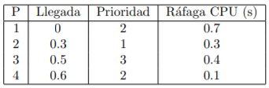

**Windows — PowerShell**. Para que el nombre del alumnado aparezca en el prompt de la terminal, se crea una carpeta con dicho nombre en la raíz del sistema y se trabaja desde esa ruta:

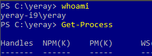

Listado de los 10 primeros procesos ordenados por nombre:

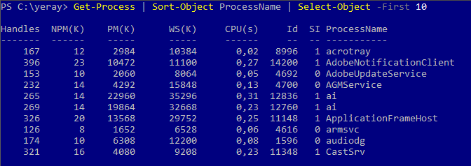

Listado de procesos ordenado por mayor consumo de CPU, con eliminación del proceso de mayor uso:

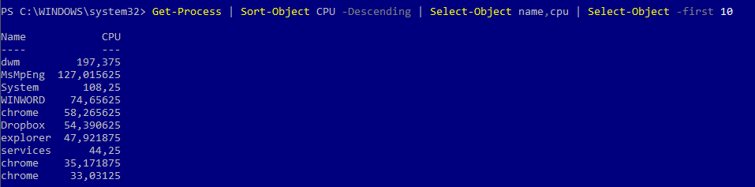

Proceso que más CPU consume, en formato lista con todos sus parámetros:

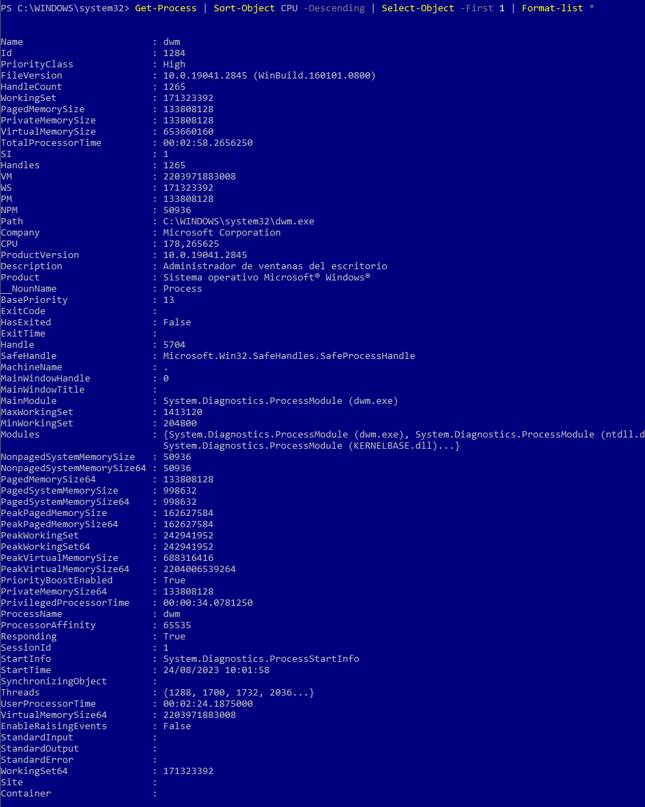

Procesos agrupados por nombre, en dos columnas (nombre y número) ordenadas por el número:

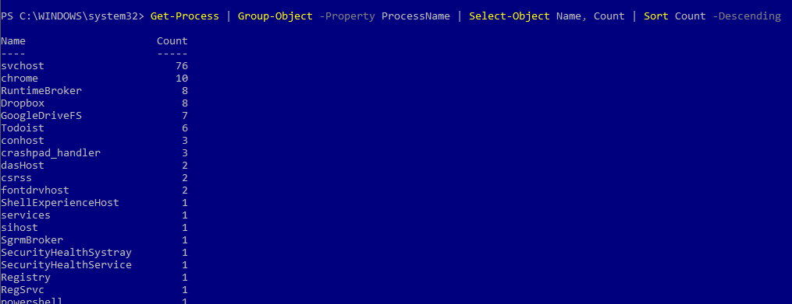

Hilos de los procesos de Chrome con varias pestañas abiertas:

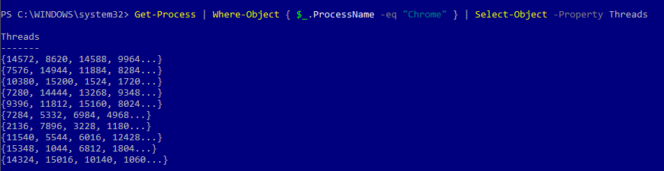

Listado de servicios relacionados con la administración del equipo:

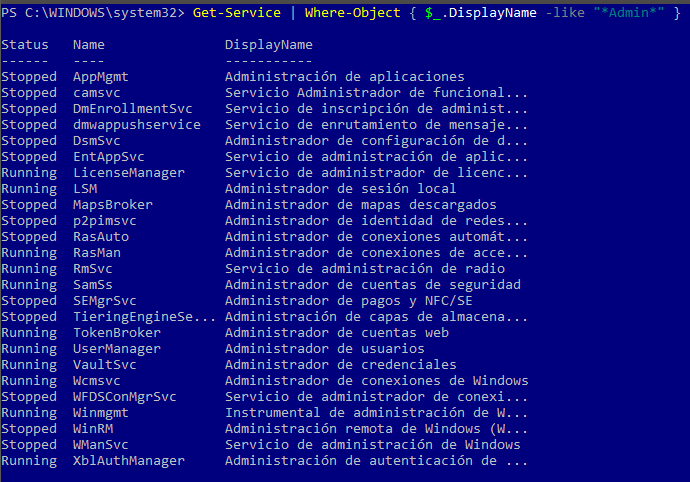

Servicios agrupados por su estado (`Stopped` / `Running`):

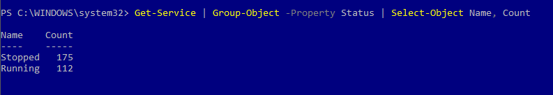

Script en PowerShell ISE con el resultado solicitado en el enunciado:

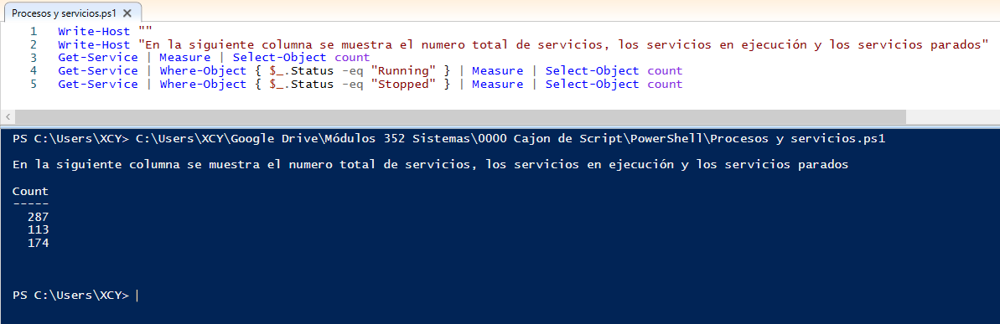

Eliminación del proceso de mayor PID entre los 10 procesos que menos memoria consumen (comprobación en tres pasos):

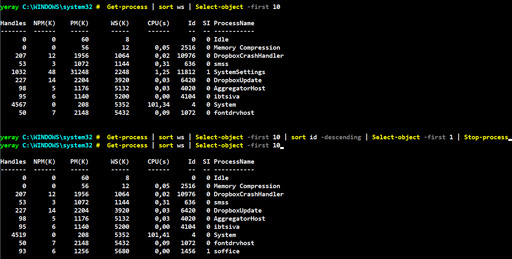

**GNU/Linux (Fedora / Ubuntu Server)**. Uso de `pstree` sobre `gparted` en segundo plano para obtener el PID filtrado, los PID de procesos padres e hijos (ordenados por PID) y el número de procesos hijos del proceso principal:

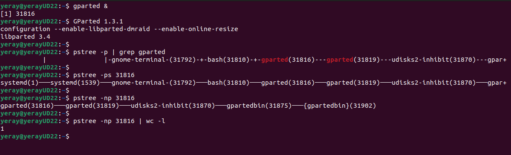

> Documento de referencia principalmente gráfico; consulta el material original del profesor para el detalle visual completo de cada apartado (incluye además ejercicios sobre demonios activos, filtrado de procesos con `htop` por prioridad y usuario, y gestión de procesos en segundo plano en Ubuntu Server).
