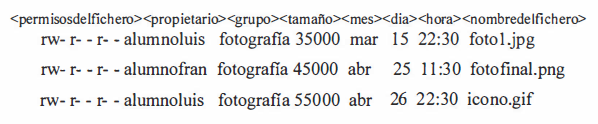
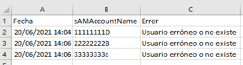
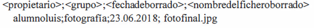
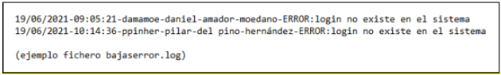
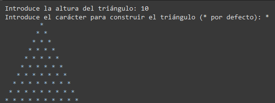

# **📜 UT07 · Scripting**

## Teoría

### Control de versiones

El material de esta sección se apoya en un repositorio externo con los ejemplos y la guía práctica de Git: [github.com/ymorgil/asir-add](https://github.com/ymorgil/asir-add).

### Bash


1.2 ScriptinG bash

# CONTENIDOS
BASH
VARIABLES
OPERACIONES BÁSICAS
ESTRUCTURAS DE CONTROL
FUNCIONES
DEPURACIÓN Y PRUEBAS
SCRIPT AVANZADOS

# BASH
Scripting se refiere a la creación y ejecución de secuencias de comandos o guiones que automatizan tareas específicas en un sistema informático. Estos guiones están escritos en lenguajes de programación de alto nivel, como Python, Ruby, Perl o JavaScript, y se utilizan para interactuar con programas, sistemas operativos y dispositivos.
Los lenguajes de scripting tienden a ser fáciles de aprender y usar en comparación con los lenguajes basados ​​en sistemas. Los lenguajes de script de Shell, por ejemplo, no son complejos y cuentan con muchas estructuras de programación. Son muy sencillos de entender y utilizar.
Además, los lenguajes de scripting vienen con flexibilidad, ya que la mayoría de ellos se escriben dinámicamente y no tienen un archivo de punto de entrada. Se puede activar fácilmente una terminal y ejecutar el script línea por línea con comandos cortos y fáciles de usar.

# BASH
Script es un código de programación, usualmente sencillo, que contiene comandos u ordenes que se van ejecutando de manera secuencial y comúnmente se utilizan para controlar el comportamiento de un programa en especifico o para interactuar con el sistema operativo. Los lenguajes mas usados para éstos son JavaScript, Lua, PHP, Python, ShellScript y VBScript.
En GNU/Linux tienen extensiones .bash y .sh, aunque no tienen mucha relevancia ya que se usan mas por costumbre que por necesidad, lo realmente importante aquí es la primera línea del script.
#!/bin/bash	#!/bin/ksh 	#!/bin/csh


# BASH
Pasos para crear un script:
Abrir un editor de texto. (nano)
Escribir el script. Escribir el código del script recordar la primera línea #!/bin/bash
Guardar el script.
Aplicar permisos al script. Por defecto, los archivos de script no son ejecutables en Linux. Debes darle permisos de ejecución al archivo.
Ejecutar el script.


# BASH
Estructura del código
Utilización de comentarios
Definir todas las variables a principio del código
Respetar la tabulación (identado)
Respetar los espacios en las expresiones condicionales
Todos los bucles y condiciones deben ser “abiertos” y “cerrados”


# BASH
Recomendaciones
Plantear el script que queremos hacer en pseudocódigo, es muy recomendable si estás aprendiendo a programar.
Cuando hagamos comentarios debemos hacerlo con la intención de que cualquier persona pueda entender tu código, por eso debe ser claro y conciso
Las variables tienen que ser todo lo adaptables posible, es decir, asegurarnos que si movemos el script de un directorio a otro, éste sigue funcionando igual. Para asegurar esto, lo ideal es usar rutas relativas o variables de entorno.
Si el script es largo o complejo, podemos acompañarlo de un fichero de léeme (Readme) que te explique como usarlo y que tener en cuenta. También podemos crear una sección “info” Dentro del script.
Seguir un criterio nemotécnico nos puede ayudar a programar con más facilidad. Por ejemplo, decidir que todas las variables serán nombradas con 3 carácter. ej: nom=”Alex”, ap1=”Vericat”, ap2=Caro”, nac=”Español”, yrs=”22”

# BASH
IMPORTANTE !!!
Bash no te obliga a usar tabulaciones. ¡Incluso si nos los proponemos podemos desarrollar un script en una sola línea! (no recomendable)
Bash no le gusta que haya espacios de más ni espacios de menos. Especialmente deberemos tener cuidado con los espacios en las expresiones condicionales.
Bash también tiene en cuenta los espacios en los bucles.
Bash nos permite el uso de operadores matemáticos, comparadores aritméticos y de string y puertas lógicas.
Si queremos añadir comentarios, los precederemos con el símbolo "#".


# BASH
Aplicaciones:
Los scripts o más bien lenguajes de scripting se utilizan principalmente en la automatización de tareas repetitivas como la extracción y limpieza de datos de diferentes sitios web. Para esta última tarea se puede utilizar un lenguaje de programación como Python o JavaScript.
En el caso de tareas administrativas, como buscar actualizaciones, ejecutar actualizaciones y mejoras, administrar dispositivos de red, etc., se pueden utilizar scripts bash o incluso scripts Powershell. Otras tareas administrativas pueden incluir limpiar la basura, crear usuarios e iniciar y detener programas.
Las aplicaciones que se ejecutan por separado también se pueden unir mediante el uso de lenguajes de secuencias de comandos. Es decir, la salida de una aplicación se puede canalizar como entrada para la siguiente aplicación.
También puede mejorar la experiencia del usuario, con el envió de mensajes de bienvenida, facilitar herramientas a usuarios, evitar intrusiones o mejorar el rendimiento y minimizar errores

# BASH
Comentarios son anotaciones en el código que no se ejecutan como parte del programa, pero sirven para documentar el código y explicar su funcionamiento.
Son esenciales para facilitar la comprensión del código, tanto para el programador que escribió el código como para otros que puedan leerlo en el futuro.
La sintaxis de los comentarios varía según el lenguaje de programación, pero en muchos lenguajes, se utiliza el símbolo # o // para iniciar un comentario de una sola línea, y se utiliza /* ... */ para comentarios de varias líneas.


# VARIABLES
Variables son nombres simbólicos utilizados para representar y almacenar datos en un programa o script. Son fundamentales para la manipulación y el procesamiento de información.
Para declarar una variable, debes asignar un nombre a la variable y, opcionalmente, inicializarla con un valor. Es importante que no haya espacios ni entre la variable y el signo igual, ni entre el signo igual y el valor que quieres asignar a tu variable.
Para leer de esa variable antepondrás un $ y utilizando el comando echo la podrás mostrar por pantalla.


# VARIABLES
Comillas Dobles ("): Se utilizan para definir textos y "se expanden". Es decir, las variables dentro de las comillas dobles son interpretadas (y no se muestran como el nombre de la variable).
Comillas Simples ('): Se utilizan para definir textos y "no se expanden". Es decir, las variables dentro de las comillas simples se muestran como el nombre de la variable (y no se muestran como su valor).
Acento Grave ( ` ): Se utilizan para indicar a bash que interprete el comando que hay entre los acentos.


# VARIABLES tipos
En bash no es necesario indicar el tipo de dato de las variables
| TIPO DE DATOS | Descripción | Ejemplos (en Python) |
| --- | --- | --- |
| Entero (Integer) | Almacena números enteros sin decimales. | 42, -10, 0 |
| Punto Flotante (Float) | Almacena números con decimales. | 3.14, -0.5, 2.0 |
| Cadena de Caracteres (String) | Almacena texto o caracteres. | "Hola, mundo", 'Scripting', "123" |
| Booleano (Boolean) | Almacena valores de verdadero o falso. | True (verdadero), False (falso) |
| Lista (List o Array) | Almacena una colección de elementos. | [1, 2, 3], ["manzana", "banana", "cereza"] |
| Diccionario (Dictionary o Objeto) | Almacena pares clave-valor. | {"nombre": "Juan", "edad": 30} |
| Null o Nulo | Representa la ausencia de valor. | None (en Python), null (en JavaScript) |

# OPERACIONES BÁSICAS
Los operadores son símbolos o palabras clave que se utilizan en programación y matemáticas para realizar operaciones o cálculos en variables y valores.
Estos permiten realizar tareas como sumar números, comparar valores, asignar valores a variables y realizar operaciones lógicas.
Además, se utilizan para construir expresiones y realizar diversas operaciones en la mayoría de los lenguajes de programación.

# OPERACIONES BÁSICAS aritméticos
| OPERADORES ARITMÉTICOS | Descripción | Ejemplo |
| --- | --- | --- |
| + | Suma dos valores | 5 + 3 resulta en 8 |
| - | Resta dos valores | 7 - 2 resulta en 5 |
| \* | Multiplica dos valores | 4 \* 6 resulta en 24 |
| / | Divide un valor por otro | 10 / 2 resulta en 5 |
| % | Obtiene el residuo de la división | 10 % 3 resulta en 1 (residuo de la división de 10 por 3) |
| \*\* | Exponenciación (potencia) | 2 \*\* 3 resulta en 8 (2 elevado a la potencia 3) |
| = | Operador de Asignación | x = 5 |
| += | Operador Asignación con Suma | x += 3 equivalente a x = x + 3 |
| -= | Operador Asignación con Resta | y -= 2 es equivalente a y = y – 2 |
| \*= | Operador Asignación con Multiplicación | z \*= 4 es equivalente a z = z \* 4 |
| /= | Operador Asignación con División | w /= 2 es equivalente a w = w / 2 |
| %= | Operador Asignación con Módulo | a %= 3 es equivalente a a = a % 3 |
| ++ | Operador de Incremento | contador++ incrementa contador en 1 |
| -- | Operador de Decremento | índice-- decrementa índice en 1 |

# OPERACIONES BÁSICAS lógicas
Comando let es un comando interno de bash que permite realizar operaciones aritméticas directamente en la línea de comandos o dentro de scripts.
| OPERADORES LÓGICOS | Descripción |
| --- | --- |
| -lt (<) | less than (menor que) |
| -gt (>) | greater than (mayor que) |
| -le (<=) | less or equal than (menor o igual que) |
| -ge (>=) | greater or equal than (mayor o igual que) |
| -eq (==) | equal (igual) |
| -ne (!=) | not equal (distinto) |
| -n not null | (el valor contiene al menos 1 carácter) |
| -z null | (El valor no contiene ningún carácter) |


# OPERACIONES BÁSICAS otros
Operadores condicionales de ficheros
-e Si existe el fichero/directorio…
-f Si existe el fichero y NO es un directorio…
-s Si el fichero no está vacío
-d Si es un directorio…
-r Si el directorio tiene permisos de lectura…
-w Si el directorio tiene permisos de escritura…
-x Si el directorio tiene permisos de ejecución…


# OPERACIONES BÁSICAS prioridad
Prioridad de operadores es una regla que determina el orden en que se realizan las operaciones en una expresión que contiene más de un operador. En una expresión, los operadores con mayor prioridad se evalúan antes que los operadores con menor prioridad.
Por ejemplo, en la expresión 3 + 4 * 2, la multiplicación tiene una prioridad más alta que la suma, por lo que primero se realiza la multiplicación (4 * 2), y luego se realiza la suma con el resultado (3 + 8), dando como resultado final 11.
Es importante mencionar que este orden puede variar dependiendo del lenguaje de programación que estés utilizando. Por lo tanto, siempre es recomendable consultar la documentación oficial de tu lenguaje de programación para obtener la tabla de prioridad de operadores más precisa.
| Prioridad | Operador | Descripción |
| --- | --- | --- |
| 1 | () | Paréntesis |
| 2 | ++, -- | Incremento y decremento |
| 3 | \*, /, % | Multiplicación, división y módulo |
| 4 | +, - | Suma y resta |
| 5 | <, <=, >, >= | Operadores de comparación |
| 6 | ==, != | Operadores de igualdad |
| 7 | && | Operador lógico AND |
| 8 | || | Operador lógico OR |
| 9 | = | Asignación |

# ESTRUCTURAS DE CONTROL
La programación estructura es un paradigma de programación que se basa en el uso de estructuras de control y la organización lógica del código para resolver problemas de manera eficiente. Este enfoque se centra en utilizar tres estructuras fundamentales de control:
Secuencial: Los programas se organizan en una secuencia de instrucciones que se ejecutan en orden, de arriba a abajo. Esto significa que cada instrucción se ejecuta una tras otra.
Selección (o Condicional): La programación estructurada permite tomar decisiones basadas en condiciones. Por ejemplo, se pueden usar estructuras de control como if, else if y else para ejecutar diferentes bloques de código según se cumplan ciertas condiciones.
Repetición (o bucles): La programación estructurada permite repetir una serie de instrucciones hasta que se cumpla una condición dada. Esto se logra mediante bucles como for y while, que permiten ejecutar un bloque de código múltiples veces.

# ESTRUCTURAS DE CONTROL
ESTRUCTURA SECUENCIAL
Las instrucciones se ejecutan de manera secuencial, una después de la otra, en el orden en que se han escrito. Cada instrucción se ejecuta una vez, y luego se pasa a la siguiente en la secuencia. Esta estructura es la base de todos los programas y se utiliza para realizar tareas en un orden determinado.


# ESTRUCTURAS DE CONTROL
Estructura condicional, permite tomar decisiones basadas en condiciones. En esta se evalúa una condición y, según el resultado de la evaluación, se ejecuta un bloque de código u otro. Las estructuras de selección permiten que un programa elija entre diferentes caminos de ejecución en función de las condiciones dadas. Más comunes:
Instrucción if: La instrucción if se utiliza para ejecutar un bloque de código si una condición se evalúa como verdadera. Si la condición no se cumple, el bloque no se ejecuta.


# ESTRUCTURAS DE CONTROL
Instrucción if...else: permite ejecutar un bloque de código si una condición se cumple y otro bloque de código si no se cumple. Esto permite tomar una decisión entre dos alternativas.


# ESTRUCTURAS DE CONTROL
Instrucción if...elif...else (múltiples condiciones): Esta estructura se utiliza para evaluar múltiples condiciones en secuencia. Si una condición se cumple, se ejecuta el bloque de código correspondiente y se omite el resto de las condiciones.


# ESTRUCTURAS DE CONTROL
La estructura de control de selección múltiple se utiliza para seleccionar una acción específica entre múltiples opciones en función del valor de una expresión o variable. En muchos lenguajes de programación, se implementa a través de una declaración switch (o case en algunos lenguajes) o mediante instrucciones if anidadas.


# ESTRUCTURAS DE CONTROL
Operador ternario: En algunos lenguajes de programación, como Python, se puede utilizar un operador ternario para realizar una selección breve en una sola línea de código. Esto es útil cuando se desea asignar un valor a una variable según una condición.
En bash dicho operador tiene la siguiente sintaxis: expression ? trueValue : falseValue


# ESTRUCTURAS DE CONTROL
Las estructuras repetitivas, también conocidas como bucles, permiten que un conjunto de instrucciones se ejecute repetidamente mientras se cumple una condición específica (true). Tienen tres componentes principalmente: inicialización, condición y actualización. Estas estructuras son esenciales cuando necesitas realizar tareas de manera repetitiva o iterar sobre colecciones de datos. Usos mas frecuentes:
Recorrer archivos en un directorio.
Iterar sobre un rango de números.
Leer líneas de un archivo.
Procesar elementos en una lista array o vector.

# ESTRUCTURAS DE CONTROL
for
Se utiliza cuando sabes cuántas veces quieres que se repitan las instrucciones.
while
Se utiliza cuando no sabes cuántas veces se repetirá el conjunto de instrucciones. Debes asegurarte de que la condición finalmente se vuelva falsa para evitar bucles infinitos.


# FUNCIONES
Conjunto de comandos agrupados bajo un nombre que puede ser llamado y ejecutado en cualquier punto de un script o en el intérprete de comandos.
La función se define utilizando el formato:
 nombre () { ... }.
Los comandos que forman la función están dentro de las llaves { ... }.
Para llamar a la función, simplemente escribimos su nombre crear


# FUNCIONES parámetros


Los parámetros son valores que se pasan a un script o a una función cuando se ejecutan. Estos parámetros permiten que el script o la función procesen datos diferentes en cada ejecución, lo que proporciona flexibilidad y reutilización del código. Los parámetros se pueden acceder dentro del script mediante variables especiales:
$0 es una variable especial que representa el nombre del script
$1, $2, $3, etc., variables especiales para acceder a los parámetros, donde $1 es el primer parámetro, $2 es el segundo, y así sucesivamente.
$# número total de parámetros
$* todos los parámetros como una única cadena
$@ todos los parámetros como una lista separada

# DEPURACIÓN Y PRUEBAS
La depuración es una parte crucial del desarrollo de código y se realiza utilizando herramientas y técnicas específicas con el objetivo de identificar y solucionar problemas en el código. Al depurar código se pretende encontrar y corregir errores o defectos en un programa que pueden causar que este no funcione como se espere, genere resultados incorrectos o incluso falle
En Bash algunos métodos son:
bash -x  Ejecución en modo debug
Este modo es más detallado que el modo verbose y muestra cada línea antes de ejecutarla, con las expansiones de variables y sustituciones de comandos, lo que ayuda a seguir la ejecución del script
bash -n  Verificar sintaxis de un script
Identificar errores de sintaxis antes de ejecutar el script


# SCRIPT AVANZADOS
Son funciones para organizar y reutilizar bloques de código, implementan un manejo robusto de errores, incorporan sistemas de registro, procesan opciones de línea de comandos para configurabilidad, leen configuraciones desde archivos externos, aplican medidas de seguridad, manipulan archivos y directorios de manera avanzada, se integran con otras herramientas y servicios, exploran técnicas de paralelización, incluyen documentación detallada, pruebas unitarias y son aptos para despliegue automatizado.
Son más que funciones básicas de automatización, aunque estás están incluidas y presentan características que mejoran la modularidad, flexibilidad y seguridad del código.
Además, cumplen con las mejores prácticas de programación, facilitando el mantenimiento y la adaptabilidad a entornos diversos.

# SCRIPT AVANZADOS
Algunos scripts de automatización son prácticas comunes y poderosas en el mundo de la administración de sistemas. Consiste en crear scripts para que las tareas más repetitivas de cada puesto de trabajo se realicen de forma automática ahorrando tiempo y costes.  Los principales tipos de tareas que se pueden automatizar son:
Copia de archivos y directorios.
Respaldos automáticos.
Procesamiento de archivos en lote.
Monitoreo y notificación.
Manipulación de texto y datos.


# BIBLIOGRAFÍA
Recursos para programar en bash - https://github.com/IamJony/Programacion-bash
Guía de bash scripting - https://github.com/Idnan/bash-guide
### PowerShell


1.3 Powershell

# CONTENIDOS
POWERSHELL
PRIMEROS PASOS
VARIABLES
OPERACIONES BÁSICAS
ESTRUCTURAS CONDICIONALES
ESTRUCTURAS REPETITIVAS
MÚLTIPLES VALORES
FUNCIONES
DEPURACIÓN Y PRUEBAS

# POWERSHELL
En Windows desde el año 2006 Microsoft dispone de una línea de comandos mejorada que se denomina PowerShell con tecnología de scripting basada en tareas que proporciona a los administradores un control integral y la posibilidad de automatizar tareas.
Hay ciertas tareas en la administración de sistemas que se repiten con frecuencia, como la generación de informes de registro o la administración de usuarios… con lo que es una buena idea automatizar dichas tareas, es decir, almacenarlas de tal manera que sea fácil de reutilizar para ello se utilizara el Scripting PowerShell, proceso de escribir un conjunto de instrucciones en el lenguaje de PowerShell y almacenarlas en un archivo de texto con extensión .ps1. De este modo, tendrá un script que podrá ejecutar.


# POWERSHELL Características
Algunos scripts no son seguros. Si encuentra un script en Internet, probablemente no debería ejecutarlo en el equipo a menos que entienda exactamente qué hace. Incluso los scripts que considere seguros podrían conllevar un riesgo.
PowerShell no es case sensitive. (No distingue entre mayúsculas y minúsculas)
Lo comandos u órdenes en PowerShell reciben el nombre de «cmdlets».
Es una consola orientada a objetos y está basado en .NET Framework de Microsoft. .NET Framework es un conjunto de módulos de software, bibliotecas, librerías, programas, etc., que ayudan al desarrollo de otros programas.
Permite acceso a almacenes de datos como por ejemplo el Registro de Windows.
Incorpora las clases del Instrumental de administración de Windows (Windows Management Instrumentation, WMI), es un conjunto de funciones y procedimientos del sistema operativo para controlar, monitorear y administrar los equipos en una red.
Ofrece un sistema de ayuda y permite utilizar la tecla tabulador para completar el nombre de un comando, fichero, carpeta, etc.
Se pueden crear y utilizar cmdlets nuevos, funciones y scripts.

# POWERSHELL
Preparación del entorno:
Versión de PowerShell.
Actualizar la ayuda de PowerShell.
Abrir la Windows PowerShell ISE
Seguridad en los scripts.
Actualizar la ayuda de PowerShell
Esta ayuda nos trae numerosos ejemplos para la utilización de los comandos de PowerShell.


# POWERSHELL
Get-Help Permite acceder a la documentación y la ayuda incorporada para otros comandos y módulos de PowerShell. Puedes utilizarlo para obtener información detallada sobre cómo usar cmdlets o ejemplos según parámetros:
-Full: Muestra la ayuda completa, incluyendo descripción, sintaxis y ejemplos.
-Detailed: Proporciona información detallada sobre el comando, incluyendo ejemplos y descripciones detalladas.
-Examples: Muestra ejemplos de uso del comando.
-Online: Abre la documentación en línea del comando en el navegador web predeterminado.


# POWERSHELL comandos
Los comandos (cmdlets, command-let) son sencillos de recordar usan el sistema verbo-nombre para llamar a los comandos, los verbos y los nombres están en inglés. Algunos ejemplos de cmdlets son:

| Verbo | Definición |
| --- | --- |
| Get (Obtener) | Recupera información de objetos o recursos. |
| Set (Establecer) | Modifica o actualiza propiedades de objetos o recursos. |
| New (Crear) | Crea nuevos objetos o recursos. |
| Remove (Eliminar) | Elimina objetos o recursos. |
| Start (Iniciar) | Inicia una acción o un proceso. |
| Stop (Detener) | Detiene un proceso o una acción. |
| Export (Exportar) | Guarda datos o información en un archivo. |
| Import (Importar) | Carga datos o información desde un archivo. |
| Enable (Habilitar) | Activa o permite el funcionamiento de una característica o recurso. |
| Disable (Deshabilitar) | Desactiva o impide el funcionamiento de una característica o recurso. |


# POWERSHELL


Los cmdlet se agrupan en conjuntos que se denomina módulos.
Los cmdlets usan parámetros, que pueden no ser los mismos que los de otro cmdlets, aunque en general son los mismos. Algunos ejemplos son: -Name, -Path, -ComputerName, etc.
PowerShell tiene «alias», un alias permite renombrar o llamar a los comandos de distintas formas. Esto es muy útil porque se pueden crear alias con nombres de parámetros que utilicemos en otros sistemas operativos o que nos inventemos nosotros mismos, por ejemplo podemos utilizar el alias «ps» para listar los procesos, este comando es propio de Linux, también podemos crear un alias inventado por nosotros.


# POWERSHELL
Redirecciones: están orientadas a la obtención de un archivo de texto con la salida que ofrece un cmdlet.
Usando el carácter >: Crea un nuevo archivo y deposita en él la salida del cmdlet. En caso de que el archivo exista previamente, sustituye su valor anterior por el nuevo.
Usando los caracteres >>:  Añade al contenido del archivo la salida del cmdlet. En caso de que el archivo no exista previamente, se crea.
Tuberías: conectar la salida de un cmdlet con la entrada de otro, que la tratará como su información de inicio. Este mecanismo no se limita a dos cmdlets, si no que puede haber un tercero, un cuarto, etc.
Escribir el primer cmdlet y, a continuación, el carácter pleca (|), que suele llamarse operador de canalización, por último, escribiremos el segundo cmdlet.

# PRIMEROS PASOS Seguridad
PowerShell incorpora medidas de seguridad para evitar que se ejecuten, sin la autorización del usuario, scripts que puedan dañar al equipo. Podemos hablar de los siguientes niveles:
Restricted: no permite la ejecución de scripts. Solo se pueden ejecutar comandos integrados. Este nivel es el más restrictivo y se utiliza para entornos altamente seguros donde se desconfía de la ejecución de scripts.
AllSigned: se permiten scripts, pero solo si están firmados digitalmente por un editor de confianza
RemoteSigned: los scripts locales pueden ejecutarse sin firma, pero los scripts remotos (descargados de Internet) deben estar firmados.
Unrestricted: no hay restricciones en la ejecución de scripts. Cualquier script se puede ejecutar sin importar si está firmado o no.


# PRIMEROS PASOS Primer script
Un script sólo es un archivo de texto plano que contiene la secuencia de ordenes necesarias para automatizar la tarea que queramos. Normalmente, en cada línea del archivo aparecerá un cmdlet diferente y éstos se ejecutarán por orden de aparición. Para que el archivo de texto sea tratado como un script de PowerShell, sólo es necesario que tenga la extensión ps1.

Primeros pasos para la creación de Scripts:
Los comentarios en PowerShell se escriben utilizando el símbolo de almohadilla (#).
Comentar un bloque <# Varias líneas #>
Read-Host : Guarda en una variable lo que escriba el usuario, pero como texto.
Write-Host: Muestra en pantalla un texto o el contenido de una variable.


# PRIMEROS PASOS
En PowerShell, la ejecución de un script depende de la ruta en la que te encuentres y de cómo lo invoques.
Si el script está en una ruta predeterminada incluida en la variable de entorno PATH, basta con escribir su nombre y extensión para ejecutarlo.

Cuando el script no está en una ruta predeterminada, necesitas indicar su ubicación completa o relativa. Por ejemplo, si el archivo está en el mismo directorio en el que trabajas, debes escribir .\script.ps1. El prefijo .\ indica que el archivo se encuentra en la carpeta actual.
También es posible ejecutar un script indicando su ruta absoluta, como C:\Users\Alumno\Scripts\script.ps1. En este caso, no importa el directorio donde estés, siempre que la ruta sea correcta.


# PRIMEROS PASOS POWERSHELL ISE
(Integrated Scripting Environment) es una herramienta utilizada para escribir y ejecutar scripts en PowerShell. Este proporcionaba un entorno integrado con características como resaltado de sintaxis, depuración y administración de comandos de PowerShell.


# PRIMEROS PASOS POWERSHELL ISE

Nuevo, Abrir y Guardar, que se aplican al script en su conjunto.
Cortar, Copiar y Pegar , que se aplican al texto que tengamos seleccionado.
Borrar panel de consola, que elimina de la pantalla el resultado de las órdenes ejecutadas con anterioridad.
Deshacer y Rehacer, que nos permiten actuar sobre la última acción que hayamos realizado.
Ejecutar script, Ejecutar selección y Detener operación, que facilitan la ejecución de scripts.
Nueva pestaña de PowerShell en remoto, que permite ejecutar scripts en un equipo diferente.
Iniciar PowerShell.exe ,que abre una ventana de PowerShell.
Mostrar panel de scripts arriba, a la derecha o maximizado, que permiten elegir la ubicación del panel en el que escribiremos los scripts. La opción predeterminada es la primera.
Mostrar ventana de comando y Mostrar complemento de comando, el primero muestra una ventana flotante con los cmdlets disponibles y el segundo lo hace en forma de panel en el lateral derecho (ver más abajo el punto Comandos)


# VARIABLES
Porción de memoria principal a la que ponemos un nombre que facilite su identificación y manejo. Su objetivo consiste en permitir el almacenamiento de un valor en particular para su uso posterior a lo largo del script. El nombre de una variable permanecerá inalterable a lo largo del script, y se recomienda que describa el tipo de información que contiene. El valor dentro de la variable podrá cambiar a lo largo del script, según las necesidades de la tarea que estemos resolviendo. Para definir una variable en PowerShell sólo tenemos que nombrarla, aunque siguiendo una serie de restricciones:
El primer carácter debe ser siempre un símbolo de dólar ($)
Después, podemos utilizar cualquier combinación de letras, números o símbolos.
También pueden utilizarse espacios en blanco, pero, en este caso, el nombre debe ir rodeado por símbolos de llaves ({})


# VARIABLES
Un par de observaciones sobre el ejemplo anterior:
El símbolo de igual (=) permite asignar valores en PowerShell, y debemos leerlo de derecha a izquierda. Es decir, el valor representado a la derecha del símbolo es asignado a la variable que aparezca a la izquierda.
En PowerShell, los valores textuales van rodeados por el símbolo de comillas (“). El primero indica dónde comienza el texto y el segundo dónde acaba. También pueden utilizarse símbolos de apóstrofe (‘), pero no pueden mezclarse, es decir, debemos acabar con el mismo símbolo con el que comencemos.


# VARIABLES tipos


Tipos de datos:
[string] Cadenas de caracteres
[char] un solo carácter
[int] Entero con signo de 32 bits
[long] Entero con signo de 64 bits
[single] Número en coma flotante de 32 bits
[double] Número en coma flotante de 64 bits
[datetime] Fecha y hora
[bool] Valor lógico
[array] Conjunto de valores
[hashtable] Objeto que representa una tabla de hash


# VARIABLES características
Puedes declarar una variable simplemente asignándole un valor. PowerShell es dinámicamente tipado, lo que significa que no necesitas especificar el tipo de variable al declararla.
Para acceder al valor almacenado en una variable, simplemente coloca el signo de dólar ($) antes del nombre de la variable.
Puedes especificar el tipo de una variable utilizando el operador as.
Los ámbitos de variables comunes son Global, y Local. El ámbito predeterminado es Local.
Las variables automáticas contienen información sobre el entorno y la ejecución del script. Por ejemplo, $PSVersionTable proporciona información sobre la versión de PowerShell.
Puedes concatenar variables utilizando el operador +.
Puedes acceder a las variables de entorno del sistema utilizando la variable especial $env.

# VARIABLES
En PowerShell, puedes asignar valores a variables de dos maneras:
La definición implícita permite que PowerShell determine automáticamente el tipo de variable basándose en el valor que le asignas.
La definición explícita de variables implica que especificas el tipo de variable y le asignas un valor. Esto se hace al castear el valor con el operador [tipo].
Otra alternativa consiste en indicar el tipo al que pertenece el propio dato. De este modo, podríamos lograr las ventajas de las dos opciones anteriores: tener una variable que pueda cambiar su tipo y usar el espacio de memoria adecuado para el dato que estamos guardando. Para hacerlo, bastaría con escribir lo siguiente:


# OPERACIONES BÁSICAS aritméticos
| OPERADORES ARITMÉTICOS | Descripción | Ejemplo |
| --- | --- | --- |
| + | Suma dos valores | 5 + 3 resulta en 8 |
| - | Resta dos valores | 7 - 2 resulta en 5 |
| \* | Multiplica dos valores | 4 \* 6 resulta en 24 |
| / | Divide un valor por otro | 10 / 2 resulta en 5 |
| % | Obtiene el residuo de la división | 10 % 3 resulta en 1 (residuo de la división de 10 por 3) |
| \*\* | Exponenciación (potencia) | 2 \*\* 3 resulta en 8 (2 elevado a la potencia 3) |
| = | Operador de Asignación | x = 5 |
| += | Operador Asignación con Suma | x += 3 equivalente a x = x + 3 |
| -= | Operador Asignación con Resta | y -= 2 es equivalente a y = y – 2 |
| \*= | Operador Asignación con Multiplicación | z \*= 4 es equivalente a z = z \* 4 |
| /= | Operador Asignación con División | w /= 2 es equivalente a w = w / 2 |
| %= | Operador Asignación con Módulo | a %= 3 es equivalente a a = a % 3 |
| ++ | Operador de Incremento | contador++ incrementa contador en 1 |
| -- | Operador de Decremento | índice-- decrementa índice en 1 |

# OPERACIONES BÁSICAS lógicas

| OPERADORES LÓGICOS | Descripción |
| --- | --- |
| -lt (<) | less than (menor que) |
| -gt (>) | greater than (mayor que) |
| -le (<=) | less or equal than (menor o igual que) |
| -ge (>=) | greater or equal than (mayor o igual que) |
| -eq (==) | equal (igual) |
| -ne (!=) | not equal (distinto) |
| AND | Devuelve verdadero si ambas afirmaciones son verdaderas |
| OR | Devuelve verdadero si al menos una de las afirmaciones es verdadera |
| XOR | Devuelve verdadero si solo una de las afirmaciones es verdadera |
| NOT | Invierte el valor booleano de la afirmación |
| OTROS OPERADORES | Descripción |
| --- | --- |
| -n not null | (el valor contiene al menos 1 carácter) |
| -z null | (El valor no contiene ningún carácter) |
| -like ; -notlike | Cadena coincide o no con el patrón de caracteres comodín |
| -match; -notmatch | Cadena coincide o no con la expresión regular |
| -contains; -notcontains | La colección contiene o no un valor |
| -in; -notin | El valor está o no en una colección. |
| -is; -notis | Ambos objetos son o no del mismo tipo. |


# OPERACIONES BÁSICAS
En las comparaciones de cadenas no distinguen mayúsculas de minúsculas a menos que use el operador explícito que lo distingue.
-c operador de comparación distinga mayúsculas de minúsculas. Por ejemplo, -ceq es la versión que distingue mayúsculas de minúsculas de -eq.
-i operador de comparación no distinga mayúsculas de minúsculas. Por ejemplo, -ieq es la versión que no distingue mayúsculas de minúsculas explícitamente de -eq.

Los comodines son símbolos que representan uno o varios caracteres y se utilizan para crear patrones de búsqueda simples. Por ejemplo, * puede representar cualquier cantidad de caracteres y ? puede representar un solo carácter.
Las expresiones regulares son patrones de búsqueda más avanzados que permiten una mayor flexibilidad y precisión. Estas pueden representar patrones de caracteres más complejos y realizar búsquedas más sofisticadas. Sin embargo, las expresiones regulares requieren una mayor comprensión y esfuerzo para su uso efectivo.


# ESTRUCTURAS CONDICIONALES
Todos los lenguajes de programación procedimentales necesitan estructuras que faciliten la ejecución de determinadas instrucciones sólo cuando se cumpla una condición concreta. Por ejemplo, un script puede pedir un dato al usuario y, dependiendo de la respuesta, ejecutar un fragmento de código u otro. En definitiva, la lógica condicional permite a los scripts tomar decisiones, añadiéndoles flexibilidad e inteligencia a su estructura. Como la mayoría de los lenguajes de programación, PowerShell utiliza para estos fines dos instrucciones diferentes:
if: Examina un valor lógico y, según sea el resultado, ejecutará un conjunto de instrucciones u otro.
switch: Su funcionamiento es parecido al anterior, pero nos permite evaluar más de una condición.

# ESTRUCTURAS CONDICIONALES if


La palabra condición se refiere a una expresión lógica. Es decir, que al evaluarla se obtendrá un valor $true o $false.
Por su parte, el bloque de código será un conjunto de instrucciones que sólo se ejecutarán cuando la condición ofrezca el valor $true. El bloque de código se escribe siempre encerrado en una pareja de llaves.


# ESTRUCTURAS CONDICIONALES
Condicional anidado


# ESTRUCTURAS CONDICIONALES switch

Dentro del paréntesis que acompaña switch deberemos incluir una variable o una expresión. A continuación, incluiremos los posibles resultados y, junto a cada uno de ellos, el bloque de instrucciones que deben ejecutarse si dicho valor coincide con el resultado de evaluar la variable o expresión de switch.
Si no coincide ninguno de los patrones, de forma opcional, podemos incluir la cláusula default con un bloque que se ejecutará por defecto.
Observa que, además de la pareja de llaves {} que engloba cada bloque de código, existe una pareja de llaves que engloba la estructura completa.


# ESTRUCTURAS REPETITIVAS
Todos los lenguajes de programación necesitan un método que les permita repetir un bloque de instrucciones. En ese sentido, PowerShell dispone de una gran variedad de estructuras que le permiten completar esa necesidad. Son las siguientes:
do while: Repite un bloque de código mientras la condición que lo controla siga devolviendo el valor $true. La condición se evalúa al final del bloque.
while: Repite un bloque de código mientras la condición que lo controla siga devolviendo el valor $true. La condición se evalúa al principio del bloque.
do until: Repite un bloque de código hasta que la condición que lo controla devuelva el valor $true. La condición se evalúa al final del bloque.
for: Repite un bloque de código durante un número determinado de veces.
foreach: Repite un bloque de código una vez para cada elemento de una lista.

# ESTRUCTURAS REPETITIVAS do while
 Al contrario que el while, primero ejecuta la instrucción y luego pregunta la condición, con lo que es recomendable para los casos que es necesario ejecutar como mínimo una vez el bloque de instrucciones.


# ESTRUCTURAS REPETITIVAS while
A diferencia de la estructura anterior, en este caso la condición se evalúa antes del bloque. Esto significa que, si la primera vez la condición ofrece el valor $false, el bloque no se llegará a ejecutar.


# ESTRUCTURAS REPETITIVAS do until
El bloque de código se repetirá tantas veces como sea necesario para que una determinada condición ofrezca el valor $true.


# ESTRUCTURAS REPETITIVAS for
for está pensada para que definamos, desde el principio, el número de repeticiones que van a llevarse a cabo y está compuesto por:
inicialización: esta sección se ejecuta una sola vez. Se utiliza para determinar el valor de la variable que será utilizada para la condición posterior.
condición: se evaluará antes de cada repetición y sólo se ejecutará el bloque cuando su valor sea $true. Por lo tanto, la repetición terminará la primera vez que la condición devuelva el valor $false.
incremento: serán una o más instrucciones, separadas por comas, que se ejecutarán al final de cada repetición. Esta parte suele utilizarse para modificar la variable que será comprobada en la condición para controlar las repeticiones del bucle.


# ESTRUCTURAS REPETITIVAS foreach
Diseñada para recorrer todo tipo de listas de elementos. Normalmente, mientras se ejecuta el bloque de código.

Estructura será utilizada para poder iterar por un array, por si solo tomará en cada iteración el valor que toque del Array


# ESTRUCTURAS REPETITIVAS break/continue
break se utiliza dentro de bucles para detener por completo su ejecución. Cuando se encuentra un break, el ciclo se interrumpe de inmediato y el control del programa pasa a la siguiente instrucción fuera del bucle.
Esto resulta útil cuando ya no es necesario seguir iterando, por ejemplo, al encontrar un valor específico en una lista.
continue sirve para saltar directamente a la siguiente iteración del bucle sin ejecutar el resto de instrucciones en el ciclo actual. Es útil cuando se desea omitir ciertos casos o condiciones dentro del bucle, pero sin interrumpir la ejecución completa del mismo. De esta manera, el flujo sigue en el próximo ciclo con normalidad.

# MÚLTIPLES VALORES
En PowerShell tenemos dos formas diferentes de crear variables que contengan colecciones de datos:
Arrays: En PowerShell es suficiente con asignarle un grupo de valores a una variable para que actue como un array.
Tablas Hash o arrays asociativos o diccionarios: estructuras de datos que almacenan parejas de claves y valores.


# MÚLTIPLES VALORES
Mostrar el contenido de un array con escribir el nombre del array puede visualizar todos sus elementos. Cada valor se mostrará en una línea distinta, lo que permite revisar de forma rápida el contenido almacenado.
Utilizar un elemento individual del array estos se indexan comenzando en 0. Para acceder a un valor específico, se utiliza la notación con corchetes ($array[índice]). De esta forma se puede trabajar solo con el elemento deseado.
Arrays como objetos los arrays son objetos y cuentan con propiedades y métodos. Esto permite realizar operaciones como obtener su longitud ($array.Length) o usar métodos como .Contains() para comprobar si un valor está presente.


# MÚLTIPLES VALORES
Recorrer un array es posible procesar cada elemento de un array usando bucles como foreach. Esto facilita realizar acciones repetitivas, por ejemplo, imprimir todos los valores o aplicar una operación a cada uno de ellos.
Añadir y quitar valores en un array, Aunque los arrays tienen tamaño fijo, se pueden crear nuevos con valores añadidos o eliminados. Para agregar, se usa el operador += ($array += "nuevo"). Para quitar, se pueden usar filtros como Where-Object para excluir ciertos elementos y generar un nuevo array.


# MÚLTIPLES VALORES diccionarios
Mostrar el contenido de una tabla Hash. Para ver todo su contenido, basta con escribir el nombre de la tabla hash, y se mostrarán todas las claves junto con los valores asociados.
Utilizar un elemento individual de la tabla Hash Cada valor de la tabla hash se accede indicando la clave entre corchetes. Por ejemplo, $tabla['Clave'] devuelve el valor correspondiente. Esto permite trabajar con datos específicos sin necesidad de recorrer toda la estructura.
Tabla Hash como objetos Las tablas son objetos con propiedades y métodos. Se puede consultar el número de elementos con .Count, comprobar si existe una clave con .ContainsKey() o verificar si un valor está presente usando .ContainsValue().


# MÚLTIPLES VALORES diccionarios
Recorrer una tabla Hash Es posible utilizando un bucle foreach. Normalmente se itera sobre las claves y, a partir de cada una, se accede a su valor asociado.
Añadir y quitar elementos en una tabla Hash basta con asignarlo directamente, por ejemplo: $tabla['NuevaClave'] = 'NuevoValor'. En cambio, para eliminar un elemento se emplea el método .Remove('Clave'), lo que permite mantener la tabla hash actualizada según las necesidades.


# FUNCIONES
Función es un bloque de código reutilizable que realiza una tarea específica y puede ser invocado varias veces desde cualquier parte del script. Las funciones permiten organizar mejor el código, mejorar su legibilidad y evitar la repetición de instrucciones.
La sintaxis para crear una función es la siguiente:
function <nombre> { <bloque de código> }
Un ejemplo de función sería:
function Fecha { Get-Date }

Se definen con la palabra clave function, seguida del nombre de la función y un bloque de instrucciones entre llaves { }. Las funciones pueden devolver valores mediante return o mediante la salida directa de objetos, lo que facilita su integración con otras partes del script.


# FUNCIONES parámetros
El bloque param se utiliza dentro de una función para declarar parámetros de entrada, es decir, valores que se pasan a la función desde fuera. Esto permite que la función trabaje de manera flexible con distintos datos sin modificar su código interno.
Los parámetros pueden ser obligatorios u opcionales, y se pueden definir con tipos específicos como [string], [int] o [bool] para asegurar que la función reciba el tipo de dato correcto.
Cuando usas param, defines los parámetros dentro de un par de paréntesis (). A cada parámetro se le puede asignar:
Nombre → el identificador del parámetro (ej. $Nombre).
Tipo de dato → restringe qué tipo de valor se puede pasar ([string], [int], [bool], [datetime], etc.).
Valor por defecto → si el usuario no pasa nada, se usa el que definas ($Edad = 18).
Atributos especiales → como [Parameter(Mandatory=$true)] para hacerlo obligatorio, o validadores como [ValidateRange(1,10)] para limitar un número.


# FUNCIONES parámetros


# DEPURACIÓN Y PRUEBAS
En PowerShell se realiza utilizando la depuración visual del Entorno de scripting integrado (ISE) o de Visual Studio Code. Estas herramientas de depuración permiten a los desarrolladores examinar el estado interno de un programa mientras se ejecuta, establecer puntos de interrupción para detener la ejecución en ubicaciones específicas, inspeccionar variables, seguir la ejecución del programa paso a paso y realizar otras acciones que facilitan la identificación de errores.
Este proceso implica analizar el código fuente, comprender el flujo de ejecución del programa y utilizar las herramientas de depuración disponibles para localizar y corregir los errores. Algunas de las técnicas comunes de depuración incluyen la impresión de mensajes de diagnóstico (como usar print para mostrar valores de variables), el uso de registros y, por supuesto, el uso intensivo de herramientas de depuración específicas.

# DEPURACIÓN Y PRUEBAS
Los puntos de interrupción son una zona designada en un script que deseas que la operación entre en pausa para poder examinar el estado actual de las variables y el entorno en que se ejecuta el script. Cuando un punto de interrupción pausa un script, puedes ejecutar comandos en el panel de consola para examinar el estado. Existen tres tipos de puntos de interrupción que puedes establecer en el entorno de depuración de Windows PowerShell:
Punto de interrupción de línea: El script se pausa cuando se alcanza la línea designada.
Punto de interrupción de variable: El script se pausa cuando cambia el valor de la variable designada.
Punto de interrupción de comando: El script se pausa cada vez que el comando designado está a punto de ejecutarse.

# BIBLIOGRAFÍA
Curso de PowerShell - https://github.com/addcostatropical/curso-gratuito-powershell/tree/master
Guía para principiantes PowerShell - https://somebooks.es/scripts-powershell-guia-principiantes
Depuración de Script - Cómo depurar scripts en ISE de Windows PowerShell - PowerShell | Microsoft Learn
## Actividades y prácticas

### Actividades

**Script de Bash para practicar:**

Hasta el punto **15** se harán en un solo
archivo “**nombrebash.sh**” con un menú
que según la opción elegida ejecute el script deseado, hay que tener en
cuenta que cuando se habla de parámetros se han de pedir los datos al
usuario en el script principal y pasar esos valores como parámetros a la
llamada de la función, recordar subir el trabajo diario al repositorio
del módulo.

1.  > Script “**bisiesto**” que devuelve si el año pasado como
    > ***parámetro*** es bisiesto.

2.  > Script “**configurarred**” que modifica la configuración de red
    > del equipo y a continuación la muestre, los datos necesarios se
    > pasarán como ***parámetro***. (IP- MÁSCARA – PUERTA DE ENLACE -
    > DNS)

3.  > Script “**adivina**”, juego donde el sistema crea un número
    > aleatorio entre 1 y 100 y el usuario tiene que adivinarlo, para
    > ellos solo tiene 5 oportunidades. En cada intento se le mostrará
    > información al jugador del número de intentos y de si el valor que
    > ha introducido es menor o mayor del número a adivinar. Al final
    > del juego se le mostraré el número de intentos realizados, o en
    > caso de no conseguirlo se le informará que ya no tiene más
    > intentos y se le mostrará el número aleatorio.

4.  > Script “**buscar**” que solicita al usuario el nombre de un
    > fichero y se buscará en el sistema. En caso de que el fichero no
    > exista devolverá un mensaje de error, y si el fichero existiese
    > mostrará el directorio donde se encuentra y el número de vocales
    > que contiene dicho archivo.

5.  > Script “**contar**” que diga cuantos
    > ficheros hay en un directorio que
    > se pide por teclado.

6.  > Script “**permisosoctal**” dado un nombre de objeto mostrar los
    > permisos de dicho objeto en octal, se han de tener en cuenta los
    > permisos especiales. (ruta absoluta y suponemos que existe),

7.  > Script “**romano**” Script que solicite un número de 1 al 200 al
    > usuario y muestre su representación en romano. (I=1, V=5, X=10,
    > L=50, C=100).

8.  > Script “**automatizar**” que compruebe si hay elementos en el
    > directorio */mnt/usuarios* si este está vacío mostrará un mensaje
    > de listado vacío y en caso afirmativo creará tantos usuarios como
    > documentos, con el mismo nombre del documento. Además, dentro del
    > documento en cada línea se encontrará el nombre de las carpetas
    > que se han de crear en el directorio personal del usuario. Una vez
    > creado el usuario y las carpetas solicitadas borrara el archivo
    > del directorio.

9.  > Script “**crear**” que admita dos parámetros, el primero indicará
    > el nombre de un fichero, y el segundo su tamaño. El script creará
    > en el directorio actual un fichero con el nombre dado y el tamaño
    > dado en Kilobytes. En caso de que no se le pase el segundo
    > parámetro, creará un fichero con 1.024 Kilobytes y el nombre
    > dado. En caso de que no se le pase ningún parámetro, creará un
    > fichero con nombre fichero\_vacio y un tamaño de 1.024 Kilobytes.
    > Ejemplo:


  - crear.sh aguado 546 (creará el fichero aguado con 546 K de tamaño).

  - crear.sh panadero (creará el fichero panadero con 1.024 K de
    tamaño).

  - crear.sh (creará el fichero fichero\_vacio con 1.024 K de tamaño).


10. > Script “**crear\_2**” similar al anterior, modificando para que
    > antes de crear el fichero compruebe que no exista. En caso de que
    > exista avisará del hecho por pantalla y creará el fichero, pero
    > añadiéndole un 1 al final del nombre (aguado1, por ejemplo). Si
    > también existe un fichero con ese nombre, lo creará con un 2 al
    > final del nombre, así seguiremos hasta intentar el 9. Si también
    > existe un fichero con 9 al final del nombre, avisará del hecho y
    > no creará nada.

11. > Script “**reescribir**” que acepte como parámetro una palabra. El
    > script debe reescribir la palabra por la pantalla, pero cambiando
    > la a por un 1, la e por un 2, la i por un 3, lo o por un 4 y la u
    > por un 5.

12. > Script “**contusu**” que nos diga por pantalla cuantos usuarios
    > reales tiene nuestro sistema (usuarios que tengan un directorio
    > creado en /home), nos deje elegir de una lista el nombre de uno de
    > ellos, y le realice automáticamente una copia de seguridad de todo
    > su directorio home en /home/copiaseguridad/nombreusuario\_fecha.
    > Nombreusuario será el nombre del usuario, y \_fecha será la fecha
    > actual del sistema. Nos referimos a usuarios normales que tengan
    > creado una carpeta en /home.

13. > Script “**quita\_blancos**” que automáticamente debe, renombrar
    > todos los ficheros del directorio actual de modo que se cambien
    > todos los espacios en blanco de los nombres de los ficheros por
    > subrayados bajos (el carácter \_). Así, si en el directorio
    > indicado como parámetro hay un fichero como Mis mejores juegos al
    > ejecutar el script cambiará su nombre por Mis\_mejores\_juegos.
    > Esto debe hacerse automáticamente para todos los ficheros del
    > directorio actual que tengan espacios en blanco en el nombre.

14. > Script “**lineas**” que aceptará tres parámetros, el primero será
    > un carácter cualquiera, el segundo un número entre 1 y 60 y el
    > tercero un número entre 1 y 10. El script debe dibujar por
    > pantalla tantas líneas como indique el parámetro 3, cada línea
    > formada por tantos caracteres del tipo parámetro 1 como indique el
    > número indicado en parámetro 2. El script debe controlar que no se
    > le pase alguno de los parámetros y que los números no estén
    > comprendidos entre los límites indicados. Ejemplo: ./líneas.sh k
    > 20 5 (escribe 5 líneas, cada una formadas por 20 letras k.

15. > Script “**analizar**” que analizará el número y tipo de documentos
    > en el árbol de directorios especificado como **parámetro**.
    > Además, se pasarán por argumentos las extensiones que queramos
    > analizar. Por ejemplo: *analizar.sh /home/yeray/www jpg gif html
    > txt* me hará un informe del directorio y todos sus subdirectorios
    > según el tipo de archivos (cuantos son).

**Script de PowerShell para practicar:**

Hasta el punto **30** se harán en un solo
archivo “**nombrepower.ps1**” con un menú
que según la opción elegida ejecute el script deseado, hay que tener en
cuenta que cuando se habla de parámetros se han de pedir los datos al
usuario en el script principal y pasar esos valores como parámetros a la
llamada de la función, recordar subir el trabajo diario al repositorio
del módulo.

16. > Script “**pizza**” La pizzería Bella Napoli ofrece pizzas
    > vegetarianas y no vegetarianas a sus clientes. Los ingredientes
    > para cada tipo de pizza son: vegetarianos: Pimiento y tofu y
    > **no** vegetarianos: Peperoni, Jamón y Salmón. Escribir script que
    > pregunte al usuario si quiere una pizza vegetariana o no, y en
    > función de su respuesta le muestre un menú con los ingredientes
    > disponibles para que elija. Solo se puede elegir un ingrediente
    > además de la mozzarella y el tomate que están en todas las pizzas.
    > Al final se debe mostrar por pantalla si la pizza elegida es
    > vegetariana o no y todos los ingredientes que lleva.

17. > Script “**días**” Calcular el número de días pares e impares que
    > hay en un año bisiesto. ***Pares 179 e impares 187.***

18. > Script “**menu\_usuarios**” que haga las siguientes acciones:


  - Listar usuarios

  - Crear usuarios (pide usuario y contraseña)

  - Elimina usuarios (pide usuario)

  - Modifica usuarios (pide usuario y nuevo nombre)


19. > Script “**menu\_grupos**” que haga las siguientes acciones:


  - Listar grupos y miembros

  - Crear grupo (pide nombre grupo)

  - Elimina grupo (pide nombre grupo)

  - Crea miembro de un grupo (pide grupo y usuario)

  - Elimina miembro de un grupo (pide grupo y usuario)


20. > Script “**diskp**”, pedirá al usuario por consola el número del
    > disco a utilizar, devolverá tu tamaño en GB, y con la utilización
    > de la herramienta **Diskpart** limpiara el disco y creará
    > particiones de 1GB hasta que no quede espacio en el disco.

21. > Script “**contraseña**”, Crear un script en powershell que
    > compruebe la validez de una contraseña. Para ser válida, deberá
    > contener:


  - letras minúsculas

  - letras mayúsculas

  - números

  - caracteres especiales

  - tener al menos 8 caracteres


22. > Script “**Fibonacci**”, imprimir los n primeros números de
    > Fibonacci.

23. > Script “**Fibonacci**”, imprimir los n primeros números de
    > Fibonacci, para ello se ha de usar la recursividad.

24. > Script “**monitoreo**”, monitoree el uso de CPU durante 30
    > segundos (tomando una medida cada 5 segundos) y al final muestre
    > el promedio de uso.

25. > Script “**alertaEspacio**”, revise las unidades del sistema y, si
    > alguna tiene menos del 10% de espacio libre, genere un aviso en
    > pantalla y escriba la alerta en un fichero de log.

26. > Script “**copiasMasivas**”, recorra cada usuario con carpeta en
    > C:\\Users y haga una copia comprimida de su perfil en
    > C:\\CopiasSeguridad\\nombreusuario.zip.

27. > Script “**automatizarps**” que compruebe si hay elementos en el
    > directorio *C:\\usuarios* si este está vacío mostrará un mensaje
    > de listado vacío y en caso afirmativo creará tantos usuarios como
    > documentos, con el mismo nombre del documento. Además, dentro del
    > documento en cada línea se encontrará el nombre de las carpetas
    > que se han de crear en el directorio personal del usuario. Una vez
    > creado el usuario y las carpetas solicitadas borrara el archivo
    > del directorio.

28. > Script “**evento**” Desarrolla un script que recopile los últimos
    > 200 eventos críticos o de error del Visor de Eventos (System y
    > Application) y los exporte a un fichero CSV. El script debe
    > permitir pasar como parámetro el número de eventos a extraer.

29. > Script **“Agenda”** Se guardan nombres y números de teléfono en
    > una agenda, existirá un menú con las siguientes opciones:
    > (Implementar el script con un diccionario)


  - **Añadir/modificar**: Nos pide un nombre. Si el nombre se encuentra
    en la agenda, debe mostrar el teléfono y, opcionalmente, permitir
    modificarlo si no es correcto. Si el nombre no se encuentra, debe
    permitir ingresar el teléfono correspondiente.

  - **Buscar**: Nos pide una cadena de caracteres, y nos muestras todos
    los contactos cuyos nombres comiencen por dicha cadena.

  - **Borrar**: Nos pide un nombre y si existe nos preguntará si
    queremos borrarlo de la agenda.

  - **Listar**: Nos muestra todos los contactos de la agenda.


30. > Script “**limpieza**” que utilice *param*() para recibir
    > parámetros desde la consola. El script debe aceptar tres
    > parámetros obligatorios: **-Ruta**, que indica la carpeta donde
    > se realizará la limpieza; **-Dias**, que especifica cuántos días
    > deben tener los archivos para ser eliminados si son más antiguos;
    > y **-Log**, que define la ruta del fichero donde se registrarán
    > las acciones. Además, debe incluir un parámetro opcional
    > **-WhatIf** que permita simular la ejecución sin borrar realmente
    > los archivos, mostrando únicamente cuáles se eliminarían. El
    > script debe comprobar que la carpeta indicada existe, y en caso
    > contrario mostrar un error. Si la carpeta es válida, debe eliminar
    > los archivos que cumplan la condición, mostrando en pantalla el
    > nombre y fecha de los que se borran y registrando en el log la
    > fecha, el archivo eliminado y su tamaño. Por ejemplo, al ejecutar
    > **.\\limpieza.ps1 -Ruta "C:\\Temp" -Dias 30 -Log
    > "C:\\reportes\\limpieza.log" -WhatIf,**
    
    el script debería mostrar qué archivos serían eliminados sin llegar
    a borrarlos realmente.

**Scripts individuales**

31. > Script “**nombre01**” (bash)

El departamento de informática de un Centro de Enseñanza Artística
dispone de un servidor Linux que gestiona varios repositorios de
ficheros de imágenes que los alumnos utilizan, según la materia en la
que estos están matriculados. El administrador del sistema, desea
preparar un script para la shell bash, que le facilite el trabajo de
mantenimiento de dichos repositorios.

Se dispone actualmente de 3 repositorios denominados **Fotografía**,
**Dibujo** e **Imágenes**. Estos repositorios almacenan ficheros con 3
extensiones posibles o válidas, que son jpg, gif y png. Estos ficheros
son alojados por parte del alumnado matriculado en las materias
(materias cuyo nombre coincide con el nombre del repositorio).

Se puede identificar la procedencia de cada fichero mediante su
propietario y grupo. Así, por ejemplo, si se realiza un listado de
alguno de esos repositorios aparecería la información de los siguientes
campos:



Este script debe comprobar, para los tres repositorios, si cada fichero
indicado con una de estas 3 extensiones está en el formato correcto.
Para ello se hará uso del comando **file** que con la opción **-i**
devuelve el formato que reconoce el sistema independiente de la
extensión del archivo.

Si la extensión del fichero difiere de las extensiones que son válidas,
pero su formato interno coincide con alguna de ellas, debe renombrarse
su extensión al formato correcto. Si el fichero no tiene el formato
interno deseado, éste debe eliminarse del sistema, dejando registro del
borrado en un fichero llamado descartados.log. Un ejemplo del contenido
de este fichero sería:


Además, se desea que el script se comporte de forma diferente al pasarle
un parámetro (el nombre del alumno) y compruebe, en este caso, el total
de ficheros borrados para ese alumno.

32. > Script “**nombre02**” (bash)

La empresa T-SAI SL que trabaja por proyectos, necesita dar de alta a
los programadores contratados como usuarios en su servidor Ubuntu
Server. Cuando el proyecto finaliza, la empresa les tiene que dar de
baja del servidor. Se pide realizar **un script** bash que se encargue
de dar de baja del sistema a dichos usuarios, teniendo en cuenta lo
siguiente:

1.  El script debe recibir un fichero por parámetro (por ejemplo, el
    fichero bajas.txt). Dicho fichero contendrá una fila por cada
    usuario/a a dar de baja.

2.  Cada fila del fichero que se pasa por parámetro contiene la
    siguiente estructura:

> nombre:apellido1:apellido2:login
> 
> Ejemplo del fichero bajas.txt:
> 
> 
> 
> Se deben realizar las siguientes comprobaciones, generando los
> mensajes de error correspondientes por pantalla:

  - > Que se pasa únicamente un parámetro.

  - > Que el parámetro es un fichero y existe.


3.  Por cada usuario/a se debe además hacer los siguiente:


  - > Verificar que el usuario existe en el sistema, si no existe, se
    > añade una línea al fichero **bajaserror.log** en el directorio de
    > log del sistema.

  - > La estructura de cada línea del fichero tendrá la siguiente
    > estructura:

> fecha-hora-login-nombre-apellidos-motivo\_de\_error
> 
> 

4.  > Se creará una carpeta con el login del usuario/a a eliminar dentro
    > de /home/proyecto/ y se moverá a ella solo los ficheros del
    > directorio **trabajo** que se encuentra en el directorio personal
    > del usuario correspondiente.

5.  > Se debe registrar en otro fichero de log (bajas.log), la fecha y
    > hora, el login del usuario, la carpeta a la que se mueven los
    > ficheros, el listado numerado de todos los ficheros movidos,
    > indicando al final el total de ficheros.

> Ejemplo bajas.log
> 
> 

6.  > El nuevo propietario de los ficheros será root

7.  > Se borrará cada usuario/a del sistema, así como todos sus ficheros
    > y directorios personales.


33. > Script “**nombre03**” (powershell)

La empresa **T-SAI SL** que trabaja por proyectos, necesita realizar un
fichero en powershell para

su servidor Windows Server. La tarea consiste en automatizar el cambio
de determinados usuarios de departamento modificando el ActiveDirectory.

La ruta de archivos y el fichero con los usuarios se pasan por
**parámetros**:

**cambiousuarios.ps1 -ruta c:\\usuarios\\yeray\\Documentos -fichero
Cambio\_de\_departamento.csv**

El formato del fichero .csv (con delimitador estándar) llamado
Cambio\_de\_departamento.csv es el siguiente:


  - Se debe comprobar que el usuario exista en el Directorio Activo.

  - En caso de no existir se generará un fichero de salida
    **Errores.csv** con el siguiente formato:



  - Se debe generar un fichero de salida **Resultado.csv** con los
    usuarios modificados que contendrá los mismos campos que el fichero
    de entrada.

### Práctica Bash

## INTRODUCCIÓN

  - Antes de comenzar con el supuesto el alumnado debe de crear una
    máquina virtual con el disco duro **vdi** que se le ha
    proporcionado a través del **CAMPUS** en la sesión anterior, a
    continuación, procederá con la ejecución del supuesto, se recomienda
    abrir el CAMPUS en la máquina virtual para subir el programa
    directamente.

  - El supuesto consistirá en la creación de **un** programa
    **“nombre.sh”** el cual está
    compuesto por una estructura **repetitiva** donde hay un menu con
    una opción por cada uno de los apartados siguientes y la **opción
    0** que será la de finalizar la ejecución del mismo.

  - En cada opción del menú se ha de llamar a una función que resolverá
    dicho apartado, y en caso de utilizar **parámetros** estos se
    pedirán al usuario en el programa principal. (El número de
    funciones máximo en el programa será igual al número de opciones,
    cada función de más **penalizará -0.5**)

  - **Revisar** el programa antes de su entrega, principalmente el
    funcionamiento, si este no funciona directamente **la nota será de
    0**, sin entrar a valorar el producto entregado. Tener en cuenta que
    se valorará tanto el uso del aplicativo por el usuario, como tener
    un código comprensible, es decir, nombre de variables, identado,
    comentario…

  - Este examen se hace sin móviles y sin archivos previos. Solo se
    permite trabajar en la carpeta del examen del directorio raíz que
    habrán de crear. El uso del móvil, scripts preparados o copiar desde
    cualquier medio supondrá un 0 directo. **Veyon** estará
    monitorizando todas las pantallas.

  - Durante el desarrollo del examen, se irá llamando al alumnado de
    forma aleatoria para que ejecute dos o tres comandos tanto en la
    máquina real como en la máquina virtual, con el fin de comprobar el
    correcto desarrollo del trabajo. Si se detectase algún problema
    durante estas comprobaciones, podría resultar en la invalidación del
    examen.

## RECURSOS

  - > Disco **vdi** del CAMPUS

## CALIFICACIÓN Y DOCUMENTACIÓN

  - > Entregar un archivo **nombre.sh**,
    > con el código del programa correctamente comentado.


1.  **Opción 1: (2 puntos)**
    
    Script “**buscar**” que solicita al usuario el nombre de un fichero
    y se buscará en el sistema. En caso de que el fichero no exista
    devolverá un mensaje de error, y si el fichero existiese mostrará el
    directorio donde se encuentra y el número de vocales que contiene
    dicho archivo.

2.  **Opción 2: Crear (2 puntos)**
    
    Función que admita dos parámetros, el primero indicará el nombre de
    un fichero, y el segundo su tamaño. El script creará en el
    directorio actual un fichero con el nombre dado y el tamaño dado en
    Kilobytes. En caso de que no se le pase el segundo parámetro, creará
    un fichero con 1.024 Kilobytes y el nombre dado. En caso de que no
    se le pase ningún parámetro, creará un fichero con nombre
    fichero\_vacio y un tamaño de 1.024 Kilobytes. Ejemplo:

> crear.sh aguado 546 (creará el fichero aguado con 546 K de tamaño).
> 
> crear.sh panadero (creará el fichero panadero con 1.024 K de tamaño).
> 
> crear.sh (creará el fichero fichero\_vacio con 1.024 K de tamaño).

3.  **Opción 3: Automatizar (2 puntos)**
    
    Función que compruebe si hay elementos en el directorio
    ***/mnt/usuarios*** si este está vacío mostrará un mensaje de
    listado vacío y en caso afirmativo creará tantos usuarios como
    documentos, con el mismo nombre del documento. Además, dentro del
    documento en cada línea se encontrará el nombre de las carpetas que
    se han de crear en el directorio personal del usuario. Una vez
    creado el usuario y las carpetas solicitadas borrara el archivo del
    directorio.

4.  **Opción 4: Lista (2 puntos)**
    
    Función que permita crear una lista de la compra. Pedirá al usuario
    el nombre del fichero que contendrá la lista, que deberá validarse
    su existencia, en caso de no existir se creará el fichero. A
    continuación, deberá solicitar el elemento a introducir, si el
    elemento introducido no existe debe incluirse, pero en el caso de
    existir debe rechazarse. En todo momento, se debe conocer el número
    de elementos de la lista. (Se añadirá un solo elemento en cada
    llamada de la función)

5.  **Opción 5: Samba (2 puntos)**
    
    Función que cree una carpeta compartida mediante Samba, tendrá todos
    los permisos y será compartida por toda la red. El nombre de la
    carpeta se pedirá al usuario por teclado. (Si los servicios Samba no
    están instalados o activos, se deben de instalar y activar)

### Práctica PowerShell

1.  (**6 puntos**) Desarrollar **un** **script** en PowerShell
    “**nombreps**” que realice diferentes acciones según los
    parámetros que se le pasen, permitiendo automatizar tareas de
    administración en un dominio de Windows (independiente del dominio
    en el que se ejecute). El script debe incluir una función principal
    que reciba un parámetro que determine qué acción ejecutar, además de
    otros parámetros específicos para cada acción. Las funciones mínimas
    requeridas son:


  - Si no se le pasa ninguna acción:
    
      - > Informará al usuario que para utilizar dicha función debe
        > añadir parámetros.
    
      - > Informará de que acciones puede hacer según los parámetros del
        > script.

  - **-Acción G**
    
    Creará un grupo si no existe, en caso de existir enviara un mensaje
    al usuario, a esta acción se le pueden pasar 2 parámetros más:
    
      - > Parámetro 2: Define el ámbito del dominio (**G**lobal,
        > **U**niversal o **L**ocal).
    
      - > Parámetro 3: Tipo de grupo (**S**eguridad o **D**istribución).

  - **-Acción U**
    
    Creará un usuario si no existe con contraseña aleatoria, en caso de
    existir enviara un mensaje al usuario, a esta acción se le pueden
    pasar 3 parámetros más:
    
      - > Parámetro 2: Nombre del usuario.
    
      - > Parámetro 3: Unidad Organizativa donde se creará.

  - **-Acción M**
    
      - > Parámetro 2: contraseña, comprobará su validez (letras
        > minúsculas, letras mayúsculas, números, caracteres
        > especiales, tener al menos 8 caracteres) si es valida la
        > modificará, en caso contrario informará al usuario del error y
        > porque no es válida
    
      - > Parámetro 3: Opción para **h**abilitar/**d**eshabilitar la
        > cuenta.

  - **-Acción AG**
    
    Asignación de Usuarios a Grupos, debe comprobar que el usuario y el
    grupo existen antes de la asignación. Parámetros:
    
      - > Parámetro 2: Nombre del usuario.
    
      - > Parámetro 3: Grupo al que se añadirá.

  - **-Acción LIST**
    
    Listado de Grupos y Usuarios, parámetros:
    
      - > Parámetro 2: Especifica si se listan Usuarios, Grupos o ambos.
    
      - > Parámetro 3 (Opcional): Filtrar por Unidad Organizativa.


2.  (**2 puntos**) Script **“Agenda”** Se guardan nombres y números de
    teléfono en una agenda, existirá un menú con las siguientes
    opciones: (Implementar el script con un diccionario)


  - **Añadir/modificar**: Nos pide un nombre. Si el nombre se encuentra
    en la agenda, debe mostrar el teléfono y, opcionalmente, permitir
    modificarlo si no es correcto. Si el nombre no se encuentra, debe
    permitir ingresar el teléfono correspondiente.

  - **Buscar**: Nos pide una cadena de caracteres, y nos muestras todos
    los contactos cuyos nombres comiencen por dicha cadena.

  - **Borrar**: Nos pide un nombre y si existe nos preguntará si
    queremos borrarlo de la agenda.

  - **Listar**: Nos muestra todos los contactos de la agenda.


3.  **(1 punto)** Script “**adivina**”, juego donde el sistema crea un
    número aleatorio entre 1 y 100 y el usuario tiene que adivinarlo,
    para ellos solo tiene 5 oportunidades. En cada intento se le
    mostrará información al jugador del número de intentos y de si el
    valor que ha introducido es menor o mayor del número a adivinar. Al
    final del juego se le mostraré el número de intentos realizados, o
    en caso de no conseguirlo se le informará que ya no tiene más
    intentos y se le mostrará el número aleatorio.

4.  **(1 punto)** Script “**automatizar**” que compruebe si hay
    elementos en el directorio **C:\\*auto*** si este está vacío
    mostrará un mensaje de listado vacío y en caso afirmativo creará
    tantos usuarios como documentos, con el mismo nombre del documento.
    Además, dentro del documento en cada línea se encontrará el nombre
    de las carpetas que se han de crear en el directorio personal del
    usuario. Una vez creado el usuario y las carpetas solicitadas
    borrara el archivo del directorio.

**RECURSOS:**

  - > Contenidos de la unidad de trabajo y máquinas virtuales base.

  - > Conexión a internet. (Queda prohibido el uso de la IA, incluida la
    > del colab)

**CALIFICACIÓN Y DOCUMENTACIÓN:**

  - > Para una calificación correcta se han de seguir las instrucciones
    > del documento: “**Pautas de informe**”, que se encuentra en el
    > apartado de recurso del Campus.

  - > Entregar:
    
      - Documento “*pdf*” a través del
        Campus. El nombre del archivo debe ser:
        “***Apellido1Apellido2Nombre\_SPXX”. Contendrá captura y
        pruebas de los scripts y los diplomas de los cursos de
        OpenWebinars.***
    
      - ***Script de Powershell***

### Recuperación

> Versión revisada (v2) del supuesto de recuperación de scripting.

## INTRODUCCIÓN

**Revisar** el programa antes de su entrega, principalmente el
funcionamiento, si este no funciona directamente **la nota será de 0**,
sin entrar a valorar el producto entregado. Tener en cuenta que se
valorará tanto el uso del aplicativo por el usuario, como tener un
código comprensible, es decir, nombre de variables, identado,
comentario…

## CALIFICACIÓN Y DOCUMENTACIÓN

  - > Entregar un archivo
    > **Apellido1nombrerec.sh**, con el
    > código del programa correctamente comentado.

**PARTE TEORICA:**

1.  En **bash,** ¿Cuál es la diferencia entre comillas dobles, simples y
    acentos graves? Poner un ejemplo.

2.  ¿En qué se diferencian los corchetes simples **\[ \]**, los
    paréntesis simples **( )** y los paréntesis dobles **(( ))** al
    programar scripts en Bash?

**  
**

**PARTE PRACTICA:**

El departamento de informática de un Centro de Enseñanza Artística
dispone de un servidor Linux que gestiona varios repositorios de
ficheros de imágenes que los alumnos utilizan, según la materia en la
que estos están matriculados. El administrador del sistema, desea
preparar un script para la shell bash, que le facilite el trabajo de
mantenimiento de dichos repositorios.

Se dispone actualmente de 3 repositorios denominados **Fotografía**,
**Dibujo** e **Imágenes**. Estos repositorios almacenan ficheros con 3
extensiones posibles o válidas, que son jpg, gif y png. Estos ficheros
son alojados por parte del alumnado matriculado en las materias
(materias cuyo nombre coincide con el nombre del repositorio).

Se puede identificar la procedencia de cada fichero mediante su
propietario y grupo. Así, por ejemplo, si se realiza un listado de
alguno de esos repositorios aparecería la información de los siguientes
campos:


Este script debe comprobar, para los tres repositorios, si cada fichero
indicado con una de estas 3 extensiones está en el formato correcto.
Para ello se hará uso del comando **file** que con la opción **-i**
devuelve el formato que reconoce el sistema independiente de la
extensión del archivo.

Si la extensión del fichero difiere de las extensiones que son válidas,
pero su formato interno coincide con alguna de ellas, debe renombrarse
su extensión al formato correcto. Si el fichero no tiene el formato
interno deseado, éste debe eliminarse del sistema, dejando registro del
borrado en un fichero llamado descartados.log. Un ejemplo del contenido
de este fichero sería:


Además, se desea que el script se comporte de forma diferente al pasarle
un parámetro (el nombre del alumno) y compruebe, en este caso, el total
de ficheros borrados para ese alumno.

### Solución

#### Solución de actividades

**7.1 Scripting Bash**

Antes de hacer los siguientes apartados el alumnado deberá realizar
solicitar las **BecasOW** en el siguiente enlace:
<https://openwebinars.net/becasow/registro/> y una vez registrado tendrá
que realizar los siguientes cursos y talleres:

1.  “Curso de bash scripting y automatización de procesos”

2.  Curso de PowerShell para administradores

3.  Taller “Fundamentos de Scripting en Bash”

4.  Taller “Automatización de usuarios con Bash Scripting”

Por último, deberá tener los pdf los diplomas del curso de los talleres
superados porque serán solicitados por el profesor en cualquier momento.

Los Apartados del 5 al 22 se harán en un solo archivo **“nombre1-22”**
con un menú que según la opción elegida ejecute el script deseado, no
habrá que sacar capturas solo entregar el archivo del script:

5.  Script “**factorial**” que calcula la factorial de un número que se
    le pasa como *parámetro*.

6.  Script “**bisiesto**” que devuelve si el año pasado como
    *parámetro* es bisiesto.

7.  Script “**configurarred**” que modifica la configuración de red del
    equipo y a continuación la muestre, los datos necesarios se pasarán
    como *parámetro*. (IP- MÁSCARA –
    PUERTA DE ENLACE - DNS)

8.  Script “**adivina**”, juego donde el sistema crea un número
    aleatorio entre 1 y 100 y el usuario tiene que adivinarlo. En cada
    intento se le mostrará información al jugador y al final del juego
    se le mostraré el número de intentos realizados.

9.  Script “**edad**” en el que pida la edad y se diga, estás en la:

> a. Si edad <3 niñez
> 
> b. Si edad <=10 y >=3 infancia
> 
> c. Si edad <18 y >10 adolescencia
> 
> d. Si edad <40 y >=18 Juventud
> 
> e. Si edad <65 y >=40 Madurez
> 
> f. Si edad >65 Vejez

10. Script “**fichero**” dado un nombre de fichero, muestre información
    relativa del mismo: tamaño, tipo, inodo y punto de montaje.

11. Script “**buscar**” que solicita al usuario el nombre de un fichero
    y se buscará en el sistema. En caso de que el fichero no exista
    devolverá un mensaje de error, y si el fichero existiese mostrará el
    directorio donde se encuentra y el número de vocales que contiene
    dicho archivo.

12. Script “**contar**” que diga cuantos ficheros hay en un directorio
    que se pide por teclado.

13. Script “**privilegios**” Mostrara un mensaje por pantalla indicando
    si el usuario que ejecuta el script tiene privilegios
    administrativos en el sistema, es decir, puede ejecutar opciones de
    administrador con el comando sudo.

14. Script “**romano**” Script que solicite un número de 1 al 200 al
    usuario y muestre su representación en romano. (I=1, V=5, X=10,
    L=50, C=100).

15. Script “**automatizar**” que compruebe si hay elementos en el
    directorio */mnt/usuarios* si este está vacío mostrará un mensaje de
    listado vacío y en caso afirmativo creará tantos usuarios como
    documentos, con el mismo nombre del documento. Además, dentro del
    documento en cada línea se encontrará el nombre de las carpetas que
    se han de crear en el directorio personal del usuario. Una vez
    creado el usuario y las carpetas solicitadas borrara el archivo del
    directorio.

16. Script “**crear**” que admita dos parámetros, el primero indicará el
    nombre de un fichero, y el segundo su tamaño. El script creará en el
    directorio actual un fichero con el nombre dado y el tamaño dado en
    Kilobytes. En caso de que no se le pase el segundo parámetro, creará
    un fichero con 1.024 Kilobytes y el nombre dado. En caso de que no
    se le pase ningún parámetro, creará un fichero con nombre
    fichero\_vacio y un tamaño de 1.024 Kilobytes. Ejemplo:

> crear.sh aguado 546 (creará el fichero aguado con 546 K de tamaño).
> 
> crear.sh panadero (creará el fichero panadero con 1.024 K de tamaño).
> 
> crear.sh (creará el fichero fichero\_vacio con 1.024 K de tamaño).

17. Script “**crear\_2**” similar al anterior, modificando para que
    antes de crear el fichero compruebe que no exista. En caso de que
    exista avisará del hecho por pantalla y creará el fichero, pero
    añadiéndole un 1 al final del nombre (aguado1, por ejemplo). Si
    también existe un fichero con ese nombre, lo creará con un 2 al
    final del nombre, así seguiremos hasta intentar el 9. Si también
    existe un fichero con 9 al final del nombre, avisará del hecho y no
    creará nada.

18. Script “**reescribir**” que acepte como parámetro una palabra. El
    script debe reescribir la palabra por la pantalla, pero cambiando la
    a por un 1, la e por un 2, la i por un 3, lo o por un 4 y la u por
    un 5.

19. Script “**contusu**” que nos diga por pantalla cuantos usuarios
    reales tiene nuestro sistema (usuarios que tengan un directorio
    creado en /home), nos deje elegir de una lista el nombre de uno de
    ellos, y le realice automáticamente una copia de seguridad de todo
    su directorio home en /home/copiaseguridad/nombreusuario\_fecha.
    Nombreusuario será el nombre del usuario, y \_fecha será la fecha
    actual del sistema. Nos referimos a usuarios normales que tengan
    creado una carpeta en /home.

20. Script “**alumnos**” que nos pida el número de alumnos de una clase.
    Posteriormente irá pidiendo la nota de cada una de ellos para la
    asignatura de ADD. Al final indicará el número de aprobados, el
    número de suspensos y la nota media.

21. Script “**quita\_blancos**” que automáticamente debe, renombrar
    todos los ficheros del directorio actual de modo que se cambien
    todos los espacios en blanco de los nombres de los ficheros por
    subrayados bajos (el carácter \_). Así, si en el directorio indicado
    como parámetro hay un fichero como Mis mejores juegos al ejecutar el
    script cambiará su nombre por Mis\_mejores\_juegos. Esto debe
    hacerse automáticamente para todos los ficheros del directorio
    actual que tengan espacios en blanco en el nombre.

22. Script “**lineas**” que aceptará tres parámetros, el primero será un
    carácter cualquiera, el segundo un número entre 1 y 60 y el tercero
    un número entre 1 y 10. El script debe dibujar por pantalla tantas
    líneas como indique el parámetro 3, cada línea formada por tantos
    caracteres del tipo parámetro 1 como indique el número indicado en
    parámetro 2. El script debe controlar que no se le pase alguno de
    los parámetros y que los números no estén comprendidos entre los
    límites indicados. Ejemplo: ./líneas.sh k 20 5 (escribirá 5 líneas,
    cada una de ellas formadas por 20 letras k.

23. Script “**nombre23**”

El departamento de informática de un Centro de Enseñanza Artística
dispone de un servidor Linux que gestiona varios repositorios de
ficheros de imágenes que los alumnos utilizan, según la materia en la
que estos están matriculados. El administrador del sistema, desea
preparar un script para la shell bash, que le facilite el trabajo de
mantenimiento de dichos repositorios.

Se dispone actualmente de 3 repositorios denominados **Fotografía**,
**Dibujo** e **Imágenes**. Estos repositorios almacenan ficheros con 3
extensiones posibles o válidas, que son jpg, gif y png. Estos ficheros
son alojados por parte del alumnado matriculado en las materias
(materias cuyo nombre coincide con el nombre del repositorio).

Se puede identificar la procedencia de cada fichero mediante su
propietario y grupo. Así, por ejemplo, si se realiza un listado de
alguno de esos repositorios aparecería la información de los siguientes
campos:


Este script debe comprobar, para los tres repositorios, si cada fichero
indicado con una de estas 3 extensiones está en el formato correcto.
Para ello se hará uso del comando **file** que con la opción **-i**
devuelve el formato que reconoce el sistema independiente de la
extensión del archivo.

Si la extensión del fichero difiere de las extensiones que son válidas,
pero su formato interno coincide con alguna de ellas, debe renombrarse
su extensión al formato correcto. Si el fichero no tiene el formato
interno deseado, éste debe eliminarse del sistema, dejando registro del
borrado en un fichero llamado descartados.log. Un ejemplo del contenido
de este fichero sería:



Además, se desea que el script se comporte de forma diferente al pasarle
un parámetro (el nombre del alumno) y compruebe, en este caso, el total
de ficheros borrados para ese alumno.

24. Script “**nombre24**”

La empresa T-SAI SL que trabaja por proyectos, necesita dar de alta a
los programadores contratados como usuarios en su servidor Ubuntu
Server. Cuando el proyecto finaliza, la empresa les tiene que dar de
baja del servidor. Se pide realizar **un script** bash que se encargue
de dar de baja del sistema a dichos usuarios, teniendo en cuenta lo
siguiente:

1.  El script debe recibir un fichero por parámetro (por ejemplo, el
    fichero bajas.txt). Dicho fichero contendrá una fila por cada
    usuario/a a dar de baja.

2.  Cada fila del fichero que se pasa por parámetro contiene la
    siguiente estructura:

> nombre:apellido1:apellido2:login
> 
> Ejemplo del fichero bajas.txt:
> 
> 
> 
> Se deben realizar las siguientes comprobaciones, generando los
> mensajes de error correspondientes por pantalla:

  - > Que se pasa únicamente un parámetro.

  - > Que el parámetro es un fichero y existe.


3.  Por cada usuario/a se debe además hacer los siguiente:


  - > Verificar que el usuario existe en el sistema, si no existe, se
    > añade una línea al fichero **bajaserror.log** en el directorio de
    > log del sistema.

  - > La estructura de cada línea del fichero tendrá la siguiente
    > estructura:

> fecha-hora-login-nombre-apellidos-motivo\_de\_error
> 
> 

4.  > Se creará una carpeta con el login del usuario/a a eliminar dentro
    > de /home/proyecto/ y se moverá a ella solo los ficheros del
    > directorio **trabajo** que se encuentra en el directorio personal
    > del usuario correspondiente.

5.  > Se debe registrar en otro fichero de log (bajas.log), la fecha y
    > hora, el login del usuario, la carpeta a la que se mueven los
    > ficheros, el listado numerado de todos los ficheros movidos,
    > indicando al final el total de ficheros.

> Ejemplo bajas.log
> 
> 

6.  > El nuevo propietario de los ficheros será root

7.  > Se borrará cada usuario/a del sistema, así como todos sus ficheros
    > y directorios personales.

**7.2 Scripting PowerShell**

25. La pizzería Bella Napoli ofrece pizzas vegetarianas y no
    vegetarianas a sus clientes. Los ingredientes para cada tipo de
    pizza aparecen a continuación.
    
    Ingredientes vegetarianos: Pimiento y tofu. Ingredientes no
    vegetarianos: Peperoni, Jamón y Salmón. Escribir un programa que
    pregunte al usuario si quiere una pizza vegetariana o no, y en
    función de su respuesta le muestre un menú con los ingredientes
    disponibles para que elija. Solo se puede eligir un ingrediente
    además de la mozzarella y el tomate que están en todas las pizzas.
    Al final se debe mostrar por pantalla si la pizza elegida es
    vegetariana o no y todos los ingredientes que lleva.

Pendiente

Menú de usuarios

1\. Listar usuarios

2\. Crear usuarios (pide usuario y contraseña)

3\. Elimina usuarios (pide usuario)

4\. Modifica usuarios (pide usuario y nuevo nombre)

5\. Salir

Seleccione opción

Menú de grupos

1\. Listar grupos

2\. Ver miembros de un grupo

3\. Crear grupo (pide nombre grupo)

4\. Elimina grupo (pide nombre grupo)

5\. Crea miembro de un grupo (pide grupo y usuario)

6\. Elimina miembro de un grupo (pide grupo y usuario)

7\. Salir

Seleccione opción

<https://sistemasyoperativos.com/2019/10/22/ejercicios-scripts-powershell/>

CALCULAR EL NÚMERO DE DÍAS PARES E IMPARES QUE HAY EN UN AÑO BISIESTO
(POWERSHELL)

<https://www.jesusninoc.com/06/12/ejercicios-de-powershell-calcular-el-numero-de-dias-pares-e-impares-que-hay-en-un-ano-bisiesto/>

**7.3 Python con Google Colab**

Pendiente

**7.4 Scripting en Proxmox**

Pendiente

**RECURSOS:**

  - > Contenidos de la unidad de trabajo.

  - > Máquinas virtuales base.

  - > Conexión a internet.

**CALIFICACIÓN Y DOCUMENTACIÓN:**

  - > En caso de no indicar lo contrario cada apartado tendrá el mismo
    > valor.

  - > Para una calificación correcta se han de seguir las instrucciones
    > del documento: “**Pautas de informe**”, que se encuentra en el
    > apartado de recurso del Campus.

  - > Entregar un documento “*pdf*” a
    > través del Campus. El nombre del archivo debe ser:
    > “***Apellido1Apellido2Nombre\_SPXX”***

#### Solución scripting PowerShell / Python

## OpenWebinars

1.  Entrega de los diplomas de los **cursos**:


  - Curso de bash scripting y automatización de procesos

  - Curso de PowerShell para administradores


2.  Entrega de los diplomas de los **talleres**:


  - Fundamentos de Scripting en Bash

  - Automatización de usuarios con Bash Scripting

## PowerShell

Desarrollar un **script** en PowerShell “**nombreps**” que realice
diferentes acciones según los parámetros que se le pasen, permitiendo
automatizar tareas de administración en un dominio de Windows
(independiente del dominio en el que se ejecute). El script debe incluir
una función principal que reciba un parámetro que determine qué acción
ejecutar, además de otros parámetros específicos para cada acción. Las
funciones mínimas requeridas son:

3.  **-Acción G**
    
    Creará un grupo si no existe, en caso de existir enviara un mensaje
    al usuario, a esta acción se le pueden pasar 2 parámetros más:
    
      - > Parámetro 2: Define el ámbito del dominio (**G**lobal,
        > **U**niversal o **L**ocal).
    
      - > Parámetro 3: Tipo de grupo (**S**eguridad o **D**istribución).

4.  **-Acción U**
    
    Creará un usuario si no existe con contraseña aleatoria, en caso de
    existir enviara un mensaje al usuario, a esta acción se le pueden
    pasar 3 parámetros más:
    
      - > Parámetro 2: Nombre del usuario.
    
      - > Parámetro 3: Unidad Organizativa donde se creará.
    
      - > Parámetro 4: Opción para **h**abilitar/**d**eshabilitar la
        > cuenta.

5.  **-Acción AG**
    
    Asignación de Usuarios a Grupos, debe comprobar que el usuario y el
    grupo existen antes de la asignación. Parámetros:
    
      - > Parámetro 2: Nombre del usuario.
    
      - > Parámetro 3: Grupo al que se añadirá.

6.  **-Acción LIST**
    
    Listado de Grupos y Usuarios, parámetros:
    
      - > Parámetro 2: Especifica si se listan Usuarios, Grupos o ambos.
    
      - > Parámetro 3 (Opcional): Filtrar por Unidad Organizativa.

## Python

Desarrollar un script en **Python** “**nombrepy.py**” que presente un
menú interactivo en la consola, permitiendo al usuario seleccionar entre
diferentes opciones,

  - > Debe ejecutarse en un bucle, mostrando el menú nuevamente tras
    > completar una opción, excepto cuando el usuario seleccione la
    > opción 0.

  - > Debe validar la entrada del usuario, asegurándose de que solo se
    > acepten opciones válidas.

  - > Cada opción debe estar implementada en una función separada para
    > una mejor organización del código.

  - > Incluir comentarios en el código para explicar su funcionamiento.


7.  **Opción 7: “Agenda”**
    
    Se guardan nombres y números de teléfono en una agenda, existirá un
    menú con las siguientes opciones: (Implementar el script con un
    diccionario)


  - **Añadir/modificar**: Nos pide un nombre. Si el nombre se encuentra
    en la agenda, debe mostrar el teléfono y, opcionalmente, permitir
    modificarlo si no es correcto. Si el nombre no se encuentra, debe
    permitir ingresar el teléfono correspondiente.

  - **Buscar**: Nos pide una cadena de caracteres, y nos muestras todos
    los contactos cuyos nombres comiencen por dicha cadena.

  - **Borrar**: Nos pide un nombre y si existe nos preguntará si
    queremos borrarlo de la agenda.

  - **Listar**: Nos muestra todos los contactos de la agenda.


8.  **Opción 8: “Romano”**
    
    Se solicitará un número de 1 al 200 al usuario y muestre su
    representación en romano. (I=1, V=5, X=10, L=50, C=100).

9.  **Opción 9: Triangulo**
    
    Genera y muestra un triángulo equilátero en la consola utilizando \*
    o \# para representarlo. El programa deberá solicitar al usuario la
    altura del triángulo y generar la figura de acuerdo con el valor
    introducido. Además, es necesario validar la entrada del usuario
    para asegurarse de que la altura sea un número entero positivo.
    
    Como mejoras se puede agregar color a la salida utilizando la
    librería colorama.
    
    

10. **Opción 9: Agua**
    
    Función que permita agregar una marca de agua a un archivo PDF. El
    usuario deberá proporcionar un PDF de entrada y el programa añadirá
    la marca de agua con el texto **"CIFP VILLA DE AGÜIMES"** en cada
    página del documento.
    
    El script deberá solicitar al usuario el archivo PDF de origen y
    generar un nuevo archivo con la marca de agua aplicada. La marca de
    agua debe ubicarse en el centro de cada página con una opacidad
    moderada para no dificultar la lectura del contenido original. Para
    lograrlo, el programa deberá utilizar bibliotecas como PyPDF2 o
    reportlab para la manipulación de archivos PDF y la inserción de la
    marca de agua. Se debe asegurar que el archivo de salida conserve el
    mismo número de páginas y formato que el original.

**RECURSOS:**

  - > Contenidos de la unidad de trabajo y máquinas virtuales base.

  - > Conexión a internet. (Queda prohibido el uso de la IA, incluida la
    > del colab)

**CALIFICACIÓN Y DOCUMENTACIÓN:**

  - > Para una calificación correcta se han de seguir las instrucciones
    > del documento: “**Pautas de informe**”, que se encuentra en el
    > apartado de recurso del Campus.

  - > Entregar:
    
      - Documento “*pdf*” a través del
        Campus. El nombre del archivo debe ser:
        “***Apellido1Apellido2Nombre\_SPXX”. Contendrá captura y
        pruebas de los scripts y los diplomas de los cursos de
        OpenWebinars.***
    
      - ***Script de Powershell***
    
      - ***Script de Python***

#### Preguntas OpenWebinar

01 ¿Cuál de las siguientes operadoras condicionales no sirve para
comprobar tipos de permisos en el fichero /directorio?

-r

-x

-w

\*-a

02 La función “case”:

Separa opciones con saltos de línea.

\*Evalúa y contempla posibilidades y actúa en consecuencia.

Funciona igual que “while” pero solo con variables String

Separa opciones con “;”

03 En el siguiente código:

> 

Se modifica el nombre del /logs/script1.log por el valor de la variable
$fecha

Se inicializa de nuevo el fichero /logs/script1.log

\*Se añade una nueva variable al final del fichero /logs/script1.log

Este código no funcionará por un error de sintaxis

04 ¿Es posible usar el bucle “for” para recorrer un fichero foráneo por
defecto?

\*Si, pero separará por palabras o elementos, no por líneas

No, para poderlo hacer necesitamos un módulo especial de “for”

No, es posible

Ninguna de las anteriores es cierta

05 ¿Cuál de las siguientes afirmaciones es FALSA?

Las variables numéricas pueden ser utilizadas sin que las preceda el
símbolo “$” en algunos casos

Las variables pueden ser numéricas, de String y/o arrays, entre otras.

Una manera de definir la lista de valores, es entre paréntesis,
separadas por espacios.

\*Una manera de definir las listas de valores, es entre llaves,
separadas por comas.

06 La función principal y más vital de bash es…

\*Interpretar los comandos leídos desde la entrada estándar o desde un
archivo (script)

Simplificar el uso del terminal

Reducir el tiempo de trabajo

Agilizar procesos

07 El modo bash -n “script.sh”…

\*Hace un check de la sintaxis y te indica donde hay errores

Sirve para ejecutar el script en segundo plano

Mueve el script al contenedor de binarios de bash

Ejecuta el script y añade trazas para ver a tiempo real como trata las
variables

08 En el siguiente código


\*Se expresa que se empezará en 0, acabará en 20 e irá incrementando el
valor de i de 2 en 2

Para que la secuencia tenga sentido, debería ser {0..2..20}

Este tipo de expresión no es compatible con bash

Hay un error de sintaxis

09 En bash, los comentarios se indican con:

\*\#

/\*

//

“”

10 Para indicar que un valor es mayor que otro usaremos

-ge

\*-gt

>>

>

11 Los argumentos de entrada…

Pueden ser interactivos, usando el comando “echo”

\*Son un valor que será asimilado como variable

Nos permite decidir como se lanzará el script

Ninguna de las anteriores

12 Un fichero de input…

\*En bash, podemos usar tantos ficheros de input como queramos

No puede ser tratado como variable interna

Exclusivamente podrá ser tratado si es formato .txt

Solo puede ser tratado como argumento de entrada

13 En el siguiente código


\*El script devolverá “OpenWebinars” hasta que el usuario interrumpa el
script

Como while no es “true”, no hará nada.

El script devolverá “OpenWebinars” una vez.

Tiene un error de sintaxis y no se podrá ejecutar

14 ¿Cuál de las siguientes afirmaciones es falsa?

\*Los bucles “while” tienen indexación automática y el index es
autoincremental

Los bucles “While” declaran los comandos que se ejecutarán si se cumple
la condición entre las palabras “do” y “done”

Los bucles “for” pueden recorrer y tratar listas

Dentro de los bucles “for” puede haber un bucle “while” y viceversa

15 ¿Cómo indicamos el uso del interprete bash dentro del fichero .sh?

\*\#\!/bin/bash

¡\#/bin/bash

\#/bin/bash

Ninguna de las anteriores

16 Si usamos $lista, sabiendo que la variable “lista” es un array que
contiene los valores (1 2 3) …

No podemos usar “echo $lista”, bash no lo sabe interpretar

No obtendremos respuesta (null)

\*Obtendremos como respuesta un 1

Obtendremos como respuesta 1 2 3

17 En el siguiente código:


\*La salida será “Has decidido ejecutar script.sh con el valor start”

Habrá un error, ya que $0 no existe

Para su correcto funcionamiento deberíamos asignar $1 a una variable
string

En lugar de $1 deberíamos usar $2, ya que es ésta quien contiene el
valor “start”

18 Sobre las tabulaciones en bash:

Solo es obligatorio tabular en los bucles y anidaciones.

Es necesario tabular

Tabular correctamente es necesario para la correcta ejecución del
script.

\*La tabulación es recomendable a nivel estructural.

19 Para poder operar con números decimales

Ninguna de las anteriores es correcta

Es necesario que la operación se declare entre paréntesis

Se deben declarar las variables numéricas de manera individual

\*Por defecto, bash no es capaz de operar con números decimales.

20 Si no estamos seguros sobre porque falla nuestro script, podemos…

\*Usar “bash –x script.sh” para ejecutar el script con trazas

Consultar una web de análisis sintáctico como www.bashcheck.net

Usar “bash –x script.sh” para un análisis completo de la composición del
script

Usar “bash –n script.sh” para ejecutar el script con trazas

21 En el siguiente código


\*El script se congelará cuando llegue a “read” y solicitará un valor,
que se asignará a la variable $nombre.

Está mal construido, debe ser: read -p “Dime tu nombre” $nombre

El argumento -p no existe en el contexto de “read”

Está mal construido, debe ser: read –p nombre “Dime tu nombre”

22 En el siguiente código:


\*Nos devolverá el valor 3

Nos devolverá el valor 2

Nos devolverá el String “start myprogram 1”

Nos devolverá el valor 4

23 El comando “read”…

\*Asigna un valor de input a una variable

Asigna un valor de output a una variable

No se puede usar en bash scripting

Usando “-n” permite añadir un mensaje personalizado

24 ¿Qué es un fichero de input?

\*Es un fichero externo que bash puede importar como variable

Es un fichero resultante que se crea después de la ejecución de un
script

Es un fichero que contiene binarios y funciones importables para bash

Ninguna de las anteriores es cierta

25 En el siguiente código:


El valor de x es 40.

Hay un error en la sintaxis

El valor de x es 15

\*El valor de x es 54

26¿Qué comparador podemos usar para saber si una variable no contiene
ningún carácter (null)?

\*-z

-n

-ne

No existe ningún comparador capaz de hacer eso

27 Para obtener el valor numérico equivalente a la longitud de una lista
usaremos:

\*${\#lista\[@\]}

${lista\[\*\]}

${\#lista\[\*\]}

${lista\[\#\]}

28 ¿Cómo se ejecuta un fichero bash?

\*Todas son correctas

./script.sh

sh script.sh

/Path/hacia/tu/script/script.sh

29 En el siguiente código:


\*La variable $palabras contiene una lista de los elementos del fichero,
separados por espacios

El bucle for recorre la lista importada del fichero y va tratando las
líneas una por una

El bucle no funcionará por que no tiene la redirección en el cierre del
bucle (done < $palabras)

Ninguna de las anteriores es cierta

30 Que operador condicional podemos usar para saber si el fichero es un
directorio:

\*-d

-z

-f

-e

07 ¿Cómo podemos ejecutar un script simplemente escribiendo su nombre?

No es posible ejecutar un script simplemente escribiendo su nombre.

Situándolo en la raíz del home del usuario.

\*Situándolo en /usr/local/bin.

Situándolo en /root

10 ¿Es obligatorio tener permisos de ejecución para ejecutar un script
bash?

Además de permisos de ejecución, también se necesitan permisos de
escritura, en todos los casos.

Sí, es obligatorio en todos los casos.

\*No es obligatorio, siempre que usemos “bash” o “sh” para ejecutar el
script

No, el script funcionará sin permisos de ejecución su sí usamos \#\!
/bin/bash en la primera línea del contenido

11 Indique el bucle que hay que utilizar cuando desea repetir un código
un número determinado de veces:

\*for

while

dowhile

case

12 Indique la instrucción correcta para determinar si el nombre es un
enlace simbolico

\*test -l nombre

test -d nombre

test -x nombre

test -e nombre

13 Necesito imprimir en pantalla "ingrese contraseña" y luego leer una
variable contraseña

read "ingrese una contraseña" leer contraseña

read -p "ingrese contraseña" $contraseña

read -d "ingrese una constraseña" read password

\*read -p "ingrese contraseña" contraseña

14 Para imprimir el valor de una variable dentro de una linea de texto

echo "el valor de mi variable es " texto

echo "el valor de mi variable es 'texto' "

\*echo "el valor de mi variable es $texto".

echo ‘el valor de mi variable es $text’.

16 En el siguiente código:


Se creará la variable $1 que contendrá el valor que el usuario indique

Hay un error de sintaxis.

\*El script se congelará cuando llegue a “read” y solicitará un valor,
que se asignará a la variable $nombre.

Ninguna de las anteriores es cierta.

18 En el siguiente código:


\*El script dirá “hola” hasta que el usuario interrumpa el script

El script dirá “hola” 5 veces

El script dirá “hola” 6 veces

Ninguna de las anteriores es cierta.

## Scripting en Python

### Ejercicios propuestos


1.   Dos motos viajan a diferentes velocidades (**vel1** y **vel2**) y están distanciados por una distancia **dis**. La moto que se encuentra detrás lleva una velocidad mayor que la primera. Se pide realizar un script en python que solicite al usuario la distancia entre las motos en km y las velocidades de las mismas y con ello devolver en cuanto tiempo la moto 2 alcanzará a la moto 1.

2. El tutor de 2º ASIR esta organizando un viaje a Granada, y requiere determinar cuánto debe cobrar a cada alumne y cuánto debe pagar a la agencia de viajes. La forma de cobrar es la siguiente: si son 100 alumnos o más, el costo por cada alumno es de 65 euros; de 50 a 99 alumnos, el costo es de 70 euros, de 30 a 49, de 95 euros, y si son menos de 30, el costo de la guagua es de 4000 euros, sin importar el número de alumnos. Realice un script que permita determinar el pago a la compañía de guaguas y lo que debe pagar cada alumno por el viaje.

3. Crea un script que permita adivinar un número. La aplicación genera un número aleatorio del 1 al 100. A continuación va pidiendo números y va respondiendo si el número a adivinar es mayor o menor que el introducido, además de los intentos que te quedan (tienes 10 intentos para acertarlo).  El programa termina cuando se acierta el número (además te dice en cuantos  intentos lo has acertado), si se llega al limite de intentos te muestra el  número que había generado.

4. Realizar un script que pida una String por teclado que contenga espacios y devuelva el número de palabrás que contenga

5. Realiza un script que se le pasen 5 notas de un alumno por teclado (comprendidas entre 0 y 10). A continuación debe mostrar todas las notas, la nota media, la nota más alta que ha sacado y la menor.


6. Realizar un script que cree una una tabla bidimensional de 5x5 y nombre 'diagonal'. La Componentes de la tabla en su diagonales deben de ser 1 y el resto 0. Se ha de mostrar el contenido de la tabla por pantalla.

7. Crea un script que pida un número y cree un diccionario cuyas claves sean desde el número 1 hasta el número indicado, y los valores sean los cuadrados de las claves.


8. Crea un script de una agenda en la que se guardan nombres y números de teléfono. En la agenda existirá un menú con las siguientes opciones: 
 * **Añadir/modificar**: Nos pide un nombre. Si el nombre se encuentra en la agenda, debe mostrar el teléfono y, opcionalmente, permitir modificarlo si no es correcto. Si el nombre no se encuentra, debe permitir ingresar el teléfono correspondiente. 
 * **Buscar**: Nos pide una cadena de caracteres, y nos muestras todos los contactos cuyos nombres comiencen por dicha cadena.
 * **Borrar**: Nos pide un nombre y si existe nos preguntará si queremos borrarlo de la agenda.
 * **Listar**: Nos muestra todos los contactos de la agenda.
 
  Implementar el script con un diccionario.

9. Crear un script que al introducir una fecha nos diga a que día juliano corresponde. El día juliano correspondiente a una fecha es un número entero que indica los días que han transcurrido desde el 1 de enero.Para ello debes de hacer las siguientes funciones:
 * **LeerFecha**: Lee por teclado el día, mes y el año.
 * **DiasDelMes**: Recibe un mes y un año y devuelve el número de días
 * **EsBisiesto**: Recibido un año nos dice si es bisiesto o no.
 * **Calcular_Dia_Juliano**: Recibe una fecha y nos devuelve el día juliano.


10. Función CalcularMCD: Recibe dos números y devuelve el MCD utilizando el método de Euclides. 
El método de Euclides es el siguiente:
 * Se divide el número mayor entre el menor.
 * Si la división es exacta, el divisor es el MCD.
 * Si la división no es exacta, dividimos el divisor entre el resto obtenido y se continúa de esta forma hasta obtener una división exacta, siendo el último divisor el MCD.


### Introducción a Python (Google Colab)

# $\color{cyan}{\text{INTRODUCCIÓN PYTHON}}$

Python es un lenguaje de programación ampliamente utilizado en: análisis de datos, automatización de tareas, web scraping, machine learning, data science, desarrollo de videojuegos, interfaces gráficos o finanzas.

 - La última versión estable de Python es la **3.13.0**, lanzada el 2 de octubre de 2023.
 - La última versión de mantenimiento de Python es la **3.13.1**, lanzada el 3 de diciembre de 2024. Esta actualización incluye numerosas correcciones de errores y mejoras en comparación con la versión anterior.

## Características de Python
Como cualquier otro lenguaje, Python tiene una serie de características que lo hacen diferente al resto. Las explicamos a continuación:

- **Lenguaje interpretado, no compilado**: Significa que su código fuente no se compila directamente a un archivo ejecutable antes de ser ejecutado, en lugar de eso, se procesa el código línea por línea y lo ejecuta en tiempo real.
- **Tipado dinámico**:  Significa que no necesitas declarar el tipo de las variables al definirlas, asigna el tipo automáticamente en tiempo de ejecución, dependiendo del valor asignado.
- **Fuertemente tipado**: Significa que no realiza conversiones de tipo implícitas de manera arbitraria. Si intentas mezclar tipos incompatibles, generará un error. Sin embargo, puedes realizar conversiones explícitas.
- **Multiplataforma**: Código escrito en macOS funciona en Windows o Linux y viceversa.

## Programar en Python
Si quieres empezar a programar en Python, hay varias alternativas de como puedes empezar a hacerlo:

1. La primera es usar Python sin ningún tipo de instalación. Sin duda la más sencilla y rápida.
  1. **Google Colab**: entorno gratuito basado en la nube que permite escribir y ejecutar código Python directamente desde el navegador
  2. **JupyterLab** https://jupyter.org/try-jupyter/lab/:  interfaz interactiva de próxima generación para trabajar con proyectos basados en Jupyter Notebook.
2. **PyCharm**, para lo que tendremos que instalar el propio lenguaje Python y el entorno de desarrollo PyCharm. Para ello pueden usar las licencias https://www.jetbrains.com/

3. **VisualStudioCode**, para lo que tendremos que instalar el propio lenguaje Python y el entorno de desarrollo.


##Sintaxis Python

El termino sintaxis hace referencia al conjunto de reglas que definen como se tiene que escribir el código en un determinado lenguaje de programación.

- Python no soporta el uso de **$** ni hace falta terminar las líneas con **;** como en otros lenguajes, y tampoco hay que usar **{}** en estructuras de control como en el if.
- **Comentarios** son bloques de texto usados para comentar el código. Los comentarios se inician con # y todo lo que vaya después en la misma línea será considerado un comentario.
- Los bloques de código se representan con **identación**, y aunque hay un poco de debate con respecto a usar tabulador o espacios, la norma general es usar **cuatro espacios**.
- **print - input**: Funciones para la salida y la entrada estándar del lenguaje, es decir, mostrar y obtener datos.


```python
print("Hola Mundo .")
```

```python
a = 3
b = 7
print(a+b)
```

```python
nota = float(input("Introduzca una nota: "))
if (nota>=5):
  print("Aprobado")
else:
  print("Suspendido")

```

# $\color{cyan}{\text{VARIABLES, TIPOS DE DATOS Y OPERADORES}}$

## Variables

---


Puedes nombrar a tus variables como quieras, pero es importante saber que es case sensitive es decir que es diferente **yeray** y **Yeray**. Además se pueden asignar múltiples variables en la misma línea, por otro lado existen ciertas normas a la hora de nombrar variables:

* El nombre no puede empezar por un número
* No se permite el uso de guiones -
* Tampoco se permite el uso de espacios.
* No usar **palabras reservadas**


```python
# Importamos la clase de palabras reservadas del sistema y las imprimimos por consola:
import keyword
print(keyword.kwlist)
```

```python
# Asignación de multiples variables en la misma línea
x, y, z = 10, 20, 30
print(y)
```

## Tipos de datos

| Tipo de dato      | Descripción                                                                 |
|-------------------|-----------------------------------------------------------------------------|
| `int`             | Enteros (números sin parte decimal).                                         |
| `float`           | Números de punto flotante (números con decimales).                           |
| `bool`            | Valores lógicos: `True` o `False`.                                           |
| `str`             | Cadenas de texto (se usan para almacenar caracteres).                       |
| `list`            | Listas (colección ordenada y mutable de elementos).                          |
| `tuple`           | Tuplas (colección ordenada e inmutable de elementos).                        |
| `dict`            | Diccionarios (colección de pares clave-valor).                              |

- **Mutable**: Objeto cuyo valor puede cambiar después de su creación. Esto significa que puedes modificar, agregar o eliminar elementos en el objeto después de que ha sido creado. [ Listas, diccionarios y conjuntos ]

- **Inmutable**: Objeto cuyo valor no puede cambiar una vez que ha sido creado. Si intentas modificarlo, obtendrás un error. Para cambiar el valor de un objeto inmutable, deberías crear un nuevo objeto.


###Entero o int
Tipo de datos que permite representar números enteros, es decir, positivos y negativos sin decimales. Si intentamos convertir un número decimal a int, se truncará todo lo que tengamos a la derecha de la coma.


```python
i = 12
print(i)        #Imprimimos valor
print(type(i))  #La función type() nos devuelve el tipo de la variable, y podemos ver com efectivamente es de la clase int.
b = int(4.7)    # Ejemplo de pasar un número real a int
print(b)
```

###Real o float
El tipo numérico float permite representar un número positivo o negativo con decimales, es decir, números reales.También podemos convertir otro tipo a float haciendo uso de float(). Podemos ver como True es en realidad tratado como 1, y al convertirlo a float, como 1.0.

```python
f = 0.10093
print(f)
print(type(f))
a = float(False)   #Pasamos un valor booleano a float
b = float(1)      #Pasamos un valor entero a float
print(a, type(a))
print(b, type(b))
```

###Booleano
Es un tipo de dato que permite almacenar dos valores **True** o **False**. Un valor booleano también puede ser el resultado de evaluar una expresión lógica. Ciertos operadores como el mayor que, menor que o igual que devuelven un valor bool.

```python
print(1 > 0)
print(1 <= 0)
print(9 == 9)
```

###String (Cadenas de texto)
Las cadenas en Python o strings son un tipo inmutable que permite almacenar secuencias de caracteres. Para crear una, es necesario incluir el texto entre comillas dobles ".


**Operaciones con Strings**
1. Sumar dos strings con el operador +.
2. Multiplicar un string por un int. Su resultado es replicarlo tantas veces como el valor del entero.
3. Ver si una cadena esta contenida en otra, con in.
4. Consultar la longitud de la string, que es el número de caracteres.
5. Indexar las cadenas, como si de una lista se tratase.
6. Crear cadenas más pequeñas partiendo de una grande, usando indicando el primer elemento y el último que queremos tomar menos uno.

**Métodos string**
* **capitalize()** se aplica sobre una cadena y la devuelve con su primera letra en mayúscula.
* **lower()** convierte todos los caracteres alfabéticos en minúscula.
* **swapcase()** convierte los caracteres alfabéticos con mayúsculas en minúsculas y viceversa.
* **upper()** convierte todos los caracteres alfabéticos en mayúsculas.
* **count()** permite contar las veces que otra cadena se encuentra dentro de la primera.
* **strip()** elimina a la izquierda y derecha el carácter que se le introduce. Si se llama sin parámetros elimina los espacios. Muy útil para limpiar cadenas.
* **isdigit()**	Returns True if all characters in the string are digits
* [Otros métodos](https://www.w3schools.com/python/python_strings_methods.asp)


```python
# Ejemplos de Operaciones
str1 = "Buenos días"
print(s)                        #Esto es una cadena
print(type(s))                  #<class 'str'>
str2 = "Yeray"
print(str1 + " " + str2)        # 1) Sumar cadenas
print(str2 * 5)                 # 2) Multiplicar cadenas
print("mola" in "Python mola")  # 3) ¿Esta una string en la otra?
print(len("Esta es mi cadena")) # 4) Muestra el número de caracteres
x = "abcde"
print(x[-1])                    # 5) Al indexar la cadena como una lista puedo acceder según posición
print(x[0:2])                   # 6) Hacer substring gracias a las posiciones
print(x[0:5:2])
print(x[0::2])
```

```python
# Ejemplos de métodos
cad = "esto es un ejemplo de cadena para ver los métodos"
print(cad.capitalize())
print(cad.lower())
print(cad.swapcase())
print(cad.upper())
print(cad.count("e"))
print(cad.strip("e"))
print(cad.isdigit())

```

### Listas
Las listas permiten almacenar datos de cualquier tipo. Son mutables y dinámicas. Una lista sea crea con [] separando sus elementos con comas **,** . Una gran ventaja es que pueden almacenar tipos de datos distintos. También se puede crear usando list y pasando un objeto iterable.

**Propiedades**:
* Son ordenadas, mantienen el orden en el que han sido definidas
* Pueden ser formadas por tipos arbitrarios
* Pueden ser indexadas con [ i ].
* Se pueden anidar, es decir, meter una dentro de la otra.
* Son mutables, ya que sus elementos pueden ser modificados.
* Son dinámicas, ya que se pueden añadir o eliminar elementos.

**Operaciones con listas**
1. Acceder a elementos: Si tenemos una lista con 3 elementos almacenados en ella, podemos acceder a los mismos usando corchetes y un índice, que va desde 0 a n-1 siendo n el tamaño de la lista. Se puede también acceder al último elemento usando el índice [-1] o al penúltimo usando el índice [-2] y así susecivamente.
2. Modificar listas: Si queremos modificar un elemento de la lista, basta con asignar con el operador = el nuevo valor y si queremos eliminarlo con del y la lista con el índice a eliminar.
3. Listas anidadas: Son listas unas dentro de otras. Incluso podemos tener una lista dentro de otra lista y a su vez dentro de otra lista. Para acceder a sus elementos sólo tenemos que usar [] tantas veces como niveles de anidado tengamos.
4. Iterar listas: En Python es muy fácil iterar una lista, mucho más que en otros lenguajes de programación, mediante un índice acompañado con la lista, que tome valores desde 0 hasta n-1, también es posible iterar dos listas a la vez y hacer uso de len(), que nos devuelve la longitud de la lista.

**Métodos listas**
* **append()** añade un elemento al final de la lista.
* **extend()** permite añadir una lista a la lista inicial.
* **insert()** añade un elemento en una posición o índice determinado.
* **remove()** recibe como argumento un objeto y lo borra de la lista.
* **pop()** elimina por defecto el último elemento de la lista, pero si se pasa como parámetro un índice permite borrar elementos diferentes al último.
* **sort()** ordena los elementos de menos a mayor por defecto.
* **reverse()** inverte el órden de la lista.
* [Otros métodos](https://www.w3schools.com/python/python_lists_methods.asp)


```python
lista1 = list("1234")                       #Creación de listas
lista2 = [1, "Hola", 3.67, [1, 2, 3]]
lista3 = [90, "Python", 3.87]
lista4 = [1, 2, 3, ['p', 'q', [5, 6, 7]]]
print(lista3[0])                            #1) Acceder a elementos 90
print(lista3[1])
print(lista3[2])
print(lista3[-1])
print(lista3[-2])
lista3[0] = "Yeray"
del lista3[-1]                              # Elimina último elemento de la lista
print(lista3)
print(lista4[3][0])                         # 3) lista4 listas anidadas
print(lista4[3][2][0])
print(lista4[3][2][2])
print("Iteración de listas")                # 4) Iterar listas
for i in lista1:
    print(i)
for index, l in enumerate(lista4):          # Iterar lista acompañada del índice del elemento
    print( "Índice:", index, "Elemento:", l)
for l1, l2 in zip(lista2, lista4):          # Iterar dos listas a la vez
    print(l1, l2)
for i in range(0, len(lista1)):             # Iterar usando la longitus de la lista
    print(lista1[i])
```

```python
## Ejemplos de métodos
lista = [1,2,3,4,5]
lista.append(6)
lista.extend([7,8,9])
print(lista)
print("-----")
lista.insert(0,0)
lista.remove(6)
lista.pop(2)
print(lista)
print("-----")
lista.reverse()
print(lista)
lista.sort()
print(lista)
```

###Tupla (tuple)
Son colecciones ordenadas e inmutables de elementos. Se definen utilizando paréntesis ( ). A diferencia de las listas, una vez creadas, no se pueden modificar (añadir, eliminar o cambiar elementos).

**Operaciones con tuplas**
1. Pueden ser anidadas y se pueden iterar igual que las listas.

**Métodos tuplas**
* **count()** cuenta el número de veces que el objeto pasado como parámetro se ha encontrado en la lista.
* **index()** busca el objeto que se le pasa como parámetro y devuelve el índice en el que se ha encontrado.

```python
# Ejemplos de operaciones con tuplas
tupla1 = (1, 2, 3)
tupla2 = 1, 2, ('a', 'b'), 3
print(tupla1)
print(type(tupla2))
print(tupla2)
print(tupla2[2][0])
for t in tupla2:               #Iteración
    print(t)
for t in tupla2[2]:            #Iteración
    print(t)
tupla1[1] = 5                  # Modificar tupla ERROR
```

```python
# Ejemplos de métodos
tupla = (1, 2, 3, 1, 2, 3, 8, 3, 2)
print(tupla.count(2))
print(tupla.index(8))
```

###Diccionario
Son estructuras de datos que almacenan elementos en pares clave-valor. Cada clave debe ser única e inmutable (por ejemplo, cadenas, números o tuplas), mientras que los valores pueden ser de cualquier tipo y mutables.

**Creación**
1. Con paréntesis {} separando con una coma cada par key:value.
2. Usando el constructor dict() e introduciendo los pares key:value entre paréntesis.

**Propiedades**
- **Dinámicos**: pueden crecer o decrecer, se pueden añadir o eliminar elementos.
- **Indexados**: los elementos del diccionario son accesibles a través del key.
- **Anidados**: un diccionario puede contener a otro diccionario en su campo value.

**Operaciones con diccionarios**
1.   Se puede acceder a sus elementos con [] o también con la función get()
2.   Para modificar un elemento basta con usar [] con el nombre del key y asignar el valor que queremos.
3. Iterar diccionarios
   - Para imprimir solo las keys
   - Para imprimir solo los valores
   - Para imprimir claves y valores a la vez

**Métodos diccionarios**
* **clear()** elimina todo el contenido del diccionario.
* **get()** nos permite consultar el value para un key determinado.
* **items()** devuelve una lista con los keys y values del diccionario.
* **keys()** devuelve una lista con todas las keys del diccionario.
* **values()** devuelve una lista con todos los values o valores del diccionario.
* **pop()** busca y elimina la key que se pasa como parámetro y devuelve su valor asociado. Daría un error si se intenta eliminar una key que no existe.
* [Otros métodos](https://www.w3schools.com/python/python_dictionaries_methods.asp)


```python
#Creación de diccionarios de maneras diferentes
dic1 = {
  "Nombre": "Yeray",
  "Edad":40,
  "ciudad": "Las Palmas"
}
dic2 = dict([
      ('Nombre', 'Juan'),
      ('Edad', 30),
      ('ciudad', "Agüimes"),
])
dic3 = dict(nombre="Luis", edad=20, ciudad="Mogán")
for i in [dic1, dic2, dic3]:                          # Muestro valores de diccionario
    print(i)

```


```python
#Ejemplo de operaciones
print("\n#Accedo a elementos e imprimo")
print(dic1['Nombre'])
print(dic2.get('Nombre'))
print("\n#Modificar elementos")
print(dic2)
dic2['Nombre'] = "Laura"
print(dic2)
print("\n#Iteramos primero las Keys, después valores y por último todo junto\n")
for x in dic1:
    print(x)
print()
for x in dic1:
    print(dic1[x])
print()
for x, y in dic1.items():
    print(x, y)
```

```python
# Ejemplos de métodos
dic1.clear()
print(dic1)
print()

print(dic2.get('Nombre'))
print(dic2.items())
print(dic2.keys())
print(dic2.values())
print()

print(dic2.pop("Edad"))
print(dic2)
dic2["Edad"] = "48"
print(dic2)
```

##Operadores

* Operadores aritméticos:  	+ ,  - ,  * ,  / ,  // ,  % , **  
* Operadores de cadenas:  	+ ,  *
* Operadores de asignación:  	 =
* Operadores de comparación:	== ,  != ,  >= ,  > ,  <= ,  <
* Operadores lógicos:  	and ,  or ,  not
* Operadores de pertenencia:  	in ,  not in

**Precedencia de operadores**
1. Los paréntesis rompen la precedencia.
2. La potencia (**)
3. Operadores unarios (+ -)
4. Multiplicar, dividir, módulo y división entera (* % // )
5. Suma y resta (+ -)
6. Operador binario AND (&)
7. Operadores binario OR y XOR (^ |)
8. Operadores de comparación (<= < > >=)
9. Operadores de igualdad (<> == !=)
10. Operadores de asignación (=)
11. Operadores de pertenencia (in, in not)
12. Operadores lógicos (not, or, and)

```python
x = 10; y = 3; z=2
print("Operadores aritméticos")
print("x+y =", x+y)   #13
print("x-y =", x-y)   #7
print("x*y =", x*y)   #30
print("x/y =", x/y)   #3.3333333333333335
print("x//y =", x//y) #3
print("x%y =", x%y)   #1
print("x**y =", x**y) #1000
print()

print("Operadores de asignación")
x=10; x+=z;  print("x+=b", x) # 12
x=10; x-=z;  print("x-=", x)  # 8
x=10; x*=z;  print("x*=", x)  # 20
x=10; x/=z;  print("x/=", x)  # 5.0
x=10; x%=z;  print("x%=", x)  # 0
x=10; x//=z; print("x//=", x) # 5
x=10; x**=z; print("x**=", x) # 100
x=10; x&=b;  print("x&=", x)  # 2
x=10; x|=b;  print("x|=", x)  # 10
x=10; x^=b; print("x^=", x)   # 8
x=10; x>>=b; print("x>>=", x) # 2
x=10; x<<=b; print("x<<=", x) # 4
print()

print(f"Operadores de comparación o relacionales, x={x} y={y}")
print("x==y =", x==y) # False
print("x!=y =", x!=y) # True
print("x>y  =", x>y)  # False
print("x<y  =", x<y)  # True
print("x>=y =", x>=y) # False
print("x<=y =", x<=y) # True
print()

print("Operadores lógicos")
print(True and True)   # True
print(True and False)  # False
print(False and True)  # False
print(False and False) # False
print()

#Precedencia de operadores
a, b, c, d = 2, 3, 5, 7
print(a ** (b + c))
print(a * b ** c )
print(a + b * c / d)
```

# $\color{cyan}{\text{ESTRUCTURAS DE CONTROL}}$
⚠️ **Atención**: Recordar el identado en este tipo de estructuras.

##Estructura secuencial
Instrucciones que se ejecutan una a continuación de la otra.

```python
# Pide al usuario dos números y muestra la "distancia" entre ellos
# (el valor absoluto de su diferencia, de modo que el resultado sea siempre positivo).

num1 = int(input("Dime el número 1:"))
num2 = int(input("Dime el número 2:"))
print("Distancia:", abs(num1 - num2))
```

##Estructura Condicional


Gracias a esta podemos cambiar el flujo de ejecución de un programa, haciendo que ciertos bloques de código se ejecuten si y solo si se dan unas condiciones particulares.

> **Condicional if**

La estructura if se usa para ejecutar un bloque de código solo si una condición es verdadera.

> **Condicional if-else**

La estructura if-else permite ejecutar un bloque de código si la condición es verdadera y otro bloque si es falsa.

> **Condicional if-elif-else**

La estructura if-elif-else se usa cuando hay múltiples condiciones que evaluar. elif es una abreviatura de "else if".

> **Condicionales en una línea (operador ternario)**

Python permite escribir condicionales simples en una sola línea usando el operador ternario.

> **Estructura match-case**

Compara un valor con varios patrones y ejecuta el bloque correspondiente al primer patrón que coincida. Disponible desde Python 3.10.


```python
# Condicional if
a, b, c, d = 1, 3, 5, 7
if b != 0:
    c = a/b
    print("Dentro if")
print("Fuera if")
```

```python
# Condicional if-else
a, b, c, d = 1, 3, 5, 7
if c == 5:
    print("Es 5")
else:
    print("No es 5")
```

```python
# Condicional if-elif-else
a, b, c, d = 1, 3, 5, 7
if c == 5:
    print("Es 5")
elif c == 6:
    print("Es 6")
elif c == 7:
    print("Es 7")
else:
    print("Es otro")
```

```python
# Condicionales en una línea (operador ternario)
a, b, c, d = 1, 3, 5, 7
print("Es 5" if c == 5 else "No es 5")
```

```python
# Estructura match-case
dia = "x"
match dia:
    case "lunes":
        print("Hoy es lunes.")
    case "martes":
        print("Hoy es martes.")
    case _:
        print("No es lunes ni martes.")
```

## Estructura repetitiva
Se ejecuta el mismo bloque de instrucciones mientras una condición determinada se cumpla. Cuando se deje de cumplir, se saldrá del bucle y se continuará la ejecución normal. Llamaremos iteración a una ejecución completa del bloque de código. Palabras clave: **for, range, while, break, continue, zip ...**

> **for**
se utiliza para iterar sobre una secuencia (lista, tupla, cadena, rango, etc.) donde el número de iteraciones esta definido y ejecutar un bloque de código para cada elemento.

> **while**
Permite ejecutar una sección de código repetidas veces, el código se ejecutará mientras una condición sea **verdadera** y se utiliza cuando no se sabe el número de iteraciones.

>> **range()**
Genera una secuencia de números que van desde 0 por defecto hasta el número que se pasa como parámetro menos 1. En realidad, se pueden pasar hasta tres parámetros separados por coma, donde el primer es el inicio de la secuencia, el segundo el final y el tercero el salto que se desea entre números. Por defecto se empieza en 0 y el salto es de 1. Por ejemplo:
- `range(5,20,2)`, genera números de 5 a 20 de dos en dos.
- Generar también secuencias inversas, empezando por un número mayor y terminando en uno menor, pero para ello el salto deberá ser negativo.

>> **break**
La sentencia break nos permite alterar el comportamiento de los bucles while y for. Concretamente, permite terminar con la ejecución del bucle, esto significa que una vez se encuentra la palabra break, el bucle se habrá terminado.

>> **continue**
Salta todo el código restante en la iteración actual y vuelve al principio (condición del bucle) en el caso de que aún queden iteraciones por completar. La diferencia entre el break y continue es que el continue no rompe el bucle, si no que pasa a la siguiente iteración saltando el código pendiente.

>> **Bucle for con zip()**
Permite iterar sobre varias secuencias al mismo tiempo.


```python
lista = [1, 'a', 3]
for i in lista:             # for de lista
    print(i)
print()
for i in "Python":          # for de String
    print(i)

print()
print("range")
for i in range(0, 3):       # secuencia
    print(i)
print()
for i in range(3):
    print(i)
print()
for i in range(5, 12, 2):   # imprime saltando 2
    print(i)
print()
for i in range (3, 0, -1):  # secuencia inversa
    print(i)


```

```python
x = 5
while x > 0:            # While
    x -=1               # x= x-1
    print(x)            # Probar identado
print()
text = "Python"
i = 0
while i < len(text):    # While con String
    print(text[:i + 1])
    i += 1


```

```python
for i in range(5):        # Ejemplo uso del break
    print(i)
    break
print()
x=12
while True:               # Bucle infinito con la condición de parada en un if-break
    x -= 1
    print(x)
    if x == 5:
        break
print("Fin del bucle")
```

```python
cadena = 'Anaconda'
for letra in cadena:    # Ejemplo uso del continue
    if letra == 'a':
        continue
    print(letra)
print()
x = 5
while x > 0:
    x -= 1
    if x == 3:
        continue
    print(x)
```

```python
nombres = ["Ana", "Juan", "Carlos"]
edades = [25, 30, 35]

for nombre, edad in zip(nombres, edades):   # Ejemplo uso del zip
    print(f"{nombre} tiene {edad} años.")
```

# $\color{cyan}{\text{FUNCIONES}}$

Una función se define usando la palabra clave def, seguida del nombre de la función y paréntesis () que pueden incluir parámetros.

```
def nombre_funcion(parametro1, parametro2):
   return resultado
```

- **Parámetros**: Variables que recibe la función (definidos en la declaración de la función).
- **Valor de retorno**: Una función puede devolver un valor usando la palabra clave **return**. Si no se especifica return, la función devuelve None.


Las funciones se basan en los principios de:
1. **Reusabilidad**, que nos dice que si por ejemplo tenemos un fragmento de código usado en muchos sitios, la mejor solución sería pasarlo a una función. Esto nos evitaría tener código repetido, y que modificarlo fuera más fácil, ya que bastaría con cambiar la función una vez.
2. **Modularidad**, que defiende que en vez de escribir largos trozos de código, es mejor crear módulos o funciones que agrupen ciertos fragmentos de código en funcionalidades específicas, haciendo que el código resultante sea más fácil de leer.


```python
def f(x):         # Declaro función
    return 2*x
y = f(3)          # Llamo función
print(y)

print()

def suma_y_media(a, b, c):            # Declaro función
    suma = a+b+c
    media = suma/3
    return suma, media
suma, media = suma_y_media(9, 6, 3)   # Llamo función
print(f"La suma es {suma}")
print(f"La media es {media}")
```

# $\color{cyan}{\text{EXCEPCIONES}}$

* El **try** le permite probar un bloque de código en busca de errores.

* El **except** le permite manejar el error.

* El **else** te permite ejecutar código cuando no hay ningún error.

* El **finally** le permite ejecutar código, independientemente del resultado de los bloques de prueba y excepción.

```python
try:
  valor = input('Introduce un valor : ')
  valorNumerico = int(valor)
  resultado = 3 / valorNumerico
  print(resultado)
except ArithmeticError:                                   #/0
  print('Error aritmético')
except ValueError:                                        #/dos  2.5
    print('Error Valor')
    valorNumerico = 0
except Exception as e:
   print('Hemos subrido un error debido a que:',str(e))
else:                                                     # 2
   print('No han surguido errores')
finally:
    print(valorNumerico + 3)
```

# $\color{cyan}{\text{MÓDULOS}}$

Un módulo es un archivo que contiene definiciones y declaraciones de Python (funciones, clases, variables) que puedes reutilizar en otros programas. Los módulos son una forma de organizar el código, permitiendo dividirlo en diferentes archivos para que sea más fácil de mantener y reutilizar.

**Características**:
- **Extensión**: Un módulo es cualquier archivo con la extensión .py.
        Ejemplo: mi_modulo.py es un módulo.
- **Reutilización del código**: Puedes importar un módulo en cualquier otro archivo para usar su contenido.
- **Bibliotecas externas**: Los módulos también incluyen bibliotecas externas que puedes instalar mediante herramientas como pip.
- Para usar el módulo que acabamos de crear, usando la **import** en la declaración

##**Palabras reservadas**:
> **import**: Se utiliza para importar módulos completos o partes de módulos a tu código.

> **from**: Se utiliza junto con import para importar partes específicas de un módulo.

> **as**: Permite asignar un alias a un módulo o a una función importada, lo que puede hacer tu código más corto o más legible.


##**Tipos**
**Módulos integrados** (No requieren instalación)
```
import math    # Operaciones matemáticas
import os      # Interacción con el sistema operativo
import sys     # Parámetros y configuraciones del intérprete
import random  # Generar números aleatorios.
```
**Módulos de terceros**: módulos externos creados por la comunidad y disponibles en PyPI. Necesitan instalación previa usando **pip**.
```
!pip install pypdf  
```

**Módulos personalizados**: Son módulos que creas tú mismo.
```
# yeray.py
def saludar():
    return "¡Hola desde mi módulo!"
```
```
import yeray
print(mi_modulo.saludar())  # Salida: ¡Hola desde mi módulo!
```

```python
# MÓDULOS INTEGRADOS
import math             # Importo módulos necesarios del programa
import random as r      # Módulo con alias (as)

x = math.sqrt(64)
print(x)
print("aleatorio")
print(r.randint(1,100))


```

```python
# MÓDULOS DE TERCERO   - La instalación de los módulos lo pongo aparte para no instalar cada vez que se ejecute el programa
!pip install pypdf
```

```python
# Importar las librerías necesarias
from google.colab import files
import os
from pypdf import PdfReader, PdfWriter
import zipfile

# Función que carga un PDF desde el sistema local al Colab
def cargar_pdf():
    uploaded = files.upload()         # Esta función abrirá el cuadro de carga
    for filename in uploaded.keys():
        return filename

# Crear un PDF por cada página del PDF original
def separar_pdf_por_paginas(archivo_pdf):
    # Crear una carpeta para almacenar las páginas
    carpeta_destino = "/content/paginas_pdf"
    os.makedirs(carpeta_destino, exist_ok=True)
    # with asegura que el archivo se cierre automáticamente una vez que ya no se necesita, incluso si ocurre un error.
    with open(archivo_pdf, "rb") as archivo:
        pdf_reader = PdfReader(archivo)
        num_paginas = len(pdf_reader.pages)

        for i in range(num_paginas):
            pdf_writer = PdfWriter()                  # Se crea el pdf vacio
            pdf_writer.add_page(pdf_reader.pages[i])  # Se añade la página a ese pdf

            # Guardar cada página como un archivo PDF
            archivo_salida = os.path.join(carpeta_destino, f"pagina_{i + 1}.pdf")
            with open(archivo_salida, "wb") as nueva_pagina:  # Abre archivo de salida
                pdf_writer.write(nueva_pagina)                # Escribe en el archivo de salida la página del pdfwriter

# Comprimir la carpeta de las páginas en un archivo ZIP
def comprimir_y_devolver(carpeta_destino):
    zipfile_name = "/content/paginas_pdf.zip"
    with zipfile.ZipFile(zipfile_name, 'w', zipfile.ZIP_DEFLATED) as zipf:
        for root, _, files_in_dir in os.walk(carpeta_destino):
            for file in files_in_dir:
                zipf.write(os.path.join(root, file), os.path.relpath(os.path.join(root, file), carpeta_destino))

    # Proveer un enlace para descargar el archivo ZIP
    files.download(zipfile_name)

# Main (Programa principal)
archivo_pdf = cargar_pdf()
separar_pdf_por_paginas(archivo_pdf)
comprimir_y_devolver("/content/paginas_pdf")


```

```python
# MÓDULOS PERSONALIZADOS   -Este es el contenido del módulo
%%writefile yeray.py


def saludar(nombre):
    return f"Hola, {nombre}, bienvenido al mundo de Python!"

def sumar(a, b):
    return f"La suma de los valores introducidos es {a + b}."

```

```python
import yeray as ye
# Usar las funciones del módulo
print(ye.saludar("Carlos"))
print(ye.sumar(3, 5))

```

# $\color{cyan}{\text{REFERENCIAS BIBLIOGRÁFICAS}}$

*   [El libro de Python](https://ellibrodepython.com/)
*   [W3schools-Python](https://www.w3schools.com/python/default.asp)
*   [Python españa](https://es.python.org/aprende-python/)


### Soluciones


1.   Dos motos viajan a diferentes velocidades (**vel1** y **vel2**) y están distanciados por una distancia **dis**. La moto que se encuentra detrás lleva una velocidad mayor que la primera. Se pide realizar un script en python que solicite al usuario la distancia entre las motos en km y las velocidades de las mismas y con ello devolver en cuanto tiempo la moto 2 alcanzará a la moto 1.

```python
velocidad1 = float(input("Dime la velocidad del coche 1 (km/h):"))
velocidad2 = float(input("Dime la velocidad del coche 2 (km/h):"))
distancia = float(input("Dime la distancia entre los coches (km):"))
tiempo = distancia / (velocidad1 - velocidad2)
tiempo = tiempo * 60
print("Lo alcanza en",tiempo,"minutos.")
```

2. El tutor de 2º ASIR esta organizando un viaje a Granada, y requiere determinar cuánto debe cobrar a cada alumne y cuánto debe pagar a la agencia de viajes. La forma de cobrar es la siguiente: si son 100 alumnos o más, el costo por cada alumno es de 65 euros; de 50 a 99 alumnos, el costo es de 70 euros, de 30 a 49, de 95 euros, y si son menos de 30, el costo de la guagua es de 4000 euros, sin importar el número de alumnos. Realice un script que permita determinar el pago a la compañía de guaguas y lo que debe pagar cada alumno por el viaje.

```python
num_alumnos = int(input("¿Cuántos alumnos participan en la actividad?:"))

if num_alumnos>=100:
	coste_por_alumno = 65
if num_alumnos>=50 and num_alumnos<=99:
	coste_por_alumno = 70
if num_alumnos>=30 and num_alumnos<=49:
	coste_por_alumno = 95
if num_alumnos<30 and num_alumnos>0:
	coste_por_alumno = 4000/num_alumnos
if num_alumnos>0:
	coste_autobus = num_alumnos*coste_por_alumno
	print("El coste por alumno es ",coste_por_alumno,"euros.")
	print("El coste del autobús es ",coste_autobus,"euros.")
else:
	print("El número de alumnos debe ser un valor positivo.")
```

3. Crea un script que permita adivinar un número. La aplicación genera un número aleatorio del 1 al 100. A continuación va pidiendo números y va respondiendo si el número a adivinar es mayor o menor que el introducido, además de los intentos que te quedan (tienes 10 intentos para acertarlo).  El programa termina cuando se acierta el número (además te dice en cuantos  intentos lo has acertado), si se llega al limite de intentos te muestra el  número que había generado.

```python
import random
intentos = 10;
num_secreto  =  random.randint(1,100);
num_ingresado = int(input("Adivine el numero (de 1 a 100):"))

while num_secreto != num_ingresado and intentos>1:
    if num_secreto > num_ingresado:
        print("Muy bajo")
    else:
        print("Muy alto")
    intentos  =  intentos-1;
    print("Le quedan ",intentos," intentos:")
    num_ingresado = int(input("Adivine el numero (de 1 a 100):"))

if num_secreto == num_ingresado:
    print("Exacto! Usted adivino en ",11-intentos," intentos.")
else:
    print("El numero era: ",num_secreto)
```

4. Realizar un script que pida una String por teclado que contenga espacios y devuelva el número de palabrás que contenga

```python
cont = 0
posicion = 0
cad = input("Introduce una cadena:")
# Elimino los posible espacios que haya al principio y final de la cadena
cad = cad.strip()
# Voy buscando los espacios
posicion = cad.find(" ", posicion)
while  posicion != -1:
	cont = cont + 1
	# No tengo en cuanta los posibles espacios que haya entre las palabras
	while cad[posicion + 1] == " ":
		posicion = posicion + 1
	posicion = cad.find(" ", posicion + 1)
print("La frase tiene",cont + 1,"palabras.")
```

5. Realiza un script que se le pasen 5 notas de un alumno por teclado (comprendidas entre 0 y 10). A continuación debe mostrar todas las notas, la nota media, la nota más alta que ha sacado y la menor.


```python
notas = []
for indice in range(1,6):
	while True:
		nota = int(input("Introduce la nota %d:" % indice))
		if nota>=0 and nota<=10: break
	notas.append(nota)

# Muestro resultados

print("Notas: ",end="")
for nota in notas:
	print(nota," ",end="")
print()
print("Nota media: ",sum(notas)/len(notas))
print("Nota max: ",max(notas))
print("Nota min: ",min(notas))
```

6. Realizar un script que cree una una tabla bidimensional de 5x5 y nombre 'diagonal'. La Componentes de la tabla en su diagonales deben de ser 1 y el resto 0. Se ha de mostrar el contenido de la tabla por pantalla.

```python
matriz = []
for indice_fila in range(0,5):
	fila = []
	for indice_col in range(0,5):
		# Si estoy en alguna diagonal inicializo a 1
		if indice_fila == indice_col or indice_fila == 4 - indice_col:
			fila.append(1)
		#No estoy en diagonal, inicializo a 0
		else:
			fila.append(0)
	matriz.append(fila)
# Recorro para mostrar tabla
for fila in matriz:
	for elemento in fila:
		print(elemento," ",end="")
	print()
```

7. Crea un script que pida un número y cree un diccionario cuyas claves sean desde el número 1 hasta el número indicado, y los valores sean los cuadrados de las claves.


```python
numero = int(input("Dime un número:"))
cuadrados = {}

for num in range(1,numero+1):
    cuadrados[num] = num ** 2
for num, valor in cuadrados.items():
    print("%d -> %d" % (num,valor))
```

8. Crea un script de una agenda en la que se guardan nombres y números de teléfono. En la agenda existirá un menú con las siguientes opciones:
 * **Añadir/modificar**: Nos pide un nombre. Si el nombre se encuentra en la agenda, debe mostrar el teléfono y, opcionalmente, permitir modificarlo si no es correcto. Si el nombre no se encuentra, debe permitir ingresar el teléfono correspondiente.
 * **Buscar**: Nos pide una cadena de caracteres, y nos muestras todos los contactos cuyos nombres comiencen por dicha cadena.
 * **Borrar**: Nos pide un nombre y si existe nos preguntará si queremos borrarlo de la agenda.
 * **Listar**: Nos muestra todos los contactos de la agenda.

Implementar el script con un diccionario.

```python

agenda = {}
while True:
    print("\n")
    print("1. Añadir/modificar")
    print("2. Buscar")
    print("3. Borrar")
    print("4. Listar")
    print("5. Salir")

    opcion = int(input("Dime opción:"))
    if opcion == 1:
        nombre = input("Nombre del contacto:")
        if nombre in agenda:
            print("%s ya existe su número de teléfono es %s" % (nombre,agenda[nombre]))
            opcion = input("Pulsa 's' si quieres modificarlo!!!. Otra tecla para continuar.")
            if opcion == "s":
                numero = input("Dame el nuevo número de teléfono:")
                agenda[nombre]=numero
        else:
            numero = input("Dame el número de teléfono:")
            agenda[nombre]=numero
    elif opcion == 2:
        cadena = input("Nombre del contacto a buscar:")
        for nombre, numero in agenda.items():
            if nombre.startswith(cadena):
                print("El número de teléfono de %s es el %s" % (nombre,agenda[nombre]))
    elif opcion == 3:
        nombre = input("Nombre del contacto para borrar:")
        if nombre in agenda:
            opcion = input("Pulsa 's' si quieres borrarlo!!!. Otra tecla para continuar.")
            if opcion == "s":
                del agenda[nombre]
        else:
            print("No existe el contacto")
    elif opcion == 4:
        for nombre, numero in agenda.items():
            print(nombre,"->",numero)
    elif opcion == 5:
        break
    else:
        print("Opción incorrecta")
```

9. Crear un script que al introducir una fecha nos diga a que día juliano corresponde. El día juliano correspondiente a una fecha es un número entero que indica los días que han transcurrido desde el 1 de enero.Para ello debes de hacer las siguientes funciones:
 * **LeerFecha**: Lee por teclado el día, mes y el año.
 * **DiasDelMes**: Recibe un mes y un año y devuelve el número de días
 * **EsBisiesto**: Recibido un año nos dice si es bisiesto o no.
 * **Calcular_Dia_Juliano**: Recibe una fecha y nos devuelve el día juliano.

```python

def EsBisiesto(year):
	return (year % 4 == 0 and not (year % 100 == 0)) or year % 400 == 0

# Función DiasDelMes: Recibe un mes y un año y devuelve el número de días que tiene
# ese mes en ese año. Necesita la función EsBisiesto
# Parámetros de entrada: mes y año
# Dato devuelto: Días del mes en ese año

def DiasDelMes(month,year):
	if month in [1,3,5,7,8,10,12]:
		return 31
	elif month in [4,6,9,11]:
		return 30
	elif month == 2:
		if EsBisiesto(year):
			return 29
		else:
			return 28

# Función Calcular_Dia_Juliano: Recibe un día, mes y año y devuelve el día juliano
# correspondiente a esa fecha. El día juliano correspondiente a una fecha es un
# número entero que indica los días que han transcurrido desde el 1 de enero del
# año indicado. Depende de la función DiasDelMes
# Parámetros de entrada: día, mes y año
# Dato devuelto: Día juliano

def Calcular_Dia_Juliano(day,month,year):
	diaj = 0
	for mes in range(1,month):
		diaj = diaj + DiasDelMes(mes,year)
	diaj = diaj + day
	return diaj

# Función LeerFecha: Lee por teclado el día, mes y el año y lo devuelve
# como parámetro de entrada / salida.
# Datos devueltos: día, mes y año

def LeerFecha():
	day = int(input("Día:"))
	month = int(input("Mes:"))
	year = int(input("Año:"))
	return day,month,year

#  Queremos crear un programa principal que al introducir una fecha nos diga el
# día juliano que corresponde.

d,m,a = LeerFecha()
print("Día Juliano: ",Calcular_Dia_Juliano(d,m,a))

```


10. Función CalcularMCD: Recibe dos números y devuelve el MCD utilizando el método de Euclides.
El método de Euclides es el siguiente:
 * Se divide el número mayor entre el menor.
 * Si la división es exacta, el divisor es el MCD.
 * Si la división no es exacta, dividimos el divisor entre el resto obtenido y se continúa de esta forma hasta obtener una división exacta, siendo el último divisor el MCD.


```python
# Función Intercambiar: Recibe dos números como parámetros de entrada y
#  devuelve los números ordenador de mayor a menor
# Parámetros de entrada: dos números
# Datos de salida: dos números

def Intercambiar(mayor,menor):
	if mayor<menor:
		return menor,mayor
	else:
		return mayor,menor

# Función CalcularMCD: Recibe dos números y devuelve el MCD utilizando el método
# de Euclides. El método de Euclides es el siguiente:
#  * Se divide el número mayor entre el menor.
#  * Si la división es exacta, el divisor es el MCD.
#  * Si la división no es exacta, dividimos el divisor entre el resto obtenido y
# se continúa de esta forma hasta obtener una división exacta, siendo el último divisor el MCD.
# Parámetros de entrada: dos números
# Dato devuelto: El MCD

def CalcularMCD(num1,num2):
	# Se divide el número mayor entre el menor.
	num1, num2 = Intercambiar(num1,num2)
	resto = num1 % num2
	if resto == 0: # Si la división es exacta, el divisor es el MCD.
		return num2
	else:
		# Si la división no es exacta, dividimos el divisor entre el resto obtenido y
		# se continúa de esta forma hasta obtener una división exacta, siendo el último divisor el MCD.
		return CalcularMCD(num2,resto)

# Crea un programa principal que lea dos números enteros y muestre el MCD.

numero1 = int(input("Número 1:"))
numero2 = int(input("Número 2:"))
print("MCD: ", CalcularMCD(numero1,numero2))
```


# $\color{cyan}{\text{SUPUESTO 7.1}}$

Desarrollar un script en Python “nombrepy.py” que presente un menú interactivo en la consola, permitiendo al usuario seleccionar entre diferentes opciones,
•	Debe ejecutarse en un bucle, mostrando el menú nuevamente tras completar una opción, excepto cuando el usuario seleccione la opción 0.
•	Debe validar la entrada del usuario, asegurándose de que solo se acepten opciones válidas.
•	Cada opción debe estar implementada en una función separada para una mejor organización del código.
•	Incluir comentarios en el código para explicar su funcionamiento.
7.	Opción 7: “Agenda”
Se guardan nombres y números de teléfono en una agenda, existirá un menú con las siguientes opciones: (Implementar el script con un diccionario)
	Añadir/modificar: Nos pide un nombre. Si el nombre se encuentra en la agenda, debe mostrar el teléfono y, opcionalmente, permitir modificarlo si no es correcto. Si el nombre no se encuentra, debe permitir ingresar el teléfono correspondiente.
	Buscar: Nos pide una cadena de caracteres, y nos muestras todos los contactos cuyos nombres comiencen por dicha cadena.
	Borrar: Nos pide un nombre y si existe nos preguntará si queremos borrarlo de la agenda.
	Listar: Nos muestra todos los contactos de la agenda.
8.	Opción 8: “Romano”
Se solicitará un número de 1 al 200 al usuario y muestre su representación en romano. (I=1, V=5, X=10, L=50, C=100).
9.	Opción 9: Triangulo
Genera y muestra un triángulo equilátero en la consola utilizando * o # para representarlo. El programa deberá solicitar al usuario la altura del triángulo y generar la figura de acuerdo con el valor introducido. Además, es necesario validar la entrada del usuario para asegurarse de que la altura sea un número entero positivo.
Como mejoras se puede agregar color a la salida utilizando la librería colorama.

10.	Opción 9: Agua
Función que permita agregar una marca de agua a un archivo PDF. El usuario deberá proporcionar un PDF de entrada y el programa añadirá la marca de agua con el texto "CIFP VILLA DE AGÜIMES" en cada página del documento.
El script deberá solicitar al usuario el archivo PDF de origen y generar un nuevo archivo con la marca de agua aplicada. La marca de agua debe ubicarse en el centro de cada página con una opacidad moderada para no dificultar la lectura del contenido original. Para lograrlo, el programa deberá utilizar bibliotecas como PyPDF2 o reportlab para la manipulación de archivos PDF y la inserción de la marca de agua. Se debe asegurar que el archivo de salida conserve el mismo número de páginas y formato que el original.


```python
# Instalo librerías necesarias
!pip install colorama
!pip install pypdf
!pip install reportlab
```

```python
import os
import sys
import pypdf
from google.colab import files
from reportlab.pdfgen import canvas
from reportlab.lib.pagesizes import letter
from colorama import init, Fore, Style

#################################
# Agenda
#################################
def agenda():
    agenda = {}   # Agenda como diccionario
    opcion = 8;
    while n != 5 :
      print("\n")
      print("1. Añadir/modificar")
      print("2. Buscar")
      print("3. Borrar")
      print("4. Listar")
      print("5. Salir")
      opcion = int(input("Dime opción:"))
      if opcion == 1:
          nombre = input("Nombre del contacto:")
          if nombre in agenda:
              print("%s ya existe su número de teléfono es %s" % (nombre,agenda[nombre]))
              opcion = input("Pulsa 's' si quieres modificarlo!!!. Otra tecla para continuar.")
              if opcion == "s":
                  numero = input("Dame el nuevo número de teléfono:")
                  agenda[nombre]=numero
          else:
              numero = input("Dame el número de teléfono:")
              agenda[nombre]=numero
      elif opcion == 2:
          cadena = input("Nombre del contacto a buscar:")
          for nombre, numero in agenda.items():
              if nombre.startswith(cadena):
                  print("El número de teléfono de %s es el %s" % (nombre,agenda[nombre]))
      elif opcion == 3:
          nombre = input("Nombre del contacto para borrar:")
          if nombre in agenda:
              opcion = input("Pulsa 's' si quieres borrarlo!!!. Otra tecla para continuar.")
              if opcion == "s":
                  del agenda[nombre]
          else:
              print("No existe el contacto")
      elif opcion == 4:
          for nombre, numero in agenda.items():
              print(nombre,"->",numero)
      elif opcion == 5:
          print("Saliendo de la Agenda .....")
      else:
          print("Opción incorrecta")

#################################
# Romano
# https://www.mycompiler.io/view/EmnKUEiziju
#################################
def romano():
  # Se solicita al usuario un numero entre 1 y 3000
  numero = int(input("Ingrese un numero entre 1 y 200: "))
  if numero < 1 or numero > 200:
      print("El numero ingresado no es correcto ")
  else:
      numero_romano = ""
      # Convertir a centenas
      if numero >= 100:
          c = numero // 100
          if c == 9:
              numero_romano += "CM"
          elif c >= 5:
              numero_romano += "D" + "C" * (c - 5)
          elif c == 4:
              numero_romano += "CD"
          else:
              numero_romano += "C" * c
          numero %= 100
      # Convertir a decenas
      if numero >= 10:
          d = numero // 10
          if d == 9:
              numero_romano += "XC"
          elif d >= 5:
              numero_romano += "L" + "X" * (d - 5)
          elif d == 4:
              numero_romano += "XL"
          else:
              numero_romano += "X" * d
          numero %= 10
      # Convertir a unidades
      if numero > 0:
          if numero == 9:
              numero_romano += "IX"
          elif numero >= 5:
              numero_romano += "V" + "I" * (numero - 5)
          elif numero == 4:
              numero_romano += "IV"
          else:
              numero_romano += "I" * numero

      print("El numero romano es:", numero_romano)

def romano2():
    num = int(input("Ingrese un número (1-200): "))
    if 1 <= num <= 200:
        valores = {100: 'C', 90: 'XC', 50: 'L', 40: 'XL', 10: 'X', 9: 'IX', 5: 'V', 4: 'IV', 1: 'I'}
        resultado = ""
        for valor, simbolo in valores.items():
            while num >= valor:
                resultado += simbolo
                num -= valor
        print(f"Número romano: {resultado}")
    else:
        print("Número fuera del rango permitido.")

#################################
# Triángulo
# https://platzi.com/tutoriales/4227-python-fundamentos/31338-imprime-un-triangulo-ciclo-for/
# https://recursospython.com/guias-y-manuales/colorama-texto-fondo-coloreados-la-consola/
#################################
def triangulo():
    print(Fore.GREEN + "Recursos Python")
    altura = int(input("Ingrese la altura del triángulo: "))
    print()
    if altura > 0:
      for i in range(1, altura + 1):
        print(Fore.GREEN + " " * (altura - i) + ("*" + ' ') *i)
    else:
      print("No puede tener altura negativa o nula")

#################################
# Agua
#################################
def cargar_pdf():                   # Función que carga un PDF desde el sistema local al Colab
    uploaded = files.upload()       # Esta función abrirá el cuadro de carga
    for filename in uploaded.keys():
        return filename

def crear_pdf_marca_agua(texto, output_path):     # Función para crear la marca de agua
    c = canvas.Canvas(output_path, pagesize=letter)
    width, height = letter
    c.setFont("Helvetica-Bold", 36)
    c.setFillColorRGB(0.6, 0.6, 0.6, alpha=0.3)  # Color gris con opacidad
    # Posiciona el texto en el centro de la página
    c.drawCentredString(width / 2, height / 2, texto)
    c.save()

def agregar_marca_agua(pdf_entrada, pdf_salida, marca_agua_pdf):    # Función para aplicar la marca de agua
    with open(pdf_entrada, "rb") as input_file, open(marca_agua_pdf, "rb") as watermark_file:
        reader = pypdf.PdfReader(input_file)
        writer = pypdf.PdfWriter()
        watermark = pypdf.PdfReader(watermark_file).pages[0]
        # Aplica la marca de agua en cada página del PDF original
        for page in reader.pages:
            page.merge_page(watermark)  # Fusiona la marca de agua en la página
            writer.add_page(page)
        # Guarda el PDF con la marca de agua
        with open(pdf_salida, "wb") as output_file:
            writer.write(output_file)

def agua():
  archivo_pdf = cargar_pdf()                  # Archivo subido
  marca_agua_pdf = "marca_agua.pdf"           # Marca de agua
  archivo_salida = "pdf_con_marca_agua.pdf"   # Resultado

  crear_pdf_marca_agua("CIFP VILLA DE AGÜIMES", marca_agua_pdf)
  agregar_marca_agua(archivo_pdf, archivo_salida, marca_agua_pdf)

#################################
# Programa principal Main
#################################
opcion = 1
while opcion != 0 :
        print("\n------------------------")
        print("7. Agenda")
        print("8. Romano")
        print("9. Triángulo")
        print("10. Agua (Marca de agua en PDF)")
        print("0. Salir")
        opcion = input("Seleccione una opción: ")
        print()
        if opcion == "7":
            agenda()
        elif opcion == "8":
            romano()
        elif opcion == "9":
            triangulo()
        elif opcion == "10":
            agua()
        elif opcion == "0":
            print("Saliendo...")
        else:
            print("Opción no válida. Intente de nuevo.")
```

```python
# Importar las librerías necesarias
from google.colab import files
import os
from pypdf import PdfReader, PdfWriter
import zipfile

# Función que carga un PDF desde el sistema local al Colab
def cargar_pdf():
    uploaded = files.upload()         # Esta función abrirá el cuadro de carga
    for filename in uploaded.keys():
        return filename

# Crear un PDF por cada página del PDF original
def separar_pdf_por_paginas(archivo_pdf):
    # Crear una carpeta para almacenar las páginas
    carpeta_destino = "/content/paginas_pdf"
    os.makedirs(carpeta_destino, exist_ok=True)
    # with asegura que el archivo se cierre automáticamente una vez que ya no se necesita, incluso si ocurre un error.
    with open(archivo_pdf, "rb") as archivo:
        pdf_reader = PdfReader(archivo)
        num_paginas = len(pdf_reader.pages)

        for i in range(num_paginas):
            pdf_writer = PdfWriter()                  # Se crea el pdf vacio
            pdf_writer.add_page(pdf_reader.pages[i])  # Se añade la página a ese pdf

            # Guardar cada página como un archivo PDF
            archivo_salida = os.path.join(carpeta_destino, f"pagina_{i + 1}.pdf")
            with open(archivo_salida, "wb") as nueva_pagina:  # Abre archivo de salida
                pdf_writer.write(nueva_pagina)                # Escribe en el archivo de salida la página del pdfwriter

# Comprimir la carpeta de las páginas en un archivo ZIP
def comprimir_y_devolver(carpeta_destino):
    zipfile_name = "/content/paginas_pdf.zip"
    with zipfile.ZipFile(zipfile_name, 'w', zipfile.ZIP_DEFLATED) as zipf:
        for root, _, files_in_dir in os.walk(carpeta_destino):
            for file in files_in_dir:
                zipf.write(os.path.join(root, file), os.path.relpath(os.path.join(root, file), carpeta_destino))

    # Proveer un enlace para descargar el archivo ZIP
    files.download(zipfile_name)

# Main (Programa principal)
archivo_pdf = cargar_pdf()
separar_pdf_por_paginas(archivo_pdf)
comprimir_y_devolver("/content/paginas_pdf")
```

```python
if file.extension() == ".pdf":
        watermark_pdf = io.BytesIO()

        # Crea el objeto PDF, usando el buffer como su "archivo".
        p = canvas.Canvas(watermark_pdf)

        # Dibuja elementos en el PDF. Aquí es donde se genera el PDF.
        # Consulta la documentación de ReportLab para la lista completa de funcionalidades.
        p.drawString(100, 100, request.user.username)
        p.drawString(100, 110, request.user.email)

        # Cierra el objeto PDF limpiamente, y hemos terminado.
        p.showPage()
        p.save()

        # FileResponse establece el encabezado Content-Disposition para que los navegadores
        # presenten la opción de guardar el archivo.
        watermark_pdf.seek(0)

        base_file = file.file.path

        # Lee el archivo PDF de marca de agua a través de
        # PdfFileReader
        watermark_instance = PdfFileReader(watermark_pdf)

        # Obtiene la página respectiva de la
        # marca de agua (primera página)
        watermark_page = watermark_instance.getPage(0)

        # Lee el archivo PDF de entrada
        pdf_reader = PdfFileReader(base_file)

        # Crea un objeto PdfFileWriter para el
        # archivo de salida
        pdf_writer = PdfFileWriter()

        # Itera a través del PDF original para
        # fusionar las marcas de agua
        for page in range(pdf_reader.getNumPages()):

            page = pdf_reader.getPage(page)

            # Superpondrá la watermark_page encima
            # de la página actual.
            page.mergePage(watermark_page)

            # Agrega esa página recién fusionada al
            # objeto pdf_writer.
            pdf_writer.addPage(page)

        final_pdf = io.BytesIO()
        pdf_writer.write(final_pdf)
        final_pdf.seek(0)

        FileResponse(final_pdf, as_attachment=False, filename='hello.pdf')
```

```python
# Pedimos al usuario el número de la base de asteriscos que desea
num = int(input("Ingrese un número entero impar: "))
while num%2==0:
    num = int(input("Incorrecto. Ingrese un número entero impar: "))

# Número de filas en la matriz
n = (num//2)+1
# Número de columnas en la matriz
num

for i in range(n):
  for j in range(num):
    if ((j>=(num//2)-i) and (j<=(num//2)+i)):
      print("*",end='')
    elif (j==num-1):
      print("")
    else:
      print(' ',end='')


```

```python
    from colorama import Fore, init
    init()
    print(Fore.GREEN + "Recursos Python")
```

```python
    print(Fore.GREEN + "Recursos Python")
```

```python
!pip install colorama

```

```python
print(Fore.GREEN + "Hola mundo" )
```

```python
from colorama import Fore, Style

def generar_triangulo(altura, caracter):
    """Genera un triángulo equilátero centrado en la consola."""
    for i in range(1, altura + 1):
        espacios = ' ' * (altura - i)
        caracteres = (caracter + ' ') * i
        print(Fore.GREEN + espacios + caracteres.strip() )

def guardar_triangulo(altura, caracter, archivo):
    """Guarda el triángulo en un archivo de texto."""
    with open(archivo, 'w') as f:
        for i in range(1, altura + 1):
            espacios = ' ' * (altura - i)
            caracteres = (caracter + ' ') * i
            f.write(espacios + caracteres.strip() + '\n')
    print(Fore.GREEN + f"Triángulo guardado en '{archivo}'." + Style.RESET_ALL)

def main():
    """Función principal que gestiona la entrada del usuario y la ejecución del programa."""
    while True:
        try:
            altura = int(input("Introduce la altura del triángulo: "))
            if altura <= 0:
                print(Fore.RED + "Por favor, introduce un número entero positivo." + Style.RESET_ALL)
                continue
            break
        except ValueError:
            print(Fore.RED + "Entrada no válida. Introduce un número entero." + Style.RESET_ALL)

    caracter = input("Introduce el carácter para construir el triángulo (* por defecto): ") or '*'

    generar_triangulo(altura, caracter)

    opcion_guardar = input("¿Quieres guardar el triángulo en un archivo? (s/n): ").strip().lower()
    if opcion_guardar == 's':
        nombre_archivo = input("Introduce el nombre del archivo (ejemplo: triangulo.txt): ") or "triangulo.txt"
        guardar_triangulo(altura, caracter, nombre_archivo)

if __name__ == "__main__":
    main()

```

```python
def piramide(base: int):
    mitad = base // 2
    for i in range(mitad + 1):
        print(' ' * (mitad - i) + '*' * (2*i + 1))
```

```python
!pip install PyPDF2
# Importing all required packages
import xlrd
from reportlab.pdfgen import canvas
from reportlab.lib.units import inch, cm
from PyPDF2 import PdfFileWriter, PdfFileReader
from reportlab.lib.colors import HexColor

# create watermarked booklet
def final_booklets(file_name,booklet):
    watermark_obj = PdfFileReader(file_name)
    watermark_page = watermark_obj.getPage(0)
    pdf_reader = PdfFileReader(booklet)
    pdf_writer = PdfFileWriter()

    # Watermark all the pages
    for page in range(pdf_reader.getNumPages()):
        page = pdf_reader.getPage(page)
        page.mergePage(watermark_page)
        pdf_writer.addPage(page)
    output = file_name+"_booklet.pdf"
    with open(output, 'wb') as out:
        pdf_writer.write(out)

# Create watermark pdf again each email address
def watermark_pdf(target,booklet):
    file_name = (target + ".pdf")
    c = canvas.Canvas(file_name)
    c.saveState()
    c.setFillColor(HexColor('#dee0ea'))
    c.setFont("Helvetica", 40)
    c.translate(15*cm, 20*cm )
    c.rotate(45)
    c.drawRightString(0,0,target)
    c.restoreState()
    c.showPage()
    c.save()
    final_booklets(file_name,booklet)

# Read the sheet to get everyones email address
def read_xlsx(fn):
    book = xlrd.open_workbook(fn)
    sheet = book.sheet_by_index(0)
    booklet = "book.pdf"
    for cell in range(1,sheet.nrows):
        target = sheet.cell(cell,1).value
        watermark_pdf(target,booklet)

# main controller
if __name__ == "__main__":
    fn = "Test.xlsx"
    read_xlsx(fn)
```

```python
!pip install aspose.pdf
import aspose.pdf as pdf

# Load the license
license = pdf.License()
license.set_license("Aspose.Total.lic")

# Load input PDF document
document = pdf.Document("Combine.pdf")

# Set watermark image
stamp = pdf.ImageStamp("Sample.jpg")

# Set properties for the watermark
stamp.x_indent = 200
stamp.y_indent = 200
stamp.height = 60
stamp.width = 60
stamp.background = True

# Add watermark image
document.pages[1].add_stamp(stamp)

# Save the PDF with watermark
document.save("Watermark.pdf")

print("Watermark added successfully")
```

```python
    !pip install reportlab
    # importing modules
    from reportlab.pdfgen import canvas
    from reportlab.pdfbase.ttfonts import TTFont
    from reportlab.pdfbase import pdfmetrics
    from reportlab.lib import colors
    # initializing variables with values
    fileName = 'sample.pdf'
    documentTitle = 'sample'
    title = 'Create PDF'
    subTitle = 'Using ReportLab !!'
    # creating a pdf object
    pdf = canvas.Canvas(fileName)
    # setting the title of the document
    pdf.setTitle(documentTitle)
    # creating the title by setting it's font
    # and putting it on the canvas
    pdf.setFont('abc', 36)
    pdf.drawCentredString(300, 770, title)
    # creating the subtitle by setting it's font,
    # colour and putting it on the canvas
    pdf.setFillColorRGB(0, 0, 255)
    pdf.setFont("Courier-Bold", 24)
    pdf.drawCentredString(290, 720, subTitle)
    # saving the pdf
    pdf.save()
```

```python
!pip install PyPDF2
```

```python
#import PyPDF2
from pypdf import PageObject
from reportlab.pdfgen import canvas
from reportlab.lib.pagesizes import letter
from google.colab import files

# Función que carga un PDF desde el sistema local al Colab
def cargar_pdf():
    uploaded = files.upload()  # Esta función abrirá el cuadro de carga
    for filename in uploaded.keys():
        return filename  # Retorna el nombre del archivo cargado

# Función para crear un PDF con la marca de agua
def crear_pdf_marca_agua(texto, output_path):
    c = canvas.Canvas(output_path, pagesize=letter)
    width, height = letter
    c.setFont("Helvetica-Bold", 36)
    c.setFillColorRGB(0.6, 0.6, 0.6, alpha=0.3)  # Color gris con opacidad

    # Posiciona el texto en el centro de la página
    c.drawCentredString(width / 2, height / 2, texto)
    c.save()

# Función para aplicar la marca de agua a cada página del PDF original
def agregar_marca_agua(pdf_entrada, pdf_salida, marca_agua_pdf):
    with open(pdf_entrada, "rb") as input_file, open(marca_agua_pdf, "rb") as watermark_file:
        reader = PyPDF2.PdfReader(input_file)
        writer = PyPDF2.PdfWriter()
        watermark = PyPDF2.PdfReader(watermark_file).pages[0]

        # Aplica la marca de agua en cada página del PDF original
        for page in reader.pages:
            page.merge_page(watermark)  # Fusiona la marca de agua en la página
            writer.add_page(page)

        # Guarda el PDF con la marca de agua
        with open(pdf_salida, "wb") as output_file:
            writer.write(output_file)

# Flujo del programa
archivo_pdf = cargar_pdf()  # Cargar archivo desde el sistema local
marca_agua_pdf = "marca_agua.pdf"
archivo_salida = "pdf_con_marca_agua.pdf"

crear_pdf_marca_agua("CIFP VILLA DE AGÜIMES", marca_agua_pdf)
agregar_marca_agua(archivo_pdf, archivo_salida, marca_agua_pdf)

# Descargar el PDF resultante
files.download(archivo_salida)
print(f"Se ha generado y descargado el archivo '{archivo_salida}'.")


```


## Referencias

### Chuleta de Shell Script

REDIRECCIONES
output (salida estándar)
tee fichero # output a fichero y a pantalla
> fichero # output a fichero
>> fichero # output al final del fichero
> /dev/null # descarta output
error
2>&1 # error a output
2> fichero # error a fichero
2>> fichero # error al final del fichero
2> /dev/null # descarta error
output y error
2>&1 | tee fichero # ambos a fichero y a pantalla
&> fichero # ambos a fichero
&>> fichero # ambos al final del fichero
VARIABLES
variables de entornobrack
$PWD # directorio de trabajo actual
$OLDPWD # directorio de trabajo anterior
$PPID # identificador del proceso padre
$HOSTNAME # nombre del ordenador
$USER # nombre del usuario
$HOME # directorio del usuario
$PATH # rutas búsqueda de comandos
$LANG # idioma para los mensajes
$FUNCNAME # nombre función en ejecución
$LINENO # número de línea actual (del script)
$RANDOM # número aleatorio
variables especiales
$0 # nombre del script
${N} # parámetro N
$$ # identificador del proceso actual
$! # identificador del último proceso
$@ (como array) $* (como string) # todos los parámetros recibidos
$# # número de parámetros recibidos
$? (0=normal, >0=error) # código de retorno del último comando
shift # $1=$2, $2=$3, ... ${N-1}=${N}
ARRAYS
declare –a ARRAY # declaración array
ARRAY=(valor1 ... valorN) # asignación compuesta
ARRAY[N]=valorN # asignación simple
ARRAY=([N]=valorN valorM [P]=valorP) # asigna celdas N, M y P
${ARRAY[N]} # valor celda N
${ARRAY[*]} # todos los valores
Autor: Adolfo Sanz De Diego (asanzdiego - Blog|GitHub|LinkedIn|SlideShare|Twitter) Licencia: CC-BY-SA

OPERADORES
operadores aritméticos
| +   |     | # suma           |     |
| --- | --- | ---------------- | --- |
| -   |     | # resta          |     |
| *   |     | # multiplicación |     |
| /   |     | # división       |     |
| %   |     | # resto          |     |
| ++  |     | # incremento     |     |
| --  |     | # decremento     |     |
operadores comparaciones numéricas
| numero1 –eq numero2 |     | # numero1 igual que numero2         |     |
| ------------------- | --- | ----------------------------------- | --- |
| numero1 –ne numero2 |     | # numero1 distinto que numero2      |     |
| numero1 –lt numero2 |     | # numero1 menor que numero2         |     |
| numero1 –le numero2 |     | # numero1 menor o igual que numero2 |     |
| numero1 –gt numero2 |     | # numero1 mayor que numero2         |     |
| numero1 –ge numero2 |     | # numero1 mayor o igual que numero2 |     |
operadores lógicos
| !       |     | # NOT |     |
| ------- | --- | ----- | --- |
| && , -a |     | # AND |     |
| || , -o |     | # OR  |     |
operadores de ficheros
| -e fichero  |             | # existe                        |     |
| ----------- | ----------- | ------------------------------- | --- |
| -s fichero  |             | # no está vacío                 |     |
| -f fichero  |             | # normal                        |     |
| -d fichero  |             | # directorio                    |     |
| -L fichero  | -h fichero  | # enlace simbólico              |     |
| -r fichero  |             | # permiso de lectura            |     |
| -w fichero  |             | # permiso de escritura          |     |
| -x fichero  |             | # permiso de ejecución          |     |
| -O fichero  |             | # propietario                   |     |
| -G fichero  |             | # pertenece al grupo            |     |
| f1 -ef f2   |             | # f1 y f2 enlaces mismo archivo |     |
| f1 -nt f2   |             | # f1 más nuevo que f2           |     |
| f1 -ot f2   |             | # f1 más antiguo que f2         |     |
operadores de cadenas
| -n cadena          | -z cadena | # no vacía                   | # vacía |
| ------------------ | --------- | ---------------------------- | ------- |
| cadena1 == cadena2 |           | # cadena1 igual a cadena2    |         |
| cadena1 != cadena2 |           | # cadena1 distinta a cadena2 |         |
EXPRESIONES
| if [ condición ] |     | # alias comando test (más portable) |     |
| ---------------- | --- | ----------------------------------- | --- |
if [ c1 ] && [ c2 ] if [ c1 ] || [ c2 ] # juntar expresiones and y or
| if [[ condición ]]            |     | # [] mejorado pero no sh (solo bash/ksh) |     |
| ----------------------------- | --- | ---------------------------------------- | --- |
| if (( expresión aritmética )) |     | # no sh (solo bash/ksh)                  |     |
| if ( comando )                |     | # si exit comando = 0 -> true            |     |
Autor: Adolfo Sanz De Diego (asanzdiego - Blog|GitHub|LinkedIn|SlideShare|Twitter)            Licencia: CC-BY-SA

ENTRECOMILLADO
#! RUTA # ruta al interprete (/bin/bash)
\carácter # valor literal del carácter
linea1 \ linea2 # para escribir en varias lineas
'cadena' # valor literal cadena
“cadena” # valor literal cadena, excepto $ ' \
EXPANSIÓN
[prefijo]{cad1,[,...],cadN}[sufijo] # = precad1suf ... precadNsuf
${VARIABLE:-valor} # si VARIABLE nula, retorna valor
${VARIABLE:=valor} # si VARIABLE nula, asigna valor
${VARIABLE:?mensaje} # si VARIABLE nula, mensaje error y fin
${VARIABLE:inicio} # recorta desde inicio hasta el final
${VARIABLE:inicio:longitud} # recorta desde inicio hasta longitud
${!prefijo*} # nombres de variables con prefijo
${#VARIABLE} # número de caracteres de VARIABLE
${#ARRAY[*]} # elementos de ARRAY
${VARIABLE#patrón} # elimina mínimo patrón desde inicio
${VARIABLE##patrón} # elimina máximo patrón desde inicio
${VARIABLE%patrón} # elimina mínimo patrón desde fin
${VARIABLE%%patrón} # elimina máximo patrón desde fin
${VARIABLE/patrón/reemplazo} # reemplaza primera coincidencia
${VARIABLE//patrón/reemplazo} # reemplaza todas las coincidencias
$((expresión)) # sustituye expresión por su valor
$[expresión] # sustituye expresión por su valor
EJECUCIÓN
./comando # ejecuta desde directorio actual
$RUTA/comando # ejecuta desde cualquier sitio
comando # ejecuta si está en el $PATH
. script source script # ejecuta exportando variables (=import)
$(comando p1 ... pN) `comando p1 ... pN` # ejecuta en subselect
comando & # ejecuta en segundo plano
c1 | c2 # redirige salida c1 a entrada c2
c1 ; c2 # ejecuta c1 y luego c2
c1 && c2 # ejecuta c2 si c1 termina sin errores
c1 || c2 # ejecuta c2 si c1 termina con errores
ARGUMENTOS DE LÍNEA DE COMANDOS
while getopts "hs:" option ; do # getops + "opciones disponibles"
case "$option" in # mientras haya argumentos
h) DO_HELP=1 ;; # seleccionamos
s) argument=$OPTARG ; DO_SEARCH=1 ;; # -h sin opciones
*) echo "Invalid" ; return ;; # -s con opciones en $OPTARG
esac # * error
done
Autor: Adolfo Sanz De Diego (asanzdiego - Blog|GitHub|LinkedIn|SlideShare|Twitter) Licencia: CC-BY-SA

ESTRUCTURAS DE CONTROL
if expresión1; then # condicional
bloque1 # si expresión1 entonces
elif expresión2; then # bloque1
bloque2 # sino y expresión2 entonces
else # bloque2
bloque3 # si ninguna entonces
fi # bloque2
case VARIABLE in # selectiva
patrón11|...|patrón1N) # si VARIABLE coincide con patrones1
bloque1 ;; # entonces bloque1
patrón21|...|patrón2N) # si VARIABLE coincide con patrones2
bloque2 ;; # entonces bloque2
*) # si ninguna
bloqueDefecto ;; # entonces bloqueDefecto
esac
for VARIABLE in LISTA; do # iterativa con lista
bloque # ejecuta bloque sustituyendo
done # VARIABLE por cada elemento de LISTA
for ((expr1; expr2; expr3; )); do # iterativa con contador
bloque # primero se evalúa exp1
done # luego mientras exp2 sea cierta
# se ejecutan el bloque y expr3
while expresión; do # bucle “mientras”
bloque # se ejecuta bloque
done # mientras expresión sea cierta
until expresion; do # bucle “hasta”
expresion # se ejecuta bloque
done # hasta que expresión sea cierta
[function] expresion () { # función
... [ return [valor] ] ... # se invoca con
} # nombreFunción [param1 ... paramN]
INTERACTIVIDAD
read [-p mensaje] [variable1 ...] # input lee teclado y asigna a variables
echo cadena # output
-n no hace salto de linea # manda el valor de la cadena
-e interpreta caracteres con \ # a la salida estándar
printf # output formateado (igual que C)
cat << NOMBRE_ETIQUETA # output
texto con # saca por pantalla el testo con
varias lineas y con tabuladores # varias lineas y con tabuladores
NOMBRE_ETIQUETA # que está entre NOMBRE_ETIQUETA
CONTROL DE PROCESOS
bg númeroProceso # continúa ejecución en segundo plano
fg númeroProceso # continúa ejecución en primer plano
jobs # muestra procesos en ejecución
kill señal PID1|númeroProceso1 # mata proceso(s) indicado(s)
exit código # salir con código de retorno
# (0=normal, >0=error)
trap [comando] [código1 ...] # ejecuta comando cuando señal(es)
wait [PID1|númeroProceso1] # espera hasta fin proceso(s) hijo(s)
nice -n prioridad comando # ejecuta con prioridad -20(MAX) 19(MIN)
renice -n prioridad comando # modifica prioridad -20(MAX) 19(MIN)
Autor: Adolfo Sanz De Diego (asanzdiego - Blog|GitHub|LinkedIn|SlideShare|Twitter) Licencia: CC-BY-SA
### Ejercicios de Shell Script resueltos

> Material de referencia externo (Adolfo Sanz De Diego, licencia CC-BY-SA).

Solución Ejercicios de Shell Script

01 - Básicos

1. Realizar un script llamado '01-hola-mundo.sh' que muestre por pantalla "Hola

mundo!".

#! /bin/bash
echo "Hola mundo!"

2. Ídem pero que en vez de "mundo" muestre los parámetros introducidos ('02-hola-

parametros.sh').

#! /bin/bash
echo "Hola $@!"

3. Ídem y que además verifique que al menos hayamos introducido un parámetro

('03-hola-al-menos-1-parametro.sh').

#! /bin/bash
echo "número de parámetros = $#"
# si número de parámetros menor o igual que 0
if [ $# -le 0 ]; then
  echo "Hay que introducir al menos un parámetro."
  exit 1
fi
echo "Hola $@!"

4. Ídem y que además separe cada argumento por ", " ('04-hola-parametros-

separados.sh').

#! /bin/bash

# si número de parámetros menor o igual que 0
if [ $# -le 0 ]; then
  echo "Hay que introducir al menos un parámetro."
  exit 1
fi

MENSAJE="Hola"
PRIMERO=1

# mientras haya parámetros
while [ -n "$1" ]; do

if [ $PRIMERO -eq 1 ]; then
MENSAJE="$MENSAJE $1"
PRIMERO=0

else

fi

MENSAJE="$MENSAJE, $1"

# pasamos al siguiente parámetro
shift

done

# mostramos la salida por pantalla
echo $MENSAJE"!"

Autor: Adolfo Sanz De Diego (asanzdiego - Blog|GitHub|LinkedIn|SlideShare|Twitter)     Licencia: CC-BY-SA

5. Ídem y que además en caso de error muestra una ayuda ('05-hola-con-ayuda.sh').

#! /bin/bash

# función de ayuda
function ayuda() {

cat << DESCRPCION_AYUDA
SYNOPSIS

$0 NOMBRE_1 [NOMBRE_2] ... [NOMBRE_N]

DESCRIPCION
   Muestra "Hola NOMBRE_1, NOMBRE_2, ... NOMBRE_N!" por pantalla.

CÓDIGOS DE RETORNO

1 Si el número de parámetros es menor que 1

DESCRPCION_AYUDA

}

# si número de parámetros <= 0
if test $# -le 0 ; then
  echo "Hay que introducir al menos un parámetro."
  ayuda
  exit 1
fi

MENSAJE="Hola"
PRIMERO=1

# mientras haya parámetros
while [ -n "$1" ]; do

if [ $PRIMERO -eq 1 ]; then
MENSAJE="$MENSAJE $1"
PRIMERO=0

else

fi

MENSAJE="$MENSAJE, $1"

# pasamos al siguiente parámetro
shift

done

# mostramos la salida por pantalla
echo $MENSAJE"!"

exit 0

Autor: Adolfo Sanz De Diego (asanzdiego - Blog|GitHub|LinkedIn|SlideShare|Twitter)     Licencia: CC-BY-SA

6. Ídem y que además verifique que sean usuarios conectados al sistema ('06-hola-

usuario.sh').

#! /bin/bash

# función de ayuda
function ayuda() {

cat << DESCRPCION_AYUDA
SYNOPSIS

$0 NOMBRE_1 [NOMBRE_2] ... [NOMBRE_N]

DESCRIPCION
   Muestra "Hola NOMBRE_1, NOMBRE_2, ... NOMBRE_N!" por pantalla.

CÓDIGOS DE RETORNO

1 Si el número de parámetros es menor que 1
2 Si el usuario no está conectado

DESCRPCION_AYUDA

}

# si número de parámetros <= 0
if [ $# -le 0 ] ; then
  echo "Hay que introducir al menos un parámetro."
  ayuda
  exit 1
fi

MENSAJE="Hola"
PRIMERO=1

# mientras haya parámetros
while [ -n "$1" ]; do

ESTA_CONECTADO=`who | grep $1`

if [ -z "$ESTA_CONECTADO" ]; then

echo "El usuario $1 no está conectado"
ayuda
exit 2

fi

if [ $PRIMERO -eq 1 ]; then
MENSAJE="$MENSAJE $1"
PRIMERO=0

else

fi

MENSAJE="$MENSAJE, $1"

# pasamos al siguiente parámetro
shift

done

# mostramos la salida por pantalla
echo ${MENSAJE}"!"

Autor: Adolfo Sanz De Diego (asanzdiego - Blog|GitHub|LinkedIn|SlideShare|Twitter)     Licencia: CC-BY-SA

7. Realizar un script llamado 'usuarioconectado' que retorna un SI si el primer

parámetro coincide con algún usuario conectado o NO en caso contrario.

#! /bin/bash

function ayuda() {

cat << DESCRIPCION_AYUDA
SYNOPSIS

$0 NOMBRE_USUARIO

DESCRIPCION
   Devuelve:
       SI si NOMBRE_USUARIO coincide con algún usuario conectado o
       NO si NOMBRE_USUARIO no coincide con ningún usuario conectado

CÓDIGOS DE RETORNO

1 Si el número de parámetros es distinto de 1

DESCRIPCION_AYUDA

}

# si número de parámetros distinto 1
if [ $# -ne 1 ]; then

echo "El número de parámetros debe de igual a 1"
ayuda
exit 1

fi

ESTA_CONECTADO=`who | grep $1`

if [ -z "$ESTA_CONECTADO" ]; then

echo "NO"

echo "SI"

else

fi

8. Modificar el fichero '.bashrc' para modificar el PATH y añadir la carpeta de

estos ejercicios. Para ello añade la siguiente linea: export
PATH=$PATH":~/ruta_carpeta_ejercicios"

Con esto ponemos el comando en el PATH para que pueda ejecutarse desde
cualquier sitio.

Autor: Adolfo Sanz De Diego (asanzdiego - Blog|GitHub|LinkedIn|SlideShare|Twitter)     Licencia: CC-BY-SA

9. Modificar el script '06-hola-usuario.sh' para que llame a 'usuarioconectado'

('09-hola-usuario.sh').

#! /bin/bash

# función de ayuda
function ayuda() {

cat << DESCRPCION_AYUDA
SYNOPSIS

$0 NOMBRE_1 [NOMBRE_2] ... [NOMBRE_N]

DESCRIPCION
   Muestra "Hola NOMBRE_1, NOMBRE_2, ... NOMBRE_N!" por pantalla.

CÓDIGOS DE RETORNO

1 Si el número de parámetros es menor que 1
2 Si el usuario no está conectado

DESCRPCION_AYUDA

}

# si número de parámetros <= 0
if [ $# -le 0 ] ; then
  echo "Hay que introducir al menos un parámetro."
  ayuda
  exit 1
fi

MENSAJE="Hola"
PRIMERO=1

# mientras haya parámetros
while [ -n "$1" ]; do

ESTA_CONECTADO=`./usuarioconectado $1`

if [ "$ESTA_CONECTADO" == "NO" ]; then

echo "El usuario $1 no está conectado"
ayuda
exit 2

fi

if [ $PRIMERO -eq 1 ]; then
MENSAJE="$MENSAJE $1"
PRIMERO=0

else

fi

MENSAJE="$MENSAJE, $1"

# pasamos al siguiente parámetro
shift

done

# mostramos la salida por pantalla
echo ${MENSAJE}"!"

Autor: Adolfo Sanz De Diego (asanzdiego - Blog|GitHub|LinkedIn|SlideShare|Twitter)     Licencia: CC-BY-SA

10. Realizar un script llamado 'usuariosistema' que retorna un SI si el primer
parámetro coincide con algún usuario del sistema o NO en caso contrario.

#! /bin/bash

function ayuda() {

cat << DESCRIPCION_AYUDA
SYNOPSIS

$0 NOMBRE_USUARIO

DESCRIPCION
   Devuelve:
       SI si NOMBRE_USUARIO coincide con algún usuario del sistema o
       NO si NOMBRE_USUARIO no coincide con ningún usuario del sistema

CÓDIGOS DE RETORNO

1 Si el número de parámetros es distinto de 1

DESCRIPCION_AYUDA

}

# si número de parámetros distinto 1
if [ $# -ne 1 ]; then

echo "El número de parámetros debe de igual a 1"
ayuda
exit 1

fi

ESTA_EN_SISTEMA=`grep -E ^$1: /etc/passwd`

if [ -z "$ESTA_EN_SISTEMA" ]; then

echo "NO"

echo "SI"

else

fi

Autor: Adolfo Sanz De Diego (asanzdiego - Blog|GitHub|LinkedIn|SlideShare|Twitter)     Licencia: CC-BY-SA

11. Modificar el script '09-hola-usuario.sh' para que llame a 'usuariosistema'

('11-hola-usuario.sh').

#! /bin/bash

# función de ayuda
function ayuda() {

cat << DESCRPCION_AYUDA
SYNOPSIS

$0 NOMBRE_1 [NOMBRE_2] ... [NOMBRE_N]

DESCRIPCION
   Muestra "Hola NOMBRE_1, NOMBRE_2, ... NOMBRE_N!" por pantalla.

CÓDIGOS DE RETORNO

1 Si el número de parámetros es menor que 1
2 Si el usuario no está en el sistema

DESCRPCION_AYUDA

}

# si número de parámetros <= 0
if [ $# -le 0 ] ; then
  echo "Hay que introducir al menos un parámetro."
  ayuda
  exit 1
fi

MENSAJE="Hola"
PRIMERO=1

# mientras haya parámetros
while [ -n "$1" ]; do

ESTA_USUARIO=`./usuariosistema $1`

if [ "$ESTA_USUARIO" == "NO" ]; then

echo "El usuario $1 no está en el sistema"
ayuda
exit 2

fi

if [ $PRIMERO -eq 1 ]; then
MENSAJE="$MENSAJE $1"
PRIMERO=0

else

fi

MENSAJE="$MENSAJE, $1"

# pasamos al siguiente parámetro
shift

done

# mostramos la salida por pantalla
echo ${MENSAJE}"!"

Autor: Adolfo Sanz De Diego (asanzdiego - Blog|GitHub|LinkedIn|SlideShare|Twitter)     Licencia: CC-BY-SA

02 - Calculadora

12. Realizar un script llamado 'suma' que realice la suma de 2 parámetros

introducidos (tendrá que poder sumar números decimales, como 2.2 + 3).

#! /bin/bash

# función de ayuda
function ayuda() {

cat << DESCRPCION_AYUDA
SYNOPSIS

$0 NUMERO_1 NUMERO_2

DESCRIPCIóN

Retorna la suma de NUMERO_1 y NUMERO_2

CÓDIGOS DE RETORNO

1 Si el número de parámetros es distinto de 2
2 Si algún parámetro no es un número

DESCRPCION_AYUDA

}

function comprobarQueNoEsNumero() {

if [ -n "$1" \

-a "$1" != "0" \
-a "`echo $1 | awk '{ print $1*1 }'`" != "$1" ]; then

echo "El parámetro '$1' no es un número"
ayuda
exit 2

fi

}

if [ $# -ne 2 ]; then

echo "El número de parámetros debe de ser igual a 2"
ayuda
exit 1

fi

comprobarQueNoEsNumero $1
comprobarQueNoEsNumero $2

echo $1 $2 | awk '{ print $1 + $2 }'

Autor: Adolfo Sanz De Diego (asanzdiego - Blog|GitHub|LinkedIn|SlideShare|Twitter)     Licencia: CC-BY-SA

13. Realizar un script llamado 'resta' que realice la resta de 2 parámetros
introducidos (tendrá que poder sumar números decimales, como 2.2 – 3).

#! /bin/bash

# función de ayuda
function ayuda() {

cat << DESCRPCION_AYUDA
SYNOPSIS

$0 NUMERO_1 NUMERO_2

DESCRIPCIÓN

Retorna la resta de NUMERO_1 y NUMERO_2

CÓDIGOS DE RETORNO

1 Si el número de parámetros es distinto de 2
2 Si algún parámetro no es un número

DESCRPCION_AYUDA

}

function comprobarQueNoEsNumero() {

if [ -n "$1" \

-a "$1" != "0" \
-a "`echo $1 | awk '{ print $1*1 }'`" != "$1" ]; then

echo "El parámetro '$1' no es un número"
ayuda
exit 2

fi

}

if [ $# -ne 2 ]; then

echo "El número de parámetros debe de ser igual a 2"
ayuda
exit 1

fi

comprobarQueNoEsNumero $1
comprobarQueNoEsNumero $2

echo $1 $2 | awk '{ print $1 - $2 }'

Autor: Adolfo Sanz De Diego (asanzdiego - Blog|GitHub|LinkedIn|SlideShare|Twitter)     Licencia: CC-BY-SA

14. Realizar un script llamado 'multiplica' que multiplique los 2 parámetros

introducidos (tendrá que poder multiplicar números decimales, como 2.2 * 3).

#! /bin/bash

# función de ayuda
function ayuda() {

cat << DESCRPCION_AYUDA
SYNOPSIS

$0 NUMERO_1 NUMERO_2

DESCRIPCIÓN

Retorna la multiplicación de NUMERO_1 y NUMERO_2

CÓDIGOS DE RETORNO

1 Si el número de parámetros es distinto de 2
2 Si algún parámetro no es un número

DESCRPCION_AYUDA

}

function comprobarQueNoEsNumero() {

if [ -n "$1" \

-a "$1" != "0" \
-a "`echo $1 | awk '{ print $1*1 }'`" != "$1" ]; then

echo "El parámetro '$1' no es un número"
ayuda
exit 2

fi

}

if [ $# -ne 2 ]; then

echo "El número de parámetros debe de ser igual a 2"
ayuda
exit 1

fi

comprobarQueNoEsNumero $1
comprobarQueNoEsNumero $2

echo $1 $2 | awk '{ print $1 * $2 }'

Autor: Adolfo Sanz De Diego (asanzdiego - Blog|GitHub|LinkedIn|SlideShare|Twitter)     Licencia: CC-BY-SA

15. Realizar un script llamado 'division' que realice la división de 2 parámetros

introducidos (tendrá que poder sumar números decimales, como 2.2 / 3).

#! /bin/bash

# función de ayuda
function ayuda() {

cat << DESCRPCION_AYUDA
SYNOPSIS

$0 NUMERO_1 NUMERO_2

DESCRIPCION

Retorna la división de NUMERO_1 y NUMERO_2

CÓDIGOS DE RETORNO

1 Si el número de parámetros es distinto de 2
2 Si algún parámetro no es un número

DESCRPCION_AYUDA

}

function comprobarQueNoEsNumero() {

if [ -n "$1" \

-a "$1" != "0" \
-a "`echo $1 | awk '{ print $1*1 }'`" != "$1" ]; then

echo "El parámetro '$1' no es un número"
ayuda
exit 2

fi

}

if [ $# -ne 2 ]; then

echo "El número de parámetros debe de ser igual a 2"
ayuda
exit 1

fi

comprobarQueNoEsNumero $1
comprobarQueNoEsNumero $2

echo $1 $2 | awk '{ print $1 / $2 }'

Autor: Adolfo Sanz De Diego (asanzdiego - Blog|GitHub|LinkedIn|SlideShare|Twitter)     Licencia: CC-BY-SA

16. Realizar un script llamado 'calc01.sh' que realice operaciones básicas entre
2 números llamando a cada uno de los scripts anteriormente creados (suma,
resta, multiplicación y división).

#! /bin/bash

# función de ayuda
function ayuda() {

cat << DESCRIPCION_AYUDA
SYNOPSIS

$0 NUMERO_1 OPERACIÓN NUMERO_2

DESCRIPCIÓN

Retorna el resultado de la OPERACIÓN
entre NUMERO_1 y NUMERO_2

OPERACIÓN puede tener estos valores:

+ sum mas
- res menos
x mul por
/ div entre

CÓDIGOS DE RETORNO

1 Si el número de parámetros es distinto de 2.
2 Si algún parámetro no es un número.
3 Si la operación introducida es inválida.

DESCRIPCION_AYUDA

}

function comprobarQueNoEsNumero() {

if [ -n "$1" \

-a "$1" != "0" \
-a "`echo $1 | awk '{ print $1*1 }'`" != "$1" ]; then

echo "El parámetro '$1' no es un número"
ayuda
exit 2

fi

}

# si número de parámetros distinto 3
if [ $# -ne 3 ]; then

echo "El número de parámetros debe de ser igual a 3"
ayuda
exit 1

fi

comprobarQueNoEsNumero $1
comprobarQueNoEsNumero $3

case $2 in
    +|sum|mas)   ./suma       $1 $3 ;;
    -|res|menos) ./resta      $1 $3 ;;
    x|mul|por)   ./multiplica $1 $3 ;;
    /|div|entre) ./division   $1 $3 ;;
    *) echo "La operación '$2' es inválida." ; ayuda ; exit 3 ;;
esac

Autor: Adolfo Sanz De Diego (asanzdiego - Blog|GitHub|LinkedIn|SlideShare|Twitter)     Licencia: CC-BY-SA

17. Ídem pero sin llamar a los scripts ('calc02.sh').

#! /bin/bash

# función de ayuda
function ayuda() {

cat << DESCRIPCION_AYUDA
SYNOPSIS

$0 NUMERO_1 OPERACIÓN NUMERO_2

DESCRIPCIÓN

Retorna el resultado de la OPERACIÓN
entre NUMERO_1 y NUMERO_2

OPERACIÓN puede tener estos valores:

+ sum mas
- res menos
x mul por
/ div entre

CÓDIGOS DE RETORNO

1 Si el número de parámetros es distinto de 2.
2 Si algún parámetro no es un número.
3 Si la operación introducida es inválida.

DESCRIPCION_AYUDA

}

function comprobarQueNoEsNumero() {

if [ -n "$1" \

-a "$1" != "0" \
-a "`echo $1 | awk '{ print $1*1 }'`" != "$1" ]; then

echo "El parámetro '$1' no es un número"
ayuda
exit 2

fi

}

if [ $# -ne 3 ]; then

echo "El número de parámetros debe de ser igual a 3"
ayuda
exit 1

fi

comprobarQueNoEsNumero $1
comprobarQueNoEsNumero $3

case $2 in
    +|sum|mas)   echo $1 $3 | awk '{ print $1 + $2 }' ;;
    -|res|menos) echo $1 $3 | awk '{ print $1 - $2 }' ;;
    x|mul|por)   echo $1 $3 | awk '{ print $1 * $2 }' ;;
    /|div|entre) echo $1 $3 | awk '{ print $1 / $2 }' ;;
    *) echo "La operación '$2' es inválida." ; ayuda ; exit 3 ;;
esac

Autor: Adolfo Sanz De Diego (asanzdiego - Blog|GitHub|LinkedIn|SlideShare|Twitter)     Licencia: CC-BY-SA

18. Realizar un script llamado 'calc03.sh' que calcule el valor una expresión

numérica pasada por parámetro.

#! /bin/bash

# función de ayuda
function ayuda() {
cat << DESCRIPCION_AYUDA
SYNOPIS
    $0 EXPRESIÓN_NUMÉRICA
DESCRIPCIÓN
    Muestra por pantalla el valor de EXPRESIÓN_NUMÉRICA.
CODIGOS DE RETORNO
    0 Si no hay ningún error.
    1 Si el número de parámetros es distinto de 1.
    2 Si hay un error de formato en la expresión introducida.
    3 Si hay un error de entra y salida.
    4 Si hay un error al ejecutar la expresión introducida.
DESCRIPCION_AYUDA
}

# función de error
function error() {
    echo "$0: línea $1: Error $3: $2"
    exit $3
}

# si primer parámetro == '-h' o == '--help'
if [ "$1" == "-h" -o "$1" == "--help" ]; then
    ayuda
    exit 0
fi

# si número de parámetros distinto 1
if [ $# -ne 1 ] ; then
    error $LINENO "Hay que introducir 1 y solamente 1 parámetro." 1
fi

# si el parámetro no concuerda con la expresión regular
if [ -z "`echo $1 | grep -E ^[\*\/0-9\(\)\+-]+$`" ]; then
    error $LINENO "Error de formato en la expresión introducida." 2
fi

# guardamos la expresión ($1) en el fichero oculto .expresion.awk
# dentro de la HOME del usuario
echo "{ print $1 }" > ~/.expresion.awk

# si hay un error en el último comando ejecutado
if [ "$?" != "0" ]; then
    error $LINENO "Error de entrada y salida." 3
fi

# ejecutamos awk con el fichero oculto .expresion.awk
echo "" | awk -f ~/.expresion.awk 2> ~/.log.awk

# si hay un error en el último comando ejecutado
if [ "$?" != "0" ]; then
     error $LINENO "Error al ejecutar la expresión introducida." 4
fi

Autor: Adolfo Sanz De Diego (asanzdiego - Blog|GitHub|LinkedIn|SlideShare|Twitter)     Licencia: CC-BY-SA

19. Realizar a mano un fichero 'notas.csv' con los siguientes datos:

Pepito      3.1   4.4   5.7
Fulanito    4.2   6.5   8.8
Menganito   5.3   5.6   5.0

20. Realizar un fichero 'notas.awk' y su correspondiente interfaz 'notas.sh' para

que al final obtengamos algo parecido a esto:

+------------------------------+-------+------+
| NOMBRE      EX1   EX2   EX3  |  MED  | APTO |
+------------------------------+-------+------+
| Pepito      3.1   4.4   5.7  |  4.4  |  NO  |
| Fulanito    4.2   6.5   8.8  |  6.5  |  SI  |
| Menganito   5.3   5.6   5.0  |  5.3  |  SI  |
+------------------------------+-------+------+
| TOTAL       4.2   5.5   6.5  |  5.4  |   2  |
+------------------------------+-------+------+

notas.awk:

# esto se ejecutará solo una vez al principio
BEGIN {

  print "+---------------------------+-----+------+"
  print "| NOMBRE      EX1  EX2  EX3 | MED | APTO |"
  print "+---------------------------+-----+------+"
}

# esto se ejecutará para cada una de las líneas del fichero
{
  suma2+=$2
  suma3+=$3
  suma4+=$4
  mediaFila=($2+$3+$4)/3

  apto="NO"
  if ( mediaFila >= 5 ) {
    apto="SI"
    aptos++
  }

  print "| "$0" | "mediaFila" |  "apto"  |"
}

# esto se ejecutará solo una vez al final
END {
  media2=suma2/3
  media3=suma3/3
  media4=suma4/3
  media=(media2+media3+media4)/3
  print "+---------------------------+-----+------+"
  print "| MEDIAS      "media2"  "media3"  "media4" | "media" |   "aptos"  |"
  print "+---------------------------+-----+------+"
}

notas.sh:

awk -f notas.awk notas.csv

Autor: Adolfo Sanz De Diego (asanzdiego - Blog|GitHub|LinkedIn|SlideShare|Twitter)     Licencia: CC-BY-SA

03 - Banco

21. Realizar un script llamado 'banco' para añadir, buscar y listar movimientos

bancarios, y calcular el saldo de la cuenta.

#! /bin/bash

BANCO_FILE=~/.banco.txt

function help() {

cat << DESCRIPCION_AYUDA
SYNOPSIS

$0 OPCION [PARAMETRO_2] ... [PARAMETRO_N]

DESCRIPCIÓN

Añade, busca, lista y opera con movimientos bancarios.

OPCIONES

-h --help                           Muestra una ayuda.
-a --add    FECHA CONCEPTO CANTIDAD Añade un movimiento bancario.
-s --search PATRÓN                  Busca un movimiento bancario.
-l --list                           Lista los movimientos bancarios

ordenados por fecha.

-t --total                          Calcula el saldo total de la cuenta.

CÓDIGOS DE RETORNO

0 Si no hay ningún error.
1 SI la opción introducida no es válida.
2 si un argumento númerico no es un número.
3 Si el número de parámetros es erróneo.
4 si un argumento de tipo fecha no es una fecha.
5 Si hay un error de entrada/salida en $BANCO_FILE.

DESCRIPCION_AYUDA

}

function exitWithError() {

    LINEA_ERROR=$1
    MENSAJE_ERROR=$2
    CODIGO_ERROR=$3

echo "$0: línea $LINEA_ERRO: Error $CODIGO_ERROR: $MENSAJE_ERROR"
exit $CODIGO_ERROR

}

function testDateExists() {

    DATE=$1

    # si ya existe un movimiento bancario para la misma fecha
    if [ -n "`grep -E ^$DATE $BANCO_FILE`" ]; then
        exitWithError $LINENO "Ya existe un movimiento bancario para la fecha
'$DATE'." 12
    fi
}

Autor: Adolfo Sanz De Diego (asanzdiego - Blog|GitHub|LinkedIn|SlideShare|Twitter)     Licencia: CC-BY-SA

function testIsDate() {

DATE=$1

EXPRESION_CONCUERDA=`echo $DATE | grep -E \

^20[0-9]{2}-[01][0-9]-[0-3][0-9]$`

if [ -z "$EXPRESION_CONCUERDA" ]; then

exitWithError $LINENO "'$DATE' no es una fecha" 4

fi

}

function testIsNubmer() {

NUMBER=$1

if [ -n "$NUMBER" \
-a $NUMBER != "0" \
-a "`echo $NUMBER | awk '{ print $1*1 }'`" != "$NUMBER" ]; then

exitWithError $LINENO "'$NUMBER' no es un número" 2

fi

}

function testParameterNumer() {

PARAMETER_NUMBER=$1
shift
if [ $# -ne $PARAMETER_NUMBER ]; then

exitWithError $LINENO \
"Número de parámetros " \
"obligatorio: $PARAMETER_NUMBER" 3

fi

}

function add() {

testParameterNumer 3 $@

FECHA=$1
CONCEPTO=$2
CANTIDAD=$3

testIsDate $FECHA
testDateExists $FECHA
testIsNubmer $CANTIDAD

echo "$FECHA $CONCEPTO $CANTIDAD" >> $BANCO_FILE

}

function search() {

testParameterNumer 1 $@

PATRON=$1

grep $PATRON $BANCO_FILE

}

Autor: Adolfo Sanz De Diego (asanzdiego - Blog|GitHub|LinkedIn|SlideShare|Twitter)     Licencia: CC-BY-SA

# lista movimientos ordenados por fecha
function list() {

sort -nk 1 $BANCO_FILE

}

function total() {

awk '{s+=$3} END {print "Total="s}' $BANCO_FILE

}

function createFileIfNotExists() {

touch $BANCO_FILE
if [ "$?" != "0" ]; then

exitWithError $LINENO \
"Error de entrada/salida en" \
"el fichero $BANCO_FILE" 5

fi

}

function menu() {

case $1 in

help;;

    shift;  add $@;;

-h|--help)
-a|--add)
-s|--search)
-l|--list)
-t|--total)
*) exitWithError $LINENO "Opción '$1' inválida." 1

shift;
list;;
total;;

search $@;;

esac

}

function init() {

createFileIfNotExists
menu $@

}

init $@

Autor: Adolfo Sanz De Diego (asanzdiego - Blog|GitHub|LinkedIn|SlideShare|Twitter)     Licencia: CC-BY-SA

22. Realizar un script llamado 'banco-menu.sh' que sirva de interfaz del

anterior.

#! /bin/bash

# script que añade, busca y opera con movimientos bancarios.

# variables globales
BANCO_SCRIPT=./banco

# función de ayuda
function ayuda() {
cat << DESCRIPCION_AYUDA
SYNOPIS
    $0 [OPCIONES]
DESCRIPCIÓN
    Añade y busca y opera con movimientos bancarios.
OPCIONES
    -h --help   Muesta esta ayuda.
CODIGOS DE RETORNO
     0 Si no hay ningún error.
DESCRIPCION_AYUDA
}

# función menu
function menu() {
cat << DESCRIPCION_MENU

+-----------------------------------------------------------------+
| MENU DEL BANCO                                                  |
+-----------------------------------------------------------------+
| a - Añadir un movimiento bancario.                              |
| s - Buscar un movimiento bancario.                              |
| l - Listar todos los movimientos bancarios ordenados por fecha. |
| t - Calcular el saldo total de la cuenta.                       |
| e - Salir del programa.                                         |
+-----------------------------------------------------------------+

DESCRIPCION_MENU
}

# función de error
#    $1 línea de error
#    $2 mensaje de error
function error() {
    echo "$0: línea $1: $2"
}

# función para añadir un movimiento bancario
function add() {
    echo "AÑADIR UN MOVIMIENTO BANCARIO"
    read -p "Introduce el fecha: " FECHA
    read -p "Introduce el concepto: " CONCEPTO
    read -p "Introduce la cantidad: " CANTIDAD
    $BANCO_SCRIPT --add $FECHA $CONCEPTO $CANTIDAD
    elegir_menu
}

Autor: Adolfo Sanz De Diego (asanzdiego - Blog|GitHub|LinkedIn|SlideShare|Twitter)     Licencia: CC-BY-SA

# función para buscar un movimiento bancario
function search() {
    echo "BUSCAR MOVIMIENTO BANCARIO"
    read -p "Introduce un patrón de búsqueda: " PATRON
    $BANCO_SCRIPT --search $PATRON
    elegir_menu
}

# función para listar movimientos bancarios ordenados por mes y día
function list() {
    echo "LISTAR ORDENADO POR FECHA"
    $BANCO_SCRIPT --list
    elegir_menu
}

# función para mostrar el saldo total de la cuenta
function total() {
    echo "SALDO TOTAL DE LA CUENTA"
    $BANCO_SCRIPT --total
    elegir_menu
}

# función para salir del programa
function salir() {
    exit 0
}

# función opción invalida
function opcion_invalida() {
    echo "Opción '$1' inválida."
    elegir_menu
}

# función elegir_menu
function elegir_menu() {

    menu
    read -p "Elige una opción: " OPCION
    clear

    case $OPCION in
        a) add ;;
        b) search ;;
        l) list ;;
        c) total ;;
        s) salir ;;
        *) opcion_invalida $OPCION;;
    esac
}

# si primer parámetro == '-h' o == '--help'
if [ "$1" == "-h" -o "$1" == "--help" ]; then
    ayuda
    exit 0
fi

clear

elegir_menu

Autor: Adolfo Sanz De Diego (asanzdiego - Blog|GitHub|LinkedIn|SlideShare|Twitter)     Licencia: CC-BY-SA

23. Realizar un script llamado 'banco-flags.sh' para poder usar el script 'banco'

mediante CLI.

#! /bin/bash

# script que añade, busca y opera con movimientos bancarios.

# variables globales
BANCO_SCRIPT=./banco

# función de ayuda
function ayuda() {
cat << DESCRIPCION_AYUDA
SYNOPIS
    $0  [OPCIÓN] [PARÁMETROS]

DESCRIPCIÓN
    Añade, busca, lista y opera con movimientos bancarios.

OPCIONES

-h --help                           Muestra una ayuda.
-a --add    FECHA CONCEPTO CANTIDAD Añade un movimiento bancario.
-s --search PATRÓN                  Busca un movimiento bancario.
-l --list                           Lista los movimientos bancarios

ordenados por fecha.

-t --total                          Calcula el saldo total de la cuenta.

CÓDIGOS DE RETORNO

0 Si no hay ningún error.
1 SI la opción introducida no es válida.
2 si un argumento númerico no es un número.
3 Si el número de parámetros es erróneo.
4 si un argumento de tipo fecha no es una fecha.
5 Si hay un error de entrada/salida en $BANCO_FILE.

DESCRIPCION_AYUDA
}

# función para añadir un movimiento bancario
function add() {
    echo "AÑADIR UN MOVIMIENTO BANCARIO"
    $BANCO_SCRIPT --add $@
    echo "-----------------------------"
}

# función para búscar un movimiento bancario
function search() {
    echo "BUSCAR MOVIMIENTO BANCARIO ($1)"
    $BANCO_SCRIPT --search $1
    echo "-----------------------------"
}

# función para listar movimientos bancarios ordenados por mes y día
function list() {
    echo "LISTAR ORDENADO POR FECHA"
    $BANCO_SCRIPT --list
    echo "-----------------------------"
}

Autor: Adolfo Sanz De Diego (asanzdiego - Blog|GitHub|LinkedIn|SlideShare|Twitter)     Licencia: CC-BY-SA

# función para mostrar el saldo total de la cuenta
function total() {
    echo "SALDO TOTAL DE LA CUENTA"
    $BANCO_SCRIPT --total
    echo "-----------------------------"
}

# función opción invalida
function opcion_invalida() {
    echo "Opción '$1' inválida."
    exit 6
}

while getopts "ha:s:lt" option ; do
    case "$option" in
        h) ayuda ;;
        a) add $OPTARG ;;
        s) search $OPTARG ;;
        l) list ;;
        t) total ;;
        *) opcion_invalida $option ;;
    esac
done

Autor: Adolfo Sanz De Diego (asanzdiego - Blog|GitHub|LinkedIn|SlideShare|Twitter)     Licencia: CC-BY-SA

04 - Demonios

24. Realizar un demonio llamado 'alerta' que escriba la fecha cada X segundos en

un log llamado '~/alerta.log'.

#! /bin/bash

# función de ayuda
function ayuda() {
cat << DESCRIPCION_AYUDA
SYNOPIS
    $0 [SEGUNDOS]
DESCRIPCION
    Escribe la fecha cada X segundos en el log '~/alerta.log'
CODIGOS DE RETORNO
    0 Si no hay ningún error
DESCRIPCION_AYUDA
}

# si primer parámetro == '-h' o == '--help'
if [ "$1" == "-h" -o "$1" == "--help" ]; then
    ayuda
    exit 0
fi

function main() {

    DEFAULT=2

    # comprobar que SEGUNDOS es un número
    if [ "$SEGUNDOS" != "0" -a "`echo $SEGUNDOS | awk '{ print $1 * 1 }'`" !=
"$SEGUNDOS" ]; then
        echo "El parámetro '$1' no es un número. Se cogerá el valor por
defecto ($DEFAULT)"
        SEGUNDOS=$DEFAULT
    fi

    # reinicio alerta.log
    echo "" > ~/alerta.log

    while [ true ]; do
        date +%d/%m/%Y" "%H:%M:%S >> ~/alerta.log
        sleep $SEGUNDOS
    done
}

echo $$

main $1

Autor: Adolfo Sanz De Diego (asanzdiego - Blog|GitHub|LinkedIn|SlideShare|Twitter)     Licencia: CC-BY-SA

25. Realizar las interfaces del demonio 'alerta' con las opciones básicas: start,

stop, restart y status ('servicio-alerta.sh').

#! /bin/bash

# función de ayuda
function ayuda() {
cat << DESCRIPCION_AYUDA
SYNOPIS
    $0 start|stop|restart|status

DESCRIPCIÓN
    Muestra que arraca, para, relanza y nos muestra el estado de 'alerta'.

CÓDIGOS DE RETORNO
    0 Si no hay ningún error.
DESCRIPCION_AYUDA
}

DAEMON=alerta
PIDFILE=/tmp/$DAEMON.pid

# función que arranca 'alerta'
function do_start() {

    # si exite el fichero
    if [ -e $PIDFILE ]; then
         echo "El proceso ya se está ejecutando."
         exit 0;
    fi
    ./$DAEMON &
    echo $! > $PIDFILE
    echo "Ejecutandose..."
}

# función que para 'alerta'
function do_stop() {

    # si exite el fichero
    if [ -e $PIDFILE ]; then
        kill -9 `cat $PIDFILE`
        rm $PIDFILE
    fi
    echo "Parado."
}

# función que para y arrance 'alerta'
function do_restart() {

    do_stop
    do_start
}

Autor: Adolfo Sanz De Diego (asanzdiego - Blog|GitHub|LinkedIn|SlideShare|Twitter)     Licencia: CC-BY-SA

# función que muestra el estado de 'alerta'
function do_status() {

    # si exite el fichero
    if [ -e $PIDFILE ]; then
        echo "Ejecutandose..."
    else
        echo "Parado."
    fi
}

# si primer parámetro == '-h' o == '--help'
if [ "$1" == "-h" -o "$1" == "--help" ]; then
    ayuda
    exit 0
fi

case $1 in
    start)
      do_start ;;
    stop)
      do_stop ;;
    restart)
      do_restart ;;
    status)
      do_status ;;
    *)
      echo "Parámetro '$1' incorrecto." ;;
esac

05 - Copias

26. Realizar un script llamado 'copia-total' que empaquete y comprima el

contenido de la carpeta '~/carpeta_a_copiar' en un fichero llamado 'total-
aaaa.mm.dd-HH.MM.SS.tar.zip' en la carpeta '~/copia_seguridad'.

#! /bin/bash

############################################################
# INICIO VARIABLES
############################################################

# variable con la fecha en el formato indicado (aaaa.mm.dd-HH.MM.SS)
FECHA=`date +%Y.%m.%d-%H.%M.%S`

# variable con la ruta de los ficheros
RUTA_FICHEROS=~/copia_seguridad

# variable con el fichero con la fecha de la última copia total
FICHERO_ULTIMA_COPIA_TOTAL=$RUTA_FICHEROS/fecha-ultima-copia-total.txt

# variable con el fichero comprimido
FICHERO_COMPRIMIDO=$RUTA_FICHEROS/total-$FECHA.tar.zip

# variable con el directorio que queremos copiar y comprimir
DIRECTORIO_A_COPIAR=~/directorio_a_copiar

############################################################
# FIN VARIABLES
############################################################

Autor: Adolfo Sanz De Diego (asanzdiego - Blog|GitHub|LinkedIn|SlideShare|Twitter)     Licencia: CC-BY-SA

# si no exixte el directorio a copiar mostramos un error y paramos la
ejecución
if [ ! -d $DIRECTORIO_A_COPIAR ]; then

echo "No exixte el directorio a copiar."
exit 1

fi

# si no exixte el directorio de los ficheros lo creamos
if [ ! -d $RUTA_FICHEROS ]; then
mkdirs $RUTA_FICHEROS

fi

# guardar la fecha de la última copia total en FICHERO_ULTIMA_COPIA_TOTAL
echo $FECHA > $FICHERO_ULTIMA_COPIA_TOTAL

# empaquetamos y comprimimos el DIRECTORIO_A_COPIAR en FICHERO_COMPRIMIDO
(mediante zip)
zip -r $FICHERO_COMPRIMIDO $DIRECTORIO_A_COPIAR

27. Realizar un script llamado 'copia-diferencial' que empaquete y comprima los

ficheros de la carpeta '~/carpeta_a_copiar' modificados desde la última copia
total (si no existe copia total no hacer nada) en un fichero llamado
'diferencial-aaaa.mm.dd-HH.MM.SS.tar.zip' en la carpeta '~/copia_seguridad'.

#! /bin/bash

# script que empaqueta y comprime los ficheros modificados
# desde la última copia-incremental si existe y es la copia más reciente
# sino desde la última copia-diferencial si existe y es la copia más reciente
# sino desde la última copia-total si existe
# en un fichero llamado diferencial-aaaa.mm.dd-HH.MM.SS.tar.zip
# en la carpeta /root/copia_seguridad

############################################################
# INICIO VARIABLES
############################################################

# variable con la fecha en el formato indicado (aaaa.mm.dd-HH.MM.SS)
FECHA=`date +%Y.%m.%d-%H.%M.%S`

# variable con la ruta de los ficheros
RUTA_FICHEROS=~/copia_seguridad

# variable con el fichero con la fecha de la última copia total
FICHERO_ULTIMA_COPIA_TOTAL=$RUTA_FICHEROS/fecha-ultima-copia-total.txt

# variable con el fichero con la fecha de la última copia diferencial
FICHERO_ULTIMA_COPIA_DIFERENCIAL=$RUTA_FICHEROS/fecha-ultima-copia-
diferencial.txt

# variable con el fichero comprimido
FICHERO_COMPRIMIDO=$RUTA_FICHEROS/diferencial-$FECHA.tar.zip

# variable con eldirectorio que queremos copiar y comprimir
DIRECTORIO_A_COPIAR=~/directorio_a_copiar

############################################################
# FIN VARIABLES
############################################################

Autor: Adolfo Sanz De Diego (asanzdiego - Blog|GitHub|LinkedIn|SlideShare|Twitter)     Licencia: CC-BY-SA

# si no exixte el directorio a copiar mostramos un error y paramos la
ejecución
if [ ! -d $DIRECTORIO_A_COPIAR ]; then

echo "No exixte el directorio a copiar."
exit 1

fi

# si no existe el FICHERO_ULTIMA_COPIA_TOTAL mostramos un error y paramos la
ejecución
if [ ! -e $FICHERO_ULTIMA_COPIA_TOTAL ]; then
echo "No hay última copia total."
exit 1

fi

# si no exixte el directorio de los ficheros lo creamos
if [ ! -d $RUTA_FICHEROS ]; then
mkdirs $RUTA_FICHEROS

fi

# guardar la fecha de la última copia diferencial en
FICHERO_ULTIMA_COPIA_DIFERENCIAL
echo $FECHA > $FICHERO_ULTIMA_COPIA_DIFERENCIAL

# empaquetamos y comprimimos los ficheros modificados desde la última copia
total
find $DIRECTORIO_A_COPIAR/* -newer $FICHERO_ULTIMA_COPIA_TOTAL | zip -@
$FICHERO_COMPRIMIDO

28. Realizar un script llamado 'copia-incremental' que empaquete y comprima los

ficheros de la carpeta '~/carpeta_a_copiar' modificados desde la última copia
incremental (si no existe copia incremental, desde la última copia total, y si
no existe copia total no hacer nada) en un fichero llamado 'incremental-
aaaa.mm.dd-HH.MM.SS.tar.zip' en la carpeta '~/copia_seguridad'.

#! /bin/bash

# script que empaqueta y comprime los ficheros modificados desde la última
# copia ya sea incremental, diferencial o total de la carpeta /root/logs/
# en un fichero llamado diferencial-aaaa.mm.dd-HH.MM.SS.tar.zip
# en la carpeta /root/copia_seguridad

############################################################
# INICIO VARIABLES
############################################################

# variable con la fecha en el formato indicado (aaaa.mm.dd-HH.MM.SS)
FECHA=`date +%Y.%m.%d-%H.%M.%S`

# variable con la ruta de los ficheros
RUTA_FICHEROS=~/copia_seguridad

# variable con el fichero con la fecha de la última copia total
FICHERO_ULTIMA_COPIA_TOTAL=$RUTA_FICHEROS/fecha-ultima-copia-total.txt

# variable con el fichero con la fecha de la última copia diferencial
FICHERO_ULTIMA_COPIA_DIFERENCIAL=$RUTA_FICHEROS/fecha-ultima-copia-
diferencial.txt

# variable con el fichero con la fecha de la última copia incremental
FICHERO_ULTIMA_COPIA_INCREMENTAL=$RUTA_FICHEROS/fecha-ultima-copia-
incremental.txt

Autor: Adolfo Sanz De Diego (asanzdiego - Blog|GitHub|LinkedIn|SlideShare|Twitter)     Licencia: CC-BY-SA

# variable con el fichero comprimido
FICHERO_COMPRIMIDO=$RUTA_FICHEROS/diferencial-$FECHA.tar.zip

# variable con eldirectorio que queremos copiar y comprimir
DIRECTORIO_A_COPIAR=~/directorio_a_copiar

############################################################
# FIN VARIABLES
############################################################

############################################################
# INICIO FUNCIONES
############################################################

# función que empaqueta y comprime los ficheros modificados
# desde la última copía incremental
function copia_desde_ultima_incremental() {

# empaqueta y comprime los ficheros modificados desde la última copia

incremental

find $DIRECTORIO_A_COPIAR/*.txt -newer $FICHERO_ULTIMA_INCREMENTAL | zip

-@ $FICHERO_COMPRIMIDO

# guardar la fecha de la última copia incremental en

FICHERO_ULTIMA_COPIA_INCREMENTAL

echo $FECHA > $FICHERO_ULTIMA_COPIA_INCREMENTAL

# salimos
exit 0

}

# función que empaqueta y comprime los ficheros modificados
# desde la última copía diferencial
function copia_desde_ultima_diferencial() {

# guardar la fecha de la última copia incremental en

FICHERO_ULTIMA_COPIA_INCREMENTAL

echo $FECHA > $FICHERO_ULTIMA_COPIA_INCREMENTAL

# empaqueta y comprime los ficheros modificados desde la última copia

diferencial

find $DIRECTORIO_A_COPIAR/*.txt -newer $FICHERO_ULTIMA_DIFERENCIAL | zip

-@ $FICHERO_COMPRIMIDO

# salimos
exit 0

}

Autor: Adolfo Sanz De Diego (asanzdiego - Blog|GitHub|LinkedIn|SlideShare|Twitter)     Licencia: CC-BY-SA

# función que empaqueta y comprime los ficheros modificados
# desde la última copía total
function copia_desde_ultima_total() {

# guardar la fecha de la última copia incremental en

FICHERO_ULTIMA_COPIA_INCREMENTAL

echo $FECHA > $FICHERO_ULTIMA_COPIA_INCREMENTAL

# empaqueta y comprime los ficheros modificados desde la última copia

total

find $DIRECTORIO_A_COPIAR/*.txt -newer $FICHERO_ULTIMA_COPIA | zip -@

$FICHERO_COMPRIMIDO

# salimos
exit 0

}

############################################################
# FIN FUNCIONES
############################################################

# si no exixte el directorio a copiar mostramos un error y paramos la
ejecución
if [ ! -d $DIRECTORIO_A_COPIAR ]; then

echo "No exixte el directorio a copiar."
exit 1

fi

# si no existe el FICHERO_ULTIMA_COPIA_TOTAL mostramos un error y paramos la
ejecución
if [ ! -e $FICHERO_ULTIMA_COPIA_TOTAL ]; then
echo "No hay última copia total."
exit 1

fi

# si no existe el FICHERO_ULTIMA_COPIA_INCREMENTAL
if [ ! -e $FICHERO_ULTIMA_COPIA_INCREMENTAL ]; then

copia_desde_ultima_total

fi

29. Modificar el fichero 'miCrontab' para que imprima la fecha en el fichero

'~/ultimo-crontab.txt' cada minuto, y ejecutarlo con crontab.

######################################################
# minuto (0-59),                                     #
# |  hora (0-23),                                    #
# |  |  día del mes (1-31),                          #
# |  |  |  mes (1-12),                               #
# |  |  |  |  día de la semana (0-6 donde 0=Domingo) #
# |  |  |  |  |  comandos                            #
# |  |  |  |  |  |                                   #
######################################################
  *  *  *  *  *  date > ~/ultimo-crontab.txt

Autor: Adolfo Sanz De Diego (asanzdiego - Blog|GitHub|LinkedIn|SlideShare|Twitter)     Licencia: CC-BY-SA

06 - Varios

30. Crear un script llamado 'array.sh' que declare un array, lo rellene con datos

y luego itere sobre el mismo para mostrar los datos.

declare -a ARRAY;

ARRAY=("cero" "uno" [3]="tres")
ARRAY[2]="dos"

LENGTH=${#ARRAY[*]}

for (( i=0; i<LENGTH; i++ )); do
    echo $i=${ARRAY[i]}
done

31. Realizar a mano un fichero 'roles.csv' con los siguientes datos:

Pepito:Jefe,Sistemas
Fulanito:Jefe,Desarrollo
Menganito:Operario,Sistemas,Desarrollo

32. Realizar un script 'roles-sin-awk.sh', que, sin utilizar awk, al final

obtengamos algo parecido a esto:

Desarrollo
 -> Fulanito Menganito
Operario
 -> Menganito
Sistemas
 -> Pepito Menganito
Jefe
 -> Pepito Fulanito

ROLES_FILE=./roles.csv

ROLES=`cut -d : -f 2 $ROLES_FILE | sed 's/,/\n/g' | sort | uniq`

for ROL in $ROLES; do

    echo $ROL
    NAMES=`grep -E $ROL $ROLES_FILE | cut -d : -f 1`

    echo " -> "$NAMES
done

Autor: Adolfo Sanz De Diego (asanzdiego - Blog|GitHub|LinkedIn|SlideShare|Twitter)     Licencia: CC-BY-SA

33. Realizar un fichero 'roles.awk' y su correspondiente interfaz 'roles-con-
awk.sh' para que al final obtengamos lo mismo que el ejercicio anterior.

roles.awk:

# esto se ejecutará solo una vez al principio
BEGIN {

FS = ",|:"

}

# esto se ejecutará para cada una de las líneas del fichero
{
    nombre=$1

for (N=2; N<=NF; N++) {

        rol=$N

        roles[rol]=""roles[rol]" "nombre

}

}

# esto se ejecutará solo una vez al final
END {
    for ( rol in roles) {
        print rol
        print " ->" roles[rol]
    }
}

roles-con-awk.sh:

awk -f roles.awk roles.csv

34. Realizar un script llamado 'ordena' que liste el contenido del directorio
actual ordenado por tamaño del archivo de menor a mayor. El listado sólo
mostrará el nombre de los archivos y el número de línea correspondiente. En el
caso de que se introduzca algún parámetro se mostrará el siguiente mensaje de
error: “No se permiten parámetros.” y retornará un código de retorno igual a
1.

#! /bin/bash

# si el número de parámetros es distinto de 0
if [ "$#" != "0" ]; then

# muestra un mensaje de error y sale
echo "No se permiten parámetros."
exit 1

fi

# muestra el listado ordenado de menor a mayor por el tamaño
# sacando sólo el nombre del archivo y el número de línea
ls -l | sort -nk 5 | awk '{ print $8 }' | nl

Autor: Adolfo Sanz De Diego (asanzdiego - Blog|GitHub|LinkedIn|SlideShare|Twitter)     Licencia: CC-BY-SA

35. Realizar un script llamado 'jaula' que cree, sólo si no existe, el directorio

. jaula en la $HOME del usuario y mueva los ficheros pasados por parámetro a
dicho directorio. En el caso de que no se le pase ningún  parámetro se
mostrará el siguiente mensaje de error: “Hay que introducir al menos un
parámetro.” y retornará un código de retorno igual a 1. En el caso de que
algún fichero introducido por parámetro no exista se mostrará el siguiente
mensaje de error: “El fichero '$FICHERO' no existe.” y retornará un código de
retorno igual a 2. Si el fichero . jaula existe en la $HOME del usuario pero
no es un directorio mostrará el siguiente mensaje de error: “El fichero
'$HOME/.jaula' no es un directorio.” y retornará un código de retorno igual a
3.

#! /bin/bash

# función que verifica que el número de parámetros es correcto
function verificarNumeroParametros() {

# si el número de parámetros es igual a 0
if [ "$#" == "0" ]; then

# muestra un mensaje de error y sale
echo "Hay que introducir al menos un parámetro."
exit 1

fi

}

# funcion que crea la jaula si no existe
function crearJaula() {

JAULA=~/.jaula

if [ -e $JAULA ]; then

# si la jaula existe y no es un directorio
if [ ! -d $JAULA ]; then

# muestra un mensaje de error y sale
echo "El fichero '~/.jaula' no es un directorio."
exit 3

fi

else

# creamos la jaula
mkdir $JAULA

fi

}

Autor: Adolfo Sanz De Diego (asanzdiego - Blog|GitHub|LinkedIn|SlideShare|Twitter)     Licencia: CC-BY-SA

# función que mueve a la jaula los ficheros pasados por parámetro
function moverFicheros() {

# ejecutar mientras haya parámetros
while [ "x$1" != "x" ]; do

FICHERO=$1

# si el fichero pasado por parámeto no existe
if [ ! -e $FICHERO ]; then

# muestra un mensaje de error y sale
echo "El fichero '$FICHERO' no existe."
exit 2

fi

# mueve el fichero a la jaula
mv $FICHERO $JAULA

shift # pasamos al siguiente parámetro

done

}

verificarNumeroParametros $@
crearJaula
moverFicheros $@

36. Realizar un script llamado 'calendario' al que si pasamos el parámetro -c o

el parámetro --corta mostrará la fecha de hoy con el formato “$DIA/$MES/$AÑO”
y si le pasamos el parámetro -l o --larga mostrará la fecha de hoy con el
formato “Hoy es el día '$DIA' del mes '$MES' del año '$AÑO'.”. En el caso de
que no se introduzca ningún parámetro se mostrará el calendario del mes
actual. En el caso de que el número de parámetros introducidos sea distinto de
1 se mostrará el siguiente mensaje de error: “Sólo se admite un parámetro.” y
retornará un código de retorno igual a 1. Si pasamos otra cosa que no sea -c,
--corta, -l o --larga mostrará el siguiente mensaje de error: “Opción
incorrecta.” y retornará un código de retorno igual a 2.

#! /bin/bash

# si el número de parámetros es igual a 0
if [ "$#" == "0" ]; then

# muestra el calendario del mes actual y sale
cal
exit 0

fi

# si el número de parámetros es distinto de 1
if [ "$#" != "1" ]; then

# muestra un mensaje de error y sale
echo "Sólo se admite un parámetro."
exit 1

fi

# dependiendo del parámetro introducido
case $1 in
    -c|--corta) date +"%d/%m/%Y" ;;
    -l|--larga) date +"Hoy es el día '%d' del mes '%m' del año '%Y'." ;;
    *) echo "Opción incorrecta." ; exit 2 ;;
esac

# si todo ha ido bien sale
exit 0

Autor: Adolfo Sanz De Diego (asanzdiego - Blog|GitHub|LinkedIn|SlideShare|Twitter)     Licencia: CC-BY-SA

37. Realizar un script llamado 'elevado' que calcule “a^b”, osea “a elevado a b”,

donde “a” será el primer parámetro y “b” el segundo parámetro. En el caso de
que el número de parámetros introducidos sea menor que 2 se mostrará el
siguiente mensaje de error: “Para ejecutar este script se necesitan 2
números.” y retornará un código de retorno igual a 2.

#! /bin/bash

# si el número de parámetros es distinto de 2
if [ $# -ne 2 ]; then

echo "Para ejecutar este script se necesitan 2 números."
exit 2

fi

#inicializamos variables
ELEVADO=1

# para cada parámetro introducido
for ((CONTADOR=0; CONTADOR<$2; CONTADOR++)); do

  ELEVADO=`echo $ELEVADO $1 | awk '{ print $1*$2 }'`

done

echo $ELEVADO

38. Realizar un script llamado 'citas' en el que se puedan utilizar las

siguientes opciones:

  -h --help   Para mostrar un texto de ayuda.
  -a --add    Para añadir una cita con HORA_INI, HORA_FIN, y NOMBRE_PACIENTE.
  -s --search Para buscar los pacientes que contengan PATRÓN.
  -i --init   Para buscar las citas que empiecen a HORA_INICIO.
  -e --end    Para buscar las citas que terminen a HORA_FINAL.
  -n --name   Para listar todas las citas ordenadas por NOMBRE_PACIENTE.
  -o --hour   Para listar todas las citas ordenadas por HORA_INICIO.

- Para cada una de las opciones se comprobará que se introducen el número de
parámetros correctos y con el formato correcto.

- HORA_INCIO y HORA_FINAL serán números enteros comprendidos entre 00 y 23.

- Al introducir una cita nueva se comprobará que no se solape con otra ya
introducida.

- Se comprobará también que no se repita ningún nombre de paciente.

#! /bin/bash

# script que gestiona las citas de una consulta.

# Para cada una de las opciones se comprobará que se introducen el número de
parámetros correctos con el formato correcto.
# HORA_INCIO y HORA_FINAL serán numeros enteros comprendidos entre 00 y 23.
# Al introducir una cita nueva se comprobará que no se solape con otra ya
introducida.
# Se comprobará también que no se repita ningún nombre de paciente.

# variables globales
CITAS_FILE=~/citas.txt

Autor: Adolfo Sanz De Diego (asanzdiego - Blog|GitHub|LinkedIn|SlideShare|Twitter)     Licencia: CC-BY-SA

# función de ayuda
function ayuda() {
cat << DESCRIPCION_AYUDA
SYNOPIS

$0 [OPCIONES] [HORA_INICIAL] [HORA_FINAL] [NOMBRE_PACIENTE]

DESCRIPCIÓN

Añade y busca citas de una consulta.

OPCIONES

-h --help   Para mostrar un texto de ayuda.
-a --add    Para añadir una cita con HORA_INICIAL, HORA_FINAL, y

NOMBRE_PACIENTE.

-s --search Para buscar los pacientes que contengan PATRÓN.
-i --init   Para buscar las citas que empiecen a HORA_INICIAL.
-e --end    Para buscar las citas que terminen a HORA_FINAL.
-n --name   Para listar todas las citas ordenadas por NOMBRE_PACIENTE.
-o --hour   Para listar todas las citas ordenadas por HORA_INICIAL.

CÓDIGOS DE RETORNO

0 Si no hay ningún error.
1 Si el número de parámetros es incorrecto.
2 Si el formato de los parámetros es incorrecto.
3 Si al añadir una cita se solapa con otra ya introducida.
4 Si al añadir una cita ya existe NOMBRE_PACIENTE.
5 Si se introduce una opción inválida.
6 Si ocurre otro error no mencionado.

DESCRIPCION_AYUDA
}

# función de error
#
#
#
function error() {

$1 línea de error
$2 mensaje de error
$3 código de retorno

# muetra un mensaje de error
echo "$0: Línea $1: Error $3: $2"

# termina la ejecución del script con el codigo de retorno indicado
exit $3

}

Autor: Adolfo Sanz De Diego (asanzdiego - Blog|GitHub|LinkedIn|SlideShare|Twitter)     Licencia: CC-BY-SA

# función que comprueba el número de parámetros introducido
#
#
#
function numero_parametros() {

$1 linea error
$2 número de parámetros esperados
$@ parámetros

# líenea error
LINEA_ERROR=$1

# eliminamos el primer parámetro
shift

# número de parámetros esperados
NUMERO_PARAMETROS_ESPERADOS=$1

# volvemos a eliminar el primer parámetro
shift

# número de parámetros que nos queda
NUMERO_PARAMETROS_REALES=$#

# si el número de parámetros introducido es distinto del esperado
if [ "$NUMERO_PARAMETROS_REALES" != "$NUMERO_PARAMETROS_ESPERADOS" ];

then

error $LINEA_ERROR "Número de parámetros

'$NUMERO_PARAMETROS_REALES' distinto de '$NUMERO_PARAMETROS_ESPERADOS'." 1

fi

}

# función que comprueba que el formato de la hora es correcto
#
#
function formato_hora() {

$1 línea de error
$2 hora

# líenea error
LINEA_ERROR=$1

# recogemos la hora
HORA=$2

# si la hora introducida no es un número de 2 cifras
if [ -z "`echo $HORA | grep -E ^[0-9]{2}$`" ]; then

error $LINEA_ERROR "'$HORA' no es un número de 2 cifras." 2

fi

# si la hora no está comprendida entre 00 y 23
if [ $HORA -gt 23 ]; then

error $LINEA_ERROR "'$HORA' no está comprendida entre 00 y 23" 2

fi

}

Autor: Adolfo Sanz De Diego (asanzdiego - Blog|GitHub|LinkedIn|SlideShare|Twitter)     Licencia: CC-BY-SA

# función que comprueba que la hora inicial no se solapa con alguna cita ya
introducida
#
#
function solape_hora_inicial() {

$1 línea de error
$2 hora inicial

# líenea error
LINEA_ERROR=$1

# recogemos la hora inicial
HORA_INICIAL=$2

# fichero con el programa awk
FICHERO_PROGRAMA_AWK=~/awk-program.txt

# sentencia awk para buscar si ya existe una cita que se solape
echo "{ if ( $HORA_INICIAL >= \$1 && $HORA_INICIAL < \$2 ) print \$0 }"

> $FICHERO_PROGRAMA_AWK

# ejecutamos el comando y guardamos el resultado en una variable
CITA_SOLAPADA=`more $CITAS_FILE | awk -f $FICHERO_PROGRAMA_AWK`

# si existe alguna cita que se solape
if [ -n "$CITA_SOLAPADA" ]; then

error $LINEA_ERROR "La hora inicial '$HORA_INICIAL' se solapa con

la cita '$CITA_SOLAPADA'." 3

fi

}

# función que comprueba que la hora final no se solapa con alguna cita ya
introducida
#
#
function solape_hora_final() {

$1 línea de error
$2 hora final

# líenea error
LINEA_ERROR=$1

# recogemos la hora final
HORA_FINAL=$2

# fichero con el programa awk
FICHERO_PROGRAMA_AWK=~/awk-program.txt

# sentencia awk para buscar si ya existe una cita que se solape
echo "{ if ( $HORA_FINAL > \$1 && $HORA_FINAL <= \$2 ) print \$0 }" >

$FICHERO_PROGRAMA_AWK

# ejecutamos el comando y guardamos el resultado en una variable
CITA_SOLAPADA=`more $CITAS_FILE | awk -f $FICHERO_PROGRAMA_AWK`

# si existe alguna cita que se solape
if [ -n "$CITA_SOLAPADA" ]; then

error $LINEA_ERROR "La hora final '$HORA_FINAL' se solapa con la

cita '$CITA_SOLAPADA'." 3

fi

}

Autor: Adolfo Sanz De Diego (asanzdiego - Blog|GitHub|LinkedIn|SlideShare|Twitter)     Licencia: CC-BY-SA

# función que comprueba que no exista ya un nombre de paciente
#
#
function nombre_paciente() {

$1 línea de error
$2 nombre del paciente a comprobar

# líenea error
LINEA_ERROR=$1

# recogemos el nombre del paciente
NOMBRE_PACIENTE=$2

# si el nombre ya está en el fichero de citas
if [ -n "`grep $NOMBRE_PACIENTE $CITAS_FILE`" ]; then

error $LINEA_ERROR "Nombre '$NOMBRE_PACIENTE' repetido." 4

fi

}

# función que comprueba si ha habido algún error inexperado
#
$1 línea de error
function error_inexperado() {

# líenea error
LINEA_ERROR=$1

# si ocurre algún error inexperado
if [ "$?" != "0" ]; then

error $LINEA_ERROR "Error inexperado." 6

fi

}

# función para añadir una cita
$1 hora incio cita
#
$2 hora final cita
#
#
$3 nombre del paciente
function add() {

# comprobamos que el número de parámetros sea igual a 3
numero_parametros $LINENO 3 $@

# inicializamos las variables con los parámetros introducidos
HORA_INICIAL=$1
HORA_FINAL=$2
NOMBRE_PACIENTE=$3

# comprobamos que el formato de la hora inicial sea el correcto
formato_hora $LINENO $HORA_INICIAL
# comprobamos que la hora inicial no se solape con alguna cita
solape_hora_inicial $LINENO $HORA_INICIAL
# comprobamos que el formato de la hora final sea el correcto
formato_hora $LINENO $HORA_FINAL
# comprobamos que la hora final no se solape con alguna cita
solape_hora_final $LINENO $HORA_FINAL
# comprobamos que no exista ya el nombre del paciente
nombre_paciente $LINENO $NOMBRE_PACIENTE

# grabamos al final del fichero
echo $HORA_INICIAL $HORA_FINAL $NOMBRE_PACIENTE >> $CITAS_FILE

# comprobamos que no haya habido ningún error inexperado
error_inexperado $LINENO

}

Autor: Adolfo Sanz De Diego (asanzdiego - Blog|GitHub|LinkedIn|SlideShare|Twitter)     Licencia: CC-BY-SA

# función de búsqueda por NOMBRE_PACIENTE
#    $1 patrón de búsqueda
function search() {

# comprobamos que el número de parámetros sea igual a 1
numero_parametros $LINENO 1 $@

PATRON=$1

# buscamos el patrón introducido en el fichero de las citas
grep $PATRON $CITAS_FILE

# comprobamos que no haya habido ningún error inexperado
error_inexperado $LINENO

}

# función de búsqueda por HORA_INICIAL
#    $1 hora inicial
function init() {

# comprobamos que el número de parámetros sea igual a 1
numero_parametros $LINENO 1 $@

HORA_INICIAL=$1

# comprobamos que el formato de la hora inicial sea el correcto
formato_hora $LINENO $HORA_INICIAL

# buscamos la hora inicial en el fichero de las citas
grep -E ^$HORA_INICIAL.*$ $CITAS_FILE

# comprobamos que no haya habido ningún error inexperado
error_inexperado $LINENO

}

# función de búsqueda por HORA_FINAL
#    $1 hora final
function end() {

# comprobamos que el número de parámetros sea igual a 1
numero_parametros $LINENO 1 $@

HORA_FINAL=$1

# comprobamos que el formato de la hora final sea el correcto
formato_hora $LINENO $HORA_FINAL

# buscamos la hora final en el fichero de las citas
grep -E ^...$HORA_FINAL.*$ $CITAS_FILE

# comprobamos que no haya habido ningún error inexperado
error_inexperado $LINENO

}

Autor: Adolfo Sanz De Diego (asanzdiego - Blog|GitHub|LinkedIn|SlideShare|Twitter)     Licencia: CC-BY-SA

# función de listado ordenados por NOMBRE_PACIENTE
function name() {

# comprobamos que el número de parámetros sea igual a 0
numero_parametros $LINENO 0 $@

# ordenamos el fichero de las citas por la tercera columna
sort -k 3 $CITAS_FILE

# comprobamos que no haya habido ningún error inexperado
error_inexperado $LINENO

}

# función de listado ordenados por HORA_INICIAL
function hour() {

# comprobamos que el número de parámetros sea igual a 0
numero_parametros $LINENO 0 $@

# ordenamos el fichero de las citas por la primera columna en formato

numérico

sort -nk 1 $CITAS_FILE

# comprobamos que no haya habido ningún error inexperado
error_inexperado $LINENO

}

# vemos si tenemos acceso al fichero de las citas
touch $CITAS_FILE

# comprobamos que no haya habido ningún error inexperado
error_inexperado

# recogemos la opción selecionada
OPCION=$1

# eliminamos el primer parámetro
shift

# dependiendo de la opción seleccionada
case $OPCION in

search $@;;

    add $@;;

-h|--help)     ayuda;;
-a|--add)
-s|--search)
-i|--init)     init $@;;
-e|--end)
-n|--name)     name $@;;
-o|--hour)     hour $@;;
*)

    end $@;;

        error $LINENO "Opción '$OPCION' inválida." 5;;

esac

Autor: Adolfo Sanz De Diego (asanzdiego - Blog|GitHub|LinkedIn|SlideShare|Twitter)     Licencia: CC-BY-SA

39. Realizar un script llamado 'citas-menu.sh' que sea una interfaz del script

'citas' motrando un menú con las siguientes opciones:

        1.Añadir cita nueva.
        2.Buscar por nombre del paciente.
        3.Buscar citas por hora inicial.
        4.Buscar citas por hora final.
        5.Listar las citas ordenadas por nombre del paciente.
        6.Listar las citas ordenadas por hora inicial.
        7.Salir del programa.

#! /bin/bash

# script interfaz del script 'citas'

# variables globales
CITAS_SCRIPT=./citas

# función de ayuda
function ayuda() {
cat << DESCRIPCION_AYUDA
SYNOPIS

$0 [OPCIONES]

DESCRIPCIÓN

Añade y busca citas HORA_INICIAL, HORA_FINAL y NOMBRE_PACIENTE.

OPCIONES

-h --help

Muesta esta ayuda.

CODIGOS DE RETORNO

0 Si no hay ningún error.

DESCRIPCION_AYUDA
}

# función menu
function menu() {
cat << DESCRIPCION_MENU

+---------------------------------------------------------------------+
| MENU DE CITAS                                                       |
+---------------------------------------------------------------------+
| a. Añadir una cita con HORA_INICIAL, HORA_FINAL, y NOMBRE_PACIENTE. |
| s. Buscar los pacientes que contengan PATRÓN.                       |
| i. Buscar las citas que empiecen a HORA_INICIAL.                    |
| e. Buscar las citas que terminen a HORA_FINAL.                      |
| n. Listar todas las citas ordenadas por NOMBRE_PACIENTE.            |
| o. Listar todas las citas ordenadas por HORA_INICIAL.               |
| s. Salir del programa.                                              |
+---------------------------------------------------------------------+

DESCRIPCION_MENU
}

# función de error
#
#
function error() {

$1 línea de error
$2 mensaje de error

echo "$0: línea $1: $2"

}

Autor: Adolfo Sanz De Diego (asanzdiego - Blog|GitHub|LinkedIn|SlideShare|Twitter)     Licencia: CC-BY-SA

# función para añadir una cita
function add() {

echo "AÑADIR UNA CITA NUEVA"
read -p "Introduce la hora inicial (de 00 a 23): " HORA_INICIAL
read -p "Introduce la hora final (de 00 a 23): " HORA_FINAL
read -p "Introduce el nombre del paciente: " NOMBRE_PACIENTE
$CITAS_SCRIPT --add $HORA_INICIAL $HORA_FINAL $NOMBRE_PACIENTE

}

# función de búsqueda
function search() {

echo "BUSCAR POR HORA INICIAL, HORA FINAL o NOMBRE DEL PACIENTE"
read -p "Introduce un patrón de búsqueda: " PATRON
$CITAS_SCRIPT --search $PATRON

}

# función de búsqueda por hora inicial
function init() {

echo "BUSCAR POR HORA INICIAL"
read -p "Introduce la hora inicial (de 00 a 23): " HORA_INICIAL
$CITAS_SCRIPT --init $HORA_INICIAL

}

# función de búsqueda por hora final
function end() {

echo "BUSCAR POR HORA FINAL"
read -p "Introduce la hora final (de 00 a 23): " HORA_FINAL
$CITAS_SCRIPT --end $HORA_FINAL

}

# función de listado ordenados por nombres
function name() {

echo "LISTADO ORDENADO POR NOMBRE DEL PACIENTE"
$CITAS_SCRIPT --name

}

# función de listado ordenados por hora de inicial
function hour() {

echo "LISTADO ORDENADO POR HORA INICIAL"
$CITAS_SCRIPT --hour

}

# función para salir del programa
function salir() {

exit 0

}

Autor: Adolfo Sanz De Diego (asanzdiego - Blog|GitHub|LinkedIn|SlideShare|Twitter)     Licencia: CC-BY-SA

# función elegir_menu
function elegir_menu() {

menu
read -p "Elige una opción: " OPCION
clear

case $OPCION in
a) add ;;
s) search ;;
i) init ;;
e) end ;;
n) name ;;
o) hour ;;
s) salir ;;
*) error $LINENO "Opción $1 inválida." ;;

esac

elegir_menu

}

# si primer parámetro == '-h' o == '--help'
if [ "$1" == "-h" -o "$1" == "--help" ]; then

ayuda
exit 0

fi

clear

elegir_menu

40. Realizar un script llamado 'citas-flags.sh' para poder usar el script 'citas'

mediante CLI.

#! /bin/bash

# script interfaz del script 'citas'

# variables globales
CITAS_SCRIPT=./citas

# función de ayuda
function ayuda() {
cat << DESCRIPCION_AYUDA
SYNOPIS

$0 [OPCIONES] [HORA_INICIAL] [HORA_FINAL] [NOMBRE_PACIENTE]

DESCRIPCIÓN

Añade y busca citas de una consulta.

OPCIONES

-h --help   Para mostrar un texto de ayuda.
-a --add    Para añadir una cita con HORA_INICIAL, HORA_FINAL, y

NOMBRE_PACIENTE.

-s --search Para buscar los pacientes que contengan PATRÓN.
-i --init   Para buscar las citas que empiecen a HORA_INICIAL.
-e --end    Para buscar las citas que terminen a HORA_FINAL.
-n --name   Para listar todas las citas ordenadas por NOMBRE_PACIENTE.
-o --hour   Para listar todas las citas ordenadas por HORA_INICIAL.

Autor: Adolfo Sanz De Diego (asanzdiego - Blog|GitHub|LinkedIn|SlideShare|Twitter)     Licencia: CC-BY-SA

CÓDIGOS DE RETORNO

0 Si no hay ningún error.
1 Si el número de parámetros es incorrecto.
2 Si el formato de los parámetros es incorrecto.
3 Si al añadir una cita se solapa con otra ya introducida.
4 Si al añadir una cita ya existe NOMBRE_PACIENTE.
5 Si se introduce una opción inválida.
6 Si ocurre otro error no mencionado.

DESCRIPCION_AYUDA
}

# función de error
#
#
function error() {

$1 línea de error
$2 mensaje de error

echo "$0: línea $1: $2"

}

# función para añadir una cita
function add() {

echo "AÑADIR UNA CITA NUEVA"
$CITAS_SCRIPT --add $@
echo "----------------------------------------"

}

# función de búsqueda
function search() {

echo "BUSCAR POR PATRÓN ($@)"
$CITAS_SCRIPT --search $@
echo "----------------------------------------"

}

# función de búsqueda por hora inicial
function init() {

echo "BUSCAR POR HORA INICIAL"
$CITAS_SCRIPT --init $@
echo "----------------------------------------"

}

# función de búsqueda por hora final
function end() {

echo "BUSCAR POR HORA FINAL"
$CITAS_SCRIPT --end $@
echo "----------------------------------------"

}

# función de listado ordenados por nombres
function name() {

echo "LISTADO ORDENADO POR NOMBRE DEL PACIENTE"
$CITAS_SCRIPT --name
echo "----------------------------------------"

}

Autor: Adolfo Sanz De Diego (asanzdiego - Blog|GitHub|LinkedIn|SlideShare|Twitter)     Licencia: CC-BY-SA

# función de listado ordenados por hora de inicial
function hour() {

echo "LISTADO ORDENADO POR HORA INICIAL"
$CITAS_SCRIPT --hour
echo "----------------------------------------"

}

# función opción invalida
function opcion_invalida() {
    echo "Opción '$1' inválida."
    exit 5
}

while getopts "ha:s:lt" option ; do
    case "$option" in
        h) ayuda ;;
        a) add $OPTARG ;;
        s) search $OPTARG ;;
        i) init $OPTARG ;;
        e) end $OPTARG ;;
        n) name ;;
        o) hour ;;
        *) opcion_invalida $option ;;
    esac
done

Autor: Adolfo Sanz De Diego (asanzdiego - Blog|GitHub|LinkedIn|SlideShare|Twitter)     Licencia: CC-BY-SA

