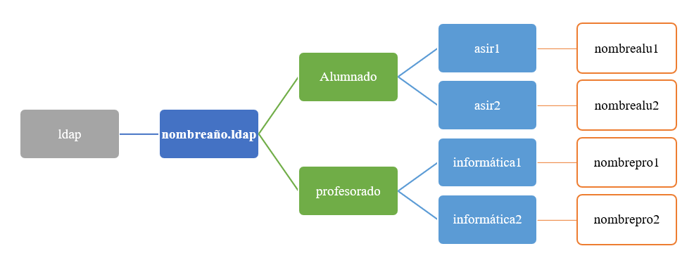

# 🧪 Supuesto Práctico UT01 *Servicio de directorio* { .card }

!!! info "OBJETIVOS"
    Diseñar, desplegar y documentar un servicio de directorio completo, aplicando todo el ciclo visto en el temario: instalación de un controlador de dominio, creación del esquema (OUs, usuarios, grupos), configuración de directivas de grupo (GPO), integración de un cliente Linux mediante los mecanismos de autenticación centralizada, y una segunda vía de despliegue basada en OpenLDAP/Samba4 sobre Linux. La práctica se estructura en **10 apartados obligatorios**, que en conjunto cubren los diez criterios de evaluación de la UT (a-j).

!!! info "RECURSOS"
    - Acceso a AWS Academy 
    - VMware con máquinas virtuales propias.
    - Una imagen de **Windows Server** (2025) para el controlador de dominio y un segundo Windows Server o Windows 10/11 como cliente.
    - Una imagen de **Ubuntu Server/Desktop 26** para Linux.
    - Cliente RDP (Escritorio remoto) y un cliente SSH (por ejemplo, Termius o el propio `ssh` de terminal).
    - Editor de texto en el cliente Linux para trabajar con ficheros LDIF (`vim` o similar).

## **Apartados**

!!! bug "Implementación de un Dominio Windows en AWS"

### 1. Creación y configuración de las instancias.

 Iniciar sesión en AWS y desplegar tres instancias EC2 de tipo **t2.micro**, configurando adecuadamente la red y generando un **grupo de seguridad** que permita acceso mediante **RDP** (puerto 3389) para las máquinas Windows y **SSH** para la máquina Ubuntu. Las instancias Windows deberán utilizar una AMI compatible con Windows Server, y la instancia Linux una AMI de Ubuntu 24.04.

1. **Windows Server** que actuará como controlador de dominio (`WSnombreDC`)
2. **Windows Server o Windows 10/11** que se unirá al dominio como cliente (`WDnombreCLI`)
3. **Ubuntu 24.04** que se integrará posteriormente (`UDnombre`)
  
Cada máquina debe crearse en la misma VPC, con subred adecuada y con conectividad mediante Internet Gateway para permitir la administración remota.

### 2.	Configuración del servidor Windows, *Dominio y DNS*
En la instancia `WSnombreDC`, instalar el rol **Servicios de dominio de Active Directory (AD DS)** y se promover a controlador de dominio. El dominio raíz tendrá el formato: `nombre.aws`. Tras la instalación, se comprobará mediante símbolo de sistema que el sistema pertenece al dominio. Además, deberá configurarse una zona de búsqueda inversa en el servidor DNS y verificarse su funcionamiento mostrando en una misma captura una resolución directa y otra inversa mediante nslookup.

- **Dos capturas**: Capturas del ipconfig /all y la captura de los dns inverso y directo

### 3.	Unión de la segunda instancia Windows al dominio
La instancia `WDnombreCLI` también debe configurarla para conectarse por RDP, deberá unirse al dominio creado previamente. Es necesario ajustar el **conjunto de opciones de DHCP** para que los equipos del dominio utilicen el DNS del controlador de dominio. La unión debe documentarse con capturas y explicación del procedimiento.

### 4.	Configuración de la instancia Ubuntu y acceso al dominio
En la instancia `UDnombre`, creada con Ubuntu 26, debe conectarse mediante Termius y proceder a agregarla al dominio Windows utilizando las herramientas adecuadas (realmd, sssd, etc.). Todos los pasos deberán documentarse con capturas claras y breves explicaciones.

### 5.	Automatización.
Crear un script PowerShell que incluya un menú con las siguientes opciones: 

!!! seccess "Menu"
    0 **Salir** del aplicativo

    1. Mostrar la **información del dominio** (nombre del equipo, nombre del dominio y número de OUs, grupos y usuarios)
    2.	Crear una **nueva Unidad Organizativ**a.
    4.	Crear un **nuevo grupo**.
    5.	Crear una **nueva cuenta de usuario** solicitando sus características, asignándolo a un grupo indicado por el usuario y obligando a cambiar la contraseña en el primer inicio de sesión.

En este apartado se ha de poner enlace del código comentado del script que estará en el repositorio de github del módulo y capturas de ejemplo de la ejecución de cada opción.

!!! bug "Implementación de un Dominio LDAP"

### 6.	Creación de la estructura LDAP mediante LDIF.
Crear mediante archivos `LDIF` la estructura base del dominio `nombre2026.ldap`. Esto incluye generar un árbol con dos **unidades organizativas** principales (Alumnado y Profesorado) y mostrar los archivos LDIF utilizando el editor de texto **vim**. 

Además, se deberán añadir cuatro **usuarios** genéricos (nombrealu1, nombrealu2, nombrepro1, nombrepro2), cada uno perteneciente a un **grupo** específico (asir1, asir2, informática1, informática2). Estos grupos deberán crearse mediante LDIF, asociando los grupos asir1 y asir2 a la OU de Alumnado, y los grupos informática1 e informática2 a la OU de Profesorado. Se mostrará el proceso completo, con comandos y capturas del editor.

 
 
### 7.	Automatización en LDAP mediante un script shell.
En este apartado se desarrollará un script llamado **nombreldap.sh** que incluya un menú interactivo con tres opciones:

!!! seccess "Menu"
    1.	**Eliminar** correo de un usuario del dominio.
    2.	**Modificar** el correo de un usuario, solicitando los datos e incluyendo el valor “prueba@nombre2026.ldap” en una de las pruebas.
    3.	Realizar **búsquedas**, permitiendo consultar un usuario concreto o mostrar un listado de todos los usuarios mostrando únicamente nombre y correo.

Una vez implementado, deberán realizarse pruebas obligatorias: listar todos los usuarios del dominio, eliminar el correo de nombrealu1, modificar el de nombrealu2, y volver a listar para comprobar los cambios.

### 8.	Dominio LDAP mediante interfaces web. 
El alumnado deberá instalar y configurar dos herramientas web de administración de dominios LDAP:

1. **phpLDAPadmin**, desde la cual deberá crearse el usuario `nombrephp` que pertenezca al grupo asir1, y mostrar el árbol de dominio.
2. **LDAP Account Manager (LAM)**, desde la cual deberá crearse el usuario `nombrelam` que pertenezca al grupo informática1, y mostrar el árbol de dominio.

### 9.	Integración de Ubuntu con LDAP para acceso en modo CLI y gráfico.
Se tendrán que realizar todas las configuraciones necesarias en una máquina Ubuntu Cliente para permitir que los usuarios del dominio LDAP puedan iniciar sesión tanto en modo CLI como en modo gráfico.

1.	Primero, deberá iniciarse sesión en modo consola, explicando qué terminal se ha utilizado y el motivo. 
2.	Posteriormente, se verificará el inicio de sesión en modo gráfico creando un archivo dentro del directorio personal del usuario del dominio, comprobando así que el home se crea correctamente y que la autenticación LDAP funciona en ambos entornos.

!!! bug "Implementación de un Dominio Samba en Ubuntu"

### 10.	Controlador de Dominio con Samba y unión de un Windows.
Configurar un servidor Ubuntu como Controlador de Dominio Samba:

!!! info "Datos personalizados"
      - Nombre del controlador: nombre-dc-smb
      - Dominio DNS : nombre26.sistemas
      - Reino Kerberos: nombre26.sistemas
      - Nombre NetBIOS: nombre
      - IP estática: 172.16.2xx.100
      - Reenviador DNS: 172.16.2xx.1
      - Rol: DomainController
  
Una vez instalado Samba y configurado el dominio, deben realizarse comprobaciones completas del funcionamiento del controlador. 

Posteriormente, se añadirá un Windows 11 llamado `nombrewin11` al dominio Samba, verificando en ambos lados (cliente y servidor) que aparece correctamente unido y realizando un inicio de sesión en Windows con un usuario del dominio Samba. (Mismas capturas que en la presentación)

!!! example "ENTREGABLES"
    - En caso de no indicar lo contrario cada apartado tendrá el mismo valor.
    - Para una calificación correcta se han de seguir las instrucciones del documento: “**Pautas del curso**”, que se encuentra en el apartado de recurso del Campus.
    - Entregar un documento **“pdf”** a través del Campus. El nombre del archivo debe ser: “**Apellido1Apellido2Nombre_SPXX**”

