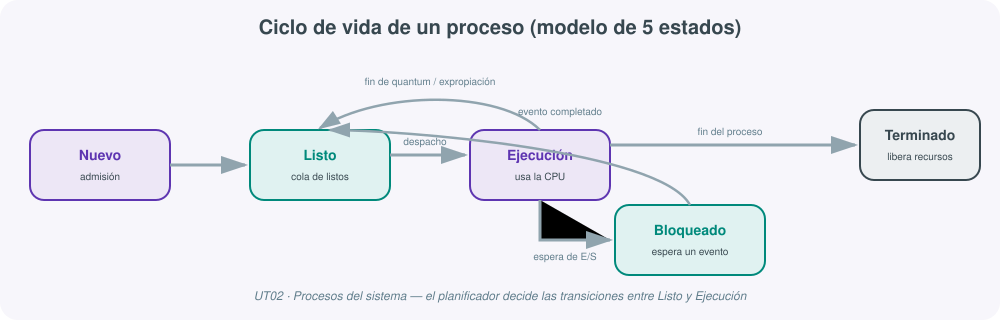
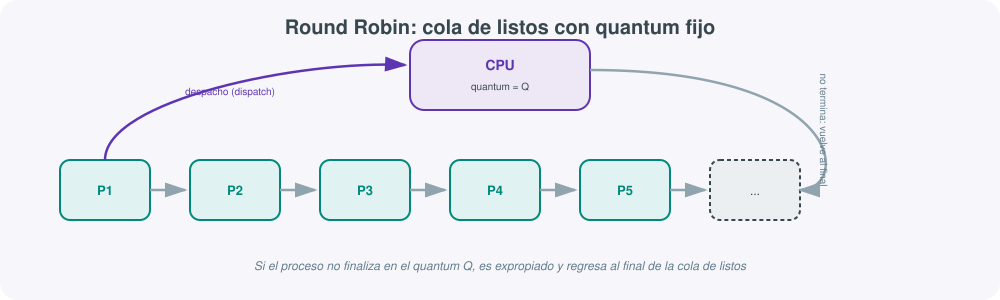

# **⚙️ UT02 · Procesos del sistema**



## Resultado de aprendizaje y criterios de evaluación

**RA2.** Administra procesos del sistema describiéndolos y aplicando criterios de seguridad y eficiencia.

Criterios de evaluación:

a) Se han descrito el concepto de proceso del sistema, tipos, estados y ciclo de vida.
b) Se han utilizado interrupciones y excepciones para describir los eventos internos del procesador.
c) Se ha diferenciado entre proceso, hilo y trabajo.
d) Se han realizado tareas de creación, manipulación y terminación de procesos.
e) Se ha utilizado el sistema de archivos como medio lógico para el registro e identificación de los procesos del sistema.
f) Se han utilizado herramientas gráficas y comandos para el control y seguimiento de los procesos del sistema.
g) Se ha comprobado la secuencia de arranque del sistema, los procesos implicados y la relación entre ellos.
h) Se han tomado medidas de seguridad ante la aparición de procesos no identificados.
i) Se han documentado los procesos habituales del sistema, su función y relación entre ellos.

## 1. Qué es un proceso y por qué el sistema operativo lo necesita

Un **proceso** es un programa en ejecución, junto con todo lo que necesita para llevar a cabo su tarea: tiempo de CPU, un espacio de memoria propio, archivos abiertos y acceso a dispositivos de entrada/salida. La distinción entre "programa" y "proceso" es la primera idea que hay que fijar (criterio a): un programa es un fichero pasivo en disco (código y datos); un proceso es ese mismo programa cargado en memoria, con un estado, un contador de programa y unos recursos asignados por el sistema operativo. Un mismo programa puede dar lugar a varios procesos simultáneos —por ejemplo, dos ventanas de un editor de texto abiertas a la vez— cada uno con su propio espacio de memoria y su propio ciclo de vida.

El sistema operativo administra cuatro grandes bloques de recursos: procesos, memoria, ficheros y dispositivos de E/S (a través de sus controladores o *drivers*). Respecto a los procesos en concreto, sus responsabilidades son:

- **Creación y terminación**: asignar los recursos iniciales, establecer el contexto de ejecución y, al finalizar, liberar todo lo que el proceso tenía reservado.
- **Asignación de recursos**: repartir CPU, memoria y dispositivos de forma equitativa y eficiente entre todos los procesos activos.
- **Gestión de estados** y **cambios de contexto**, para que varios procesos puedan compartir una misma CPU sin interferirse.
- **Planificación**: decidir qué proceso se ejecuta a continuación y durante cuánto tiempo.
- **Gestión de prioridades**, tratamiento de interrupciones y excepciones, sincronización y comunicación entre procesos, y protección y seguridad frente a accesos indebidos.

!!! note "Servicio y demonio: procesos sin interacción directa"
    Un **servicio** (en GNU/Linux, **demonio** o *daemon*) es un proceso que se ejecuta en segundo plano de forma continua, normalmente arrancado de forma automática con el sistema, sin que el usuario interactúe con él directamente. Ejemplos habituales: `sshd` (conexiones SSH remotas), `httpd`/`nginx` (servidor web) o `cron`/`systemd-timer` (tareas programadas). Todo servicio es un proceso, pero no todo proceso es un servicio.

### Tipos de procesos

Según su relación con el usuario y con el propio sistema, un proceso puede clasificarse en varias categorías, no necesariamente excluyentes:

| Tipo | Descripción |
|---|---|
| Primer plano (*foreground*) | Ocupa la terminal o recibe entrada directa del usuario hasta que termina. |
| Segundo plano (*background*) | Se ejecuta sin bloquear la interacción del usuario con el resto del sistema. |
| De sistema | Forma parte del propio sistema operativo (gestión de memoria, planificador, etc.). |
| Interactivo | Espera y responde a la entrada de un usuario (una terminal, un editor). |
| Por lotes (*batch*) | Se ejecuta sin intervención humana, procesando un conjunto de trabajos ya preparado. |
| Huérfano | Su proceso padre ha terminado, pero el proceso hijo sigue en ejecución (en Linux es adoptado por `init`/`systemd`, PID 1). |
| Zombi | Ha terminado su ejecución, pero mantiene una entrada en la tabla de procesos porque el padre todavía no ha recogido su código de salida. |

## 2. Interrupciones, excepciones y el bloque de control de proceso

El criterio (b) exige describir los eventos internos del procesador que permiten a un sistema multitarea reaccionar a lo que ocurre a su alrededor sin tener que estar constantemente "preguntando" a cada dispositivo si tiene algo pendiente (una técnica ineficiente conocida como *polling*).

Una **interrupción** es un evento que desvía temporalmente la ejecución normal de la CPU para atender una tarea más urgente. Puede originarse:

- **A nivel de hardware**: un dispositivo (teclado, disco, tarjeta de red) necesita atención inmediata de la CPU.
- **A nivel de software**: un proceso realiza una llamada al sistema (*system call*) para solicitar un servicio del núcleo, como abrir un fichero o reservar memoria.

Una **excepción** es un tipo particular de interrupción, generada por la propia CPU a causa de un error del proceso en ejecución: una instrucción no permitida, una división por cero o un acceso a una dirección de memoria fuera de rango. A diferencia de una interrupción de hardware, la excepción está directamente causada por el código que se está ejecutando en ese instante.

!!! example "Del teclado a la pantalla, en un abrir y cerrar de interrupción"
    Cuando el usuario pulsa una tecla, el controlador de teclado genera una interrupción hardware. La CPU suspende momentáneamente el proceso en ejecución, salta a la rutina de tratamiento de esa interrupción (guardada en la tabla de vectores de interrupción), procesa el carácter recibido y, terminada la rutina, retoma exactamente donde lo había dejado el proceso interrumpido. Todo esto ocurre en microsegundos y de forma transparente para el usuario.

### El bloque de control de proceso (BCP)

Para poder suspender y reanudar procesos sin perder información, el sistema operativo mantiene, por cada proceso, un **bloque de control de proceso (BCP)**: la estructura de datos que almacena su PID, su estado actual, el valor de sus registros de CPU, su prioridad, los punteros a memoria asignada, la lista de ficheros abiertos y demás información necesaria para administrarlo. El BCP es lo que hace posible que un sistema operativo gestione decenas o cientos de procesos de forma concurrente sin confundir el contexto de unos con el de otros.

## 3. Proceso, hilo y trabajo: tres unidades distintas de ejecución

El criterio (c) pide diferenciar tres conceptos que suelen confundirse:

| Concepto | Qué es | Comparte con otros | Ejemplo |
|---|---|---|---|
| **Proceso** | Programa en ejecución con su propio espacio de memoria aislado | Nada por defecto: cada proceso tiene su memoria propia | Un navegador abierto |
| **Hilo (*thread*)** | Subunidad de ejecución dentro de un proceso | Memoria, ficheros abiertos y recursos del proceso al que pertenece | Cada pestaña de Chrome puede ejecutarse como un hilo/proceso independiente |
| **Trabajo (*job*)** | Unidad de trabajo por lotes, formada por uno o varios procesos, sin interacción con el usuario | — | Un script de cierre contable nocturno |

Un **hilo** mantiene su propio contador de programa y su propia pila de ejecución, pero comparte con el resto de hilos del mismo proceso el espacio de memoria, los descriptores de fichero y otros recursos. Esto hace que crear un hilo y cambiar de un hilo a otro sea considerablemente más barato, en tiempo de CPU, que crear un proceso completo o cambiar de un proceso a otro.

**Concurrencia frente a paralelismo.** La concurrencia es la capacidad de un sistema para gestionar varias tareas a la vez, intercalando su ejecución mediante planificación y cambios de contexto, sin que necesariamente se ejecuten de forma simultánea. El paralelismo, en cambio, implica ejecutar realmente varias tareas al mismo tiempo, aprovechando distintos núcleos o procesadores físicos. Un servidor web típico combina ambas técnicas: concurrencia para atender miles de peticiones que llegan casi a la vez, y paralelismo para procesar varias de ellas simultáneamente en distintos núcleos.

Para coordinar esa concurrencia sin que los procesos o hilos interfieran entre sí, el sistema operativo ofrece varios mecanismos:

- **Exclusión mutua**: garantiza que solo un proceso o hilo accede a un recurso compartido (la llamada *sección crítica*) en un instante dado.
- **Sincronización**: semáforos, mutex y monitores, que evitan condiciones de carrera cuando varios procesos comparten un mismo recurso.
- **Comunicación entre procesos (IPC)**: paso de mensajes, tuberías (*pipes*) y sockets, para que procesos distintos puedan intercambiar información de forma controlada.

## 4. Estados y ciclo de vida de un proceso

El criterio (a) pide describir explícitamente los estados y el ciclo de vida de un proceso. Existen varios modelos, según el nivel de detalle que se necesite:

| Modelo | Estados que añade |
|---|---|
| 2 estados | No-ejecutado / Ejecución |
| 3 estados | Se separa "no-ejecutado" en Preparado y Bloqueado (a la espera de un suceso) |
| **5 estados** | Se añaden Nuevo (alta) y Terminado (baja) — el modelo de referencia de esta unidad |
| 7 estados | Se añaden Suspendido-bloqueado y Suspendido-preparado, en memoria secundaria, para liberar RAM (con el coste de la operación de intercambio o *swap*) |

El modelo de **5 estados**, el más habitual como referencia docente, define:

- **Nuevo**: el proceso se está creando; todavía no ha sido admitido por el planificador.
- **Listo**: tiene todos los recursos que necesita salvo la CPU, y compite por ella en la cola de listos.
- **Ejecución**: está usando activamente la CPU en ese instante.
- **Bloqueado**: espera un evento externo (por ejemplo, el resultado de una operación de E/S) y no puede avanzar aunque se le asignara la CPU.
- **Terminado**: ha finalizado su ejecución y libera los recursos que tenía reservados.

Las transiciones entre estos estados no son libres: solo puede pasarse de Listo a Ejecución (mediante el **despacho** del planificador) y de Ejecución a Listo (por expropiación o fin de quantum), de Ejecución a Bloqueado (al solicitar un recurso que no está disponible de inmediato) y de Bloqueado a Listo (cuando el evento esperado ocurre) — nunca directamente de Bloqueado a Ejecución.


### El cambio de contexto

El **cambio de contexto** es el mecanismo por el cual el sistema operativo suspende el proceso que está en ejecución (pasándolo a Listo o a Bloqueado) para que otro proceso pueda continuar. Implica, en orden: guardar el estado del proceso saliente en su BCP, seleccionar el siguiente proceso según el algoritmo de planificación, restaurar el estado guardado de ese proceso, actualizar las estructuras internas del sistema y, finalmente, reanudar su ejecución. Un cambio de contexto no es gratuito: consume ciclos de CPU que no se dedican a ningún proceso de usuario, de ahí que un planificador demasiado agresivo (cambios de contexto muy frecuentes) pueda perjudicar el rendimiento global del sistema.

## 5. Planificación de procesos y algoritmos

El **planificador** (*scheduler*) decide qué proceso accede a la CPU y durante cuánto tiempo, siguiendo una de estas dos políticas:

- **No expropiativa** (*non-preemptive*): el proceso mantiene la CPU hasta que la libera voluntariamente (termina o pasa a espera de E/S).
- **Expropiativa** (*preemptive*): el sistema operativo puede retirarle la CPU en cualquier momento, típicamente al agotarse un *quantum* de tiempo o al llegar un proceso de mayor prioridad.

| Algoritmo | Tipo | Idea principal | Limitación |
|---|---|---|---|
| **FCFS** (First Come First Served) | No expropiativo | Se ejecutan en el orden de llegada | Un proceso largo bloquea a todos los que llegan después (*efecto convoy*) |
| **SJF** (Shortest Job First) | No expropiativo | Primero el proceso con menor tiempo de ejecución estimado | No adecuado para sistemas interactivos; requiere estimar la duración de antemano |
| **SRT** (Shortest Remaining Time) | Expropiativo | Variante de SJF: siempre se ejecuta el de menor tiempo restante | Puede provocar inanición de procesos largos |
| **Prioridad** | Ambas variantes | Se ejecuta primero el proceso de mayor prioridad (FCFS como desempate) | Riesgo de inanición de procesos de baja prioridad si no hay envejecimiento |
| **RR** (Round Robin) | Expropiativo | A cada proceso se le asigna un *quantum* fijo; si no termina, vuelve al final de la cola | Un quantum mal elegido (muy corto o muy largo) degrada el rendimiento |
| **Colas multinivel** | Combinado | Varias colas con políticas distintas, para tratar de forma diferenciada procesos interactivos, por lotes o de tiempo real | Mayor complejidad de implementación y ajuste |



!!! tip "Cómo abordar un ejercicio de planificación"
    Ante una tabla de procesos con llegada, prioridad y ráfaga de CPU, dibuja siempre un diagrama de Gantt junto con la evolución de la cola de listos en cada instante relevante. En los algoritmos expropiativos (SRT, prioridad expropiativa, RR), presta especial atención al instante exacto de llegada de un nuevo proceso: puede desplazar al que está en ejecución antes de que termine su ráfaga o su quantum.

Windows, las distribuciones GNU/Linux y Android implementan variantes propias de estos algoritmos clásicos combinadas con colas multinivel y prioridades dinámicas (el planificador de Linux, por ejemplo, usa el llamado *Completely Fair Scheduler* o su sucesor EEVDF en núcleos recientes, que reparte el tiempo de CPU tratando de dar a cada proceso una fracción "justa" según su peso/prioridad).

## 6. Secuencia de arranque del sistema

El criterio (g) exige comprobar la secuencia de arranque y los procesos implicados. Desde que se enciende el equipo hasta que aparece el entorno de usuario, ocurren, en orden:

1. **Encendido y POST** (*Power-On Self-Test*): la BIOS o UEFI comprueba que el hardware básico (CPU, memoria, disco) funciona correctamente.
2. **Carga del cargador de arranque**: `bootmgr` en Windows, `GRUB` en la mayoría de distribuciones GNU/Linux; localiza y carga el núcleo del sistema operativo.
3. **Inicialización del núcleo**: `ntoskrnl.exe` en Windows, el kernel Linux en sistemas GNU/Linux; se cargan los módulos y controladores necesarios para reconocer el hardware disponible.
4. **Inicialización de servicios y procesos esenciales**: en Windows arranca `services.exe` (Service Control Manager); en GNU/Linux arranca el **PID 1** (`systemd` en la mayoría de distribuciones actuales), que a su vez lanza el resto de servicios según sus dependencias.
5. **Arranque del entorno de usuario**: gestor de sesión gráfico o consola de acceso, programas de inicio, servicios de red — el sistema queda listo para el usuario.

!!! note "PID 0 y PID 1 en GNU/Linux"
    El **PID 0** corresponde al proceso `idle`/`swapper`, el primero que crea el propio núcleo durante el arranque para ocupar los ciclos de CPU libres; no aparece en la salida de `ps` ni de `top`. El **PID 1** es **systemd** (o `init` en sistemas más antiguos), el primer proceso de espacio de usuario tras la inicialización del kernel: es responsable de arrancar y supervisar todos los demás procesos, y actúa como padre adoptivo de cualquier proceso huérfano.

**systemd** es, en la mayoría de distribuciones modernas, el sistema de inicio y gestor de servicios por defecto. Entre sus características destacan el arranque paralelo de servicios, la gestión unificada mediante `systemctl`, el control de recursos mediante **cgroups**, el registro centralizado con **journald** y el soporte de dependencias explícitas entre unidades.

| Componente de systemd | Función |
|---|---|
| `systemctl` | Iniciar, detener, reiniciar, habilitar y deshabilitar servicios |
| `cgroups` | Agrupar procesos y limitar sus recursos (CPU, memoria, disco) |
| `tmpfiles.d` | Gestionar archivos temporales (limpieza de `/tmp`, permisos, rutas) |
| Unidades (*units*) | Ficheros de configuración en `/etc/systemd/system/`: `.service`, `.socket`, `.mount`, `.timer` |
| `journald` | Almacenar y consultar los logs del sistema (sustituye a `syslog` clásico) |
| `logind` | Gestionar sesiones de usuario: inicio de sesión, suspensión, hibernación, bloqueo de pantalla |

## 7. El sistema de archivos como registro de procesos

El criterio (e) pide utilizar el sistema de archivos como medio lógico para el registro e identificación de procesos. En GNU/Linux esto es literal: el sistema de archivos virtual `/proc` expone, en tiempo real, un directorio numerado por PID (`/proc/1234/`) con información detallada de cada proceso (línea de comandos, estado, mapa de memoria, ficheros abiertos), que es precisamente la fuente de datos que consultan comandos como `ps` o `top`. En Windows, ese "registro" equivalente se materializa en los ficheros de log de servicios y en el propio Visor de eventos, además de la información que expone el Administrador de tareas.

Para consultar el historial y el comportamiento de servicios ya en ejecución, GNU/Linux centraliza los registros con **journald**, que sustituye al tradicional `syslog` y clasifica cada mensaje en siete niveles de prioridad:

| Nivel | N.º | Significado |
|---|---|---|
| `emerg` | 0 | Sistema inutilizable |
| `alert` | 1 | Acción requerida de inmediato |
| `crit` | 2 | Condición crítica |
| `err` | 3 | Condición de error |
| `warning` | 4 | Advertencia |
| `notice` | 5 | Condición normal pero significativa |
| `info` | 6 | Mensaje informativo |
| `debug` | 7 | Mensaje de depuración |

```bash
journalctl                    # todos los logs del sistema
journalctl -u nginx.service   # logs de una unidad concreta
journalctl -f                 # en tiempo real (follow)
journalctl -b                 # desde el último arranque
journalctl --since "2026-01-01 00:00:00"
journalctl --until "2026-12-31 23:59:59"
journalctl -p err             # filtra por nivel de prioridad
```

## 8. Gestión de procesos en Windows: herramientas gráficas y línea de comandos

El criterio (f) exige usar tanto herramientas gráficas como comandos para el control y seguimiento de procesos. En Windows, la vía gráfica principal es el **Administrador de tareas** (clic derecho en la barra de tareas, o `Ctrl + Shift + Esc`), organizado en las pestañas Procesos, Rendimiento, Historial de aplicaciones, Inicio, Usuarios, Detalles y Servicios.


Desde el símbolo del sistema clásico:

```powershell
tasklist                          # lista los procesos con su PID
tasklist /SVC                     # muestra los servicios asociados a cada proceso
tasklist /FI "username eq john"   # filtra por una condición
tasklist /V                       # información ampliada

taskkill /pid 1234           # elimina el proceso con PID 1234
taskkill /im firefox.exe     # cierre "ordenado" por nombre
taskkill /im firefox.exe /f  # terminación inmediata y forzosa
```

Y en PowerShell, la herramienta de administración recomendada hoy en día en cualquier entorno Windows Server:

```powershell
Get-Process | more          # salida paginada
Get-Process -Name fi*       # filtra por nombre que empiece por "fi"

Stop-Process -id 1234              # detiene por PID
Stop-Process -name fi*             # detiene por nombre
Stop-Process -id 1234 -Confirm     # pidiendo confirmación

Get-Help <cmdlet> -Detailed   # ayuda detallada
Get-Help <cmdlet> -Examples   # solo ejemplos
Get-Help <cmdlet> -Full       # ayuda completa
Get-Help <cmdlet> -Online     # documentación en línea
```

Los cmdlets principales para procesos son `Get-Process`, `Start-Process`, `Stop-Process`, `Wait-Process` y `Debug-Process`; para servicios, `Get-Service`, `New-Service`, `Start-Service`, `Stop-Service`, `Restart-Service`, `Suspend-Service`, `Resume-Service` y `Set-Service`.


## 9. Gestión de procesos en GNU/Linux: `ps`, `top`, `htop` y señales

En GNU/Linux, todo lo que se ejecuta es un proceso: por ejemplo, `ls -l | more` lanza en realidad dos procesos encadenados (`ls` y `more`). El sistema es multiusuario y multitarea, y concede los recursos hardware a cada proceso según la planificación vigente. Cada proceso queda identificado por su **PID** (identificador único) y su **PPID** (identificador del proceso padre), y mantiene su propio espacio de memoria (código, datos y pila) y su propio estado.

La vía gráfica equivalente al Administrador de tareas de Windows es, en GNOME, el **Monitor del sistema** (pestañas Procesos, Recursos y Archivos), y en KDE, **KSysGuard**. La vía de comandos ofrece herramientas más potentes para la administración diaria: `ps`, `pstree`, `top`, `htop` y `pgrep`.

```bash
ps -a          # procesos asociados a una terminal
ps -x          # procesos no controlados por ninguna terminal
ps -e          # todos los procesos del sistema
ps -f          # salida detallada (usuario, terminal, etc.)
ps -l          # información completa de la tabla de procesos
ps -u usuario  # procesos de un usuario concreto
ps -r          # solo procesos en ejecución
```

Columnas habituales de `ps`: **S** (estado), **UID** (propietario), **PID**, **PPID**, **C** (% CPU), **PRI** (prioridad), **NI** (nice), **TTY** (terminal asociada, `?` si no tiene), **TIME** (tiempo de CPU) y **CMD** (comando ejecutado).

```bash
pstree -c        # no compacta subárboles idénticos
pstree -g        # muestra ids de grupos de procesos (implica -c)
pstree -n        # ordena por PID
pstree -p        # muestra el PID junto al nombre
pstree -s PID    # muestra los procesos padres del PID indicado
```


`top` es un monitor interactivo en tiempo real (`-d` ritmo de refresco, `-u usuario`, `-o columna` para ordenar); dentro de `top`, la tecla `h` muestra ayuda, `k` envía una señal a un proceso y `r` cambia su prioridad. `htop` ofrece la misma información con una interfaz más amigable: `F2` configura columnas, `F3`/`F4` filtran, `F5` cambia a vista en árbol, `F7`/`F8` cambian la prioridad y `F9` envía señales. `pgrep` busca procesos por nombre u otros atributos (`-c` cuenta coincidencias, `-n` selecciona el más reciente, `-u usuario` filtra por propietario).

### Primer y segundo plano

Un proceso en **primer plano (*foreground*)** ocupa la terminal hasta que termina; uno en **segundo plano (*background*)** se lanza añadiendo `&` al final del comando, liberando la terminal para seguir trabajando.

```bash
jobs -l    # trabajos en segundo plano + PID
jobs -p    # solo el PID
jobs -r    # trabajos en ejecución
jobs -s    # trabajos detenidos
```

El signo `+` marca el trabajo más reciente movido a segundo plano; el signo `-`, el segundo más reciente. `Ctrl+Z` pausa un proceso en primer plano y lo pasa a segundo plano (detenido); `bg` lo reanuda en segundo plano; `fg` (o `fg +`, `fg %+`) lo recupera a primer plano.

### Señales

Las **señales** son el mecanismo estándar para comunicar eventos o solicitudes a procesos en ejecución.

| Señal | N.º | Significado |
|---|---|---|
| `SIGHUP` | 1 | Cuelgue (*hang up*) |
| `SIGINT` | 2 | Interrupción (`Ctrl+C`) |
| `SIGKILL` | 9 | Terminación forzada, no puede ser ignorada ni gestionada |
| `SIGTERM` | 15 | Finalización suave (señal por defecto de `kill`) |
| `SIGCONT` | 18 | Continuar tras una detención (`Ctrl+Z`) |
| `SIGSTOP` | 19 | Detención forzada, no puede ser gestionada |
| `SIGTSTP` | 20 | Detener (`Ctrl+Z`) |

```bash
kill -l           # lista las señales del sistema
kill -NÚMERO PID  # envía la señal indicada
killall -i cmd         # confirmación interactiva antes de matar
killall -u usuario cmd  # solo procesos de ese usuario
killall -w cmd          # espera a que todos los procesos mueran
```

!!! warning "SIGTERM antes que SIGKILL"
    `SIGTERM` permite que el propio proceso termine de forma controlada, cerrando ficheros y liberando recursos correctamente; es la opción por defecto de `kill` y la que debería probarse siempre primero. `SIGKILL` fuerza la terminación inmediata sin dar opción al proceso a reaccionar, con riesgo de corrupción de datos o ficheros a medio escribir, y debe reservarse para procesos que no responden a ningún otro intento. Antes de recurrir a `SIGKILL`, comprueba con `ps` que el proceso realmente sigue vivo tras el `SIGTERM`.

### Prioridad: `nice` y `renice`

El planificador del núcleo (*kernel scheduler*) ordena los procesos según su prioridad para decidir cuál se ejecuta a continuación. Dos columnas relacionadas, pero distintas:

- **NI (*nice value*)**: rango de −20 a +19; valores negativos indican mayor prioridad, positivos menor prioridad. Un usuario sin privilegios solo puede mover este valor entre 0 y 19 (bajar su propia prioridad); asignar valores negativos exige privilegios de administrador (root).
- **PRI (*priority*)**: rango de 0 a 139, donde los valores más bajos indican mayor prioridad; lo calcula el planificador del núcleo a partir del nice y de otros factores, y no se ajusta directamente por el usuario.

```bash
nice comando                  # ejecuta con prioridad 10 por defecto
nice -n 5 comando             # especifica otra prioridad
renice -u usuario NUEVO_NICE  # cambia el nice a todos los procesos de un usuario
renice -p PID NUEVO_NICE      # cambia el nice de un PID concreto (por defecto)
```

## 10. Estados de un proceso en GNU/Linux y terminología asociada

Además del modelo teórico de cinco estados, en la práctica administrativa de GNU/Linux se manejan estos términos:

| Estado | Significado |
|---|---|
| Pausado | Detenido temporalmente pero en memoria, reanudable (por ejemplo, con `Ctrl+Z`) |
| Detenido | Interrumpido, habitual durante depuración |
| Suspendido | Movido a memoria secundaria (swap) para liberar RAM |
| Parado | Sinónimo genérico de pausado/detenido |
| Terminado/finalizado | Ha concluido su ejecución y liberado sus recursos |

## 11. Seguridad ante procesos no identificados

El criterio (h) exige tomar medidas de seguridad ante la aparición de procesos no identificados: un proceso desconocido, con un nombre que imita a otro legítimo (*typosquatting* de procesos, como `scvhost.exe` en lugar de `svchost.exe`), con un consumo anómalo de CPU o red, o ejecutándose desde una ruta poco habitual, es uno de los primeros indicios de una posible infección o intrusión.

!!! warning "Checklist ante un proceso sospechoso"
    1. **Identifica el proceso**: nombre exacto, PID, PPID, usuario que lo ejecuta y ruta completa del ejecutable (`Get-Process | Select-Object Path` en PowerShell; `ls -l /proc/PID/exe` en Linux).
    2. **Verifica su origen**: ¿está firmado digitalmente? ¿el fabricante es reconocible? ¿la ruta es la habitual del sistema o una carpeta temporal poco frecuente?
    3. **Comprueba su consumo**: un uso anómalo y sostenido de CPU, red o disco es una señal de alerta, especialmente en procesos que deberían estar inactivos.
    4. **Consulta su relación de parentesco**: un proceso hijo de `explorer.exe` o de un navegador que no debería lanzar procesos de red es sospechoso.
    5. **No lo termines a ciegas** antes de documentarlo: capturas, hash del ejecutable y registro del incidente, para poder analizarlo o escalarlo si es necesario.
    6. Ante la duda, aísla el equipo de la red antes de seguir investigando.

Esta misma prudencia se aplica a los procesos huérfanos y zombis: no son, en sí mismos, un problema de seguridad, pero un número creciente y anómalo de procesos zombis puede indicar un fallo de programación grave (un proceso padre que nunca llama a `wait()`), y conviene documentarlo igual que cualquier otro comportamiento anómalo del sistema.

## 12. Documentación de procesos habituales del sistema

El criterio (i) pide documentar los procesos habituales del sistema, su función y su relación entre ellos. Una buena práctica de administración —tanto en Windows como en GNU/Linux— es mantener un pequeño catálogo de referencia de los procesos y servicios que se consideran "normales" en cada máquina, de forma que cualquier desviación resulte fácil de detectar.

| Proceso / servicio | Sistema | Función |
|---|---|---|
| `systemd` (PID 1) | GNU/Linux | Primer proceso de usuario; arranca y supervisa el resto de servicios |
| `sshd` | GNU/Linux | Servidor de conexiones remotas seguras (SSH) |
| `cron` / `systemd-timer` | GNU/Linux | Ejecución de tareas programadas |
| `journald` | GNU/Linux | Registro centralizado de logs del sistema |
| `services.exe` | Windows | Service Control Manager: arranca y supervisa los servicios de Windows |
| `svchost.exe` | Windows | Proceso contenedor genérico de servicios del sistema (varias instancias simultáneas) |
| `explorer.exe` | Windows | Shell gráfico del escritorio |
| `wininit.exe` | Windows | Inicializa procesos de sistema tras el arranque del núcleo |

## 13. Glosario rápido de la unidad

- **Proceso**: programa en ejecución con su propio contexto y recursos asignados.
- **Hilo**: unidad de ejecución dentro de un proceso, que comparte memoria y recursos con sus hilos hermanos.
- **BCP**: bloque de control de proceso; estructura de datos con toda la información de un proceso.
- **Interrupción / excepción**: evento hardware o software que desvía la ejecución normal de la CPU; la excepción está causada por un error del propio proceso.
- **Cambio de contexto**: guardar el estado de un proceso saliente y restaurar el de otro entrante.
- **Quantum**: intervalo fijo de tiempo de CPU asignado en el algoritmo Round Robin.
- **Nice / PRI**: valor ajustable por el usuario (nice) y valor final calculado por el planificador (PRI) que determinan la prioridad de un proceso en GNU/Linux.
- **Demonio / servicio**: proceso en segundo plano sin interacción directa con el usuario.
- **Proceso huérfano / zombi**: proceso cuyo padre ha terminado (huérfano) o proceso terminado cuyo padre no ha recogido su estado de salida (zombi).

## 14. Autoevaluación rápida

1. Explica la diferencia entre un programa y un proceso, y entre un proceso y un hilo. (apartados 1 y 3)
2. ¿Qué diferencia hay entre una interrupción y una excepción? Pon un ejemplo de cada una. (apartado 2)
3. Dibuja el diagrama de los 5 estados de un proceso e indica qué evento provoca cada transición. (apartado 4)
4. Compara FCFS, SJF, RR y prioridad expropiativa: ¿cuál elegirías para un sistema interactivo y por qué? (apartado 5)
5. Enumera, en orden, las fases de la secuencia de arranque de un sistema GNU/Linux con systemd. (apartado 6)
6. ¿Qué comandos usarías en PowerShell y en Bash para localizar el proceso que más CPU consume y terminarlo de forma segura? (apartados 8 y 9)
7. Describe tres señales de alarma que te harían sospechar de un proceso no identificado y qué harías ante ellas. (apartado 11)

## Para profundizar

Esta unidad se ha construido a partir del material de clase de Administración de Sistemas Operativos, con los apuntes ya recopilados en [Procesos del sistema](02-procesos-sistema.md), donde se conservan las actividades, la práctica de aula, la recuperación y la solución de referencia con capturas de PowerShell y terminal GNU/Linux. El resto de enlaces de referencia del módulo está recopilado en la página de [Recursos](99-recursos.md).

##
##
# **⚙️ UT02 · Procesos del sistema**

RA2. Gestiona los procesos del sistema, aplicando criterios de eficiencia y utilizando comandos y herramientas gráficas. Criterios de evaluación:

- Se han identificado los procesos y servicios del sistema.
- Se han utilizado comandos y herramientas gráficas para la gestión de procesos.
- Se han descrito los estados de un proceso y la planificación de procesos.
- Se han utilizado los comandos para cambiar la prioridad de un proceso.
- Se ha comprobado el funcionamiento de un proceso mediante los ficheros de registro correspondientes.
- Se han detectado procesos problemáticos, en base a un consumo excesivo de recursos.

## Teoría

### Gestión de procesos en Windows

Un **proceso** es un programa en ejecución que necesita una serie de recursos para realizar su tarea: tiempo de CPU, memoria, archivos y dispositivos de E/S. Un **servicio**, en cambio, es un programa que se ejecuta en segundo plano de manera continua, sin interacción directa con el usuario, y que normalmente se inicia automáticamente al arrancar el sistema (por ejemplo, un servidor web o de impresión).

Los componentes básicos que gestiona un sistema operativo son la gestión de procesos, de memoria, de ficheros y de los dispositivos de entrada/salida (drivers). Respecto a los procesos, el sistema operativo se encarga de:

- **Creación y terminación**: asignar recursos, establecer el contexto inicial y liberar recursos al finalizar.
- **Asignación de recursos**: CPU, memoria y dispositivos, de forma equitativa y eficiente.
- **Gestión de estados** y **cambios de contexto** entre procesos.
- **Planificación**: decidir qué proceso se ejecuta a continuación y durante cuánto tiempo.
- **Gestión de prioridades**, manejo de **interrupciones** y **excepciones**, sincronización/comunicación entre procesos y protección y seguridad.

Una **interrupción** es un evento que desvía temporalmente la ejecución normal de un programa para atender una tarea más urgente (a nivel de hardware, cuando un dispositivo requiere atención de la CPU; a nivel de software, cuando se realiza una llamada al sistema). Una **excepción** es un tipo de interrupción provocada por la propia CPU a causa de un error en el proceso activo (operación no permitida, dirección de memoria fuera de rango, etc.).

Según su relación con el usuario y el sistema, los procesos pueden clasificarse en: primer plano (foreground), segundo plano (background), de sistema, interactivos, en lote, huérfanos (su padre ha terminado pero el hijo sigue en ejecución) y zombis (han terminado pero mantienen una entrada en la tabla de procesos porque el padre no ha recogido su estado de salida).

El **bloque de control de proceso (BCP)** es la estructura de datos que el sistema operativo usa para mantener y gestionar toda la información relativa a un proceso en ejecución, lo que permite administrar múltiples procesos en un entorno multitarea.

Los términos "servicio" y "demonio" se usan a menudo indistintamente para procesos en segundo plano sin interacción con el usuario. Ejemplos de demonios: `sshd` (conexiones SSH), `httpd` (servidor web) o `cron` (tareas programadas).

**Concurrencia y paralelismo**. La concurrencia es la capacidad de un sistema para gestionar múltiples tareas a la vez, intercalando su ejecución, sin que necesariamente se ejecuten de forma simultánea (se logra mediante planificación y cambio de contexto). El paralelismo, en cambio, implica la ejecución realmente simultánea de varias tareas aprovechando múltiples núcleos o procesadores. Un servidor web típico combina ambas técnicas: concurrencia para atender miles de solicitudes y paralelismo para procesar varias de ellas a la vez en distintos núcleos.

Mecanismos para gestionar la concurrencia:

- **Hilos**: subprocesos que comparten los recursos del proceso pero mantienen su propio contador de programa y pila; su creación y cambio de contexto son más rápidos que los de un proceso completo.
- **Exclusión mutua**: garantiza que solo un proceso o hilo acceda a un recurso compartido (sección crítica) en un momento dado.
- **Sincronización**: semáforos, mutex y monitores para evitar condiciones de carrera al compartir recursos.
- **Comunicación entre procesos**: paso de mensajes, tubos (pipes) y sockets.

**Estados de un proceso**. Existen distintos modelos según el nivel de detalle:

- *2 estados*: no-ejecutado / ejecución.
- *3 estados*: se separa no-ejecutado en preparado y bloqueado (a la espera de un suceso).
- *5 estados*: se añaden nuevo (alta del proceso) y terminado (baja del proceso).
- *7 estados*: se añaden las colas de suspendido-bloqueado y suspendido-preparado en memoria secundaria, para evitar que la RAM se colapse (con el coste de la operación de intercambio o swap).

Los cinco estados habituales son: **Nuevo** (creándose, aún no admitido por el planificador), **Listo** (tiene todos los recursos salvo la CPU y compite por ella), **Ejecución** (usando activamente la CPU), **Bloqueado** (esperando un evento externo, p. ej. E/S) y **Terminado** (ha finalizado y libera sus recursos).

El **cambio de contexto** es el proceso por el cual el sistema operativo suspende un proceso en ejecución (pasándolo a Listo o Bloqueado) para que otro pueda continuar: se guarda el estado del proceso saliente, se selecciona el siguiente proceso, se restaura su estado, se actualizan las estructuras de datos y se ejecuta.

**Planificación de procesos**. El planificador (scheduler) decide el acceso de los procesos a la CPU, con dos posibles políticas: **no expropiativa** (el proceso mantiene el recurso hasta que ya no lo necesita) y **expropiativa** (se le puede retirar el recurso en cualquier momento). Algoritmos principales:

- **FCFS** (First Come First Served): se ejecutan en el orden de llegada.
- **SJF** (Shortest Job First): primero el proceso con menor tiempo de ejecución; no adecuado para sistemas interactivos.
- **SRT** (Shortest Remaining Time): variante expropiativa de SJF según el tiempo restante.
- **Prioridad**: se ejecuta primero el proceso de mayor prioridad (con FCFS como criterio de desempate).
- **RR** (Round Robin): a cada proceso se le asigna un *quantum* fijo; si no termina, vuelve al final de la cola.
- **Colas multinivel**: combina varias colas, cada una con su propia política, para tratar de forma diferenciada procesos interactivos, por lotes o en tiempo real.

**Secuencia de arranque**. El proceso de arranque lleva el sistema desde el estado apagado hasta uno operativo: encendido y POST (comprobación de hardware) a cargo de la BIOS/UEFI, carga del cargador de arranque (`bootmgr` en Windows, `grub` en Linux), inicialización del núcleo (`ntoskrnl.exe` en Windows) y carga de módulos/controladores, inicialización de servicios y procesos esenciales, y finalmente el arranque del entorno de usuario (administrador de ventanas, programas de inicio, servicios de red, etc.).

**Gestión de procesos (gráfica)**. En Windows se realiza principalmente desde el **Administrador de tareas** (clic derecho en la barra de tareas, o `Ctrl + Shift + Esc`), que ofrece las pestañas Procesos, Rendimiento, Historial de aplicaciones, Inicio, Usuarios, Detalles y Servicios.

**Gestión de procesos (símbolo del sistema)**:

```powershell
tasklist          # lista los procesos con su PID
tasklist /SVC     # muestra los servicios de cada proceso
tasklist /FI "username eq john"   # filtra por condición
tasklist /V       # información ampliada

taskkill /pid 1234       # elimina el proceso con PID 1234
taskkill /im firefox.exe # cierre "ordenado" por nombre
taskkill /im firefox.exe /f  # terminación inmediata y forzosa
```

**Gestión de procesos (PowerShell)**. Cmdlets principales: `Get-Process`, `Start-Process`, `Stop-Process`, `Wait-Process`, `Debug-Process` y `Get-PSHostProcessInfo`.

```powershell
Get-Process | more          # salida paginada
Get-Process -Name fi*       # filtra por nombre que empiece por "fi"

Stop-Process -id 1234                # por PID
Stop-Process -name fi*               # por nombre
Stop-Process -id 1234 -Confirm       # pidiendo confirmación

Get-Help <cmdlet> -Detailed   # ayuda detallada
Get-Help <cmdlet> -Examples   # solo ejemplos
Get-Help <cmdlet> -Full       # ayuda completa
Get-Help <cmdlet> -Online     # documentación en línea
```

Para la gestión de servicios: `Get-Service`, `New-Service`, `Start-Service`, `Stop-Service`, `Restart-Service`, `Suspend-Service`, `Resume-Service` y `Set-Service`.

### Gestión de procesos en GNU/Linux

Los procesos son fundamentales en las distribuciones Linux porque consumen los recursos hardware del sistema; su correcta administración es clave para mantener el servicio funcionando sin necesidad de reiniciar tras un cambio o actualización. Todo lo que se ejecuta en Linux es un proceso: por ejemplo, `ls -l | more` lanza dos procesos (`ls` y `more`). Linux es multiusuario y multitarea: el sistema operativo concede los recursos hardware a cada proceso, y el administrador dispone de mecanismos para consultarlos o modificarlos.

Características de un proceso en Linux:

- **PID** (identificador único del proceso) y **PPID** (identificador del proceso padre).
- **Espacio de memoria** propio (código ejecutable, datos y pila), que permite la ejecución aislada.
- **Estado**: ejecución, listo, bloqueado o terminado.
- **Prioridad**: determina cuánto tiempo de CPU se le asigna.

Un proceso puede estar **pausado** (detenido temporalmente pero en memoria, reanudable, p. ej. con `Ctrl+Z`), **detenido** (interrumpido, habitual en depuración), **suspendido** (movido a memoria secundaria/swap para liberar RAM), **parado** (sinónimo genérico de pausado/detenido) o **terminado/finalizado** (ha concluido su ejecución y liberado sus recursos).

**PID 0** corresponde al proceso `idle`/`swapper`, el primero que crea el kernel durante el arranque para ocupar los ciclos de CPU libres (no aparece en `ps` ni `top`). **PID 1** es el proceso **systemd** (anteriormente `init`), el primero que se ejecuta tras la inicialización del kernel; es responsable de iniciar y gestionar todos los demás procesos y actúa como su padre.

**systemd** es el sistema de inicio y gestor de servicios por defecto en la mayoría de distribuciones modernas. Entre sus características: inicio paralelo de servicios, gestión unificada mediante `systemctl`, control de recursos con **cgroups**, registro centralizado con **journald** y soporte de dependencias entre servicios. Sus componentes principales:

- **systemctl**: herramienta para iniciar, detener, reiniciar, habilitar y deshabilitar servicios.
- **cgroups**: agrupan procesos y limitan sus recursos (CPU, memoria, disco).
- **tmpfiles.d**: gestiona archivos temporales (limpieza de `/tmp`, permisos, rutas).
- **Unidades (units)**: ficheros de configuración en `/etc/systemd/system/` o `/lib/systemd/system/` — `.service` (servicios), `.socket` (sockets), `.mount` (montajes) y `.timer` (tareas programadas).
- **journald**: almacena y gestiona los logs del sistema (sustituye a `syslog`); los mensajes se clasifican en 7 niveles de prioridad: *emerg* (0), *alert* (1), *crit* (2), *err* (3), *warning* (4), *notice* (5), *info* (6) y *debug* (7).
- **logind**: gestiona las sesiones de usuario (inicio de sesión, suspensión, hibernación, bloqueo de pantalla).

```bash
journalctl                 # todos los logs del sistema
journalctl -u nginx.service    # logs de una unidad concreta
journalctl -f               # en tiempo real (follow)
journalctl -b               # desde el último arranque
journalctl --since "2023-01-01 00:00:00"
journalctl --until "2023-12-31 23:59:59"
journalctl -p err           # filtra por nivel de prioridad

systemctl list-units        # unidades activas
networkctl                  # estado de las interfaces de red
hostnamectl set-hostname nuevo-servidor
localectl status            # distribución local/teclado
timedatectl status          # hora y fecha del sistema
systemd-cgls                # contenido de los cgroups
```

**Gestión de procesos (gráfica)**: en GNOME, el **Monitor del sistema** (con las pestañas Procesos, Recursos y Archivos); en KDE, **KSysGuard**, con funcionalidad equivalente.

**Gestión de procesos (terminal)**: `ps`, `pstree`, `top`, `htop` y `pgrep`.

```bash
ps -a       # procesos asociados a una terminal
ps -x       # procesos no controlados por ninguna terminal
ps -e       # todos los procesos del sistema
ps -f       # salida detallada (usuario, terminal, etc.)
ps -l       # información completa de la tabla de procesos
ps -u usuario   # procesos de un usuario concreto
ps -r       # solo procesos en ejecución
```

Columnas habituales de `ps`: **S** (estado), **UID** (usuario propietario), **PID**, **PPID**, **C** (% CPU), **PRI** (prioridad), **NI** (nice), **TTY** (terminal asociada, `?` si es de segundo plano sin terminal), **TIME** (tiempo de CPU) y **CMD** (comando).

```bash
pstree -c        # no compacta subárboles idénticos
pstree -g        # ids de grupos de procesos (implica -c)
pstree -n        # ordena por PID
pstree -p        # muestra el PID junto al nombre
pstree -s PID    # muestra los padres del proceso indicado
```

`top` es un monitor en tiempo real (`-d` ritmo de refresco, `-u usuario`, `-o columna` para ordenar); una vez dentro, `h` muestra la ayuda, `k` envía una señal a un proceso y `r` cambia su prioridad. `htop` ofrece lo mismo con una interfaz más amigable (`apt install htop`): `F2` configuración de columnas, `F3`/`F4` filtrado, `F5` vista en árbol, `F7`/`F8` cambio de prioridad y `F9` envío de señales. `pgrep` busca procesos por nombre u otros atributos (`-c` cuenta coincidencias, `-n` el más reciente, `-u usuario` filtra por usuario).

**Primer y segundo plano**. Un proceso en **primer plano (foreground)** ocupa la terminal hasta que termina; uno en **segundo plano (background)** se lanza añadiendo `&` al final del comando y permite seguir usando la terminal.

```bash
jobs -l    # trabajos en segundo plano + PID
jobs -p    # solo el PID
jobs -r    # trabajos en ejecución
jobs -s    # trabajos detenidos
```

El signo `+` indica el trabajo más reciente movido a segundo plano; el signo `-`, el segundo más reciente. `Ctrl+Z` pausa un proceso en primer plano y lo pasa a segundo plano; `bg` lo continúa en segundo plano; `fg` (o `fg +`, `fg %+`) recupera un trabajo a primer plano.

**Señales**. Mecanismo para comunicar eventos o solicitudes a los procesos en ejecución.

```bash
kill -l          # lista las señales del sistema
kill -NÚMERO PID # envía la señal indicada
killall -i cmd   # confirmación interactiva antes de matar
killall -u usuario cmd  # solo procesos de ese usuario
killall -w cmd    # espera a que todos los procesos mueran
```

| Señal | N.º | Definición |
| --- | --- | --- |
| `SIGHUP` | 1 | Cuelgue (hang up) |
| `SIGINT` | 2 | Interrupción (`Ctrl+C`) |
| `SIGKILL` | 9 | Terminación forzada |
| `SIGTERM` | 15 | Finalización suave (por defecto en `kill`) |
| `SIGCONT` | 18 | Continuar tras la detención (`Ctrl+Z`) |
| `SIGSTOP` | 19 | Detención forzada (no puede manejarse) |
| `SIGTSTP` | 20 | Detener (`Ctrl+Z`) |

`SIGTERM` permite una terminación controlada (evita corrupción de datos); `SIGKILL` debe reservarse para casos extremos en los que otros intentos no han funcionado. Al ejecutar `kill` sin especificar señal se envía por defecto `SIGTERM`; conviene comprobar con `ps` que el proceso ha terminado antes de recurrir a `SIGKILL`.

**Prioridad**. El *kernel scheduler* ordena los procesos según su prioridad para decidir cuál se ejecuta a continuación. Las columnas **NI** (nice) y **PRI** (priority) están relacionadas pero no son lo mismo:

- **NI (nice value)**: rango de -20 a +19; valores negativos indican mayor prioridad y positivos, menor. Un usuario normal solo puede ajustarlo entre 0 y 19 (bajar la prioridad); asignar valores negativos requiere privilegios de root.
- **PRI (priority)**: rango de 0 a 139, donde valores más bajos indican mayor prioridad; lo determina el planificador del kernel y no se ajusta directamente por el usuario.

```bash
nice comando        # ejecuta con prioridad 10 por defecto
nice -n 5 comando    # especifica otra prioridad
renice -u usuario NUEVO_NICE   # cambia el nice a todos los procesos de un usuario
renice -p PID NUEVO_NICE       # cambia el nice de un PID concreto (por defecto)
```

## Actividades y prácticas

### Actividades

**SP 2.0 Actividades de la UT02.**

En un sistema tenemos cuatro procesos con las siguientes características (tabla de llegada, prioridad y ráfaga de CPU). Se pide planificar dichos procesos, con diagrama de planificación y cola de listos en cada caso (en RR, si un proceso llega justo cuando se cumple un quantum, el proceso que estaba en la CPU se sitúa antes en la cola de listos):

1. Algoritmo **FCFS**.
2. Algoritmo **SJF** expropiativo.
3. Algoritmo por **prioridad** expropiativo.
4. Algoritmo **RR** con Q = 0.3 s.
5. Algoritmo **SRT** expropiativo.
6. Listar y definir los algoritmos de planificación de procesos en Windows.
7. Listar y definir los algoritmos de planificación de procesos en Ubuntu.
8. Listar y definir los algoritmos de planificación de procesos en Fedora.
9. Listar y definir los algoritmos de planificación de procesos en Android.
10. ¿Cuál es la diferencia entre un proceso y un hilo en un sistema operativo?

**Windows** (con PowerShell en modo administrador; se crea previamente una carpeta con el nombre del alumnado en la raíz del sistema, para que aparezca en el prompt):

11. Abrir VLC, listar los procesos relacionados solo con dicho programa, eliminarlos y comprobar el resultado.
12. Mostrar un listado de los 10 primeros procesos ordenados por nombre.
13. Mostrar el listado de procesos ordenado por mayor consumo de CPU y eliminar el proceso con mayor uso.
14. Realizar un script **`nombre`** que invoque la ejecución del programa que se le pase como parámetro.
15. Mostrar el proceso que más CPU consume en formato lista con todos sus parámetros.
16. Mostrar los procesos agrupados por nombre (columnas nombre y número), ordenados por el número.
17. Listar todos los hilos de los procesos de Chrome (con varias pestañas abiertas).
18. Mostrar un listado de todos los servicios relacionados con la administración del equipo.
19. Agrupar los servicios por su estado.
20. Crear un script en PowerShell ISE con el resultado indicado en el enunciado original.
21. Crear un script en PowerShell con un menú de selección: mostrar programas de inicio de sesión; guardar un listado de procesos en CSV e imprimirlo; listar y detener procesos con alto consumo de CPU; mostrar y detener procesos con más de 100 MB de memoria; salir.

**GNU/Linux**:

22. ¿Qué es el PID de un proceso? ¿Qué diferencia hay entre las opciones `a e` y `x`? Explicar con ejemplos y captura.
23. Ejecutar `gparted` en segundo plano, indicar su número de trabajo y PID; establecer la prioridad más alta al navegador con `top` y la más baja con `htop`.
24. ¿Qué es el número NICE de un proceso? ¿Qué valores admite? ¿Quién puede cambiarlo? ¿Qué diferencia hay con PRI?
25. Contar y listar los procesos del sistema con prioridad mayor que la normal.
26. Ejecutar `gparted` en segundo plano y, mediante `pstree`, obtener el PID del proceso filtrando el resultado, obtener los PID de sus procesos padres, obtener los PID de sus procesos hijos ordenados por PID, y devolver el número de procesos hijos del proceso principal.

**Con un equipo Ubuntu Server**:

27. Mostrar una lista de 5 procesos en segundo plano (explicar el significado de `+` y `-`); pasar a primer plano el tercero de la lista, detenerlo y volver a mostrarla.
28. Lanzar un proceso de 600 segundos en segundo plano (p. ej. `sleep 600`); detenerlo mediante señales y comprobarlo; terminarlo inmediatamente sin pasarlo a primer plano.
29. Script con un menú de opciones (`loaded`, `not-found`, `active`, `inactive`, `dead`, `running`) que liste los servicios que cumplen la condición elegida.
30. Mediante `top`, listar los procesos del administrador del sistema ordenados por uso de CPU.
31. Mediante `htop`, filtrar los procesos del usuario estándar con prioridad más baja que la normal.
32. Script en bash que reciba año, mes y día por parámetro y devuelva el número de registros de error por nivel de severidad (emergente, alerta, crítico, error, advertencia, noticia, información, depuración) ocurridos desde esa fecha hasta la actual, validando los datos de entrada.

> Recursos: contenidos de la unidad, máquinas virtuales base y conexión a internet. Entrega en PDF a través del Campus, con el nombre de archivo `Apellido1Apellido2Nombre_SPXX`.

### Práctica

**SP 2.1 Gestión de procesos (Aula).**

En un sistema tenemos los siguientes procesos (tabla de llegada, prioridad y ráfaga de CPU):

1. Algoritmo por **prioridad** expropiativo.
2. Algoritmo **SRT** expropiativo.

**Windows**:

3. Contar y mostrar los programas que se ejecutan al inicio de sesión (primero el número, después el listado).
4. Detener el proceso de mayor PID entre los 10 procesos que menos memoria consumen, en tres pasos (listar los 10 procesos, eliminar el de mayor PID en una sola línea, y repetir el listado para comprobar el resultado; solo puntúa el segundo paso).
5. Mostrar los procesos agrupados por nombre (columnas nombre y número, ordenados por número), limitado a los 5 grupos con más procesos.
6. Contar y mostrar los servicios relacionados con **datos** que además estén activos.

**GNU/Linux**:

7. En un equipo Ubuntu Desktop: ejecutar `gparted` con prioridad -10 en segundo plano; cambiar la prioridad a la más alta posible sin usar `htop` ni `top`; cambiar la prioridad a la más baja posible con `top` (con captura); pausar `gparted` mediante señales desde `htop`.
8. Indicar dos maneras de que un proceso detenido continúe en segundo plano, explicando cada método con capturas.
9. Ejecutar Firefox en segundo plano y, con `pstree`, obtener el PID filtrando el resultado, los PID de los procesos padres, los PID de los procesos hijos ordenados por PID, y el número de procesos hijos del proceso principal.
10. Script en bash que reciba un nivel de severidad por parámetro y devuelva la cantidad de registros de ese nivel del mes actual por consola, generando además un archivo en el directorio personal con el listado correspondiente.

> Recursos: máquinas virtuales base. Entrega en PDF a través del Campus, con el nombre de archivo `Apellido1Apellido2Nombre_SPXX`.

### Recuperación

**Recuperación UT02-RA02.**

**Preguntas teóricas**:

1. Definir tres métodos de comunicación entre procesos.
2. ¿Quiénes pueden modificar el número nice del sistema? ¿Qué rango de valores pueden asignar?

**Preguntas prácticas**:

En un sistema tenemos una tabla de procesos con llegada, prioridad y ráfaga de CPU:

3. Algoritmo por **prioridad** expropiativo.
4. Algoritmo **SRT** expropiativo.

**Windows**:

5. Mostrar con `cmd` el listado de procesos que ejecuta el usuario actual.
6. Mostrar con PowerShell el listado de procesos ordenado por mayor consumo de CPU y eliminar el de mayor uso.

**GNU/Linux**:

7. Crear una lista con 5 aplicaciones en segundo plano; mostrar los procesos en forma de árbol filtrando la terminal actual (forzando la expansión si los árboles aparecen agrupados).
8. Ejecutar `gparted` en segundo plano, indicar su número de trabajo y PID; establecer la prioridad más alta con `top`, la más baja con `htop`, y terminar el proceso del navegador con `top`.
9. Contar y listar los procesos del sistema con prioridad **menor** que la normal.
10. Indicar dos maneras de que un proceso detenido continúe en segundo plano, con ejemplo y capturas.

> Recursos: máquinas virtuales base (el Windows Server debe tener ya creado el dominio `nombre.rec`). Entrega en PDF a través del Campus, con el nombre de archivo `Apellido1Apellido2Nombre_UTXXREC`.

### Solución

Documento de solución de referencia para las actividades de la UT02 (**SP 2.0**), mayoritariamente gráfico: cada apartado muestra la captura de pantalla con el resultado esperado de PowerShell (Windows) o terminal (GNU/Linux).

**Planificación de procesos**. Tabla de partida usada en los ejercicios de planificación (algoritmos FCFS, SJF, prioridad, RR y SRT):


**Windows — PowerShell**. Para que el nombre del alumnado aparezca en el prompt de la terminal, se crea una carpeta con dicho nombre en la raíz del sistema y se trabaja desde esa ruta:


Listado de los 10 primeros procesos ordenados por nombre:


Listado de procesos ordenado por mayor consumo de CPU, con eliminación del proceso de mayor uso:


Proceso que más CPU consume, en formato lista con todos sus parámetros:


Procesos agrupados por nombre, en dos columnas (nombre y número) ordenadas por el número:


Hilos de los procesos de Chrome con varias pestañas abiertas:


Listado de servicios relacionados con la administración del equipo:


Servicios agrupados por su estado (`Stopped` / `Running`):


Script en PowerShell ISE con el resultado solicitado en el enunciado:


Eliminación del proceso de mayor PID entre los 10 procesos que menos memoria consumen (comprobación en tres pasos):


**GNU/Linux (Fedora / Ubuntu Server)**. Uso de `pstree` sobre `gparted` en segundo plano para obtener el PID filtrado, los PID de procesos padres e hijos (ordenados por PID) y el número de procesos hijos del proceso principal:


> Documento de referencia principalmente gráfico; consulta el material original del profesor para el detalle visual completo de cada apartado (incluye además ejercicios sobre demonios activos, filtrado de procesos con `htop` por prioridad y usuario, y gestión de procesos en segundo plano en Ubuntu Server).
