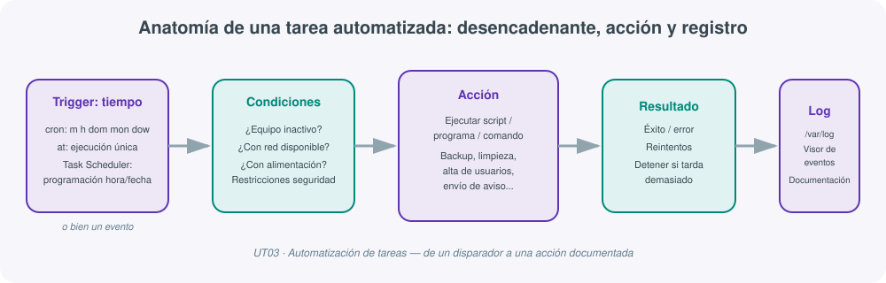
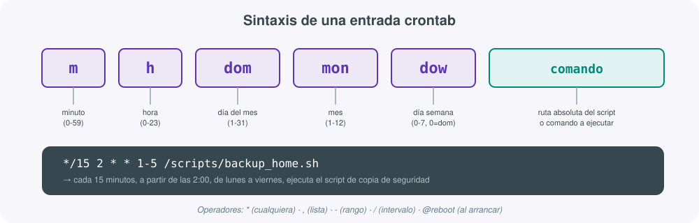
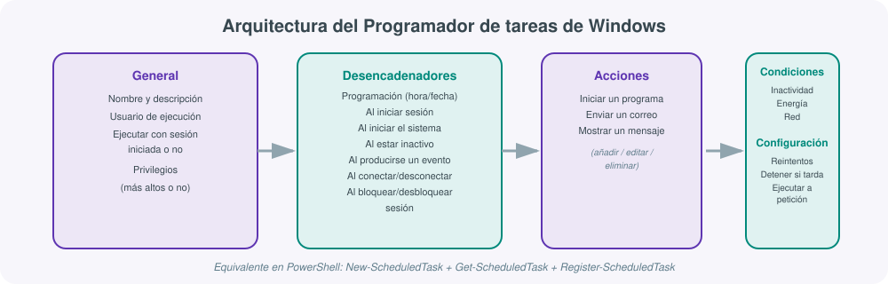
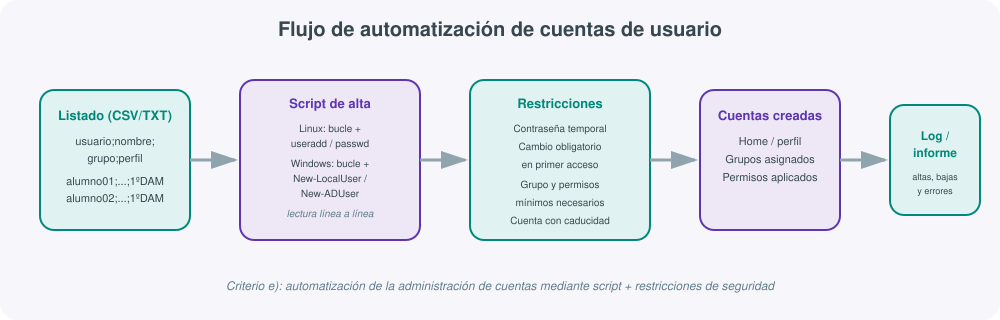

# **🤖 UT03 · Automatización de tareas**



## Resultado de aprendizaje y criterios de evaluación

**RA3.** Gestiona la automatización de tareas del sistema, aplicando criterios de eficiencia y utilizando comandos y herramientas gráficas.

Criterios de evaluación:

a) Se han descrito las ventajas de la automatización de las tareas repetitivas en el sistema.
b) Se han utilizado los comandos del sistema para la planificación de tareas.
c) Se han establecido restricciones de seguridad.
d) Se han realizado planificaciones de tareas repetitivas o puntuales relacionadas con la administración del sistema.
e) Se ha automatizado la administración de cuentas.
f) Se han instalado y configurado herramientas gráficas para la planificación de tareas.
g) Se han utilizado herramientas gráficas para la planificación de tareas.
h) Se han documentado los procesos programados como tareas automáticas.

## 1. Por qué automatizar: ventajas y tareas candidatas

Antes de programar una sola tarea conviene fijar la idea que sostiene toda la unidad (criterio a): automatizar consiste en realizar acciones y procesos **sin intervención humana constante**, y esto no es un capricho técnico sino una decisión de gestión. Un administrador de sistemas que revisa manualmente cada noche si las copias de seguridad se han hecho, o que crea a mano cada cuenta de un grupo de 30 alumnos nuevos, está desperdiciando tiempo en tareas mecánicas que un script o un planificador puede ejecutar de forma más fiable.

Las ventajas de automatizar se pueden resumir en cinco ejes:

| Ventaja | Qué aporta |
|---|---|
| **Eficiencia** | Optimiza procesos y reduce el tiempo dedicado a tareas manuales |
| **Consistencia** | Garantiza que la tarea se ejecuta siempre de la misma manera, sin errores humanos |
| **Ahorro de tiempo** | Libera tiempo del administrador para tareas estratégicas |
| **Mejora de la calidad** | Reduce errores y mejora la fiabilidad de las operaciones |
| **Agilidad** | Permite responder rápido a demandas cambiantes (picos de carga, incidentes) |

No todas las tareas son buenas candidatas a automatizar. Conviene fijarse en cuatro características:

- **Repetitividad**: la tarea se repite en el tiempo y puede programarse a intervalos regulares (revisión de antivirus semanal, comprobación de errores de disco mensual, apagado de servidores, auditorías, copias de seguridad, sincronización horaria).
- **Requisitos de tiempo**: debe ejecutarse en un momento concreto o con un plazo estricto (enviar un informe cada día 1 de mes a las 8:00).
- **Predictibilidad**: tiene un conjunto de pasos y decisiones claro, sin ambigüedad ("si ocurre X, haz Y").
- **Respuesta a un evento**: se dispara ante un suceso del sistema (enviar un correo al administrador si se llena el disco, lanzar un programa al iniciar sesión un usuario concreto, detener un servicio ante una alerta de rendimiento).

!!! note "Formas habituales de automatización"
    No toda automatización pasa por un planificador de tareas: también se automatiza mediante **scripts** (copias de seguridad, gestión de usuarios y permisos), **archivos de respuesta** para instalar software sin intervención manual, **administración remota** (aplicar el mismo cambio a varios sistemas desde un punto central) y la propia **automatización de actualizaciones** (descarga e instalación de parches). El planificador de tareas (`cron`, `at`, Task Scheduler) es solo el mecanismo que decide *cuándo* se dispara cada una de estas acciones.

## 2. Información y diagnóstico del sistema como base de la automatización

Antes de decidir qué automatizar hace falta saber diagnosticar el estado del sistema: qué procesos consumen recursos, qué eventos se han registrado, qué software está instalado. Esta información es la que después alimentará los scripts y las condiciones de las tareas programadas.

### Comandos de diagnóstico en Windows

| Comando | Qué muestra |
|---|---|
| `systeminfo` | Información amplia de hardware, software y configuración; se puede redirigir a fichero (`systeminfo > misistema.txt`) |
| `wmic os get` / `wmic cpu get` / `wmic diskdrive get` | Sistema operativo, CPU, discos |
| `wmic process list` / `wmic service list` | Procesos y servicios en ejecución |
| `wmic useraccount list` | Cuentas de usuario del sistema |
| `findstr` | Búsqueda de patrones de texto en archivos o en la salida de otro comando |
| `Get-EventLog` (PowerShell) | Consulta de los registros de eventos del sistema |

### Comandos de diagnóstico en GNU/Linux

| Comando/ruta | Qué muestra |
|---|---|
| `uname -a` | Kernel, versión, arquitectura y hardware |
| `lsb_release -a` | Distribución y versión |
| `/proc/cpuinfo`, `/proc/meminfo` | Información de CPU y memoria en tiempo real (interfaz virtual con el kernel) |
| `/var/log/syslog`, `/var/log/auth.log` | Eventos del sistema y de autenticación |
| `top`, `htop`, `glances` | Monitorización de procesos y recursos en tiempo real |
| `lshw`, `lscpu`, `lsusb`, `lspci`, `dmidecode` | Diagnóstico detallado de hardware |

Los registros de eventos (`/var/log` en Linux, Visor de eventos en Windows) dependen de demonios concretos: en Linux, **`journald`** (parte de systemd, formato binario) y **`rsyslog`/`syslog`** (texto plano); en Windows, el propio subsistema de logs del Visor de eventos. Estos ficheros son, precisamente, la fuente de datos que muchos scripts de mantenimiento (filtrar errores, generar informes) van a recorrer de forma automática.

!!! example "De la información al script"
    Un script típico de mantenimiento recorre `/var/log`, busca las líneas que contienen "error" o "fail", y genera un informe agregado. Ese script, ejecutado manualmente, ya aporta valor; ejecutado cada noche mediante `cron`, se convierte en una tarea automatizada que documenta por sí sola el estado del sistema sin que nadie tenga que acordarse de lanzarlo.

## 3. Planificación de tareas en GNU/Linux: cron, crontab y at

El mecanismo de planificación por excelencia en Linux es el demonio **`crond`** (criterio b): se activa en el arranque del sistema, lee las tareas de cada usuario en `/var/spool/cron/crontabs`, construye una lista ordenada por tiempos y comprueba cada minuto si toca ejecutar alguna.

### Gestión del crontab de usuario

```bash
crontab -e          # editar el crontab del usuario actual
crontab -l           # listar las tareas programadas
crontab -r           # borrar todas las tareas del usuario
crontab -u usuario   # actuar sobre el crontab de otro usuario (requiere permisos)
```

También existe un crontab global en `/etc/crontab`, gestionado por el superusuario, en el que se puede indicar el usuario con el que se ejecuta cada tarea.

### Sintaxis de una entrada crontab



```
m h dom mon dow  comando
```

| Campo | Rango | Significado |
|---|---|---|
| `m` | 0-59 | Minuto |
| `h` | 0-23 | Hora |
| `dom` | 1-31 | Día del mes |
| `mon` | 1-12 | Mes |
| `dow` | 0-7 (0 y 7 = domingo) | Día de la semana |
| `comando` | ruta absoluta | Programa o script a ejecutar; `cron` no analiza su contenido, solo lo pasa a la shell |

Operadores admitidos en cada campo:

- `*`: cualquier valor.
- `,`: lista de valores (`1,15,30`).
- `-`: rango (`1-5`).
- `/`: intervalo (`*/15`, cada 15 unidades).
- Nombres abreviados de día/mes (`Mon`, `Tue`, `Jan`, `Feb`).
- `#`: comentario, la línea se ignora.
- `@`: atajos habituales, como `@reboot` (al arrancar el sistema).

!!! example "Ejemplo comentado"
    ```
    */15 2 * * 1-5  /scripts/backup_home.sh
    ```
    Cada 15 minutos, entre las 2:00 y las 2:59, de lunes a viernes, ejecuta el script de copia de seguridad de `/home`.

### El comando `at`: tareas puntuales

Frente a `cron` (tareas repetitivas), **`at`** programa una única ejecución futura de una orden, útil para apagar el sistema a una hora concreta o lanzar una copia puntual. La tarea queda en una cola y se ejecuta aunque la sesión se cierre.

```bash
at 23:00                # abre el prompt de at para introducir el/los comando(s)
atq                      # lista los trabajos pendientes
atrm <número>            # elimina un trabajo por su identificador
```

### `anacron`: garantizar la ejecución si el equipo estuvo apagado

Si el sistema está apagado en el momento en que `cron` debía ejecutar una tarea, esa ejecución se pierde. **`anacron`** resuelve este problema revisando, en el siguiente arranque, qué tareas periódicas (`daily`, `weekly`, `monthly`; no admite `hourly`) no se han ejecutado en el plazo previsto, y lanzándolas en cuanto es posible.

- Configuración: `/etc/anacrontab`.
- Marca de tiempo por tarea: `/var/spool/anacron`.
- Variables declaradas: `SHELL`, `PATH`, `HOME`, `LOGNAME`.

Cada línea de `/etc/anacrontab` define: **periodo** (`@daily`, `@weekly`, `@monthly` o un número de días), **retraso en minutos** (evita que todas las tareas se disparen a la vez tras el arranque), **nombre único de la tarea** (sin `/`, usado para el fichero de marca de tiempo) y **la tarea** a ejecutar.

| Mecanismo | Tipo de ejecución | Si el equipo está apagado |
|---|---|---|
| `cron` | Repetitiva, a intervalos exactos | La ejecución se pierde |
| `anacron` | Repetitiva (daily/weekly/monthly) | Se ejecuta en el siguiente arranque |
| `at` | Puntual, una sola vez | La ejecución se pierde (salvo que el sistema esté encendido a esa hora) |

## 4. El Programador de tareas de Windows (Task Scheduler)

El equivalente funcional de `cron` en Windows es el **Programador de tareas**, accesible tanto en modo gráfico como por PowerShell (criterios b, f y g). Una tarea se configura en cuatro bloques:



| Bloque | Contenido |
|---|---|
| **General** | Nombre, descripción, usuario de ejecución, opción de ejecutar con o sin sesión iniciada, nivel de privilegios |
| **Desencadenadores** | Cuándo se activa: programación por hora/fecha, al iniciar sesión, al iniciar el sistema, al estar inactivo, al producirse un evento, al crear/modificar la tarea, al conectar/desconectar sesión, al bloquear/desbloquear sesión |
| **Acciones** | Qué hace la tarea: iniciar un programa, enviar un correo, mostrar un mensaje |
| **Condiciones** | Restricciones adicionales: inactividad del equipo, estado de energía (portátiles), exigencia de red activa |
| **Configuración** | Ejecutar a petición, ejecutar en cuanto sea posible si se perdió el disparo (equivalente a `anacron`), reintentar tras fallo, detener si tarda demasiado, reglas si la tarea ya estaba en ejecución |

!!! tip "El equivalente de anacron en Windows"
    La opción "ejecutar la tarea lo antes posible si se ha perdido un inicio programado" cumple exactamente la misma función que `anacron` en Linux: evita que una tarea crítica (por ejemplo, una copia de seguridad) se pierda simplemente porque el equipo estaba apagado a la hora prevista.

### Automatización desde PowerShell

Las mismas tareas que se crean gráficamente se pueden gestionar por comandos, lo que facilita documentarlas y reproducirlas (criterio b y h):

```powershell
New-ScheduledTask        # crea la definición de una nueva tarea
Get-ScheduledTask        # lista las tareas programadas existentes
Get-ScheduledTaskInfo    # estado y configuración de una tarea concreta
Set-ScheduledTask        # modifica una tarea ya creada
Enable-ScheduledTask     # habilita una tarea deshabilitada
Disable-ScheduledTask    # deshabilita una tarea sin borrarla
Export-ScheduledTask     # exporta la definición a un archivo XML (documentación)
```

Para crear una tarea completa por script se combinan cinco variables:

```powershell
$action    = New-ScheduledTaskAction -Execute "powershell.exe" -Argument "-File C:\scripts\limpieza.ps1"
$trigger   = New-ScheduledTaskTrigger -Daily -At "03:00"
$principal = New-ScheduledTaskPrincipal -UserId "SYSTEM" -LogonType ServiceAccount -RunLevel Highest
$settings  = New-ScheduledTaskSettingsSet -StartWhenAvailable -RestartCount 3
$task      = New-ScheduledTask -Action $action -Trigger $trigger -Principal $principal -Settings $settings

Register-ScheduledTask -TaskName "LimpiezaNocturna" -InputObject $task
```

`Export-ScheduledTask` es especialmente útil de cara al criterio h (documentación), porque permite conservar en un XML la definición exacta de cada tarea creada, tanto si se creó por interfaz gráfica como por script.

## 5. Automatización de la administración de cuentas de usuario

El criterio e exige, específicamente, automatizar la administración de cuentas: el alta masiva de usuarios (por ejemplo, todo un grupo-clase) es el caso de uso más habitual, porque hacerlo a mano es lento y propenso a errores de escritura.



El patrón habitual es: partir de un listado (CSV o texto plano) con un usuario por línea, recorrerlo con un script y dar de alta cada cuenta con los parámetros adecuados.

**En GNU/Linux**, con un bucle sobre un fichero de texto:

```bash
#!/bin/bash
while IFS=';' read -r usuario nombre grupo; do
    useradd -m -c "$nombre" -g "$grupo" "$usuario"
    echo "${usuario}:CambiarAhora1" | chpasswd
    chage -d 0 "$usuario"   # obliga a cambiar la contraseña en el primer inicio de sesión
done < listado_altas.csv
```

**En Windows**, con PowerShell y el módulo de Active Directory (o `New-LocalUser` en local):

```powershell
Import-Csv listado_altas.csv -Delimiter ';' | ForEach-Object {
    New-ADUser -Name $_.nombre -SamAccountName $_.usuario `
        -AccountPassword (ConvertTo-SecureString "CambiarAhora1" -AsPlainText -Force) `
        -ChangePasswordAtLogon $true -Enabled $true -Path "OU=$($_.grupo),DC=instituto,DC=local"
}
```

En ambos casos el script resuelve la parte repetitiva (crear N cuentas idénticas en estructura), pero deja explícitas las restricciones de seguridad, que se tratan en el siguiente apartado.

## 6. Restricciones de seguridad en tareas y cuentas automatizadas

Automatizar sin criterios de seguridad multiplica el daño de un error: un script que se ejecuta cada noche con privilegios de administrador y contiene un fallo puede propagar ese fallo de forma silenciosa durante semanas. El criterio c exige establecer restricciones concretas:

| Ámbito | Restricción recomendada |
|---|---|
| Ejecución de la tarea | Ejecutar con el usuario de menor privilegio posible que la tarea necesite, no siempre `SYSTEM`/`root` |
| Contraseñas iniciales | Contraseña temporal aleatoria, nunca la misma para todo el lote de cuentas |
| Cambio de contraseña | Forzar el cambio en el primer inicio de sesión (`chage -d 0`, `ChangePasswordAtLogon`) |
| Caducidad de cuentas | Establecer fecha de expiración en cuentas temporales (prácticas, becarios, alumnado en prácticas de empresa) |
| Permisos y grupos | Asignar solo los grupos estrictamente necesarios, revisando pertenencias heredadas |
| Scripts con credenciales | No dejar contraseñas en texto plano dentro del script; usar gestores de secretos o variables protegidas |
| Tareas con acceso a red | Restringir la condición "requiere red" a las tareas que realmente la necesiten, para reducir superficie de ataque |
| Registro de la actividad | Toda tarea automatizada debe dejar constancia en un log de qué hizo, cuándo y con qué resultado |

!!! warning "El riesgo de la automatización sin control"
    Un script de limpieza mal probado que borra "todo lo antiguo" en `/home` sin excluir directorios críticos, ejecutado automáticamente cada noche, puede destruir datos durante días antes de que alguien lo note. La regla práctica es: **toda tarea automática debe probarse primero en modo simulación o sobre datos de prueba**, y solo entonces programarse en producción.

## 7. Herramientas gráficas para la planificación de tareas

Los criterios f y g exigen explícitamente instalar, configurar y usar herramientas gráficas de planificación, más allá de la línea de comandos:

| Herramienta | Sistema | Descripción |
|---|---|---|
| **Programador de tareas** | Windows | Interfaz gráfica nativa, ya vista en el apartado 4 |
| **Webmin** | GNU/Linux | Interfaz web de administración; permite programar tareas de forma remota, entre otras muchas funciones de administración |
| **`msinfo32`** | Windows | Información de sistema, no planificación directa, pero complementaria al diagnóstico previo a automatizar |
| **Visor de eventos** | Windows | Permite programar una tarea que se ejecute como respuesta directa a un evento registrado |

**Webmin**, aunque no nace como herramienta de automatización pura, se cita específicamente en el temario porque resulta la interfaz gráfica más versátil disponible en GNU/Linux para gestionar tareas `cron` sin usar la terminal, especialmente útil cuando se administra el servidor de forma remota.

## 8. Monitorización como complemento de la automatización

Automatizar tareas sin supervisarlas es solo la mitad del trabajo: hay que saber si la automatización sigue funcionando. Herramientas como **Nagios**, **Zabbix**, **Prometheus + Grafana** o **Pandora FMS** permiten comprobar en tiempo real si un servicio automatizado (un backup, una sincronización) se ha ejecutado y ha tenido éxito, generando alertas cuando algo falla.

| Herramienta | Plataforma | Enfoque |
|---|---|---|
| Nagios | Multiplataforma (arquitectura de plugins) | Alertas, gráficos, muy personalizable |
| Zabbix | Multiplataforma | Flexible y escalable, incluye Windows |
| Prometheus + Grafana | Linux, contenedores | Métricas + visualización |
| Pandora FMS | Multiplataforma | Supervisión de Windows y Linux |

Estas herramientas cierran el ciclo que abre la automatización: **programar → ejecutar → registrar → supervisar**, de modo que un fallo en una tarea automática se detecta y se corrige antes de que se convierta en un incidente mayor.

## 9. Documentación de las tareas automáticas

El criterio h es, con frecuencia, el que peor se cumple en la práctica: se programa la tarea, funciona, y nadie deja constancia de por qué existe ni de qué hace exactamente. Una ficha mínima de documentación debería recoger:

| Campo | Ejemplo |
|---|---|
| Nombre de la tarea | `CopDifSem-28` |
| Sistema y mecanismo | GNU/Linux, `cron` |
| Disparador | Semanal, lunes 02:00 |
| Acción | Copia de seguridad diferencial de `/home` |
| Usuario de ejecución | `root` (justificado: necesita leer todo `/home`) |
| Restricciones aplicadas | Solo lectura sobre `/home`, escritura restringida a `/bacnombre` |
| Última revisión | Fecha y responsable |
| Ubicación del log | `/var/log/backup.log` |

En Windows, `Export-ScheduledTask` genera automáticamente un XML con la definición completa de la tarea, que puede archivarse como parte de esta documentación sin tener que redactarla a mano desde cero.

## Para profundizar

Esta unidad se ha construido a partir de los apuntes de clase de Administración de Sistemas Operativos y de la práctica **SP31 - Automatización de tareas**, que trabaja sobre PowerShell (Windows Server), Manjaro y Fedora. El resto de enlaces de referencia del módulo está recopilado en la página de [Recursos](99-recursos.md).
