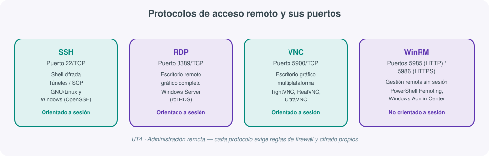
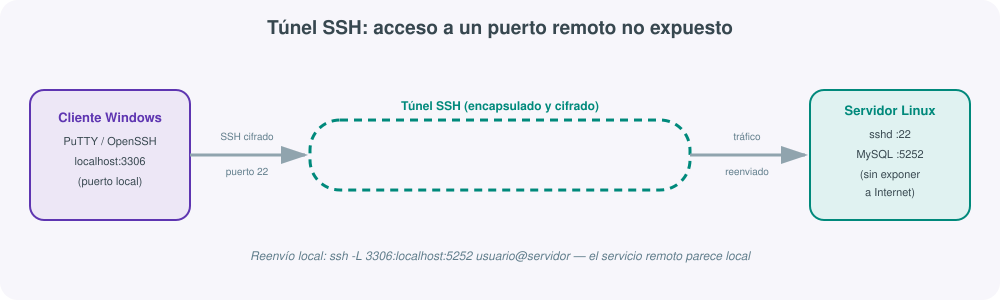
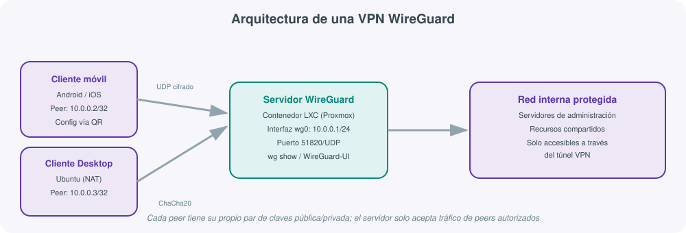
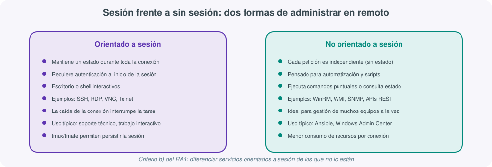

# **🖧 UT04 · Administración remota**



## Resultado de aprendizaje y criterios de evaluación

**RA4.** Administra de forma remota el sistema operativo en red valorando su importancia y aplicando criterios de seguridad.

Criterios de evaluación:

a) Se han descrito métodos de acceso y administración remota de sistemas.
b) Se ha diferenciado entre los servicios orientados a sesión y los no orientados a sesión.
c) Se han utilizado herramientas de administración remota suministradas por el propio sistema operativo.
d) Se han instalado servicios de acceso y administración remota.
e) Se han utilizado comandos y herramientas gráficas para gestionar los servicios de acceso y administración remota.
f) Se han creado cuentas de usuario para el acceso remoto.
g) Se han realizado pruebas de acceso y administración remota entre sistemas heterogéneos.
h) Se han utilizado mecanismos de encriptación de la información transferida.
i) Se han documentado los procesos y servicios del sistema administrados de forma remota.

## 1. Por qué administrar en remoto

Un administrador de sistemas rara vez trabaja sentado delante del servidor que gestiona. Los centros de datos modernos alojan cientos de máquinas físicas y virtuales, muchas veces repartidas entre varias sedes o en la nube, por lo que la **administración remota** —acceder y controlar un sistema desde otra ubicación a través de la red— no es una comodidad sino la forma normal de trabajar (criterio a).

Antes de elegir una herramienta concreta conviene fijar dos conceptos que se repiten en todo el tema:

- **Acceso remoto**: la capacidad técnica de conectarse a un sistema situado en otro lugar.
- **Administración remota**: un paso más allá del simple acceso — gestionar y controlar activamente los recursos de ese sistema (usuarios, servicios, actualizaciones) como si se estuviera físicamente delante.

Las ventajas que justifican generalizar este modelo de trabajo son claras: **acceso desde cualquier lugar**, **ahorro de tiempo y desplazamientos**, **conexiones cifradas** que preservan la seguridad, **multitarea** (gestionar varios sistemas desde un único puesto) y **diagnóstico en tiempo real** de incidencias. El precio a pagar es que toda esa superficie de conexión debe protegerse: cada servicio de acceso remoto que se activa es, potencialmente, una puerta de entrada para un atacante si no se configura con cuidado — de ahí que el propio RA4 exija "valorar su importancia y aplicar criterios de seguridad".

!!! note "Interfaces de usuario, la base de cualquier acceso remoto"
    Todo acceso remoto termina apoyándose en alguna interfaz de usuario: **CLI** (línea de comandos, la más habitual en administración por su eficiencia y facilidad de automatizar), **GUI** (gráfica, más intuitiva pero más pesada de transmitir por red), **TUI** (texto con aspecto de menús, típica de consolas de BIOS o instaladores) o interfaces web. En Windows, PowerShell ha sustituido progresivamente a `cmd` como shell de administración; en GNU/Linux, `bash` es el shell por defecto de la mayoría de distribuciones, aunque existen alternativas como `tcsh`, `ksh` o PowerShell Core (multiplataforma).

## 2. Servicios orientados a sesión frente a no orientados a sesión

El criterio (b) exige diferenciar explícitamente dos familias de servicios de acceso remoto, una distinción que en la práctica determina para qué sirve cada herramienta:

| | Orientado a sesión | No orientado a sesión |
|---|---|---|
| Estado de la conexión | Mantiene un estado mientras dura la conexión | Cada petición es independiente, sin estado persistente |
| Autenticación | Una vez, al inicio de la sesión | En cada petición o de forma delegada |
| Uso típico | Trabajo interactivo: shell, escritorio gráfico | Automatización, consultas puntuales, gestión masiva |
| Ejemplos | SSH, RDP, VNC, Telnet | WinRM, WMI, SNMP, la mayoría de APIs REST |
| Qué ocurre si se corta la red | La tarea en curso se interrumpe (salvo uso de `tmux`/`tmate`) | No hay "tarea en curso"; se reintenta la siguiente petición |
| Ejemplo de herramienta de gestión masiva | — | Ansible (SSH sin sesión persistente), Windows Admin Center (WinRM) |

Un administrador que necesita **entrar y trabajar de forma interactiva** en un servidor (revisar logs, editar un fichero de configuración, depurar un problema) usará un servicio orientado a sesión. Un administrador que necesita **lanzar la misma comprobación en 200 equipos** preferirá un mecanismo sin sesión, pensado para ejecutarse de forma desatendida y en paralelo.

**tmux** (multiplexor de terminal) y **tmate** (su variante orientada a compartir sesiones) resuelven precisamente el punto débil de los servicios orientados a sesión: permiten mantener procesos en ejecución aunque se cierre la conexión SSH, y retomar exactamente donde se dejó la sesión.

## 3. SSH y túneles en GNU/Linux

**SSH (Secure Shell)** es el protocolo de referencia para el acceso remoto cifrado por línea de comandos en sistemas Unix/Linux (y, desde Windows 10 / Server 2019, también nativo en Windows mediante **OpenSSH**). Sustituye a Telnet, que viaja en texto plano y debe evitarse salvo que no exista otra alternativa.

| Componente OpenSSH | Función |
|---|---|
| `sshd` | Demonio servidor SSH |
| `ssh` | Cliente SSH |
| `ssh-keygen` | Genera y administra pares de claves de autenticación |
| `ssh-agent` | Mantiene en memoria las claves privadas para no teclear la contraseña en cada conexión |
| `ssh-add` | Añade claves privadas a `ssh-agent` |
| `ssh-keyscan` | Recopila claves públicas de host de varios servidores |

### Autenticación por clave pública

El mecanismo recomendado frente a usuario/contraseña es la autenticación por par de claves asimétricas:

1. Generar el par de claves en el cliente: `ssh-keygen -t ed25519`.
2. Copiar la clave **pública** al servidor con `scp` (Secure Copy, construido sobre SSH): `scp ~/.ssh/id_ed25519.pub usuario@servidor:~/`.
3. Añadir esa clave pública a `~/.ssh/authorized_keys` en el servidor y comprobar que la conexión ya no pide contraseña.

La clave **privada** nunca sale del equipo cliente: es la prueba criptográfica de identidad, y perderla (o que se filtre) equivale a perder el control de todas las cuentas donde se haya autorizado su clave pública.

### Configuración del servidor: `/etc/ssh/sshd_config`

| Directiva | Efecto | Recomendación |
|---|---|---|
| `Port` | Puerto de escucha (22 por defecto) | Cambiarlo reduce el ruido de escaneos automáticos, aunque no sustituye a una buena política de claves |
| `PermitRootLogin` | Permite iniciar sesión SSH directamente como root | `no`: conectar como usuario normal y usar `sudo` |
| `AllowUsers` | Restringe qué usuarios (y desde qué IPs) pueden conectarse | `AllowUsers admin@* tecnico@192.168.5.*` |
| `PasswordAuthentication` | Permite autenticación por contraseña | `no` una vez configuradas las claves, para forzar autenticación por clave |
| `X11Forwarding` | Permite reenviar aplicaciones gráficas remotas a la pantalla local | `yes` solo si es necesario ejecutar apps gráficas remotas |

!!! example "X11 Forwarding"
    Con `X11Forwarding yes` en el servidor y un servidor X en el cliente (por ejemplo **Xming** en Windows), el comando `ssh -X usuario@servidor` permite lanzar una aplicación gráfica Linux (un editor, un navegador) y verla renderizada en la pantalla local, aunque el proceso se ejecute íntegramente en el servidor remoto.

### Túneles SSH: cifrar lo que no viaja cifrado

Un **túnel SSH** (*port forwarding*) aprovecha la conexión SSH ya cifrada para redirigir el tráfico de otro servicio, típicamente uno que por sí mismo no cifra sus datos (una base de datos, un panel web interno, un servidor de correo).



```bash
# Reenvío local: el puerto 3306 de mi equipo "se convierte" en el puerto 5252 del servidor remoto
ssh -L 3306:localhost:5252 usuario@servidor
```

A partir de ese momento, cualquier cliente MySQL que conecte a `localhost:3306` en la máquina local en realidad está hablando, de forma cifrada, con el puerto 5252 del servidor remoto — sin que ese puerto tenga que estar expuesto directamente a Internet. Herramientas gráficas como **PuTTY** permiten configurar este mismo reenvío desde un asistente, sin recordar la sintaxis del comando.

## 4. Escritorio remoto y WinRM en Windows

### Remote Desktop Services (RDS) y RDP

El protocolo **RDP** (*Remote Desktop Protocol*, puerto 3389/TCP) es la solución nativa de Microsoft para escritorio remoto gráfico completo. Viene instalado en todos los Windows, pero desactivado por defecto en los clientes; en Windows Server, en cambio, es habitual mantenerlo activo bajo el rol **RDS**.

| Componente RDS | Función |
|---|---|
| Remote Desktop Session Host (RDSH) | Ejecuta los escritorios y aplicaciones virtuales en el servidor |
| RemoteApp | Publica una aplicación concreta del servidor como si se ejecutara en local |
| Remote Desktop Gateway (RD Gateway) | Permite el acceso RDP encapsulado sobre HTTPS, sin abrir el 3389 directamente a Internet |
| Remote Desktop Web Access | Acceso a escritorios y aplicaciones RDS desde el navegador |
| Remote Desktop Connection Broker | Equilibra y redirige las conexiones de los usuarios |
| Remote Desktop Licensing | Gestiona las licencias CAL necesarias para RDS |

Al habilitar el escritorio remoto en un equipo Windows hay tres niveles de exigencia de seguridad, de menos a más restrictivo: no permitir conexiones, permitir cualquier versión de cliente RDP, o exigir **autenticación a nivel de red (NLA)** antes de establecer la sesión gráfica — esta última opción es la recomendada salvo que se necesite dar soporte a clientes RDP muy antiguos.

### WinRM: gestión remota sin sesión gráfica

**WinRM** (*Windows Remote Management*) es la implementación de Microsoft del estándar WS-Management y el mecanismo que sostiene **PowerShell Remoting**: permite ejecutar comandos y scripts en un equipo remoto sin abrir una sesión de escritorio, escuchando en los puertos **5985 (HTTP)** y **5986 (HTTPS)**.

```powershell
# Habilitar WinRM en el equipo destino
Enable-PSRemoting -Force

# Ejecutar un comando en un equipo remoto desde el cliente
Invoke-Command -ComputerName srv01 -ScriptBlock { Get-Service }

# Abrir una sesión interactiva remota
Enter-PSSession -ComputerName srv01
```

WinRM es exactamente el tipo de servicio "no orientado a sesión persistente" del apartado 2: cada invocación se autentica y ejecuta de forma independiente, lo que lo hace ideal para automatizar tareas en muchos servidores a la vez (por ejemplo, con **Ansible** también contra Windows, o con **Windows Admin Center**, que usa WinRM por debajo de su interfaz web).

### Otras herramientas nativas de Windows (criterio c)

- **RSAT** (*Remote Server Administration Tools*): instalable en cualquier cliente Windows para administrar roles de Windows Server (AD, DNS, DHCP...) con las mismas consolas gráficas que si se estuviera delante del servidor.
- **Administrador del Servidor** y **consolas MMC**: gestión gráfica de roles y características, especialmente útil con instalaciones Server Core (sin interfaz gráfica local).
- **Windows Admin Center**: consola web centralizada, instalable en un equipo del dominio, que sustituye progresivamente a varias consolas MMC dispersas.
- **Administración remota de IIS**: gestión del servidor web desde el propio navegador.

!!! warning "El cortafuegos, la pieza que siempre falta"
    Ninguna de estas herramientas funciona si el firewall del equipo de destino bloquea el puerto correspondiente. Antes de dar por fallida una conexión remota, la primera comprobación es siempre la regla de firewall (entrante) de la máquina destino, no la configuración del servicio en sí.

## 5. Herramientas de acceso remoto gráfico y de terceros

Junto a las herramientas nativas del sistema operativo, existe un ecosistema de aplicaciones de terceros que facilitan el acceso remoto gráfico, muchas veces resolviendo problemas de NAT o firewall que complican una conexión RDP/VNC directa:

| Herramienta | Protocolo/base | Punto fuerte |
|---|---|---|
| PuTTY | SSH/Telnet | Cliente ligero, muy usado para túneles SSH en Windows |
| NoMachine | NX (propietario) | Experiencia de escritorio remoto muy fluida |
| VNC (TightVNC, RealVNC, UltraVNC) | RFB | Multiplataforma, arquitectura servidor/visor |
| TeamViewer / AnyDesk / RustDesk | Propietario | Atraviesan NAT sin configurar el router; RustDesk es alternativa de código abierto |
| Rdesktop / Remmina | RDP, VNC, SSH, SPICE | Clientes Linux para conectar a escritorios Windows y otros |
| Apache Guacamole | HTML5 (proxy de RDP/VNC/SSH) | Acceso remoto **sin cliente instalado**, solo navegador |

**Apache Guacamole** merece una mención aparte: no es un protocolo nuevo, sino un *gateway* HTML5 que traduce RDP, VNC, SSH y Telnet a una sesión servida por navegador, centralizando la autenticación, el cifrado y el registro de conexiones de todos esos protocolos en un único punto — muy útil cuando se necesita dar acceso puntual a un sistema sin instalar ningún cliente en el equipo del usuario.

## 6. VPN y WireGuard: cifrar la red, no solo la sesión

Una **VPN** (*Virtual Private Network*) construye un túnel cifrado sobre una red pública (típicamente Internet) para conectar dos redes o un dispositivo con una red, como si estuvieran en el mismo segmento local. A diferencia de un túnel SSH puntual (un servicio concreto), una VPN cifra **todo** el tráfico entre los extremos conectados.

| Modalidad de VPN | Escenario | Protocolos habituales |
|---|---|---|
| Punto a punto (*road warrior*) | Un usuario remoto se conecta a la red de la oficina | L2TP, PPTP, WireGuard |
| Sitio a sitio | Dos sedes se conectan de forma permanente | IPsec, OpenVPN |
| LAN de acceso remoto | Varios usuarios remotos acceden a recursos internos concretos | IPsec, OpenVPN, WireGuard |

Entre las soluciones software para GNU/Linux, tres aparecen constantemente: **OpenVPN** (SSL/TLS, muy extendido, algo más pesado), **StrongSwan** (IPsec/IKEv2, buena compatibilidad con clientes VPN nativos de móviles) y **WireGuard**.

### WireGuard como VPN moderna

**WireGuard** se diseñó explícitamente para ser más simple, más rápida y más auditable que IPsec u OpenVPN, usando criptografía moderna (Curve25519, ChaCha20, Poly1305) y un núcleo de código muy reducido (unas 4.000 líneas, frente a las más de 100.000 de OpenVPN/IPsec), lo que facilita auditar su seguridad.



Conceptos clave de su modelo:

- **Interfaz `wg0`**: la interfaz de red virtual que crea WireGuard en cada extremo, con una IP dentro del rango privado de la VPN (por ejemplo, `10.0.0.1/24` en el servidor).
- **Peer**: cada extremo de la conexión (cliente o servidor) se identifica por un par de claves pública/privada, no por certificados ni usuario/contraseña.
- **Puerto 51820/UDP**: puerto por defecto en el que escucha un servidor WireGuard.
- **`wg show`**: comando que muestra el estado de los peers conectados, el tráfico cursado y el último *handshake*.
- **WireGuard-UI**: interfaz web opcional para gestionar peers (altas, bajas, generación de configuración) sin editar el fichero de configuración a mano.

```ini
# Ejemplo simplificado de configuración de un peer cliente (.conf)
[Interface]
PrivateKey = <clave_privada_del_cliente>
Address = 10.0.0.2/24
DNS = 1.1.1.1

[Peer]
PublicKey = <clave_publica_del_servidor>
Endpoint = vpn.instituto.local:51820
AllowedIPs = 0.0.0.0/0
```

Un caso de uso frecuente en el aula es desplegar WireGuard dentro de un **contenedor LXC de Proxmox**, generar la configuración de un cliente móvil (importable mediante un código QR) y de un cliente de escritorio, y comprobar la conectividad del túnel con `wg show` antes de habilitar el acceso a recursos internos.

## 7. Cifrado de la información transferida

El criterio (h) exige explícitamente utilizar mecanismos de encriptación de la información transferida. Conviene tener claro, unidad tras unidad, **dónde** se aplica ese cifrado en cada tecnología vista:

| Servicio | Mecanismo de cifrado |
|---|---|
| SSH | Cifrado simétrico de la sesión tras un intercambio de claves asimétrico inicial |
| RDP | TLS (a partir de NLA); versiones antiguas sin NLA son bastante menos seguras |
| VNC | Depende de la implementación; muchas variantes no cifran por defecto y requieren un túnel SSH adicional |
| WinRM | HTTPS en el puerto 5986 (el 5985/HTTP debe restringirse a redes de confianza) |
| WireGuard | ChaCha20 (cifrado) + Poly1305 (autenticación) + Curve25519 (intercambio de claves) |
| OpenVPN / StrongSwan | TLS / IPsec según el protocolo |

!!! danger "Telnet y VNC sin cifrar: los ejemplos negativos del tema"
    Telnet transmite usuario y contraseña en texto plano por la red: cualquiera que capture el tráfico (por ejemplo con Wireshark) puede leer las credenciales directamente. Muchas implementaciones de VNC tienen el mismo problema si no se combinan con un túnel SSH (`ssh -L 5900:localhost:5900 usuario@servidor`) o una VPN. La regla general del tema: si un protocolo no cifra por diseño, se cifra transportándolo dentro de otro que sí lo haga.

## 8. Cuentas de acceso remoto

El criterio (f) exige crear cuentas específicas para el acceso remoto, y no reutilizar sin más las cuentas administrativas habituales. Buenas prácticas habituales:

- Crear una cuenta nominal por técnico (nunca una cuenta compartida "admin" para todo el equipo), de forma que quede constancia de quién ha hecho cada conexión.
- Restringir cada cuenta al mínimo de permisos necesario: un técnico de soporte de nivel 1 no necesita ser administrador de dominio para reiniciar un servicio.
- En SSH, combinar `AllowUsers` con autenticación por clave y, si es posible, con una VPN previa (WireGuard) para que el puerto SSH ni siquiera sea visible desde Internet.
- En Windows, añadir explícitamente al grupo **Usuarios de escritorio remoto** solo las cuentas que necesitan RDP, en lugar de conceder el acceso a "Todos" o al grupo de administradores completo.
- Revisar y retirar cuentas de acceso remoto cuando un técnico deja de necesitarlas (bajas, cambios de puesto, fin de un contrato de mantenimiento).

## 9. Pruebas de acceso entre sistemas heterogéneos

El criterio (g) pide expresamente comprobar el acceso remoto **entre sistemas operativos distintos**, no solo Windows-Windows o Linux-Linux. En la práctica esto significa validar combinaciones como:

| Origen | Destino | Mecanismo típico |
|---|---|---|
| Windows | GNU/Linux | SSH (OpenSSH cliente), X11 Forwarding con Xming |
| GNU/Linux | Windows | RDP con Remmina/rdesktop, WinRM desde `pypsrp` o Ansible |
| Windows | Windows | RDP nativo, WinRM/PowerShell Remoting |
| GNU/Linux | GNU/Linux | SSH nativo |
| Móvil (Android/iOS) | Cualquiera | VNC/RDP por app, cliente WireGuard, Guacamole vía navegador |



Documentar estas pruebas cruzadas no es un formalismo: en una infraestructura real conviven sistemas operativos distintos (servidores Linux, puestos Windows, portátiles con Ubuntu, tablets Android del personal de campo), y un fallo de acceso remoto que solo se detecta al mezclar sistemas heterogéneos —por ejemplo, un problema de codificación de caracteres entre un cliente RDP de Linux y un servidor Windows— puede pasar completamente desapercibido si solo se prueba dentro de un mismo sistema operativo.

## 10. Instalaciones y actualizaciones remotas

La administración remota no se limita a "entrar" en un sistema ya instalado: también cubre desplegar sistemas operativos completos y mantenerlos actualizados sin intervención manual en cada equipo.

- **PXE** (*Preboot eXecution Environment*): permite arrancar un equipo sin sistema operativo directamente desde la red (DHCP identifica al cliente, TFTP le envía un cargador de arranque mínimo).
- **MDT** (*Microsoft Deployment Toolkit*) y **WDS** (*Windows Deployment Services*): MDT define las secuencias de tareas y la lógica de instalación; WDS actúa como transporte de las imágenes por red vía PXE. Es habitual combinarlos: MDT genera la imagen y la secuencia, WDS la sirve a los clientes.
- **DRBL** y **FOG**: soluciones de despliegue de imágenes para GNU/Linux, con captura y distribución de imágenes de disco a través de la red.
- **WSUS** (*Windows Server Update Services*): centraliza la descarga de actualizaciones de Windows en un único servidor interno, evitando que cada equipo descargue lo mismo desde Internet.
- **apt-mirror** / **Reposync**: equivalentes en GNU/Linux para mantener un repositorio espejo local de paquetes APT o YUM/DNF.

| Aspecto | Instalación desatendida | Instalación remota |
|---|---|---|
| Intervención humana | Mínima o nula durante el proceso | Requiere acceso y supervisión activa por red |
| Escenario típico | Despliegue masivo de un mismo SO | Mantenimiento continuo de servidores ya en producción |
| Ejemplo | Imagen WDS/MDT aplicada a 30 portátiles nuevos | Aplicar un parche WSUS a un servidor concreto |

## 11. Documentación de los servicios administrados en remoto

El criterio (i) cierra el ciclo del RA4: cada servicio de acceso remoto activado debe quedar documentado. Una ficha mínima por servicio debería incluir:

1. **Servicio y versión** (por ejemplo, OpenSSH 9.x, RDS en Windows Server 2022).
2. **Puerto(s) utilizados** y si se han modificado respecto al valor por defecto.
3. **Mecanismo de autenticación** (clave pública, NLA, usuario/contraseña) y de cifrado.
4. **Cuentas autorizadas** y el motivo de la autorización (rol, tarea que justifica el acceso).
5. **Reglas de firewall** asociadas, en el propio equipo y en el perímetro de red.
6. **Fecha de la última prueba de acceso** realizada y su resultado.

Sin este registro, un cambio de personal o una auditoría de seguridad obliga a "redescubrir" qué servicios de acceso remoto existen en la infraestructura — exactamente el escenario que la documentación pretende evitar.

## Para profundizar

Esta unidad se apoya en el material de clase de Administración de Sistemas Operativos y en la documentación oficial de Microsoft sobre [OpenSSH en Windows](https://docs.microsoft.com/es-es/windows-server/administration/openssh/openssh_overview){:target="_blank"} y [Windows Admin Center](https://docs.microsoft.com/es-es/windows-server/manage/windows-admin-center/understand/what-is){:target="_blank"}, así como en la documentación de [WireGuard](https://www.wireguard.com/){:target="_blank"} y de [Apache Guacamole](http://guacamole.apache.org/doc/gug/index.html){:target="_blank"}. El resto de enlaces de referencia recopilados durante el curso está en la página de [Recursos](99-recursos.md). Como proyecto real de referencia para la parte de VPN, [wireguard-ui](https://github.com/ngoduykhanh/wireguard-ui){:target="_blank"} ofrece una interfaz web completa de gestión de un servidor WireGuard.
