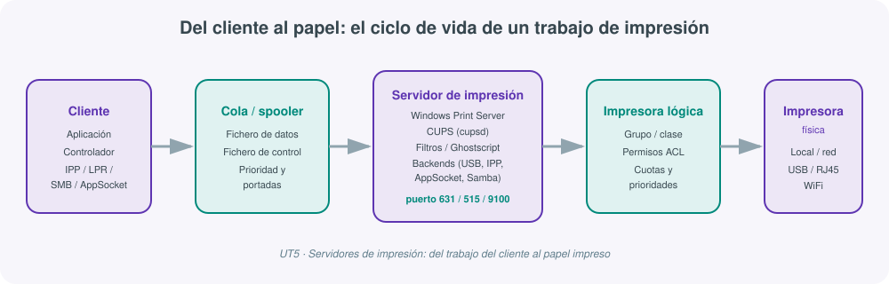
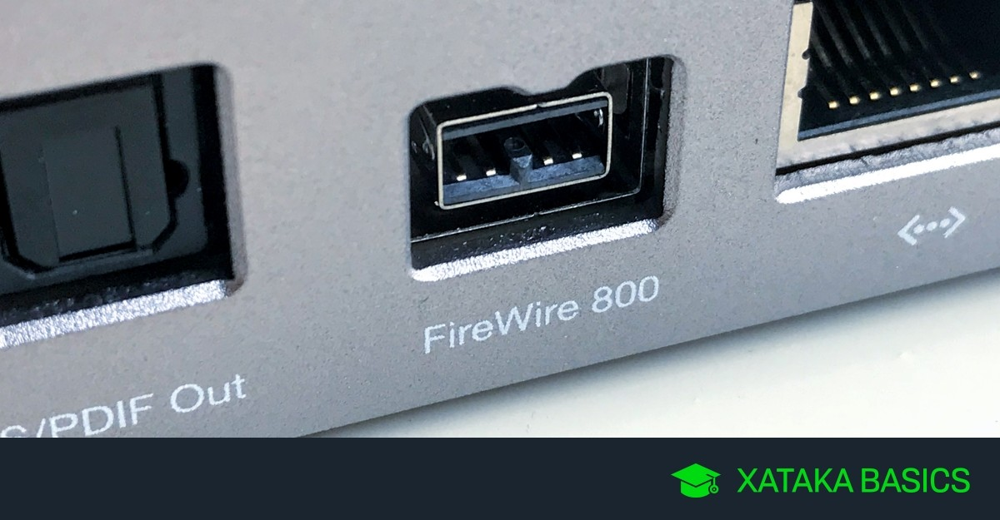
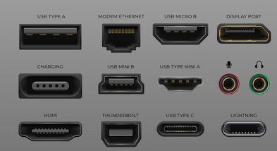
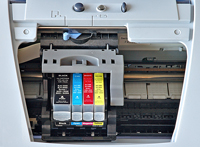
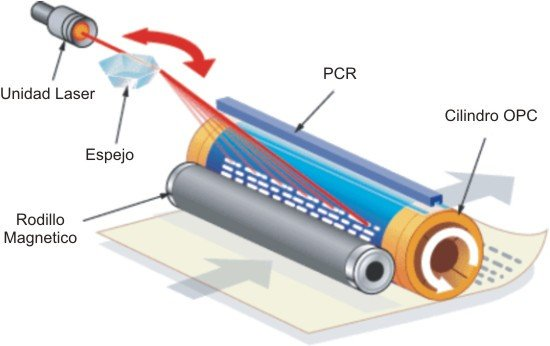
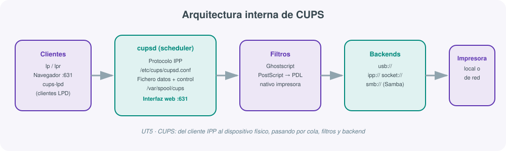

# **🖨️ UT05 · Servidores de impresión**



## Resultado de aprendizaje y criterios de evaluación

**RA5.** Administra servidores de impresión describiendo sus funciones e integrándolos en una red.

Criterios de evaluación:

a) Se ha descrito la funcionalidad de los sistemas y servidores de impresión.
b) Se han identificado los puertos y los protocolos utilizados.
c) Se han utilizado las herramientas para la gestión de impresoras integradas en el sistema operativo.
d) Se ha instalado y configurado un servidor de impresión en entorno Web.
e) Se han creado y clasificado impresoras lógicas.
f) Se han creado grupos de impresión.
g) Se han gestionado impresoras y colas de trabajos mediante comandos y herramientas gráficas.
h) Se han compartido impresoras en red entre sistemas operativos diferentes.
i) Se ha documentado la configuración del servidor de impresión y de las impresoras creadas.

## 1. Qué es un servidor de impresión y por qué existe

Imprimir un documento parece, a primera vista, una operación trivial: se pulsa "Imprimir" y el papel sale por la bandeja. Pero en cuanto ese documento tiene que viajar desde un ordenador hasta un dispositivo físico —a menudo compartido por decenas de usuarios— aparecen problemas que exigen una solución de software específica (criterio a):

- ¿Qué ocurre si dos personas envían un trabajo a la vez?
- ¿Cómo se evita que las páginas de un trabajo se mezclen con las de otro?
- ¿Qué pasa si el equipo que tiene la impresora conectada se apaga?
- ¿Cómo se controla quién puede imprimir, cuánto y con qué prioridad?

Un **servidor de impresión** es el software (y en ocasiones también el hardware) que resuelve estos problemas centralizando la gestión de las impresoras de una red: recibe los trabajos de los clientes, los organiza en una **cola de impresión**, aplica prioridades y portadas si procede, y los reenvía a la impresora física correspondiente sin que el usuario tenga que preocuparse de dónde está esa impresora ni de si el equipo que la aloja está encendido.

!!! note "¿No basta con compartir una impresora desde Windows?"
    Se puede, pero con una limitación importante: en el momento en que se apaga el equipo al que está conectada la impresora, esta deja de estar disponible para el resto de la red. Un servidor de impresión dedicado (hardware o software, siempre encendido) resuelve justo ese problema: la impresora está disponible con independencia de qué equipos clientes estén encendidos.

### Objetivos típicos de un servidor de impresión

- Centralizar la gestión de todas las impresoras de la organización desde un único punto.
- Controlar el uso por usuario, grupo o departamento (cuotas, límites, cobro por página).
- Permitir el acceso desde cualquier sistema operativo de la red (Windows, Linux, macOS, dispositivos móviles).
- Simplificar el mantenimiento: actualizar un controlador en el servidor, no en cada cliente.
- Generar informes de consumo y facilitar la auditoría del uso de recursos.

### Impresoras locales compartidas frente a impresoras de red

| Característica | Impresora local compartida | Impresora de red |
|---|---|---|
| Conexión física | A un equipo (USB, paralelo) que actúa de servidor | Tarjeta de red propia (RJ45, WiFi) |
| Disponibilidad | Depende de que el equipo esté encendido | Siempre disponible mientras tenga corriente y red |
| Gestión de permisos | El sistema operativo del equipo anfitrión | La propia impresora o un servidor de impresión dedicado |
| Escalabilidad | Limitada por la capacidad del equipo anfitrión | Mayor, pensada para muchos clientes simultáneos |
| Caso de uso típico | Oficina pequeña, aula con pocos equipos | Empresa mediana/grande, centro educativo |

### Software de servidor de impresión más habitual

| Software | Sistema | Características |
|---|---|---|
| **CUPS** | Linux/Unix | Estándar de facto en Linux; usa IPP; administración web en el puerto 631 |
| **Windows Print Server** | Windows Server | Rol integrado; gestión centralizada de colas y controladores; integración con Active Directory |
| **PaperCut** | Multiplataforma | Control de cuotas, cobro por impresión, informes de consumo; habitual en centros educativos |

### Tipos de servidores de impresión

- **Dedicados**: dispositivo físico exclusivo, con puertos Ethernet y USB/paralelo, gestión de colas y control de acceso propios.
- **Basados en software**: un equipo normal ejecuta el software de servidor (CUPS, Windows Print Server).
- **En la nube**: los trabajos viajan por Internet hasta una impresora conectada a un servicio en la nube que gestiona la cola.
- **Integrados en la impresora**: el propio dispositivo incorpora el servidor de impresión y se conecta directamente a la red.
- **Virtuales**: se ejecutan en una máquina virtual y pueden administrar trabajos de varios sistemas operativos a la vez (por ejemplo, PaperCut).

## 2. Puertos y protocolos de impresión

Para que un trabajo de impresión llegue del cliente a la impresora hace falta un canal físico y, sobre él, un protocolo lógico que empaquete y dirija los datos (criterio b).

### Puertos físicos

Los puertos físicos han evolucionado a lo largo de las décadas, y en un mismo centro de trabajo pueden convivir varias generaciones:

| Puerto | Velocidad orientativa | Situación actual |
|---|---|---|
| Serie RS232 | ~20 Kbps | Residual, en impresoras de tickets/etiquetas |
| Paralelo | Hasta 2 Mbps | Prácticamente en desuso |
| USB 2.0 / 3.0 | 480 Mbps / hasta 3.200 Mbps | El más usado en conexión local, con *hot swap* y *plug and play* |
| FireWire | 400-3.200 Mbps según versión | Poco habitual en impresoras de oficina |
| RJ45 (Ethernet) | 100/1000 Mbps | Estándar para impresoras de red |





### Puertos lógicos y protocolos

Los puertos lógicos (TCP/UDP) identifican el servicio de impresión concreto que escucha en un equipo. Los protocolos más relevantes en un servidor de impresión son:

| Protocolo | Puerto | Origen / uso principal |
|---|---|---|
| **LPD/LPR** | TCP 515 | Unix BSD clásico; separa proceso cliente (LPR) y demonio servidor (LPD) |
| **IPP** (Internet Printing Protocol) | TCP 631 | Extiende HTTP; soporta autenticación y cifrado; protocolo nativo de CUPS |
| **AppSocket** (HP Jetdirect) | TCP 9100 | Envío directo, sin traducción; simple, rápido y fiable |
| **AppleTalk** | — | Entornos Apple clásicos |
| **SMB/CIFS** | TCP 445 | Compartición de archivos e impresoras en redes Windows; también disponible en Linux vía Samba |

!!! tip "Cómo elegir protocolo en la práctica"
    En un escenario heterogéneo moderno, lo habitual es combinar **IPP** para la administración y el envío de trabajos "nativo" (CUPS y Windows lo soportan de forma directa), **SMB/CIFS** cuando el cliente es Windows y la impresora está detrás de un equipo Linux con Samba, y **AppSocket (puerto 9100)** cuando la impresora de red lo ofrece directamente sin necesidad de un servidor intermedio.

## 3. Sistemas y componentes de impresión

Antes de entrar en la configuración de cada sistema operativo conviene fijar el vocabulario común de cualquier sistema de impresión (criterio a).

### Tecnologías de impresión física

| Tecnología | Principio | Uso típico |
|---|---|---|
| Láser | Tóner fijado con calor mediante un haz láser | Oficina, alto volumen |
| Inyección de tinta | Cartuchos de tinta líquida en gotas | Doméstico, fotografía |
| Matricial | Agujas que impactan una cinta entintada | Formularios continuos, residual |
| Térmica | Calor sobre papel termosensible o transferencia de cera/tinta | Tickets, etiquetas |
| Sublimación de tinta | Tinta que pasa a gas y se fija con presión/calor | Textil, cerámica |
| Formato ancho (plotter) | Cabezal de gran recorrido | Planos, mapas, cartelería |
| Impresión 3D | Deposición de material capa a capa | Prototipado, fabricación aditiva |





### Componentes de un sistema de impresión

- **Impresora**: el dispositivo físico que transfiere el material (tinta, tóner) al medio.
- **Controlador (driver)**: traduce los datos genéricos en los comandos específicos que entiende cada modelo.
- **Medios de impresión**: papel, cartulina, etiquetas, transparencias, etc.
- **Software de diseño e impresión**: la aplicación que genera el documento origen.
- **Red de impresión**: la infraestructura (protocolos, servidor) que conecta clientes e impresoras.
- **Mantenimiento y consumibles**: tóner/tinta, limpieza de cabezales, resolución de incidencias.

### Módulos internos: spooler, filtros y backends

- **Planificador de colas (spooler)**: gestiona la cola porque la mayoría de impresoras no tienen memoria para un documento completo; monitoriza el dispositivo y envía el siguiente trabajo cuando queda libre.
- **Filtros**: traducen entre el formato de entrada (PDF, PostScript, texto) y el lenguaje propio de cada impresora, recurriendo a herramientas como Ghostscript cuando la impresora no entiende PostScript de forma nativa.
- **Backends (controladores de interfaz)**: gestionan el puerto o la conexión de red final (USB, IPP, AppSocket, SMB), con un diseño modular que permite añadir nuevas interfaces sin tocar el resto del sistema.

Este esquema —cliente → cola/spooler → filtros → backend → impresora— es exactamente el que aparece representado en el diagrama inicial de esta unidad, y es la base sobre la que se construye tanto CUPS como el servidor de impresión de Windows.

## 4. Gestión de impresoras en Windows

Windows Server ofrece un rol específico para centralizar la administración de impresoras: **Servicios de impresión y documentos** (criterios c y d).

### Instalación del rol

El rol incluye tres subcomponentes:

- **Servidor de impresión**: administración de las impresoras del servidor.
- **Impresión en Internet**: permite imprimir a través de Internet (IPP) y ofrece un sitio web para administrar los trabajos.
- **Servicio LPD**: da compatibilidad con clientes que usan LPD/LPR, típicamente sistemas Unix/Linux.

Pasos generales de configuración de un servidor de impresión Windows:

1. Instalación del rol de servidor de impresión.
2. Configuración de las impresoras (controlador, puerto).
3. Compartición de las impresoras en red.
4. Configuración de permisos de acceso.
5. Publicación en Active Directory (opcional).
6. Configuración de opciones de impresión avanzadas (opcional).
7. Administración de los trabajos de impresión.
8. Conexión y prueba desde los clientes.

Al añadir una impresora nueva al servidor, el procedimiento habitual es: instalar la impresora, localizar y agregar su controlador al almacén de drivers, crear o asignar un puerto (local o de red), comprobar el puerto y, finalmente, compartir la impresora para que los clientes del dominio puedan usarla.

### Administración por línea de comandos (PowerShell)

PowerShell permite automatizar por completo la gestión de impresoras, controladores, puertos y trabajos (criterio g), algo especialmente útil cuando se administran varios servidores o se documenta el proceso mediante scripts reproducibles:

| Comando | Función |
|---|---|
| `Add-Printer` | Agrega una nueva impresora al sistema |
| `Add-PrinterDriver` | Agrega un controlador de impresora |
| `Add-PrinterPort` | Agrega un puerto de impresora |
| `Get-Printer` | Consulta las impresoras instaladas |
| `Get-PrinterDriver` | Consulta los controladores instalados |
| `Get-PrinterPort` | Consulta los puertos disponibles |
| `Get-PrintJob` | Consulta los trabajos en curso |
| `Remove-Printer` | Elimina una impresora |
| `Restart-PrintJob` | Reinicia un trabajo en pausa o con error |
| `Resume-PrintJob` / `Suspend-PrintJob` | Reanuda o pausa un trabajo |
| `Remove-PrintJob` | Elimina un trabajo de la cola |

En un equipo local, la cola de impresión reside físicamente en `C:\WINDOWS\system32\spool\printers`, donde se almacenan tanto los ficheros de datos como los de control de cada trabajo mientras esperan a ser procesados.

### Acceso desde los clientes

Los clientes pueden conectarse a la impresora compartida de dos formas:

- Mediante navegador web, usando IPP (`http://IP_servidor/printers`), lo que además permite consultar el estado de la cola sin instalar nada.
- Añadiéndola como recurso compartido desde la propia configuración de dispositivos e impresoras del sistema operativo.

!!! example "Comprobación de la cola"
    Una forma habitual de validar que el servidor está bien configurado es poner la impresora en pausa y enviar varios archivos de prueba: si la cola se llena correctamente (visible tanto en el servidor como desde el navegador del cliente vía IPP), la configuración del spooler y del recurso compartido es correcta antes incluso de reanudar la impresión física.

## 5. Impresoras lógicas, grupos de impresión y clases

Una **impresora lógica** es la representación software de una impresora dentro del sistema operativo o del servidor de impresión: no es el dispositivo físico en sí, sino el conjunto de configuración (controlador, puerto, cola, permisos) que el sistema usa para dirigir los trabajos hacia él (criterio e).

### Clasificación de impresoras lógicas

| Clasificación | Descripción |
|---|---|
| Por conexión | Local (puerto físico del equipo) o de red (IP/puerto lógico) |
| Por controlador | Genérica/Solo texto, PostScript, PCL, específica del fabricante |
| Por disponibilidad | Predeterminada del sistema o predeterminada del usuario |
| Por estado | Activa, pausada, fuera de línea, con errores |
| Por visibilidad | Local, compartida en red, publicada en el directorio |

Separar la impresora lógica del dispositivo físico permite, entre otras cosas, definir **varias impresoras lógicas distintas apuntando a la misma impresora física**, cada una con su propia configuración: por ejemplo, una cola con prioridad alta para dirección y otra con prioridad normal para el resto de la plantilla, ambas imprimiendo en el mismo dispositivo.

### Grupos de impresión (pools) y clases

Un **grupo o pool de impresión** agrupa varias impresoras físicas bajo una única impresora lógica: los trabajos enviados a esa cola se reparten automáticamente entre las impresoras del grupo que estén libres, lo que mejora el rendimiento en entornos de alto volumen (criterio f).

- En **Windows**, esta funcionalidad se configura activando "Pool de impresoras" en las propiedades de la impresora y añadiendo los puertos de cada dispositivo físico que forma parte del grupo. Es importante que todos los dispositivos del pool acepten el mismo controlador.
- En **CUPS**, el concepto equivalente se llama **clase**: un grupo de impresoras de características similares al que se le pueden enviar trabajos como si fuera una única impresora; CUPS los redirige a la primera disponible, lo que también permite repartir la carga y aportar redundancia si una impresora falla.

!!! warning "Requisito habitual de un pool"
    Para que un pool de impresión funcione correctamente, todas las impresoras físicas del grupo deben admitir el mismo controlador (o uno compatible) y, preferiblemente, tener características similares (velocidad, formato de papel). Mezclar dispositivos muy distintos en el mismo grupo genera resultados inconsistentes según qué impresora atienda cada trabajo.

## 6. CUPS: el servidor de impresión de Linux

**CUPS** (*Common Unix Printing System*) es el sistema de impresión de referencia en Linux/Unix, construido en torno al protocolo **IPP** e integrando PostScript como lenguaje estándar de descripción de páginas (criterio d).

### Instalación y arranque del servicio

```bash
sudo apt update
sudo apt install cups
```

```bash
sudo systemctl stop cups
sudo systemctl start cups
sudo systemctl enable cups
sudo systemctl status cups
```

### Arquitectura interna



El corazón de CUPS es el demonio **`cupsd`** (el *scheduler* o planificador), que arranca con el sistema y atiende las peticiones IPP tanto locales como de clientes de red de cualquier plataforma. Por cada trabajo genera un fichero de datos y un fichero de control, almacenados en `/var/spool/cups`. Si la impresora es compatible con PostScript, interpreta los datos directamente; si no, un filtro (habitualmente apoyado en **Ghostscript**) traduce el trabajo al lenguaje propio del dispositivo.

Otras piezas relevantes de CUPS:

- **Printer browsing**: los clientes descubren automáticamente impresoras de otros servidores de la red mediante mensajes de difusión.
- **Clases**: agrupan impresoras similares (equivalente a los pools de Windows).
- **Soporte de clientes LPD**: mediante el minidemonio `cups-lpd`, que traduce peticiones LPD a IPP.
- **Administración web**: CUPS actúa también como servidor web de administración y monitorización, accesible en el puerto **631** (`http://localhost:631` en local o `http://IP_servidor:631` desde la red).

### Configuración de acceso

El fichero principal de configuración es `/etc/cups/cupsd.conf` (conviene respaldarlo antes de tocarlo). Para administrar CUPS con un usuario sin privilegios de root, este debe pertenecer al grupo `lpadmin`:

```bash
sudo usermod -aG lpadmin nombreusuario
```

Directivas de acceso habituales, situadas tras `Order allow,deny`:

| Directiva | Efecto |
|---|---|
| `Allow all` | Acceso desde cualquier origen, incluso Internet (no recomendable) |
| `Allow @LOCAL` | Acceso solo desde localhost |
| `Allow from IP` | Acceso solo desde la IP indicada |
| `Allow from IP/24` | Acceso desde toda la red local |

Para restringir la administración, configuración y consulta de registros:

```
Require user @SYSTEM
Require user @SYSTEM @lpadmin
```

En `/etc/cups/cups-files.conf` se define el grupo de administración y la ruta de los ficheros de log.

### Interfaz web de administración

Una vez arrancado y configurado el servicio, la interfaz web (puerto 631) ofrece los siguientes apartados:

| Apartado | Función |
|---|---|
| Inicio | Acceso directo a las operaciones más habituales |
| Administración | Gestión de impresoras/trabajos, edición de configuración, errores |
| Clases | Creación de grupos de impresoras (pools) |
| Ayuda en línea | Documentación oficial de CUPS |
| Trabajos | Cola de impresión, estado y eliminación de trabajos |
| Impresoras | Alta, configuración, eliminación de impresoras |

!!! tip "Impresora virtual PDF para pruebas"
    Si el servidor no dispone todavía de una impresora física, una práctica muy habitual es dar de alta una **impresora virtual PDF**: en lugar de imprimir en papel, genera un archivo PDF (por ejemplo en `/home/usuario/PDF`), lo que permite validar toda la cadena —cola, permisos, controladores— sin necesidad de hardware.

### Comandos de impresión en Linux (criterio g)

| Comando | Función |
|---|---|
| `lpr` / `lp` | Añade un documento a la cola de impresión por defecto |
| `lpq` | Muestra los trabajos en la cola |
| `lprm` / `cancel` | Cancela uno o todos los trabajos de la cola |
| `lpstat -p` | Lista impresoras configuradas y su estado |
| `lpstat -d` | Muestra la impresora predeterminada |
| `lpadmin` | Administra una impresora determinada |
| `enable` / `disable` | Habilita o deshabilita una impresora |
| `lpc` | Consulta y gestiona colas en sistemas LPD |
| `lpmove` | Mueve trabajos de una cola a otra |
| `lpoptions -d` | Establece la impresora predeterminada y sus opciones |

## 7. Compartición entre sistemas heterogéneos: Samba

En cualquier organización real conviven equipos Windows y Linux, por lo que compartir impresoras entre ambos mundos es una necesidad habitual, no una excepción (criterio h). **Samba** es el puente estándar: implementa el protocolo **SMB/CIFS** en Linux, de modo que las impresoras (y carpetas) del servidor Linux son visibles para los clientes Windows como recursos nativos.

### Instalación y arranque

```bash
sudo apt update
sudo apt install samba
```

```bash
sudo systemctl stop smbd
sudo systemctl start smbd
sudo systemctl enable smbd
sudo systemctl status smbd
```

### Configuración de un recurso compartido

El fichero `/etc/samba/smb.conf` (conviene respaldarlo antes de editarlo) define cada recurso compartido, incluidas las impresoras:

| Opción | Función |
|---|---|
| `[recurso]` | Nombre del recurso compartido |
| `browseable` | Si el recurso es visible al explorar la red (`yes`/`no`) |
| `comment` | Descripción del recurso |
| `path` | Carpeta asociada al recurso |
| `printable` | Debe ser `yes` para que el recurso funcione como impresora |
| `guest ok` | Permite o no el acceso a usuarios anónimos |
| `valid users` | Usuarios (o `@grupo`) con acceso al recurso |
| `write list` | Usuarios con permiso de escritura |
| `create mode` / `directory mode` | Permisos por defecto de ficheros/directorios creados |

Tras modificar la configuración se valida con `testparm` y se reinician los servicios antes de probar desde un cliente Windows.

### Gestión de usuarios Samba

Un usuario debe existir primero en el sistema (`useradd`) antes de poder añadirse a Samba:

```bash
smbpasswd -a nombreusuario
pdbedit -L
```

| Opción de `smbpasswd` | Efecto |
|---|---|
| `-a` | Añade un usuario |
| `-x` | Elimina un usuario |
| `-d` | Deshabilita un usuario |
| `-e` | Habilita un usuario |
| `-n` | Establece la contraseña a NULL |

!!! example "Escenario heterogéneo típico"
    Un servidor Ubuntu con CUPS gestiona la impresora física; Samba comparte esa misma cola con el resto de la red mediante SMB/CIFS, restringiendo el acceso al grupo `print`. Los clientes Linux acceden vía IPP directamente contra CUPS, mientras que los clientes Windows la ven como una impresora compartida normal a través de Samba: dos protocolos distintos convergiendo en la misma cola física, que es precisamente lo que exige el criterio (h) de esta unidad.

## 8. Seguridad, cuotas y documentación del servicio

Un servidor de impresión bien administrado no termina en "la impresora funciona": incluye control de acceso, gestión de recursos y un registro claro de lo configurado (criterio i).

### Seguridad de impresión

- **Autenticación de usuarios**: solo los usuarios/grupos autorizados pueden imprimir o administrar la cola.
- **Cifrado**: IPP sobre TLS o el uso de VPN para trabajos que viajan por redes no confiables.
- **Eliminación segura**: purgar los ficheros de trabajos confidenciales de la cola tras su impresión.
- **Restricción de la interfaz de administración**: limitar el acceso a `@LOCAL` o a la subred de administración, nunca abierta a Internet sin necesidad real.

### Gestión de cuotas y costes

Herramientas como **PaperCut** permiten limitar el número de páginas o el gasto por usuario/departamento, generar informes de consumo y aplicar políticas de impresión (por ejemplo, blanco y negro por defecto, doble cara obligatoria a partir de cierto número de páginas). Este tipo de control es habitual en centros educativos y grandes organizaciones, donde el coste de los consumibles es una partida presupuestaria relevante.

### Qué debe quedar documentado

| Elemento | Debe incluir |
|---|---|
| Servidor de impresión | Sistema operativo, rol/paquete instalado, versión, puertos abiertos |
| Impresoras lógicas | Nombre, controlador, puerto, si pertenece a un grupo/clase |
| Permisos | Usuarios/grupos con acceso de impresión y de administración |
| Compartición | Protocolo usado (IPP, SMB) y con qué sistemas operativos se ha probado |
| Pruebas realizadas | Capturas de la cola generada, desde servidor y desde cliente |

!!! note "La documentación no es un extra, es un criterio de evaluación"
    El criterio (i) de esta unidad exige explícitamente documentar la configuración del servidor y de las impresoras creadas. En la práctica de esta UT esa documentación (capturas, comandos ejecutados, decisiones tomadas) tiene el mismo peso que la propia instalación funcionando.

## 9. Resumen: qué apartado cubre cada criterio

| Criterio | Apartados relacionados |
|---|---|
| a) Funcionalidad de sistemas y servidores de impresión | 1 (servidor de impresión), 3 (sistemas y componentes) |
| b) Puertos y protocolos | 2 (puertos y protocolos) |
| c) Herramientas de gestión integradas en el SO | 4 (PowerShell), 6 (comandos CUPS) |
| d) Servidor de impresión en entorno Web | 4 (rol Windows), 6 (interfaz web CUPS) |
| e) Impresoras lógicas y su clasificación | 5 (impresoras lógicas) |
| f) Grupos de impresión | 5 (pools y clases) |
| g) Gestión de impresoras y colas por comandos/GUI | 4 (PowerShell), 6 (comandos Linux) |
| h) Compartición entre sistemas operativos diferentes | 7 (Samba) |
| i) Documentación del servidor y las impresoras | 8 (seguridad, cuotas y documentación) |

Esta tabla funciona como mapa de estudio: ante cualquier duda sobre un criterio concreto de la práctica, indica exactamente a qué apartado del temario volver.

## 10. Autoevaluación rápida

1. Explica la diferencia entre una impresora local compartida y una impresora de red. (apartado 1)
2. ¿Qué puerto usa IPP y por qué se dice que "extiende HTTP"? (apartado 2)
3. Describe el recorrido de un trabajo de impresión en CUPS desde que llega el cliente hasta que sale por la impresora. (apartado 6)
4. ¿Cuál es la diferencia entre una impresora lógica y una física? Pon un ejemplo de dos impresoras lógicas para el mismo dispositivo. (apartado 5)
5. ¿Qué papel juega Samba quiera compartir una impresora Linux con clientes Windows? (apartado 7)
6. Enumera tres elementos que debería incluir la documentación de un servidor de impresión. (apartado 8)

## Para profundizar

Esta unidad se apoya en los apuntes de clase sobre servidores de impresión Windows/Linux, ampliados con la documentación oficial de [CUPS](https://www.cups.org/){:target="_blank"} y de los roles de impresión de Windows Server. El resto de enlaces de referencia del módulo está recopilado en la página de [Recursos](99-recursos.md).
