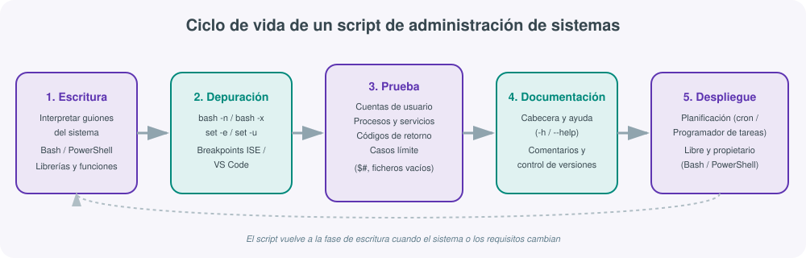
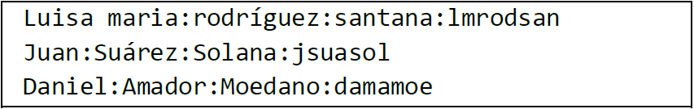
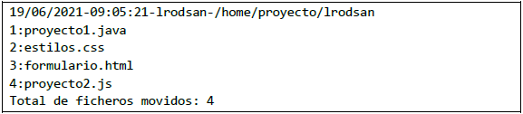
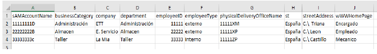
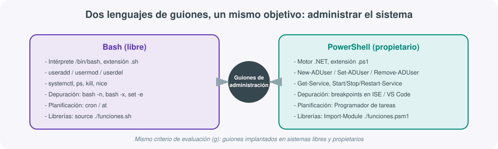

# **📜 UT07 · Scripting para la administración de sistemas**



## Resultado de aprendizaje y criterios de evaluación

**RA7.** Utiliza lenguajes de guiones en sistemas operativos, describiendo su aplicación y administrando servicios del sistema operativo.

Criterios de evaluación:

a) Se han utilizado y combinado las estructuras del lenguaje para crear guiones.
b) Se han utilizado herramientas para depurar errores sintácticos y de ejecución.
c) Se han interpretado guiones de configuración del sistema operativo.
d) Se han realizado cambios y adaptaciones de guiones del sistema.
e) Se han creado y probado guiones de administración de servicios.
f) Se han creado y probado guiones de automatización de tareas.
g) Se han implantado guiones en sistemas libres y propietarios.
h) Se han consultado y utilizado librerías de funciones.
i) Se han documentado los guiones creados.

!!! note "Dónde encontrar la sintaxis básica"
    Esta unidad da por conocida la sintaxis de las estructuras secuenciales, condicionales, repetitivas y de funciones de Bash (criterio a), así como el manejo de VSCode y Git para editar y versionar los guiones: ese contenido ya está desarrollado en detalle en [Bash · Estructuras de control y funciones](../05scripting/05bash-estructuras.md) y en [VSCode y control de versiones con Git](../05scripting/04vscode-git.md). Aquí el foco es distinto y complementario: **qué hace un administrador de sistemas** con un lenguaje de guiones una vez sabe programarlo — depurarlo, adaptarlo, documentarlo y usarlo para gestionar cuentas, procesos y servicios, tanto en sistemas libres como propietarios.

## 1. Scripting como herramienta de administración, no solo de programación

Un guion (*script*) de administración de sistemas no se escribe para "programar por programar": se escribe porque hay una tarea del sistema operativo —crear cuentas, revisar servicios, planificar copias de seguridad— que se repite y que un administrador no quiere ni debe hacer a mano cada vez. Esa es la diferencia de enfoque respecto a un curso de programación general: aquí el guion es una **pieza de infraestructura** más, igual que un servicio o una política de directorio, y como tal debe poder depurarse, adaptarse, documentarse e implantarse en distintos sistemas (criterios b, c, d, g e i).

Dos lenguajes de guiones dominan la administración de sistemas actual, uno por cada familia de sistemas operativos:

| | Bash | PowerShell |
|---|---|---|
| Familia | Sistemas libres (GNU/Linux, macOS) | Sistemas propietarios (Windows) desde 2006 |
| Extensión | `.sh` | `.ps1` |
| Intérprete | `#!/bin/bash` | Motor basado en .NET Framework |
| Unidad de comando | Comando de shell | *Cmdlet* (verbo-Nombre) |
| Orientación | Texto (flujos, tuberías) | Objetos (.NET) |
| Alta de usuario | `useradd` | `New-ADUser` / `New-LocalUser` |
| Gestión de servicio | `systemctl` | `Get-Service`, `Start-Service` |

Ninguno sustituye al otro: el criterio (g) exige explícitamente implantar guiones **tanto en sistemas libres como propietarios**, y en una infraestructura mixta (habitual en cualquier organización real) el administrador debe manejarse con soltura en los dos.

## 2. Depuración de errores sintácticos y de ejecución

El criterio (b) es, en la práctica, el que más tiempo real ocupa a un administrador: un guion casi nunca funciona a la primera, y depurarlo con las herramientas del propio sistema es más rápido que revisarlo línea a línea "a ojo".

### Depuración en Bash

| Herramienta | Qué detecta | Cuándo usarla |
|---|---|---|
| `bash -n script.sh` | Errores **sintácticos** (paréntesis, comillas, `fi`/`done` que faltan) sin ejecutar nada | Antes de ejecutar un script que toca datos reales |
| `bash -x script.sh` | Errores **de ejecución**: muestra cada línea con las variables ya expandidas, según se ejecuta | Cuando el script "hace algo raro" pero no falla con un mensaje claro |
| `set -e` (dentro del script) | Aborta el script en cuanto un comando devuelve un código de error distinto de 0 | Scripts de administración donde un fallo a medias es peor que parar |
| `set -u` | Aborta si se usa una variable no definida | Evitar borrados o acciones sobre variables vacías (`rm -rf $VAR/` sin `$VAR`) |
| `$?` | Código de retorno del último comando ejecutado (0 = correcto, >0 = error) | Comprobar si un comando de administración (crear usuario, arrancar servicio) ha tenido éxito |

```bash
#!/bin/bash
set -e   # el script se detiene si cualquier comando falla
set -u   # el script se detiene si se usa una variable no definida

bash -n copia_seguridad.sh   # comprobar sintaxis antes de ejecutar
bash -x copia_seguridad.sh   # ejecutar en modo traza para ver qué falla
```

### Depuración en PowerShell

En PowerShell la depuración se apoya en el propio entorno de edición —**PowerShell ISE** o **Visual Studio Code**— en lugar de en opciones de línea de comandos, porque ambos ofrecen depuración visual con tres tipos de puntos de interrupción (*breakpoints*):

- **Punto de interrupción de línea**: el script se pausa al llegar a la línea marcada.
- **Punto de interrupción de variable**: se pausa cuando cambia el valor de la variable indicada.
- **Punto de interrupción de comando**: se pausa justo antes de ejecutar el cmdlet indicado.

Con el script en pausa, se puede inspeccionar el valor de cualquier variable desde el panel de consola antes de continuar la ejecución paso a paso, exactamente igual que se haría con `bash -x` pero de forma visual.

!!! tip "Un error sintáctico no es lo mismo que un error de ejecución"
    Un error **sintáctico** impide que el intérprete entienda el script (falta un `fi`, una comilla sin cerrar) y se detecta sin ejecutar nada (`bash -n`). Un error **de ejecución** aparece con el script ya en marcha: el comando existe y la sintaxis es correcta, pero falla por un motivo externo (el fichero no existe, el usuario ya está creado, faltan permisos). Distinguir ambos tipos desde el principio ahorra mucho tiempo de depuración.

## 3. Interpretación y adaptación de guiones del sistema

Los criterios (c) y (d) no piden escribir guiones desde cero, sino **leer e interpretar** guiones que ya existen en el sistema operativo —o que ha escrito otro administrador— y **adaptarlos** a un nuevo requisito sin reescribirlos por completo. Es la tarea más habitual del día a día: casi ningún script de producción se escribe partiendo de cero, la mayoría son adaptaciones de uno anterior.

Para interpretar correctamente un guion de configuración del sistema conviene fijarse, en este orden:

1. **La cabecera** (`#!/bin/bash`): indica qué intérprete lo va a ejecutar.
2. **Las variables globales declaradas al principio**: qué rutas, ficheros o parámetros usa el script.
3. **Las funciones**: qué bloques de lógica son reutilizables y cuáles son específicos.
4. **El flujo principal** (normalmente al final del fichero): en qué orden se llama a cada función.

Un ejemplo real de guion de configuración adaptado a distintas necesidades es la familia de scripts de copia de seguridad (`copia-total`, `copia-diferencial`, `copia-incremental`): los tres comparten prácticamente la misma estructura de variables (fecha, ruta de ficheros, directorio a copiar) y solo cambia la lógica de qué se considera "modificado desde la última copia":

```bash
#!/bin/bash
############################################################
# INICIO VARIABLES
############################################################
FECHA=$(date +%Y.%m.%d-%H.%M.%S)
RUTA_FICHEROS=/root/copia_seguridad
FICHERO_ULTIMA_COPIA_TOTAL=$RUTA_FICHEROS/.ultima_copia_total
FICHERO_COMPRIMIDO=$RUTA_FICHEROS/total-$FECHA.tar.zip
DIRECTORIO_A_COPIAR=~/carpeta_a_copiar
############################################################
# FIN VARIABLES
############################################################

# si no existe el directorio de los ficheros lo creamos
[ -d $RUTA_FICHEROS ] || mkdir -p $RUTA_FICHEROS

# guardar la fecha de la última copia total
echo $FECHA > $FICHERO_ULTIMA_COPIA_TOTAL

# empaquetamos y comprimimos el directorio a copiar
tar -czf $FICHERO_COMPRIMIDO $DIRECTORIO_A_COPIAR
```

**Adaptar** este guion a la variante diferencial (criterio d) consiste en añadir una segunda variable de control (`FICHERO_ULTIMA_COPIA_DIFERENCIAL`) y sustituir `tar -czf` por una búsqueda de ficheros modificados desde esa fecha (`find ... -newer $FICHERO_ULTIMA_COPIA_TOTAL`), sin tocar el resto de la estructura. Es exactamente el tipo de adaptación que se pide en la práctica de esta unidad.

## 4. Scripts de administración de cuentas de usuario

El criterio (e) —guiones de administración de servicios— y el (f) —automatización de tareas— aparecen de forma muy clara en uno de los escenarios más frecuentes: automatizar el alta y la baja masiva de cuentas de usuario a partir de un fichero de datos.

### Alta masiva desde un fichero de texto (Bash)

Un patrón habitual es leer un fichero con un usuario por línea, con los campos separados por `:` o `;`, y crear la cuenta correspondiente con `useradd`:



```bash
#!/bin/bash
# altas.sh - crea una cuenta por cada línea del fichero de entrada
# Formato esperado: Nombre:Apellido1:Apellido2:login

FICHERO=$1

if [ ! -f "$FICHERO" ]; then
    echo "El fichero $FICHERO no existe." >&2
    exit 1
fi

while IFS=':' read -r nombre ap1 ap2 login; do
    if id "$login" &>/dev/null; then
        echo "$(date '+%d/%m/%Y %H:%M') - $login - ERROR: el usuario ya existe" >> altaerror.log
    else
        useradd -m -c "$nombre $ap1 $ap2" "$login"
        echo "$(date '+%d/%m/%Y %H:%M') - $login - OK: usuario creado" >> alta.log
    fi
done < "$FICHERO"
```

### Baja de usuarios con registro de errores

En una baja masiva, el requisito habitual no es solo borrar la cuenta, sino **no detener el proceso** si un login no existe, y dejar constancia del error para revisarlo después:


```bash
#!/bin/bash
# bajas.sh - da de baja cada login del fichero, registrando los que no existen
while read -r login; do
    if id "$login" &>/dev/null; then
        userdel -r "$login"
    else
        echo "$(date '+%d/%m/%Y-%H:%M:%S')-$login-ERROR:login no existe en el sistema" >> bajaerror.log
    fi
done < "$1"
```

### El mismo problema en PowerShell, sobre Active Directory

El equivalente en un dominio Windows sustituye `useradd`/`userdel` por los cmdlets del módulo `ActiveDirectory`, y el fichero de texto por un CSV con columnas con nombre (más cómodo de mantener):



```powershell
# altas.ps1 - alta masiva de usuarios desde un CSV
Import-Csv .\altas.csv | ForEach-Object {
    if (Get-ADUser -Filter "SamAccountName -eq '$($_.sAMAccountName)'") {
        [PSCustomObject]@{
            Fecha = Get-Date -Format "dd/MM/yyyy HH:mm"
            sAMAccountName = $_.sAMAccountName
            Error = "Usuario ya existe"
        } | Export-Csv -Path .\altaerror.csv -Append -NoTypeInformation
    } else {
        New-ADUser -SamAccountName $_.sAMAccountName `
                   -Name $_.sAMAccountName `
                   -Department $_.department `
                   -Path "OU=$($_.department),DC=instituto,DC=local" `
                   -Enabled $true
    }
}
```

Y del mismo modo, el registro de errores de una baja (usuario que no existe) se documenta de forma equivalente, cambiando el flujo de texto de Bash por objetos exportados a CSV:



!!! example "Mismo criterio, dos sistemas"
    Este es el ejemplo más directo del criterio (g) — implantar guiones en sistemas libres y propietarios: el problema de negocio (alta/baja masiva de cuentas con registro de errores) es idéntico en ambos casos, solo cambia el lenguaje y el cmdlet/comando concreto.

## 5. Scripts de administración de procesos y servicios

El criterio (e) menciona explícitamente "guiones de administración de servicios". El patrón clásico en Bash es un script tipo *init* con las acciones `start`, `stop`, `restart` y `status`, apoyado en un fichero PID:

```bash
#!/bin/bash
# servicio-alerta.sh start|stop|restart|status

DAEMON=alerta
PIDFILE=/tmp/$DAEMON.pid

function do_start() {
    if [ -e $PIDFILE ]; then
        echo "El proceso ya se está ejecutando."
        exit 0
    fi
    ./$DAEMON &
    echo $! > $PIDFILE
    echo "Ejecutándose..."
}

function do_stop() {
    if [ -e $PIDFILE ]; then
        kill -9 $(cat $PIDFILE)
        rm $PIDFILE
    fi
    echo "Parado."
}

function do_status() {
    if [ -e $PIDFILE ]; then
        echo "Ejecutándose..."
    else
        echo "Parado."
    fi
}

case $1 in
    start)   do_start ;;
    stop)    do_stop ;;
    restart) do_stop; do_start ;;
    status)  do_status ;;
    *)       echo "Parámetro '$1' incorrecto." ;;
esac
```

Este mismo patrón, en un sistema con `systemd`, se apoya directamente en el comando ya integrado en el sistema en lugar de gestionar el PID a mano:

```bash
systemctl start alerta.service
systemctl status alerta.service
systemctl restart alerta.service
```

En PowerShell, el equivalente funcional usa los cmdlets `Get-Service` / `Start-Service` / `Stop-Service` / `Restart-Service`, que ya reciben el nombre del servicio como objeto en lugar de tener que leerlo de un fichero PID:

```powershell
# servicio.ps1 start|stop|restart|status -Nombre <servicio>
param(
    [string]$Accion,
    [string]$Nombre
)

switch ($Accion) {
    "start"   { Start-Service -Name $Nombre }
    "stop"    { Stop-Service -Name $Nombre }
    "restart" { Restart-Service -Name $Nombre }
    "status"  { Get-Service -Name $Nombre | Select-Object Name, Status }
    default   { Write-Host "Acción '$Accion' incorrecta." }
}
```

| | Bash / systemd | PowerShell |
|---|---|---|
| Consultar estado | `systemctl status <servicio>` | `Get-Service -Name <servicio>` |
| Arrancar | `systemctl start <servicio>` | `Start-Service -Name <servicio>` |
| Parar | `systemctl stop <servicio>` | `Stop-Service -Name <servicio>` |
| Reiniciar | `systemctl restart <servicio>` | `Restart-Service -Name <servicio>` |
| Ver procesos en ejecución | `ps aux`, `jobs` | `Get-Process` |
| Matar un proceso | `kill -9 <PID>` | `Stop-Process -Id <PID>` |

## 6. Uso de librerías y funciones

El criterio (h) exige consultar y utilizar **librerías de funciones**, es decir, no reescribir la misma lógica en cada script sino extraerla a un fichero aparte y reutilizarla. La diferencia entre una función local y una librería es precisamente esa: la librería vive en su propio fichero y se "importa" en cualquier script que la necesite.

### Bash: `source` de un fichero de funciones

```bash
# funciones.sh - librería reutilizable
function es_bisiesto() {
    local anio=$1
    if (( anio % 4 == 0 && ( anio % 100 != 0 || anio % 400 == 0 ) )); then
        return 0   # true
    else
        return 1   # false
    fi
}

function log_evento() {
    local mensaje=$1
    echo "$(date '+%d/%m/%Y %H:%M:%S') - $mensaje" >> /var/log/mis_scripts.log
}
```

```bash
#!/bin/bash
# script principal que reutiliza la librería
source ./funciones.sh   # también válido: . ./funciones.sh

if es_bisiesto 2028; then
    log_evento "2028 es bisiesto"
fi
```

### PowerShell: módulos (`.psm1`) e `Import-Module`

```powershell
# Funciones.psm1 - librería reutilizable
function Test-PasswordValida {
    param([string]$Password)
    return $Password -match '(?=.*[a-z])(?=.*[A-Z])(?=.*\d)(?=.*[\W_]).{8,}'
}

Export-ModuleMember -Function Test-PasswordValida
```

```powershell
# script principal
Import-Module .\Funciones.psm1

if (Test-PasswordValida -Password $nuevaClave) {
    Set-ADAccountPassword -Identity $usuario -NewPassword (ConvertTo-SecureString $nuevaClave -AsPlainText -Force)
} else {
    Write-Host "La contraseña no cumple los requisitos de complejidad."
}
```

!!! note "Librerías del propio sistema, no solo propias"
    El criterio (h) también cubre **consultar** librerías ya existentes en el sistema: en Bash, comandos como `awk` o `sed` son en la práctica pequeñas librerías de procesamiento de texto invocadas desde el script (como en el ejemplo de validación de expresiones con `awk` de la chuleta de shell script); en PowerShell, los módulos `ActiveDirectory` o `Microsoft.PowerShell.Management` son librerías del propio sistema que se importan con `Import-Module` antes de poder usar sus cmdlets.

## 7. Automatización de tareas repetitivas: planificación

El criterio (f) —guiones de automatización de tareas— se completa casi siempre con un mecanismo de **planificación**, para que el script se ejecute solo, sin intervención del administrador.

| | Bash / Linux | PowerShell / Windows |
|---|---|---|
| Herramienta | `cron` (recurrente), `at` (puntual) | Programador de tareas / `Register-ScheduledTask` |
| Fichero de configuración | `crontab -e` | Interfaz gráfica o cmdlets `ScheduledTasks` |
| Formato | `minuto hora día mes día-semana comando` | Disparador (*trigger*) + acción |

```
# crontab: copia diferencial cada día laborable a las 23:30
30 23 * * 1-5 /root/scripts/copia-diferencial.sh
```

```powershell
# Tarea programada equivalente en PowerShell
$trigger = New-ScheduledTaskTrigger -Daily -At 23:30
$action  = New-ScheduledTaskAction -Execute "PowerShell.exe" -Argument "-File C:\Scripts\copia-diferencial.ps1"
Register-ScheduledTask -TaskName "CopiaDiferencial" -Trigger $trigger -Action $action -RunLevel Highest
```

## 8. Scripts multiplataforma: libres y propietarios

El criterio (g) pide explícitamente implantar guiones **en sistemas libres y propietarios**, lo que no significa escribir el mismo código dos veces sin pensar, sino entender qué parte de la lógica es trasladable y cuál depende del sistema operativo concreto.



| Aspecto | Se traslada igual | Cambia por sistema |
|---|---|---|
| Lógica de negocio (validaciones, formato de datos, orden de pasos) | Sí | — |
| Estructuras de control (secuencial, condicional, repetitiva, funciones) | El razonamiento sí, la sintaxis no | Sintaxis específica de cada lenguaje |
| Comandos de gestión de cuentas/servicios | No | `useradd`/`systemctl` frente a `New-ADUser`/`Get-Service` |
| Planificación | El concepto sí | `cron` frente a Programador de tareas |
| Depuración | El concepto sí | `bash -x`/`bash -n` frente a breakpoints en ISE/VS Code |

!!! warning "No es traducción literal"
    Un error habitual al adaptar un guion de Bash a PowerShell (o viceversa) es traducir comando a comando de forma literal. PowerShell trabaja con **objetos**, no con texto plano: `Get-Service | Where-Object Status -eq "Running"` no es un "grep de la salida de un comando", es un filtro sobre objetos con propiedades tipadas. Adaptar bien un guion (criterio d) significa entender la filosofía del lenguaje de destino, no solo sustituir palabras clave.

## 9. Documentación de los guiones

El criterio (i) —documentar los guiones creados— es el que con más frecuencia se pasa por alto bajo presión de tiempo, y es también el primero que se penaliza en cualquier auditoría de sistemas. Un guion de administración bien documentado incluye, como mínimo:

1. **Cabecera** con el propósito del script, el autor y la fecha.
2. **Función de ayuda** invocable con `-h` o `--help`, que describa la sintaxis y los códigos de retorno.
3. **Comentarios en cada bloque de variables y en cada función**, no solo en líneas sueltas de código.
4. **Registro de ejecución (log)** cuando el script actúa sobre datos reales (altas, bajas, copias de seguridad).

```bash
#!/bin/bash
# altas.sh - da de alta usuarios desde un fichero de texto
# Autor: Departamento de sistemas | Fecha: 2026

function ayuda() {
    cat << FIN_AYUDA
SYNOPSIS
    $0 fichero_altas

DESCRIPCION
    Da de alta un usuario por cada línea de fichero_altas.

CODIGOS DE RETORNO
    0 Si no hay ningún error.
    1 Si el fichero de entrada no existe.
FIN_AYUDA
}

if [ "$1" == "-h" ] || [ "$1" == "--help" ]; then
    ayuda
    exit 0
fi
```

!!! tip "El control de versiones también es documentación"
    Llevar el histórico de cambios de un script en un repositorio Git (visto con detalle en [VSCode y control de versiones con Git](../05scripting/04vscode-git.md)) es, en la práctica, la forma más robusta de documentar **por qué** un guion cambió de una versión a otra: el mensaje de cada commit explica la adaptación (criterio d) mejor que cualquier comentario suelto dentro del propio fichero.

## 10. Errores habituales al depurar y adaptar guiones de administración

| Síntoma | Causa probable | Herramienta para confirmarlo |
|---|---|---|
| El script no arranca, "command not found" | Falta el shebang o los permisos de ejecución (`chmod +x`) | `bash -n script.sh` |
| El script borra o crea algo con nombre vacío | Variable no definida usada sin comprobar (`$1` sin validar `$#`) | `set -u`, `bash -x` |
| El script de alta falla a mitad de fichero | Un usuario ya existente detiene todo el bucle | Revisar el código de retorno de `useradd` con `$?`, no detener el bucle completo |
| El script en PowerShell "no filtra nada" | Se trata la salida de un cmdlet como texto en lugar de como objetos | Revisar con `Get-Member` las propiedades reales del objeto devuelto |
| Un cron no ejecuta el script aunque funciona a mano | El PATH y las variables de entorno de cron son distintos a los de la sesión interactiva | Usar rutas absolutas dentro del script y comprobar `/var/log/syslog` o `/var/log/cron` |

## Para profundizar

Esta unidad se ha construido reorganizando el material de clase de scripting de ADD, con especial atención a los ejercicios de shell script de Adolfo Sanz De Diego (licencia CC-BY-SA) y a los supuestos prácticos de administración de cuentas en PowerShell/Active Directory trabajados en clase. Para la sintaxis de base de Bash (estructuras secuenciales, condicionales, repetitivas y funciones) y para el flujo de trabajo con VSCode y Git, consulta [Bash · Estructuras de control y funciones](../05scripting/05bash-estructuras.md) y [VSCode y control de versiones con Git](../05scripting/04vscode-git.md). El resto de enlaces de referencia está recopilado en la página de [Recursos](99-recursos.md).
