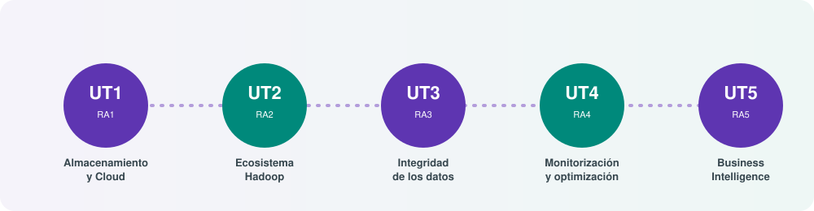

# **🚀 Big Data Aplicado (BIU)**

## Bienvenida

Este bloque de apuntes corresponde al módulo profesional **Big Data aplicado** (código **5075**, 8 créditos ECTS, 75 horas) del **Curso de Especialización en Inteligencia Artificial y Big Data**, regulado por el [Real Decreto 279/2021, de 20 de abril](https://www.boe.es/eli/es/rd/2021/04/20/279){:target="_blank"}.

A lo largo del módulo vamos a responder a una pregunta muy concreta: **¿cómo convierte una organización un volumen masivo de datos en decisiones de negocio?** Para contestarla recorreremos todo el ciclo de vida del dato: cómo se almacena de forma masiva, qué ecosistema de herramientas lo procesa de forma distribuida, cómo se garantiza que esos datos siguen siendo fiables, cómo se vigila que el sistema funcione con estabilidad y, por último, cómo se explota toda esa información para tomar decisiones mediante técnicas de Inteligencia de Negocio (*Business Intelligence*, BI).

## Cómo está organizado el módulo

El currículo oficial define **cinco resultados de aprendizaje (RA)**, y en este material cada uno se corresponde con una **Unidad de Trabajo (UT)**. Es una equivalencia 1:1: aprobar una UT significa haber alcanzado su RA correspondiente.

| UT | Resultado de aprendizaje (resumen) | Contenido principal |
|---|---|---|
| **UT1** | Gestiona soluciones a problemas propuestos utilizando sistemas de almacenamiento y herramientas del centro de datos | Almacenamiento masivo, procesamiento, analítica y *Cloud* |
| **UT2** | Gestiona sistemas de almacenamiento y el ecosistema Big Data | Computación distribuida, HDFS, MapReduce, Hive, Pig, Sqoop, Flume |
| **UT3** | Genera mecanismos de integridad de los datos en sistemas de ficheros distribuidos | Calidad del dato, sumas de verificación, migración entre clústeres |
| **UT4** | Realiza el seguimiento de la monitorización de un sistema | Herramientas de monitorización, históricos, estabilidad del servicio |
| **UT5** | Valida técnicas Big Data para la toma de decisiones en BI | Modelos de negocio, proceso KDD, cuadros de mando |

Para cada UT encontrarás siempre **tres documentos**:

1. **Temario**: el contenido teórico, con el nivel de un curso de especialización de grado superior. No es una simple definición de conceptos: se explica el porqué de cada tecnología, sus alternativas y, cuando corresponde, se avisa si una herramienta ha quedado obsoleta en la industria actual (el Big Data es un campo que evoluciona muy rápido).
2. **Práctica**: una actividad guiada para aplicar lo aprendido, con un enunciado, unos pasos orientativos y unos entregables concretos.
3. **Rúbrica**: los criterios con los que se evalúa la práctica y, por extensión, el grado de consecución del RA, siempre alineados con los criterios de evaluación oficiales del Real Decreto.

## Cómo aprovechar estos apuntes

Estos apuntes están pensados para leerse de forma secuencial (UT1 → UT5), ya que cada unidad da por hecho lo aprendido en la anterior: por ejemplo, en la UT3 se asume que ya sabes desplegar y usar HDFS porque se trabajó en la UT2. Aun así, cada temario puede consultarse también de forma puntual como referencia técnica.

Como complemento, se recomienda consultar el magnífico repositorio de apuntes [IABD de Aitor Medrano](https://aitor-medrano.github.io/iabd/){:target="_blank"}, una referencia viva y muy actualizada sobre Big Data e Inteligencia Artificial en Formación Profesional, con la que estos apuntes comparten espíritu (aunque no contenido literal: cada explicación y cada práctica de este módulo están adaptadas a nuestro propio ritmo de clase, a nuestros ejercicios y a nuestra forma de evaluar).

Al final del bloque encontrarás una página de **recursos** con enlaces externos organizados por unidad, para quien quiera profundizar más allá del temario.

!!! note "Una advertencia sobre las tecnologías"
    El currículo oficial (2021) menciona herramientas como *Pig*, *Flume* u *Oozie*. Se explican porque forman parte del temario oficial y porque entender su función ayuda a entender el ecosistema Hadoop en su conjunto, pero en la industria actual han sido en buena medida sustituidas por alternativas más modernas (Spark, Kafka/NiFi y Airflow, respectivamente). En cada caso se indicará expresamente si una tecnología está en desuso y cuál es su alternativa actual.
