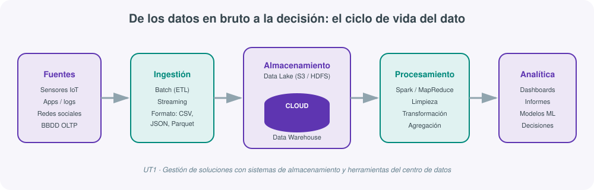

# **📦 UT01 · Gestión de soluciones con sistemas de almacenamiento y herramientas del centro de datos**

## Resultado de aprendizaje y criterios de evaluación

**RA1.** Gestiona soluciones a problemas propuestos, utilizando sistemas de almacenamiento y herramientas asociadas al centro de datos.

Criterios de evaluación:

a) Se ha caracterizado el proceso de diseño y construcción de soluciones en sistemas de almacenamiento de datos.
b) Se han determinado los procedimientos y mecanismos para la ingestión de datos.
c) Se ha determinado el formato de datos adecuado para el almacenamiento.
d) Se han procesado los datos almacenados.
e) Se han presentado los resultados y las soluciones al cliente final en una forma fácil de interpretar.

## 1. De los datos a la decisión

Antes de hablar de tecnología conviene fijar una idea que sostiene todo el módulo: una organización no invierte en Big Data porque le guste acumular datos, sino porque necesita **tomar mejores decisiones**. Datos, información y conocimiento son tres cosas distintas que se encadenan:

- **Dato**: un valor aislado, sin contexto. La nota de un examen: un 3.
- **Información**: el dato ya elaborado y con significado. La nota final de la asignatura tras aplicar los pesos de cada evaluación: un 4.
- **Conocimiento**: la regla que convierte información en un juicio útil. "Si la nota final es menor que 5, la asignatura está suspensa".
- **Decisión**: la acción que se deriva de aplicar ese conocimiento a un caso concreto.

Esta cadena se repite en cualquier proyecto de Big Data, desde detectar si una cuenta de una red social pertenece a un bot hasta decidir cuánto stock pedir para la campaña de Navidad. Lo que cambia entre un caso y otro no es el esquema (dato → información → conocimiento → decisión), sino la escala: cuando los datos de partida son heterogéneos, llegan a gran velocidad y en volúmenes que ningún analista puede repasar a mano, se necesita una infraestructura tecnológica capaz de sostener ese proceso. Esa infraestructura es, precisamente, el objeto de esta unidad.

## 2. El desequilibrio entre datos y tecnología

El campo del Big Data existe por un desajuste concreto: la generación de datos crece de forma exponencial (sensores cada vez más baratos, aplicaciones que registran cada clic, dispositivos conectados), mientras que las soluciones tecnológicas capaces de procesar y analizar ese volumen de forma ágil avanzan a un ritmo más lento y con un coste mayor. En otras palabras: **es más fácil generar datos que sacarles partido**. Ese desajuste obliga a diseñar arquitecturas de almacenamiento y procesamiento pensadas específicamente para escalar, en lugar de confiar en que "ya escalará" el sistema que ya teníamos.

Para caracterizar qué hace que un conjunto de datos sea "Big Data" (criterio a: caracterizar el diseño de la solución empieza por caracterizar el problema), distintos autores usan modelos de "V". Además de las clásicas Volumen/Velocidad/Variedad, es habitual encontrar variantes centradas en la calidad y utilidad del dato:

| V | Pregunta que responde |
|---|---|
| **Validez** | ¿El dato es preciso para el uso que le queremos dar? |
| **Valor** | ¿Aporta esta información algo útil para decidir? |
| **Variabilidad** | ¿Cuántas variables y qué complejidad tiene el conjunto de datos? |
| **Veracidad** | ¿Podemos confiar en el origen del dato? ¿Cuánta incertidumbre tiene? |
| **Volatilidad** | ¿Durante cuánto tiempo sigue siendo válido y hay que conservarlo? |

No hace falta memorizar una lista cerrada de "Vs" (hay autores que hablan de 5, otros de 7, otros de 10 incluyendo términos como *visualización* o *vulnerabilidad*): lo importante es entender que todas responden a la misma pregunta de fondo — ¿qué hace difícil trabajar con este conjunto de datos con las herramientas de toda la vida?

## 3. Almacenamiento de datos masivo

### Data Warehouse, Data Lake y el desacoplamiento cómputo/almacenamiento

La primera decisión de diseño de cualquier solución de almacenamiento (criterio a) es elegir **cómo se va a organizar** el dato, no solo dónde. Existen dos filosofías clásicas y una tercera que las combina:

- **Data Warehouse** (almacén de datos): según la definición clásica de W. Inmon, es una colección de datos "orientada a temas, integrada, variante en el tiempo y no volátil, que da soporte al proceso de toma de decisiones". Es decir: los datos ya están limpios, tienen un esquema definido antes de guardarlos (*schema-on-write*) y están organizados por áreas de negocio (ventas, clientes, productos) en lugar de por proceso transaccional. Es el entorno natural para BI y reporting: analistas y dirección, consultas complejas, coste más alto.
- **Data Lake**: almacena el dato en su formato original, estructurado o no, sin exigir un esquema previo (*schema-on-read*, el esquema se aplica al leer, no al escribir). Es más barato y flexible, pensado para exploración, ciencia de datos y Big Data, y lo usan sobre todo perfiles técnicos (ingenieros, científicos de datos).

| Característica | Data Lake | Data Warehouse |
|---|---|---|
| Tipo de datos | En bruto, cualquier formato | Estructurados y limpios |
| Finalidad | Exploración, ML, Big Data | BI, informes, análisis empresarial |
| Esquema | *Schema-on-read* | *Schema-on-write* |
| Coste | Más económico | Más costoso |
| Velocidad de consulta | Depende del procesamiento posterior | Alta, optimizada |
| Usuarios típicos | Científicos de datos, ingenieros | Analistas, dirección |
| Ejemplos | Amazon S3, Azure Data Lake, HDFS | BigQuery, Redshift, Snowflake |

En 2026, la tendencia dominante ya no es "elegir uno de los dos", sino separar **cómputo** y **almacenamiento**: los datos viven en almacenamiento de objetos barato (S3, Azure Blob, GCS) y distintos motores de cómputo (Spark, motores SQL serverless) leen directamente de ahí, sin tener que "cargar" antes el dato en un sistema propietario. Formatos de tabla abiertos como **Delta Lake**, **Apache Iceberg** o **Apache Hudi** añaden sobre ese almacenamiento transacciones ACID, control de versiones y evolución de esquema, dando lugar a lo que se conoce como arquitectura **Lakehouse**: el coste y la flexibilidad de un data lake con las garantías de un data warehouse.

### OLTP frente a OLAP

Un error habitual de quien empieza en este campo es intentar hacer analítica pesada directamente sobre la base de datos que sostiene la aplicación de producción. Conviene distinguir dos mundos:

| Característica | OLTP (operacional) | OLAP (analítico) |
|---|---|---|
| Propósito | Operaciones y transacciones diarias | Análisis estratégico y *reporting* |
| Consultas | Simples, cortas, muy frecuentes (`INSERT`, `UPDATE`, `DELETE`) | Complejas, largas, poco frecuentes (`SELECT` con agregaciones) |
| Origen del dato | Tiempo real, una sola fuente | Histórico y consolidado, múltiples fuentes |
| Estructura | Normalizada (3FN) | Desnormalizada (estrella / copo de nieve) |
| Unidad de trabajo | Una transacción (un cargo en un cajero) | Una consulta agregada (ventas por región y trimestre) |
| Volumen | Menor (GB) | Mayor (TB/PB) |

Separar ambos mundos —dejando el sistema transaccional (OLTP) intacto y volcando periódicamente su información a un entorno analítico (OLAP)— es precisamente lo que resuelve un proceso ETL, y es la base de por qué el criterio (b) exige determinar "los procedimientos y mecanismos para la ingestión de datos": sin un proceso de ingesta bien diseñado, cualquier análisis serio termina degradando el sistema que da servicio a los clientes.

## 4. El proceso ETL: extracción, transformación y carga

El proceso ETL (*Extract, Transform, Load*) es el mecanismo estándar para mover datos desde sus sistemas de origen hasta un almacén analítico, y responde directamente al criterio (b) de esta unidad.

### Extracción

Consiste en leer los datos de origen **sin modificarlos todavía**. En Big Data esta fase debe ser robusta porque las fuentes son heterogéneas: bases de datos relacionales, APIs REST, ficheros CSV/JSON/XML, sensores IoT, logs, portales de datos abiertos. Se distingue entre:

- **Extracción estática (carga inicial)**: se importa todo el histórico la primera vez, típicamente al construir un nuevo Data Lake o Data Warehouse.
- **Extracción incremental**: tras la carga inicial, solo se extraen los cambios (registros nuevos o modificados), usando marcas de tiempo, campos `last_modified` o registros de auditoría.

Un aspecto que se pasa por alto con frecuencia es la **licencia de uso** de los datos: los conjuntos abiertos pueden estar bajo licencias como CC-BY o CC0, mientras que otros restringen el uso comercial o la redistribución. Antes de construir cualquier solución hay que verificar que el dato puede reutilizarse legalmente en el contexto en el que se va a explotar.

### Transformación

Es la fase donde se decide, de forma justificada, **qué formato de almacenamiento** es el adecuado (criterio c) y se corrige la calidad del dato. Dos bloques de tareas:

- **Limpieza**: gestión de valores perdidos (eliminar filas, imputar con media/mediana, o recuperar el dato de la fuente) y detección de valores atípicos (*outliers*) mediante rango intercuartílico, desviación estándar o reglas de negocio.
- **Manipulación**: discretización de variables continuas en categorías (edad → tramos), selección de características relevantes, normalización de escalas, codificación de variables categóricas y creación de variables derivadas (una fecha completa → mes/trimestre).

### Carga

Los datos ya transformados se persisten en el destino final. Puede ser una **carga inicial** (todo el histórico, coste computacional alto, se hace en horas de baja carga) o una **carga incremental** (solo los deltas desde la última actualización, más eficiente). Tras cargar, siempre debe hacerse una **validación post-carga**: recuentos de registros, comprobaciones de integridad, controles de calidad en destino — este control de calidad es justo lo que en la UT3 desarrollaremos con más profundidad como mecanismo formal de integridad del dato.

!!! note "Herramientas ETL"
    Herramientas visuales como **Pentaho Data Integration** (también conocida como Kettle) permiten diseñar estos flujos arrastrando y soltando componentes en su editor gráfico (Spoon), sin programar cada paso a mano, conectando con bases de datos, ficheros planos, APIs REST o el propio HDFS. En arquitecturas cloud-native modernas, esta misma función la cubren servicios gestionados como **AWS Glue** (que integra un catálogo de metadatos, un motor de ETL basado en Spark y un programador de tareas) o pipelines de código escritos directamente con PySpark, orquestados con Apache Airflow (lo veremos en la UT2).

## 5. Modelado dimensional: esquema en estrella y copo de nieve

Una vez decidido que el destino es un Data Warehouse, hay que decidir cómo se organizan las tablas para que las consultas analíticas sean rápidas e intuitivas. El **diseño en estrella** organiza la información en torno a:

- Una **tabla de hechos**, con las medidas numéricas del negocio (importe, cantidad, tiempo de proceso), que deben ser coherentes con la granularidad elegida (una fila = una venta, un ticket, un día agregado...).
- Varias **tablas de dimensión**, con los atributos descriptivos que dan contexto a esos hechos (fecha, cliente, producto, tienda), permitiendo navegar jerarquías como año → mes → día.

El **diseño en copo de nieve** es una variante que normaliza las dimensiones en varias tablas relacionadas entre sí, reduciendo la redundancia a costa de consultas con más combinaciones (`JOIN`). En la práctica, el esquema en estrella es más habitual porque prioriza la velocidad de consulta, mientras que el copo de nieve se reserva para dimensiones muy grandes con jerarquías complejas donde la integridad importa más que la velocidad.

## 6. Formatos de datos: la decisión que más impacta en el rendimiento

El criterio (c) —determinar el formato adecuado para el almacenamiento— es, en la práctica, una de las decisiones con mayor impacto económico en un proyecto Big Data real.

| Formato | Orientación | Ventaja principal | Cuándo usarlo |
|---|---|---|---|
| CSV / JSON | Fila, texto plano | Legible, universal, fácil de generar | Ingesta inicial, intercambio entre sistemas, APIs |
| Avro | Fila, binario | Esquema embebido, buena escritura | Streaming, mensajería (Kafka) |
| **Parquet** | Columna, binario | Compresión y lectura selectiva de columnas | Analítica, consultas sobre pocas columnas de tablas anchas |
| ORC | Columna, binario | Similar a Parquet, muy ligado a Hive | Analítica dentro del ecosistema Hadoop/Hive |

La diferencia entre formato de fila y de columna no es un detalle académico: si una tabla tiene 50 columnas y una consulta analítica solo necesita 3, un formato columnar como Parquet permite leer únicamente esas 3 columnas del disco (u objeto S3), mientras que en CSV habría que leer la fila completa igualmente. En un motor serverless como AWS Athena, que factura por dato escaneado, esa diferencia se traduce directamente en la factura mensual, no solo en tiempo de respuesta.

También conviene mencionar los formatos semiestructurados clásicos:

- **XML**: legible, extensible (etiquetas personalizables), con validación estricta mediante DTD/XSD. Sigue apareciendo en sistemas heredados de administración pública, banca y telecomunicaciones; en Big Data suele importarse a un data lake para procesarlo con Spark o Hive cuando la organización de origen todavía trabaja con documentos XML.
- **JSON**: más compacto, sin necesidad de etiquetas de cierre, con tipos nativos (números, booleanos, listas). Es el formato estándar de APIs REST modernas, de la ingesta en streaming (Kafka, Kinesis) y del almacenamiento NoSQL (MongoDB, Elasticsearch). Spark lo reconoce de forma nativa, lo que lo convierte en el formato semiestructurado por defecto en los data lakes actuales.

## 7. Procesamiento de datos: por lotes y en flujo

Con el dato ya almacenado en el formato correcto, el criterio (d) exige procesarlo. Aquí reaparece una distinción que estructura toda la asignatura:

- **Procesamiento por lotes (*batch*)**: se procesa un conjunto de datos ya acumulado, de forma periódica. Es el patrón clásico de ETL.
- **Procesamiento en flujo (*streaming*)**: se procesa el dato conforme llega, evento a evento, con latencias de segundos, típico cuando la necesidad de negocio es actuar casi en tiempo real.

Una variante moderna del ETL es el **ELT** (*Extract, Load, Transform*): gracias a la potencia de cómputo de los almacenes en la nube, primero se carga el dato en bruto y la transformación se hace después, dentro del propio destino (vistas o modelos SQL), aprovechando mejor el paralelismo del motor analítico.

!!! warning "El motor de procesamiento por defecto ya no es MapReduce"
    Durante años, "procesar datos en Hadoop" era sinónimo de escribir un job MapReduce. En 2026 esa afirmación ya no es cierta: **Apache Spark** es el motor de procesamiento por defecto en cualquier proyecto Big Data nuevo, tanto en modo batch como en streaming, por ser hasta 100 veces más rápido al trabajar en memoria en lugar de escribir resultados intermedios en disco entre fases. Dedicaremos la UT2 completa a entender por qué, pero conviene tenerlo presente desde ya: cuando en el resto del temario se hable de "procesar" un dato masivo, la herramienta que hay detrás, salvo que se diga lo contrario, es Spark.

## 8. Analítica y presentación de resultados

De poco sirve almacenar y procesar datos si los resultados no llegan de forma comprensible a quien toma las decisiones (criterio e). Aquí conviene distinguir tres formas de consumir el resultado:

- **Consulta ad-hoc**: motores tipo Athena, BigQuery o Spark SQL que permiten lanzar SQL directamente sobre el data lake, sin mover el dato ni levantar infraestructura propia.
- **Cuadros de mando**: herramientas como Power BI, Tableau o Apache Superset, que conectan con el almacén y presentan la información de forma visual (lo trabajaremos a fondo en la UT5).
- **Informes programados**: exportaciones periódicas para quien no necesita interactuar con los datos, solo recibir la conclusión.

## 9. Bases de datos NoSQL: cuando el modelo relacional tampoco encaja

El Big Data no solo cambia cómo se almacenan ficheros (data lakes) sino también cómo se almacenan registros que sí necesitan consultarse de forma habitual, cuando el modelo relacional clásico resulta demasiado rígido o no escala como se necesita. Dos familias aparecen con frecuencia en el ecosistema Big Data:

- **Bases de datos documentales**: almacenan documentos JSON o XML, sin esquema rígido previo. El ejemplo de referencia es **MongoDB**. Encajan bien cuando distintos registros de una misma colección pueden tener campos distintos (por ejemplo, fichas de producto con atributos muy variables según la categoría).
- **Bases de datos orientadas a grafos**: modelan la información como nodos (entidades) y aristas (relaciones entre ellas), en lugar de como tablas. El ejemplo de referencia es **Neo4j**, y el formato estándar para intercambiar grafos es **GraphML** (basado en XML). Encajan especialmente bien cuando lo importante no son tanto los datos en sí, sino las relaciones entre ellos: redes sociales, sistemas de recomendación, detección de fraude o rutas de transporte.

| Tipo de dato | Pregunta típica | Tecnología de referencia |
|---|---|---|
| Documental | ¿Qué atributos tiene este producto/documento? | MongoDB |
| Grafos | ¿Qué relación existe entre estas dos entidades? | Neo4j |

No es casualidad que ambas aparezcan junto al Big Data: comparten con HDFS y S3 la misma filosofía de fondo —renunciar a la rigidez de un esquema relacional fijo a cambio de flexibilidad y capacidad de escalar—, cada una especializada en un tipo de pregunta distinto.

## 10. Big Data y Cloud

La mayoría de organizaciones despliegan hoy sus soluciones Big Data en un proveedor cloud (AWS, Google Cloud, Microsoft Azure) en lugar de en un centro de datos propio. Los motivos: **elasticidad** (subir o bajar capacidad según demanda, sin comprar hardware por adelantado), **pago por uso** y **servicios gestionados** (el proveedor mantiene la infraestructura).

Tomando AWS como referencia habitual del curso, **Amazon EC2** (*Elastic Compute Cloud*) proporciona máquinas virtuales bajo demanda. Lanzar una instancia implica, entre otras decisiones:

1. Elegir una **AMI** (*Amazon Machine Image*): la plantilla con el sistema operativo y el software ya instalado (puede ser una AMI oficial, una propia, del *marketplace* o de la comunidad).
2. Elegir un **tipo de instancia**, que combina familia (propósito), generación y tamaño — por ejemplo, `r5.2xlarge` es una instancia de la familia `r` (optimizada para memoria, el tipo más habitual para cargas Big Data), quinta generación, tamaño `2xlarge`.

| Categoría | Familias típicas | Caso de uso |
|---|---|---|
| Uso general | a1, m4, m5, t2, t3 | Propósito amplio |
| Computación | c4, c5 | Alto rendimiento de CPU |
| Memoria | r4, r5, x1, z1 | **Big Data** |
| Informática acelerada | f1, g3, g4, p2, p3 | Machine Learning (GPU) |
| Almacenamiento | d2, h1, i3 | Sistemas de archivos distribuidos |

Sobre esta capa de cómputo se apoyan los servicios de datos que iremos viendo a lo largo del módulo: **S3** como almacenamiento de objetos (nuestro data lake), **Glue** como catálogo de metadatos y motor de ETL serverless, **Athena** para consultas SQL directas sobre S3, y **EMR** como clúster gestionado de Hadoop/Spark cuando se necesita más control que el que ofrece un servicio serverless.

### Más allá de EC2: computación serverless

No todas las cargas necesitan una máquina virtual encendida permanentemente. **AWS Lambda** ejecuta código bajo demanda, en respuesta a un evento (un fichero nuevo en S3, una petición HTTP), sin que exista un servidor "encendido" esperando: se paga solo por el tiempo de ejecución real, lo que encaja muy bien con procesos de ingesta puntuales o transformaciones ligeras. **AWS Elastic Beanstalk**, por su parte, simplifica el despliegue de una aplicación completa (por ejemplo, una API que sirve resultados de un análisis Big Data) sin tener que gestionar manualmente instancias EC2, balanceadores de carga o escalado automático: se sube el código y Beanstalk se encarga del resto. Ninguna de las dos sustituye a EMR o a Glue para el procesamiento masivo, pero completan el catálogo de opciones cloud para las piezas más pequeñas de una arquitectura Big Data.

## 12. Glosario rápido de la unidad

- **Schema-on-write / schema-on-read**: el esquema se define antes de guardar el dato (Data Warehouse) o al leerlo (Data Lake).
- **ETL / ELT**: extracción-transformación-carga, en ese orden o invirtiendo transformación y carga.
- **OLTP / OLAP**: procesamiento transaccional operacional frente a procesamiento analítico.
- **Esquema en estrella / copo de nieve**: formas de organizar tablas de hechos y dimensiones en un Data Warehouse.
- **AMI**: plantilla de máquina virtual en AWS (sistema operativo + software preinstalado).
- **Serverless**: modelo de cómputo en el que no se gestiona ni se paga por un servidor permanentemente encendido.

## 13. Autoevaluación rápida

1. Explica con tus propias palabras la diferencia entre Data Lake y Data Warehouse, sin usar la palabra "esquema". (apartado 3)
2. ¿Por qué separar OLTP de OLAP evita problemas en el sistema de producción? (apartado 3)
3. Elige un dataset cualquiera y decide, justificando tu respuesta, si lo guardarías en CSV, Avro o Parquet. (apartado 6)
4. ¿En qué se diferencia una base de datos documental de una orientada a grafos, y cuándo usarías cada una? (apartado 9)
5. ¿Cuándo elegirías AWS Lambda en lugar de una instancia EC2 permanente? (apartado 10)

## 14. Ejemplo de síntesis

!!! example "De principio a fin"
    Un ayuntamiento publica cada mes, en su portal de datos abiertos, un CSV con las incidencias reportadas por la ciudadanía (tipo, fecha, barrio, estado). Un equipo de datos decide: (1) **extraerlo** con un job programado que descarga el fichero cada primer día de mes (extracción incremental); (2) **almacenarlo en bruto** en un bucket S3 (`raw/incidencias/`); (3) **transformarlo** con un script que corrige tipos de fecha, elimina duplicados y normaliza los nombres de barrio, guardando el resultado en Parquet particionado por año y mes (`processed/incidencias/`); (4) **exponerlo** mediante una tabla externa en el catálogo de Glue y consultarlo con Athena; (5) **presentarlo** en un cuadro de mando con la evolución mensual de incidencias por barrio. Cada uno de estos cinco pasos corresponde exactamente a uno de los cinco criterios de evaluación de esta unidad.

## 15. Resumen: qué apartado del temario cubre cada criterio

| Criterio | Apartados relacionados |
|---|---|
| a) Diseño de la solución de almacenamiento | 3 (Data Lake/Warehouse), 5 (esquema en estrella) |
| b) Ingestión de datos | 4 (ETL: extracción) |
| c) Formato de almacenamiento | 6 (formatos de datos) |
| d) Procesamiento de los datos | 4 (ETL: transformación/carga), 7 (batch/streaming) |
| e) Presentación de resultados | 8 (analítica y presentación) |

Esta tabla es, en el fondo, un mapa de estudio: si en la práctica de la unidad tienes dudas sobre un criterio concreto, aquí tienes exactamente a qué apartado del temario volver.

## 16. Checklist antes de dar por diseñada una solución de almacenamiento

1. ¿Está decidido si el destino es un Data Lake, un Data Warehouse o una combinación Lakehouse, y por qué?
2. ¿Se ha elegido un formato de almacenamiento adecuado (no CSV "porque sí")?
3. ¿Está separado el dato en bruto del dato ya procesado, en carpetas o zonas distintas?
4. ¿Se ha verificado la licencia de uso de cada fuente de datos externa?
5. ¿Existe un plan, aunque sea sencillo, de cómo se van a presentar los resultados a quien toma las decisiones?

Si alguna respuesta es "no lo sé", ese es exactamente el punto por el que conviene empezar antes de escribir una sola línea de código en la práctica de esta unidad.

## Para profundizar

Esta unidad se ha construido a partir del material de clase de Big Data Aplicado 2025/26 y se apoya, para quien quiera profundizar, en los apuntes de [IABD de Aitor Medrano](https://aitor-medrano.github.io/iabd/de/bigdata.html){:target="_blank"} sobre ingeniería de datos y arquitecturas Big Data, así como en el artículo [Evolución del Big Data: de Hadoop a Spark y la IA en 2026](https://codigonautas.com/evolucion-big-data-ia/){:target="_blank"}, que ayuda a situar por qué el foco de la industria se ha desplazado del almacenamiento distribuido puro hacia el procesamiento en memoria y la integración con IA. El resto de enlaces de referencia está recopilado en la página de [Recursos](99-recursos.md).
