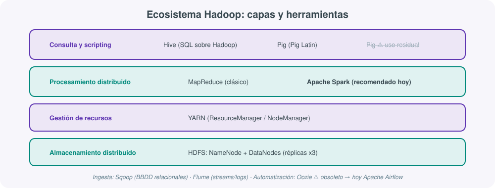

# **⚡ UT02 · Gestión de sistemas de almacenamiento y ecosistemas Big Data**



## Resultado de aprendizaje y criterios de evaluación

**RA2.** Gestiona sistemas de almacenamiento y el amplio ecosistema alrededor de ellos facilitando el procesamiento de grandes cantidades de datos sin fallos y de forma rápida.

Criterios de evaluación:

a) Se ha determinado la importancia de los sistemas de almacenamiento para depositar y procesar grandes cantidades de cualquier tipo de datos rápidamente.
b) Se ha comprobado el poder de procesamiento de su modelo de computación distribuida.
c) Se ha probado la tolerancia a fallos de los sistemas.
d) Se ha determinado que se pueden almacenar tantos datos como se desee y decidir cómo utilizarlos más tarde.
e) Se ha visualizado que el sistema puede crecer fácilmente añadiendo módulos.

!!! warning "Aviso de enfoque 2026"
    Esta unidad explica el ecosistema Hadoop clásico (HDFS, MapReduce, Hive, Pig, Sqoop, Flume, Oozie) porque forma parte del currículo oficial y porque entender su diseño es la mejor forma de entender por qué existen sus sucesores. Pero el foco práctico del curso, como en cualquier equipo de datos en 2026, está en **Apache Spark** como motor de procesamiento y en **Apache Airflow** como orquestador. Cada herramienta legacy se marca explícitamente como tal, con su alternativa actual.

## 1. Computación paralela y computación distribuida

No son lo mismo, aunque se usen indistintamente en conversaciones informales:

- **Computación paralela**: varios núcleos de **una misma máquina** ejecutan simultáneamente partes de una tarea, compartiendo memoria.
- **Computación distribuida**: varias **máquinas independientes**, conectadas por red, cooperan sin memoria compartida, cada una con su propia CPU, RAM y disco.

Durante décadas, el aumento de rendimiento se conseguía mejorando la velocidad de reloj de los procesadores (la **Ley de Moore**: el número de transistores por circuito se duplica cada dos años). Desde 2005, esa ley encuentra límites físicos: disipación térmica, consumo energético, efectos cuánticos a escala atómica. La respuesta de la industria fue pasar de la mejora **vertical** (procesadores más rápidos) a la mejora **horizontal** (más procesadores trabajando a la vez), y ese cambio de paradigma es el que sostiene todo el Big Data.

### Taxonomía de Flynn

| Modelo | Significado | Ejemplo |
|---|---|---|
| SISD | Un procesador, una instrucción, un dato | Modelo secuencial clásico (von Neumann) |
| SIMD | Una instrucción, múltiples datos | GPUs, procesadores vectoriales |
| MISD | Múltiples instrucciones, un dato | Modelo teórico, poco uso práctico |
| **MIMD** | Múltiples instrucciones, múltiples datos | Clústeres, supercomputadores, Hadoop/Spark |

### Memoria compartida frente a memoria distribuida

- **Memoria compartida**: todos los procesadores acceden a un espacio de direcciones común (SMP, multinúcleo). Programación más intuitiva, pero escalabilidad limitada y problemas de coherencia de caché (protocolos MESI/MOESI). Tecnología asociada: OpenMP.
- **Memoria distribuida**: cada nodo tiene su memoria local; la comunicación es explícita, por paso de mensajes (estándar MPI). Escalabilidad prácticamente ilimitada, a costa de mayor complejidad de programación. Es el modelo que domina en Big Data y computación de alto rendimiento.

### Escalabilidad: fuerte, débil, y las leyes que la limitan

- **Escalabilidad fuerte** (*strong scaling*): tamaño de problema fijo, se añaden procesadores para reducir el tiempo de ejecución. La **Ley de Amdahl** establece el límite: si el 20% de un programa no se puede paralelizar, ese 20% marca un suelo de tiempo que ningún número de procesadores adicionales puede bajar.
- **Escalabilidad débil** (*weak scaling*): se aumenta el tamaño del problema proporcionalmente al número de procesadores, para procesar más datos en el mismo tiempo. La **Ley de Gustafson** matiza a Amdahl: en la práctica, cuando tenemos más procesadores no buscamos resolver el mismo problema más rápido, sino resolver problemas más grandes en el mismo tiempo — que es exactamente el escenario habitual en Big Data, donde el volumen de datos crece continuamente.

Esta distinción es la base técnica del criterio (e) de esta unidad: "visualizar que el sistema puede crecer fácilmente añadiendo módulos" es, en términos de esta sección, comprobar en la práctica un caso de escalabilidad débil.

## 2. Sistemas distribuidos: transparencia y apertura

Un sistema distribuido no es solo "hardware conectado por una red": es sobre todo el software que coordina ese hardware para que, de cara al programador o al usuario, se comporte como un único sistema coherente. Dos propiedades lo definen:

- **Apertura**: se pueden añadir nuevas máquinas, servicios o software sin rediseñar el sistema completo, gracias a interfaces públicas basadas en estándares.
- **Transparencia**: se oculta al usuario la complejidad real del sistema (transparencia de acceso, de localización, de concurrencia, de replicación, de fallos). El objetivo es que trabajar con un recurso remoto sea tan sencillo como con uno local.

Cloud Computing es, en este sentido, la evolución natural de los sistemas distribuidos y del *Grid Computing* (computación compartida entre organizaciones): recursos de hardware y software ofrecidos como servicio a través de internet, bajo un modelo de pago por uso (IaaS, PaaS, SaaS).

## 3. HDFS: el sistema de archivos distribuido que originó el Big Data

**HDFS** (*Hadoop Distributed File System*) nació a principios de los 2000 como respuesta a un problema muy concreto: las grandes organizaciones generaban ya entonces más de 100 TB de datos diarios, con un crecimiento anual de un orden de magnitud, y los sistemas tradicionales no podían escalar horizontalmente para absorberlo de forma económica.

### Arquitectura maestro-esclavo

- **NameNode** (maestro): gestiona el espacio de nombres del sistema de archivos —qué ficheros existen, en qué bloques se dividen y en qué DataNodes vive cada bloque—. No almacena contenido, solo metadatos. Es un punto único de fallo, mitigado hoy con configuraciones de alta disponibilidad (HA).
- **DataNodes** (esclavos): almacenan físicamente los bloques y ejecutan las operaciones de lectura/escritura. Envían **heartbeats** cada pocos segundos; si el NameNode deja de recibirlos, marca el nodo como muerto y ordena re-replicar sus bloques en otros DataNodes.

HDFS optimiza la lectura de archivos grandes con dos ideas clave: bloques de gran tamaño (128-256 MB, frente a los 4-8 KB de un sistema de archivos tradicional) para minimizar operaciones de búsqueda, y **data locality** (los cálculos se ejecutan en el mismo nodo donde vive el bloque, para no mover datos innecesariamente por la red).

### Tolerancia a fallos (criterio c)

Cada bloque se replica, por defecto, **tres veces** en distintos DataNodes, siguiendo una política *rack-aware*: nunca más de dos copias en el mismo rack, para sobrevivir también a un fallo de rack completo. Si un DataNode falla, el NameNode detecta la ausencia de heartbeats y ordena crear nuevas réplicas hasta restablecer el factor de replicación deseado, sin intervención manual.

Conviene distinguir, para hablar con precisión de fiabilidad, la cadena completa: **fault** (el defecto latente, por ejemplo un sector de disco dañado) → **cause** (el evento que lo activa, por ejemplo un intento de lectura de ese sector) → **error** (el estado interno incorrecto que provoca) → **result** (la consecuencia lógica inmediata) → **failure** (el fallo de servicio observable por el usuario final). Diseñar tolerancia a fallos es, en el fondo, cortar esta cadena lo antes posible.

### Comandos esenciales

| Comando | Función |
|---|---|
| `hdfs dfs -ls <path>` | Listar archivos y directorios |
| `hdfs dfs -put <local> <hdfs>` | Subir un archivo local a HDFS |
| `hdfs dfs -get <hdfs> <local>` | Descargar un archivo de HDFS |
| `hdfs dfs -mkdir <path>` | Crear un directorio |
| `hdfs dfs -rm <path>` | Eliminar un archivo o directorio |
| `hdfs dfs -du -h <path>` | Mostrar el tamaño ocupado |

### HDFS frente a almacenamiento cloud

HDFS demostró que el almacenamiento distribuido masivo era posible con hardware *commodity*, democratizando el Big Data. Pero hoy compite con el almacenamiento de objetos en la nube (S3, Azure Blob), que ofrece elasticidad prácticamente infinita, pago por uso y una durabilidad "de 11 nueves" gestionada por el proveedor. La tendencia dominante en arquitecturas nuevas es **separar cómputo y almacenamiento**: Spark procesa directamente contra S3 sin necesidad de mantener un clúster HDFS propio. HDFS sigue siendo pieza fundamental en ecosistemas Hadoop ya existentes y en escenarios on-premise donde el control total de la infraestructura es un requisito (por ejemplo, por cumplimiento normativo), pero ya no es el punto de partida por defecto de un proyecto nuevo.

## 4. YARN: quién reparte los recursos del clúster

**YARN** (*Yet Another Resource Negotiator*) separa la gestión de recursos de la ejecución de tareas, permitiendo que un mismo clúster ejecute MapReduce, Spark o cualquier otro motor compartiendo infraestructura.

Una analogía útil: si HDFS es la despensa que almacena todos los ingredientes (datos) de forma distribuida, YARN es el *maître* del restaurante. El **ResourceManager** decide qué mesas (nodos) están disponibles y cuántos camareros (contenedores) se asignan a cada cliente (aplicación). Los **NodeManagers** son los camareros de cada sección, ejecutando órdenes concretas y reportando su estado. El **ApplicationMaster** es el coordinador privado de cada aplicación concreta, responsable solo de que su propio trabajo se complete correctamente.

## 5. El ecosistema de procesamiento, capa a capa

Un ecosistema de procesamiento Big Data es el conjunto de tecnologías y procesos que permiten ingestar, almacenar, procesar, analizar y explotar datos a gran escala. Conviene visualizarlo en capas:

1. **Ingesta**: streaming (Kafka, NiFi) para eventos en tiempo real; batch (Sqoop, jobs programados) para volúmenes históricos.
2. **Almacenamiento**: HDFS o almacenamiento de objetos para grandes volúmenes; bases NoSQL especializadas (HBase, Cassandra, MongoDB, Neo4j) según el patrón de acceso.
3. **Procesamiento**: motores batch (Spark, Hive) para transformaciones pesadas; motores streaming (Spark Structured Streaming, Flink) para baja latencia.
4. **Consulta**: motores SQL distribuidos (Hive, Impala, Spark SQL, Presto/Trino) para que perfiles de negocio consulten sin conocer los detalles de bajo nivel.
5. **Explotación**: herramientas de BI (Tableau, Superset, Power BI) y notebooks (Jupyter) para el consumo final.
6. **Gobierno y operación**: catalogación, linaje, calidad y seguridad — imprescindibles cuando el ecosistema crece más allá de un único equipo.

## 6. MapReduce: el paradigma original (hoy en gran medida legacy)

**MapReduce** procesa datos distribuidos en tres fases: **Map** (cada nodo procesa localmente su bloque, generando pares clave-valor), **Shuffle** (los pares se agrupan por clave y se redistribuyen) y **Reduce** (se agregan los valores de cada clave). El ejemplo clásico es *WordCount*:

```text
Map:    "el gato y el perro" -> (el,1) (gato,1) (y,1) (el,1) (perro,1)
Shuffle: agrupa por clave     -> (el,[1,1]) (gato,[1]) (y,[1]) (perro,[1])
Reduce: suma los valores      -> (el,2) (gato,1) (y,1) (perro,1)
```

MapReduce democratizó el procesamiento distribuido sobre hardware barato, pero su modelo rígido de dos fases obliga a leer y escribir a disco entre cada job, lo que penaliza especialmente los algoritmos iterativos (machine learning, análisis de grafos). Comparado con los motores que lo sucedieron:

| Criterio | MapReduce | Tez | Spark |
|---|---|---|---|
| Modelo de ejecución | Map → Shuffle → Reduce (fijo) | DAG de tareas flexible | DAG + RDD/DataFrames |
| Velocidad | Lenta (varios accesos a disco por job) | 3-30x más rápido que MapReduce | Hasta 100x en memoria |
| Gestión de memoria | Siempre disco | Memoria cuando es posible | Prioridad en memoria |
| Sintaxis | Java (clases Map/Reduce) | Transparente (lo usan Hive/Pig) | PySpark, Scala, SQL, DataFrames |
| Ecosistema Hadoop | Nativo | Motor por defecto en Hive clásico | Alternativa moderna dominante |
| **Uso en 2026** | **Obsoleto para nuevos proyectos** | Reducido a Hive heredado | **Dominante** |

## 7. Apache Spark: el motor de procesamiento por defecto

Spark surgió directamente como respuesta a las limitaciones de MapReduce: mantiene los datos en memoria RAM entre operaciones en lugar de escribirlos a disco en cada fase, lo que lo hace hasta 100 veces más rápido en cargas iterativas. Puede trabajar sobre HDFS, S3, o cualquier almacenamiento compatible, sin cambiar el código de la aplicación.

### Arquitectura

Modelo maestro-esclavo: el **driver** coordina la aplicación, ejecuta el código de usuario y solicita recursos al gestor de clúster (YARN, Kubernetes o el gestor *standalone* de Spark). Sobre esos recursos se lanzan procesos **executor** en los nodos *worker*, que ejecutan las tareas sobre particiones de datos. Un **job** se descompone en **stages**, y cada stage en **tasks** que se ejecutan en paralelo sobre particiones distintas.

### RDD, DataFrame y Dataset

| Aspecto | RDD | DataFrame / Dataset |
|---|---|---|
| Nivel | Bajo (API funcional) | Alto (SQL / DataFrame API) |
| Tipado | No | Sí (Dataset, en Scala/Java) |
| Optimización | Manual | Automática (Catalyst + Tungsten) |
| Rendimiento | Base | 2-10x más rápido |
| Uso recomendado | Datos sin estructura, lógica muy específica | ETL estructurado, ML, streaming |

Los **RDD** (*Resilient Distributed Datasets*) fueron la abstracción original de Spark: colecciones distribuidas e inmutables, particionadas automáticamente, que se reconstruyen ante un fallo de nodo siguiendo su historial de transformaciones (de ahí "resilientes"), sin necesidad de replicación manual como en HDFS. Las transformaciones (`map`, `filter`) son **perezosas**: no se ejecutan hasta que una acción (`collect`, `count`, `save`) las materializa, lo que permite a Spark optimizar el plan completo antes de ejecutarlo. Los **DataFrames** son la evolución de alto nivel: colecciones con esquema, sobre las que el optimizador **Catalyst** genera un plan físico eficiente de forma automática.

### PySpark

**PySpark** permite usar Spark desde Python, lo que lo ha convertido en la puerta de entrada habitual al Big Data para quien ya conoce `pandas`: la lógica de transformación de datos es muy similar, solo cambia la escala a la que se ejecuta.

```python
from pyspark.sql import SparkSession

spark = SparkSession.builder.appName("ventas").getOrCreate()

df = spark.read.parquet("s3://datalake/processed/ventas/")
resultado = (
    df.filter(df.fecha >= "2026-01-01")
      .groupBy("producto")
      .sum("importe")
      .orderBy("sum(importe)", ascending=False)
)
resultado.show(10)
```

## 8. Motores SQL sobre Big Data

### Apache Hive

Hive añade una capa de *data warehouse* sobre HDFS: traduce **HiveQL** (muy similar a SQL) en jobs MapReduce, Tez o Spark. Su arquitectura se apoya en el **Metastore** (metadatos de bases de datos, tablas y particiones, sobre una base de datos relacional) y el **Driver** (recibe la sentencia, consulta el Metastore y lanza la ejecución).

Las tablas pueden ser **internas** (Hive gestiona por completo los datos; un `DROP TABLE` borra también los ficheros) o **externas** (el `DROP` solo borra los metadatos, conservando los ficheros para que otras herramientas los reutilicen). El **particionamiento** divide una tabla en subdirectorios según el valor de una columna, reduciendo el volumen escaneado por consulta; el **bucketing** complementa esto repartiendo los datos en ficheros mediante una función de hash, optimizando *joins* y muestreo.

Para conectarse hoy en día, el cliente `hive` original está en desuso: la opción estándar es **Beeline**, que se conecta a **HiveServer2** vía JDBC, soportando concurrencia y autenticación.

```sql
CREATE EXTERNAL TABLE ventas (
    id_venta INT, producto STRING, importe DECIMAL(10,2), fecha DATE
)
STORED AS PARQUET
LOCATION 's3://datalake/processed/ventas/';

SELECT producto, SUM(importe) AS total
FROM ventas
WHERE fecha >= '2026-01-01'
GROUP BY producto
ORDER BY total DESC
LIMIT 10;
```

### Apache Impala y Spark SQL

**Impala** es un motor MPP (*Massively Parallel Processing*) que evita por completo MapReduce, ejecutando las consultas en memoria mediante un daemon (`impalad`) en cada nodo, lo que lo hace hasta 70 veces más rápido que Hive clásico en consultas simples. **Spark SQL** integra SQL en el propio ecosistema Spark, usando el optimizador Catalyst y el motor Tungsten (generación de código nativo columnar) para acelerar consultas analíticas 10-100 veces frente a Hive tradicional, siendo hoy la opción más habitual cuando ya se trabaja con Spark para el resto del pipeline.

## 9. Tecnologías legacy del ecosistema Hadoop

El currículo cita expresamente Pig, Sqoop, Flume y Oozie. Todas nacieron para resolver un problema real dentro del ecosistema Hadoop clásico, y todas comparten hoy un mismo destino: siguen funcionando en clústeres ya desplegados, pero prácticamente ningún proyecto nuevo las incorpora desde cero.

| Herramienta | Función original | Estado en 2026 | Alternativa actual |
|---|---|---|---|
| **Apache Pig** | Lenguaje de script (*Pig Latin*) de alto nivel para flujos ETL, traducido a jobs MapReduce/Tez | Uso residual, desarrollo prácticamente detenido | Spark (DataFrames / PySpark) |
| **Apache Sqoop** | Mover datos entre bases de datos relacionales y HDFS mediante jobs MapReduce automáticos | En mantenimiento mínimo | Spark con conectores JDBC, o *Change Data Capture* (Debezium + Kafka) |
| **Apache Flume** | Recolectar e ingerir logs y eventos en streaming hacia HDFS | Uso residual | **Apache Kafka** o **Apache NiFi** |
| **Apache Oozie** | Orquestador de flujos de trabajo de Hadoop, definidos en XML, mediante DAGs | **Retirado oficialmente por la Apache Software Foundation**; su código se mantiene solo como archivo histórico | **Apache Airflow** |

Como resume con acierto uno de los materiales de referencia del curso: si hay que señalar un "moribundo ilustre" en el mundo del dato, ese es **MapReduce clásico on-premise dentro de clústeres Hadoop antiguos**. Las empresas se mueven hacia arquitecturas cloud-first y plataformas gestionadas (Databricks, Snowflake, BigQuery...), dejando atrás el conjunto de servicios Hadoop on-premise. En muchos sitios, Hadoop no desaparece del todo: HDFS se queda como "almacén barato", mientras que el cómputo serio se hace con Spark o con motores SQL modernos.

## 10. Ingesta moderna: Apache Kafka

Frente a Flume, el estándar actual para ingesta de eventos en streaming es **Apache Kafka**: una plataforma distribuida de *streaming de eventos* que separa claramente almacenamiento, publicación y consumo, permitiendo múltiples consumidores independientes sobre el mismo flujo de datos.

- **Topics**: categorías de mensajes donde escriben los productores y de donde leen los consumidores.
- **Particiones**: divisiones de un topic; unidad de paralelismo horizontal, repartidas entre **brokers**.
- **Offset**: identificador incremental de cada mensaje dentro de su partición, que permite a cada consumidor avanzar a su propio ritmo.
- **Réplicas**: cada partición tiene un líder y una o más réplicas *follower* en brokers distintos, para tolerancia a fallos.

Tradicionalmente Kafka delegaba la coordinación del clúster (qué broker es líder de cada partición) en **Apache ZooKeeper**; las versiones actuales incorporan **KRaft**, que elimina esa dependencia dejando que los propios brokers de Kafka elijan su coordinador, simplificando notablemente el despliegue.

## 11. Orquestación moderna: Apache Airflow

Un **pipeline** describe *qué* datos se mueven y cómo se transforman (ingesta → transformación → carga); un **workflow** describe *cuándo*, en qué orden y bajo qué condiciones se ejecuta ese pipeline completo, incluyendo dependencias, reintentos y notificaciones. Esa capa de orquestación es la que cubría Oozie en el mundo Hadoop clásico, y la que cubre hoy **Apache Airflow** en cualquier arquitectura moderna, dentro o fuera de Hadoop.

Airflow modela cada workflow como un **DAG** (grafo acíclico dirigido) definido en código Python: cada nodo es una tarea (un job Spark, una consulta SQL, un script), y cada arista una dependencia. Los **Operators** definen qué acción ejecuta cada tarea (`PythonOperator`, `BashOperator`, operadores de transferencia), y los **Sensors** detienen la ejecución hasta que se cumple una condición externa (por ejemplo, la llegada de un fichero).

```python
from airflow import DAG
from airflow.operators.python import PythonOperator
from datetime import datetime

with DAG("etl_ventas_diario", start_date=datetime(2026, 1, 1), schedule="@daily") as dag:
    extraer = PythonOperator(task_id="extraer", python_callable=extraer_datos)
    transformar = PythonOperator(task_id="transformar", python_callable=transformar_datos)
    cargar = PythonOperator(task_id="cargar", python_callable=cargar_datos)

    extraer >> transformar >> cargar
```

Frente al XML rígido de Oozie, "configuración como código" en Python facilita el versionado (Git), las pruebas automáticas y la colaboración en equipo — razones de peso que explican por qué Airflow se ha convertido en el estándar de facto de la orquestación de datos.

## Para profundizar

Además del material de clase, puedes consultar el bloque de [Ecosistema Hadoop](https://aitor-medrano.github.io/iabd/hadoop/hadoop.html){:target="_blank"} y de [Spark](https://aitor-medrano.github.io/iabd/spark/spark.html){:target="_blank"} de los apuntes IABD, así como el artículo de [proyectoA sobre cómo montar un clúster Hadoop con Docker](https://proyectoa.com/montar-un-cluster-hadoop-con-docker-para-big-data/){:target="_blank"}, que sirve de referencia para el despliegue de la práctica de esta unidad. El resto de enlaces recopilados está en la página de [Recursos](99-recursos.md).
