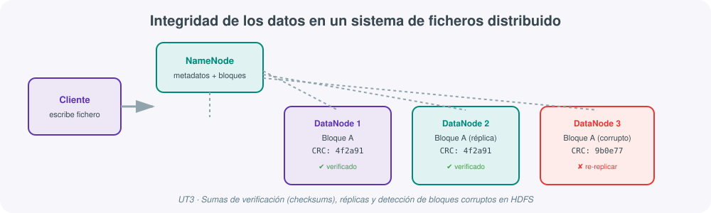

# **🛡️ UT03 · Generación de mecanismos de integridad de los datos**



## Resultado de aprendizaje y criterios de evaluación

**RA3.** Genera mecanismos de integridad de los datos, comprobando su mantenimiento en los sistemas de ficheros distribuidos y valorando la sobrecarga que conlleva en el tratamiento de los datos.

Criterios de evaluación:

a) Se ha valorado la importancia de la calidad de los datos en los sistemas de ficheros distribuidos.
b) Se ha valorado que a mayor volumen de tratamiento de datos corresponde un mayor peligro relacionado con la integridad de los datos.
c) Se ha reconocido que los sistemas de ficheros distribuidos implementan una suma de verificación para la comprobación de los contenidos de los archivos.
d) Se ha reconocido el papel del servidor en los procesos previos a la suma de verificación.

## 1. Calidad del dato: por qué importa más cuanto más grande es el sistema

En una base de datos relacional pequeña, un error de calidad (un valor nulo inesperado, una fecha mal formada) suele detectarse rápido porque el volumen es manejable. En un sistema de ficheros distribuido que reparte petabytes entre cientos de máquinas, ese mismo error puede pasar desapercibido mucho tiempo y propagarse a todos los procesos que consuman ese dato aguas abajo (criterio a).

Cuantas más máquinas, discos y transferencias de red intervienen, mayor es la superficie expuesta a fallos silenciosos: un sector de disco que se degrada, un bit que se invierte durante una transmisión, un proceso que se interrumpe a mitad de escritura (lo que a veces se llama ***bit rot*** o corrupción silenciosa). Esta es la razón técnica directa del criterio (b): "a mayor volumen, mayor riesgo para la integridad" no significa que los datos grandes sean menos fiables por naturaleza, sino que estadísticamente hay muchas más oportunidades de que algo falle en el camino cuando ese camino recorre miles de discos en lugar de uno solo.

Las dimensiones habituales de calidad del dato son:

| Dimensión | Pregunta que responde |
|---|---|
| Exactitud | ¿El valor almacenado refleja la realidad? |
| Completitud | ¿Faltan valores que deberían existir? |
| Consistencia | ¿El mismo dato tiene el mismo valor en todos los sistemas que lo usan? |
| Actualidad | ¿El dato sigue siendo válido o ha quedado desactualizado? |
| Unicidad | ¿Existen duplicados que distorsionen los análisis? |
| **Integridad** | ¿El contenido del fichero es exactamente el que se escribió, bit a bit? |

Esta unidad se centra en la última —la integridad, la garantía técnica de que un fichero no se ha corrompido en el camino— sin perder de vista que en un proyecto real las seis dimensiones conviven: hoy en día es habitual complementar los checksums a nivel de bytes con herramientas de calidad a nivel de contenido, como **Great Expectations** o **Deequ** (de Amazon), que permiten definir reglas declarativas ("esta columna no debe tener nulos", "esta fecha debe estar en este rango") y ejecutarlas como parte del propio pipeline de Spark.

## 2. Sumas de verificación (*checksums*) en HDFS

HDFS no confía "a ciegas" en que un bloque de datos siga siendo el mismo que se escribió. Para comprobarlo, implementa **sumas de verificación** (criterio c):

- Al escribir un fichero, HDFS lo divide en bloques y, dentro de cada bloque, en trozos más pequeños (512 bytes por defecto). Para cada trozo calcula un **CRC32C** (*Cyclic Redundancy Check*), una "huella digital" del contenido.
- Estas sumas se almacenan junto al bloque, en un fichero de metadatos independiente.
- Al **leer** un bloque, HDFS recalcula el checksum del contenido leído y lo compara con el almacenado. Si no coincide, se descarta esa réplica y se sirve automáticamente otra de las réplicas sanas.
- Cada DataNode ejecuta además, en segundo plano, un **Block Scanner** periódico que recorre todos sus bloques comprobando sus checksums, para detectar corrupciones incluso en datos que nadie ha leído todavía.

```bash
# Comprobar el estado de salud de todos los ficheros de HDFS
hdfs fsck /datos --files --blocks

# Consultar la suma de verificación de un fichero concreto
hdfs dfs -checksum /datos/ventas/2026/enero.parquet
```

Este mecanismo tiene un coste: calcular y comparar checksums consume CPU y añade una pequeña sobrecarga a cada lectura y escritura. Esa sobrecarga es precisamente la que menciona el resultado de aprendizaje: un sistema que garantiza integridad nunca es gratis, y parte del trabajo de quien administra el clúster es equilibrar esa garantía frente al rendimiento.

## 3. El papel del servidor antes de que exista un checksum que comparar

El criterio (d) señala un matiz que se suele pasar por alto: los checksums no aparecen de la nada, alguien tiene que generarlos y decidir dónde vive cada copia **antes** de que pueda comprobarse nada. Ese "alguien" es el propio servidor:

1. El **NameNode** decide, según su política de colocación de bloques, en qué DataNodes se escribirá cada réplica, procurando que no todas queden en el mismo rack.
2. El **DataNode** que recibe la escritura calcula el checksum inicial del bloque en el mismo momento en que lo persiste a disco.
3. Solo a partir de ese momento existe una "verdad" contra la que comparar en futuras lecturas o verificaciones periódicas.

Es decir: antes de poder verificar nada, el servidor ya ha tenido que tomar decisiones activas de diseño (dónde coloca las réplicas) y de cómputo (calcular el checksum inicial). Sin ese trabajo previo, el mecanismo de verificación no tendría contra qué comparar.

## 4. Tolerancia a fallos en procesamiento batch

Cuando hablamos de integridad no solo hablamos del dato en reposo, sino también del dato **mientras se está procesando**. En un job batch (por ejemplo, un job de Spark que tarda dos horas), los datos ya están persistidos antes del cálculo y la demanda de respuesta en tiempo real es baja, por lo que se pueden tolerar ventanas de tiempo más amplias para reintentos y verificaciones, priorizando la precisión sobre la latencia.

- **Replicación de datos**: mantener copias de la misma información en varios nodos permite una recuperación instantánea (el sistema redirige hacia una réplica disponible), a costa de consumo de almacenamiento y red para mantener las copias sincronizadas.
- **Checkpoint**: un punto de consistencia del proceso batch. No guarda los datos en sí, sino el *estado*: hasta qué partición, fichero o rango se ha procesado con éxito. Permite reanudar sin reprocesar todo desde el principio.
- **Copy report**: un respaldo de los resultados intermedios o finales de un job, que permite verificar o recuperar esos resultados antes de continuar si ocurre un fallo.

Spark aplica estas mismas ideas de forma nativa: el **linaje de un RDD** (el historial de transformaciones que lo generó) actúa como un checkpoint implícito — si una partición se pierde, Spark la recalcula a partir de ese linaje en lugar de necesitar una copia física adicional, aunque para cadenas de transformación muy largas también se puede forzar un `checkpoint()` explícito que persiste el estado a disco y corta el linaje, evitando recalcular desde el origen.

## 5. Tolerancia a fallos en procesamiento streaming

En streaming, los datos se procesan en tiempo real sin un almacenamiento previo completo, priorizando la continuidad del flujo sobre la exactitud de eventos aislados. Los mecanismos de respaldo cambian de naturaleza:

- **Passive standby**: el nodo maestro envía copias de seguridad periódicas a un nodo réplica inactivo. Admite grandes volúmenes, pero la recuperación tras un fallo es más lenta.
- **Active standby**: el maestro replica continuamente al nodo de respaldo, que está listo para asumir el trabajo de inmediato. Reduce el tiempo de conmutación, a costa de más CPU y red.
- **Upstream backup**: los nodos situados antes del nodo que procesa los datos guardan temporalmente la información y la reenvían si el nodo siguiente falla, actuando como un búfer resiliente.
- **Operator state management**: cada operador copia su estado interno a nodos previos en el flujo; si falla, se restaura desde esas copias.

Este es exactamente el mecanismo que usa **Spark Structured Streaming** con sus *checkpoints* en almacenamiento distribuido (HDFS o S3): cada micro-lote procesado registra su progreso (qué offsets de Kafka se han consumido, qué estado de agregación se ha acumulado), de modo que si el proceso se reinicia, retoma exactamente donde se quedó sin duplicar ni perder eventos.

## 6. Movimiento de datos entre clústeres: migración y metadatos

Un clúster Hadoop rara vez vive aislado para siempre: se actualiza a una nueva versión, se migra a otro centro de datos, o se replica hacia un clúster de recuperación ante desastres. La herramienta nativa para copiar grandes volúmenes de datos entre clústeres es **DistCp** (*Distributed Copy*), que usa internamente un job MapReduce para paralelizar la copia entre múltiples nodos:

```bash
hadoop distcp hdfs://cluster-origen:9000/datos hdfs://cluster-destino:9000/datos
```

Durante una migración hay que prestar especial atención a los **metadatos**: el NameNode mantiene el árbol de directorios y la ubicación de bloques en un fichero `fsimage` (una fotografía del estado del sistema de ficheros) y un registro de cambios `edits log` (todas las operaciones desde la última fotografía); un proceso llamado **Secondary NameNode** fusiona periódicamente ambos en un checkpoint. Migrar solo los datos físicos sin migrar o regenerar correctamente estos metadatos dejaría un clúster con ficheros "huérfanos" o inaccesibles, aunque los bloques estén intactos.

## 7. Cuantificando la sobrecarga: cuánto cuesta realmente la integridad

El resultado de aprendizaje pide explícitamente "valorar la sobrecarga que conlleva" garantizar la integridad, así que conviene hacerlo con números, no solo con la idea general de que "cuesta algo":

| Mecanismo | Coste que añade | Beneficio que aporta |
|---|---|---|
| Replicación x3 en HDFS | ~200% más almacenamiento que sin replicar | Tolerancia a la pérdida simultánea de hasta 2 réplicas |
| Checksum CRC32C por cada 512 bytes | CPU adicional en cada lectura/escritura (típicamente un pequeño porcentaje del tiempo total de E/S) | Detección temprana de corrupción silenciosa |
| Block Scanner periódico | Consumo de I/O en segundo plano en cada DataNode | Detecta bloques corruptos que nadie ha leído todavía |
| Checkpoint explícito en Spark | Escritura a disco que corta el linaje del RDD | Evita recomputar cadenas de transformación muy largas tras un fallo |
| Transacciones ACID en Delta Lake/Iceberg | Overhead de escritura del log de transacciones | Nunca se lee una tabla a medio escribir; permite *time travel* |

Ninguno de estos mecanismos es gratuito, y parte de la madurez de quien diseña un sistema Big Data consiste en elegir **qué nivel de garantía necesita realmente cada conjunto de datos**: no toda la información de una organización merece el mismo nivel (y el mismo coste) de protección. Un dato de log temporal, fácilmente regenerable, puede vivir con un factor de replicación menor que un dato financiero que debe conservarse con garantías legales durante años.

## 8. Algoritmos de suma de verificación: no todos son iguales

El currículo se refiere de forma genérica a "sumas de verificación", pero en la práctica existen varias familias con propiedades distintas, y conviene saber en qué se diferencian:

| Algoritmo | Uso típico | Detecta manipulación intencionada |
|---|---|---|
| **CRC32 / CRC32C** | HDFS (verificación de bloques), Ethernet, ZIP | No — solo detecta corrupción accidental |
| **MD5** | Verificación rápida de ficheros descargados | No — se considera criptográficamente roto |
| **SHA-256** | Firmas digitales, verificación de imágenes de contenedores, ETags de S3 en subidas multi-parte | Sí — resistente a colisiones intencionadas |

HDFS usa CRC32C porque su objetivo es detectar corrupción accidental de hardware al menor coste de CPU posible, no protegerse de un atacante que manipule el fichero deliberadamente; para ese segundo escenario (integridad frente a manipulación maliciosa) se recurre a algoritmos criptográficos como SHA-256, con un coste de cómputo mayor.

## 9. Integridad en el mundo Lakehouse: más allá del checksum

Los formatos de tabla modernos sobre almacenamiento de objetos —**Delta Lake**, **Apache Iceberg**, **Apache Hudi**— llevan la idea de integridad un paso más allá del checksum de bloque: añaden un **log de transacciones** que registra cada operación de escritura de forma atómica (ACID), de modo que una escritura a medias nunca deja la tabla en un estado inconsistente para quien la está leyendo al mismo tiempo. Además, mantienen un historial de versiones (*time travel*) que permite consultar el estado de una tabla tal y como estaba en un momento anterior, o revertir una escritura errónea sin restaurar un backup completo. Conceptualmente es la misma preocupación que resuelve un checksum de HDFS —garantizar que lo que se lee es exactamente lo que se esperaba encontrar—, pero resuelta a nivel de tabla completa en lugar de a nivel de bloque individual, y pensada para el mundo de almacenamiento de objetos donde ya no existe un NameNode central.

## 10. Calidad de contenido en código: un ejemplo con Great Expectations

La UT1 y este mismo temario mencionan que, junto al checksum a nivel de bytes, conviene validar la calidad del contenido con reglas declarativas. **Great Expectations** es la librería de referencia en el ecosistema Python/Spark para esto:

```python
import great_expectations as gx

context = gx.get_context()
validator = context.sources.pandas_default.read_parquet("ventas.parquet")

# Definimos las "expectativas" sobre el contenido, no sobre los bytes
validator.expect_column_values_to_not_be_null("id_venta")
validator.expect_column_values_to_be_between("importe", min_value=0, max_value=100000)
validator.expect_column_values_to_be_unique("id_venta")

resultado = validator.validate()
print(resultado.success)  # True si todas las reglas se cumplen
```

Nótese la diferencia de naturaleza frente al checksum de HDFS: aquí no comprobamos si el fichero es *bit a bit* el que se escribió, comprobamos si su *contenido* tiene sentido de negocio. Ambas comprobaciones son complementarias y, en un pipeline maduro, ambas se ejecutan de forma automática: la primera la garantiza el propio sistema de ficheros distribuido; la segunda hay que programarla explícitamente como parte del pipeline de datos.

## 11. Integridad en almacenamiento de objetos: el caso de Amazon S3

Buena parte de las arquitecturas actuales, como vimos en la UT1, ya no almacenan el dato en HDFS sino en almacenamiento de objetos cloud. Los mecanismos de integridad cambian de nombre, pero resuelven exactamente el mismo problema:

| Mecanismo en HDFS | Equivalente en S3 | Qué garantiza |
|---|---|---|
| Checksum de bloque (CRC32C) | **ETag** (hash MD5 del objeto, o de cada parte en subidas multi-parte) | El objeto descargado es idéntico al subido |
| Factor de replicación x3 | **Replicación entre zonas de disponibilidad** (gestionada por AWS, de forma transparente) | Durabilidad "de 11 nueves" ante fallo de disco o de zona |
| `hdfs fsck` | **S3 Object Lambda** o validaciones de aplicación sobre eventos de S3 | Verificación de contenido bajo demanda |
| Inmutabilidad de un bloque ya escrito | **Versionado de objetos** + **Object Lock** (modo WORM: *Write Once, Read Many*) | Ningún proceso, ni siquiera con error humano, puede sobrescribir o borrar una versión bloqueada |

La lección de fondo, y la que conviene llevarse de esta unidad: el nombre concreto del mecanismo cambia según la tecnología de almacenamiento (HDFS, S3, Azure Blob...), pero el problema que resuelve —garantizar que lo que se lee es exactamente lo que se escribió, y poder recuperarse si no lo es— es universal en cualquier sistema de almacenamiento distribuido, sea on-premise o cloud.

## 12. Autoevaluación rápida

1. Explica con tus palabras por qué "a mayor volumen, mayor riesgo de integridad" no significa que el Big Data sea poco fiable. (apartado 1)
2. ¿Qué diferencia hay entre lo que verifica un checksum CRC32C y lo que verifica una regla de Great Expectations? (apartados 2 y 10)
3. Describe, paso a paso, qué hace el servidor (NameNode + DataNode) antes de que exista un checksum contra el que comparar. (apartado 3)
4. ¿Qué mecanismo de tolerancia a fallos en streaming usarías si no puedes permitirte ni un segundo de interrupción, y cuál si el coste de infraestructura es la prioridad? (apartado 5)
5. Si migraras un clúster copiando solo los discos físicos de los DataNodes, ¿qué fallaría y por qué? (apartado 6)

## 13. Opciones habituales de DistCp

El comando `distcp` visto en el apartado 6 admite varias opciones que conviene conocer antes de usarlo en un escenario real de migración:

| Opción | Efecto |
|---|---|
| `-update` | Solo copia ficheros que no existen en destino o que han cambiado de tamaño |
| `-delete` | Borra en destino los ficheros que ya no existen en origen (sincronización exacta) |
| `-m <n>` | Número de mappers (grado de paralelismo) que se lanzan para la copia |
| `-skipcrccheck` | Omite la verificación de checksum tras la copia (desaconsejado salvo que se sepa muy bien por qué) |
| `-bandwidth <MB>` | Limita el ancho de banda usado por mapper, para no saturar la red de producción |

```bash
# Migración incremental, sincronizando también los borrados, con 20 mappers
hadoop distcp -update -delete -m 20 \
  hdfs://cluster-origen:9000/datos \
  hdfs://cluster-destino:9000/datos
```

La opción `-skipcrccheck` merece una mención especial: existe, pero desactivarla contradice directamente el espíritu de esta unidad. Se documenta aquí precisamente para remarcar que su uso debería ser una excepción justificada (por ejemplo, migrar entre clústeres con versiones de Hadoop que calculan el checksum de forma distinta y por tanto no son directamente comparables), nunca la opción por defecto.

## 14. Checklist de buenas prácticas de integridad

Una lista de comprobación rápida, útil tanto para la práctica de esta unidad como para cualquier despliegue real:

1. ¿Está definido y documentado el factor de replicación adecuado para cada tipo de dato (no todos necesitan el mismo)?
2. ¿Se revisa periódicamente la salida de `hdfs fsck` o el panel de bloques corruptos, en lugar de esperar a que un usuario reporte un error?
3. ¿Existen reglas de calidad de contenido (tipo Great Expectations) para los datasets críticos del negocio, no solo para los checksums de bytes?
4. ¿Se ha probado alguna vez, de forma controlada, qué ocurre si se pierde un nodo (como en la práctica de esta unidad), o se asume sin comprobar que "ya funcionará"?
5. ¿Está documentado el procedimiento de migración entre clústeres, incluyendo qué ocurre con los metadatos?

## 15. Ejemplo de síntesis

!!! example "Un bloque corrupto en producción"
    Un clúster de 20 nodos procesa cada noche un job de Spark sobre datos almacenados en HDFS. Una madrugada, un sector de disco de uno de los DataNodes se degrada (el *fault*) y, al intentar leerse ese bloque durante el job (la *cause*), el checksum calculado no coincide con el almacenado (el *error*). HDFS detecta la discrepancia, descarta esa réplica, sirve automáticamente una de las otras dos copias sanas, y el NameNode ordena crear una nueva réplica en otro nodo para restablecer el factor de replicación. El job termina sin que nadie note nada salvo por una línea en el log del NameNode — y esa línea es, precisamente, la evidencia de que todo el mecanismo de integridad (checksums + réplicas + detección automática) ha funcionado exactamente como debía.

!!! example "Un fallo en un pipeline de streaming"
    Un pipeline de Spark Structured Streaming consume eventos de Kafka y calcula agregaciones cada minuto, escribiendo el resultado en una tabla Delta Lake en S3. El proceso se cae de forma inesperada (una actualización de la infraestructura reinicia el contenedor). Al reiniciarse, Spark lee el checkpoint guardado en S3, que registra hasta qué offset de cada partición de Kafka se había procesado con éxito. El proceso retoma exactamente desde ese punto: ni se duplican eventos ya agregados, ni se pierden eventos pendientes. Ninguna persona ha tenido que intervenir manualmente para decidir "por dónde continuar"; ese es, precisamente, el mecanismo de tolerancia a fallos en streaming (apartado 5) funcionando como está diseñado.

## 16. Resumen de mecanismos de integridad por capa

Como cierre de la unidad, un mapa completo de qué mecanismo protege cada capa del sistema, para tenerlo como referencia rápida durante la práctica:

| Capa | Mecanismo de integridad | Criterio de evaluación relacionado |
|---|---|---|
| Bytes almacenados en disco | Checksum CRC32C por bloque | c |
| Colocación inicial de las réplicas | Política de colocación del NameNode | d |
| Persistencia del checksum inicial | Cálculo en el DataNode al escribir | d |
| Disponibilidad ante fallo de nodo | Factor de replicación x3 | b, c |
| Procesamiento batch interrumpido | Checkpoint + linaje de RDD | b |
| Procesamiento streaming interrumpido | Checkpoint de offsets (Kafka + Spark Structured Streaming) | b |
| Migración entre clústeres | DistCp + verificación de checksum en destino | c, d |
| Metadatos del sistema de ficheros | `fsimage` + `edits log` | d |
| Contenido con sentido de negocio | Reglas declarativas (Great Expectations/Deequ) | a |
| Tabla completa en almacenamiento de objetos | Log de transacciones ACID (Delta Lake/Iceberg) | a, c |

Esta tabla resume, en una sola vista, la idea central de todo el temario: la integridad de un sistema Big Data no depende de un único mecanismo, sino de una cadena de mecanismos complementarios, cada uno responsable de una capa distinta, y todos con un coste que hay que saber justificar.

## 17. Glosario rápido de la unidad

- **Bit rot**: corrupción silenciosa de datos almacenados, sin que medie ningún error visible en el momento en que ocurre.
- **Checksum**: valor calculado a partir del contenido de un dato, usado para detectar si ese contenido ha cambiado.
- **Rack awareness**: política de HDFS que reparte las réplicas entre distintos racks físicos, no solo distintos nodos.
- **Fsck**: comprobación del estado de salud (*file system check*) de un sistema de ficheros.
- **Fsimage / edits log**: fotografía completa y registro incremental de cambios, respectivamente, de los metadatos de HDFS.
- **DistCp**: herramienta de copia distribuida y paralela entre clústeres o rutas de HDFS.
- **ACID**: conjunto de garantías (Atomicidad, Consistencia, Aislamiento, Durabilidad) que evitan estados intermedios inconsistentes en una transacción.
- **Time travel**: capacidad de un formato de tabla moderno (Delta Lake, Iceberg) de consultar versiones anteriores de una tabla.

## Para profundizar

Puedes ampliar esta unidad con el artículo sobre [HDFS de De Manejar](https://demanejar.github.io/en/posts/hdfs-introduction/){:target="_blank"}, centrado específicamente en su arquitectura de bloques y checksums, y con la documentación oficial de [Apache Hadoop](https://hadoop.apache.org/){:target="_blank"} para consultar en detalle los parámetros de configuración de `hdfs-site.xml` relacionados con la replicación. El resto de enlaces está recopilado en la página de [Recursos](99-recursos.md).
