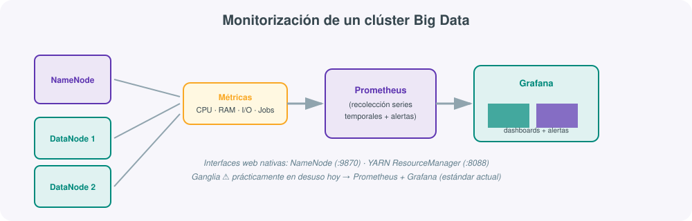

# **📊 UT04 · Monitorización, optimización y solución de problemas**



## Resultado de aprendizaje y criterios de evaluación

**RA4.** Realiza el seguimiento de la monitorización de un sistema, asegurando la fiabilidad y estabilidad de los servicios que se proveen.

Criterios de evaluación:

a) Se han aplicado herramientas de monitorización eficiente de los recursos.
b) Se han recogido métricas, procesamiento y visualización de los datos.
c) Se han generado alertas para detectar un riesgo o mal funcionamiento.
d) Se ha comprobado que las herramientas usadas ofrecen un rendimiento elevado con rapidez.
e) Se ha comprobado la fiabilidad de los datos según respuestas.
f) Se ha analizado la estabilidad de servicios.

## 1. Por qué monitorizar un sistema distribuido es distinto (y más difícil)

En un único servidor, saber si "todo va bien" es sencillo: se mira la CPU, la memoria y poco más. En un clúster Big Data con docenas de nodos ejecutando Spark, HDFS y Airflow al mismo tiempo, la pregunta "¿va todo bien?" se descompone en muchas preguntas simultáneas: ¿tienen todos los nodos espacio en disco?, ¿está el planificador de recursos repartiendo bien la carga?, ¿hay algún job de Spark colgado en una fase de *shuffle*?, ¿ha caído algún nodo sin que nadie se entere hasta que un usuario se queja? La monitorización en Big Data no es un lujo: es la única forma de tener visibilidad sobre un sistema demasiado grande para observarlo "a ojo".

## 2. Qué métricas recoger, a qué nivel

No basta con "monitorizar"; hay que decidir **qué** medir (criterio b). En un sistema Big Data conviene combinar tres niveles:

| Nivel | Ejemplos de métricas |
|---|---|
| **Infraestructura** | CPU, memoria, uso de disco, I/O, red — por nodo |
| **Plataforma (Hadoop/Spark)** | Bloques HDFS totales/corruptos, jobs en cola, duración de *stages*, volumen de datos en *shuffle*, *executors* activos |
| **Orquestación (Airflow)** | DAGs en ejecución, tareas fallidas, tiempo de espera en cola, *SLA misses* |
| **Negocio** | Registros procesados por hora, retraso (*lag*) entre generación y procesado del dato |

## 3. Interfaces nativas: el primer punto de consulta

Antes de añadir ninguna herramienta externa, cada pieza del ecosistema ya expone su propia interfaz web, y conviene conocerlas bien porque son siempre el primer punto de consulta ante un problema (criterio a):

| Interfaz | Puerto habitual | Para qué sirve |
|---|---|---|
| **NameNode UI** | 9870 | Estado de HDFS: capacidad, DataNodes vivos/muertos, bloques corruptos |
| **ResourceManager UI** | 8088 | Estado de YARN: aplicaciones en curso, en cola, recursos disponibles |
| **Job History Server** | 19888 | Histórico de jobs finalizados: duración, contadores, logs de tareas |
| **Spark UI** | 4040 (driver activo) | Jobs, *Stages*, *Storage*, *Executors*, plan de ejecución SQL |
| **Airflow UI** | 8080 | Estado de los DAGs, vista *Grid*/*Gantt*, logs por tarea |

De todas ellas, la **Spark UI** merece atención especial porque es la que más se usa en el día a día: su pestaña *Jobs* muestra cada acción disparada y su tiempo total; *Stages* desglosa cada job en las fases separadas por un *shuffle*; el **DAG visualizado** permite ver exactamente qué transformaciones se han encadenado y dónde se ha invertido más tiempo; y *Executors* muestra el uso de memoria y CPU de cada nodo *worker*, señalando en rojo aquellos con *spill* a disco (cuando los datos no caben en memoria y Spark tiene que escribir temporalmente en disco, penalizando el rendimiento).

## 4. De Ganglia a Prometheus + Grafana

El currículo oficial cita **Ganglia** como ejemplo de herramienta de monitorización de clúster: un demonio ligero en cada nodo que enviaba métricas a un agregador central, almacenadas con RRDtool y visualizadas en un panel web sencillo. Fue durante años el estándar de facto en el mundo Hadoop.

!!! warning "Ganglia hoy"
    Ganglia prácticamente ha dejado de mantenerse activamente (incluso el propio servicio gestionado de Ganglia en Amazon EMR aparece hoy como una opción heredada frente a alternativas más modernas) y ha sido sustituido en la inmensa mayoría de clústeres actuales por la combinación **Prometheus + Grafana**: Prometheus recolecta y almacena métricas como series temporales, con un modelo de datos mucho más flexible que RRDtool, y Grafana las visualiza en paneles interactivos, permitiendo combinar métricas de Hadoop, Spark, Airflow y del propio sistema operativo en un único panel.

### Monitorizando Spark con Prometheus (paso a paso conceptual)

Spark no expone métricas en formato Prometheus de forma nativa por defecto, pero sí las recopila internamente mediante la librería **Dropwizard Metrics**, y es sencillo exponerlas:

1. En `$SPARK_HOME/conf/metrics.properties`, se activa el *sink* JMX: `*.sink.jmx.class=org.apache.spark.metrics.sink.JmxSink`.
2. Al lanzar `spark-submit`, se añade un agente **JMX Exporter** de Prometheus como *javaagent*, indicando un fichero de reglas que traduce las métricas internas de Spark (por ejemplo, del `BlockManager` o del `DAGScheduler`) al formato que Prometheus entiende:

    ```bash
    spark-submit \
      --conf spark.driver.extraJavaOptions=-javaagent:$SPARK_HOME/jars/jmx_prometheus_javaagent.jar=9091:$SPARK_HOME/conf/prometheus-config.yml \
      mi_job.py
    ```

3. Prometheus se configura para hacer *scraping* periódico (cada pocos segundos) de ese puerto (9091 en el ejemplo), almacenando la serie temporal resultante.
4. Grafana consulta Prometheus y construye un panel con la evolución de esas métricas en el tiempo.

Este mismo patrón —exponer métricas internas por JMX o HTTP, Prometheus las recolecta (*pull*), Grafana las visualiza— es el que se repite para monitorizar HDFS, YARN, Kafka o cualquier otro componente del ecosistema, lo que explica por qué esta pareja de herramientas se ha convertido en el estándar: un único patrón de trabajo cubre todo el clúster, en lugar de una herramienta distinta para cada tecnología.

### Alertas con Alertmanager

Recoger métricas no basta si nadie reacciona a tiempo (criterio c). **Alertmanager**, el compañero natural de Prometheus, evalúa reglas de umbral definidas sobre esas métricas (por ejemplo, "más del 90% de disco usado en un DataNode durante más de 5 minutos") y decide cuándo y a quién notificar (correo, Slack, PagerDuty), agrupando y silenciando alertas repetidas para evitar saturar al equipo de guardia con ruido.

### Tipos de métricas que expone Spark

La librería Dropwizard Metrics que usa Spark internamente clasifica cada medida en uno de estos tipos, y conviene reconocerlos al leer un dashboard:

| Tipo | Qué representa | Ejemplo en Spark |
|---|---|---|
| **Counter** | Un valor que solo aumenta | Número total de tareas completadas |
| **Gauge** | Un valor instantáneo que sube y baja | Memoria usada por un executor en este momento |
| **Histogram** | Distribución estadística de un conjunto de valores | Distribución del tamaño de las particiones procesadas |
| **Timer** | Tiempo que tarda una operación, con su distribución | Duración de cada *stage* |

### Ejemplos de consultas PromQL

Una vez las métricas están en Prometheus, se consultan con su lenguaje propio, **PromQL**. Algunos ejemplos orientativos que se usarán en la práctica:

```promql
# Memoria media usada por los executors de Spark en los últimos 5 minutos
avg_over_time(spark_executor_memoryUsed[5m])

# Número de DataNodes que llevan más de 2 minutos sin heartbeat
count(up{job="hdfs_datanode"} == 0)

# Tareas de Airflow fallidas en la última hora
increase(airflow_task_fail_count[1h])
```

## 5. Monitorización de la orquestación: Airflow

En la UT2 vimos que Airflow sustituye a Oozie como orquestador de flujos. Airflow no es solo una herramienta de ejecución, también es una pieza central de monitorización, porque su interfaz web (puerto 8080 por defecto) muestra en todo momento:

- La **vista Grid**, con el histórico de ejecuciones de cada DAG y el estado de cada tarea (éxito, fallo, en curso, en cola) coloreado.
- La **vista Gantt**, que permite detectar visualmente qué tarea concreta se está llevando la mayor parte del tiempo de un DAG, y si ese tiempo ha ido creciendo con el paso de los días.
- Los **logs de cada tarea**, accesibles con un solo clic, sin necesidad de conectarse por SSH a ningún nodo.
- El registro de **SLA misses**: cuando una tarea tarda más de lo esperado, Airflow puede generar una alerta automática, exactamente el mismo tipo de mecanismo de alerta descrito para Prometheus, pero aplicado a la capa de orquestación en lugar de a la infraestructura.

Esto conecta directamente con el criterio (c): un pipeline de datos puede tener toda la infraestructura sana (CPU, memoria, disco correctos) y aun así fallar por un motivo puramente lógico (una tarea que depende de un fichero que nunca llega); Airflow es la herramienta que detecta y alerta sobre ese tipo concreto de riesgo, complementando lo que Prometheus vigila a nivel de infraestructura.

Un ejemplo de cómo se define un SLA y una alerta directamente en el propio DAG, sin necesidad de configurar nada externo:

```python
from airflow import DAG
from airflow.operators.python import PythonOperator
from datetime import datetime, timedelta

def notificar_fallo(context):
    # Aquí se integraría con Slack, email o el sistema de alertas que corresponda
    print(f"Alerta: la tarea {context['task_instance'].task_id} ha fallado")

with DAG(
    "etl_ventas_diario",
    start_date=datetime(2026, 1, 1),
    schedule="@daily",
    default_args={
        "retries": 2,
        "retry_delay": timedelta(minutes=5),
        "on_failure_callback": notificar_fallo,
        "sla": timedelta(hours=1),
    },
) as dag:
    transformar = PythonOperator(task_id="transformar", python_callable=transformar_datos)
```

Nótese que `retries`, `sla` y `on_failure_callback` son, en el fondo, la misma idea que una regla de Alertmanager (umbral + acción), aplicada a la capa de orquestación en lugar de a una métrica de infraestructura.

## 6. Análisis de históricos

Guardar métricas no vale de mucho si nunca se analizan en perspectiva. El análisis de históricos permite responder preguntas como: ¿este job de Spark es hoy más lento que la semana pasada?, ¿este nodo lleva degradándose progresivamente los últimos días?, ¿cuántas veces ha fallado este DAG de Airflow en el último mes?

- El **Job History Server** de Spark/Hadoop conserva el detalle de jobs ya finalizados, permitiendo comparar ejecuciones concretas.
- **Prometheus** almacena series temporales con una retención configurable (y puede ampliarse con soluciones como Thanos o Mimir para retenciones muy largas sin perder resolución).
- Para el análisis centralizado de **logs** (no métricas numéricas, sino los mensajes de texto que generan los servicios), el estándar habitual sigue siendo la pila **ELK/EFK** (Elasticsearch + Logstash o Fluentd + Kibana), que permite buscar y correlacionar mensajes de error de todos los nodos desde un único panel.

## 7. Estabilidad de servicios (criterio f)

Para analizar la **estabilidad** de un servicio no basta con mirar si "está encendido": se recurre a indicadores propios de la disciplina de fiabilidad de sistemas (*Site Reliability Engineering*, SRE):

| Indicador | Qué mide |
|---|---|
| **Disponibilidad (uptime)** | Porcentaje de tiempo operativo, habitualmente expresado en "nueves" (99,9% ≈ 8,7 h de caída al año) |
| **MTBF** (*Mean Time Between Failures*) | Tiempo medio entre un fallo y el siguiente |
| **MTTR** (*Mean Time To Recovery*) | Tiempo medio para recuperar el servicio tras un fallo |

Estos indicadores se derivan directamente de las métricas e históricos recogidos por Prometheus y Airflow, lo que conecta con el criterio (e): la fiabilidad de las conclusiones depende de la fiabilidad de los datos recogidos. Un histórico de métricas con huecos (porque el propio sistema de monitorización se cayó) puede hacer parecer un servicio más estable de lo que realmente es — la monitorización, en sí misma, necesita también ser monitorizada.

## 8. Comprobar que las herramientas responden con rapidez (criterio d)

No basta con que una herramienta de monitorización exista: debe responder con la rapidez suficiente para ser útil en una incidencia real. Un panel de Grafana que tarda 30 segundos en cargar una consulta sobre las últimas 24 horas no sirve para reaccionar ante una caída en curso. Esto es precisamente lo que hace atractivo el modelo de series temporales de Prometheus (frente al RRDtool de Ganglia): las consultas típicas (últimos minutos u horas, agregaciones simples) están optimizadas para responder en milisegundos, incluso con miles de métricas distintas siendo recolectadas cada pocos segundos.

## 9. Catálogo de alertas habituales en un clúster Big Data

Una referencia de partida razonable para configurar Alertmanager en cualquier clúster nuevo:

| Alerta | Condición orientativa | Gravedad |
|---|---|---|
| Disco casi lleno en un DataNode | Uso de disco > 90% durante 5 minutos | Crítica |
| DataNode caído | Sin heartbeat durante más de 3 minutos | Crítica |
| Bloques corruptos detectados | `CorruptBlocks > 0` | Crítica |
| Executor de Spark con *spill* sostenido | *Spill* a disco > 0 durante 10 minutos | Advertencia |
| Cola de YARN saturada | Aplicaciones en espera > umbral durante 15 minutos | Advertencia |
| Tarea de Airflow fallida | Cualquier fallo tras agotar los reintentos | Crítica |
| SLA de Airflow incumplido | Tarea supera el tiempo definido en `sla` | Advertencia |

## 10. Checklist de buenas prácticas de monitorización

1. ¿Existe un dashboard único que combine infraestructura, Spark y Airflow, o hay que abrir cinco pestañas distintas para tener el panorama completo?
2. ¿Las alertas están agrupadas y con umbrales razonables, o el equipo sufre "fatiga de alertas" por recibir demasiado ruido?
3. ¿Se revisa periódicamente el histórico de métricas para detectar degradaciones progresivas, o solo se mira el dashboard cuando ya hay una incidencia?
4. ¿Está documentado quién recibe cada tipo de alerta y qué debe hacer al recibirla?
5. ¿Se audita de vez en cuando si la propia monitorización sigue funcionando (por ejemplo, con una alerta que compruebe que Prometheus está vivo)?

## 11. Glosario rápido de la unidad

- **Scraping**: proceso mediante el cual Prometheus consulta periódicamente un endpoint para recolectar métricas.
- **Serie temporal**: secuencia de valores de una métrica asociados a instantes de tiempo concretos.
- **SLA (Service Level Agreement)**: compromiso de tiempo o calidad de servicio; en Airflow, el tiempo máximo esperado para completar una tarea.
- **MTBF / MTTR**: tiempo medio entre fallos y tiempo medio de recuperación, respectivamente.
- **Spill**: escritura temporal a disco que hace Spark cuando los datos de una operación no caben en la memoria asignada.
- **DAG Run**: una ejecución concreta de un DAG de Airflow en una fecha/hora determinada.

## 12. Ejemplo de síntesis

!!! example "Detectar un cuello de botella real"
    Un pipeline nocturno de Spark, orquestado por Airflow, empieza a tardar el doble que de costumbre. El equipo consulta primero el **Grid de Airflow** y localiza qué tarea concreta se ha alargado. Entra en la **Spark UI** de esa ejecución y observa, en la pestaña *Executors*, que varios *workers* muestran *spill* a disco. Cruza ese dato con el **panel de Grafana** de memoria disponible por nodo y confirma que, desde hace tres días, el uso de memoria de esos nodos ha subido progresivamente (gráfica histórica en Prometheus). La causa resulta ser un aumento real del volumen de datos de entrada. La alerta de Alertmanager por uso de memoria sostenido por encima del 85% ya había avisado por Slack esa misma madrugada, pero nadie la atendió a tiempo: la solución técnica (añadir un nodo, exactamente como en la UT2) es sencilla; el verdadero aprendizaje es que la alerta cumplió su función y el proceso de respuesta, no.

## 13. Autoevaluación rápida

1. ¿Por qué monitorizar un sistema distribuido es más difícil que monitorizar un único servidor? (apartado 1)
2. Enumera los tres niveles de métricas que conviene combinar y pon un ejemplo propio de cada uno. (apartado 2)
3. Explica el patrón "exponer por JMX → scraping de Prometheus → visualización en Grafana" con tus propias palabras. (apartado 4)
4. ¿Qué tipo de fallo detecta Airflow que Prometheus no detectaría, y viceversa? (apartado 5)
5. Define con tus palabras MTBF y MTTR, y pon un ejemplo de cada uno referido al clúster de la práctica. (apartado 7)

## 14. Resumen: qué herramienta responde a qué pregunta

| Pregunta | Herramienta |
|---|---|
| ¿Cuántos DataNodes están vivos ahora mismo? | NameNode UI |
| ¿Cuánto ha tardado un job de Spark que ya terminó ayer? | Job History Server |
| ¿Por qué esta tarea de Spark está tardando tanto ahora mismo? | Spark UI (Executors, Stages) |
| ¿Cómo ha evolucionado el uso de memoria del clúster en la última semana? | Grafana + Prometheus |
| ¿Qué tarea de un pipeline programado ha fallado esta noche? | Airflow UI |
| ¿A quién hay que avisar si el disco se llena? | Alertmanager |
| ¿Qué decía exactamente el log de un proceso que falló hace tres días? | ELK/EFK |

Esta tabla resume la idea central de la unidad: no existe una única herramienta que responda a todas las preguntas de monitorización; existe un conjunto de herramientas complementarias, cada una especializada en una capa distinta del sistema.

## 15. De la teoría a la práctica de esta unidad

La práctica de esta UT reproduce, en miniatura, todo el flujo descrito en el temario: instrumentar Spark (apartado 4), recolectarlo con Prometheus (apartado 4), visualizarlo en Grafana (apartado 4), definir una alerta (apartado 4), orquestarlo con Airflow (apartado 5) y, finalmente, provocar un problema real para comprobar que todo el conjunto —no una pieza aislada— responde como se espera. Si en la práctica algún paso falla, este temario indica exactamente en qué apartado revisar la teoría correspondiente antes de continuar.

## Para profundizar

Puedes ampliar el patrón de exposición de métricas de Spark con Prometheus en el artículo [Monitoring Apache Spark on Kubernetes with Prometheus and Grafana](https://dzlab.github.io/data/2020/06/08/monitoring-spark-prometheus/){:target="_blank"}, y comparar enfoques alternativos en el artículo de QuintoAndar sobre [monitorización de clústeres Spark con Prometheus y Graphite Exporter](https://medium.com/quintoandar-tech-blog/spark-clusters-monitoring-with-prometheus-and-graphite-exporter-c96393667a54){:target="_blank"}. El resto de enlaces recopilados está en la página de [Recursos](99-recursos.md).
