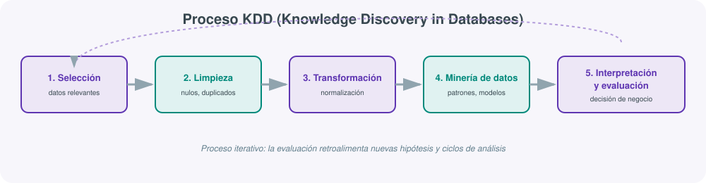

# **📈 UT05 · Validación de técnicas Big Data en la toma de decisiones en Inteligencia de Negocio (BI)**



## Resultado de aprendizaje y criterios de evaluación

**RA5.** Valida las técnicas de Big Data para transformar una gran cantidad de datos en información significativa, facilitando la toma de decisiones de negocios.

Criterios de evaluación:

a) Se han seleccionado gran cantidad de datos estructurados y no estructurados para reforzar la función de BI.
b) Se ha realizado la limpieza y transformación de datos en base a los objetivos predeterminados.
c) Se ha comprobado que el Big Data multiplica la relevancia y la utilidad del BI para el negocio.
d) Se han conjugado dentro de un modelo de empresa datos de clientes, financieros de ventas, de productos, de marketing, de redes sociales, de la competencia, entre otros, para extraer un análisis valioso y efectivo para el negocio.
e) Se ha evaluado e interpretado la información extraída de los datos y su influencia en el triunfo de diferentes negocios.
f) Se ha simulado la implantación de un modelo de Inteligencia de negocios BI.

## 1. De vuelta a la Inteligencia de Negocio, ahora con Big Data

En la UT1 definimos la **Inteligencia de Negocio (BI)** como el conjunto de estrategias, procesos y tecnologías que transforman datos brutos en información significativa: extracción, integración y visualización de datos en dashboards, informes y cuadros de mando que permiten supervisar el rendimiento, identificar tendencias y tomar decisiones basadas en evidencia, no en intuición.

Lo que cambia en esta unidad es la **escala** y la **variedad** del dato de entrada. El BI clásico trabajaba casi siempre sobre un Data Warehouse alimentado por los sistemas transaccionales propios de la empresa (ventas, ERP, CRM): datos estructurados, limpios, en volúmenes moderados. El Big Data multiplica la relevancia y utilidad de esa misma disciplina (criterio c) por dos motivos:

1. Permite incorporar **datos no estructurados o semiestructurados** que antes quedaban fuera del análisis: texto libre de redes sociales, logs de navegación web, imágenes, audio de un centro de atención al cliente.
2. Permite combinar, dentro de un mismo modelo de análisis, fuentes que tradicionalmente vivían en silos separados: datos de clientes, financieros, de ventas, de producto, de marketing, de redes sociales y hasta de la competencia (criterio d), obteniendo una imagen mucho más completa del negocio de la que daría cualquiera de esas fuentes por separado.

## 2. El proceso KDD: de los datos en bruto a la decisión

El marco de referencia clásico para estructurar un proyecto de análisis de datos es el proceso **KDD** (*Knowledge Discovery in Databases*), del que la minería de datos es solo una de sus etapas. El RD 279/2021 lo cita explícitamente como contenido de esta unidad, y conviene dominarlo porque es, en el fondo, una versión más detallada del ciclo dato → información → conocimiento → decisión que vimos en la UT1.

### Selección (criterio a)

Consiste en decidir qué datos, de entre todos los disponibles en la organización, son relevantes para el objetivo de análisis planteado. En un contexto Big Data esto implica seleccionar tanto **fuentes estructuradas** (tablas de ventas, tablas de clientes) como **no estructuradas** (comentarios de una encuesta de satisfacción, publicaciones en redes sociales que mencionen la marca). Seleccionar mal en esta fase —por ejemplo, ignorar el dato de redes sociales cuando el objetivo es medir reputación de marca— condiciona irremediablemente la calidad de todo el análisis posterior, por sofisticada que sea la técnica de minería que se use después.

### Limpieza (criterio b)

Ya trabajada en profundidad en la UT1 y la UT3: gestión de valores perdidos, detección de outliers, verificación de la integridad y calidad del dato. En el contexto de BI, la limpieza no es un fin en sí mismo, sino que debe hacerse **en base a los objetivos predeterminados** del análisis: no se limpia "todo lo que se pueda", se limpia lo que afecta a la pregunta de negocio que se quiere responder.

### Transformación

Adaptación del dato limpio al formato que necesita la técnica de análisis elegida: discretización de variables continuas, normalización de escalas, agregación de detalle transaccional a niveles superiores (de ventas por ticket a ventas mensuales por región), creación de variables derivadas con significado de negocio (por ejemplo, el "valor de vida del cliente" a partir de su histórico de compras).

### Minería de datos

Es la fase donde se aplican algoritmos para descubrir patrones no evidentes a simple vista. No hace falta ser un especialista en Machine Learning para conocer las familias de técnicas más habituales en un contexto de BI:

| Técnica | Pregunta que responde | Ejemplo de negocio |
|---|---|---|
| Clasificación | ¿A qué categoría pertenece este caso? | ¿Este cliente va a darse de baja (*churn*)? |
| Regresión | ¿Cuál será el valor de esta variable? | ¿Cuánto va a facturar el próximo trimestre? |
| Clustering (segmentación) | ¿Qué grupos naturales existen en los datos? | Segmentos de clientes por comportamiento de compra |
| Reglas de asociación | ¿Qué elementos aparecen juntos con frecuencia? | "Quien compra A también compra B" (cesta de la compra) |

### Interpretación y evaluación (criterio e)

De nada sirve un modelo estadísticamente correcto si nadie es capaz de interpretarlo o si sus conclusiones no se contrastan con la realidad del negocio. Esta fase evalúa si los patrones encontrados son realmente útiles, novedosos y comprensibles para quien debe tomar la decisión final, y es, precisamente, donde se cierra el ciclo hacia la decisión de negocio.

El proceso KDD es, además, **iterativo**: la evaluación de un resultado suele generar nuevas preguntas que obligan a volver a la fase de selección con un enfoque distinto, no es una línea recta de un único paso.

## 3. Herramientas de cuadro de mando: el caso de Power BI

Todo este proceso analítico necesita, al final, una capa de presentación comprensible para perfiles no técnicos (enlazando con el criterio e de la UT1). **Microsoft Power BI** es, hoy, una de las herramientas de BI *self-service* más extendidas en el mercado, y conviene conocer sus piezas:

- **Power BI Desktop**: la aplicación donde se modelan los datos y se diseñan los informes, de uso gratuito.
- **Power Query**: el motor de conectividad y transformación (una interfaz gráfica sobre un lenguaje llamado M) que permite conectar con cientos de orígenes de datos distintos —bases de datos relacionales, ficheros planos, APIs REST, y también con motores Big Data como Databricks, Spark o Snowflake— y aplicar transformaciones sin escribir SQL.
- **DAX** (*Data Analysis Expressions*): el lenguaje de fórmulas para crear medidas y columnas calculadas sobre el modelo de datos (equivalente, conceptualmente, a las fórmulas de Excel pero pensado para modelos relacionales completos).
- **Power BI Service**: la plataforma cloud donde se publican y comparten los informes ya terminados.

Un aspecto clave al conectar Power BI con un origen Big Data es elegir entre **importar** los datos (se copian al modelo de Power BI, consultas muy rápidas, pero hay que refrescar periódicamente) o usar **DirectQuery** (cada visualización lanza una consulta en vivo contra el origen —por ejemplo, contra una tabla de Athena o un Data Warehouse cloud—, sin duplicar el dato, a costa de una latencia mayor por consulta). Esta decisión es, en el fondo, la misma que vimos en la UT1 entre Data Lake y Data Warehouse: un compromiso entre coste/frescura del dato y velocidad de consulta.

## 4. Simulación de la implantación de un modelo BI (criterio f)

Implantar un modelo de BI en una organización real no termina con "crear el dashboard". Un proceso de implantación completo incluye:

1. **Definición de KPIs**: acordar con el negocio qué indicadores concretos se van a medir (no todo lo que se puede medir merece un panel).
2. **Diseño del modelo de datos** subyacente (recordemos el esquema en estrella de la UT1): tabla de hechos y dimensiones que sostienen las visualizaciones.
3. **Construcción y validación** del cuadro de mando con un grupo reducido de usuarios antes de desplegarlo a toda la organización.
4. **Despliegue y formación** de los usuarios finales, que rara vez son perfiles técnicos.
5. **Gobierno**: quién puede modificar el modelo, con qué frecuencia se refresca el dato, quién es responsable de su calidad.

## 4bis. Tipos de visualización según la pregunta de negocio

Un error habitual al empezar con Power BI (o cualquier otra herramienta de BI) es elegir el tipo de gráfico por estética en lugar de por la pregunta que debe responder. Una referencia rápida:

| Pregunta de negocio | Visualización recomendada |
|---|---|
| ¿Cómo evoluciona una métrica en el tiempo? | Gráfico de líneas |
| ¿Cómo se compone un total entre categorías? | Gráfico de barras apiladas o de sectores (con pocas categorías) |
| ¿Cómo se comparan varias categorías entre sí? | Gráfico de barras |
| ¿Existe relación entre dos variables numéricas? | Diagrama de dispersión |
| ¿Cómo varía una métrica según dos dimensiones (por ejemplo, región y mes)? | Mapa de calor (*matrix*) |
| ¿Dónde ocurre algo geográficamente? | Mapa |
| ¿Cuál es el valor de una única métrica clave (KPI)? | Tarjeta (*card*) con indicador de variación |

## 5. Validación de técnicas BI: ¿cómo sabemos que el modelo funciona?

Validar no es solo "que el dashboard cargue sin errores". Se valida un modelo de BI en, al menos, tres planos:

- **Validación técnica**: los números del dashboard cuadran con una consulta manual de control sobre el origen de datos (por ejemplo, contra el propio Data Warehouse o mediante una consulta SQL directa en Athena).
- **Validación estadística** (cuando hay un modelo predictivo detrás, como en *churn* o previsión de demanda): técnicas como la validación cruzada (*cross-validation*), que reserva parte de los datos históricos para comprobar si el modelo generaliza bien a casos que no ha visto durante su construcción.
- **Validación de negocio**: la persona que toma la decisión final confirma que la conclusión del análisis es coherente con su conocimiento del negocio y, sobre todo, que la decisión tomada a partir de ella produce el resultado esperado con el tiempo (por ejemplo, si el modelo predijo qué clientes se iban a dar de baja y la campaña de retención dirigida a ellos efectivamente redujo la fuga).

Esta triple validación es la que da sentido al resultado de aprendizaje completo: no basta con procesar datos a gran escala (eso ya lo garantiza el ecosistema Big Data trabajado en las UT2-UT4), hay que demostrar que ese procesamiento se traduce en información fiable y en decisiones mejores que las que se tomarían sin él.

Un ejemplo mínimo de validación estadística, para un modelo predictivo simple entrenado con Spark MLlib sobre un conjunto de datos ya limpio y transformado:

```python
from pyspark.ml.classification import LogisticRegression
from pyspark.ml.evaluation import BinaryClassificationEvaluator

# División del histórico en entrenamiento (70%) y prueba (30%)
train, test = df.randomSplit([0.7, 0.3], seed=42)

modelo = LogisticRegression(featuresCol="features", labelCol="abandono").fit(train)
predicciones = modelo.transform(test)

evaluador = BinaryClassificationEvaluator(labelCol="abandono")
auc = evaluador.evaluate(predicciones)
print(f"Área bajo la curva ROC sobre datos NO vistos: {auc:.3f}")
```

La clave de este fragmento no es la sintaxis de PySpark, sino la idea de fondo: el modelo se evalúa siempre sobre datos que **no ha visto durante su entrenamiento** (`test`), porque evaluarlo sobre los mismos datos con los que se ha construido (`train`) daría una falsa sensación de precisión.

## 6. Un ejemplo de minería de datos: segmentación RFM

Para no quedarnos solo en la teoría de la tabla de técnicas de minería, vale la pena desarrollar un ejemplo completo y muy usado en retail y marketing: la segmentación **RFM** (*Recency, Frequency, Monetary*). Es una técnica de clustering manual, sin necesidad de librerías de Machine Learning, perfectamente calculable con medidas DAX en Power BI o con una consulta SQL/Spark:

- **Recencia (R)**: cuántos días han pasado desde la última compra de un cliente. Cuanto menor, mejor.
- **Frecuencia (F)**: cuántas compras ha realizado en un periodo de referencia (por ejemplo, el último año).
- **Valor monetario (M)**: cuánto ha gastado en total en ese mismo periodo.

Cada cliente recibe una puntuación de 1 a 5 en cada una de las tres dimensiones (por ejemplo, dividiendo la base de clientes en quintiles), y la combinación de las tres puntuaciones define un segmento:

| Segmento | R | F | M | Interpretación de negocio |
|---|---|---|---|---|
| Campeones | Alta | Alta | Alta | Clientes ideales: compran a menudo, recientemente y gastan mucho |
| En riesgo | Baja | Alta | Alta | Antes compraban mucho, llevan tiempo sin volver: prioridad de retención |
| Nuevos prometedores | Alta | Baja | Media | Compraron hace poco, aún no fidelizados |
| Hibernando | Baja | Baja | Baja | Apenas actividad: baja prioridad de inversión en marketing |

```dax
Recencia = DATEDIFF(MAX(Ventas[Fecha]), TODAY(), DAY)
Frecuencia = CALCULATE(COUNTROWS(Ventas), Ventas[Fecha] >= TODAY() - 365)
ValorMonetario = CALCULATE(SUM(Ventas[Importe]), Ventas[Fecha] >= TODAY() - 365)
```

Esta técnica ilustra bien el criterio (e) del resultado de aprendizaje: el modelo no predice nada por arte de magia, pero **interpretar** correctamente los tres ejes y cruzarlos es lo que convierte un cálculo sencillo en una recomendación de negocio accionable ("lanza una campaña de reactivación específica para el segmento 'en riesgo'").

## 7. Arquitecturas Lakehouse y BI: cerrando el círculo del módulo

Esta última unidad cierra el círculo de todo el módulo. El dato que en la UT1 decidimos cómo almacenar, que en la UT2 procesamos con Spark, que en la UT3 protegimos con mecanismos de integridad y que en la UT4 monitorizamos para garantizar su fiabilidad, termina su recorrido precisamente aquí: convertido en un cuadro de mando que una persona sin conocimientos técnicos puede usar para decidir.

En 2026, la tendencia más relevante en esta capa final es que la frontera entre el motor de procesamiento Big Data y la herramienta de BI se difumina cada vez más:

- Herramientas como **Power BI** pueden conectar en modo DirectQuery directamente contra un Lakehouse (por ejemplo, tablas Delta en Databricks, o el llamado *Direct Lake* de Microsoft Fabric), consultando el mismo dato en formato Parquet/Delta que procesó Spark, sin necesidad de un Data Warehouse relacional intermedio.
- Herramientas open-source como **Apache Superset** o **Metabase** ofrecen una alternativa sin coste de licencia para equipos que ya tienen su dato en un data lake y no necesitan las funcionalidades empresariales de Power BI o Tableau.

| Herramienta | Modelo | Coste | Punto fuerte |
|---|---|---|---|
| **Power BI** | Self-service BI, integración Microsoft | Gratuito (Desktop) / licencia (Service) | Ecosistema Office 365, DAX, gran variedad de conectores |
| **Tableau** | Self-service BI | Licencia | Visualización avanzada, comunidad muy consolidada |
| **Apache Superset** | Open source | Gratuito | Se integra de forma nativa con motores SQL Big Data (Trino, Presto, Spark SQL) |
| **Metabase** | Open source | Gratuito (versión Community) | Muy sencillo para equipos pequeños, consultas en lenguaje natural básico |

La elección entre una y otra rara vez es una cuestión puramente técnica: depende del presupuesto, de las licencias ya contratadas por la organización (por ejemplo, si ya paga Microsoft 365) y del perfil de quien va a mantener los informes en el día a día.

## 8. Datos no estructurados en el KPI: un mini-caso de análisis de texto

El criterio (a) exige explícitamente combinar datos estructurados y no estructurados. Un caso muy habitual es incorporar un **índice de sentimiento** calculado sobre texto libre (reseñas, tickets de soporte, menciones en redes sociales) como una columna más dentro del modelo de BI, al mismo nivel que cualquier métrica de ventas.

Un pipeline simplificado, apoyado en lo visto en la UT2, podría ser:

```python
from pyspark.sql.functions import udf
from pyspark.sql.types import StringType

# analizar_sentimiento() encapsula una librería de PLN (por ejemplo, un modelo
# preentrenado en Hugging Face) que clasifica un texto como positivo/neutro/negativo
analizar_sentimiento_udf = udf(analizar_sentimiento, StringType())

reseñas_clasificadas = (
    reseñas_df
    .withColumn("sentimiento", analizar_sentimiento_udf(reseñas_df.texto))
)

resumen_diario = (
    reseñas_clasificadas
    .groupBy("fecha", "sentimiento")
    .count()
)

resumen_diario.write.parquet("s3://datalake/processed/sentimiento_diario/")
```

El resultado (`resumen_diario`) ya es un dato **estructurado** —una tabla con fecha, sentimiento y recuento— perfectamente conectable desde Power BI junto al resto de tablas del modelo, como una dimensión más. Esta es, en esencia, la respuesta técnica al criterio (d): el dato no estructurado no se analiza "aparte", se transforma hasta el punto de poder convivir en el mismo modelo relacional que los datos de ventas, clientes o marketing.

## 9. Tabla de hechos y dimensiones para el caso de la práctica

A modo de plantilla de referencia para el modelo dimensional de la práctica de esta unidad:

| Tabla | Tipo | Columnas clave |
|---|---|---|
| `Hechos_Ventas` | Hechos | `id_venta`, `fk_fecha`, `fk_producto`, `fk_cliente`, `importe`, `unidades` |
| `Dim_Fecha` | Dimensión | `fecha`, `año`, `mes`, `trimestre`, `dia_semana` |
| `Dim_Producto` | Dimensión | `id_producto`, `categoria`, `subcategoria`, `marca` |
| `Dim_Cliente` | Dimensión | `id_cliente`, `segmento_rfm`, `región`, `fecha_alta` |
| `Hechos_Sentimiento` | Hechos (no estructurado transformado) | `fk_fecha`, `fk_producto`, `sentimiento`, `num_menciones` |

## 10. Ejemplo de síntesis

!!! example "De los datos dispersos a la decisión de marketing"
    Una cadena de tiendas de moda quiere decidir en qué tres ciudades abrir su próxima tienda física. **Selección**: se reúnen datos de ventas online por código postal, datos demográficos públicos, menciones de la marca en redes sociales geolocalizadas y datos de tráfico peatonal de centros comerciales de la competencia. **Limpieza**: se descartan menciones en redes sociales de cuentas identificadas como bots, y se homogeneizan los códigos postales entre las distintas fuentes. **Transformación**: se agregan las ventas online a nivel de ciudad y se calcula un índice combinado de "afinidad de marca" por zona. **Minería**: un modelo de clustering agrupa las ciudades candidatas en función de ese índice y de variables demográficas. **Interpretación**: el equipo de expansión revisa el resultado, descarta una ciudad porque ya hay un acuerdo de exclusividad con otro centro comercial (conocimiento de negocio que ningún dato reflejaba) y elige finalmente dos de las tres ciudades sugeridas por el modelo. Meses después, se **valida** el modelo comparando las ventas reales de las tiendas abiertas frente a la previsión inicial.

## 11. Errores frecuentes al implantar un modelo BI

Una checklist práctica, útil tanto para la práctica de esta unidad como para un proyecto real, de errores habituales que invalidan un cuadro de mando aunque técnicamente "funcione":

1. Construir el dashboard antes de acordar con el negocio qué pregunta debe responder.
2. Mezclar en el modelo datos con distinta granularidad sin dejarlo explícito (por ejemplo, una tabla diaria y otra mensual sin una jerarquía de fechas común).
3. No documentar el origen y la frecuencia de actualización de cada fuente, de forma que nadie sabe si un número "de ayer" es realmente de ayer.
4. Usar DirectQuery contra un origen lento sin advertir al usuario de los tiempos de espera esperables.
5. No validar ni una sola cifra del dashboard contra el sistema origen antes de publicarlo.
6. Publicar el informe sin definir quién es responsable de mantenerlo cuando cambie el modelo de datos de origen.

## 12. Autoevaluación rápida

Antes de empezar la práctica, comprueba que puedes responder con seguridad a estas preguntas; si alguna te genera dudas, conviene repasar el apartado correspondiente antes de continuar:

1. ¿Por qué el Big Data "multiplica" la utilidad del BI en lugar de simplemente "añadir más datos"? (apartado 1)
2. Ordena de memoria las cinco fases del proceso KDD y pon un ejemplo propio de cada una. (apartado 2)
3. ¿Cuándo elegirías modo importación frente a DirectQuery en Power BI? (apartado 3)
4. ¿Qué segmento RFM priorizarías para una campaña de retención urgente, y por qué? (apartado 6)
5. Explica con tus palabras la diferencia entre validación técnica, estadística y de negocio. (apartado 5)

## 13. Buenas prácticas al nombrar medidas y tablas

Un modelo de Power BI que va a mantener otra persona (o tú mismo, seis meses después) se agradece mucho si sigue una convención de nombres consistente:

- Prefijar las tablas de hechos con `Hechos_` y las de dimensión con `Dim_`, como en la plantilla del apartado 9.
- Nombrar las medidas en lenguaje de negocio, no técnico: `Ventas totales` en lugar de `SUM_importe_ventas_2`.
- Agrupar medidas relacionadas en una tabla auxiliar sin datos, dedicada solo a contener medidas (una práctica habitual en Power BI para mantener el modelo ordenado).
- Documentar en la propia herramienta (campo de descripción de cada medida) qué calcula y de qué fuente depende.

## Para profundizar

Puedes ampliar el manejo de Power BI con la [documentación oficial de Microsoft Learn](https://learn.microsoft.com/es-es/power-bi/explore-reports/){:target="_blank"} y el listado completo de [conectores de Power Query](https://learn.microsoft.com/es-es/power-query/connectors/){:target="_blank"}, muy útil para saber si Power BI puede conectar directamente con el origen Big Data que hayas construido en las unidades anteriores. El resto de enlaces recopilados, incluyendo un curso completo de Power BI en vídeo y datasets de práctica, está en la página de [Recursos](99-recursos.md).
