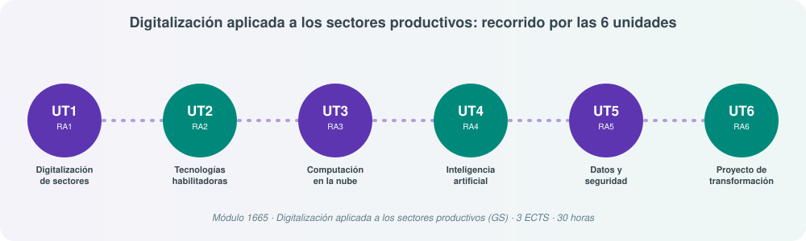

# **📲 Digitalización aplicada a los sectores productivos (DJK)**

## Bienvenida

Este bloque de apuntes corresponde al módulo profesional **Digitalización aplicada a los sectores productivos**, un módulo transversal presente en los ciclos formativos de Grado Superior, y en particular en el de **Administración de Sistemas Informáticos en Red (ASIR)**.

Su finalidad es que el alumnado entienda **qué significa digitalizar una empresa de principio a fin**: desde el concepto mismo de digitalización y su impacto en los entornos IT/OT, pasando por las tecnologías habilitadoras digitales (THD) que la hacen posible, la computación en la nube como infraestructura de base, la inteligencia artificial como motor de automatización, la importancia y protección de los datos (incluida la identidad digital y la firma electrónica), hasta culminar con el diseño de un proyecto real de transformación digital.

## Cómo está organizado el módulo

El currículo oficial define **seis resultados de aprendizaje (RA)**, y en este material cada uno se corresponde con una **Unidad de Trabajo (UT)**. Es una equivalencia 1:1: aprobar una UT significa haber alcanzado su RA correspondiente.

| UT | Resultado de aprendizaje (resumen) | Contenido principal |
|---|---|---|
| **UT1** | Analiza el concepto de digitalización y su repercusión en los sectores productivos, identificando entornos IT y OT | Digitalización vs. transformación digital, plan digital, entornos IT/OT, departamentos IT, certificados digitales, Sistema Cl@ve, firma electrónica |
| **UT2** | Caracteriza las tecnologías habilitadoras digitales (THD) necesarias para la transformación de las empresas | 5G, IoT, IA, Big Data, Blockchain, realidades inmersivas, robótica colaborativa, gemelos digitales... |
| **UT3** | Identifica sistemas basados en cloud/nube y su influencia en el desarrollo de los sistemas digitales | Modelos de nube, IaaS/PaaS/SaaS/XaaS, edge/fog/mist computing |
| **UT4** | Identifica aplicaciones de la IA en el sector, describiendo las mejoras implícitas en su implementación | Tipos de IA, machine/deep learning, minería de datos, IA en sistemas informáticos, ingeniería de prompt |
| **UT5** | Evalúa la importancia de los datos y su protección, definiendo sistemas de seguridad y ciberseguridad | Ciclo de vida del dato, Big Data, DNIe |
| **UT6** | Desarrolla un proyecto de transformación digital de una empresa de un sector relacionado con el título | Metodología de proyecto, THD aplicables, seguridad, integración de datos, documentación |

## Cómo aprovechar estos apuntes

Estos apuntes están pensados para leerse de forma secuencial (UT1 → UT6), ya que cada unidad se apoya conceptualmente en la anterior: la digitalización (UT1) se apoya en tecnologías habilitadoras concretas (UT2), muchas de las cuales dependen de la nube (UT3) y de la inteligencia artificial (UT4); todo ello genera datos que hay que proteger (UT5); y el conjunto se aplica finalmente en un proyecto real de transformación digital (UT6).

Al final del bloque encontrarás una página de **recursos** con enlaces oficiales de referencia (FNMT, Cl@ve, Autofirma, AWS Academy, documentación de THD) para quien quiera repasar o profundizar más allá del temario.

