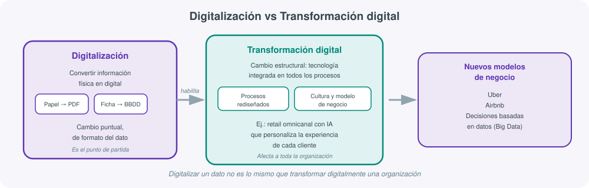
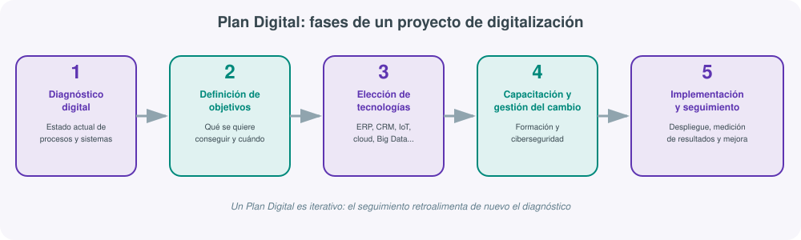
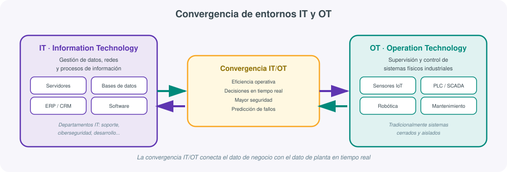

# **🏭 UT01 · Digitalización en los sectores productivos**

!!! note "Resultado de aprendizaje"
    **RA1.** Analiza el concepto de digitalización y su repercusión en los sectores productivos teniendo en cuenta la actividad de la empresa e identificando entornos IT (*Information Technology*) y OT (*Operation Technology*) característicos.

    Criterios de evaluación:

    a) Se ha descrito en qué consiste el concepto de digitalización.
    b) Se ha relacionado la implantación de la tecnología digital con la organización de las empresas.
    c) Se han establecido las diferencias y similitudes entre los entornos IT y OT.
    d) Se han identificado los departamentos típicos de las empresas que pueden constituir entornos IT.
    e) Se han seleccionado las tecnologías típicas de la digitalización en planta y en negocio.
    f) Se ha analizado la importancia de la conexión entre entornos IT y OT.
    g) Se han analizado las ventajas de digitalizar una empresa industrial de extremo a extremo.

## 1. El concepto de digitalización

Antes de hablar de fábricas inteligentes, sensores o ERPs conviene fijar una idea básica que sostiene toda la unidad (criterio a): **digitalizar** es convertir información que existe en un soporte físico o analógico en información representada en formato digital, es decir, en datos que un ordenador puede almacenar, procesar y transmitir. Escanear una factura en papel y guardarla como PDF es digitalización. Sustituir una ficha de cliente en una carpeta de cartón por un registro en una base de datos es digitalización. Convertir la señal analógica de un sensor de temperatura en un valor numérico que viaja por una red es, también, digitalización.

Es un concepto deliberadamente modesto: afecta al **formato del dato**, no todavía a cómo se usa ese dato ni a cómo cambia la organización que lo genera. Y, sin embargo, es el paso indispensable sobre el que se construye todo lo demás: no se puede automatizar, analizar ni tomar decisiones basadas en datos si esos datos no existen antes en formato digital.

!!! tip "Digitalización no es lo mismo que transformación digital"
    Es muy habitual usar ambos términos como sinónimos, y en el ámbito profesional esa confusión genera expectativas equivocadas sobre un proyecto. La **digitalización** es el proceso técnico de convertir información física en digital. La **transformación digital** es algo de mayor alcance: un cambio **estructural** que integra la tecnología digital en todos los procesos de la organización, modificando cómo se trabaja, cómo se decide y, en muchos casos, cómo se genera valor. Un ejemplo habitual es una empresa de retail que pasa de vender solo en tienda física a operar de forma **omnicanal**, incorporando inteligencia artificial para personalizar la experiencia de cada cliente según su historial de compra: ahí ya no se trata de convertir un papel en un PDF, sino de repensar el propio modelo de relación con el cliente.

Esta distinción —digitalización como paso técnico puntual, transformación digital como cambio de fondo en la organización— es la que recorre el resto de la unidad y explica por qué el RA1 habla de "repercusión en los sectores productivos" y no solo de "convertir datos".

Esa repercusión no es igual en todos los sectores: una empresa agroalimentaria digitaliza de forma distinta a una consultora de servicios, y una fábrica de componentes electrónicos se enfrenta a retos de digitalización distintos a los de una cadena de tiendas de ropa. Lo que sí comparten todas ellas, con independencia del sector, es la necesidad de distinguir entre el entorno que gestiona la información de negocio (IT) y el que gestiona los procesos físicos de producción (OT), distinción que se desarrolla en detalle en el apartado 5 de esta unidad.

## 2. Transformación digital: beneficios y desafíos

Una vez fijada la diferencia entre digitalizar y transformar digitalmente, conviene entender **por qué** las empresas afrontan este segundo proceso, con qué beneficios y con qué costes reales, porque ningún plan de digitalización se sostiene si no responde a un beneficio concreto para el negocio (criterio b).

Entre los beneficios que con más frecuencia justifican una transformación digital destacan:

- **Automatización de procesos**: tareas repetitivas que antes requerían intervención humana pasan a ejecutarse mediante software o maquinaria programada. El ejemplo más visual es el de los robots que ensamblan productos en una línea de producción, pero el mismo principio se aplica a procesos administrativos (facturación automática, conciliación bancaria).
- **Toma de decisiones basada en datos**: el uso de *big data* y análisis predictivo permite anticipar tendencias, detectar patrones de consumo o prever averías antes de que ocurran, en lugar de decidir por intuición o experiencia exclusivamente.
- **Experiencia de cliente mejorada**: sistemas de recomendación en comercio electrónico, atención personalizada mediante chatbots o análisis del comportamiento de navegación son ejemplos directos de cómo el dato digital mejora la relación con el cliente.
- **Nuevos modelos de negocio**: la transformación digital no solo mejora procesos existentes, también habilita negocios que serían imposibles sin ella. **Uber** y **Airbnb** son los ejemplos de referencia: ninguna de las dos empresas es dueña de los vehículos o alojamientos que ofrece, y su valor reside enteramente en la plataforma digital que conecta oferta y demanda.

Frente a estos beneficios, existen **desafíos** reales que cualquier proyecto de digitalización debe prever, no solo como riesgo técnico sino como riesgo de proyecto:

| Desafío | Qué implica en la práctica |
|---|---|
| **Resistencia al cambio** | Empleados y mandos intermedios que perciben la nueva tecnología como una amenaza a su puesto o a su forma habitual de trabajar |
| **Ciberseguridad** | Cuantos más sistemas y datos se digitalizan, mayor es la superficie expuesta a ataques, fugas de información o ransomware |
| **Falta de habilidades digitales** | La plantilla puede no estar formada para operar las nuevas herramientas, lo que exige un plan de capacitación paralelo a la implantación técnica |
| **Costes de implementación** | Licencias de software, hardware, consultoría externa y, sobre todo, el tiempo de adaptación durante el cual la productividad puede bajar antes de subir |

!!! example "Ejemplos de transformación digital por sector"
    - **Industria 4.0**: fábricas inteligentes que combinan IoT (sensores conectados), inteligencia artificial y automatización para optimizar la producción en tiempo real.
    - **Agricultura de precisión**: uso de drones y sensores de humedad o composición del suelo para ajustar el riego y el abono parcela a parcela, en lugar de aplicar el mismo tratamiento a todo el terreno.
    - **Salud**: telemedicina para consultas remotas y explotación de big data médico para investigación y diagnóstico asistido.

## 3. Digitalización y organización de la empresa

El criterio (b) exige relacionar la implantación de tecnología digital con **cómo se organiza** una empresa, y no solo con qué herramientas usa. La tecnología no se añade "por encima" de la organización existente sin más: la transforma, y esa transformación se puede observar en al menos tres planos.

### Transformación de procesos y operaciones

La implantación de un sistema **ERP** (*Enterprise Resource Planning*) es el ejemplo más claro de este primer plano. Antes de un ERP, compras, almacén, contabilidad y ventas suelen trabajar con hojas de cálculo o aplicaciones aisladas que no se comunican entre sí, y cualquier dato compartido se transmite "a mano" (un correo, una hoja impresa). Un ERP integra todos esos procesos en un único sistema con una base de datos común: cuando ventas registra un pedido, almacén ve automáticamente la necesidad de reposición y contabilidad recibe la información para facturar, sin que nadie tenga que introducir el mismo dato dos veces.

### Impacto en la cultura organizacional

La tecnología también cambia **cómo se trabaja y cómo se decide**, no solo qué herramientas se usan. Empresas como **Google** son el ejemplo de referencia de una cultura organizacional construida alrededor de la tecnología: equipos que colaboran en documentos compartidos en tiempo real, decisiones apoyadas en paneles de datos accesibles por cualquier empleado, y una estructura menos jerárquica en la que la información fluye horizontalmente en lugar de subir y bajar por una cadena de mando rígida.

### Relación con clientes y mercado

Un sistema **CRM** (*Customer Relationship Management*) transforma cómo una empresa gestiona su relación con los clientes: centraliza el histórico de interacciones, permite segmentar campañas de marketing según el comportamiento real de cada cliente y da visibilidad a todo el equipo comercial sobre el estado de cada oportunidad de venta, en lugar de depender de la memoria o la agenda personal de cada comercial.

!!! example "Odoo: un ERP+CRM modular como caso real"
    **Odoo** es una plataforma de gestión empresarial de referencia que ilustra bien cómo conviven ERP y CRM en un mismo producto: ofrece módulos independientes pero integrados para gestión de inventario, facturación, contabilidad, marketing y relación con clientes, de modo que una pyme puede empezar activando solo el módulo de facturación e ir incorporando el resto de módulos a medida que digitaliza más áreas de su actividad, sin cambiar de plataforma.

Estas transformaciones no llegan sin fricción. Los mismos desafíos vistos en el apartado anterior —resistencia al cambio, ciberseguridad, coste de la inversión inicial, falta de habilidades digitales— reaparecen aquí a nivel organizativo, junto con una serie de **responsabilidades** que la dirección de la empresa no puede delegar por completo en el departamento técnico:

| Responsabilidad | En qué consiste |
|---|---|
| **Liderazgo estratégico** | Definir la dirección del cambio y comunicarla, para que no se perciba como una imposición técnica sin propósito |
| **Protección de datos (RGPD)** | Garantizar que los nuevos sistemas cumplen la normativa de protección de datos personales desde su diseño |
| **Formación** | Planificar la capacitación del personal en paralelo a la implantación, no como una ocurrencia tardía |
| **Monitoreo** | Medir si la tecnología implantada está produciendo los resultados esperados y corregir el rumbo si no es así |

## 4. El Plan Digital: cómo se aborda un proyecto de digitalización

Ninguna de las tecnologías o beneficios descritos hasta ahora se implanta de forma improvisada en una empresa seria: se sigue un **Plan Digital**, una hoja de ruta con fases reconocibles que ayuda a que el proyecto no se quede en "comprar un programa nuevo" sino en un cambio bien planificado.

1. **Diagnóstico digital**: analizar el punto de partida real de la empresa: qué procesos están ya digitalizados, cuáles no, qué sistemas existen y cómo se relacionan entre sí (o no se relacionan).
2. **Definición de objetivos**: concretar qué se quiere conseguir con el proyecto —reducir tiempos de producción, mejorar la trazabilidad, aumentar ventas online— y con qué indicadores se va a medir el éxito.
3. **Elección de tecnologías**: seleccionar las herramientas concretas (ERP, CRM, sensores IoT, plataforma de comercio electrónico...) que responden a los objetivos fijados, evitando la tentación de elegir la tecnología de moda sin relacionarla con una necesidad real.
4. **Capacitación y gestión del cambio**: formar a las personas que van a usar la nueva tecnología y anticipar la resistencia al cambio, en paralelo a la ciberseguridad de los nuevos sistemas que se ponen en marcha.
5. **Implementación y seguimiento**: desplegar la tecnología elegida y medir de forma continua si se están cumpliendo los objetivos fijados en la fase 2, ajustando lo que no funcione.

!!! warning "Un Plan Digital no termina en la implementación"
    Un error habitual es tratar la fase 5 como el final del proyecto. En la práctica, el seguimiento debe retroalimentar de nuevo el diagnóstico: la tecnología implantada genera nuevos datos y nuevas oportunidades de mejora que dan pie a un siguiente ciclo del plan. Un Plan Digital maduro es, por tanto, iterativo, no un proyecto con fecha de cierre única.

Conviene notar que las cinco fases no son un trámite exclusivo de grandes corporaciones: una pyme que decida, por ejemplo, sustituir sus hojas de cálculo de inventario por un ERP modular como Odoo (apartado 3) pasa exactamente por estas mismas fases, aunque de forma más ágil y con menos recursos dedicados a cada una. El tamaño de la empresa cambia la escala del plan, no su estructura.

## 5. Entornos IT y OT: diferencias y similitudes

El criterio (c) exige distinguir con precisión dos entornos que conviven en cualquier empresa con actividad productiva, y que tradicionalmente se han desarrollado de forma separada:

- **IT (*Information Technology*)**: el entorno dedicado a la gestión de **datos, redes y procesos de información**. Incluye servidores, bases de datos, software de gestión (ERP, CRM), redes corporativas y todo lo relacionado con el tratamiento de la información de negocio.
- **OT (*Operation Technology*)**: el entorno dedicado a la **supervisión y control de sistemas físicos industriales**. Incluye sensores, actuadores, controladores lógicos programables (PLC), sistemas SCADA y, en general, cualquier tecnología que interviene directamente en un proceso físico real (una línea de producción, una cámara frigorífica, un robot de ensamblaje).

La siguiente tabla resume las diferencias más relevantes entre ambos entornos, sin perder de vista que comparten un objetivo último: dar soporte a la actividad de la empresa mediante tecnología.

| Aspecto | Entorno IT | Entorno OT |
|---|---|---|
| Objeto que gestiona | Información y datos de negocio | Procesos y equipos físicos |
| Ejemplos típicos | Servidores, bases de datos, ERP, CRM | Sensores, PLC, SCADA, robótica industrial |
| Prioridad tradicional | Confidencialidad e integridad de los datos | Disponibilidad continua y seguridad física |
| Ciclo de vida de los sistemas | Corto: actualizaciones frecuentes | Largo: equipos que operan años o décadas sin cambios |
| Tolerancia a interrupciones | Una parada suele ser tolerable y planificable | Una parada puede detener una línea de producción completa |
| Modelo tradicional | Sistemas conectados a redes corporativas e Internet | Sistemas cerrados y aislados por diseño, pensados para funcionar de forma autónoma |

A pesar de estas diferencias, ambos entornos comparten similitudes de fondo que justifican tratarlos como parte de una misma estrategia de digitalización: los dos gestionan información (aunque de naturaleza distinta), los dos dependen cada vez más de redes de comunicación, y los dos requieren protección frente a incidentes de seguridad, aunque las consecuencias de un fallo sean distintas —en IT suele ser una pérdida de datos o de servicio; en OT puede ser un riesgo físico real para personas o instalaciones.

!!! example "Un mismo dato, dos entornos distintos"
    Piensa en el dato "temperatura de una cámara frigorífica". En el entorno **OT**, ese dato lo genera un sensor físico cada pocos segundos y su función inmediata es activar o no un sistema de refrigeración: si sube demasiado, el propio controlador de la cámara actúa sin esperar a que ninguna persona lo revise. Ese mismo dato, volcado en el entorno **IT**, puede alimentar un informe de calidad que se envía al cliente para certificar que la cadena de frío no se ha roto en ningún momento del transporte. Es el mismo dato, pero cumple una función de control físico inmediato en OT y una función de información de negocio en IT: entender esta doble vida del dato es la base para comprender por qué, más adelante en esta unidad, hablaremos de "conectar" ambos entornos en lugar de tratarlos como compartimentos aislados.

## 6. Departamentos que constituyen el entorno IT

El criterio (d) pide identificar qué departamentos suelen conformar el entorno IT de una empresa. En organizaciones de cierto tamaño, el entorno IT no es un bloque único sino que se organiza en funciones especializadas, cada una con una tarea reconocible dentro del día a día de la empresa:

| Departamento | Función principal | Ejemplo de tarea concreta |
|---|---|---|
| **IT / informática** | Paraguas general de la función tecnológica | Definir la política general de uso de equipos y aplicaciones |
| **Desarrollo de software** | Construir o adaptar aplicaciones propias | Programar un módulo a medida que el ERP comercial no cubre |
| **Operaciones de IT (administración de sistemas)** | Mantenimiento diario de servidores, redes y servicios | Aplicar actualizaciones de seguridad y revisar copias de seguridad |
| **Ciberseguridad** | Proteger sistemas y datos frente a accesos no autorizados | Configurar el cortafuegos y auditar accesos sospechosos |
| **Proyectos tecnológicos** | Gestionar la implantación de nuevas soluciones | Coordinar la puesta en marcha de un ERP nuevo con proveedores externos |
| **Soporte técnico** | Atender incidencias del día a día de los usuarios | Resolver que un empleado no puede acceder a su correo corporativo |
| **Gestión de datos y analítica** | Explotar los datos generados por la empresa | Construir el cuadro de mando mensual de ventas para dirección |
| **Infraestructura tecnológica** | Servidores, redes, almacenamiento y nube | Decidir si un nuevo servicio se aloja en un servidor propio o en la nube |
| **Arquitectura empresarial** | Diseñar cómo se relacionan los sistemas entre sí a largo plazo | Planificar cómo conectará el futuro CRM con el ERP ya existente |
| **Innovación y estrategia tecnológica** | Explorar tecnologías antes de convertirlas en proyecto | Evaluar si la inteligencia artificial generativa aporta valor al negocio |

!!! note "No todas las empresas tienen los diez departamentos"
    En una pyme, varias de estas funciones pueden recaer en la misma persona o en un proveedor externo subcontratado; en una gran corporación, cada una puede ser un departamento independiente con su propio responsable. Lo relevante para el criterio (d) no es memorizar una lista cerrada, sino saber **reconocer** estas funciones cuando aparecen descritas en el organigrama de una empresa real, aunque estén agrupadas de forma distinta.

## 7. Tecnologías de digitalización: planta y negocio

El criterio (e) exige seleccionar las tecnologías propias de cada uno de los dos grandes enfoques de digitalización de una empresa industrial: la **planta** (el entorno OT, operativo) y el **negocio** (el entorno IT, de gestión). Conviene tratarlos por separado antes de volver a unirlos, porque cada uno responde a necesidades distintas y se apoya en herramientas distintas, aunque —como se verá en el apartado siguiente— ambos acaban conectados en cualquier digitalización seria.

### Digitalización en planta

La digitalización en planta tiene un enfoque eminentemente **operativo**: busca que los procesos físicos de producción sean más eficientes, seguros y predecibles. Las tecnologías más representativas son:

- **Automatización de procesos**: sustitución de tareas manuales repetitivas por maquinaria controlada mediante software, reduciendo errores y variabilidad.
- **IoT industrial**: sensores conectados que recogen datos en tiempo real de los propios equipos de producción. Un ejemplo típico es la instalación de sensores en cámaras frigoríficas para monitorizar temperatura y humedad de forma continua, generando una alerta automática si un valor sale del rango seguro, en lugar de depender de una revisión manual periódica.
- **Mantenimiento predictivo**: análisis de los datos recogidos por sensores para anticipar el fallo de una máquina antes de que ocurra, sustituyendo el mantenimiento puramente correctivo (reparar cuando se rompe) o preventivo por calendario (revisar cada X meses aunque no haga falta).
- **Realidad aumentada y realidad virtual para entrenamiento**: simulaciones inmersivas que permiten formar a operarios en procedimientos o maquinaria peligrosa sin el riesgo ni el coste de hacerlo directamente sobre el equipo real.
- **Gemelos digitales**: réplicas virtuales de una máquina, línea de producción o planta completa que se actualizan con datos reales, permitiendo simular cambios o detectar problemas antes de aplicarlos físicamente.

### Digitalización de negocio

Frente al enfoque operativo de la planta, la digitalización de negocio tiene un enfoque **empresarial**: busca mejorar la gestión, la relación con clientes y la toma de decisiones a nivel de organización.

- **Sistemas ERP y CRM**: como se ha visto en el apartado 3, integran procesos internos (ERP) y la relación con clientes (CRM) en plataformas centralizadas.
- **Análisis de datos / Big Data**: explotación de grandes volúmenes de datos generados por la actividad de la empresa para detectar patrones, prever demanda o personalizar ofertas.
- **Comercio electrónico**: venta de productos o servicios a través de canales digitales, ampliando el mercado más allá de la tienda o el punto de venta físico.
- **Marketing digital y omnicanalidad**: campañas y atención al cliente coordinadas entre distintos canales (web, redes sociales, tienda física, aplicación móvil) de forma coherente.
- **Cloud computing**: uso de infraestructura y servicios alojados en servidores remotos de un proveedor, en lugar de mantener servidores físicos propios, lo que reduce la inversión inicial y facilita escalar la capacidad según necesidad.
- **Blockchain**: registro distribuido e inmutable de transacciones, con aplicaciones en trazabilidad de productos (por ejemplo, certificar el origen de un alimento a lo largo de toda su cadena de suministro) o en contratos inteligentes.

!!! example "Planta y negocio no son compartimentos estancos"
    Una fábrica de alimentación que instala sensores IoT en sus cámaras frigoríficas (tecnología de planta, apartado 7) puede volcar esos datos de temperatura en un panel de control accesible por el departamento de calidad y por el ERP de la empresa (tecnología de negocio, apartado 8), de modo que un cliente que pregunte por la trazabilidad de un lote reciba una respuesta basada en datos reales de producción, y no en un registro manual en papel. Este ejemplo es precisamente el puente hacia el siguiente apartado: la conexión entre IT y OT.

## 8. La conexión IT/OT y la digitalización de extremo a extremo

Los dos apartados anteriores han tratado planta y negocio por separado a propósito, para poder identificar con claridad sus tecnologías respectivas. Pero los criterios (f) y (g) de la unidad exigen dar un paso más: entender **por qué importa conectarlos** y **qué se gana** cuando esa conexión se hace de extremo a extremo, sin tratarlos como proyectos independientes.

### Por qué importa conectar los entornos IT y OT

El criterio (f) pide analizar, de forma explícita, la importancia de conectar los entornos IT y OT, y no basta con describirlos por separado como se ha hecho hasta ahora. Durante décadas, IT y OT se diseñaron y gestionaron de forma completamente independiente: IT se preocupaba de los datos de negocio y OT de que la máquina no se parara, y ambos entornos apenas intercambiaban información entre sí. Esa separación tenía sentido cuando los sistemas OT eran cerrados y aislados por diseño, pero deja de tener sentido en una empresa que quiere digitalizarse de extremo a extremo.

Cuando IT y OT se conectan, ocurren varias cosas que no serían posibles con los entornos aislados:

- Los datos generados en planta (temperatura, vibración, consumo eléctrico de una máquina) dejan de quedarse en un panel de control local y **alimentan directamente** el sistema de gestión de la empresa, permitiendo decisiones de negocio basadas en datos operativos reales.
- Las decisiones de negocio (un pedido urgente, un cambio de prioridad de producción) pueden **reflejarse en planta** casi en tiempo real, en lugar de comunicarse por teléfono o correo electrónico a quien gestiona la línea de producción.
- El **mantenimiento predictivo** (apartado 7) solo es posible si los datos de los sensores llegan a un sistema de análisis lo bastante potente como para procesarlos, algo que habitualmente reside en el lado IT del entorno de la empresa.
- La **seguridad** mejora al poder monitorizar de forma centralizada tanto los sistemas de información como los sistemas físicos, detectando anomalías que afectan a ambos entornos a la vez.

Esta conexión no está libre de riesgo: un sistema OT que tradicionalmente estaba aislado y ahora se conecta a la red corporativa (y, a través de ella, potencialmente a Internet) hereda también los riesgos de ciberseguridad propios de IT, con el agravante de que un incidente en OT puede tener consecuencias físicas, no solo una pérdida de datos. Por eso la convergencia IT/OT no es solo un proyecto de cableado o de redes: es, también, un proyecto de ciberseguridad.

!!! warning "Un fallo en OT no es solo un fallo informático"
    Cuando un servidor IT falla, la consecuencia habitual es una pérdida de servicio o de datos, molesta pero recuperable. Cuando un sistema OT conectado falla o es manipulado por un atacante, la consecuencia puede ser física: una máquina que se detiene de forma insegura, una cámara frigorífica que deja de enfriar sin que nadie lo note a tiempo, o una línea de producción completa parada durante horas. Esta diferencia de consecuencias es la razón por la que la ciberseguridad de los entornos OT conectados exige, en muchos casos, medidas específicas distintas de las que bastan en un entorno IT puramente de oficina.

### Ventajas de digitalizar una empresa industrial de extremo a extremo

El último criterio de la unidad, el (g), obliga a dar un paso más allá de analizar planta y negocio por separado: pide valorar qué se gana cuando una empresa industrial digitaliza **de extremo a extremo**, es decir, cuando conecta la digitalización de planta con la digitalización de negocio (ambas descritas en el apartado 7) en una única estrategia coherente, en lugar de abordarlas como proyectos independientes.

Entre las ventajas más relevantes de este enfoque integral destacan:

- **Visibilidad completa del proceso productivo**: desde el pedido de un cliente hasta la entrega del producto terminado, pasando por cada etapa de fabricación, queda registrado y trazable en un único flujo de datos.
- **Reducción de costes por ineficiencias invisibles**: cuando planta y negocio comparten datos, es mucho más fácil detectar cuellos de botella, sobreproducción o tiempos muertos que antes quedaban ocultos en sistemas que no se comunicaban entre sí.
- **Capacidad de respuesta ante cambios de demanda**: una empresa con digitalización de extremo a extremo puede ajustar su producción casi en tiempo real ante un pico o una caída de pedidos, en lugar de reaccionar con semanas de retraso.
- **Mejor toma de decisiones estratégicas**: la dirección dispone de datos combinados de negocio y de planta para decidir, por ejemplo, en qué línea de producción invertir o qué producto discontinuar, en lugar de basarse en informes parciales de cada área.
- **Ventaja competitiva sostenida**: una digitalización completa es más difícil de replicar por la competencia que la adopción aislada de una única tecnología, porque no reside en una herramienta concreta sino en cómo están integrados los procesos de toda la empresa.

!!! example "Síntesis: de la digitalización puntual a la empresa conectada de extremo a extremo"
    Una fábrica de componentes decide: (1) **digitalizar** sus partes de producción en papel a un sistema digital; (2) instalar **IoT industrial** en sus máquinas críticas; (3) implantar un **ERP** que reciba esos datos de producción y los cruce con pedidos y stock; (4) conectar el ERP con un **CRM** para que el equipo comercial sepa en tiempo real qué plazos de entrega son realistas; (5) analizar el conjunto con herramientas de **Big Data** para anticipar demanda. Cada paso, por separado, aporta valor; el conjunto —planta y negocio conectados— es lo que constituye una digitalización de extremo a extremo, y es exactamente lo que se te pedirá analizar en el supuesto práctico de esta unidad.

### Glosario y autoevaluación de la unidad

#### Glosario rápido

- **Digitalización**: conversión de información física o analógica en formato digital.
- **Transformación digital**: cambio estructural que integra la tecnología digital en todos los procesos de una organización.
- **IT (*Information Technology*)**: entorno dedicado a la gestión de datos, redes y procesos de información de negocio.
- **OT (*Operation Technology*)**: entorno dedicado a la supervisión y control de sistemas físicos industriales.
- **Convergencia IT/OT**: conexión entre ambos entornos para compartir datos y decisiones en tiempo real.
- **ERP** (*Enterprise Resource Planning*): sistema que integra los procesos internos de una empresa (compras, almacén, contabilidad, ventas) en una única plataforma.
- **CRM** (*Customer Relationship Management*): sistema que centraliza y gestiona la relación de la empresa con sus clientes.
- **IoT industrial**: sensores y dispositivos conectados que recogen datos en tiempo real de procesos físicos de producción.
- **Mantenimiento predictivo**: análisis de datos de sensores para anticipar el fallo de una máquina antes de que ocurra.
- **Gemelo digital**: réplica virtual de una máquina o proceso físico que se actualiza con datos reales.
- **Big Data**: análisis de grandes volúmenes de datos para detectar patrones y apoyar decisiones.
- **RGPD**: Reglamento General de Protección de Datos, normativa europea que regula el tratamiento de datos personales.
- **Plan Digital**: hoja de ruta estructurada en fases (diagnóstico, objetivos, tecnologías, capacitación, implementación) para abordar un proyecto de digitalización.

#### Autoevaluación rápida

1. Explica con tus propias palabras la diferencia entre digitalización y transformación digital, poniendo un ejemplo distinto al de retail omnicanal usado en el apartado 1.
2. Cita dos beneficios y dos desafíos de la transformación digital, y relaciona cada desafío con una posible medida para mitigarlo. (apartado 2)
3. ¿Por qué se dice que un ERP "transforma procesos" mientras que la cultura de una empresa como Google ilustra un "impacto en la organización"? ¿Son la misma idea? (apartado 3)
4. Enumera las cinco fases de un Plan Digital y explica por qué la fase de seguimiento debería retroalimentar de nuevo al diagnóstico. (apartado 4)
5. Completa la tabla comparativa de IT y OT del apartado 5 con un ejemplo propio de empresa (real o inventada) para cada entorno.
6. Elige tres departamentos IT del apartado 6 y describe qué tareas concretas realizaría cada uno en una pyme industrial de tamaño medio.
7. Clasifica estas cinco tecnologías como propias de "planta" o de "negocio": gemelo digital, CRM, mantenimiento predictivo, blockchain, realidad aumentada para entrenamiento. (apartado 7)
8. Explica, con un ejemplo distinto al de la cámara frigorífica, por qué un fallo en un sistema OT conectado puede tener consecuencias que un fallo puramente IT no tiene. (apartado 8)
9. Propón dos ventajas de digitalizar una empresa de extremo a extremo que no se hayan mencionado explícitamente en el apartado 8, razonando por qué se derivan de la conexión IT/OT y no de una tecnología aislada.

Estas preguntas están pensadas para repasar los siete criterios de evaluación del RA1 uno a uno antes de afrontar el supuesto práctico de la siguiente sección: si alguna resulta difícil de responder sin volver a mirar el apartado indicado entre paréntesis, es una buena señal de por dónde conviene repasar antes de la presentación en equipo.

## Actividades

En esta unidad se ha trabajado en el aula el supuesto práctico **"Plan de transformación digital integral"**, en el que cada equipo debe elegir una empresa (real o ficticia) de un sector productivo concreto, diagnosticar su situación actual, identificar sus entornos IT y OT, y proponer un Plan Digital completo con sus tecnologías de planta y de negocio correspondientes. El resultado se defiende en una **presentación de 10 minutos por equipo**, en la que se espera que aparezcan de forma explícita los conceptos de esta unidad: digitalización frente a transformación digital, entornos IT/OT y su convergencia, departamentos IT implicados, y las ventajas de una digitalización de extremo a extremo.

## Para profundizar

Esta unidad se ha construido a partir de los apuntes de clase del módulo de Digitalización aplicada a los sectores productivos. Para ampliar los conceptos de convergencia IT/OT e Industria 4.0 puede consultarse la documentación técnica sobre [digitalización industrial y convergencia IT/OT](https://www.industria4.com){:target="_blank"}, y para las responsabilidades legales sobre protección de datos que aparecen al implantar cualquier tecnología nueva en la empresa, el [Reglamento General de Protección de Datos (RGPD)](https://www.aepd.es/normativa/reglamento-ue-2016-679){:target="_blank"} publicado por la Agencia Española de Protección de Datos.

Como referencia adicional sobre plataformas de gestión modular mencionadas en el apartado 3, la [documentación oficial de Odoo](https://www.odoo.com/es_ES/documentation){:target="_blank"} permite explorar en detalle los módulos de ERP y CRM usados como ejemplo en esta unidad. El resto de enlaces y recursos generales del módulo está en la página de [Recursos](recursos.md).
