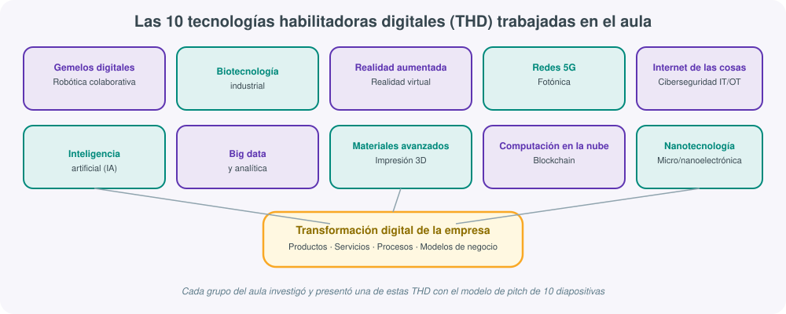
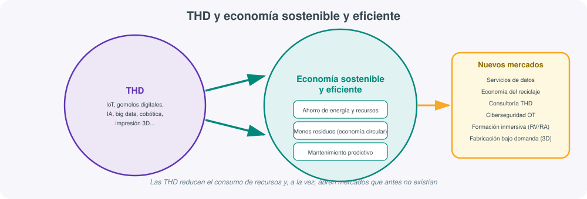
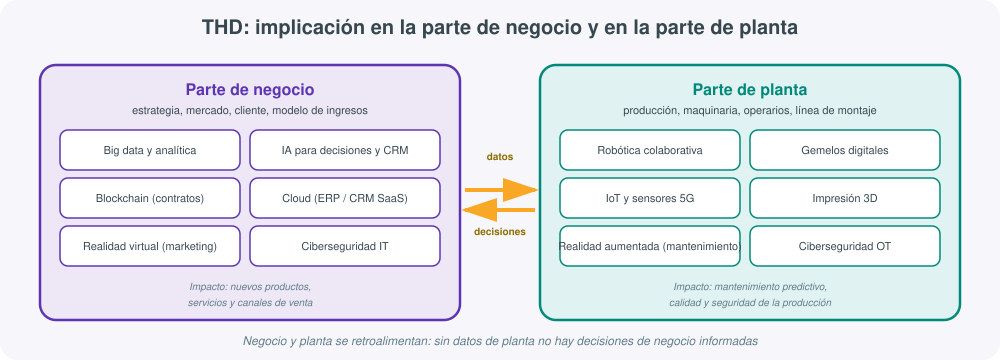

# **🔧 UT02 · Tecnologías habilitadoras digitales (THD)**

## Resultado de aprendizaje y criterios de evaluación

**RA2.** Caracteriza las tecnologías habilitadoras digitales necesarias para la adecuación/transformación de las empresas a entornos digitales describiendo sus características y aplicaciones.

Criterios de evaluación:

a) Se han identificado las principales tecnologías habilitadoras digitales.
b) Se han relacionado las THD con el desarrollo de productos y servicios.
c) Se ha relacionado la importancia de las THD con la economía sostenible y eficiente.
d) Se han identificado nuevos mercados generados por las THD.
e) Se ha analizado la implicación de THD tanto en la parte de negocio como en la parte de planta.
f) Se han identificado las mejoras producidas debido a la implantación de las tecnologías habilitadoras en relación con los entornos IT y OT.
g) Se ha elaborado un informe que relacione las tecnologías con sus características y áreas de aplicación.

!!! info "De qué trata esta unidad"
    Esta unidad recopila el trabajo hecho en el aula sobre las **Tecnologías Habilitadoras Digitales (THD)**: qué son, en qué se diferencian de una simple herramienta informática, cómo cambian el desarrollo de productos y servicios, qué relación tienen con la sostenibilidad y qué mercados nuevos generan. Incluye también los diez bloques temáticos trabajados en grupo mediante presentaciones tipo *pitch* y el proyecto real de aula del centro sobre THD.

A lo largo de los siguientes apartados se combinan tres niveles de contenido: el marco conceptual exigido por los criterios de evaluación del RA2, el resumen de las diez THD concretas trabajadas en el aula mediante presentaciones grupales, y el proyecto THD-ATECA como ejemplo de aplicación práctica dentro del propio centro educativo. Los tres niveles están pensados para leerse de forma encadenada, aunque también pueden consultarse de forma independiente como referencia rápida de una tecnología concreta.

## 1. Qué son las tecnologías habilitadoras digitales

Una **tecnología habilitadora digital (THD)** es una tecnología emergente o en plena consolidación que, por sí sola o combinada con otras, permite a una organización transformar de forma sustancial sus procesos, sus productos, sus servicios o su modelo de negocio, apoyándose en el dato y en la conectividad digital. El adjetivo "habilitadora" es clave: estas tecnologías no resuelven, en general, un problema de negocio por sí mismas, sino que **habilitan** o hacen posibles soluciones, productos y modelos de negocio que antes no eran viables técnica o económicamente.

El concepto surge, en la práctica empresarial y en la literatura sobre Industria 4.0, como una forma de agrupar bajo un mismo paraguas conceptual un conjunto de tecnologías muy distintas entre sí (una red de comunicaciones, un algoritmo de aprendizaje automático, un robot, un material nuevo) pero que comparten tres rasgos:

- **Transversalidad**: no pertenecen a un único sector, sino que se aplican en la industria, los servicios, la sanidad, la educación o la administración pública por igual.
- **Efecto multiplicador**: su valor aumenta cuando se combinan entre sí (por ejemplo, sensores IoT + redes 5G + big data + IA generan un sistema de mantenimiento predictivo mucho más potente que cualquiera de esas tecnologías por separado).
- **Capacidad de transformación**: cambian de forma significativa cómo se diseña, se fabrica, se vende o se mantiene un producto o servicio, no solo cómo se gestiona la información sobre él.

El criterio (a) del RA2 exige identificar las principales THD. El listado de referencia que se ha usado en esta unidad, agrupado por bloques afines, es el siguiente:

| Bloque | Tecnologías habilitadoras digitales |
|---|---|
| Conectividad | Redes 5G, fotónica |
| Datos e inteligencia | Big data y analítica, inteligencia artificial (IA), *machine learning*, *deep learning* |
| Infraestructura | Computación en la nube, computación difusa (*fog/edge computing*) |
| Confianza y seguridad | Blockchain / DLT, ciberseguridad IT y OT |
| Producción física | Robótica colaborativa (cobótica), gemelos digitales, impresión 3D, materiales avanzados |
| Interacción y percepción | Realidad aumentada (RA), realidad virtual (RV), realidades inmersivas |
| Frontera tecnológica | Nanotecnología, micro- y nanoelectrónica, biotecnología industrial |
| Conectividad de dispositivos | Internet de las cosas (IoT) |

!!! note "THD no es sinónimo de \"informática\""
    Es un error habitual confundir las THD con "todo lo que tiene que ver con ordenadores". Un ERP tradicional o una hoja de cálculo no son, en sí mismos, tecnologías habilitadoras digitales, aunque sean software: no cambian de forma disruptiva el modelo de negocio ni abren mercados nuevos. Un gemelo digital de una línea de producción, en cambio, sí lo es, porque permite simular, predecir y optimizar antes de tocar la máquina física.

### Grado de madurez de cada tecnología

No todas las THD se encuentran en la misma fase de adopción. Conviene distinguir, para cada una, si está en fase experimental (de laboratorio o de piloto reducido), en adopción temprana (ya usada por empresas pioneras del sector, con casos de éxito documentados) o consolidada (extendida de forma amplia, con proveedores maduros y coste de adopción asumible por pymes). Esta distinción es relevante porque condiciona tanto el riesgo de invertir en ella como el margen de diferenciación competitiva que todavía ofrece frente a la competencia:

| Fase de madurez | Riesgo de adopción | Ejemplo orientativo entre las THD estudiadas |
|---|---|---|
| Experimental | Alto: la tecnología puede cambiar de forma sustancial o no llegar a consolidarse | Nanotecnología aplicada a ciertos materiales muy específicos |
| Adopción temprana | Medio: ya existen casos de éxito, pero la implantación exige conocimiento especializado | Gemelos digitales, cobótica, Blockchain aplicado a trazabilidad |
| Consolidada | Bajo: proveedores maduros, coste accesible, curva de aprendizaje conocida | Computación en la nube, IoT básico, impresión 3D de prototipado |

## 2. THD y desarrollo de productos y servicios

El criterio (b) pide relacionar las THD con el desarrollo de productos y servicios. La forma más clara de verlo es distinguir tres momentos del ciclo de vida de un producto o servicio en los que las THD intervienen:

1. **Diseño y prototipado.** Un **gemelo digital** permite construir una réplica virtual de un producto o de una línea de producción antes de fabricar nada físico, probando variantes de diseño sin coste de material ni tiempo de máquina real. La **impresión 3D** y los **materiales avanzados** aceleran el paso del prototipo virtual al primer objeto físico, reduciendo de semanas a horas el ciclo de iteración.
2. **Producción.** La **robótica colaborativa (cobótica)** permite que un robot trabaje codo a codo con una persona en la misma célula de producción, sin las jaulas de seguridad de la robótica industrial clásica, asumiendo tareas repetitivas o de precisión mientras el operario se ocupa de las de mayor criterio. El **IoT** conectado a redes **5G** o **fotónica** aporta la telemetría en tiempo real que hace posible ajustar el proceso productivo sobre la marcha.
3. **Servicio postventa y experiencia de cliente.** La **realidad aumentada** permite a un técnico ver superpuestas, sobre la máquina real, las instrucciones de mantenimiento; la **realidad virtual** permite formar a un empleado en un entorno simulado sin riesgo; el **big data** y la **IA** permiten anticipar fallos o personalizar una oferta comercial antes de que el cliente la pida explícitamente.

!!! example "De producto a servicio: la servitización"
    Muchas THD no solo mejoran un producto, sino que cambian su naturaleza comercial. Un fabricante de maquinaria industrial que instala sensores IoT en sus máquinas y las conecta a una plataforma de análisis en la nube puede dejar de vender "una máquina" para vender "horas de funcionamiento garantizado", cobrando por disponibilidad y no por la máquina en sí. A este fenómeno se le llama **servitización**: el producto físico se convierte en la base de un servicio recurrente, posible únicamente gracias a la combinación de IoT, conectividad y analítica de datos.

## 3. THD para una economía sostenible y eficiente

El criterio (c) exige relacionar la importancia de las THD con la economía sostenible y eficiente. La relación no es incidental: buena parte de las THD reducen de forma directa el consumo de recursos, de energía o de materia prima, o alargan la vida útil de los activos existentes.

Algunos mecanismos concretos por los que una THD contribuye a la sostenibilidad:

- **Mantenimiento predictivo** (IoT + big data + IA): sustituir una pieza antes de que falle, en lugar de esperar a la avería o cambiarla de forma preventiva sin necesidad real, reduce el consumo de recambios y el desperdicio de materiales.
- **Simulación antes de fabricar** (gemelos digitales): probar virtualmente decenas de variantes de diseño antes de fabricar el primer prototipo físico evita el desperdicio de material y energía asociado a los prototipos fallidos.
- **Optimización de rutas y procesos** (big data, IA): un algoritmo que optimiza rutas logísticas o el consumo energético de una planta reduce directamente las emisiones asociadas a esa actividad.
- **Economía circular y trazabilidad** (Blockchain/DLT): un registro distribuido e inmutable permite certificar el origen de un material reciclado o el ciclo de vida completo de un producto, facilitando su reutilización o reciclaje al final de su vida útil.
- **Fabricación aditiva bajo demanda** (impresión 3D): fabricar solo la pieza necesaria, cuando se necesita, en lugar de mantener grandes inventarios o fabricar en exceso, reduce residuos y necesidades de almacenamiento.
- **Biotecnología industrial**: procesos basados en organismos o enzimas que sustituyen reacciones químicas contaminantes por procesos biológicos de menor impacto ambiental.

!!! tip "El concepto de \"economía circular\""
    La **economía circular** es un modelo económico que busca mantener los productos, componentes y materiales en uso durante el mayor tiempo posible, minimizando la extracción de nuevas materias primas y la generación de residuos. Las THD son, en la práctica, la infraestructura técnica que hace viable ese modelo a escala industrial: sin trazabilidad digital, sin sensores que informen del estado real de un material y sin plataformas que conecten a quien genera un residuo con quien puede reutilizarlo, la economía circular queda en una declaración de intenciones.

## 4. Nuevos mercados generados por las THD

El criterio (d) exige identificar nuevos mercados generados por las THD. Cada tecnología habilitadora, al consolidarse, no solo mejora procesos existentes, sino que abre categorías de negocio que antes no existían o que dependían de tecnologías mucho más caras y menos accesibles:

| THD | Mercado o categoría de negocio que genera |
|---|---|
| Redes 5G / fotónica | Servicios de baja latencia (cirugía remota, vehículo autónomo, *streaming* en tiempo real) |
| IoT | Plataformas de gestión de flotas, ciudades inteligentes, agricultura de precisión |
| Big data y analítica | Consultoría de datos, monetización de datasets, marketing hiperpersonalizado |
| Inteligencia artificial | Asistentes conversacionales, automatización de tareas cognitivas, diagnóstico asistido |
| Computación en la nube | Modelos *SaaS* / *PaaS* / *IaaS*, informática bajo demanda sin inversión en infraestructura propia |
| Blockchain / DLT | Criptoactivos, contratos inteligentes, certificación de origen y trazabilidad |
| Realidad aumentada / virtual | Formación inmersiva, turismo virtual, comercio electrónico con prueba virtual de producto |
| Robótica colaborativa | Alquiler de robots como servicio (*Robot-as-a-Service*), integración a medida para pymes |
| Impresión 3D / materiales avanzados | Fabricación bajo demanda, prótesis y piezas de repuesto personalizadas |
| Nanotecnología / biotecnología | Nuevos materiales funcionales, medicina personalizada, sensores miniaturizados |

Un patrón que se repite en casi todos estos mercados es el paso de un modelo de **venta de producto** a un modelo de **venta de capacidad o de servicio**, así como la aparición de intermediarios digitales especializados (plataformas, *marketplaces*, integradores tecnológicos) que no existían antes de que la tecnología subyacente estuviera madura y fuera asequible.

!!! note "No todo mercado nuevo sustituye a uno anterior"
    Conviene distinguir entre un mercado que **sustituye** a otro ya existente (por ejemplo, la formación en RV que reduce el gasto en desplazamientos para cursos presenciales) y un mercado que se **crea desde cero**, sin un equivalente previo (por ejemplo, la certificación de origen mediante Blockchain, que no tenía una alternativa comparable antes de que la tecnología estuviera disponible). Identificar en qué categoría encaja cada THD ayuda a valorar mejor su verdadero impacto económico.

## 5. THD en la parte de negocio y en la parte de planta

El criterio (e) exige analizar la implicación de las THD tanto en la parte de negocio como en la parte de planta de una empresa. Aunque en la práctica ambas partes están cada vez más interconectadas, conviene distinguir el tipo de decisiones y de tecnologías predominantes en cada una:

- **Parte de negocio**: estrategia comercial, relación con el cliente, modelo de ingresos, marketing y toma de decisiones directiva. Aquí predominan el big data y la analítica (para entender al cliente y el mercado), la IA aplicada a CRM y recomendaciones, la computación en la nube (para desplegar ERP y CRM sin infraestructura propia), el Blockchain para contratos y trazabilidad comercial, y la realidad virtual como herramienta de marketing o de formación comercial.
- **Parte de planta**: producción física, maquinaria, línea de montaje, mantenimiento y seguridad de los operarios. Aquí predominan el IoT y los sensores conectados por 5G, la robótica colaborativa, los gemelos digitales de la línea de producción, la impresión 3D para piezas y repuestos, y la realidad aumentada como apoyo al mantenimiento técnico.

Ambas partes comparten, sin embargo, una preocupación transversal: la **ciberseguridad**, que en la parte de negocio se centra en proteger sistemas de información (IT) y en la parte de planta se centra en proteger sistemas de control industrial (OT), con requisitos de disponibilidad y tiempo real mucho más estrictos que en un entorno de oficina.

!!! example "Un mismo dato, dos lecturas distintas"
    Un sensor de vibración instalado en un motor genera un dato que, leído desde planta, sirve para decidir cuándo parar la máquina para mantenimiento preventivo. Ese mismo dato, agregado con el de cientos de máquinas similares y analizado desde negocio, sirve para decidir qué modelo de motor comprar en el próximo pedido o para ofrecer al cliente final un contrato de mantenimiento con garantías de disponibilidad. La misma THD (IoT + analítica) alimenta decisiones muy distintas según la parte de la empresa que la consuma.

### Convergencia IT/OT y mejoras de la implantación de THD

El criterio (f) exige identificar las mejoras producidas por la implantación de tecnologías habilitadoras en relación con los entornos **IT** (*Information Technology*, tecnologías de la información: servidores, redes de datos, software de gestión) y **OT** (*Operation Technology*, tecnología de operación: sensores, PLC, SCADA, maquinaria industrial).

Tradicionalmente, IT y OT han evolucionado como mundos separados: IT prioriza la confidencialidad de los datos y se actualiza con frecuencia; OT prioriza la disponibilidad continua de la planta y cambia con mucha más cautela, porque una parada no planificada tiene un coste económico inmediato y, en ciertos sectores, implicaciones de seguridad física. Las THD son, precisamente, el puente que está haciendo converger ambos mundos.

Entre las mejoras más relevantes de esta convergencia destacan:

- **Visibilidad en tiempo real**: los datos de planta (antes aislados en sistemas SCADA propietarios) se integran con los sistemas de negocio, permitiendo decisiones más rápidas y mejor informadas.
- **Mantenimiento predictivo frente a correctivo**: se pasa de reparar cuando falla a anticipar el fallo, reduciendo paradas no planificadas.
- **Ciberseguridad extendida a la planta**: los entornos OT, antes aislados y por tanto menos expuestos, empiezan a aplicar prácticas de ciberseguridad (segmentación de red, monitorización, gestión de vulnerabilidades) equivalentes a las que ya existían en IT, adaptadas a los requisitos de tiempo real y disponibilidad de la planta.
- **Trazabilidad de extremo a extremo**: desde la materia prima hasta el producto final entregado al cliente, con tecnologías como Blockchain aportando un registro verificable.
- **Toma de decisiones basada en datos (*data-driven*)**: sustituir la intuición o la experiencia acumulada por decisiones apoyadas en analítica y modelos predictivos, sin descartar el criterio experto, sino complementándolo.

!!! warning "La ciberseguridad OT no es la misma disciplina que la ciberseguridad IT"
    Proteger un servidor de correo (IT) y proteger un controlador que abre y cierra una válvula en una planta química (OT) son problemas distintos. En OT, una actualización de seguridad mal probada puede detener una línea de producción completa o, en el peor de los casos, provocar un accidente físico. Por eso la ciberseguridad OT exige procedimientos de prueba y despliegue mucho más conservadores, y suele apoyarse en la segmentación de red y en sistemas de detección pasiva antes que en parches inmediatos.

Un indicador práctico de cuánto ha avanzado esta convergencia en una empresa concreta es comprobar si el departamento de sistemas (IT) y el departamento de mantenimiento o producción (OT) comparten ya un mismo panel de indicadores, o si, por el contrario, cada uno sigue trabajando con sus propias herramientas y sin visibilidad sobre los datos del otro. Cuanto mayor es esa integración, más cerca está la empresa de aprovechar todo el potencial de las THD y no solo una parte aislada de ellas.

## 6. Ejemplos prácticos de las diez THD trabajadas en el aula

En clase, el alumnado se organizó en diez grupos, cada uno responsable de investigar y presentar una THD (o pareja de THD afines) siguiendo el modelo de *pitch* de diez diapositivas de Guy Kawasaki, cubriendo en cada presentación: definición, influencia en productos y servicios, relación con la economía sostenible/circular, mercados emergentes y un ejemplo práctico real. El resumen de cada bloque es el siguiente:

**1. Gemelos digitales y robótica colaborativa.** Un **gemelo digital** es una réplica virtual de un activo físico (una máquina, una línea de producción, incluso una ciudad) que se actualiza en tiempo real con los datos del gemelo físico, permitiendo simular escenarios sin riesgo. La **robótica colaborativa** son robots diseñados para trabajar junto a personas sin barreras físicas de seguridad. Ejemplo real: fabricantes de automoción que simulan digitalmente una nueva línea de montaje completa antes de construirla, y usan cobots para las tareas de ensamblaje de precisión junto a operarios humanos.

**2. Biotecnología industrial.** Aplica organismos vivos, células o enzimas a procesos industriales (producción de biocombustibles, tratamiento de aguas residuales, síntesis de materiales). Ejemplo real: enzimas usadas en detergentes que permiten lavar a menor temperatura, reduciendo el consumo energético doméstico.

**3. Realidad aumentada (RA) y realidad virtual (RV).** La RA superpone información digital sobre el entorno físico real (por ejemplo, instrucciones de montaje proyectadas sobre la pieza); la RV sustituye por completo el entorno percibido por uno virtual inmersivo. Ejemplo real: formación de técnicos de mantenimiento mediante gafas de RV que simulan una avería antes de enfrentarse a la máquina real.

**4. Redes 5G y fotónica.** El 5G aporta mayor velocidad, menor latencia y más dispositivos conectados simultáneamente que las generaciones anteriores de red móvil; la fotónica usa la luz en lugar de electricidad para transmitir y procesar información a gran velocidad. Ejemplo real: cirugía remota asistida y vehículos autónomos, que requieren una latencia mínima e inasumible con redes 4G.

**5. Internet de las cosas (IoT) y ciberseguridad IT/OT.** El IoT conecta objetos físicos cotidianos o industriales a internet para recoger y transmitir datos; la ciberseguridad IT/OT protege, respectivamente, los sistemas de información y los sistemas de control industrial de esos objetos conectados. Ejemplo real: sensores de humedad y temperatura en un invernadero que activan automáticamente el riego, con los controladores protegidos frente a accesos no autorizados.

**6. Inteligencia artificial (IA).** Conjunto de técnicas que permiten a un sistema informático realizar tareas que, hasta hace poco, requerían inteligencia humana: reconocer imágenes, entender lenguaje natural o tomar decisiones a partir de patrones. Ejemplo real: un asistente conversacional que atiende consultas de clientes de un servicio técnico las 24 horas, derivando a una persona solo los casos complejos.

**7. Big data y analítica.** Tecnologías y técnicas para almacenar, procesar y analizar volúmenes de datos demasiado grandes o variados para las herramientas tradicionales, extrayendo patrones útiles para la toma de decisiones. Ejemplo real: una cadena de supermercados que ajusta sus pedidos a cada tienda en función del histórico de ventas, el tiempo y eventos locales.

**8. Materiales avanzados e impresión 3D.** Los materiales avanzados (compuestos, aleaciones ligeras, polímeros de altas prestaciones) amplían lo que es físicamente posible fabricar; la impresión 3D permite construir piezas por adición de capas a partir de un modelo digital, sin moldes ni grandes series. Ejemplo real: fabricación bajo demanda de piezas de repuesto descatalogadas para maquinaria industrial antigua.

**9. Computación en la nube y Blockchain.** La computación en la nube ofrece infraestructura, plataforma o software como servicio, sin necesidad de mantener servidores propios; Blockchain (o de forma más general, tecnologías DLT o de registro distribuido) permite un registro compartido, verificable e inmutable de transacciones sin depender de un único intermediario central. Ejemplo real: una plataforma en la nube que certifica en un registro distribuido el origen y el trayecto de un producto agroalimentario, visible por el consumidor final desde el envase.

**10. Nanotecnología y micro/nanoelectrónica.** La nanotecnología manipula la materia a escala de nanómetros para obtener propiedades nuevas (resistencia, conductividad, reactividad); la micro y nanoelectrónica miniaturiza los componentes electrónicos hasta escalas que permiten integrar sensores y procesadores en objetos cotidianos. Ejemplo real: recubrimientos nanoestructurados que hacen autolimpiables las superficies de paneles solares, mejorando su rendimiento con menos mantenimiento.

!!! info "El pitch de las 10 diapositivas"
    La actividad de presentación en el aula se apoyó en Mentimeter para la interacción con el resto de la clase y en el modelo de *pitch* de **10 diapositivas de Guy Kawasaki** ([The Only 10 Slides You Need in Your Pitch](https://guykawasaki.com/the-only-10-slides-you-need-in-your-pitch/){:target="_blank"}), pensado originalmente para presentar una startup a inversores: título, problema/oportunidad, propuesta de valor, tecnología subyacente, modelo de negocio, mercado, competencia, equipo, previsión y cierre. Adaptado a esta unidad, cada grupo lo usó como estructura para presentar su THD asignada de forma clara y persuasiva, en lugar de una simple exposición de contenidos.

Un aspecto que se repitió en la puesta en común de los diez grupos es que ninguna de estas tecnologías se explica bien de forma aislada: la robótica colaborativa necesita sensores IoT para saber cuándo detenerse ante una persona; el Blockchain necesita computación en la nube para desplegar los nodos de la red de forma económica; la realidad aumentada necesita redes de baja latencia (5G) para no generar mareo por retardo en la imagen. Esta interdependencia entre THD es, en sí misma, una de las conclusiones más valiosas de la actividad: adoptar una tecnología habilitadora rara vez es una decisión aislada, sino que suele arrastrar la necesidad de adoptar, al menos parcialmente, alguna otra.

## 7. El proyecto THD-ATECA: las tecnologías habilitadoras en el propio centro

Más allá del análisis teórico de las diez THD, esta unidad se completa con un proyecto real desarrollado en el propio centro educativo: el **proyecto THD-ATECA**. El centro dispone de un aula específica, el **Aula ATECA**, equipada con tecnologías habilitadoras digitales reales a disposición del alumnado: gafas de realidad virtual **Oculus Quest**, cámaras **GoPro** con equipo de **croma (Chroma)**, **impresoras 3D**, un **escáner 3D** y equipo de **radio**.

El proyecto plantea que el alumnado, organizado en grupos, elija una de estas tecnologías del aula ATECA, diseñe un **uso educativo innovador** para ella (no solo "probarla", sino idear una aplicación con valor pedagógico real), la implemente en la práctica y documente todo el proceso en un sitio **WordPress** propio del grupo, estructurado en:

- Una **introducción** con imagen y texto que presenta la tecnología elegida y el uso educativo propuesto.
- **Videotutoriales y enlaces** de referencia sobre el manejo de la tecnología.
- La **propuesta de uso educativo** detallada: a qué asignatura, curso o competencia se dirige y qué aporta frente a un recurso didáctico tradicional.
- El **desarrollo documentado** del proceso, con fotografías y capturas de pantalla de cada fase.
- Una **reflexión final** sobre los resultados obtenidos, las dificultades encontradas y las mejoras posibles.

Al finalizar, cada grupo exporta su sitio WordPress en formato **XML**, dejando un archivo reutilizable y portable del trabajo realizado, que puede importarse en cualquier otra instancia de WordPress para su consulta o continuación.

Este formato de trabajo —documentar en un sitio web público el proceso completo de adopción de una THD, desde la idea hasta la reflexión final— reproduce, a pequeña escala, exactamente el mismo tipo de informe que se pide a cualquier empresa que decide incorporar una tecnología habilitadora: no basta con "usarla", hay que justificar por qué se elige, cómo se implanta, qué dificultades surgen y qué resultado se obtiene, de forma que la experiencia sea reutilizable por otras personas o por la propia organización en el futuro.

El equipamiento del aula ATECA recorre, además, varias de las categorías de THD estudiadas en esta unidad: las gafas de realidad virtual corresponden al bloque de realidades inmersivas; las impresoras 3D y el escáner 3D corresponden al bloque de materiales avanzados y fabricación aditiva; el equipo de radio permite explorar conceptos de conectividad y transmisión de datos emparentables con las redes 5G y la fotónica a un nivel introductorio. El proyecto THD-ATECA funciona, así, como un puente entre la parte más conceptual de esta unidad y una experiencia de manipulación directa de la tecnología, dentro de las propias instalaciones del centro.

!!! example "El aula ATECA como ejemplo real de aplicación de las THD"
    El proyecto THD-ATECA es, en sí mismo, un ejemplo tangible de cómo las tecnologías habilitadoras digitales generan nuevos usos y nuevos mercados también en el ámbito educativo: unas gafas de realidad virtual dejan de ser un dispositivo de ocio para convertirse en una herramienta de formación inmersiva; una impresora 3D deja de ser un aparato de taller para convertirse en el medio de fabricar material didáctico a medida; un escáner 3D permite digitalizar piezas u objetos de interés curricular para su estudio o reproducción. El propio centro, al dotarse de este equipamiento y plantear su uso educativo de forma estructurada, aplica sobre sí mismo la misma lógica de transformación digital que se estudia en esta unidad para las empresas.

### El informe de caracterización de THD

El criterio (g) exige elaborar un informe que relacione las tecnologías con sus características y áreas de aplicación. Un informe de este tipo, aplicable tanto al trabajo de las diez THD del aula como a cualquier análisis posterior de tecnologías habilitadoras, debería recoger como mínimo:

1. **Identificación de la tecnología**: nombre, definición breve y campo de conocimiento del que procede (telecomunicaciones, ciencia de materiales, informática, biología aplicada...).
2. **Características técnicas diferenciales**: qué la distingue de la tecnología que sustituye o complementa, y qué madurez tiene (experimental, en adopción temprana, ya consolidada).
3. **Áreas de aplicación**: en qué procesos de negocio o de planta se aplica, con ejemplos concretos del propio sector o de otros sectores.
4. **Relación con la sostenibilidad**: si reduce consumo de recursos, energía o residuos, y de qué forma medible.
5. **Mercados o modelos de negocio que habilita**: qué categoría de producto o servicio nuevo hace posible.
6. **Riesgos y limitaciones**: coste de adopción, necesidad de talento especializado, riesgos de ciberseguridad o de obsolescencia tecnológica.

!!! tip "De la tabla al informe"
    Un buen ejercicio de consolidación de esta unidad es tomar el listado de las diez THD trabajadas en el aula y completar, para cada una, esta misma estructura de seis puntos en una tabla o ficha individual. El resultado es, precisamente, el tipo de informe que pide el criterio (g): no una descripción genérica de "qué es" cada tecnología, sino un documento que conecta característica técnica con aplicación práctica y con impacto de negocio.

### Glosario rápido de la unidad

- **THD (Tecnología Habilitadora Digital)**: tecnología emergente o en consolidación que hace posibles productos, servicios o modelos de negocio antes inviables, apoyándose en el dato y la conectividad digital.
- **Gemelo digital**: réplica virtual de un activo físico, actualizada en tiempo real con los datos del activo real, usada para simular y predecir sin riesgo.
- **Cobótica (robótica colaborativa)**: robots diseñados para operar junto a personas, sin las barreras de seguridad de la robótica industrial tradicional.
- **IoT (Internet de las cosas)**: red de objetos físicos cotidianos o industriales conectados, capaces de recoger y transmitir datos.
- **Big data**: tecnologías y técnicas para almacenar, procesar y analizar volúmenes de datos que superan la capacidad de las herramientas tradicionales.
- **Blockchain / DLT**: registro distribuido, compartido y verificable de transacciones, sin depender de un único intermediario central.
- **Computación en la nube**: modelo de provisión de infraestructura, plataforma o software como servicio a través de internet, sin necesidad de mantener servidores propios.
- **Computación difusa (*fog/edge computing*)**: procesamiento de datos cerca de donde se generan (el propio dispositivo o un nodo cercano), en lugar de enviarlos siempre a un centro de datos remoto.
- **IT (*Information Technology*)**: tecnologías de la información: servidores, redes de datos, software de gestión.
- **OT (*Operation Technology*)**: tecnología de operación: sensores, PLC, SCADA y maquinaria industrial que controla procesos físicos.
- **Servitización**: transformación de un modelo de venta de producto en un modelo de venta de servicio o de capacidad recurrente, habilitada por la conectividad y el dato.
- **Economía circular**: modelo económico que busca mantener productos y materiales en uso el mayor tiempo posible, minimizando la extracción de materia prima y la generación de residuos.
- **Realidad aumentada (RA) / realidad virtual (RV)**: tecnologías inmersivas que, respectivamente, superponen información digital sobre el entorno físico real o sustituyen por completo el entorno percibido por uno virtual.
- **Proyecto THD-ATECA**: proyecto de aula del centro en el que el alumnado investiga, aplica y documenta un uso educativo innovador de una THD real disponible en el aula ATECA.

### Autoevaluación rápida

1. Define con tus propias palabras qué es una THD y explica por qué el adjetivo "habilitadora" es la clave del concepto. (apartado 1)
2. Elige dos THD y explica cómo cada una influye en el desarrollo de un producto o de un servicio concreto. (apartado 2)
3. Enumera tres mecanismos por los que las THD contribuyen a una economía más sostenible y eficiente. (apartado 3)
4. Cita tres mercados que no existirían, o existirían de forma muy distinta, sin alguna de las THD estudiadas. (apartado 4)
5. Explica, con un ejemplo propio, cómo una misma THD puede tener una lectura distinta desde la parte de negocio y desde la parte de planta de una empresa. (apartado 5)
6. ¿Qué mejoras aporta la convergencia IT/OT y por qué la ciberseguridad OT no puede tratarse exactamente igual que la ciberseguridad IT? (apartado 5)
7. Elige una de las diez THD trabajadas en el aula y complétala con la estructura de seis puntos del informe de caracterización. (apartados 6 y 7)

## Actividades

La actividad principal de esta unidad fue la **presentación grupal de THD en Mentimeter**: cada grupo del aula investigó una de las diez tecnologías habilitadoras digitales del listado oficial (o una pareja de tecnologías afines) y la presentó siguiendo el modelo de *pitch* de diez diapositivas de Guy Kawasaki, cubriendo definición, influencia en productos y servicios, relación con la economía sostenible y circular, mercados emergentes generados y un ejemplo práctico real de aplicación.

También forma parte de esta unidad el reto de aprendizaje basado en retos [Tecnologías habilitadoras del aula ATECA](ut02-practica.md), donde el alumnado explora en primera persona una THD real disponible en el centro.

## Para profundizar

1. [Tecnologías habilitadoras digitales - Industria Conectada 4.0 (Ministerio de Industria)](https://www.industriaconectada40.gob.es/){:target="_blank"} — portal de referencia del programa oficial de digitalización industrial en España, con guías y diagnósticos sectoriales sobre THD.
2. [The Only 10 Slides You Need in Your Pitch (Guy Kawasaki)](https://guykawasaki.com/the-only-10-slides-you-need-in-your-pitch/){:target="_blank"} — el modelo de presentación usado como estructura para la actividad de THD de esta unidad.

Ambos enlaces sirven como punto de partida para ampliar cualquiera de los bloques temáticos de esta unidad: el primero, desde una perspectiva institucional y sectorial sobre el estado de adopción de las THD en la industria española; el segundo, como recurso reutilizable para estructurar cualquier presentación técnica futura, no solo la de esta actividad concreta.

Se recomienda revisar ambos recursos antes de abordar el informe final de caracterización de THD, ya que aportan ejemplos y estructuras aplicables directamente a ese entregable.

El resto de enlaces y recursos generales del módulo está en la página de [Recursos](recursos.md).
