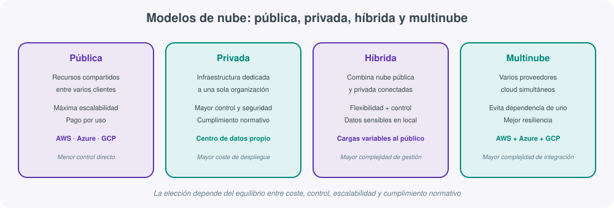
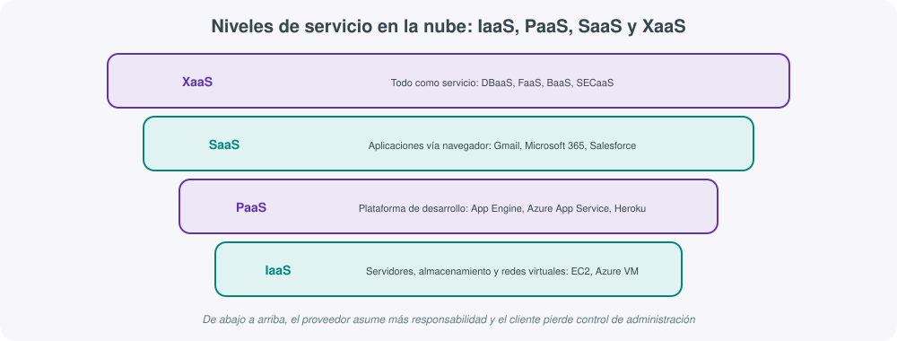
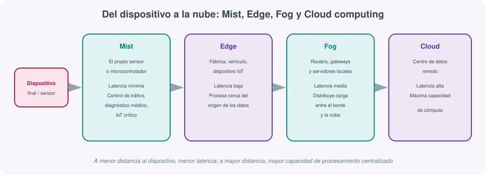

# **☁️ UT03 · Computación en la nube**

## Resultado de aprendizaje y criterios de evaluación

**RA3.** Identifica sistemas basados en cloud/nube y su influencia en el desarrollo de los sistemas digitales.

Criterios de evaluación:

a) Se han identificado los diferentes niveles de la cloud/nube.
b) Se han identificado las principales funciones de la cloud/nube (procesamiento de datos, intercambio de información, ejecución de aplicaciones, entre otros).
c) Se ha descrito el concepto de edge computing y su relación con la cloud/nube.
d) Se han definido los conceptos de fog y mist y sus zonas de aplicación en el conjunto.
e) Se han identificado las ventajas que proporciona la utilización de la cloud/nube en los sistemas conectados.

## 1. Qué es la computación en la nube

La **computación en la nube** (*cloud computing*) es la entrega de servicios informáticos —almacenamiento, procesamiento, redes, software— a través de internet, sin que el usuario final necesite poseer ni mantener la infraestructura física que los sostiene. En lugar de comprar servidores, instalarlos en una sala técnica propia y gestionarlos día a día, una organización contrata el uso de esos recursos a un proveedor externo, que los aloja en sus propios centros de datos y los pone a disposición del cliente a través de la red.

Para un módulo de digitalización aplicada a los sectores productivos, entender la nube no es solo una cuestión técnica: es la base sobre la que hoy se construyen la mayoría de proyectos de transformación digital, desde la implantación de un ERP en la nube en una pyme hasta el despliegue de sensores IoT en una planta industrial que envían sus datos a un panel de control accesible desde cualquier dispositivo.

Técnicamente, este modelo se apoya en dos pilares:

- **Virtualización**: un mismo servidor físico se divide en múltiples máquinas virtuales independientes, lo que permite a los proveedores repartir la capacidad real de sus centros de datos entre miles de clientes simultáneos sin que unos interfieran con otros.
- **Distribución de recursos a gran escala**: los proveedores cloud operan centros de datos masivos, geográficamente distribuidos en regiones y zonas de disponibilidad, replicando servicios para garantizar continuidad ante fallos de hardware, cortes eléctricos o desastres naturales en una ubicación concreta.

!!! note "De la infraestructura como hardware a la infraestructura como software"
    Antes de la nube, la infraestructura se trataba como hardware: exigía espacio físico, personal técnico, seguridad, un ciclo de adquisición largo y una planificación de capacidad basada en predecir el pico máximo de demanda. La nube convierte esa infraestructura en software: flexible, contratable en minutos y ajustable al alza o a la baja según la demanda real, eliminando buena parte de esas tareas pesadas.

Esta transición no es solo tecnológica, sino también organizativa: los departamentos de sistemas dejan de dedicar la mayor parte de su tiempo a tareas de mantenimiento físico (sustituir discos, ampliar memoria, gestionar el cableado de red) para centrarse en la arquitectura de los servicios, la seguridad y la optimización de costes, tareas de mayor valor añadido para el negocio.

### Características que definen el modelo cloud (criterio b)

| Característica | Explicación |
|---|---|
| **Servicios bajo demanda** | El usuario obtiene acceso inmediato a recursos (almacenamiento, cómputo, aplicaciones) sin gestión manual por parte del proveedor. |
| **Elasticidad** | La capacidad contratada crece o se reduce automáticamente según la carga real, sin sobredimensionar de antemano. |
| **Modelo de pago por uso** (*pay-as-you-go*) | Solo se factura lo que realmente se consume, sin inversión inicial en hardware. |
| **Servicios en capas** (IaaS/PaaS/SaaS) | Distintos niveles de abstracción, con distinto reparto de responsabilidad entre proveedor y cliente. |
| **Virtualización** | Base tecnológica que permite repartir un mismo hardware físico entre múltiples clientes de forma aislada. |
| **Escalabilidad** | Capacidad de crecer (o decrecer) el número de recursos asignados de forma rápida y con mínima fricción operativa. |

Ninguna de estas características aparece de forma aislada: es precisamente la combinación de elasticidad, pago por uso y virtualización lo que permite que una misma plataforma cloud atienda a la vez a una startup con un puñado de usuarios y a una multinacional con millones de peticiones diarias, ajustando de forma transparente los recursos asignados a cada caso.

## 2. Breve historia de la nube

La idea de "computación como servicio público" no es nueva: ya en los años **60**, **John McCarthy** —uno de los padres de la inteligencia artificial— planteó que la potencia de cálculo podría algún día organizarse y facturarse como un servicio público, de forma análoga a la electricidad o el agua. La tecnología de la época no permitía llevarlo a la práctica, pero la intuición resultó certera.

| Década/año | Hito |
|---|---|
| Años 60 | John McCarthy plantea la computación como servicio público (*utility computing*). |
| Años 90 | Maduración de la virtualización de servidores, base técnica imprescindible para la nube moderna. |
| 1999 | **Salesforce** lanza software de gestión empresarial accesible por navegador, pionero del modelo **SaaS**. |
| 2006 | **Amazon Web Services (AWS)** lanza **S3** (almacenamiento) y **EC2** (cómputo bajo demanda), popularizando el pago por uso a escala masiva y marcando el nacimiento de la nube pública moderna. |
| 2008 en adelante | **Google** (App Engine, luego Google Cloud) y **Microsoft** (Azure) entran en el mercado, consolidando un oligopolio de grandes proveedores. |
| Última década | Expansión de la **multinube**, la automatización mediante infraestructura como código y la integración creciente de servicios de **inteligencia artificial** dentro de la propia oferta cloud. |

Cada uno de estos hitos resuelve una limitación práctica del anterior: la virtualización de los 90 hizo posible repartir un mismo servidor físico entre varios clientes de forma aislada; el modelo SaaS de Salesforce demostró que una aplicación empresarial completa podía vivir fuera de las instalaciones del cliente; y el pago por uso de AWS en 2006 eliminó la necesidad de comprar hardware para experimentar con una idea de negocio, abaratando drásticamente el coste de entrada de cualquier proyecto tecnológico nuevo.

## 3. Niveles de la cloud/nube: modelos de implementación (criterio a)

Antes de hablar de qué servicios ofrece la nube, conviene distinguir **quién es el dueño y quién controla** la infraestructura subyacente. A esto se le llama modelo de implementación o "nivel" de nube, y determina el reparto de responsabilidades, coste y control entre el cliente y el proveedor.

| Modelo | Descripción |
|---|---|
| **Pública** | Infraestructura propiedad de un proveedor externo (AWS, Azure, GCP), compartida entre múltiples clientes de forma aislada mediante virtualización. Máxima escalabilidad y menor coste inicial. |
| **Privada** | Infraestructura dedicada en exclusiva a una organización, ya sea alojada en su propio centro de datos o gestionada por un tercero. Ofrece más control y facilita el cumplimiento normativo, a cambio de mayor coste. |
| **Híbrida** | Combina nube pública y privada de forma conectada: los datos sensibles o las cargas estables permanecen en la infraestructura privada, mientras que los picos de demanda variable se derivan a la nube pública. |
| **Multinube** | Uso simultáneo de varios proveedores cloud (por ejemplo, AWS para cómputo y GCP para analítica de datos), evitando la dependencia de un único proveedor (*vendor lock-in*) y mejorando la resiliencia global. |

### Comparativa de modelos de nube

| Aspecto | Pública | Privada | Híbrida | Multinube |
|---|---|---|---|---|
| Acceso | Compartido, vía internet | Exclusivo de la organización | Combinado (interno + público) | Combinado entre proveedores |
| Control / seguridad | Menor control directo | Máximo control | Control diferenciado por carga | Depende de cada proveedor |
| Flexibilidad | Muy alta | Media-baja | Alta | Muy alta |
| Costes | Bajo coste inicial, pago por uso | Alta inversión inicial | Coste mixto | Coste variable, requiere gestión |
| Implementación | Inmediata | Lenta (requiere infraestructura propia) | Media, requiere integración | Compleja, requiere coordinación |
| Cumplimiento normativo | Depende del proveedor y región | Más sencillo de garantizar | Facilita separar datos sensibles | Requiere auditar cada proveedor |
| Resiliencia | Alta (redundancia del proveedor) | Depende de la propia inversión | Alta si está bien diseñada | Máxima, sin dependencia de un solo proveedor |
| Aplicaciones adecuadas | Startups, cargas variables | Banca, sanidad, administración pública | Empresas con datos críticos y picos de demanda | Grandes corporaciones, alta disponibilidad crítica |

La elección entre estos niveles no suele ser definitiva ni excluyente: es habitual que una organización empiece con una nube pública por su bajo coste de entrada, y que a medida que crece en volumen de datos y en exigencias normativas (por ejemplo, en el sector sanitario o financiero) migre determinadas cargas críticas hacia un modelo híbrido, manteniendo el resto de servicios en la nube pública original.

## 4. Funciones y modelos de servicio en la nube (criterio b)

Más allá de quién es el propietario de la infraestructura, la nube se organiza también por **niveles de servicio**, que determinan qué parte de la pila tecnológica gestiona el proveedor y cuál queda en manos del cliente. Estos niveles son, precisamente, las funciones principales que cubre la nube: procesamiento de datos, intercambio de información y ejecución de aplicaciones, entre otras.

### IaaS: Infraestructura como Servicio

**IaaS** (*Infrastructure as a Service*) proporciona servidores, almacenamiento y redes virtualizadas, dejando en manos del cliente el sistema operativo, el middleware y las aplicaciones. Es el nivel que ofrece mayor flexibilidad y control, a cambio de mayor responsabilidad de gestión.

| Categoría | Ejemplos reales |
|---|---|
| Cómputo | AWS EC2, Google Compute Engine, Azure Virtual Machines |
| Almacenamiento | Amazon S3, Azure Blob Storage, Google Cloud Storage |
| Red | AWS VPC, Azure Load Balancer, Google Cloud DNS |
| Proveedores generalistas | AWS, Microsoft Azure, Google Cloud Platform, IBM Cloud, Oracle Cloud |

### PaaS: Plataforma como Servicio

**PaaS** (*Platform as a Service*) añade una capa sobre IaaS: el proveedor gestiona también el sistema operativo, el entorno de ejecución y las herramientas de desarrollo, de modo que el cliente se centra exclusivamente en programar y desplegar su aplicación.

| Categoría | Ejemplos reales |
|---|---|
| Gestión del ciclo de vida de aplicaciones | Atlassian JIRA, Azure DevOps, GitLab, Red Hat OpenShift |
| Portales de aplicaciones | Liferay, Oracle WebCenter |
| Plataformas *serverless* | AWS Lambda, Azure Functions, Google App Engine |

### SaaS: Software como Servicio

**SaaS** (*Software as a Service*) entrega la aplicación completa, lista para usar a través del navegador o un cliente ligero, sin que el usuario gestione nada de la infraestructura ni de la plataforma subyacente.

| Categoría | Ejemplos reales |
|---|---|
| Ofimática | Gmail, Microsoft 365, Google Workspace |
| Gestión empresarial (ERP/CRM) | Salesforce, SAP Business One, Dynamics 365, Oracle NetSuite, Holded |
| Gestión de proyectos | Microsoft Project, Jira, Trello |

El SaaS admite además una clasificación cruzada según a quién se dirige y qué tipo de necesidad cubre:

- **B2B** (*business to business*): dirigido a otras empresas (por ejemplo, un ERP como SAP Business One).
- **B2C** (*business to consumer*): dirigido al usuario final (por ejemplo, Gmail).
- **Horizontal**: resuelve una necesidad genérica común a cualquier sector (ofimática, correo).
- **Vertical**: resuelve una necesidad específica de un sector concreto (software de gestión de clínicas, de despachos de abogados, etc.).

Desde el punto de vista de la responsabilidad compartida, cuanto más se avanza de IaaS a SaaS, más tareas de mantenimiento (parcheo del sistema operativo, actualización del entorno de ejecución, escalado de la base de datos) recaen en el proveedor, y menos control de bajo nivel conserva el cliente. Esta cesión de control a cambio de menor esfuerzo operativo es, precisamente, la decisión de diseño central que cualquier organización debe tomar al migrar un servicio a la nube.

!!! note "Modelo de responsabilidad compartida"
    Todos los proveedores cloud publican de forma explícita qué parte de la seguridad les corresponde a ellos y cuál corresponde al cliente. En IaaS, el proveedor asegura el hardware físico, la red y la virtualización, mientras que el cliente es responsable de asegurar el sistema operativo, las aplicaciones y los datos. En SaaS, en cambio, el proveedor asume casi toda la responsabilidad técnica, y al cliente le queda sobre todo la gestión de usuarios, permisos y la clasificación de la información que almacena en el servicio.

### XaaS: todo como servicio

**XaaS** (*Anything as a Service*) es el término paraguas que agrupa la tendencia a ofrecer prácticamente cualquier capacidad tecnológica bajo el mismo modelo de suscripción y pago por uso que IaaS, PaaS y SaaS:

| Servicio | Significado |
|---|---|
| **DBaaS** | *Database as a Service*: bases de datos gestionadas sin administrar el servidor subyacente. |
| **FaaS** | *Function as a Service*: ejecución de funciones puntuales sin gestionar servidores (la base del *serverless*, como AWS Lambda). |
| **BaaS** | *Backend as a Service*: backend completo (autenticación, notificaciones, base de datos) listo para usar desde una app. |
| **SECaaS** | *Security as a Service*: seguridad gestionada (antivirus, firewall, detección de intrusiones) entregada como servicio. |

!!! tip "Las tres funciones clave de la nube, en una frase"
    Si el criterio (b) pide identificar las funciones principales de la nube, la síntesis es: **procesar datos** (cómputo, IaaS/PaaS), **intercambiar información** (redes, almacenamiento, sincronización entre dispositivos) y **ejecutar aplicaciones** (SaaS y plataformas *serverless*), todo ello con el proveedor asumiendo progresivamente más responsabilidad de gestión a medida que se sube de IaaS a SaaS.

## 5. Edge computing: procesar cerca del origen del dato (criterio c)

El **edge computing** (computación en el borde) es un modelo que traslada el procesamiento de datos desde los grandes centros de datos centralizados hacia el **borde de la red**: el propio dispositivo, la fábrica, el vehículo o la instalación donde se genera la información.

La relación entre edge computing y la nube no es de sustitución, sino de **complemento**: la nube sigue centralizando el almacenamiento masivo, el entrenamiento de modelos de análisis y las tareas que no requieren respuesta inmediata, mientras que el edge asume las tareas que sí exigen una respuesta en tiempo real, sin esperar el viaje de ida y vuelta hasta un centro de datos remoto.

**Ejemplos de aplicación:**

- **Internet de las Cosas (IoT)**: sensores industriales que procesan localmente y solo envían a la nube los datos agregados o las alertas relevantes.
- **Streaming de vídeo**: servidores de borde que sirven contenido desde ubicaciones próximas al usuario, reduciendo el tiempo de carga.
- **Vehículos autónomos**: decisiones de conducción (frenado, detección de obstáculos) que no pueden depender de la latencia de una consulta a un servidor remoto.

En todos estos casos, el criterio de diseño es el mismo: cuanto más crítica es la ventana de tiempo en la que hay que reaccionar, más cerca del origen del dato debe residir el procesamiento, reservando la nube central para las tareas que pueden esperar (análisis histórico, entrenamiento de modelos, generación de informes).

### Ventajas del edge computing

| Ventaja | Explicación |
|---|---|
| Reducción de la latencia | Al procesar los datos cerca de donde se generan, se evita el viaje de ida y vuelta hasta un centro de datos remoto. |
| Ahorro de ancho de banda | Solo se envían a la nube los datos relevantes o agregados, no el flujo completo y continuo. |
| Mayor fiabilidad | El sistema puede seguir funcionando de forma autónoma aunque se pierda temporalmente la conexión a internet. |
| Mejor seguridad y privacidad | Los datos sensibles pueden procesarse y descartarse localmente, sin necesidad de transmitirlos íntegros a un tercero. |
| Escalabilidad | Añadir más dispositivos de borde no satura necesariamente la red troncal ni el centro de datos central. |
| Optimización de recursos | Se reparte la carga de procesamiento entre múltiples puntos en lugar de concentrarla en un único lugar. |

## 6. Fog y mist computing: capas intermedias entre el borde y la nube (criterio d)

Entre el dispositivo final y el centro de datos en la nube existe un espacio intermedio que dos conceptos relacionados —**fog computing** y **mist computing**— ayudan a organizar.

### Fog computing

El **fog computing** (computación en la niebla) extiende el edge computing distribuyendo capacidad de procesamiento entre dispositivos **intermedios**: routers, *gateways* y servidores locales situados entre el borde de la red y la nube central. Su función es absorber y filtrar buena parte del tráfico generado por múltiples dispositivos de borde antes de que llegue (si es que llega) hasta la nube, reduciendo la carga sobre el centro de datos remoto y aportando un punto intermedio de decisión con más capacidad de cómputo que un único sensor, pero mucho menos latencia que la nube.

### Mist computing

El **mist computing** (computación en la neblina) lleva la idea del fog un paso más allá, aproximando el procesamiento **al máximo posible al dispositivo final**: el propio sensor, actuador o microcontrolador asume parte del cómputo, minimizando la latencia hasta el extremo. Se reserva para escenarios donde el tiempo de respuesta es crítico y no admite ni siquiera el salto hasta un servidor de niebla intermedio.

**Zonas de aplicación típicas del mist computing:**

- Sistemas de **control de tráfico** en tiempo real (semáforos inteligentes, gestión de cruces).
- **Diagnóstico médico** en dispositivos portátiles que deben reaccionar de inmediato ante una anomalía.
- **IoT crítico** en entornos industriales donde un retraso de procesamiento puede causar un fallo de seguridad.

En conjunto, edge, fog y mist computing no son alternativas entre sí, sino **capas complementarias** de un mismo continuo que va del dispositivo a la nube: cada una asume la parte del procesamiento que su posición en la red le permite resolver con la latencia adecuada, dejando a la nube central las tareas que verdaderamente requieren agregación masiva de datos o capacidad de cómputo que ningún nodo intermedio podría ofrecer.

### Comparativa Cloud vs Fog vs Mist vs Edge

| Aspecto | Cloud | Fog | Mist | Edge |
|---|---|---|---|---|
| Latencia | Alta | Media | Mínima | Baja |
| Escalabilidad | Muy alta (centro de datos masivo) | Alta, distribuida por zonas | Limitada al propio dispositivo | Alta, por dispositivo/instalación |
| Localización de datos | Centralizada, remota | Intermedia (routers, gateways) | En el propio dispositivo final | En el borde de la red |
| Infraestructura | Grandes centros de datos | Servidores y gateways locales | Sensores/microcontroladores | Dispositivos y servidores de borde |
| Conectividad | Depende totalmente de la red | Parcialmente autónoma | Autónoma, sin depender de red externa | Mayormente autónoma |
| Seguridad | Gestionada por el proveedor cloud | Compartida entre niveles | Aislada al propio dispositivo | Depende de cada instalación |
| Costes | Variables según consumo | Moderados (infraestructura intermedia) | Bajos por nodo, altos por volumen de dispositivos | Moderados |
| Aplicaciones críticas en tiempo real | No recomendable | Aceptable | Ideal | Adecuado |
| Tolerancia a fallos | Alta (redundancia del proveedor) | Media | Depende del propio dispositivo | Media-alta |
| Complejidad de gestión | Baja para el cliente (la asume el proveedor) | Media | Alta (múltiples nodos dispersos) | Media-alta |
| Innovación tecnológica | Muy alta, ritmo marcado por el proveedor | Alta | En expansión (IoT crítico) | Alta |

## 7. Ventajas de la utilización de la cloud/nube en los sistemas conectados (criterio e)

Más allá de las ventajas técnicas ya señaladas en cada modelo, la adopción de la nube tiene un impacto directo sobre la **rentabilidad y la agilidad de la empresa**:

| Ventaja | Explicación |
|---|---|
| Modelo de costes eficiente | Se sustituye la gran inversión inicial en hardware por un pago por uso, reduciendo los costes de capital y permitiendo una asignación más precisa de los gastos operativos. Externalizar la infraestructura reduce además los gastos de mantenimiento y gestión de la tecnología local. |
| Mejora de la rentabilidad a largo plazo | La eficiencia operativa, la reducción de costes y el acceso a tecnologías avanzadas sin grandes inversiones iniciales contribuyen a una rentabilidad sostenida y a un crecimiento adaptado a las condiciones del mercado. |
| Escalabilidad y adaptabilidad | La capacidad de escalar recursos rápidamente permite a las empresas adaptarse a cambios en la demanda sin incurrir en costes adicionales, optimizando la eficiencia operativa. |
| Flexibilidad de pago por uso (PAYG) | El modelo *pay-as-you-go* ofrece flexibilidad financiera: las empresas solo pagan por lo que consumen, adaptando los gastos a sus ingresos sin compromisos a largo plazo. |
| Optimización de tiempos de implementación | La implementación rápida en la nube acelera el tiempo de comercialización de nuevos productos y servicios, lo que puede traducirse en ingresos más rápidos y ventaja competitiva. |
| Focalización en el core business | Externalizar funciones no centrales (infraestructura, mantenimiento) a proveedores cloud permite a la empresa concentrarse en las actividades que generan valor específico para su negocio. |
| Reducción de riesgos financieros | La flexibilidad contractual de la nube permite ajustar los compromisos financieros según las necesidades reales, evitando contratos a largo plazo poco flexibles. |

## 8. Actividades

Esta unidad se ha trabajado en el aula mediante los **laboratorios prácticos de AWS Academy**, tanto del itinerario *Cloud Foundations* como del *Learner Lab*, completando los siguientes ejercicios sobre una cuenta real de AWS Academy:

- **Cloud9 / CodeWhisperer**: actividad de laboratorio del AWS Academy Learner Lab para familiarizarse con el entorno de desarrollo en la nube Cloud9 y el asistente de código CodeWhisperer, documentando con una captura cada tarea realizada.
- **VPC**: dentro del módulo 5 (Redes y entrega de contenido) de AWS Academy Cloud Foundations, ejercicio de laboratorio de creación de una VPC (*Virtual Private Cloud*) y lanzamiento de un servidor web en su interior.
- **EC2**: dentro del módulo 6 (Informática) de AWS Academy Cloud Foundations, ejercicio de laboratorio de introducción a Amazon EC2 (lanzamiento, configuración y acceso a una instancia virtual).
- **AWS Lambda**: creación de funciones sin servidor (*serverless*, FaaS) que se ejecutan solo cuando se invocan, sin necesidad de mantener una instancia encendida de forma permanente.
- **AWS Elastic Beanstalk**: despliegue de una aplicación web completa (PaaS) delegando en el propio servicio el aprovisionamiento de la infraestructura subyacente, el balanceo de carga y el escalado automático.

Estas prácticas recorren, de forma deliberada, los tres niveles de servicio estudiados en la unidad: Cloud9 y la VPC trabajan a nivel de infraestructura (IaaS), Lambda introduce el paradigma *serverless* (FaaS, dentro de XaaS) y Elastic Beanstalk sitúa al alumnado directamente en el nivel de plataforma (PaaS), completando así una visión práctica de toda la pila de servicios cloud vista en el apartado 4.

Al finalizar cada práctica se recomienda documentar, igual que en el resto de unidades del módulo, los recursos creados (nombre de la VPC, IDs de las instancias EC2, funciones Lambda desplegadas y entornos de Elastic Beanstalk activos), de modo que quede constancia de qué se ha aprendido y sea sencillo revisarlo o repetirlo en una sesión posterior.

## Para profundizar

La [documentación oficial de AWS Cloud Practitioner Essentials](https://aws.amazon.com/es/training/learn-about/cloud-essentials/){:target="_blank"} desarrolla en detalle los conceptos de modelos de nube y niveles de servicio (IaaS/PaaS/SaaS) vistos en este apartado, en línea con el temario de AWS Academy trabajado en el aula. Para profundizar en edge, fog y mist computing, la [introducción de la Linux Foundation Edge (LF Edge) a la computación en el borde](https://lfedge.org/about/){:target="_blank"} explica cómo se organizan estos niveles intermedios en proyectos reales de IoT industrial. El resto de enlaces y recursos generales del módulo está en la página de [Recursos](recursos.md).