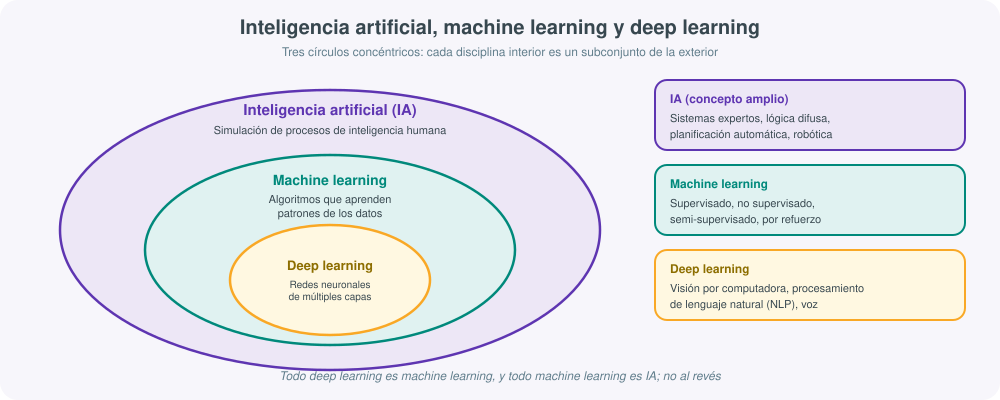
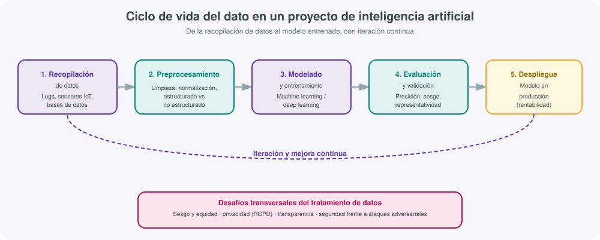
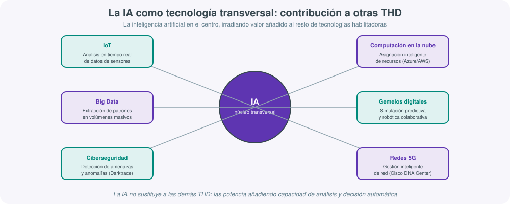

# **🤖 UT04 · Inteligencia artificial aplicada a los sectores productivos**

## Resultado de aprendizaje y criterios de evaluación

Esta unidad de trabajo desarrolla el **RA4** del módulo profesional *Digitalización aplicada a los sectores productivos*, correspondiente al ciclo formativo de grado superior:

> **RA4.** Identifica aplicaciones de la IA (inteligencia artificial) en entornos del sector donde está enmarcado el título, describiendo las mejoras implícitas en su implementación.

Los criterios de evaluación que concretan este resultado de aprendizaje, y que se trabajan de forma explícita a lo largo de los apartados siguientes, son:

a) Se ha identificado la importancia de la IA en la automatización de procesos y su optimización.
b) Se ha relacionado la IA con la recogida masiva de datos (Big Data) y su tratamiento (análisis) con la rentabilidad de las empresas.
c) Se ha valorado la importancia presente y futura de la IA.
d) Se han identificado los sectores con implantación más relevante de IA.
e) Se han identificado los lenguajes de programación en IA.
f) Se ha descrito cómo influye la IA en el sector del título.

!!! note "Cómo se organiza esta unidad"
    El recorrido va de lo conceptual a lo aplicado: primero se define qué es la IA y de dónde viene (criterio c); después se explican sus tipos y su forma de aprender —machine learning y deep learning— (criterios a y e); a continuación se aborda la relación entre IA, datos y rentabilidad, incluyendo la minería de datos (criterio b); se cierra con los sectores de implantación, el caso concreto de los sistemas informáticos (criterios d y f), la relación de la IA con el resto de tecnologías habilitadoras digitales, y una introducción práctica a la ingeniería de prompt.

## 1. Qué es la inteligencia artificial y de dónde viene

La **inteligencia artificial (IA)** es la disciplina que estudia y desarrolla sistemas capaces de simular procesos de inteligencia humana —aprendizaje, razonamiento, percepción y toma de decisiones— mediante algoritmos ejecutados por una máquina. No es una tecnología nueva ni surgida de la nada en los últimos años: sus raíces se remontan a la **cibernética** de los años 40 y 50 del siglo XX, cuando investigadores como Norbert Wiener empezaron a estudiar los sistemas de control y comunicación tanto en máquinas como en organismos vivos.

Dentro de esa tradición destaca la figura de **Alan Turing**, que en 1936 formalizó el concepto de **Máquina de Turing**, un modelo matemático abstracto de computación que sentó las bases teóricas de todo ordenador moderno, y que en 1950 planteó la pregunta "¿pueden pensar las máquinas?" a través de lo que hoy se conoce como el **test de Turing**. El término "inteligencia artificial" como tal se acuñó unos años después, en **1955**, cuando **John McCarthy** lo empleó para convocar la célebre **conferencia de Dartmouth** de 1956, considerada el acto fundacional de la IA como campo de estudio independiente.

Desde entonces la disciplina ha vivido ciclos de entusiasmo y de estancamiento (los llamados "inviernos de la IA"), pero la combinación reciente de tres factores —capacidad de cómputo, disponibilidad de datos masivos (Big Data) y mejora de los algoritmos de aprendizaje— ha producido la explosión de aplicaciones que se observa en 2026: desde asistentes virtuales hasta modelos generativos capaces de producir texto, imagen, audio o código.

### Aplicaciones cotidianas que ya usa cualquier usuario

La IA ha dejado de ser un concepto de laboratorio para integrarse en el uso diario de cualquier persona, aunque no siempre sea evidente que hay un sistema de IA detrás:

- **Asistentes virtuales**: Siri (Apple), Alexa (Amazon) o Google Assistant interpretan lenguaje natural y ejecutan acciones o responden preguntas.
- **Reconocimiento facial**: desbloqueo de dispositivos móviles, control de accesos, etiquetado automático de fotografías.
- **Vehículos autónomos**: desde la conducción asistida (frenada de emergencia, mantenimiento de carril) hasta niveles más avanzados de autonomía.
- **Sistemas de recomendación**: Netflix, Amazon o Spotify analizan el historial de consumo de cada usuario para sugerir contenido o productos con mayor probabilidad de interés.

Todas estas aplicaciones comparten una misma base técnica: se apoyan en **Big Data** (grandes volúmenes de datos), **algoritmos** y **modelos matemáticos**, entrenados mediante técnicas de **machine learning** y **deep learning**, que se desarrollan en el apartado 3 de esta unidad.

## 2. Tipos de inteligencia artificial

No toda la IA es igual de "inteligente" ni de general. Conviene distinguir tres niveles, que además ayudan a valorar con criterio qué es realmente posible hoy y qué pertenece todavía al terreno de la especulación o la ficción (criterio c del RA4).

### IA débil o estrecha (*narrow AI*)

Es la **única que existe realmente en 2026** y la que sustenta todas las aplicaciones descritas en el apartado anterior. Un sistema de IA débil está diseñado para realizar **una tarea concreta y bien definida**, y lo hace muy bien dentro de ese ámbito, pero no tiene capacidad de razonar fuera de él. Ejemplos: Siri responde preguntas y ejecuta comandos, pero no puede conducir un coche; un sistema de recomendación de Netflix sugiere películas, pero no puede detectar un fraude bancario. Cada una de estas capacidades exige entrenar un modelo distinto para una tarea distinta.

### IA general (*AGI, Artificial General Intelligence*)

Es un concepto **todavía hipotético**: una IA con capacidad de razonamiento equivalente a la de un ser humano, capaz de aprender cualquier tarea intelectual y transferir el conocimiento de un dominio a otro sin necesidad de un reentrenamiento específico. A pesar de los titulares que en ocasiones atribuyen esta capacidad a los modelos de lenguaje más recientes, ningún sistema actual cumple esta definición de forma rigurosa: siguen siendo, en el fondo, sistemas de IA débil de propósito muy amplio, pero no de razonamiento general equivalente al humano.

### IA superinteligente

Es un escenario **futurista y especulativo**, en el que una IA superaría de forma significativa la inteligencia humana en prácticamente todos los ámbitos. Este nivel plantea dilemas éticos y de control que la ciencia ficción ha explorado repetidamente —*Ex Machina* o la saga *Terminator* son ejemplos habituales—, pero que a día de hoy pertenecen al debate filosófico y prospectivo más que a una realidad técnica.

!!! tip "Asistente de IA frente a agente de IA"
    Otra distinción práctica y muy relevante para el sector: un **asistente de IA** es *reactivo* — responde a lo que se le pide (ChatGPT respondiendo una pregunta, Siri fijando una alarma). Un **agente de IA** es *proactivo y autónomo* — toma decisiones y ejecuta acciones encadenadas sin supervisión constante, como ocurre en el trading algorítmico, la robótica industrial o determinados sistemas de ciberseguridad que bloquean automáticamente una amenaza detectada. Esta distinción será relevante también en el apartado 6, dedicado a los sistemas.

### Tipos de aplicaciones de IA según su función

Más allá de la clasificación técnica anterior, en el uso real del mercado conviene reconocer los grandes tipos de aplicación que existen hoy:

| Tipo de aplicación | Ejemplos | Comentario |
|---|---|---|
| Asistentes virtuales / chatbots | Siri, Alexa, ChatGPT, copilotos de atención al cliente | La puerta de entrada más habitual a la IA para el usuario final |
| Generación de contenido multimedia | Stable Diffusion, generadores de vídeo e imagen | Crean contenido visual a partir de una descripción textual |
| Generación de contenido creativo | Asistentes de redacción, composición musical asistida | Apoyan procesos creativos humanos, no los sustituyen por completo |
| Aplicaciones sociales y emocionales | Compañía virtual, apoyo emocional conversacional | Terreno en expansión, con debate ético abierto sobre su uso |
| Detección de fraudes | Sistemas bancarios y de medios de pago | Aplicación de IA con mayor retorno económico demostrado |
| Educación | Plataformas de aprendizaje adaptativo | Personalizan el ritmo y el contenido según el progreso del alumno |
| E-commerce y recomendaciones | Amazon, Spotify, Netflix | Optimizan la conversión y la retención de clientes |
| Salud | Diagnóstico por imagen, apoyo a la decisión clínica | Uno de los sectores con mayor impacto social, ver apartado 6 |
| Deepfakes | Generación de vídeo o audio hiperrealista falso | Riesgos éticos y legales relevantes: suplantación, desinformación |

!!! warning "Los deepfakes y el uso responsable de la IA"
    La misma tecnología generativa que permite crear un avatar de vídeo para un curso *online* puede usarse para suplantar la identidad de una persona real de forma muy convincente. Valorar la importancia presente y futura de la IA (criterio c del RA4) exige también reconocer sus riesgos: la legislación europea de IA y el RGPD (que se retoma en el apartado 4) están precisamente reaccionando a este tipo de usos.

## 3. Cómo aprende una IA: machine learning y deep learning

Para entender cómo la IA optimiza procesos (criterio a) es imprescindible comprender, aunque sea a nivel introductorio, **cómo aprende** un sistema de IA. La idea central es que un modelo de IA no se programa con reglas explícitas para cada situación posible, sino que **procesa grandes volúmenes de datos** aplicando modelos matemáticos y estadísticos, ajustando sus parámetros internos mediante sucesivas iteraciones hasta optimizar la calidad de sus respuestas. Este proceso se conoce coloquialmente como "entrenar" una IA, y su calidad depende directamente de la calidad y representatividad de los datos empleados: datos sesgados o incompletos producen modelos sesgados, por buena que sea la técnica matemática empleada.

### Machine learning (aprendizaje automático)

El **machine learning** es el conjunto de algoritmos capaces de aprender patrones a partir de datos y mejorar su rendimiento con la experiencia, sin ser programados de forma explícita para cada caso. Se distinguen cuatro grandes tipos:

- **Aprendizaje supervisado**: el algoritmo aprende a partir de datos ya etiquetados (se le indica cuál es la respuesta correcta durante el entrenamiento). Ejemplo típico: clasificación de correos como *spam* o no *spam*, o detección de fraude en transacciones bancarias.
- **Aprendizaje no supervisado**: el algoritmo busca patrones o agrupaciones en datos que no están etiquetados. Ejemplo típico: agrupación (*clustering*) de clientes según su comportamiento de compra, o detección de anomalías sin ejemplos previos de qué es "anómalo".
- **Aprendizaje semi-supervisado**: combina una pequeña cantidad de datos etiquetados con una gran cantidad de datos sin etiquetar. Se emplea, por ejemplo, en análisis de texto a gran escala o en reconocimiento facial, donde etiquetar manualmente todos los datos sería inviable.
- **Aprendizaje por refuerzo**: el algoritmo aprende por ensayo y error, recibiendo una recompensa o penalización según el resultado de sus acciones. Es la base del entrenamiento de robots y de sistemas capaces de jugar a videojuegos o juegos de estrategia a nivel sobrehumano.

### Deep learning (aprendizaje profundo)

El **deep learning** es un subcampo del machine learning que emplea **redes neuronales artificiales de múltiples capas**, inspiradas de forma simplificada en el funcionamiento de las neuronas biológicas. Cada capa de la red extrae características cada vez más abstractas de los datos de entrada (por ejemplo, en una imagen: primero bordes, después formas, después objetos completos). El deep learning necesita, por norma general, **más datos y más tiempo de entrenamiento** que el machine learning clásico, pero a cambio es capaz de manejar datos complejos y no estructurados —imágenes, vídeo, texto libre, audio— con un nivel de precisión que las técnicas clásicas no alcanzan. Es la tecnología que sustenta los modelos generativos de texto e imagen más conocidos en 2026.

!!! example "De los datos al resultado: un ejemplo aplicado a sistemas"
    Un servidor genera miles de líneas de log al día. Un modelo de machine learning supervisado, entrenado con ejemplos históricos de "incidente" y "funcionamiento normal", puede aprender a clasificar nuevas líneas de log como sospechosas o no. Si en lugar de logs estructurados se quisiera analizar el contenido libre de los tickets de soporte escritos por los usuarios (texto no estructurado), sería más adecuado un modelo de deep learning con procesamiento de lenguaje natural (NLP), capaz de entender el significado del texto y no solo buscar palabras clave.

## 4. La IA, los datos y la rentabilidad empresarial

El criterio b del RA4 pide relacionar explícitamente la IA con la recogida masiva de datos (**Big Data**) y su análisis con la **rentabilidad de las empresas**. La relación es directa: sin datos no hay IA, y cuantos más datos de calidad estén disponibles, mejor podrá aprender un modelo y más valor económico podrá generar esa IA para la organización.

### Datos estructurados y no estructurados

- **Datos estructurados**: organizados en tablas o bases de datos relacionales, con un formato predecible (un registro de ventas, un inventario, los campos de un formulario). Son los más sencillos de tratar con técnicas clásicas de análisis y machine learning supervisado.
- **Datos no estructurados**: imágenes, vídeo, audio, texto libre. Representan la mayoría de los datos que se generan hoy en cualquier organización, y requieren técnicas más sofisticadas —típicamente deep learning— para extraer valor de ellos.

### El ciclo del dato en un proyecto de IA

Todo proyecto de IA que aspire a generar valor real en una empresa recorre, de forma más o menos explícita, las siguientes fases: **recopilación de datos**, **preprocesamiento** (limpieza, normalización), **modelado y entrenamiento**, **evaluación y validación** de los resultados, y **despliegue** en producción, con un ciclo continuo de **iteración y mejora** a medida que llegan nuevos datos. Esta secuencia es, en esencia, la misma que sustenta cualquier proyecto de Big Data, lo que confirma que ambas disciplinas —IA y Big Data— están profundamente entrelazadas: la IA necesita datos masivos para entrenar modelos útiles, y el Big Data necesita IA para extraer conclusiones que serían inviables de analizar manualmente.

### Desafíos del tratamiento de datos en IA

Tratar datos a esta escala no está exento de riesgos, y valorarlos con criterio forma parte de entender la importancia real de la IA (criterio c):

- **Equidad y sesgo**: si los datos de entrenamiento reflejan un sesgo histórico (por ejemplo, de género o de origen geográfico en decisiones de contratación), el modelo reproducirá y podría amplificar ese sesgo.
- **Privacidad y protección de datos**: el tratamiento de datos personales por sistemas de IA está sujeto al **RGPD** (Reglamento General de Protección de Datos) en la Unión Europea, que exige base legal, minimización de datos y, en muchos casos, posibilidad de explicación de las decisiones automatizadas.
- **Transparencia y explicabilidad**: cuanto más complejo es un modelo (especialmente en deep learning), más difícil resulta explicar por qué ha tomado una decisión concreta, lo que genera el problema de la "caja negra".
- **Calidad y representatividad de los datos**: un modelo solo puede ser tan bueno como los datos con los que se entrena; datos incompletos o poco representativos de la realidad producen predicciones poco fiables.
- **Seguridad y robustez frente a ataques adversariales**: existen técnicas capaces de engañar deliberadamente a un modelo de IA (por ejemplo, alterando de forma casi imperceptible una imagen para que un sistema de reconocimiento la clasifique de forma incorrecta).
- **Uso ético y legal**: más allá del cumplimiento normativo estricto, cabe preguntarse si un uso concreto de la IA es socialmente aceptable, aunque sea legal.

### Minería de datos

La **minería de datos** (*data mining*) es la disciplina que se ocupa de extraer patrones útiles y no evidentes de grandes volúmenes de datos, combinando estadística, inteligencia artificial y machine learning. Su proceso metodológico habitual —muy similar al ciclo de vida del dato descrito más arriba— comprende: **comprensión del negocio** (qué pregunta se quiere responder), **comprensión de los datos** disponibles, **preparación de los datos**, **modelización**, **evaluación** de los resultados obtenidos y **despliegue** de las conclusiones en la operativa real de la empresa.

Existen distintos **tipos de minería de datos** según el objetivo perseguido: **descriptiva** (qué ha pasado), **predictiva** (qué es probable que pase), **de asociación** (qué elementos aparecen juntos con frecuencia, como en el análisis de la cesta de la compra), **espacial** (patrones geográficos), **textual** (extracción de significado de texto libre), **de clústeres** (agrupación de elementos similares), **de redes sociales** (análisis de relaciones e influencia), **secuencial** (orden en que ocurren los eventos) y **temporal** (evolución de una variable a lo largo del tiempo).

!!! note "Minería de datos no es minería de criptomonedas"
    Conviene aclarar una confusión terminológica frecuente entre el alumnado: la **minería de datos** (*data mining*, extracción de patrones de información) y la **minería de criptomonedas** (*crypto mining*, resolución de problemas criptográficos para validar transacciones de Bitcoin u otras criptomonedas y obtener una recompensa) son procesos completamente distintos que únicamente comparten la palabra "minería" por la metáfora de "extraer algo de valor" de un conjunto de datos o de un problema computacional. No existe relación técnica entre ambas.

La consecuencia directa de todo lo anterior para la rentabilidad empresarial es clara: una empresa que recopila y analiza correctamente sus datos con técnicas de IA puede anticipar la demanda, detectar fraude antes de que genere pérdidas, personalizar su oferta comercial y optimizar sus costes operativos con un nivel de precisión inalcanzable mediante análisis manual.

## 5. Importancia presente y futura de la IA, y sectores con mayor implantación

Valorar la importancia de la IA (criterio c) exige distinguir entre lo que ya es una realidad consolidada y lo que todavía es una tendencia en desarrollo, e identificar en qué sectores productivos su implantación es hoy más relevante (criterio d).

### Sectores con implantación destacada

- **Medicina y sanidad**: apoyo al diagnóstico por imagen (radiología, detección precoz de tumores), diseño de tratamientos personalizados a partir del perfil genético o clínico del paciente, y aceleración de la investigación farmacológica.
- **Transporte y logística**: conducción autónoma y asistida, optimización de rutas de reparto en tiempo real considerando tráfico y demanda, mantenimiento predictivo de flotas de vehículos.
- **Educación**: plataformas de aprendizaje personalizado que adaptan el ritmo y el contenido a cada estudiante, corrección automática de ejercicios, detección temprana de dificultades de aprendizaje.
- **Finanzas**: detección de fraude en tiempo real, valoración automática de riesgo crediticio, algoritmos de trading de alta frecuencia.
- **Medioambiente**: modelos predictivos de fenómenos naturales (incendios forestales, inundaciones, patrones climáticos), optimización del consumo energético.
- **Industria y sistemas informáticos**: mantenimiento predictivo de infraestructura, optimización de centros de datos, ciberseguridad automatizada — desarrollado en detalle en el apartado 6, específico para el sector del título.

### Plataformas reales de aprendizaje y desarrollo de IA

Para quien quiera profundizar más allá del uso de aplicaciones ya entrenadas, existen plataformas de referencia, ampliamente usadas en la industria y accesibles también para el aprendizaje:

- **TensorFlow** y **PyTorch**: los dos grandes frameworks de código abierto para construir y entrenar modelos de machine learning y deep learning.
- **Hugging Face**: plataforma y comunidad de referencia para compartir y usar modelos preentrenados (de lenguaje, de visión, de audio), muy usada tanto en investigación como en proyectos aplicados.
- **OpenAI Whisper**: modelo de código abierto para el reconocimiento y transcripción automática de voz.
- **Stable Diffusion**: modelo de generación de imágenes a partir de descripciones textuales.
- **Google Colab** y **Kaggle**: entornos gratuitos en la nube para escribir y ejecutar código de IA (típicamente en Python) sin necesidad de hardware propio potente, muy usados para el aprendizaje y la experimentación.

### Lenguajes de programación en IA

El criterio e del RA4 exige identificar los lenguajes de programación empleados en IA. **Python** es, con diferencia, el lenguaje dominante en el desarrollo de IA en 2026, gracias a su sintaxis sencilla y al enorme ecosistema de librerías especializadas (TensorFlow, PyTorch, scikit-learn, pandas, NumPy). Junto a Python, conviene conocer:

| Lenguaje | Uso principal en IA |
|---|---|
| **Python** | Lenguaje de referencia: machine learning, deep learning, análisis de datos, prototipado rápido |
| **R** | Estadística avanzada y análisis de datos, muy usado en investigación y ciencia de datos |
| **Java** | Sistemas de IA de nivel empresarial que requieren integración con infraestructuras corporativas existentes |
| **C++** | Rendimiento crítico: motores de inferencia optimizados, robótica, sistemas embebidos |
| **Julia** | Computación científica de alto rendimiento, en expansión en entornos académicos y de investigación |
| **SQL** | No es un lenguaje de IA en sí mismo, pero resulta imprescindible para extraer y preparar los datos estructurados que alimentan cualquier modelo |

!!! tip "Importancia futura: qué observar en los próximos años"
    Más allá del estado actual, valorar la importancia futura de la IA implica observar tendencias ya visibles en 2026: la consolidación de **agentes de IA autónomos** capaces de encadenar tareas sin supervisión constante (véase apartado 2), la ejecución de modelos cada vez más potentes en dispositivos locales sin depender de la nube, y una presión regulatoria creciente (como el Reglamento Europeo de IA) que exigirá a las empresas justificar y auditar el uso que hacen de estos sistemas.

## 6. La IA en el sector de los sistemas informáticos

El criterio f del RA4 exige describir cómo influye la IA en el sector del título. En un ciclo orientado a la digitalización y administración de sistemas, la aplicación más relevante de la IA no es tanto "usar un chatbot", sino aplicar IA sobre los propios datos que genera la infraestructura tecnológica de una organización: registros de servidores (*logs*), tráfico de red, métricas de rendimiento y datos de sensores IoT.

El patrón de trabajo es siempre el mismo: **recopilación segura y estructurada de datos** (logs de servidores, bases de datos, sensores IoT) → **tratamiento mediante machine learning, procesamiento de lenguaje natural (NLP) o visión por computadora** → **impacto directo en la rentabilidad**, típicamente en forma de mantenimiento predictivo que evita caídas de servicio y de reducción de costes operativos al automatizar tareas que antes exigían supervisión humana constante.

### Ejemplos reales de IA aplicada a sistemas e infraestructura

- **Google**: aplica IA para optimizar la refrigeración y el consumo energético de sus centros de datos, con ahorros documentados de hasta un **40 %** en el gasto energético destinado a refrigeración.
- **Darktrace**: plataforma de ciberseguridad que emplea IA para detectar ciberamenazas mediante el aprendizaje del comportamiento "normal" de una red, señalando desviaciones que podrían indicar un ataque en curso, incluso ante amenazas nunca vistas antes.
- **Cisco DNA Center**: solución de gestión inteligente de redes que aplica IA para automatizar la configuración, detectar problemas de conectividad y optimizar el rendimiento de la red corporativa.
- **IBM Watson**: usado, entre otros muchos casos, en chatbots de soporte técnico capaces de resolver incidencias de nivel básico sin intervención humana, liberando al personal técnico para tareas de mayor complejidad.
- **Microsoft Azure y AWS**: ambos proveedores cloud incorporan sistemas de IA para la asignación inteligente de recursos, escalando automáticamente la capacidad de cómputo según la demanda real y optimizando así el coste del servicio para el cliente.

Estos cinco ejemplos muestran cómo la IA, aplicada al propio sector de los sistemas informáticos, cierra el círculo descrito en el apartado 4 de esta unidad: datos masivos generados por la propia infraestructura, tratados con técnicas de IA, que se traducen en ahorro de costes y mejora de la rentabilidad de la organización que los aplica.

## 7. La IA y las tecnologías habilitadoras digitales (THD)

La IA no actúa de forma aislada: es, junto al Big Data, una de las **tecnologías habilitadoras digitales (THD)** trabajadas en unidades anteriores de este módulo, y su valor real aumenta cuando se combina con el resto. La siguiente tabla resume esa contribución:

| Tecnología habilitadora | Contribución de la IA |
|---|---|
| **Internet de las cosas (IoT)** | Análisis en tiempo real de los datos generados por sensores, permitiendo decisiones automáticas sin intervención humana |
| **Big Data** | La IA es la herramienta que convierte el volumen masivo de datos en patrones útiles y predicciones accionables |
| **Blockchain** | Detección de operaciones fraudulentas o anómalas en registros distribuidos |
| **Computación en la nube** | Asignación inteligente y elástica de recursos de cómputo según la demanda real |
| **Realidad aumentada / virtual** | Generación de entornos y objetos virtuales más realistas y adaptativos al usuario |
| **Impresión 3D** | Optimización del diseño de piezas y detección temprana de defectos de fabricación |
| **Ciberseguridad** | Detección de amenazas y comportamientos anómalos en tiempo real, antes de que un ataque cause daño |
| **Gemelos digitales** | Simulación predictiva del comportamiento de un sistema físico a partir de su réplica digital |
| **Robótica colaborativa** | Percepción del entorno y adaptación del comportamiento del robot a la presencia humana |
| **Redes 5G** | Gestión inteligente del tráfico de red y mantenimiento predictivo de la infraestructura de telecomunicaciones |

Esta visión transversal confirma un mensaje ya recurrente en este módulo: ninguna tecnología habilitadora digital se entiende bien de forma aislada, y la IA es, de todas ellas, la que actúa con mayor frecuencia como "amplificador" del resto.

## 8. Ingeniería de prompt

Trabajar con IA generativa de forma eficaz exige una competencia práctica que conviene entrenar de forma explícita: la **ingeniería de prompt** (*prompt engineering*), es decir, la disciplina de formular instrucciones claras y bien estructuradas a un modelo de IA para obtener el resultado deseado. Sus principios básicos son:

1. **Claridad y especificidad**: cuanto más precisa sea la petición, mejor será la respuesta. Evitar ambigüedades ("mejora esto" frente a "reescribe este párrafo en un tono más formal, sin superar 100 palabras").
2. **Contexto adecuado**: aportar la información necesaria para que el modelo entienda la situación (a qué sistema operativo, versión o escenario se refiere la petición).
3. **No sobrecargar el prompt**: pedir demasiadas cosas distintas en una sola instrucción suele producir respuestas peores que dividir la petición en varios pasos.
4. **Pruebas y ajustes iterativos**: rara vez el primer prompt produce el resultado óptimo; conviene revisar la respuesta y refinar la instrucción.
5. **Incluir ejemplos**: mostrar al modelo un ejemplo del formato o estilo esperado (*few-shot prompting*) mejora notablemente la calidad de la respuesta.

### Un estándar útil para construir un prompt técnico

Una plantilla que ayuda a no olvidar ningún elemento relevante es la siguiente:

> "Actúa como **[rol]**. Tu tarea es **[tarea]**. El contexto es **[contexto]**. Las instrucciones específicas son **[instrucciones]**. Responde en el formato **[formato]**. Asegúrate de **[detalles]**."

!!! example "Prompt aplicado a la administración de sistemas"
    "Actúa como **administrador de sistemas experto en entornos Linux**. Tu tarea es **proponer una configuración optimizada de Nginx para un servidor web en producción**. El contexto es **un servidor Ubuntu 24.04 con Nginx que sirve una aplicación web con picos de tráfico de hasta 5000 peticiones por minuto y tiempos de respuesta actualmente elevados**. Las instrucciones específicas son **ajustar los parámetros de *worker processes*, *worker connections*, compresión gzip y caché de archivos estáticos**. Responde en el formato **de fichero de configuración comentado, explicando brevemente cada parámetro modificado**. Asegúrate de **indicar qué comando permite verificar la sintaxis antes de reiniciar el servicio y qué riesgos existen si se aplica sin probar antes en un entorno de pruebas**."

Este ejemplo ilustra un punto importante para el sector: un prompt bien construido no sustituye la validación técnica humana, pero sí acelera notablemente la fase de generación de una primera propuesta, exactamente igual que ocurre con cualquier otra herramienta de IA aplicada a la administración de sistemas descrita en el apartado 6.

## Glosario rápido de la unidad

- **IA débil / estrecha**: sistema de IA especializado en una tarea concreta; es el único tipo de IA que existe realmente hoy.
- **Machine learning**: algoritmos que aprenden patrones a partir de datos y mejoran con la experiencia, sin ser programados de forma explícita para cada caso.
- **Deep learning**: subcampo del machine learning basado en redes neuronales de múltiples capas, especialmente eficaz con datos no estructurados.
- **Big Data**: conjuntos de datos de volumen, velocidad o variedad tan grandes que exigen herramientas y técnicas específicas de tratamiento, entre ellas la IA.
- **Minería de datos**: extracción de patrones útiles y no evidentes en grandes volúmenes de datos, combinando estadística, IA y machine learning.
- **RGPD**: Reglamento General de Protección de Datos de la Unión Europea, marco legal de referencia para el tratamiento de datos personales por sistemas de IA.
- **Prompt / ingeniería de prompt**: instrucción dada a un modelo de IA generativa, y la disciplina de formularla con precisión para obtener mejores resultados.
- **Agente de IA**: sistema de IA autónomo y proactivo, capaz de encadenar decisiones y acciones sin supervisión constante, a diferencia de un asistente puramente reactivo.

## Autoevaluación rápida

1. Explica con tus propias palabras qué distingue la IA débil de la IA general, y por qué solo la primera existe hoy de forma real. (apartado 2)
2. ¿Qué diferencia hay entre aprendizaje supervisado y no supervisado? Propón un ejemplo de cada uno distinto a los de la unidad. (apartado 3)
3. Describe el ciclo de vida del dato en un proyecto de IA y explica por qué la fase de iteración no tiene un final definido. (apartado 4)
4. Elige uno de los desafíos éticos del tratamiento de datos en IA (sesgo, privacidad, transparencia) y relaciónalo con un caso real que conozcas. (apartado 4)
5. ¿Por qué la minería de datos y la minería de criptomonedas no tienen relación técnica entre sí, a pesar de compartir nombre? (apartado 4)
6. Elige dos sectores del apartado 5 y compara cómo se aplica la IA en cada uno. (apartado 5)
7. Describe, con un ejemplo propio, cómo la IA mejora la rentabilidad de una empresa del sector de los sistemas informáticos. (apartado 6)
8. Elige una tecnología habilitadora digital de la tabla del apartado 7 y explica con más detalle cómo la IA la potencia. (apartado 7)
9. Redacta un prompt completo, siguiendo la plantilla del apartado 8, para pedir a una IA que genere un script de copia de seguridad automatizada. (apartado 8)

## Actividades

Se propone trabajar esta unidad con un bloque de **ejercicios prácticos de ingeniería de prompt aplicados a la administración de sistemas**: partiendo de la plantilla de prompt del apartado 8, el alumnado redacta y perfecciona instrucciones para tareas reales del sector (optimizar un servidor, redactar un script de mantenimiento, generar un informe de incidencias), comparando distintas versiones de un mismo prompt y valorando cómo cambia la calidad de la respuesta obtenida al añadir contexto, restricciones o ejemplos. Este ejercicio puede completarse con un análisis breve, en pequeño grupo, de uno de los casos reales del apartado 6 (Google, Darktrace, Cisco DNA Center, IBM Watson o Microsoft Azure/AWS), identificando qué tipo de datos recopila cada sistema y qué técnica de IA (machine learning, deep learning, NLP) resulta más adecuada para tratarlos.

## Para profundizar

Para quien quiera ir más allá del contenido de esta unidad, son recomendables la [documentación oficial de TensorFlow](https://www.tensorflow.org/learn){:target="_blank"}, que incluye tutoriales introductorios de machine learning y deep learning accesibles sin conocimientos previos avanzados, y la [documentación de Hugging Face](https://huggingface.co/docs){:target="_blank"}, la plataforma de referencia para explorar y usar modelos de IA ya entrenados, incluidos modelos de procesamiento de lenguaje natural y visión por computadora. El resto de enlaces y recursos generales del módulo está en la página de [Recursos](recursos.md).
