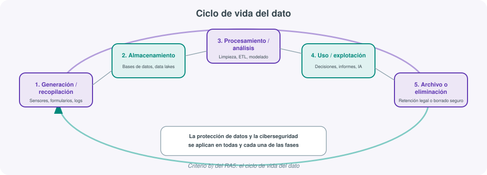
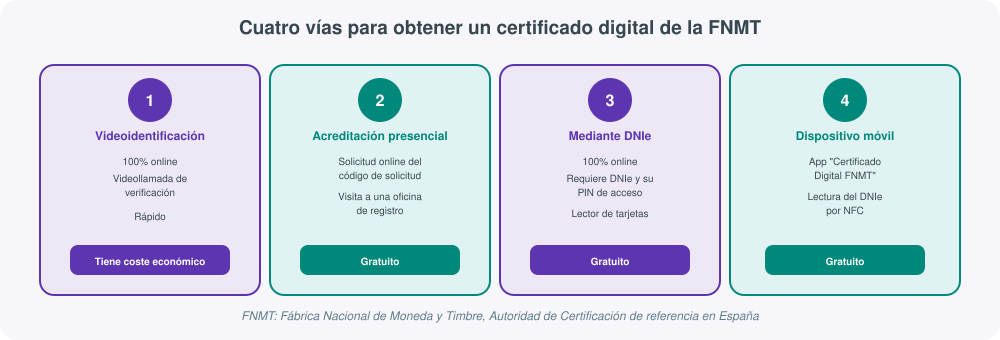
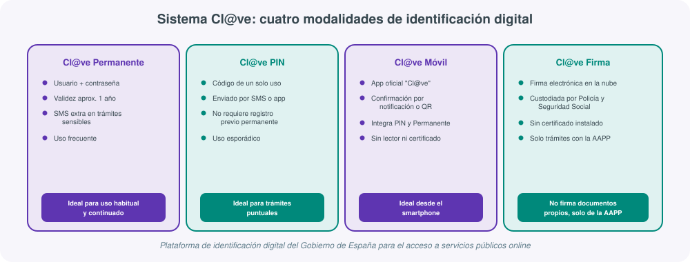

# **🔐 UT05 · Datos, seguridad e identidad digital**

## Resultado de aprendizaje y criterios de evaluación

**RA5.** Evalúa la importancia de los datos, así como su protección en una economía digital globalizada, definiendo sistemas de seguridad y ciberseguridad tanto a nivel de equipo/sistema, como globales.

Criterios de evaluación:

a) Se ha establecido la diferencia entre dato e información.
b) Se ha descrito el ciclo de vida del dato.
c) Se ha identificado la relación entre Big Data, análisis de datos, machine/deep learning e inteligencia artificial.
d) Se han descrito las características que definen Big Data.
e) Se han descrito las etapas típicas de la ciencia de datos y su relación en el proceso.
f) Se han descrito los procedimientos de almacenaje de datos en la cloud/nube.
g) Se ha descrito la importancia del cloud computing.
h) Se han identificado los principales objetivos de la ciencia de datos en las diferentes empresas.
i) Se ha valorado la importancia de la seguridad y su regulación en relación con los datos.

Esta unidad se organiza en dos bloques que responden, cada uno, a una mitad del propio enunciado del RA5: primero **qué son los datos** y cómo se convierten en valor (Big Data, ciencia de datos, cloud), y después **cómo se protegen** esos datos y la identidad de las personas que los generan, a través de certificados digitales, sistemas de identificación oficiales y firma electrónica.

---

## 1. Dato e información: la materia prima de la economía digital

El punto de partida del RA5 (criterio a) es una distinción que parece trivial pero que sostiene todo lo demás: **dato** e **información** no son sinónimos.

- **Dato**: un elemento en bruto, sin procesar. Un número, una palabra, una medida aislada. Por sí solo no dice gran cosa: `23`, `Martínez`, `14:32`.
- **Información**: el resultado de procesar uno o varios datos, dándoles un **contexto** y un **significado** que permite tomar una decisión o extraer una conclusión. `La temperatura a las 14:32 era de 23°C` ya es información: el dato bruto se ha combinado con contexto (qué mide, cuándo, en qué unidad).

!!! note "Dato + contexto + significado = información"
    Una tabla con miles de filas de compras (`producto`, `fecha`, `importe`) es una colección de datos. La misma tabla, analizada, que revela que *"los viernes se venden un 40% más zapatillas que el resto de la semana"*, es información: alguien ha aplicado un proceso (agregación, comparación) que añade sentido a los datos brutos.

Esta distinción es la base de la llamada **economía digital globalizada**: las empresas no compiten hoy solo por vender productos, sino por su capacidad de convertir datos dispersos (clickstreams, transacciones, sensores, redes sociales) en información útil para decidir mejor y más rápido que la competencia. Los datos se han convertido en un activo económico en sí mismo —de ahí la expresión, ya clásica, de que *"el dato es el nuevo petróleo"*—, con la particularidad de que, a diferencia del petróleo, un mismo dato puede reutilizarse, combinarse y explotarse simultáneamente por múltiples procesos sin agotarse.

Esta naturaleza de activo económico es precisamente lo que hace tan relevante el resto del RA5: un recurso que genera tanto valor también genera tanto **riesgo** si se pierde, se manipula o cae en manos no autorizadas, lo que conecta directamente con el bloque de protección de datos que ocupa la segunda mitad de esta unidad.

## 2. El ciclo de vida del dato

El criterio (b) exige describir el **ciclo de vida del dato**: el conjunto de fases por las que atraviesa un dato desde que se genera hasta que deja de tener utilidad o se elimina. Identificar estas fases es importante porque en cada una de ellas se juegan decisiones distintas de gestión y de seguridad.

| Fase | Qué ocurre | Ejemplo |
|---|---|---|
| **1. Generación / recopilación** | El dato nace: se mide, se introduce o se captura | Un formulario web, un sensor IoT, un registro (log) de un servidor |
| **2. Almacenamiento** | El dato se guarda de forma persistente, en un formato y una ubicación concretos | Base de datos relacional, data lake, hoja de cálculo |
| **3. Procesamiento / análisis** | El dato se limpia, se transforma y se analiza para extraer valor | ETL, consultas SQL, modelos de machine learning |
| **4. Uso / explotación** | La información resultante se utiliza para decidir o para automatizar | Un informe de ventas, una recomendación de producto, una alerta |
| **5. Archivo o eliminación** | El dato deja de usarse activamente: se archiva por motivos legales o se elimina de forma segura | Copia de seguridad a largo plazo, borrado según normativa de protección de datos |

!!! example "El ciclo de vida no es solo técnico, también es legal"
    La última fase del ciclo —archivo o eliminación— rara vez es una decisión puramente técnica. Normativas como el Reglamento General de Protección de Datos (RGPD) obligan a conservar ciertos datos durante un plazo mínimo (por ejemplo, facturas) y a eliminar otros en cuanto dejan de ser necesarios para la finalidad que justificó su recogida. Gestionar el ciclo de vida del dato es, por tanto, tan importante desde el punto de vista de la seguridad como desde el cumplimiento normativo (criterio i).

Cada fase de este ciclo requiere medidas de protección distintas: cifrado y control de acceso en el almacenamiento, anonimización o seudonimización en el procesamiento, políticas de retención en el archivo. Esta idea —que la seguridad no es una fase aislada sino algo transversal a todo el ciclo— es la que conecta este bloque introductorio con el Bloque B de la unidad.

## 3. Big Data: características, ciencia de datos y relación con la IA

### Qué es Big Data y sus características (las "V")

**Big Data** hace referencia a conjuntos de datos tan grandes, rápidos o complejos que las herramientas tradicionales de gestión de bases de datos no pueden procesarlos de forma eficiente. El criterio (d) pide describir las características que lo definen, habitualmente resumidas en las llamadas **"V" del Big Data**:

| Característica | Descripción |
|---|---|
| **Volumen** | La cantidad de datos generados es masiva (terabytes, petabytes) |
| **Velocidad** | Los datos se generan y deben procesarse a gran rapidez, a menudo en tiempo real |
| **Variedad** | Los datos proceden de fuentes y formatos distintos: texto, imagen, vídeo, sensores, redes sociales |
| **Veracidad** | No todos los datos son fiables; hay que evaluar su calidad y su origen |
| **Valor** | El objetivo final: que el análisis del dato aporte un beneficio real a la organización |

### Relación entre Big Data, machine learning, deep learning e inteligencia artificial

El criterio (c) exige identificar cómo se relacionan estos conceptos, que con frecuencia se confunden entre sí:

- La **inteligencia artificial (IA)** es el campo más amplio: sistemas capaces de realizar tareas que, hasta ahora, requerían inteligencia humana (razonar, reconocer patrones, tomar decisiones).
- El **machine learning (aprendizaje automático)** es una rama de la IA: algoritmos que aprenden patrones a partir de datos, sin ser programados explícitamente para cada caso.
- El **deep learning (aprendizaje profundo)** es, a su vez, una rama del machine learning basada en redes neuronales con múltiples capas, especialmente eficaz en tareas complejas como el reconocimiento de imágenes o el procesamiento del lenguaje natural.
- El **Big Data** es el "combustible" que hace posible entrenar estos modelos: cuantos más datos de calidad estén disponibles, mejor puede aprender un algoritmo de machine learning o deep learning.

!!! note "Círculos concéntricos, no sinónimos"
    IA ⊃ Machine Learning ⊃ Deep Learning. Todo sistema de deep learning es machine learning, y todo machine learning es un tipo de IA, pero no toda IA se basa en aprendizaje automático (existen sistemas basados en reglas expertas, por ejemplo). El Big Data no forma parte de esta jerarquía, sino que es la materia prima que alimenta y hace viables los modelos de las capas interiores.

### Etapas típicas de la ciencia de datos

El criterio (e) pide describir las **etapas de la ciencia de datos** y cómo se relacionan entre sí dentro de un mismo proceso:

1. **Definición del problema**: qué pregunta de negocio se quiere responder o qué decisión se quiere mejorar.
2. **Recopilación de datos**: identificar y reunir las fuentes de datos relevantes (bases de datos internas, APIs externas, sensores...).
3. **Limpieza de datos**: corregir valores erróneos, duplicados o incompletos; una fase que suele consumir la mayor parte del tiempo del proyecto.
4. **Análisis exploratorio de datos (EDA)**: explorar los datos con estadística descriptiva y visualizaciones para detectar patrones, tendencias o anomalías.
5. **Modelado**: aplicar técnicas estadísticas o de machine learning para construir un modelo predictivo o descriptivo.
6. **Comunicación de resultados**: presentar las conclusiones de forma comprensible a quien debe tomar la decisión, habitualmente mediante informes o cuadros de mando.

Estas etapas no son estrictamente lineales: es habitual volver a una fase anterior (por ejemplo, recopilar más datos) si el análisis exploratorio revela que los disponibles son insuficientes o de mala calidad.

### Almacenamiento de datos en la nube y cloud computing

El criterio (f) exige describir los procedimientos de almacenaje de datos en la nube. Los dos modelos de referencia son:

| Modelo | Qué almacena | Uso típico |
|---|---|---|
| **Data warehouse** (almacén de datos) | Datos estructurados, ya procesados y organizados en esquemas definidos | Informes de negocio, cuadros de mando (BI) |
| **Data lake** (lago de datos) | Datos en bruto, estructurados y no estructurados, en su formato original | Análisis exploratorio, entrenamiento de modelos de machine learning |

El **cloud computing** (criterio g) es lo que hace viable, en la práctica, el almacenamiento y procesamiento de Big Data para la mayoría de organizaciones: en lugar de invertir en infraestructura propia, una empresa contrata capacidad de almacenamiento y cómputo bajo demanda a proveedores como AWS, Microsoft Azure o Google Cloud. Esto aporta **escalabilidad** (crecer o reducir recursos según la necesidad puntual), **pago por uso** (sin grandes inversiones iniciales) y **acceso desde cualquier lugar**, tres factores que explican por qué prácticamente ningún proyecto moderno de ciencia de datos se plantea hoy sin apoyarse, en mayor o menor medida, en la nube.

### Objetivos de la ciencia de datos en las empresas

El criterio (h) pide identificar los principales objetivos que persigue la ciencia de datos en un contexto empresarial:

- **Optimizar procesos internos**: reducir costes, mejorar la eficiencia de la cadena de producción o logística.
- **Anticipar el comportamiento del cliente**: predecir qué productos comprará, cuándo abandonará el servicio (*churn*), qué precio está dispuesto a pagar.
- **Detectar fraude y anomalías**: identificar patrones de comportamiento sospechosos en tiempo real.
- **Personalizar la experiencia**: recomendaciones de contenido o producto adaptadas a cada usuario.
- **Apoyar la toma de decisiones estratégicas**: sustituir la intuición por evidencia basada en datos (*data-driven decision making*).

Todos estos objetivos comparten un mismo requisito de fondo, que es precisamente el que da paso al segundo bloque de esta unidad: los datos que hacen posible ese valor —muchos de ellos personales o sensibles— deben protegerse, tanto por obligación legal como por responsabilidad frente a las personas a las que pertenecen (criterio i).

---

## 4. La seguridad de los datos y la identidad digital: por qué importa

Antes de entrar en herramientas concretas conviene fijar la idea central del criterio (i): la importancia de los datos como activo (Bloque A) tiene como contrapartida inevitable la necesidad de **protegerlos**, y esa protección empieza por algo muy concreto: poder demostrar de forma fiable **quién es quién** en el mundo digital. Un dato mal protegido no solo se pierde: puede robarse, alterarse o utilizarse para suplantar una identidad.

La identidad digital —y su forma más avanzada, la firma electrónica— resuelve un problema muy similar al del DNI físico, pero en un entorno donde no existe el papel ni la presencia física: ¿cómo garantiza un sistema que la persona que está al otro lado de una pantalla es realmente quien dice ser, y cómo garantiza que un documento firmado electrónicamente no ha sido manipulado? Este bloque desarrolla, de menor a mayor complejidad, las herramientas reales que existen hoy en España para responder a esa pregunta: el DNI electrónico, los certificados digitales emitidos por la FNMT, el sistema Cl@ve del Gobierno, y la firma digital de documentos con Autofirma.

## 5. El DNI electrónico (DNIe): la identidad física convertida en identidad digital

El **DNI electrónico (DNIe)** es la versión digital del Documento Nacional de Identidad español. Se introdujo en 2006 y se actualizó en 2015 con la versión **DNIe 3.0**, que incorpora tecnología **NFC** (comunicación de campo cercano), permitiendo su lectura sin necesidad de un lector de tarjetas físico, simplemente acercándolo a un dispositivo móvil compatible.

El DNIe incorpora un **chip criptográfico** que almacena, además de los datos personales habituales, **dos certificados electrónicos** con funciones distintas:

| Certificado | Función |
|---|---|
| **Certificado de Autenticación** | Acredita la identidad electrónica de la persona ante terceros (equivalente a "presentar el DNI" online) |
| **Certificado de Firma Electrónica** | Permite firmar documentos electrónicamente con la misma validez jurídica que una firma manuscrita |

!!! note "Misma validez legal que la firma en papel"
    Este es uno de los puntos clave que justifica la relevancia de todo este bloque: la firma electrónica realizada con el DNIe no es un "sustituto informal" de la firma manuscrita, sino que **tiene la misma validez jurídica**, reconocida por la legislación española y europea (Reglamento eIDAS). Firmar un contrato con el DNIe compromete legalmente igual que firmarlo con bolígrafo.

El DNIe se obtiene en las **oficinas de expedición del DNI** (comisarías de la Policía Nacional habilitadas), donde se toman los datos biométricos y se emite físicamente la tarjeta. Sus usos habituales incluyen:

- Trámites con las Administraciones Públicas (AAPP).
- Solicitud de certificados oficiales (nacimiento, vida laboral).
- Presentación de la declaración de impuestos.
- Compras y banca online.
- Acceso seguro a edificios o a equipos informáticos.

### Activación del DNIe

Cuando se recoge el DNIe en la oficina de expedición, se entrega junto con un **PIN en un sobre cerrado**. La activación puede realizarse de dos formas:

1. **En un Punto de Actualización del DNI (PAD)**: verificando la identidad mediante huella dactilar y el PIN recibido.
2. **Desde casa**: con un **lector de tarjetas compatible con el estándar ISO 7816**, comprobando el correcto funcionamiento en el sitio oficial **www.dnielectronico.es**.

### Renovación de los certificados del DNIe

Los certificados del DNIe no son permanentes: tienen una **vigencia actual de 60 meses (5 años)**. Su renovación:

- Se realiza en un **PAD de cualquier comisaría**, sin necesidad de cita previa, seleccionando la opción **"Renovar Certificados"**.
- Requiere verificación mediante **huella dactilar**.
- Es **gratuita**.
- Puede realizarse en los **60 días previos a la caducidad** de los certificados.
- La fecha de caducidad puede comprobarse a través de la app oficial **"Mi Carpeta Ciudadana"** o en la **sede electrónica de la FNMT**.

!!! warning "Certificados caducados, DNI en vigor"
    Es un error frecuente asumir que si el DNI físico no ha caducado, sus certificados electrónicos tampoco lo han hecho. Ambas caducidades son **independientes**: un DNIe puede estar en vigor como documento de identidad y, al mismo tiempo, tener sus certificados electrónicos caducados si no se han renovado dentro del plazo de 60 meses.

## 6. Certificados digitales y la FNMT como Autoridad de Certificación

Más allá del DNIe, cualquier persona o entidad puede disponer de un **certificado digital** independiente. Un certificado digital es un **documento electrónico** que vincula una **identidad digital** —de una persona física, una persona jurídica o una entidad— con una clave criptográfica, emitido por una **Autoridad de Certificación (AC)** y con un **periodo de validez** determinado. Su funcionamiento se basa en **criptografía de clave pública** (un par de claves, una privada que custodia el titular y otra pública que se puede compartir para verificar la firma).

En España, la Autoridad de Certificación de referencia es la **FNMT** (**Fábrica Nacional de Moneda y Timbre**), a través de su Real Casa de la Moneda, que emite certificados reconocidos y de uso generalizado tanto por particulares como por empresas y Administraciones Públicas.

Existen tres tipos principales de certificado digital, según a quién o qué identifican:

| Tipo de certificado | A quién identifica | Uso típico |
|---|---|---|
| **Certificado de persona física** | Un individuo concreto | Trámites con la AAPP, firma de documentos propios |
| **Certificado de persona jurídica** | Una empresa o entidad, actuando en su nombre | Trámites corporativos (impuestos, contratación pública) |
| **Certificado de servidor SSL/TLS** | Un sitio web, no una persona | Autenticar la identidad de un dominio y cifrar la conexión (el candado del navegador); esencial en comercio electrónico y banca online |

!!! example "El candado del navegador también es un certificado digital"
    Cuando un usuario compra en una tienda online y ve el candado junto a la URL, está confiando en un **certificado SSL/TLS** que identifica ese servidor concreto y cifra la comunicación. Es el mismo concepto de fondo que el certificado de persona física —una identidad digital verificada por una Autoridad de Certificación—, pero aplicado a un servidor en lugar de a un individuo. Sin este tipo de certificado, no existiría el comercio electrónico ni la banca online tal como se conocen hoy.

### Cómo obtener un certificado digital de la FNMT

La FNMT ofrece **cuatro métodos** distintos para obtener un certificado digital de persona física, con diferencias importantes entre ellos:

| Método | Modalidad | Coste | Detalle |
|---|---|---|---|
| **Videoidentificación** | 100% online | De pago | Verificación mediante videollamada con un operador; proceso rápido |
| **Acreditación presencial** | Solicitud online + visita a oficina | Gratuito | Se genera un código de solicitud online y se acredita la identidad presencialmente en una oficina de registro |
| **Mediante DNI electrónico** | 100% online | Gratuito | Se utiliza el propio DNIe y su PIN para acreditar la identidad sin desplazamientos |
| **Dispositivo móvil** | App "Certificado Digital FNMT" | Gratuito | Lectura del DNIe mediante NFC desde el propio smartphone |

La elección del método depende, sobre todo, de si la persona dispone ya de un DNIe activado (lo que permite completar todo el proceso online y sin coste) o prefiere/necesita recurrir a la videoidentificación o a la vía presencial.

## 7. El sistema Cl@ve: identificación digital unificada del Gobierno de España

**Cl@ve** es la plataforma de identificación digital del Gobierno de España diseñada para **simplificar** el acceso electrónico a los servicios públicos, evitando que cada ciudadano tenga que gestionar un certificado digital distinto para cada organismo.

### Registro en Cl@ve

El alta en el sistema puede realizarse por tres vías:

- **Por internet**, utilizando un certificado digital o el DNIe ya activado (proporciona el **nivel avanzado** de registro).
- **Presencialmente**, en una oficina de registro habilitada.
- **Mediante carta de invitación**, enviada por correo postal, que proporciona un **nivel básico** de registro.

En cualquiera de los casos se aportan el número de teléfono, el correo electrónico y el DNI/NIE, y se recibe un **SMS de confirmación** que valida el proceso.

### Las cuatro modalidades de Cl@ve

| Modalidad | Cómo funciona | Cuándo se usa |
|---|---|---|
| **Cl@ve Permanente** | Usuario y contraseña de validez aproximada de 1 año, reforzada con un SMS adicional en trámites sensibles | Uso frecuente y continuado |
| **Cl@ve PIN** | Código de un solo uso, enviado por SMS o generado por app, sin necesidad de recordar una contraseña fija | Uso esporádico u ocasional |
| **Cl@ve Móvil** | App oficial "Cl@ve": confirma trámites mediante notificación push o lectura de un código QR; integra en una sola app el PIN y la Permanente | Gestión desde el smartphone, sin lector ni certificado instalado |
| **Cl@ve Firma** | Firma electrónica en la nube, custodiada por la Dirección General de Policía y la Seguridad Social | Solo para trámites de la Administración Pública, nunca para documentos propios |

!!! warning "Cl@ve Firma no sustituye a un certificado digital propio"
    Es importante no confundir Cl@ve Firma con un certificado digital de uso general: Cl@ve Firma permite firmar **trámites concretos de la Administración Pública** sin necesidad de tener un certificado instalado en el equipo, pero **no sirve para firmar documentos propios** (un contrato entre particulares, por ejemplo). Para eso hace falta un certificado digital instalado localmente, como los que emite la FNMT, o el certificado de firma del propio DNIe.

## 8. Instalación y uso de certificados digitales en el navegador

Una vez obtenido un certificado digital (en formato de archivo, típicamente `.p12` o `.pfx`), es necesario **instalarlo** en el almacén de certificados del sistema operativo o del navegador antes de poder utilizarlo:

1. **Importar el certificado**: en Chrome, desde `Configuración → Privacidad y seguridad → Seguridad → Gestionar certificados`; en Firefox, desde `Configuración → Privacidad y Seguridad → Certificados → Ver certificados → Importar`. Ambos navegadores ofrecen un asistente de importación que solicita la contraseña del archivo del certificado.
2. **Completar el asistente de instalación**, seleccionando el almacén de certificados de destino (personal, de confianza) y confirmando la operación.
3. **Utilizar el certificado**: al acceder a una sede electrónica que ofrezca acceso mediante certificado digital, el usuario selecciona la opción **"Certificado Digital"** como método de identificación, y el navegador solicita elegir cuál de los certificados instalados presentar.

!!! tip "Comprobar antes de necesitarlo"
    Es buena práctica comprobar que un certificado se ha instalado correctamente accediendo a una sede electrónica de prueba (por ejemplo, la propia sede de la FNMT) **antes** del día en que se necesita realizar un trámite con plazo límite. Un certificado mal importado, caducado o instalado en el navegador equivocado es una de las incidencias más comunes al gestionar trámites online.

## 9. Firma digital de documentos PDF con Autofirma

Además de identificarse ante una sede electrónica, un certificado digital permite **firmar documentos** electrónicamente, con la misma validez legal que una firma manuscrita. Existen dos vías habituales:

- **Lectores de PDF con función de firma**: muchos lectores de PDF incluyen una sección de "certificados" que permite firmar y validar firmas existentes en el propio documento.
- **Autofirma**: la herramienta oficial de referencia en España, desarrollada por el **Ministerio de Hacienda y Administraciones Públicas**, disponible de forma gratuita en **https://firmaelectronica.gob.es/**.

**Autofirma** permite realizar **firma electrónica avanzada** de documentos (PDF, entre otros formatos) basada en certificados digitales instalados en el equipo —ya sea un certificado FNMT, el certificado de firma del DNIe, u otro certificado reconocido—, con plena **validez legal**. Su funcionamiento general consiste en:

1. Instalar la aplicación de escritorio Autofirma en el equipo.
2. Seleccionar el documento PDF (u otro formato admitido) que se desea firmar.
3. Elegir el certificado digital instalado con el que se quiere firmar.
4. Generar el documento firmado, que incorpora una firma electrónica verificable por cualquier tercero.

!!! example "De la identidad a la firma: el recorrido completo del bloque"
    El recorrido de este bloque forma, en la práctica, una única cadena: (1) una persona obtiene su **DNIe** o un **certificado digital de la FNMT**; (2) lo **instala** en su navegador o sistema; (3) lo utiliza para **identificarse** en una sede electrónica, o bien a través de **Cl@ve** si no dispone de certificado propio; (4) cuando necesita comprometerse legalmente con un documento, lo **firma** con Autofirma o con el certificado de firma del DNIe. Cada eslabón de esta cadena es, en sí mismo, una medida de protección de la identidad digital y, por extensión, de los datos que esa identidad controla.

## Actividades

Esta unidad se trabaja de forma práctica mediante el reto de aprendizaje basado en retos [Identidad digital: certificados, Cl@ve y firma electrónica](ut05-practica.md), donde el alumnado obtiene, instala y utiliza certificados digitales reales.

## Para profundizar

- [Sede electrónica de la FNMT](https://www.sede.fnmt.gob.es/), para la obtención, renovación y gestión de certificados digitales.
- [Autofirma](https://firmaelectronica.gob.es/), la aplicación oficial del Gobierno de España para la firma electrónica de documentos.

El resto de enlaces y recursos generales del módulo está en la página de [Recursos](recursos.md).
