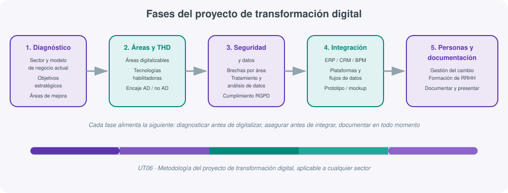
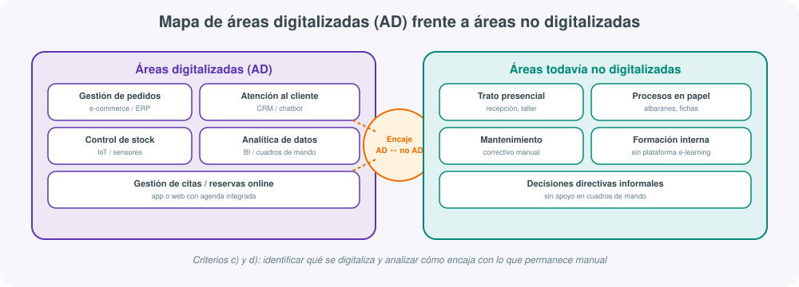
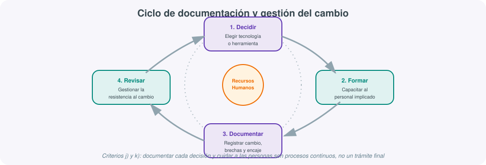

# **🚀 UT06 · Proyecto de transformación digital**

## Resultado de aprendizaje y criterios de evaluación

**RA6.** Desarrolla un proyecto de transformación digital de una empresa de un sector relacionado con el título, teniendo en cuenta los cambios que se deben producir en función de los objetivos de la empresa.

Criterios de evaluación:

a) Se han identificado los objetivos estratégicos de la empresa.
b) Se han identificado y alineado las áreas de producción/negocio y de comunicaciones.
c) Se han identificado las áreas susceptibles de ser digitalizadas.
d) Se ha analizado el encaje de AD (áreas digitalizadas) entre sí y con las que no lo están.
e) Se han tenido en cuenta las necesidades presentes y futuras de la empresa.
f) Se han relacionado cada una de las áreas con la implantación de las tecnologías.
g) Se han analizado las posibles brechas de seguridad en cada una de las áreas.
h) Se ha definido el tratamiento de los datos y su análisis.
i) Se ha tenido en cuenta la integración entre datos, aplicaciones, plataformas que los soportan, entre otros.
j) Se han documentado los cambios realizados en función de la estrategia.
k) Se ha tenido en cuenta la idoneidad de los recursos humanos.

Esta unidad es la **unidad de síntesis** del módulo: no presenta contenidos técnicos nuevos, sino una **metodología de proyecto** que obliga a movilizar todo lo aprendido en UT01-UT05 (digitalización, Tecnologías Habilitadoras Digitales, cloud, inteligencia artificial, datos y seguridad) para diseñar, de principio a fin, un plan de transformación digital aplicado a una empresa real o simulada de un sector productivo.

## 1. Qué es un proyecto de transformación digital y por qué se evalúa como proyecto

Un proyecto de transformación digital no es la simple compra de software nuevo, sino un **proceso planificado de cambio** que reorganiza procesos, tecnologías y personas de una empresa para alcanzar objetivos estratégicos concretos: vender más, producir con menos errores, fidelizar clientes, reducir costes o cumplir nuevas exigencias normativas. Precisamente por eso el RA6 no pide "conocer" tecnologías sueltas, sino **desarrollar un proyecto completo**: diagnosticar, decidir, justificar, documentar y presentar.

Trabajar por proyectos en esta unidad tiene una consecuencia práctica directa: cada criterio de evaluación (a-k) se convierte en un **entregable o apartado obligatorio** del trabajo final. No hay margen para limitarse a "elegir tecnologías bonitas"; hay que demostrar que cada elección responde a un objetivo de negocio, encaja con el resto de la organización, se ha analizado en términos de seguridad y de datos, y se ha documentado pensando en las personas que tendrán que usarla.

!!! note "De la teoría a la práctica de aula"
    Esta unidad se apoya en una actividad de aula ya conocida: por equipos, el alumnado elige un sector (comercio electrónico, manufactura, salud, retail, servicios financieros, peluquería, logística, gestión de eventos, cafetería, empresa de desarrollo de software...) y construye, paso a paso, un plan de transformación digital integral que termina con una presentación de unos 10 minutos ante el resto de la clase. El resto de esta UT ordena esa práctica en una metodología reutilizable para cualquier proyecto similar, dentro o fuera del aula.

## 2. Metodología general del proyecto

Antes de entrar en cada fase conviene fijar la lógica de conjunto: un proyecto de transformación digital bien planteado sigue siempre el mismo orden causal, aunque el sector y la tecnología concreta cambien.

| Fase | Pregunta que responde | Criterios RA6 relacionados |
|---|---|---|
| 1. Diagnóstico y objetivos | ¿Dónde está la empresa y a dónde quiere llegar? | a, b, e |
| 2. Áreas digitalizables y THD | ¿Qué se puede digitalizar y con qué tecnología? | c, d, f |
| 3. Seguridad y datos | ¿Qué riesgos introduce cada cambio y cómo se tratan los datos? | g, h |
| 4. Integración de plataformas | ¿Cómo encajan entre sí las herramientas elegidas? | i |
| 5. Personas y documentación | ¿Quién lo va a usar y cómo queda constancia del proyecto? | j, k |

Un error habitual es empezar por la fase 2 (elegir tecnología) sin haber cerrado la fase 1 (objetivos del negocio). El resultado son proyectos con herramientas muy vistosas que no resuelven ningún problema real de la empresa. La metodología correcta obliga a que **cada tecnología propuesta se justifique por un objetivo estratégico o una necesidad detectada**, nunca al revés.

!!! tip "El proyecto como historia coherente"
    Un buen proyecto de transformación digital se puede contar como una historia con causa y efecto: "la empresa quiere reducir el tiempo de espera en tienda (objetivo) → detectamos que la gestión de citas es manual y genera colas (área susceptible de digitalizar) → implantamos una app de reservas online con recordatorios automáticos (tecnología) → esto obliga a revisar cómo se protegen los datos de los clientes (seguridad) → la app se conecta con el sistema de facturación existente (integración) → formamos al personal de recepción en el nuevo sistema (recursos humanos) → documentamos el cambio para que quede constancia de por qué se hizo así (documentación)". Si un proyecto no se puede narrar de esta forma encadenada, probablemente le falta coherencia entre fases.

## 3. Diagnóstico y objetivos estratégicos de la empresa (criterios a, b, e)

El punto de partida de cualquier proyecto es responder con precisión a la pregunta "¿qué empresa es y qué quiere conseguir?". El criterio a exige identificar los **objetivos estratégicos**: no genéricos ("ser más digital"), sino formulados de forma que se puedan medir y relacionar después con tecnologías concretas.

Ejemplos de objetivos estratégicos habituales según el sector elegido en la actividad de aula:

| Sector | Objetivo estratégico típico |
|---|---|
| E-commerce | Aumentar la conversión de visitas en ventas y reducir el abandono de carrito |
| Manufactura | Reducir el tiempo de parada de máquina mediante mantenimiento predictivo |
| Salud | Mejorar la trazabilidad del historial clínico y reducir tiempos de espera |
| Retail / peluquería | Optimizar la gestión de citas y fidelizar clientes habituales |
| Logística | Aumentar la visibilidad de los envíos en tiempo real |
| Cafetería / hostelería | Reducir el desperdicio de producto y agilizar el pedido en sala |
| Servicios financieros | Reforzar la seguridad de las transacciones y cumplir normativa |
| Empresa de software | Acelerar el ciclo de entrega de nuevas versiones |

El criterio b añade una exigencia de coherencia interna: los objetivos no pueden analizarse solo desde el área de producción o de negocio; hay que **alinear también el área de comunicaciones** (atención al cliente, marketing, imagen de marca), porque una transformación digital que mejora la producción pero no comunica el cambio a sus clientes pierde buena parte de su impacto.

Por último, el criterio e obliga a mirar más allá del presente: toda propuesta debe considerar **necesidades futuras** (crecimiento previsto, escalabilidad, nuevos productos o servicios) y no solo el problema inmediato, para evitar que la solución quede obsoleta en poco tiempo.

!!! example "Plantilla de diagnóstico inicial"
    - Sector y tamaño de la empresa (pyme, gran empresa, autónomo).
    - Modelo de negocio actual: cómo genera ingresos, quiénes son sus clientes.
    - 2-3 objetivos estratégicos concretos y medibles.
    - Áreas de producción/negocio implicadas y áreas de comunicación implicadas.
    - Necesidades previsibles a corto plazo (1 año) y medio plazo (3 años).

## 4. Identificación de áreas digitalizables y su encaje (criterios c, d)

Con los objetivos claros, la segunda fase consiste en recorrer la empresa **área por área** y decidir cuáles son candidatas a digitalizarse. Las áreas más habituales en la práctica de aula son: gestión de citas y reservas, control de stock e inventario, gestión de pedidos, experiencia y atención al cliente, gestión del personal, mantenimiento de activos y comunicación interna.

No todas las áreas se digitalizan al mismo ritmo ni con la misma prioridad. El criterio d exige explícitamente analizar el **encaje entre las áreas ya digitalizadas (AD) y las que todavía no lo están**, porque una empresa rara vez transforma toda su operativa de golpe: conviven procesos digitales (una app de reservas) con procesos manuales (la atención en el mostrador), y el proyecto debe explicar cómo se comunican entre sí sin generar duplicidad de información ni pérdida de datos.

Preguntas guía para esta fase:

- ¿Qué áreas generan más fricción o más errores en el proceso actual?
- ¿Qué áreas dependen de información que ya existe en algún sistema digital (facturación, CRM) y podrían aprovecharla?
- ¿Qué áreas seguirán siendo manuales a corto plazo y cómo se van a coordinar con las digitalizadas (por ejemplo, un empleado que introduce a mano en el sistema lo que un cliente ha pedido por teléfono)?
- ¿Existe riesgo de que dos sistemas digitales dupliquen el mismo dato sin sincronizarse (stock físico frente a stock mostrado en la tienda online)?

!!! warning "El punto de fricción más frecuente"
    El fallo más habitual en los proyectos de aula es proponer una tecnología para un área sin explicar qué ocurre en el punto exacto donde esa área digital se conecta con una todavía manual. Un sistema de pedidos online que no informa a la persona que gestiona el almacén físico genera errores de stock; una app de citas que no avisa al personal en recepción provoca duplicidad de reservas. El criterio d se evalúa precisamente en ese detalle de encaje, no solo en la lista de tecnologías elegidas.

## 5. Selección de tecnologías y Tecnologías Habilitadoras Digitales (criterio f)

Una vez identificadas las áreas, el criterio f exige **relacionar cada área con la tecnología concreta** que la va a digitalizar, retomando el catálogo de Tecnologías Habilitadoras Digitales (THD) trabajado en unidades anteriores: computación en la nube, Internet de las Cosas (IoT), inteligencia artificial y análisis de datos, ciberseguridad, blockchain, gemelos digitales, robótica e impresión 3D, entre otras.

| Área de la empresa | THD aplicable | Ejemplo de herramienta |
|---|---|---|
| Gestión de citas / reservas | Cloud + apps de reserva online | Calendly, apps propias con backend en la nube |
| Control de stock e inventario | IoT (sensores), analítica de datos | Sensores RFID, dashboards de inventario en tiempo real |
| Atención al cliente | IA conversacional, CRM | Chatbots, CRM (gestión de relación con el cliente) |
| Mantenimiento de maquinaria | IoT + IA (mantenimiento predictivo) | Sensores de vibración/temperatura + modelos predictivos |
| Trazabilidad de producto | Blockchain | Registro inmutable de lotes en cadena de suministro |
| Diseño y prototipado de procesos | Gemelos digitales | Simulación virtual de una línea de producción |
| Gestión documental y de procesos | BPM (gestión de procesos de negocio) | Herramientas de automatización de flujos de trabajo |
| Comercio y ventas | E-commerce, marketing digital | Plataformas de tienda online, campañas segmentadas |

La clave metodológica de esta fase es evitar la tecnología "de escaparate": cada THD propuesta debe volver a conectarse con el objetivo estratégico definido en la fase 1. Si el objetivo es reducir el desperdicio de producto en una cafetería, la tecnología relevante es un sistema de control de inventario con alertas de caducidad, no necesariamente un gemelo digital sofisticado que la empresa no podría mantener.

## 6. Seguridad y brechas por área (criterio g)

Cada nueva área digitalizada introduce, junto a sus beneficios, una nueva **superficie de exposición a riesgos**. El criterio g obliga a analizar, área por área, qué brechas de seguridad pueden aparecer y qué medida las mitiga, retomando lo trabajado en la unidad de seguridad y datos del módulo.

| Área digitalizada | Brecha de seguridad típica | Medida de mitigación |
|---|---|---|
| E-commerce / pagos online | Robo de datos de tarjeta, fraude | Cifrado TLS, pasarelas de pago certificadas (PCI-DSS) |
| CRM con datos de clientes | Filtración de datos personales | Control de accesos, cifrado en reposo, copias de seguridad |
| IoT en planta | Dispositivos con credenciales por defecto | Cambio de credenciales, segmentación de red |
| Acceso remoto del personal | Credenciales débiles, sin doble factor | Autenticación multifactor, políticas de contraseñas |
| Aplicaciones en la nube | Configuración incorrecta de permisos | Revisión de permisos mínimos, auditorías periódicas |
| Historial de pedidos / citas | Acceso no autorizado a datos de clientes | Roles de usuario diferenciados, registro de accesos |

Este análisis no puede quedarse en una lista genérica: el proyecto debe indicar **qué área concreta de la empresa** es más vulnerable y por qué, y qué ocurriría si esa brecha se materializase (pérdida de confianza de clientes, sanción por incumplimiento normativo, parada de la actividad).

## 7. Tratamiento e integración de datos y plataformas (criterios h, i)

El criterio h exige definir **qué datos se van a tratar y cómo se van a analizar**: qué se recoge (transacciones, comportamiento de navegación, sensores IoT, historial de citas), dónde se almacena, quién tiene acceso y qué análisis se extraen de ellos para apoyar decisiones (por ejemplo, predecir la demanda de un producto o detectar clientes en riesgo de abandono).

El criterio i, complementario, exige pensar en la **integración entre los propios sistemas**: de poco sirve tener datos de calidad si viven en aplicaciones que no se comunican entre sí. Aquí entran en juego las plataformas de gestión empresarial ya vistas en el módulo:

| Plataforma | Función principal | Ejemplo de integración necesaria |
|---|---|---|
| **ERP** (Enterprise Resource Planning) | Integra finanzas, compras, inventario y producción en un único sistema | El stock que gestiona el ERP debe reflejarse en tiempo real en la tienda online |
| **CRM** (Customer Relationship Management) | Centraliza la información y el historial de cada cliente | El CRM debe alimentarse de los pedidos registrados en el ERP y en el e-commerce |
| **BPM** (Business Process Management) | Automatiza y coordina flujos de trabajo entre departamentos | El flujo de aprobación de un pedido debe conectar ventas, almacén y facturación sin pasos manuales |

!!! example "Un caso de integración típico en la actividad de aula"
    Una peluquería digitaliza la gestión de citas (app de reservas) y quiere además fidelizar clientes con un programa de puntos. Si la app de citas y el sistema de fidelización son dos herramientas independientes que no comparten datos, el negocio no podrá saber qué clientes habituales reservan con más frecuencia. La solución pasa por integrar ambos sistemas (o elegir una plataforma que cubra las dos funciones), de modo que el dato de "cliente" sea único y esté disponible para ambos procesos.

Toda propuesta de tratamiento de datos debe además respetar el marco normativo de protección de datos (RGPD), señalando qué datos personales se recogen, con qué finalidad y durante cuánto tiempo se conservan.

## 8. Documentación de la transformación y gestión del cambio (criterios j, k)

Las dos últimas exigencias del RA6 son las que con más frecuencia se descuidan en un proyecto real, y por eso merecen un tratamiento explícito.

### Por qué documentar (criterio j)

Documentar un proyecto de transformación digital no es un trámite burocrático posterior, sino parte del propio proyecto. Cada decisión tecnológica, cada brecha de seguridad detectada y cada punto de encaje entre áreas digitalizadas y no digitalizadas debe quedar registrado por varias razones:

- **Trazabilidad**: permite justificar ante la dirección por qué se eligió una tecnología y no otra.
- **Continuidad**: si la persona que lideró el cambio deja la empresa, el proyecto no se pierde.
- **Auditoría y cumplimiento**: en caso de incidente de seguridad o inspección normativa, la documentación demuestra qué medidas se habían previsto.
- **Base para la siguiente fase**: ningún proyecto de transformación digital termina en un único proyecto; la documentación de esta fase es el punto de partida de la siguiente.

Una ficha mínima de documentación de proyecto debería recoger, por cada área transformada: objetivo que persigue, tecnología elegida, responsable, brechas de seguridad identificadas y su mitigación, sistemas con los que se integra y fecha de revisión.

### Recursos humanos como factor crítico (criterio k)

Ninguna tecnología, por bien elegida que esté, transforma una empresa si las personas que deben usarla no están preparadas o no la aceptan. El criterio k obliga a considerar la **idoneidad de los recursos humanos**, lo que incluye tres aspectos:

- **Formación**: el personal necesita capacitarse en las nuevas herramientas antes de que se conviertan en la forma habitual de trabajar.
- **Gestión del cambio**: planificar cómo se comunica la transformación, con qué calendario y con qué acompañamiento, para minimizar la disrupción.
- **Resistencia al cambio**: anticipar que parte del personal puede percibir la digitalización como una amenaza (a su puesto, a su forma de trabajar conocida) y diseñar medidas para reducir esa resistencia, como pilotos progresivos, formación práctica o canales para recoger dudas y quejas.

!!! warning "La causa más común de fracaso de un proyecto de transformación digital"
    Numerosos proyectos de transformación digital fracasan no por elegir mal la tecnología, sino por no gestionar el factor humano: personal que no usa la nueva herramienta porque no se ha formado, o que la evita porque no ha entendido para qué sirve. Por eso el RA6 sitúa este criterio al mismo nivel que la seguridad o la integración de datos: es un requisito de éxito, no un añadido opcional.

## 9. Beneficios de una transformación digital integral: marco de evaluación del proyecto

Antes de dar por cerrado un proyecto conviene contrastarlo con los beneficios generales que se esperan de una transformación digital bien planteada. Estos beneficios sirven como **lista de comprobación de calidad** para cualquier propuesta, sea cual sea el sector elegido:

| Beneficio | Qué debería observarse en el proyecto |
|---|---|
| Eficiencia operativa | Procesos más rápidos o con menos pasos manuales |
| Decisiones basadas en datos | Existencia de indicadores o cuadros de mando que apoyen decisiones |
| Mejor experiencia de cliente | Canales de atención más ágiles, personalización, menos fricciones |
| Gestión eficiente de activos | Mantenimiento predictivo, seguimiento de inventario en tiempo real |
| Cadena de suministro ágil | Visibilidad de pedidos y proveedores, menos rupturas de stock |
| Reducción de costes y desperdicios | Automatización de tareas repetitivas, optimización de inventario |
| Agilidad frente al cambio | Capacidad de adaptar procesos ante nuevas demandas del mercado |
| Seguridad mejorada | Medidas concretas frente a las brechas identificadas en cada área |
| Cumplimiento normativo | Tratamiento de datos conforme al RGPD y a la normativa del sector |

Un proyecto que solo aporta una tecnología llamativa sin impacto en ninguno de estos ejes probablemente no está resolviendo un problema real de la empresa, por bien presentado que esté.

!!! example "Aplicando el marco a un caso de aula"
    Un equipo que elige el sector "cafetería" podría justificar su proyecto así: la eficiencia operativa mejora con un sistema de pedido digital en mesa que reduce tiempos de espera; las decisiones basadas en datos se apoyan en un panel que muestra qué productos rotan menos para ajustar la carta; la experiencia de cliente mejora con un programa de fidelización por app; la gestión de activos se refuerza con sensores de temperatura en las cámaras frigoríficas; los costes se reducen al detectar antes el desperdicio de producto próximo a caducar; y la seguridad mejora al cifrar los pagos con tarjeta y limitar el acceso al panel de gestión solo al personal autorizado. Repasar los nueve beneficios uno a uno obliga a comprobar que ningún área del proyecto se ha quedado sin justificar.

## 10. Errores frecuentes al desarrollar el proyecto

Antes de pasar al guion de la presentación final conviene repasar los errores que con más frecuencia rebajan la calidad de un proyecto de transformación digital en la práctica de aula, para poder detectarlos a tiempo durante el propio desarrollo del trabajo:

| Error frecuente | Por qué perjudica al proyecto | Cómo evitarlo |
|---|---|---|
| Elegir la tecnología antes que el objetivo | La propuesta parece un catálogo de productos, no un plan de negocio | Redactar primero los objetivos estratégicos (fase 1) y solo después buscar la THD que los sirve |
| Tratar todas las áreas por igual | Se dedica el mismo esfuerzo a un cambio menor que a uno crítico | Priorizar las áreas según impacto en el objetivo estratégico y en el cliente |
| Ignorar el punto de encaje entre AD y no AD | Aparecen duplicidades de datos o procesos rotos en la práctica | Dibujar explícitamente, como en el mapa de áreas de esta unidad, dónde se tocan los procesos digitales y los manuales |
| Tratar la seguridad como un apartado aislado | Las brechas no se relacionan con el área que realmente las provoca | Analizar la seguridad área por área, no como una sección genérica al final |
| No mencionar el RGPD ni la conservación de datos | El proyecto no sería viable en una empresa real | Indicar qué datos personales se recogen, con qué finalidad y durante cuánto tiempo |
| Olvidar a las personas que usarán el sistema | El proyecto parece viable sobre el papel pero fracasaría en la implantación real | Incluir siempre un plan de formación y de gestión del cambio, por breve que sea |
| No dejar constancia de las decisiones | Nadie puede auditar ni continuar el proyecto más adelante | Cerrar cada apartado con una ficha de documentación, como se propone en el apartado 8 |

## 11. Estructura de la presentación final

La actividad de aula culmina con una **presentación de aproximadamente 10 minutos** por equipo, seguida de un turno de preguntas y debate con el resto de la clase. Esta presentación debe recoger de forma ordenada todas las fases anteriores, en un formato claro y visual (infografía, diagrama de flujo, mockup de la herramienta propuesta).

Guion recomendado para la presentación:

1. **Presentación de la empresa y el sector** (1 min): tipo de negocio, tamaño, contexto.
2. **Objetivos estratégicos y áreas de mejora** (2 min): qué se quiere conseguir y por qué.
3. **Áreas digitalizables y tecnologías propuestas** (3 min): qué se digitaliza, con qué THD, y cómo encaja con lo que sigue siendo manual.
4. **Seguridad y tratamiento de datos** (1-2 min): brechas detectadas y cómo se protege la información.
5. **Integración de plataformas** (1 min): cómo se conectan ERP, CRM, BPM u otras herramientas elegidas.
6. **Personas y documentación** (1 min): plan de formación y cómo queda documentado el proyecto.
7. **Cierre y beneficios esperados** (30 s): qué mejora concreta se espera obtener.

El turno de debate posterior con la clase permite comprobar si el equipo ha entendido realmente el encaje entre áreas (criterio d) y si ha anticipado objeciones de seguridad o de aceptación por parte del personal, dos de los puntos que con más frecuencia generan preguntas del resto de compañeros.

!!! tip "Cómo evaluar la presentación de otro equipo"
    Al escuchar la presentación de otro grupo, resulta útil comprobar mentalmente si ha cubierto los 11 criterios del RA6: ¿ha dicho cuáles son los objetivos de la empresa? ¿ha explicado qué áreas digitaliza y cómo encajan con las que no lo están? ¿ha hablado de seguridad? ¿ha mencionado cómo trata los datos y si integra sus herramientas? ¿ha dicho algo sobre formación del personal? Si falta alguno de estos puntos, es la pregunta perfecta para el turno de debate.

## Actividades

**Plan de transformación digital integral por equipos.** En grupos de 3-4 personas, se elige un sector o tipo de empresa (comercio electrónico, manufactura, salud, retail, servicios financieros, peluquería, logística, gestión de eventos, cafetería, empresa de desarrollo de software, u otro sector afín al título) y se desarrolla un proyecto completo siguiendo las fases trabajadas en esta unidad:

1. Selección del sector y análisis breve del modelo de negocio actual.
2. Identificación de las áreas clave de mejora (gestión de citas, control de stock, gestión de pedidos, experiencia de cliente, gestión del personal...).
3. Propuesta de herramientas digitales concretas para cada área detectada.
4. Propuesta de tecnología en planta o negocio cuando proceda (IoT, IA, blockchain, gemelos digitales).
5. Estrategia de mejora de la experiencia de cliente (CRM, e-commerce, chatbots).
6. Explicación de cómo se tomarán decisiones basadas en datos.
7. Plan de gestión eficiente de activos (mantenimiento predictivo, sensores IoT) si aplica al sector.
8. Medidas de reducción de costes y desperdicios (automatización, ERP, optimización de inventario).
9. Elaboración de un prototipo visual del plan de acción: infografía, diagrama de flujo o mockup de la herramienta propuesta.
10. Presentación final de aproximadamente 10 minutos ante el resto de la clase, seguida de un turno de preguntas y debate.

La evaluación de la actividad debe poder relacionarse, entregable a entregable, con los 11 criterios de evaluación del RA6 recogidos al inicio de esta unidad.

## Para profundizar

- [Guía para la elaboración de un plan de transformación digital (Red.es / Ministerio para la Transformación Digital)](https://portal.mineco.gob.es/es-es/digitalizacionIA/kitdigital/Paginas/index.aspx): recursos y ayudas públicas de referencia en España para pymes que inician un proceso de transformación digital.
- [Digital Transformation Guide, McKinsey Digital](https://www.mckinsey.com/capabilities/mckinsey-digital/our-insights): análisis y marcos de referencia de una de las consultoras que más ha estudiado los factores de éxito y fracaso de los proyectos de transformación digital a nivel internacional.

El resto de enlaces y recursos generales del módulo está en la página de [Recursos](recursos.md).
