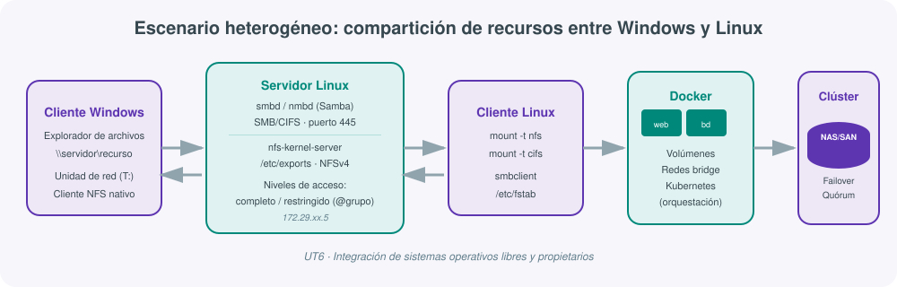
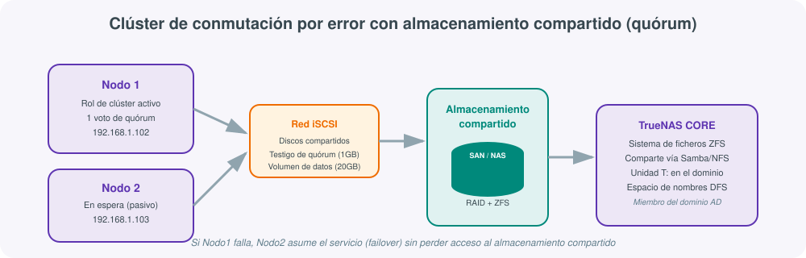
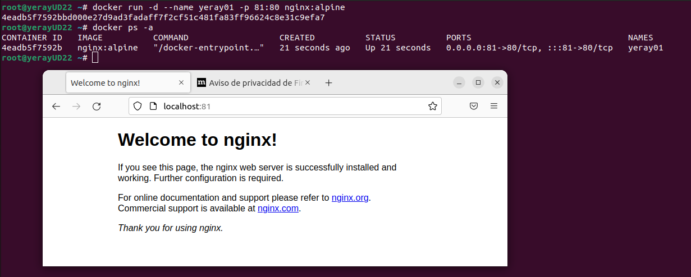
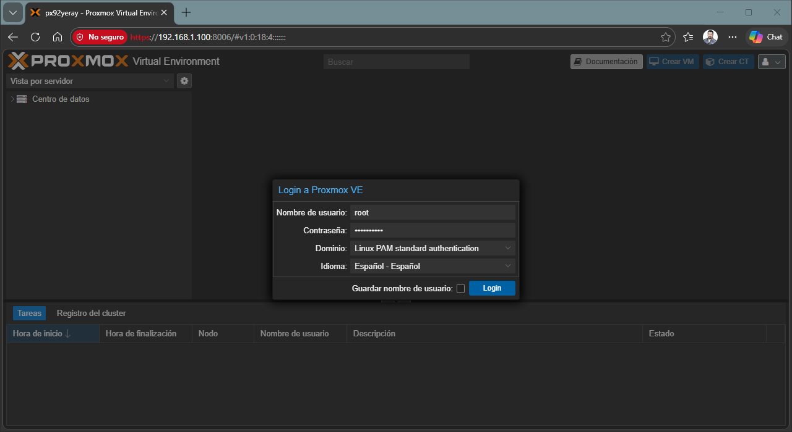

# **🔗 UT06 · Integración de sistemas**



## Resultado de aprendizaje y criterios de evaluación

**RA6.** Integra sistemas operativos libres y propietarios, justificando y garantizando su interoperabilidad.

Criterios de evaluación:

a) Se ha identificado la necesidad de compartir recursos en red entre diferentes sistemas operativos.
b) Se han establecido niveles de seguridad para controlar el acceso del cliente a los recursos compartidos en red.
c) Se ha comprobado la conectividad de la red en un escenario heterogéneo.
d) Se ha descrito la funcionalidad de los servicios que permiten compartir recursos en red.
e) Se han instalado y configurado servicios para compartir recursos en red.
f) Se ha comprobado el funcionamiento de los servicios instalados.
g) Se ha trabajado en grupo para acceder a sistemas de archivos e impresoras en red desde equipos con diferentes sistemas operativos.
h) Se ha documentado la configuración de los servicios instalados.

## 1. Escenarios heterogéneos: por qué hay que integrar sistemas distintos

Un escenario heterogéneo es aquel en el que conviven, en la misma red, equipos con sistemas operativos y arquitecturas diferentes: servidores Linux, estaciones Windows, dispositivos móviles, sistemas embebidos. Esta heterogeneidad no es un accidente pasajero sino una condición estructural del sector, impulsada por tres factores (criterio a: identificar la necesidad de compartir recursos entre sistemas distintos):

- **Diversidad tecnológica.** Cada organización elige el sistema operativo que mejor se adapta a cada tarea: Windows para ofimática y Active Directory, Linux para servidores y contenedores, macOS para diseño, sistemas embebidos para IoT.
- **Movilidad y dispositivos conectados.** Portátiles, tablets y móviles ejecutan sistemas operativos distintos entre sí y necesitan acceder a los mismos recursos compartidos que un puesto de escritorio.
- **Computación en la nube.** Los proveedores cloud operan sobre infraestructuras heterogéneas, y garantizar la interoperabilidad entre sistemas operativos es requisito para que la migración a la nube sea transparente para el usuario.

Gestionar estos escenarios exige que un administrador de sistemas domine mecanismos de intercambio de archivos y recursos que funcionen **independientemente** del sistema operativo de origen y de destino. Los dos protagonistas de esta unidad son **NFS** (nativo de Unix/Linux) y **Samba** (implementación libre del protocolo de Windows), acompañados por el paradigma más reciente de compartición de entornos completos: los **contenedores**.

!!! note "Sin nada especial que instalar"
    Para trabajar con Samba y NFS en un entorno **Windows** no es necesario instalar software de terceros: basta con activar las características correspondientes desde *Panel de control → Programas y características → Activar o desactivar las características de Windows* (cliente NFS) o simplemente acceder por red (SMB, integrado de fábrica). En **Linux**, en cambio, sí hay que instalar los paquetes del servicio: `sudo apt-get install samba` o `sudo apt-get install nfs-kernel-server`, y editar los ficheros de configuración correspondientes (`/etc/samba/smb.conf`, `/etc/exports`).

## 2. NFS: Network File System

**NFS** es el protocolo de sistema de archivos en red estándar en el mundo Unix/Linux. Su objetivo es que varios equipos de una red local accedan a archivos y directorios compartidos **como si fuesen locales**, centralizando el almacenamiento y reduciendo la necesidad de espacio en los clientes. La arquitectura se divide siempre en dos papeles (criterio d: describir la funcionalidad del servicio):

- Un **servidor** NFS, que almacena físicamente los datos y los exporta.
- Uno o varios **clientes**, cuyos usuarios montan esos directorios exportados como si fueran una unidad local más.

NFS está incluido de serie en la práctica totalidad de distribuciones Linux y en macOS. Windows 10/11 permite trabajar de forma nativa con NFS en sus ediciones Pro y Enterprise.

### Ventajas de NFS

| Ventaja | Explicación |
|---|---|
| Acceso centralizado | Se evita la duplicidad de la información en distintos puntos de la red. |
| Integridad de datos | Las operaciones de escritura deben concluir antes de continuar, incluida la actualización de directorios. |
| Perfiles de usuario centralizados | El directorio `/home` puede residir en el servidor, permitiendo acceder a los datos desde cualquier punto de la red. |
| Compartición de dispositivos completos | Unidades ópticas, discos externos o memorias flash pueden compartirse enteras, reduciendo costes. |
| Seguridad (desde NFSv4) | Incorpora Kerberos y listas de control de acceso (ACL). |
| Rendimiento y escalabilidad | Soporta grandes volúmenes de datos y acceso concurrente de múltiples usuarios. |

### Configuración del servidor NFS (Ubuntu Server)

El proceso de instalación y puesta en marcha sigue siempre los mismos pasos (criterio e: instalar y configurar servicios para compartir recursos en red):

1. **Instalar el paquete** `nfs-kernel-server`, que arrastra como dependencias `nfs-common` (programas cliente/servidor) y `rpcbind` (esencial para que clientes y servidores se localicen en un escenario heterogéneo).
2. **Crear la carpeta a compartir** y ajustar sus permisos y propietarios para que los clientes no tengan problemas de acceso.
3. **Editar `/etc/exports`**, el fichero donde se declara qué carpetas se exportan, con qué clientes y con qué opciones. Sintaxis general:

```
ruta cliente_1(opciones) cliente_2(opciones) ...
```

El cliente puede indicarse mediante IP, nombre DNS, comodines (`*`, `?`), rangos de IP o *netgroups* (si existe un servidor NIS).

| Opción | Descripción |
|---|---|
| `rw` | Permite lectura y escritura en el volumen NFS. |
| `ro` | Permite solo lectura. |
| `sync` | No responde a peticiones antes de escribir los cambios pendientes en disco (predeterminada). |
| `async` | Mejora el rendimiento a costa de arriesgar corrupción de archivos. |
| `subtree_check` / `no_subtree_check` | Verifica (o no) los permisos de los directorios superiores. |
| `root_squash` | Trata al usuario root remoto como un usuario más, evitando que mantenga privilegios (predeterminada). |
| `no_root_squash` | Deshabilita el `root_squash` anterior. |

4. **Reiniciar el servicio NFS** cada vez que se modifique `/etc/exports` para que los cambios surtan efecto.
5. **Verificar** creando un archivo de prueba en la carpeta compartida y comprobando que es accesible desde los clientes (criterio f: comprobar el funcionamiento de los servicios instalados).

### Clientes NFS

**Ubuntu Desktop**: instalar `nfs-common` y `rpcbind`, crear un punto de montaje local, montar con `mount` y comprobar con `df` y `mount`. Para que el montaje sea persistente entre reinicios se añade la entrada correspondiente en `/etc/fstab` (*file systems table*), donde se declaran los volúmenes que se montan automáticamente al arrancar.

**Windows 11**: puede activarse el cliente NFS nativo desde las características de Windows. El acceso puntual se realiza abriendo el explorador de archivos y escribiendo `\\IP-del-servidor` en la barra de direcciones. Para automatizar el montaje al inicio se puede crear un script en la carpeta especial **Inicio** (accesible con `Win + R` → `shell:startup`) que ejecute el montaje con la opción `-o anon` (usuario anónimo) y asigne una letra de unidad.

## 3. Samba: interoperabilidad con el mundo Windows

**Samba** es la implementación libre por excelencia del protocolo **SMB/CIFS** de Microsoft, y resuelve el problema inverso a NFS: permite que sistemas Unix/Linux compartan archivos e impresoras con sistemas Windows y viceversa, de forma transparente para el usuario final.

| Protocolo | Descripción |
|---|---|
| **SMB** (Server Message Block) | Conjunto de reglas de comunicación para compartir archivos, impresoras y otros recursos en red; desarrollado originalmente por IBM y mejorado por Microsoft. |
| **CIFS** (Common Internet File System) | Evolución de SMB con autenticación de usuarios y acceso seguro a recursos a través de Internet. |

### Componentes de Samba

| Herramienta | Función |
|---|---|
| `smbd` | Demonio del servidor de archivos: gestiona los recursos compartidos y autentica usuarios. |
| `nmbd` | Servidor de nombres NetBIOS (resolución de nombres, similar a un servidor WINS). |
| `smbclient` | Cliente de línea de comandos, similar a un cliente FTP, para acceder a recursos compartidos remotos. |
| `mount.cifs` | Permite montar recursos CIFS como si fueran un sistema de archivos local en Linux. |
| Winbind | Integra Samba con servicios de nombres como Active Directory. |

| Comando | Descripción |
|---|---|
| `sudo apt-get install samba` | Instala el servidor Samba. |
| `smbstatus` | Muestra el estado del servidor de archivos y de nombres. |
| `testparm` | Verifica que `smb.conf` no tenga errores de sintaxis. |
| `pdbedit -w -L` | Lista los usuarios dados de alta en Samba. |
| `smbclient //servidor/recurso -U usuario` | Accede a un recurso compartido desde línea de comandos. |
| `smbtar` | Realiza copias de seguridad de recursos Samba. |

### Niveles de seguridad de acceso (criterio b)

El fichero `/etc/samba/smb.conf` se organiza en secciones entre corchetes (`[global]` para parámetros generales, `[printers]` para impresoras, `[homes]` para compartir automáticamente los directorios personales). Para compartir una carpeta nueva se crea una sección con el nombre del recurso. Existen, en la práctica, dos niveles de seguridad de acceso claramente diferenciados:

=== "Acceso completo (público)"

    Cualquier usuario, incluidos invitados, puede acceder al recurso.

    ```ini
    [compartir]
       path = /home/compartir
       browseable = yes
       guest ok = yes
       writable = yes
       create mode = 0777
       directory mode = 0777
    ```

=== "Acceso restringido (por grupo)"

    Solo los miembros de un grupo determinado, con usuario y contraseña, pueden acceder.

    ```ini
    [restringido]
       path = /home/restringido
       browseable = yes
       guest ok = no
       valid users = @restringido
       create mode = 0770
       directory mode = 0770
       writable = yes
    ```

| Parámetro | Comentario |
|---|---|
| `browseable` | Indica si el recurso es visible al explorar la red. |
| `guest ok` | Permite (o no) el acceso a usuarios anónimos. |
| `valid users` | Lista de usuarios (o `@grupo`) con permiso de acceso. |
| `read only` / `writable` | Controla si el recurso admite escritura. |
| `force user` / `force group` | Fuerza el propietario de los ficheros creados. |

Para dar de alta un usuario Samba con acceso restringido, primero debe existir como usuario del sistema (`useradd`), y después se registra en la base de datos de Samba con `smbpasswd -a usuario`, añadiéndolo al grupo correspondiente (`usermod -aG restringido usuario`).

!!! warning "Comprobar siempre antes de reiniciar"
    Antes de reiniciar el servicio tras editar `smb.conf`, es imprescindible ejecutar `testparm`: un error de sintaxis en el fichero puede impedir que el servicio arranque y dejar sin acceso a todos los clientes.

### Acceso desde los clientes

- **Windows**: se accede escribiendo la IP del servidor en el explorador de archivos (`\\IP`), introduciendo usuario y contraseña si el recurso es restringido.
- **Linux (línea de comandos)**: `smbclient //servidor/recurso --user=usuario`, con un funcionamiento similar a un cliente FTP (`put`, `get`, `ls`, `cd`, `quit`).
- **Linux (gráfico)**: con el paquete `cifs-utils` se puede montar el recurso en una carpeta local (`mount -t cifs`), o acceder desde Nautilus escribiendo `smb://IP-del-servidor` en la barra de direcciones (`Ctrl+L`).

## 4. Comprobación de la conectividad en un escenario heterogéneo

Antes de instalar cualquier servicio de compartición hay que verificar que la red permite la comunicación entre los distintos sistemas operativos (criterio c). Las comprobaciones básicas, válidas en cualquier escenario heterogéneo, son:

| Comprobación | Windows | Linux |
|---|---|---|
| Configuración IP | `ipconfig /all` | `ip a` |
| Alcance (ping) | `ping IP_destino` | `ping IP_destino` |
| Resolución de nombres | `nslookup host` | `nslookup host` / `dig` |
| Puertos abiertos | `Test-NetConnection -Port 445` | `nc -zv IP 445` |
| Recursos visibles en red | Explorador → Red | `smbclient -L //servidor` |

| Servicio | Puerto | Protocolo |
|---|---|---|
| SMB/CIFS (Samba) | 445 (y 139 legacy) | TCP |
| NFS | 2049 | TCP/UDP |
| rpcbind (NFS) | 111 | TCP/UDP |
| SSH (administración remota) | 22 | TCP |

!!! tip "Trabajo en grupo entre sistemas operativos distintos"
    El criterio (g) de esta unidad pide expresamente **trabajar en grupo** para acceder a sistemas de archivos e impresoras en red desde equipos con sistemas operativos diferentes. En la práctica de la unidad, un compañero con Windows y otro con Ubuntu deben comprobar de forma conjunta el acceso al mismo recurso NFS y Samba, documentando el proceso desde ambos puntos de vista.

## 5. Clustering: agrupar equipos para ganar disponibilidad

Un **clúster** es un conjunto de equipos (nodos) unidos mediante hardware y software para comportarse como un único sistema, con el objetivo de mejorar disponibilidad, rendimiento y tolerancia a fallos.

| Tipo de clúster | Objetivo |
|---|---|
| **Alta disponibilidad (HA)** | Garantizar que el servicio sigue disponible aunque falle un nodo (bases de datos críticas). |
| **Alto rendimiento (HPC)** | Resolver cálculos complejos mediante paralelismo (simulaciones científicas). |
| **Alta eficiencia (HT)** | Maximizar el número de tareas independientes procesadas por unidad de tiempo. |
| **Balanceo de carga** | Repartir peticiones entre nodos evitando sobrecargar uno solo (servidores web). |
| **Almacenamiento** | Gestionar grandes volúmenes de datos con redundancia (NAS, SAN). |

### Componentes de un clúster

- **Nodos**: uno o varios nodos maestros (coordinan tareas, asignan recursos) y nodos de trabajo (*workers*) que ejecutan las tareas asignadas.
- **Red de interconexión** de alta velocidad y baja latencia entre nodos.
- **Almacenamiento compartido**, mediante sistemas de archivos distribuidos (NFS, Ceph, Lustre) o SAN/NAS.
- **Gestor de trabajos** que asigna y prioriza tareas (Slurm, Apache YARN).
- **Herramientas de monitorización** (Nagios, Prometheus) y **fuente de alimentación redundante** (SAI).

### Quórum: evitar el "cerebro dividido"

Cuando los nodos de un clúster pierden la comunicación entre sí, cada uno puede creer que el otro ha fallado y auto-asignarse como principal, generando una situación de **cerebro dividido** (*split brain*) con riesgo de pérdida de datos. El **quórum** resuelve este problema mediante un sistema de votación:

| Modelo de quórum | Aplicable a |
|---|---|
| Mayoría de nodos | Número impar de nodos: cada uno aporta un voto. |
| Mayoría de nodos y disco (testigo) | Número par de nodos: un disco compartido aporta el voto de desempate. |
| Mayoría de recurso compartido de archivos y nodos | Igual que el anterior, sustituyendo el disco por un recurso de archivos. |
| Sin mayoría (solo disco) | El disco compartido es suficiente para formar el quórum. |



### Clúster de conmutación por error (failover)

Un clúster de conmutación por error es un grupo de servidores independientes que trabajan juntos para aumentar la disponibilidad de un rol: si un nodo falla, otro asume el servicio automáticamente (**conmutación por error**). Windows Server implementa, además, **Volúmenes compartidos de clúster (CSV)**, un espacio de nombres uniforme que los roles en clúster usan para acceder al almacenamiento compartido de todos los nodos con una interrupción mínima del servicio.

El proceso típico de despliegue en Windows Server incluye: promover un controlador de dominio, instalar el rol de **servidor de destino iSCSI** para crear los discos compartidos (uno pequeño para el quórum, otro mayor para los datos), unir los nodos al dominio y asociarles esos discos, y finalmente validar la configuración y crear el clúster desde el asistente de *Failover Cluster Manager*.

## 6. Almacenamiento en red: DAS, NAS, SAN y sistemas de archivos distribuidos

| Modelo | Conexión | Ventaja | Desventaja |
|---|---|---|---|
| **DAS** (Direct Attached Storage) | Directa al servidor (SATA, SAS, USB) | Más barato, sin cuello de botella de red | Si el servidor falla, los datos no están disponibles |
| **NAS** (Network Attached Storage) | Red LAN, protocolos NFS/CIFS/FTP | Balanceo de carga y tolerancia a fallos a bajo coste | El tráfico comparte la LAN de los usuarios |
| **SAN** (Storage Area Network) | Red dedicada de alta velocidad (iSCSI, fibra) | Los discos siguen disponibles aunque falle un servidor; no satura la LAN | Mayor coste y complejidad de despliegue |

**iSCSI** (*Internet SCSI*) permite presentar un dispositivo de almacenamiento remoto como si fuera un disco local a través de una red IP convencional, mediante un iniciador (*initiator*) en el cliente y un destino (*target*) en el servidor de almacenamiento. Es la tecnología habitual para proporcionar discos compartidos a los nodos de un clúster.

Los **sistemas de archivos distribuidos (DFS)** permiten gestionar archivos de forma distribuida entre varios nodos de la red, ofreciendo una vista unificada de las carpetas compartidas independientemente de dónde residan físicamente. El rol DFS de Windows Server aporta:

- **Namespaces**: espacios de nombres lógicos que agrupan recursos de varios servidores bajo una única ruta.
- **Replicación de datos** entre servidores, mejorando disponibilidad y redundancia.
- **Consistencia de datos** entre las réplicas del espacio de nombres.

!!! note "TrueNAS CORE"
    TrueNAS CORE (antes FreeNAS) es un sistema operativo de almacenamiento libre basado en el sistema de archivos **ZFS**, que aporta integridad de datos, instantáneas eficientes y compresión. Permite almacenamiento unificado (archivos, bloques y objetos), alta disponibilidad y una interfaz web intuitiva, e integra sin problemas con Samba y NFS para exponer sus recursos a un dominio Windows o a clientes Linux.

## 7. Contenedores: compartir el mismo entorno de ejecución

Un **contenedor** es una unidad ligera y portátil que empaqueta una aplicación junto con todas sus dependencias (librerías, binarios, configuración) en un entorno aislado, compartiendo el núcleo del sistema operativo anfitrión en lugar de virtualizar hardware completo, como haría una máquina virtual. Esta diferencia de nivel de virtualización es la que hace que los contenedores arranquen casi al instante y consuman muchos menos recursos.

| | Máquina virtual | Contenedor |
|---|---|---|
| Virtualización | Hardware completo, SO propio por instancia | A nivel de sistema operativo, núcleo compartido |
| Arranque | Minutos | Segundos |
| Peso | GB | MB |
| Aislamiento | Muy alto | Alto, pero comparte el kernel del host |

Los contenedores resuelven el clásico problema de "en mi máquina funciona": al empaquetar la aplicación con sus dependencias exactas, el mismo contenedor se ejecuta igual en el portátil de un desarrollador, en un servidor de pruebas o en producción.

### Docker

**Docker**, nacido en 2013, es la plataforma de contenedores más extendida. Se apoya en cuatro objetos principales:

| Objeto | Descripción |
|---|---|
| **Imagen** | Plantilla de solo lectura, construida por capas, con todo lo necesario para ejecutar la aplicación. |
| **Contenedor** | Instancia en ejecución de una imagen; se puede crear, iniciar, detener o eliminar. |
| **Volumen** | Mecanismo de persistencia de datos más allá del ciclo de vida del contenedor. |
| **Red** | Define cómo se comunican los contenedores entre sí y con el exterior (bridge, host, overlay, macvlan, none). |

| Comando | Descripción |
|---|---|
| `docker run -d --name web -p 81:80 nginx` | Crea y ejecuta un contenedor en segundo plano, mapeando el puerto 81 del host al 80 del contenedor. |
| `docker ps` / `docker ps -a` | Lista contenedores en ejecución / todos, incluidos los detenidos. |
| `docker images` | Lista las imágenes descargadas localmente. |
| `docker build -t imagen .` | Construye una imagen a partir de un `Dockerfile`. |
| `docker exec -it contenedor bash` | Abre una shell interactiva dentro de un contenedor en marcha. |
| `docker volume create` / `docker network create` | Crea un volumen o una red gestionados por Docker. |



Un `Dockerfile` define, instrucción a instrucción, cómo se construye una imagen personalizada por capas: `FROM` (imagen base, obligatoria y primera instrucción), `RUN` (ejecuta un comando y genera una capa), `COPY`/`ADD` (copian archivos al contenedor), `EXPOSE` (declara un puerto), `ENV` (variables de entorno), `VOLUME` (declara un volumen) y `CMD`/`ENTRYPOINT` (comando por defecto al arrancar).

!!! example "Ejemplo mínimo: nginx sobre Alpine"
    ```bash
    docker run -d --name web01 -p 81:80 nginx:alpine
    docker ps
    docker exec -it web01 sh
    curl http://localhost:81
    ```
    Alpine Linux es una distribución pensada para minimizar el tamaño de la imagen (apenas unos MB), ideal para contenedores donde cada capa adicional cuenta.

### Podman: la alternativa sin *daemon*

**Podman** ofrece una interfaz de comandos compatible con Docker pero sin depender de un demonio centralizado en segundo plano, lo que reduce la superficie de ataque y permite ejecutar contenedores en modo **rootless** (sin privilegios de administrador). Es la opción por defecto en Red Hat Enterprise Linux y distribuciones derivadas.

## 8. Kubernetes: orquestación de contenedores

Cuando el número de contenedores crece y hay que mantenerlos disponibles, escalarlos y actualizarlos sin interrupciones, aparece la necesidad de un **orquestador**. **Kubernetes** (K8s) es el orquestador de contenedores más popular, originado en Google en 2014 y cedido después a la Cloud Native Compute Foundation (CNCF).

| Componente | Función |
|---|---|
| **Cluster** | Conjunto de nodos gestionados por Kubernetes. |
| **Node** | Máquina física o virtual donde se ejecutan los pods. |
| **Pod** | Unidad mínima de despliegue: uno o varios contenedores que comparten red y almacenamiento. |
| **Deployment** | Declara cuántas réplicas de un pod deben existir y qué imagen usar; Kubernetes mantiene ese estado. |
| **Service** | Expone un conjunto de pods con una IP y nombre DNS estables (ClusterIP, NodePort, LoadBalancer). |
| **Namespace** | Espacio virtual para aislar recursos (desarrollo, pruebas, producción) dentro de un mismo clúster. |

| Comando `kubectl` | Descripción |
|---|---|
| `kubectl get pods` | Lista los pods del clúster. |
| `kubectl apply -f manifiesto.yaml` | Aplica un manifiesto para crear o actualizar recursos. |
| `kubectl scale deployment app --replicas=3` | Cambia el número de réplicas de un deployment. |
| `kubectl logs pod` | Muestra los registros de un contenedor. |
| `kubectl exec -it pod -- sh` | Ejecuta un comando dentro de un contenedor del pod. |

Un **manifiesto** es un fichero YAML declarativo: se describe el estado deseado (por ejemplo, "3 réplicas de esta imagen") y Kubernetes se encarga de mantenerlo, sustituyendo pods que fallan y repartiendo la carga entre nodos.

```yaml
apiVersion: apps/v1
kind: Deployment
metadata:
  name: web-app
spec:
  replicas: 3
  selector:
    matchLabels:
      app: web
  template:
    metadata:
      labels:
        app: web
    spec:
      containers:
        - name: web
          image: nginx:alpine
          ports:
            - containerPort: 80
```

**Minikube** permite crear un clúster de Kubernetes de un solo nodo en un entorno local, ideal para aprender y probar manifiestos antes de desplegar en un clúster real, con un *dashboard* web incluido para visualizar los recursos gráficamente.

## 9. Proxmox VE: virtualización y contenedores en un mismo entorno

**Proxmox Virtual Environment** es una plataforma de virtualización libre, basada en Debian, que combina en una sola interfaz web dos tecnologías: **contenedores LXC** y **máquinas virtuales KVM**. Ofrece gestión centralizada, creación de clústeres para alta disponibilidad, almacenamiento integrado (local, NFS, CIFS, iSCSI) y copias de seguridad de VMs y contenedores.



Tras la instalación, Proxmox indica en consola la URL de acceso (`https://IP:8006`). El árbol del **Centro de datos**, a la izquierda de la interfaz, agrupa el nodo con sus almacenamientos (`local`, `local-lvm`, almacenamiento en red); en el centro se muestra el consumo de CPU, memoria y disco, y en la parte inferior el registro de tareas ejecutadas.

| Comando `pvecm` | Descripción |
|---|---|
| `pvecm create <nombre>` | Crea un nuevo clúster Proxmox. |
| `pvecm add <nodo>` | Añade un nodo al clúster. |
| `pvecm nodes` | Lista los nodos del clúster y su estado. |
| `pvecm status` | Muestra el estado detallado del clúster. |

| Formato de disco | Plataforma de origen | Compatible en Proxmox |
|---|---|---|
| RAW | Genérico | Sí |
| QCOW2 | QEMU (nativo de Proxmox) | Sí, con instantáneas y compresión |
| VMDK | VMware | Sí (migración) |
| VHD/VHDX | Hyper-V | Sí (migración) |
| VDI | VirtualBox | No, requiere conversión previa |

## 10. Documentación de los servicios instalados

El último criterio de evaluación de esta unidad (h) exige documentar la configuración de los servicios instalados. En un escenario de integración de sistemas, un buen registro debe incluir, como mínimo:

- Direcciones IP y nombres de host de servidor y clientes.
- Rutas de las carpetas compartidas y opciones de exportación (NFS) o de la sección `smb.conf` (Samba).
- Usuarios y grupos creados, con el nivel de acceso asignado a cada recurso.
- Capturas de las comprobaciones de conectividad y del acceso efectivo desde cada sistema operativo cliente.
- Comandos ejecutados y resultado de cada prueba, para que la configuración sea reproducible por otra persona del equipo.

!!! example "Síntesis de la unidad"
    Un centro educativo tiene un servidor Ubuntu que debe compartir dos recursos: una carpeta de material de clase, accesible por todo el alumnado desde Windows y Linux (Samba con acceso completo), y una carpeta de profesorado, restringida a un grupo concreto (Samba con `valid users = @profesorado`), además de exportar por NFS los perfiles de usuario del propio servidor para que estén disponibles en cualquier equipo Linux del aula. Todo el proceso —instalación, configuración, niveles de acceso, comprobación de conectividad y pruebas desde ambos sistemas operativos— queda documentado paso a paso, cumpliendo los ocho criterios de evaluación de la RA6.

## Para profundizar

Esta unidad recopila y reorganiza el material de clase de Administración de Sistemas Operativos sobre interoperabilidad NFS/Samba, clustering, almacenamiento en red y virtualización con contenedores (Docker, Podman, Kubernetes y Proxmox VE). El resto de enlaces de referencia, manuales oficiales y vídeos citados a lo largo del temario está recopilado en la página de [Recursos](99-recursos.md).
