# **💠 Configuraciones básicas**

Durante el curso se van a trabajar con diferentes máquinas virtuales estas deben tener las configuraciones básicas solicitadas y realizar una ova de las mismas despues de configurarlas, para cada supuesto se harán clonaciones y se trabajará sobre estas. 

    Los sistemas operativos principales son:
      px92 - Proxmox 9.2
      ud26 - Ubuntu Desktop 26.04 LTS 
      us26 - Ubuntu Server  26.04 LTS
      wd11 - Windows Clente 11
      ws25 - Windows Server 2025

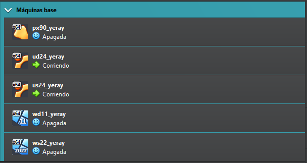

## 🛠️ Configuraciones Hardware
Las configuraciones de las máquinas dependen de los recursos que tenga el equipo real, pero para un correcto funcionamiento y evitar problema se solicitan los siguientes requisitos mínimos:

1.  Sistemas de 64-bit
2.  4GB = 4096MB de memoria RAM
3.  4 procesadores
4.  TPM para Windows
5.  Sistema EFI activado en todos.
6.  100GB de disco duro
7. Habilitar en General → Avanzado el portapapeles y el arrastrar y soltar.
 
|  |  |
|---|---|
|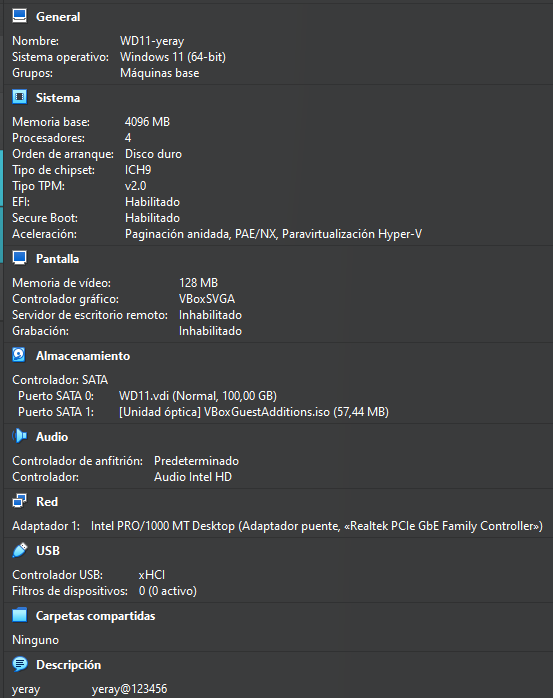 | 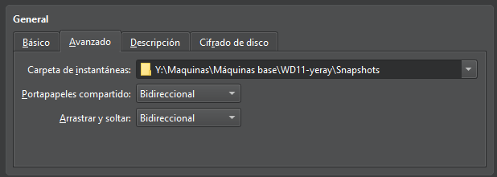|

## 💻 Configuraciones Software
Una vez tengamos las configuraciones hardware realizadas pasaremos a descargarnos las **imágenes iso**, de los diferentes sistemas operativos, las agregamos a la unidad óptica e iniciamos la máquina virtual siguiendo el asistente de instalación. En este apartado es importante poner como nombre de usuario el nombre de alumnado, y como nombre de equipo la clave del sistema operatico y el nombre del alumnado.

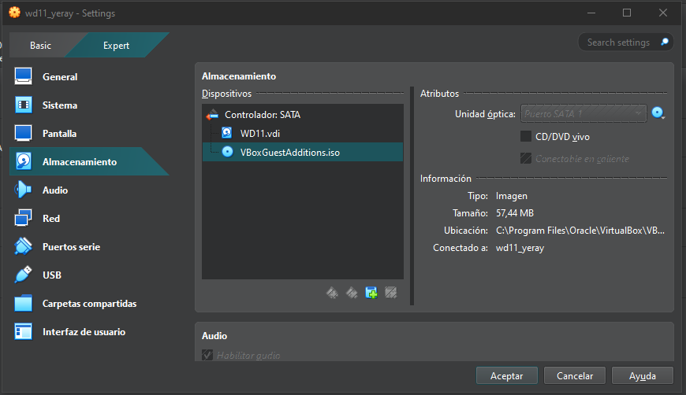  

## 💿WINDOWS
Las configuraciones básicas se basan en hacer los siguientes pasos en todas las máquinas, como ejemplo se van a realizar las mismas para un sistema operativo Windows 11:

### 1. Actualizar sistemas
Para actualizar el sistema iremos a la pestaña de configuración y en la sección de Windows Update buscaremos y actualizaremos el sistema hasta la última versión disponible. Una vez actualizado comprobaremos que nuestra versión obtenida con las teclas win + R y escribiendo winver en la pestaña de ejecutar coincide con la última del historial de versiones de nuestro sistemas el cual lo obtendremos de la información de la siguiente web oficial: https://learn.microsoft.com/es-es/windows/release-health/

|  |  |
|---|---|
|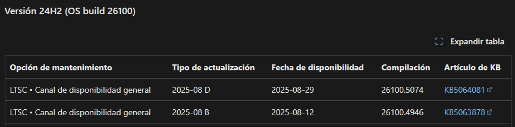 | 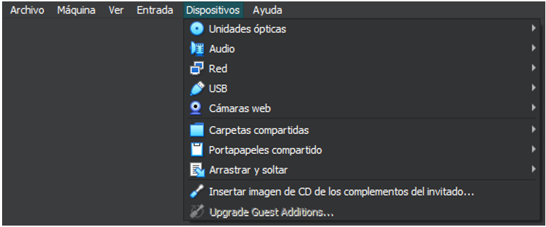|

### 2. Actualizar Guest Additions
Para la instalación de las Guestt Additions en todos los sistemas el primer paso es insertar imagen de CD de los complementos del invitado. Para ello vamos a la unidad de CD desde el sistema operativo y ejecutamos el programa y seguimos los pasos del asistente de instalación:

| | | |
|---|---|---|
| |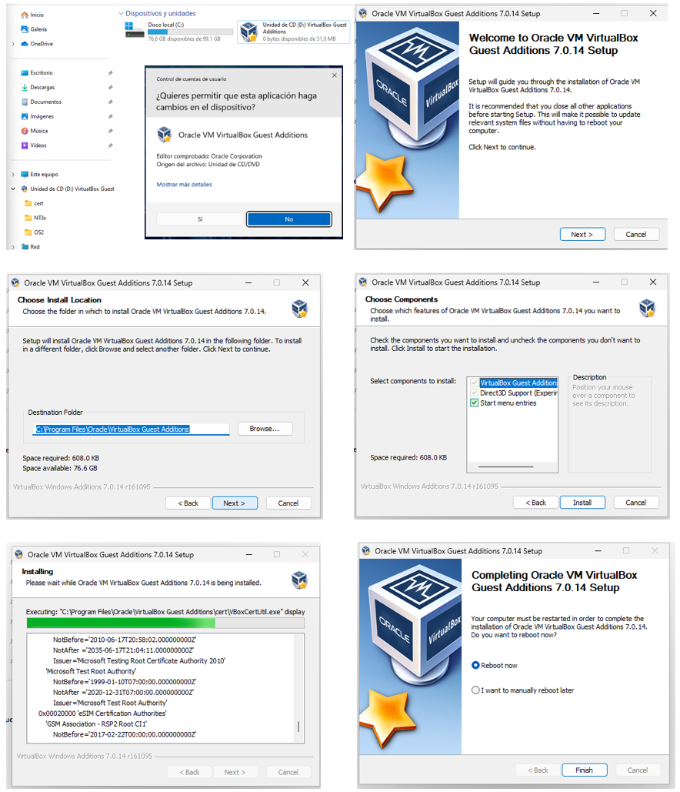 |
|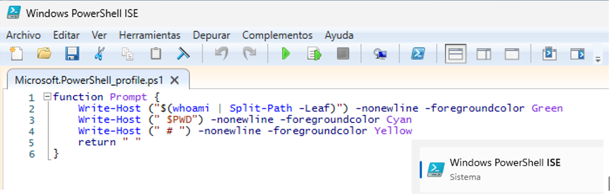 |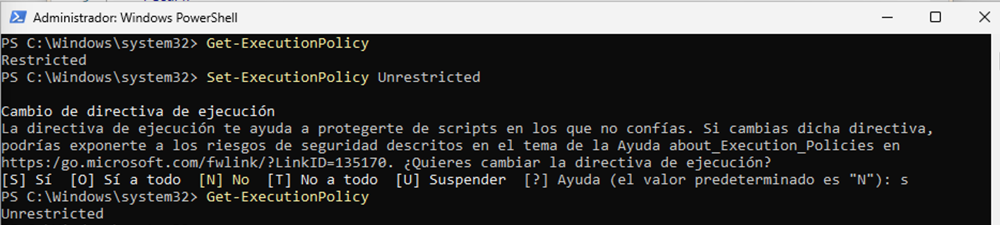 | 
|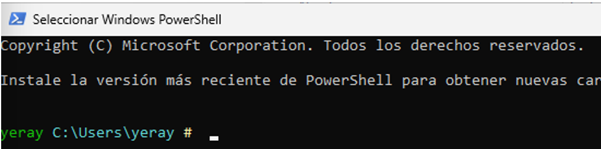 |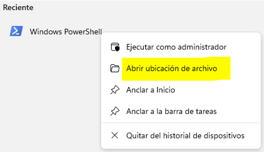 |
| |  |

### 3. Prompt en color
Para cambiar el color del **prompt** en PowerShell tenemos que hacer un pequeño script, para ello abrimos el PowerShell ISE, y creamos un archivo con el nombre "Microsoft.Powershell_profile.ps1" este se guardará en el directorio `C:\Users\user1\Documents\WindowsPowerShell\Microsoft.Powershell_profile.ps1`

>IMPORTANTE: Hay que respetar el nombre del archivo, la ruta y el código cualquier carácter incorrecto podría significar el no funcionamiento del mismo. Recordar que user1 es el nombre de vuestro usuario en el sistema

Seguido mediante Powershell como administrador cambiamos las políticas de ejecución en la máquina para que nos permita ejecutar el script: `Set-ExecutionPolicy Unrestricted` y al reiniciar PowerShell ya estaría todo correcto.

| | |
|---|---|
| | |
|! | |

###  4. Alias y atajos
Para la creación del atajo de teclas iremos a la ruta del ejecutable de PowerShell `C:\Users\yeray\AppData\Roaming\Microsoft\Windows\StartMenu\Programs\Windows PowerShell` , botón secundario propiedades del archivo, pestaña **Acceso directo** y tecla de método abreviado y pulsamos las teclas que queremos que pasen hacer los atajos para abrir dicho programa. En este caso se ha configurado para que el programa se ejecute como administrador ya que será el que frecuentemente usemos.

| | | |
|---|---|---|
| | | |

## 📀LINUX
Los siguientes 5 pasos de configuraciones básicas se han de hacer en todas las máquinas base de Linux en este caso se muestra un ejemplo en Ubuntu server al no tener interfaz gráfica y ser la que presenta mayores dificultades.

### 1. Actualizar sistemas

Para actualizar los equipos de Ubuntu debemos de ejecutar el siguiente comando en modo superusuario: `sudo apt update && apt upgrade -y && apt autoremove` a veces la propia terminal nos solicitara algunos comandos más en sus mensajes, deberemos realizarlo hasta que al final de la captura se muestran **cuatro 0** que indican que no faltan paquetes por actualizar ni instalar.

### 2. Actualizar Guest Additions

Para la instalación de las Guestt Additions en todos los sistemas el primer paso es insertar imagen de CD de los complementos del invitado. A continuación, creamos una carpeta (guest) montamos los directorios del CD y comprobamos su contenido, en él nos encontramos varios programas ejecutables usamos el comando sh para ejecutar las Guestt Additions de Linux y se instalen. A veces nos muestra un error porque necesitamos el paquete bzip2 para poder descomprimir el contenido de las Guest Additions, lo instalamos con `apt bzip2` y después ejecutamos el script.

| | |
|---|---|
| | |

### 3. Prompt en color
Para cambiar el prompt de color debemos de hacer las siguientes instrucciones por **cada usuario** del sistema, en este manual se hará solo para el usuario administrador del root:
1. Iniciamos sesión en el usuario y vamos a su directorio personal con el comando `cd ~`, a continuación, modificamos el archivo oculto bashrc con el siguiente comando: `nano .bashrc`
2. Debemos hacer dos cambios:
   2.1. Eliminar el comentario, es decir eliminar el *#* que aparece delante de la línea *force_color_prompt=yes*
   2.2. Cambiar el valor de la variable PS1 que tendrá que cambiarse por lo siguiente: `PS1='${debian_chroot:+($debian_chroot)}\[\033[01;32m\]\u@\h\[\033[00m\]:\[\033[01;36m\]\w\[\033[00m\]\$ '`
3. Comprobamos reiniciando sesión en los usuario y mostrando que sale el prompt en los colores configurados.

| | |
|---|---|
| | |

### 4. Alias y atajos
En este paso crearemos un alias que nos va a facilitar el trabajo durante el resto del curso y será el alias de `act`, para ello en el archivo anterior recordar que esto hay que hacerlo en cada uno de los usuarios del sistema, debemos añadir una línea por cada alias. Una vez abierto el archivo con `nano .bashrc` podemos editar, buscamos la sección de los alias y añadimos la última línea los alias que necesitemos.

| | |
|---|---|
| | |

### 5. Color de los directorios

En Linux cuando listamos los diferentes elementos tienes una serie de colores predeterminados que vienen preconfigurados en la variable ``$LS_COLORS`` en esta sección lo que haremos será cambiar el código de los directorios ya que el azul como se muestra en la captura es un color con dificultades de legibilidad en fondo negro. Este procedimiento se debe hacer para cada usuario del sistema:
1. Crear el archivo oculto ``.dircolors`` formateado.
2. Editar archivo con el nano y buscar donde esta el color de los directorios (variable dir) y cambiar de **34(azul)** a **32(Verde)** como se muestra en la captura.
3. Reiniciamos la sesión del usuario y comprobamos los cambios.

| | |
|---|---|
| | |

## ☢️ Dificultades encontradas

### Usuario en Windows 11
En la configuración de Windows 11 nos solicita un correo electrónico para saltarnos este paso deberemos de mostrar la consola con ``SHIFT + F10`` y escribir el comando ``bypassnro`` para reiniciar el proceso de instalación sin pedirte cuenta de correo.

### Pantallazo negro en Ubuntu

1. En primer lugar, mirar la comprobación hardware de la máquina y comprobar el tipo de chipset:

2. En caso de que siga sin funcionar pasamos al método número dos que consiste en seguir las instrucciones del siguiente video: https://youtu.be/LKIJFn6cqVE
   
### Problemas con la tortuga.
Si las máquinas van muy lentas deberemos de comprobar si tenemos el error de la tortuga y solucionarlo a través del siguiente video. https://youtu.be/6FUJJN4K-2o