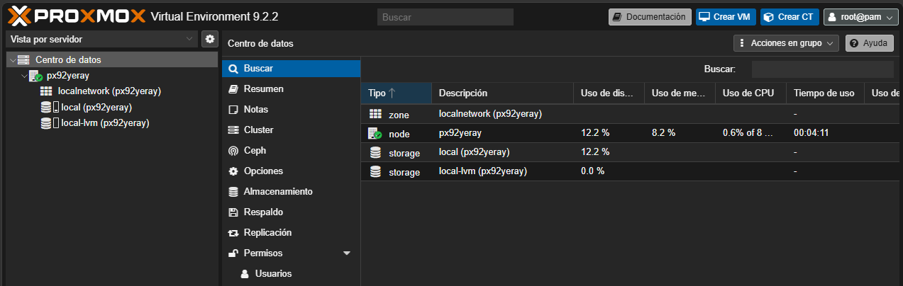
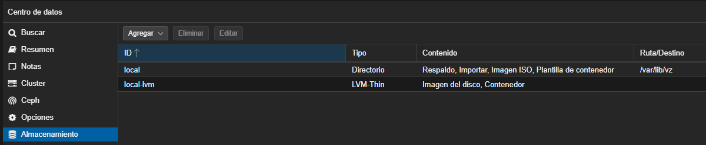
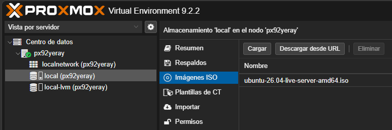

# 🖥️ Proxmox VE
> Plataforma completa de virtualización de código abierto que permite desplegar, gestionar y monitorizar fácilmente máquinas virtuales (**KVM**) y contenedores ligeros (**LXC**) desde una interfaz web intuitiva. El sistema combina cómputo, almacenamiento y redes en una única solución lista para entornos empresariales, incluyendo herramientas nativas para crear clústeres, gestionar alta disponibilidad y realizar copias de seguridad de forma centralizada.

## 1. Instalación
<iframe src="https://docs.google.com/viewer?url=https://ymorgil.github.io/systems/assets/pdf/proxmox.pdf&embedded=true" width="70%" height="700px" style="display: block; margin: 0 auto;"></iframe>

[Descargar guía de instalación](../assets/pdf/proxmox.pdf){ .md-button style="display:table;margin:0 auto;"}

## 2. Interfaz

{width="900"}

| Concepto básicos| Descripción |
|-----------|-------------|
| **PVE** | Proxmox Virtual Environment: el sistema completo. |
| **Nodo** | Servidor físico que tiene Proxmox instalado. |
| **Datacenter** | Vista global de todos los nodos del clúster. Los cambios aquí se aplican a todos los nodos. |
| **Summary** | Panel de monitorización del nodo. |
| **8006** | Puerto utilizado para el acceso web a la interfaz de Proxmox. |
| **KVM** | Máquinas virtuales completas que emulan hardware. Ideales para cualquier sistema operativo. |
| **LXC** | Contenedores ligeros basados en Linux que comparten el núcleo del host. |
| **VMID** | Número de identificación único asignado a cada máquina virtual o contenedor. |
| **Clúster** | Grupo de dos o más nodos administrados desde una única interfaz. |
| **Quórum** | Mayoría de nodos activos necesaria para que el clúster pueda tomar decisiones. |
| **HA** | Alta Disponibilidad. Permite reiniciar automáticamente servicios en otro nodo si uno falla. |
| **Almacenamiento local** | No recomendado en entornos de alta disponibilidad. Utiliza discos internos del propio nodo. |
| **Almacenamiento en red** | Recomendado. Utiliza almacenamiento compartido mediante NFS, iSCSI, Ceph, NAS, SAN, etc. |
| **PBS** | Proxmox Backup Server: herramienta para realizar copias de seguridad optimizadas. |
| **Linux Bridge (vmbr)** | Switch virtual que conecta la red física con las máquinas virtuales y contenedores. |

## 3. Almacenamiento
Es es el sistema que permite guardar todos los datos necesarios para el funcionamiento de la plataforma de virtualización. En él se almacenan las máquinas virtuales, contenedores, imágenes ISO, copias de seguridad, plantillas y otros recursos necesarios para la infraestructura. Este permite utilizar diferentes tipos de almacenamiento, tanto locales como remotos, adaptándose a las necesidades de cada entorno. Algunos ejemplos son discos locales, NFS, SMB/CIFS, iSCSI, Ceph o ZFS. Durante la instalación estándar de Proxmox suelen crearse **dos almacenamientos** principales.Aunque ambos están ubicados en el mismo servidor físico, tienen funciones diferentes.

{width="900"}

- **`local`** suele corresponder al directorio ``/var/lib/vz``. Cuando descargamos una imagen ISO de Ubuntu desde la interfaz web de Proxmox, esta se almacena aquí. Su función principal es almacenar archivos relacionados con la plataforma, como:
    - Imágenes ISO.
    - Copias de seguridad (Backups).
    - Plantillas de contenedores.
    - Fragmentos de configuración (Snippets).

- **`local-lvm`** utiliza la tecnología LVM-Thin (Logical Volume Manager Thin Provisioning).Cuando se crea una nueva máquina virtual y se le asigna un disco de 50 GB, dicho disco se almacena normalmente en `local-lvm`. Su función principal es almacenar los discos virtuales de Máquinas virtuales (**VM**) y Contenedores **LXC**. Ventajas:
    - Mejor aprovechamiento del espacio disponible.
    - Creación rápida de discos virtuales.
    - Soporte para snapshots.
    - Mayor flexibilidad en la gestión del almacenamiento.

| Característica | local | local-lvm |
|--------------|--------|-----------|
| Tipo de almacenamiento | Directorio | LVM-Thin |
| Imágenes ISO | Sí | No |
| Backups | Sí | No |
| Plantillas | Sí | No |
| Discos de VM | No (por defecto) | Sí |
| Discos de contenedores | No (por defecto) | Sí |
| Ubicación | /var/lib/vz | Volumen LVM |

> Nota "Directorio vs Volumen lógico"
    Un **directorio** organiza archivos dentro de un sistema de archivos.
    Un **volumen lógico LVM** es una entidad de almacenamiento flexible y dinámica creada dentro de un grupo de volúmenes, mucho más versátil para entornos virtualizados.

```bash
Redimensionado de volúmenes lógicos (LVM)

pvcreate /dev/sdX                               # 1. Crear volumen físico
vgextend nombre-vg /dev/sdX                     # 2. Extender el grupo de volúmenes 
lvextend -l +100%FREE /dev/ubuntu-vg/ubuntu-lv  # 3. Extender el volumen lógico
resize2fs /dev/ubuntu-vg/ubuntu-lv              # 4. Redimensionar el sistema de archivos
df -h                                           # 5. Comprobar puntos de montaje
```

## 4. Máquinas virtuales (VM)
> Una **máquina virtual (VM)** es un entorno informático que emula un ordenador completo mediante software, permitiendo instalar y ejecutar sistemas operativos de forma aislada sobre un servidor físico.

Pasos para crear e iniciar una máquina virtual en Proxmox VE:

1. En la interfaz web de Proxmox, selecciona el nodo donde deseas almacenar la ISO.
3. Haz clic en **local (nombre_del_nodo)** y accede a la pestaña **ISO Images**.
5. Pulsa el botón **Upload** y selecciona el archivo ISO desde tu equipo y espera a que finalice la transferencia.

1. Haz clic en **Create VM** en la parte superior derecha.
2. Introduce un nombre para la máquina virtual y pulsa **Next**.
3. En **OS**, selecciona la imagen ISO previamente subida.
4. Configura el tipo de sistema operativo y pulsa **Next**.
5. En **System**, deja la configuración predeterminada o ajusta los parámetros según tus necesidades.
6. Configura el tamaño del disco virtual en **Disks**.
7. Asigna la cantidad de procesadores virtuales en **CPU**.
8. Configura la memoria RAM en **Memory**.
9. Selecciona la interfaz de red en **Network**.
10. Revisa el resumen de configuración.
11. Marca la opción **Start after created** si deseas iniciar la máquina automáticamente.
12. Haz clic en **Finish** para crear la máquina virtual.

**C) Iniciar la máquina virtual**

1. Selecciona la máquina virtual creada en el panel lateral.
2. Haz clic en **Start**.
3. Accede a la consola mediante **Console**.
4. Sigue el proceso de instalación del sistema operativo desde la ISO cargada.


{width="900"}


Pasos en orden al crear una nueva VM:

1. Seleccionar **nodo**, ID y nombre
2. Seleccionar **sistema operativo** (ISO)
3. **System** — dejar por defecto
4. Añadir **disco** y elegir el almacenamiento
5. Configurar **CPU**
6. Configurar **memoria RAM**
7. Configurar **red**

## 🔗 Configurar un clúster

Un **clúster** es la composición de varios nodos trabajando en orquestación.

Desde **Datacenter → Cluster** se crea o se une a un clúster. Una vez configurado, es posible **migrar máquinas virtuales entre nodos** del clúster.

## ⚡ Alta disponibilidad (HA)

!!! warning "Requisito"
    Para configurar HA es **obligatorio** tener un clúster previo.

Si un nodo falla, las máquinas virtuales se **migran automáticamente** a otro nodo del clúster.

Configuración en **Datacenter → HA**:

1. Crear **grupos HA** formados por los nodos que participan
2. En **HA** agregar las máquinas virtuales que se quieren proteger

## 🌐 Networking — Bridge, Bonds, VLANs

Las configuraciones de red se hacen a nivel de nodo en **System → Network**.

| Tipo | Descripción |
|---|---|
| **Bridge** | Switch virtual. Permite conectar múltiples VMs con un solo adaptador físico. Se crea uno por defecto en la instalación |
| **VLAN** | Segmentos de red virtuales |
| **Bond** | Une varios adaptadores de red físicos |

### Modos de Bond destacados

**`active-backup`** — Failover/conmutación por error. El adaptador secundario asume el rol si el principal falla. Se configura el maestro en `bond-primary`.

**`LACP (802.3ad)`** — Agrega múltiples enlaces para mayor ancho de banda y tolerancia a fallos. Política de hash recomendada: `layer3+4`.

## 📋 Crear plantillas y clonar máquinas

### Paso 1 — Preparar la máquina base

```bash
# Actualizar el sistema
apt update -y && apt dist-upgrade -y

# Instalar agente QEMU
apt install qemu-guest-agent -y

# Limpiar caché de paquetes
apt-get clean
apt-get autoremove
apt-get autoclean

# Eliminar logs
find /var/log -type f -delete
rm -rf /var/log/*

# Limpiar /tmp
rm -rf /tmp/*

# Borrar historial de comandos
cat /dev/null > ~/.bash_history && history -c

# Borrar caché de usuario
rm -rf ~/.cache/*

# Eliminar claves SSH (se regenerarán al clonar)
rm /etc/ssh/ssh_host_*

# Resetear hostname
hostnamectl set-hostname plantilla

# Escribir ceros al espacio libre (compresión más eficiente)
dd if=/dev/zero of=/tmp/zeroes bs=1M
rm /tmp/zeroes
```

### Paso 2 — Convertir a plantilla

1. Clic derecho sobre la VM → **Convert to Template**
2. Añadir un **Cloud-Init Drive** para poder automatizar el despliegue

!!! tip "Convención de numeración"
    Por convención no escrita, las **plantillas** reciben números altos (ej. 900+) y las **máquinas virtuales** números bajos.

## 🪟 Plantillas de Windows

**Requisitos:**
- VM con 2 unidades de CD
- ISO de Windows
- ISO de drivers VirtIO: [pve.proxmox.com/wiki/Windows_VirtIO_Drivers](https://pve.proxmox.com/wiki/Windows_VirtIO_Drivers)
- Guía oficial Windows 10: [pve.proxmox.com/wiki/Windows_10_guest_best_practices](https://pve.proxmox.com/wiki/Windows_10_guest_best_practices)

Antes de crear la plantilla ejecutar **Sysprep** para generalizar la instalación (evita IDs duplicados al clonar):

- [Generalizar con Sysprep](https://learn.microsoft.com/es-es/windows-hardware/manufacture/desktop/sysprep--generalize--a-windows-installation?view=windows-11)
- [Opciones de línea de comandos Sysprep](https://learn.microsoft.com/es-es/windows-hardware/manufacture/desktop/sysprep-command-line-options?view=windows-11)

!!! warning "Importante"
    No añadir aplicaciones de la Microsoft Store a la imagen que se va a generalizar.

## 💾 Backup vs Snapshot

| | Backup | Snapshot |
|---|---|---|
| **Qué es** | Clon completo del disco | Estado puntual de la VM |
| **Es independiente de la VM** | ✅ Sí | ❌ No, forma parte de la VM |
| **Uso** | Recuperación ante desastre | Probar cambios y revertir rápido |

### Regla de los 3 backups

1. **Producción** — copia en el propio entorno
2. **Backup externo** — en otro medio/red fuera de la infraestructura
3. **Backup offsite** — en otra geolocalización

### Modos de Backup en Proxmox

| Modo | Descripción |
|---|---|
| **Stop** | Mayor consistencia, breve tiempo de inactividad |
| **Suspend** | Suspende la VM. No recomendado (mayor inactividad sin mejor consistencia) |
| **Snapshot** | Mínimo tiempo de inactividad. Pequeño riesgo de inconsistencia |

Documentación oficial: [pve.proxmox.com/wiki/Backup_and_Restore](https://pve.proxmox.com/wiki/Backup_and_Restore)

## 🔐 Habilitar MFA

El **MFA** (Multi-Factor Authentication) requiere dos o más formas de autenticación para acceder al sistema.

Factores disponibles:

- Contraseña
- Código SMS
- Aplicación de autenticación (TOTP)
- Token hardware (ej. **Yubico** — recomendado)
- Biometría

### Configurar TOTP en Proxmox

1. Ir a **My Settings → TFA**
2. En **Permisos → Two Factor** → **Add**
3. Seleccionar **TOTP** → escanear el QR con la app autenticadora
4. El token se renueva cada 30 segundos

!!! danger "Importante"
    Guardar siempre la **recovery key** por si se pierde el dispositivo autenticador.

## 🚚 Migrar máquinas virtuales

### Método 1 — Clonezilla (disco a disco por red)

[Descargar Clonezilla liveCD](https://clonezilla.org/downloads.php)

**En la MV origen:**
```
remote-source >> Beginner >> disk_to_remote_disk >> dhcp
>> elegir disco >> -sfsck >> -k0 >> -p choose
```

**En la MV destino:**
```
remote-dest >> dhcp >> IP_MVorigen >> restoredisk
```

Revertir el orden de arranque al disco tras finalizar.

---

### Método 2 — Disk2vhd (P2V, físico a virtual Windows)

[Descargar Disk2vhd](https://learn.microsoft.com/en-us/sysinternals/downloads/disk2vhd)

```bash
# Convertir el disco VHD a formato QCOW2
qemu-img convert -O qcow2 <disco_origen> <disco_destino.qcow2>

# Mover la imagen a la carpeta de la VM (ej. ID 101)
mv <disco_destino.qcow2> /var/lib/vz/images/101/

cd /var/lib/vz/images/101/

# Reescanear discos
qm rescan

# Editar la config de la VM y cambiar la etiqueta del disco a sata1
vi /etc/pve/qemu-server/101.conf
```

### Método 3 — dd (clonado a nivel de bloque)

Ideal para análisis forense o cuando no hay otro método.

```bash
# Ver discos disponibles
lsblk

# Clonar disco completo
sudo dd if=/dev/nvme0n1 of=lab.img bs=1M status=progress

# Renombrar como raw
mv lab.img lab.raw

# Mover a la carpeta de la VM y reescanear
mv lab.raw /var/lib/vz/images/101/
cd /var/lib/vz/images/101/
qm rescan

# Editar config y cambiar etiqueta a sata2
vi /etc/pve/qemu-server/101.conf
```


## 📚 Recursos

- [📺 Virtualización con Proxmox](https://www.youtube.com/playlist?list=PLznRNLIWBPwH5Li7Co2i57rUVhve7m_ZQ){target="_blank"}
- [Más cursos Windows Server, Linux, Hacking](https://www.nosolohacking.info/ofertas)

A por el 4